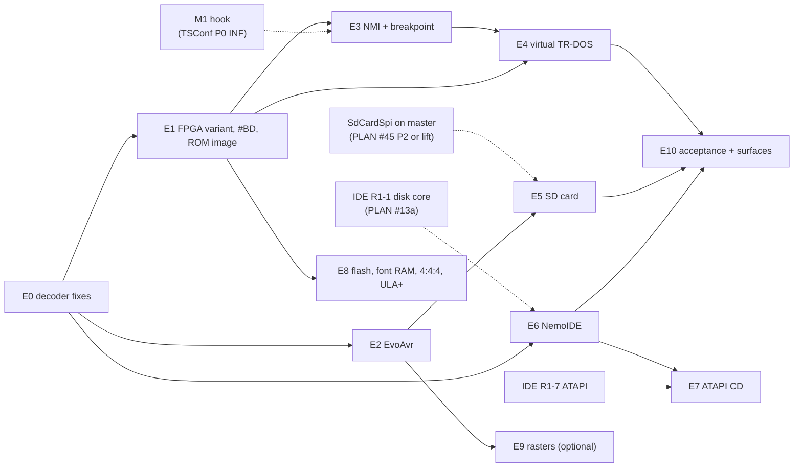

# ZX-Evo BaseConf (`ATM3`) completion — implementation plan

| | |
|---|---|
| **Date** | 2026-09-27 |
| **Status** | In progress: E0, E1, E2a done (2026-09-28); E2b (PS/2 keyboard) deferred. PLAN.md row **#55** |
| **Inputs** | [gap-analysis.md](gap-analysis.md) (what is missing), three designs: [tdd-evo-control-and-avr.md](tdd-evo-control-and-avr.md) (**CA**), [tdd-virtual-trdos.md](tdd-virtual-trdos.md) (**VT**), [tdd-storage-sd-ide-cd.md](tdd-storage-sd-ide-cd.md) (**ST**) |
| **Rule** | Test first. Each phase ends with a green `core-tests` run, zero warnings, and the phase's test IDs passing. Nothing is committed without an explicit request |

## 1. Phases

Dashed arrows are work owned by other PLAN rows. Where ATM3 gets there first, it builds that piece
exactly as the owning design specifies (the M1 hook, `HostFolderFat`), so nothing is built twice.

| Phase | Content | Gaps closed | Tests (design IDs) | Size | Blocked by |
|---|---|---|---|---|---|
| **E0** ✅ 2026-09-28 ([e0-decoder-fixes.md](e0-decoder-fixes.md)) | Decoder fixes: exact `#FE/#F6/#FC`; FDC shadow gating + Kempston joystick; Kempston mouse; Covox dispatch (ATM3; ATM710 unchanged); ~~`#xBF7` write protect~~ (moved to E8); `#EFF7` rules (no write in shadow, bit 3 RAM 0, 1 MB `#7FFD` bits, bit 7 Gluk gate); reset at 7 MHz; TTD palette/border/CMOS-latch fields; ROM page count; port-trace name + port-map rows | P-1…P-7, P-9, P-10 | CA DEC-1…DEC-8; CA TTD-E1 (palette part) | M | — |
| **E1** ✅ 2026-09-28 ([e1-fpga-variant-and-rom.md](e1-fpga-variant-and-rom.md)) | `[EVO] Fpga=trdemu\|legacy`; one `#BD`/`#BE` register table with inverted pages and indices `10-13`; `#BE` exit strobe plumbing; `#BF` read layout; official ROM image `data/rom/zxevo-fe.rom` + `ATM3=` default (TSConf keeps the current image, D2); existing real-ROM boot tests re-baselined on the new image | C-1, C-2 (plumbing), C-9, R-1 | CA BD-1, BD-2; boot tests | S–M | E0 |
| **E2a** ✅ 2026-09-28 ([e2a-evo-avr.md](e2a-evo-avr.md)) | `EvoAvr`: clock, registers A-D, battery NVRAM + EEPROM in `[EVO] NvramFile`, EEPROM window, extension window (firmware / bootloader versions, modes register; PS/2 log reads empty) | A-1, A-3, A-4, A-5, R-2 (EVO part) | CA AVR-1…AVR-6; **ERS-VER-1** (the "BaseConf / AVR Boot" lines) | S–M | E0, E1 |
| **E2b** (deferred) | PS/2 keyboard: one key event carries both the ZX code and the physical `PcKey`, journaled once; `Ps2Set2Encoder`; `EvoAvr` 16-byte log + register D modifiers; Qt fills `pcKey`. Design: [tdd-evo-control-and-avr.md](tdd-evo-control-and-avr.md) §6.1 | A-2 | PS2-1…PS2-6, NOS-KBD-1, ERS-KBD-1 | M | E2a; the in-flight TTD input-journal work (one format bump) |
| **E3** | NMI (INT-synchronized request, `NOP` entry, page `#FF`, 2-M1 exit), breakpoint, Magic button on ATM3; remove the dead `nmi_in_progress` path. Builds or reuses the M1 hook (TSConf technical-design §3.6) | C-3, C-4, P-8 | CA NMI-1…NMI-4 | M | E1; M1 hook |
| **E4** | Virtual TR-DOS trap (`#13BD`, suppression, swap, exit, `#FF` read, programmed-type DOS rule); legacy latches `#2F-#8F` | ST-5, ST-6 | VT TRD-1…TRD-12; **ERS-RD-1, ERS-RD-2** (RAM disk), ERS-FPGA-1 | M | E1, E3 |
| **E5** | SD card: `ZControllerSpi` (shared with TSConf), `SdCardSpi` over `IBlockDevice`, `SessionWriteMap`, `[ZC]` keys, AVR register C wiring; then `HostFolderFat` for SD if not yet built | ST-1, S1–S4 | ST ZC-1…ZC-5; **ERS-SD-1/2**, **ERS-MNT-1/2** (mount TRD from SD, with E4), NOS-SD-1, NOS-KBD-1 | M (+L if `HostFolderFat` lands here) | E2; `SdCardSpi` on master |
| **E6** | NemoIDE: `IdeAdapterNemo` Evo options + `EvoNemoLatch`; `[HDD]` on ATM3; images and folders from IDE rollout 1 | ST-2, ST-3, S5 | ST NIDE-1…NIDE-5, ST-TTD-1; **ERS-HDD-1**, **ERS-MNT-3** (mount TRD from HDD), NOS-HDD-1 | S–M | E0; IDE R1-1 (R1-5/R1-6 for formats/folders) |
| **E7** | ATAPI CD on the NemoIDE slave | ST-4 | **ERS-CD-1** | S | E6; IDE R1-7 |
| **E8** | `#xBF7` per-window write protect (P-5, moved from E0: needs a `Memory` write-protect path that keeps the TTD journal honest); flash writes (`Flash29F040B` from NeoGS, `FlashWrite` modes), font RAM (+ `#0EBD`; closes PLAN #53 item 2), 4:4:4 palette, ULA+ | C-5…C-8 | CA FL-1, FL-2, FNT-1, PAL-1, ULA-1; ERS-FLASH-1 | M | E1; memory-write intercept (TSConf P0) |
| **E9** *(optional)* | AVR raster selection (Pentagon / 60 Hz / 48K / 128K), INT position per raster, contention only at 3.5 MHz in 48K/128K rasters; RS-232 `#xxEF` | A-6, A-7 | new: RST-1…RST-4 (frame length and INT tact per raster; contention on/off by clock); `modes_register` reports the chosen raster | M | E2 |
| **E10** | Surfaces and acceptance: `evo` state endpoint + CLI/Lua/Python/MCP; SD/HDD/CD verbs on ATM3; TTD blobs (`AtmPaging` v-next, `EvoAvr` id); storage interim invalidation; `.recipe/machines/atm.md`; MCP `unreal://machine/zx-evo` (PLAN #14); docs moved to `docs/` | T-1…T-3 | CA TTD-E1; ST ST-TTD-1; VT TRD-12; automation smoke per surface | M | runs alongside E2-E7 |

**Recommended order:** E0 → E1 → E2a (the first user-visible win: the ERS shows the BaseConf and
AVR Boot versions) → E3 → E4 (RAM disk works) → E5 (SD, mount from SD, NedoOS) → E6 → E7 → E8 → E9.
E10 items land with the phase that adds the state.

## 2. Coordination with other PLAN rows

| Row | Shared piece | Agreement |
|---|---|---|
| #13a Profi / shared IDE (design [2026-09-25-ide-hdd-design.md](../2026-09-21-profi/2026-09-25-ide-hdd-design.md)) | ATA core, adapters, media, ATAPI, TTD interim rule, `hdd`/`cd` automation | E6/E7 are part of IDE R1-4/R1-7. The Evo latch pattern and the "no BaseConf DMA" correction are recorded in ST §1 S5 and noted in the IDE design |
| #41 TSConf ([technical-design.md](../2026-09-27-tsconf/technical-design.md)) | M1 hook, write intercept (P0), `ZControllerSpi`, `HostFolderFat`, `EvoAvr`, SD media API | Whichever machine lands first builds the piece; the other reuses it. TSConf's `TsConfSpi` becomes `ZControllerSpi` + DMA (ST S4); its Gluk extension is `EvoAvr` (CA D3). **ROM files split** (CA D2): ATM3 moves to `zxevo-fe.rom`, TSConf keeps a TS-BIOS image |
| #45 NeoGS | `SdCardSpi`, `Flash29F040B` | E5 needs `SdCardSpi` on master (merge, or lift unchanged as TSConf plans); ST S1/S3 change its storage seam to `IBlockDevice` + `SessionWriteMap` |
| #40 TTD v2 | device RAM regions | font RAM, flash contents and the SD/IDE overlays become V1 regions later; until then blob fields / invalidation rules (CA §8) |
| #53 ATM verification gaps | font RAM (item 2) | moved into E8 |
| #8 port-trace rules, #14 MCP machine resources | ATM3 rows | done in E0 / E10 |

## 3. Definition of done

- Every gap in [gap-analysis.md](gap-analysis.md) §3 is closed or explicitly deferred in PLAN.md.
- The real-firmware acceptance tests pass on the official `zxevo_fe.rom`: ERS-VER-1/2, ERS-CMOS-1,
  ERS-KBD-1, ERS-RD-1/2, ERS-MNT-1/2/3, ERS-SD-1/2, ERS-HDD-1, ERS-CD-1, ERS-FPGA-1, ERS-FLASH-1,
  NOS-SD-1, NOS-KBD-1, NOS-HDD-1.
- `ttdmodelstatecontract_test` lists every new ATM3 state; the storage interim rule is on the
  allow-list.
- WebAPI, CLI, Lua, Python and MCP expose the same `evo`, `sd`, `hdd`, `cd` data.
- The 2026-09-15 video findings are re-checked against the current FPGA tree (gap P-11).

## 4. Test fixtures

| Fixture | Source | Where |
|---|---|---|
| `zxevo-fe.rom` (current) and legacy `zxevo.rom` | `emulators/github/pentevo/rom/` prebuilt images | `data/rom/` (shipped) |
| SD image with `SD_BOOT.$C`, TRDs and `IMAGE.MNT` | generated by the test from a host folder via `HostFolderFat` + export (no binary fixture) | per-test scratch path |
| HDD image with an LBA-2 boot block and a FAT partition | generated in the test (`MemoryDisk` + a tiny FAT writer from the IDE test helpers) | scratch |
| ISO with `AUTORUN.ZX` | generated in the test (minimal ISO 9660 writer, test helper) | scratch |
| NedoOS Evo build (`sd_boot.$C` + system files) | built from `emulators/github/NedoOS` (`mkevo.bat` flags) | `testdata/machines/zxevo/nedoos/` (decision at commit time); tests skip if absent |
