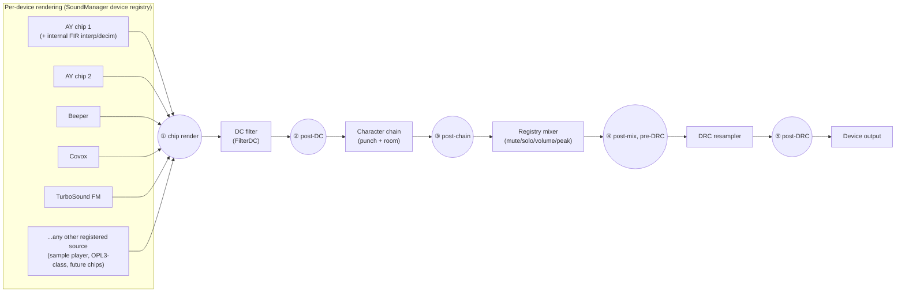
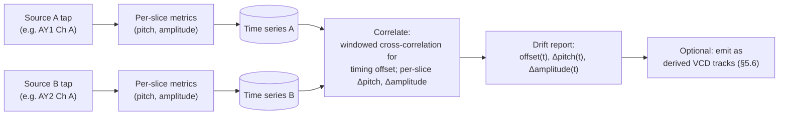
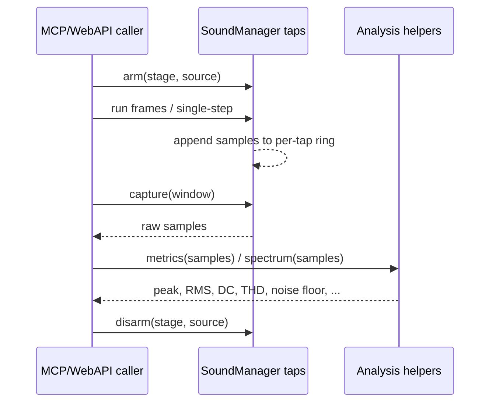
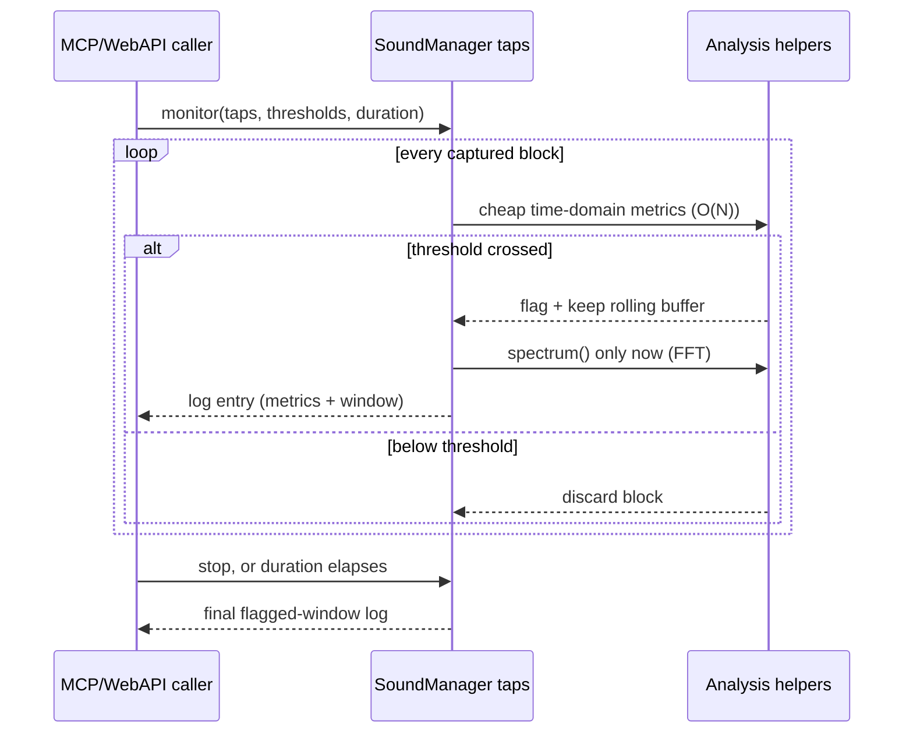
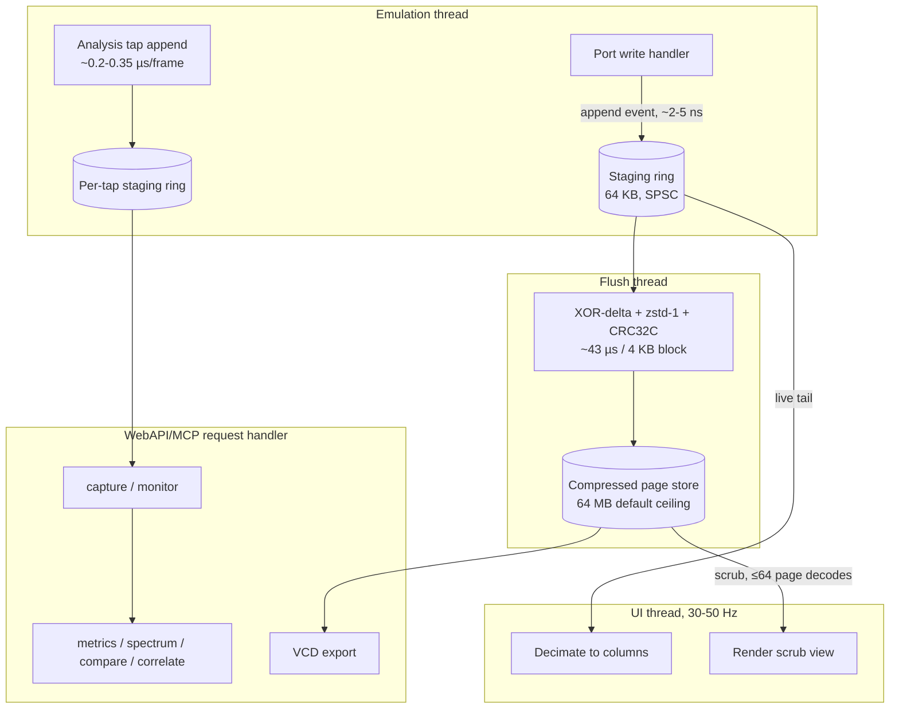

# Sound Oscilloscope / Sound Chip Debug Panel — Architecture

- **Status:** draft
- **Date:** 2026-09-17
- **Requirements:** [`goals-and-requirements.md`](./goals-and-requirements.md) in this directory — problem statement, 9 numbered goals, non-goals, use-case traceability, and feasibility evidence. This document designs against those goals and does not restate them.
- **Reference:** xpeccy-plus (`dotkoval/xpeccy-plus`), Sound chips dialog; screenshot in this directory.

---

## 1. Introduction

This document designs a sound debug panel plus an automated audio
signal-quality analysis capability, against the 9 goals in
`goals-and-requirements.md`. In one sentence: capture what a sound chip
outputs at the moment it outputs it, keep enough of it around to review or
export later, and make "is this audio correct" a question that can be asked
by code as well as by ear.

Two capture mechanisms do the actual work, built on the same data-flow
discipline (lock-free single-producer/single-consumer rings, one atomic
guard per hot-path check):

- **Event-driven trace capture** (§5.1–§5.3): records the exact moment a
  chip's output-affecting register changes, at sub-T-state timing precision,
  because the signals of interest (AY digitizer playback, beeper tricks) are
  produced by discrete CPU writes, not free-running hardware (§3).
- **Continuous multi-point analysis taps** (§5.4): records dense samples at
  several points along the audio processing pipeline, because detecting
  clicks, hiss, DC drift, and cross-chip timing/pitch drift needs a
  continuous signal, not a sparse edge list — these defects have no discrete
  write behind them.

Everything downstream — the interactive oscilloscope, VCD export, and the
WebAPI/MCP analysis surface — is a different consumer of one of these two
capture mechanisms, not a third one.

### Goal coverage map

| Goal (see requirements doc) | Covered in |
|---|---|
| 1. Exact-timing visibility | §5.1 Trace capture |
| 2. Review after the fact | §5.3 Long-duration compressed store |
| 3. Correlate waveform with code | §5.1 Trace capture, §5.8 Markers |
| 4. Cover the whole sound stack, generically | §5.1, §5.8 (device-registry-driven, not a hardcoded chip list) |
| 5. Zero cost when unused | §6 Threading & Hot Path, §7 Quantified Overhead |
| 6. External interop, multi-track export | §5.6 Multi-track VCD export |
| 7. Automated on-demand + continuous analysis | §5.4, §5.5, §5.7 |
| 8. Regression comparison against a reference | §5.5 (reference diff), §5.7 (`save_reference`/`compare`) |
| 9. Cross-source drift, whole-capture trend | §5.5 (time series & correlation), §5.6 (derived-metric tracks) |

---

## 2. Prior Art: xpeccy-plus (neutral summary)

xpeccy's implementation (`src/xcore/sound.cpp`, `src/xgui/debuga/dbg_sndchip.cpp`):

1. **Dedicated scope ring** (`scopeBuf[0x20000]` shorts) fed at **32× the
   output rate** (~1.5 MHz at 48 kHz) from the mixer's instantaneous level
   (`scope_put`), decoupled from the playback ring, which is decimated and
   stops being filled when the debugger holds the machine.
2. **`snd_scope_step(comp, ns)`**: while the machine is held, the debugger
   grants it `ns` of virtual time and the scope synthesizes mixer levels
   over that interval — this is what makes the 2 ms trace window advance per
   step.
3. **`xWaveView`** repaints once per frame: one pixel column per min/max/avg,
   fixed vertical scale, newest at the right edge; the same ring serves both
   timebases (40 ms ≈ full ring, 2 ms = last slice).
4. Panel: chip tabs (PSG1/FM1/PSG2/FM2), register minidump, per-channel
   level cells, envelope-shape view, beeper bar.

What we adopt: a capture path that stays alive while the emulation is held.
What we deliberately do not adopt: a fixed-rate ~1.5 MHz sample sweep — see
§3 for why.

---

## 3. Why Event-Driven, Not Fixed-Rate, Capture

The signals of interest — AY digitized sample playback and beeper tricks —
are produced by CPU port writes, not free-running hardware. That bounds
their information rate by *CPU command rate*, not by the dot clock:

- One data write via `OTIR` costs ~21 T-states/byte → absolute ceiling
  ≈ 3.5 MHz / 21 ≈ **166 kHz** (unrealistic — no loop overhead at all).
- A realistic digitizer loop (`OUT (c),a / DEC / JR NZ` style) costs
  ~30–60 T-states/sample → **~60–110 kHz hard ceiling**; typical players in
  real productions sit at **8–24 kHz**.
- A PIT-generated beeper "engine" toggles at most once per interrupt cycle,
  usually **7–15 kHz**.

Consequences:

1. **Level changes are sparse events.** Between two consecutive `OUT`s the
   chip output is piecewise constant (envelope sweeps are the one
   continuous exception, and those are closed-form reconstructable, §5.1).
   A fixed 1.5 MHz sweep records mostly duplicated samples: at a 20 kHz
   event rate it's ~75× oversampled — >98% of stored bytes carry no new
   information.
2. **Event-driven capture is strictly more accurate.** Recording
   `(t_state, level)` at each output-affecting write preserves exact
   transition timing (sub-T-state); fixed-rate sampling at any rate
   quantizes transition times to its sampling grid and can visually alias a
   20 kHz square wave at 1.5 MHz if the renderer is careless.

Therefore: trace capture is edge-triggered on port writes, not fixed-rate.
xpeccy's `snd_scope_step` maps to "advance the virtual clock and drain
pending events," not "synthesize a sample per ns."

This reasoning does **not** extend to the continuous analysis taps in
§5.4 — those exist specifically because clicks, hiss, and cross-chip drift
are *not* bounded by write cadence; they can appear between writes, inside
a filter's own state, or as a slow trend nothing ever "writes" at all.

---

## 4. Pipeline Overview

Every tap point and every processing-stage comparison in this design is
positioned against one real, already-existing per-frame pipeline
(`SoundManager::handleFrameEnd`, `core/src/emulator/sound/soundmanager.cpp`):



The five circled points are the continuous analysis taps of §5.4. The event
trace of §5.1 is a *different* observation point entirely — it sits at the
port-write dispatch that ultimately drives tap ①, not on this per-sample
chain — which is why the two capture mechanisms coexist instead of one
subsuming the other.

---

## 5. Architecture

### 5.1 Trace capture (event-driven, exact timing — goals 1, 3, 4)

A **ScopeTap** inside `SoundManager`, fed by two existing hot-path entry
points:

1. **Output-affecting writes, for every registered source** — the existing
   analyzer/observer dispatch for AY address/data and beeper/Covox port
   ranges today (`SoundChip_AY8910` port handling, beeper port decoder),
   generalized to any entry in `SoundManager`'s existing device registry
   (`AudioSourceType`, `_devices` / `device(type)` in
   `soundmanager.h`) rather than a hardcoded chip list. That registry
   already carries placeholder entries for chips not yet implemented
   (a general-purpose sample player, an OPL3-class chip) alongside the real
   ones — a new chip gets trace support by registering in this same
   registry and hooking its own output-affecting write into the shared
   append path, not by this capability growing new per-chip capture code.
   Each such write pushes one event.
2. **`SoundManager::handleStep`** — already called once per instruction (it
   ticks TurboSound). No per-instruction push here; envelope-only activity
   is reconstructed closed-form instead (below).

`Emulator` stepping primitives (`RunSingleCPUCycle`, `RunTStates`,
`StepOver`/`StepOut`) already route through `handleStep`, so held-time port
writes get correct in-frame T-state stamps automatically. The UI reads
"events newer than last read," renders the 2 ms slice, and advances per
step — xpeccy's behavior, sourced from events instead of a sampled sweep.

**Continuous sources** don't fit the edge model directly:

- **AY envelope** (shapes 10/11/12/14): reconstructed in the renderer from
  the register state captured at event time (period + shape + step
  counter) — closed-form, no per-sample capture needed.
- **TurboSound FM** (YM2203/ymfm core): genuinely continuous output. Falls
  back to a decimated sample tap at output-rate ÷ 4 (~12 kHz), synthesized
  in `handleFrameEnd` from the FM device's per-channel output (already
  computed there for the mix). 12 kHz × int16 = 24 KB/s — trivial, and
  enough for the 2 ms window to show operator envelope/key-on structure.
  Full FM waveform fidelity is out of scope (per the requirements doc).

### 5.2 Data model

```cpp
struct ScopeEvent {          // 8 B
    uint32_t tstatesInFrame; // intra-frame T-state stamp
    uint16_t level;          // instantaneous level (0..4095 raw, or -32k..32k mix units)
    uint8_t  source;         // AudioSourceType-keyed identifier (+ post-mix flag)
    uint8_t  flags;          // envelope active, muted, reserved
};
```

`source` keys off the same `AudioSourceType` enum the device registry
already uses (§5.1) — not a bespoke chip/channel encoding invented for this
struct — plus a `PostMix` value alongside the per-source entries,
piggybacking on the same write-triggered dispatch to tag one extra event
per write with the already-computed post-mixer level. This is what lets
panning/mixer configuration be verified on the same trace timeline as
per-source edges, opt-in (default off — it roughly doubles trace event
volume). Because `source` is keyed off the registry's own enum rather than
a capture-specific one, a chip added to the registry needs no change to
this struct or its consumers to be traceable.

### 5.3 Long-duration compressed store (goal 2)

Capture must span minutes (a whole demo part, a full tape load) and stay
scrubbable. TTD already solved "compressed, scrubbable review of
long-duration activity with bounded memory" for its own checkpoint capture,
so this reuses its **codec primitives** — the stateless free functions in
`core/src/debugger/ttd/ttdcompression.h` (zstd wrap/unwrap, CRC32C,
XOR-delta) — with measured numbers: 4 KB pages, zstd level 1 (2.66× ratio at
~43 µs/page on TTD's own BLI workload), XOR-against-prev-slot delta (92%
size win), CRC32C per slot. Page encoding: `Full` (keyframe), `XorPrev`,
`Zero`.

**Not reused as-is: `TTDCodecPageStore` itself.** Its header states the
thread model explicitly — "single-threaded (emulator thread for capture;
control thread for restore). No internal locking" — incompatible with the
flush-thread encoding model here (§6), where the emulator thread must never
block on encoding. The audio store is a **new class modeled on
`TTDCodecPageStore`'s slot/encoding layout** (same `Full`/`XorPrev`/`Zero`
scheme, same keyframe idea), built for emulator-thread-appends /
flush-thread-owns handoff — it does not instantiate or inherit
`TTDCodecPageStore`.

Adaptations for audio events (vs. TTD's memory pages):

- **Page = fixed 512-event block (4 KB).** Full blocks are encoded against
  the previous block of the same source (XOR delta, zstd-1, CRC32C) on the
  **flush thread**; the emulator thread only appends raw events to a 64 KB
  staging ring and hands over full blocks.
- **Keyframe every 64 blocks** (~512 KB raw) bounds the scrub decode chain
  to ≤64 page decodes.
- **Expected ratios beat TTD's memory pages** (10–30× vs. 2.66×), because
  digitized-playback event streams are far more regular than VRAM:
  near-constant timestamp deltas and quantized level repetitions make the
  XOR delta mostly zero bytes.

Even a pathological 110 k events/s `OTIR` flood for 30 min is ~1.6 GB raw →
well under 100 MB compressed. **RAM ceiling: 64 MB, independently
configured** — there is no shared "TTD memory budget" to hook into
(`TTDWriteJournal` and `TTDCodecPageStore`'s own budget enforcement each
independently hardcode `64u * 1024 * 1024`); this store follows the same
per-subsystem convention. 64 MB holds roughly an hour of typical capture.
Beyond the ceiling, v1 evicts oldest non-pinned pages (a Hold/Pin toggle
protects a capture in progress); disk spill is deferred (`ttddumpformat.h`
is the natural on-disk format if it's ever added).

**Considered and rejected: deriving trace events from TTD's own write
journal** instead of a dedicated hook. Rejected because (1) the journal
only exists while TTD itself is enabled and is destroyed when TTD is turned
off — this capability must work standalone; (2) its 64 MB ring is shared
across *every* memory/port write in the system and wraps in ~50 s at TTD's
own measured peak rate — a busy game could evict AY/beeper writes before a
user scrubs back, whereas a dedicated ring is scoped 100% to sound; (3) it
stores raw `(addr, value)`, not the resulting output level — reconstructing
level still needs live chip register state, which the dedicated hook gets
for free by sitting inside the port handler itself.

**Not wired into TTD's journal either.** ScopeTap events stay in this
feature's own staging ring + page store, ephemeral by default — the
compressed store already gives minutes-to-an-hour of scrollback, which
covers the stated review workflow. Reverse-search over audio via TTD is a
stated non-goal until a concrete workflow needs it.

Throughput check: worst case 110 k events/s = one 4 KB block per ~4.7 ms;
encoding cost ~43 µs/block on the flush thread — under 1% of one core, the
emulation thread never blocking. The 64 KB staging ring gives **~75 ms** of
headroom at the true 110 kHz worst case (8,192 events ÷ 110,000/s) before
the flush thread would need to drop whole blocks — full cost table in §7.

### 5.4 Continuous multi-point analysis taps (goals 7, 8, 9)

Answering "is the emulation correct" automatically needs continuous
samples at the five pipeline points in §4, not just port-write edges — a
distinct capability from §5.1's event-driven trace, which only covers
exact-timing edges and can't see a defect with no write behind it (a DC
blocker ringing on a transient, a comb-filter artifact from Room
simulation, a bad DRC resample-ratio trim, gradual pitch drift between two
chips).

Each tap is a small SPSC ring per (stage, source) pair, guarded by an
atomic flag checked once per frame — zero cost unless that specific
stage+source is armed. A request only ever arms the handful of pairs
actually under test, never all 5 stages × every source at once.

### 5.5 Signal analysis helpers (goals 7, 8, 9)

Extends `AudioHelper` (`core/src/common/sound/audiohelper.h`, which already
provides `detectBaseFrequencyFFT`/`detectBaseFrequencyZeroCross` and
DC-rejection filters) and reuses the already-vendored `simple_fft`
(`core/src/3rdparty/simple-fft/`) — no new dependency for any of the below.

**Per-window measurement (goal 7):**
- *Time domain*: peak, RMS, DC offset, crest factor, zero-crossing rate,
  clipping-sample count, and a discontinuity/click detector (sample-to-
  sample delta above a threshold scaled to the signal's own recent RMS, so
  it adapts to level instead of using one fixed threshold).
- *Frequency domain*: FFT magnitude spectrum, THD/THD+N against an expected
  fundamental (AY tone-channel register state gives the expected frequency
  directly — no guessing needed), a noise-floor estimate (median spectral
  magnitude outside the fundamental + harmonics), and a spectral peak list.
- Operates on the same captured-buffer format whether the buffer came from
  a continuous tap (§5.4) or a decoded `ScopeEvent` block (§5.2) — one
  helper library, two capture sources.

**Reference-capture diff (goal 8):** the same measurement functions, run
once each on a live capture and a previously stored reference capture, then
diffed feature-by-feature (peak/RMS/DC/spectral) and reported as where and
by how much they differ. No new measurement technique — a natural extension
of the per-window functions above, not a new analysis class.

**Time series & cross-source correlation (goal 9):** the same per-window
functions, run repeatedly across fixed-size slices (a configurable default
on the order of tens of milliseconds) spanning the whole capture, producing
a `(timestamp, value)` sequence per measured quantity per source — pitch
estimate over time, amplitude over time. Two such series, from two
concurrently-armed taps sharing the same T-state clock, feed a correlation
step:



Windowed cross-correlation (via the same `simple_fft` already vendored, FFT
convolution rather than an O(n²) direct correlation) estimates a relative
timing offset per slice — its trend over the capture is what "going out of
sync" looks like numerically. Per-slice pitch/amplitude differences give
"going out of tune" and "imbalanced levels" directly. This is a natural
extension of the frequency-domain tooling above, not an existing capability
in this codebase — stated as such, not overclaimed.

### 5.6 Multi-track export (goal 6)

`core/src/3rdparty/vcd-writer/` is present and currently unused. Its API
(`register_var(scope, name, ...)` + `change(scope, name, timestamp, value)`
against an internal variable set) is already built for registering any
number of independently named signals and recording changes against each on
a shared timestamp — multi-track export is what this module's API is for,
not an extension this design needs to add on top of it.

Three export sources feed one VCD file, so cross-source and pre-/post-stage
relationships are inspectable in one external viewer without this
capability building its own visualization surface (a stated non-goal):

1. **Trace-store export** (primary case): decode the compressed store for
   the requested range — up to its full retained duration, not a fixed
   short excerpt — and emit one wire per source (AY1/AY2 A/B/C, beeper,
   covox, FM1/FM2, PostMix if enabled).
2. **Analysis-tap export**: when multiple continuous taps (§5.4) are armed
   together — e.g. pre-DC vs. post-DC for one source, or the same channel
   on two chips — export each as its own wire in the same file, so a human
   can visually correlate what an automated `compare`/`correlate` call
   (§5.7) already answered numerically.
3. **Derived-metric export** (goal 9 support): optionally emit a
   synthesized wire per time slice — e.g. "AY1-ChA-EstPitchHz" as a
   numeric VCD variable that changes once per analysis window — alongside
   the raw audio wires, so drift is visible directly in the waveform
   viewer's value trace, not only in a returned JSON report.

**Streaming export** (feeding `vcd_writer` incrementally during capture, for
live external viewing) is supported but bounded by the writer's `TimeStamp`
type, confirmed as `using TimeStamp = unsigned;` (32-bit) — at T-state
resolution that caps a file at ~20 min (3.5 MHz × 1200 s ≈ 4.2×10⁹). This
gets patched to a 64-bit type: the typedef, three `fprintf(_ofile, "#%d\n",
...)` call sites in `vcd_writer.cpp` (currently signed `%d`, need
`PRIu64`/`%llu`), and the constructor's `unsigned init_timestamp`
parameter — contained to the vendored module, worth upstreaming. Rejected
alternative: segmenting export files per ~20 min, which fragments
scrubbing/viewing across files for a save the 64-bit patch avoids entirely.

VCD is a verbose exchange format only (tens of bytes per value change) —
never the capture format itself; the compressed store (§5.3) and the
per-tap rings (§5.4) remain canonical.

### 5.7 WebAPI/MCP surface (goals 7, 8, 9)

A new `analyze_audio` MCP tool, following the action-based schema
convention already used by `debug_code` and `analyze_performance`
(`core/automation/mcp/src/mcp-analysis.cpp`), backed by new WebAPI
endpoints alongside the existing audio/analyzer surface
(`state_audio_api.cpp`, `analyzers_api.cpp`):

| Action | Purpose | Goal |
|---|---|---|
| `arm` / `disarm` | Enable/disable a (stage, source) tap for capture. | 7 |
| `capture` | Record N frames/ms from one or more armed taps, bounded to exactly the window requested. | 7 (on-demand) |
| `metrics` | Time-domain report for a captured window. | 7 |
| `spectrum` | Frequency-domain report (FFT bins, THD, noise floor). | 7 |
| `compare` | Two captures (two taps, or a live capture vs. a stored reference) diffed side by side. | 7 (stage attribution), 8 |
| `save_reference` / `load_reference` | Persist a capture as a named "known-good" reference, or load one for a later `compare`. | 8 |
| `series` | A time series of a measurement across a whole capture, from one tap. | 9 |
| `correlate` | Two time series (two concurrently-armed taps) diffed over time: offset drift, pitch drift, amplitude drift. | 9 |
| `export` | Multi-track VCD export (§5.6), from the trace store, from armed taps, or including derived-metric tracks. | 6 |
| `monitor` | Continuous, unattended session: cheap time-domain metrics per block, escalating to `spectrum` only on a caller-specified threshold crossing, retaining only a short rolling buffer around each flagged window. Runs until stopped or a configured duration elapses. | 7 (continuous) |

**On-demand flow:**



**Continuous/unattended flow:**



Automated analysis is a **WebAPI/MCP-only surface for v1** — §5.8's
interactive UI does not grow a tap-point picker. The oscilloscope and the
analysis tool share the tap and helper infrastructure but have separate
front ends, per the requirements doc's non-goal against a dedicated
visualization UI (§5.6's export path covers that need instead).

### 5.8 UI Design (`SoundScopeDock`, `unreal-qt/src/debugger/`)

Layout mirrors the reference screenshot, adapted to this project's device
inventory:

- **Tabs**: generated by iterating `SoundManager::devices()` rather than a
  fixed list, so today's tabs (`AY 1`, `FM 1`, `AY 2`, `FM 2`, built from
  `SoundManager::getAYChip(i)` and the TSFM device) and any future
  registered source (Moonsound, General Sound, or anything else added to
  `AudioSourceType`) both appear without new UI code — only a chip-specific
  register-grid/level-cell renderer needs adding per new chip *type*, not a
  new tab mechanism.
- **Register grid** (16 hex fields per AY) — read via the paused-read
  discipline (`EmulatorBinding` marshaling) when held, or from the
  event-tap register cache when running (events can carry the 16-register
  snapshot every N ms cheaply: 16 B per refresh).
- **Per-channel level cells**: reuse the existing per-device `peak` /
  `activeRecently` computed in `handleFrameEnd` — no new measurement.
- **Envelope shape view**: static shape rendering from register 8/9/10.
- **Oscilloscope widget** (no equivalent exists in `unreal-qt` yet):
  min/max/avg columns, fixed scale, grid + center line, newest-right.
  Controls: source selector (post-mix, AY A/B/C, beeper, covox, FM), Hold
  toggle, timebase label ("2 ms/step" while stepping, live tail while
  running).
- **Scrubbing strip**: a zoomed-out overview of the whole compressed
  capture (min/max envelope per pixel over the full duration) with a
  viewport window; clicking/dragging jumps the main view to any point in
  minutes of history. Decode cost per jump: ≤64 page decodes, off the
  paint path.
- **Beeper bar**: from `Beeper::_frameHadActivity` / event-tap level,
  existing HUD precedent.
- **Markers** (differentiator vs. xpeccy): overlay port-write events (from
  the same ScopeTap) and, where available, `AYLogAnalyzer` records and
  existing TTD journal entries on the trace timeline — showing *which*
  `OUT` caused each edge. Reads TTD's journal for display only; never
  writes ScopeTap events into it (capture stays ephemeral, §5.3). Nearly
  free since trace capture already is the port-write stream.

---

## 6. Threading, Synchronization, and the Hot Path (goal 5)

Follows the established repo patterns (`AudioRingBuffer`,
`AudioDeviceDescriptor`, `NativeAudioTap` — lock-free SPSC, all-atomics
descriptors):



- **Emulation thread**: event/sample append is one relaxed store to a slot
  plus a release store of the write index — no locks, no allocation, no
  clock reads, no compression. Total added cost per port write when
  enabled: ~2–5 ns; per analysis-tap frame when armed: ~0.2–0.35 µs
  (memcpy of the frame mix). When the dock is closed / a tap isn't armed:
  one `std::atomic<bool>::load`, predicted-taken branch.
- **Flush thread** (worker, neither emulation nor UI paint): drains full
  4 KB blocks from staging, XOR-delta + zstd-1 + CRC32C encodes them into
  the page store, maintains the keyframe index. Under 1% of one core at
  worst-case event rate (§7).
- **UI thread**: QTimer 30–50 Hz. Live view reads the staging tail and
  decimates to per-column min/max/avg; scrubbing asks the page store for a
  time range (≤64 page decodes via the keyframe index). It plots only the
  **latest** staging-ring content at each tick — it never replays or
  redraws a picture for every emulated frame in between. A single emulated
  frame's wall-clock cost is typically well under 5 ms, far shorter than
  the 20–33 ms repaint period, so under turbo/fast-forward many frames can
  complete between two ticks and are simply skipped: there's nothing to
  "replay," since the staging ring always holds the union of events since
  the last read regardless of how many frames produced them.
- **Overrun policy**: if the flush thread falls behind, the staging ring
  absorbs it — ~75 ms of headroom at the true worst-case rate (110 kHz),
  ~340 ms–1 s at typical digitizer rates; beyond that, whole blocks are
  dropped with an atomic dropped-counter shown in the widget label — never
  backpressure into emulation. The page store is lossy only past the RAM
  ceiling (disk spill deferred), oldest-first with a Hold/Pin toggle.
- **Automation thread** (WebAPI/MCP request handler): FFT/THD/spectral
  analysis and correlation never run on the emulation thread — they execute
  inside the request handler, the same thread pool that already serves
  every other WebAPI/MCP call, over an already-captured buffer, on demand.

---

## 7. Quantified Overhead

All figures assume a modern desktop-class core (~3 GHz, ≥10 GB/s
single-thread memcpy bandwidth). The 43 µs/4 KB-block zstd-1+CRC32C encode
cost is TTD's own measured number — primarily a function of buffer size,
not content, so it transfers to event blocks with reasonable confidence;
the compression *ratio* (10–30× vs. TTD's 2.66×) is the content-dependent
number and remains a conservative estimate, not a measured one.

**CPU, as a fraction of one core:**

| Path | Cost per unit | Rate | Core-time / sec | Fraction of 1 core |
|---|---|---|---|---|
| ScopeTap append, typical digi | 2–5 ns | 8–24 kHz | 16–120 µs/s | 0.002–0.012% |
| ScopeTap append, pathological `OTIR` | 2–5 ns | 110 kHz | 220–550 µs/s | 0.022–0.055% |
| ScopeTap append, dock closed | ~1 ns atomic load | ≤110 kHz | ≤110 µs/s | ≤0.011% |
| Flush-thread encode, typical (16 kHz mid) | 43 µs / 4 KB block | 1 block / 32 ms | ~1.3 ms/s | ~0.13% |
| Flush-thread encode, pathological (110 kHz) | 43 µs / 4 KB block | 1 block / 4.65 ms | ~9.2 ms/s | ~0.92% |
| UI decimation, live tail | ~1–3 µs / repaint | 30–50 Hz | ~50–150 µs/s | ~0.005–0.015% |
| UI scrub decode (on demand) | ≤64 × ~8.5 µs (zstd-1 decode + XOR + CRC32C) | per scrub jump | ≤~0.55 ms / jump | one-shot, off paint path |
| `monitor` per-block metrics | ~1–3 µs / block (same cheap O(N) pass as UI decimation) | continuous | — | comparable to the UI-decimation row, not the FFT row |
| `spectrum` / `compare` / `correlate` FFT pass | sub-millisecond (4096-sample FFT) to single-digit ms (multi-tap `compare`) | on demand only | — | not on any per-frame path — runs in the automation thread's request handler |

**Memory, itemized:**

| Item | Size | Present when |
|---|---|---|
| Trace staging ring (raw events, pre-encode) | 64 KB fixed | dock open |
| Trace page store (compressed, configurable ceiling) | 64 MB default | dock open, capture active |
| Keyframe index (~1 entry / 64 blocks) | ~16–30 KB for a full 1 h capture at typical rates | folds into the ceiling above |
| Per-tap analysis rings (§5.4) | ~7 KB per armed (stage, source) pair | only while armed for `capture`/`monitor` |
| **Total new worst-case RSS** | **~64.1 MB**, dominated by the trace page-store ceiling | — |

**Staging-ring headroom** (64 KB ÷ 8 B/event = 8,192 events of capacity
before the flush thread must start dropping whole blocks):

| Event rate | Headroom before drop |
|---|---|
| 110 kHz (pathological `OTIR` ceiling) | **~75 ms** |
| 24 kHz (typical, high end) | ~341 ms |
| 8 kHz (typical, low end) | ~1.0 s |

Even the true worst case (~75 ms) is ample in practice: the flush thread's
steady-state duty cycle at 110 kHz is under 1% of a core, so it is
essentially never actually behind — this headroom bounds recovery from OS
scheduling hiccups, not a real throughput shortfall.

**Latency, end to end:**

- **Single-step**: ~0 ms — the widget redraws synchronously inside the
  debugger's step handler, same call stack, no timer involved.
- **Live tail while running**: bounded by the 30–50 Hz UI repaint period
  (20–33 ms) — the live view reads the staging ring directly; encoding
  latency never sits on this path.
- **Scrub jump**: ≤~0.55 ms decode plus one repaint period — effectively
  instant relative to human interaction.
- **`monitor` flag-to-log**: bounded by the per-block cheap-metrics pass
  (µs-scale) plus, only on a threshold crossing, one FFT pass
  (sub-millisecond) — not by anything running continuously at FFT cost.

---

## 8. Performance and Latency Summary

| Concern | Value |
|---|---|
| Emulation-thread cost, trace enabled | 2–5 ns/event (~0.002–0.012% of 1 core typical, ≤0.055% at the 110 kHz pathological ceiling) |
| Emulation-thread cost, dock/taps closed | ~1 ns atomic load (≤0.011% of 1 core even at the 110 kHz ceiling) |
| New persistent memory | 64 KB staging (fixed) + 64 MB trace page-store ceiling (default, configurable); ~7 KB per armed analysis tap |
| Compression | XOR-delta + zstd-1, 10–30× estimated on OUT streams; 43 µs/4 KB block ⇒ ~0.13% (typical) – ~0.92% (pathological) of the flush thread's core |
| Capture capacity | Trace: minutes to ~1 h at the default 64 MB ceiling (RAM-bound; disk spill deferred). Analysis taps: bounded to the requested `capture`/`monitor` window. |
| UI cost | ~1–3 µs/repaint at 30–50 Hz; scrub decode ≤~0.55 ms per jump, off the paint path |
| Displayed/reported latency | ~0 ms on single-step; ≤33 ms on the live tail; `monitor` flags within one block's cheap-metrics pass plus an occasional FFT pass |
| Export | .vcd (GTKWave/Surfer), multi-track, up to the full retained duration; streaming export needs the 64-bit `vcd_writer` timestamp patch |
| Data discarded | Trace: none within the 64 MB ceiling, oldest non-pinned pages evicted beyond it. `monitor`: everything except flagged windows, by design (goal 7's continuous pattern). |

The 2 ms trace window matches the CPU write cadence that actually produces
digitized/beeper output (§3), so single-step mode shows exact edge timing
with zero added latency, and the live tail adds nothing beyond one UI
repaint period.

---

## 9. Implementation Plan (incremental)

1. **Phase 1 — Trace capture core.** `SoundScopeDock` shell + oscilloscope
   widget, ScopeTap staging ring + port-write hooks (AY data port, beeper,
   Covox), live tail + per-step advance wired to debugger stepping, beeper
   bar. RAM-only staging (no long-duration store yet — oldest events drop
   on overflow).
2. **Phase 2 — Compressed long-duration store.** 4 KB block codec on the
   flush thread reusing `ttdcompression.h`'s primitives, keyframe index,
   scrubbing UI (overview strip + zoom), independent 64 MB RAM ceiling with
   oldest-first eviction, Pin/Hold. Spill-to-disk deferred.
3. **Phase 3 — Chip views + single-track export.** Register grids, level
   cells, envelope view, FM decimated tap, source selector, post-mix event
   source (default off); VCD export from the trace store (one wire per
   source, full retained duration).
4. **Phase 4 — Correlation markers.** Port-write/AYLog/TTD overlays on the
   trace timeline.
5. **Phase 5 — Continuous analysis taps + on-demand analysis.** Per-stage/
   source continuous taps (§5.4), `AudioHelper` time/frequency-domain
   extensions, the `analyze_audio` MCP tool + WebAPI endpoints for
   `arm`/`disarm`/`capture`/`metrics`/`spectrum`/`compare`, multi-track
   export extended to include armed taps (goal 6's stage-comparison case).
6. **Phase 6 — Continuous/unattended monitoring.** `monitor` action:
   per-block cheap metrics, threshold-triggered rolling buffer, flagged-
   window log.
7. **Phase 7 — Reference comparison and cross-source trend analysis.**
   `save_reference`/`load_reference` (goal 8); `series`/`correlate` and
   derived-metric VCD tracks (goal 9).

Phase 1 already adds the ScopeTap append on port writes (§6) — there is no
phase with zero hot-path changes; every phase's cost is quantified in §7
and guarded to a single predicted-taken atomic load when its capability is
inactive.

---

## 10. Testing

- **Core (GTest)**: staging-ring SPSC correctness (incl. overrun and wrap),
  event stamps under `RunTStates` and single-step, port-write hook accuracy
  for a known beeper toggle sequence, envelope closed-form reconstruction
  vs. a reference sequence.
- **Codec**: block round-trip (encode → decode identity), XOR-prev chain
  decode, CRC32C integrity failure detection, keyframe-index random access
  within the ≤64-decode bound, oldest-first eviction at the RAM ceiling;
  ratio sanity check on a synthetic `OTIR` digitizer stream.
- **VCD export**: file parses (GTKWave-compatible header + value changes),
  event count and timestamps match the store; multi-track export carries
  all requested wires correctly time-aligned; derived-metric tracks change
  value only at slice boundaries.
- **Renderer**: decimation produces stable min/max/avg columns (property:
  column min ≤ avg ≤ max, exact when `samples == columns`).
- **Analysis**: time-domain metrics (peak/RMS/DC/clipping/click count)
  validated against synthetic signals with known-injected artifacts (a
  clean tone; the same tone with an injected click, a DC bias, or
  clipping); frequency-domain metrics (THD, noise floor) validated against
  a synthetic sine of known purity; `compare` correctly attributes an
  injected artifact to the tap pair that brackets it, and correctly flags a
  synthetic reference-vs-live divergence that isn't itself an
  absolute-quality defect (goal 8). `series`/`correlate` correctly recover
  a known injected pitch drift and a known injected timing offset between
  two synthetic sources (goal 9).
- **`analyze_audio` MCP tool**: schema validation, `arm`/`disarm`
  lifecycle, capture-window bounds; `monitor` correctly flags a synthetic
  anomaly injected mid-session, retains only the rolling buffer around it
  (not the full session), and stays under the §7 per-block cost budget for
  the duration of a multi-minute soak test.
- **Manual/WebAPI scenario** (per AGENTS.md): boot, run a known AY digi
  demo, watch the live tail; pause, single-step through an `OUT` loop,
  verify the 2 ms trace advances per step and edges align with markers;
  capture 1+ minute, scrub, export multi-track VCD and open it in a
  waveform viewer; run an on-demand `analyze_audio` check and a short
  `monitor` session against the same demo.
- Zero-warning build (`ninja -C cmake-build-release`) and core-tests green
  before any commit; test artifacts under `scratch/`.

---

## 11. Extensibility Beyond Audio (design constraint, not delivered here)

Nothing in §5.2's data model or §5.6's exporter is intrinsically an audio
concept: a timestamped event tied to the shared T-state clock, kept in a
compressed store, and exportable as a named track in a standard interchange
format applies to any hot-path state transition, not only a sound chip's.
VCD's original purpose is digital hardware signal tracing — audio is the
motivating use case for *this* effort, not the format's home domain.

Two concrete directions this could extend to later, not built here:

- **Floppy disk controller/drive timing.** The WD1793 controller already
  tracks index-pulse and step timing with T-state stamps internally — the
  same shape of information a port-write event captures for a sound chip.
  An index-pulse or step-command event could reuse §5.2's `ScopeEvent`
  shape (a different `source` namespace, same struct layout) and §5.3's
  compressed store without redesigning either.
- **CPU bus cycles.** Instruction-fetch/memory/IO cycle timing dumped to
  VCD is a standard logic-analyzer workflow; no specific existing hook for
  it was identified in this pass, so this direction is plausible, not
  grounded the way the FDC one is.

This section imposes one constraint on the design above, not a new
deliverable: `source` (§5.2) is already keyed off `SoundManager`'s own
device-registry enum rather than an ad hoc audio encoding, and the VCD
exporter (§5.6) is already built around named tracks rather than an
audio-specific channel model — so a later, separate effort could register a
non-audio source through the same mechanism without this design needing to
be reopened. Building FDC or CPU-bus trace support itself is out of scope
for this effort.
