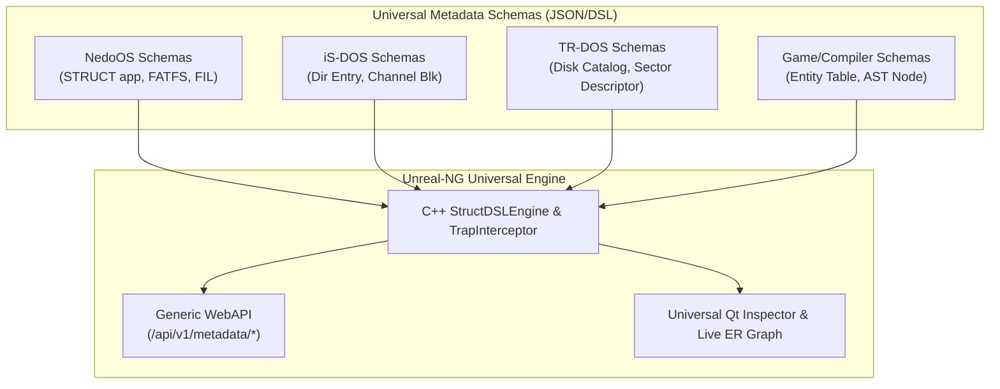
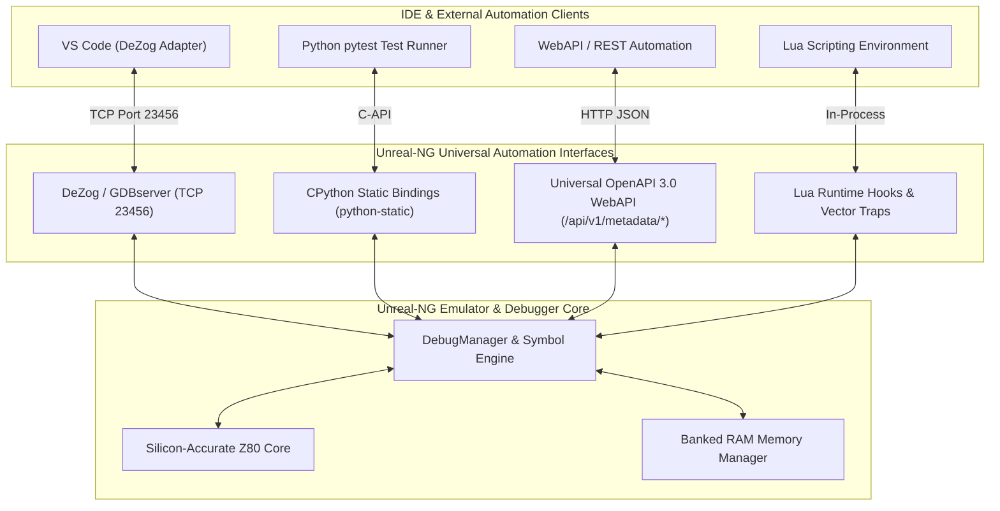
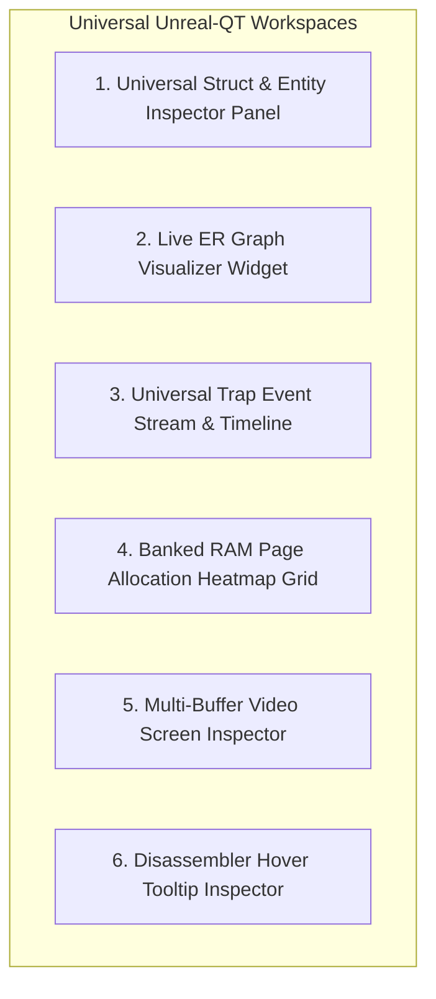
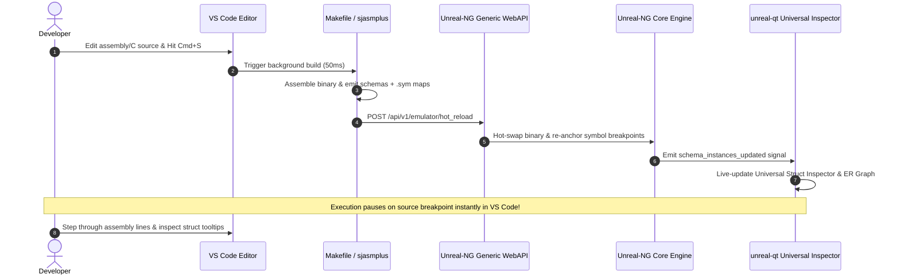

# Architectural Specification: Universal Metadata-Driven Debugger Enhancements, Automation Interfaces & UI/UX Transformations in Unreal-NG

**Target Path:** [`docs/inprogress/2026-09-17-nedoos-triage-and-struct-dsl/nedoos-debugger-enhancements-and-sdlc-uiux.md`](https://github.com/alfishe/unreal-ng/blob/master/docs/inprogress/2026-09-17-nedoos-triage-and-struct-dsl/nedoos-debugger-enhancements-and-sdlc-uiux.md)  
**Date:** September 17, 2026  
**Author:** Antigravity / Unreal-NG Core & NedoOS Reverse-Engineering Core  
**Status:** Comprehensive Architectural Specification & Universal UI/UX Model  

### Repository References
- **Unreal-NG Repository:** [https://github.com/alfishe/unreal-ng](https://github.com/alfishe/unreal-ng)
- **NedoOS Development Support Repository:** [https://github.com/alfishe/NedoOS-dev](https://github.com/alfishe/NedoOS-dev)
- **NedoOS Upstream SVN Mirror (Read-Only):** [https://github.com/alfishe/NedoOS](https://github.com/alfishe/NedoOS) (nightly synced from official SVN `svn://nedoos.ru/nedoos/nedoos`)
- **NedoOS Reverse-Engineering Docs:** [https://github.com/alfishe/NedoOS-dev/tree/main/docs](https://github.com/alfishe/NedoOS-dev/tree/main/docs)

### Related Specifications
- **Design Proposal & Roadmap:** [`nedoos-struct-dsl-and-triage-design.md`](nedoos-struct-dsl-and-triage-design.md)
- **Struct Catalog & Transformation Engine:** [`nedoos-struct-catalog-and-dsl-transformation.md`](nedoos-struct-catalog-and-dsl-transformation.md)

---

## 1. Executive Summary: The Universal Subsystem Principle

A key architectural mandate for Unreal-NG is **Strict System Universality**: hardcoding product-specific endpoints (e.g. `/api/v1/nedoos/*`) into the core emulator API is prohibited. 

Instead, Unreal-NG introduces a **Universal, Metadata-Driven OS & Subsystem Abstraction Engine**. This framework allows any target—whether **NedoOS**, **iS-DOS**, **TR-DOS**, **CP/M**, **ResiDOS**, or complex guest software (compilers, trackers, game engines)—to be fully inspected, hot-reloaded, and debugged via schema declarations:



---

## PART A: Automation Module Interfaces & Remote Protocols

Unreal-NG exposes four universal automation channels for remote IDE integration, automated testing, and scripting:



---

### A.1 Universal OpenAPI 3.0 WebAPI Endpoints (`/api/v1/metadata/*` & `/api/v1/emulator/*`)

The generic WebAPI endpoints allow external build tools and watchers to register schemas, query live dynamic struct instances, and hot-reload binaries:

```yaml
paths:
  /api/v1/emulator/hot_reload:
    post:
      summary: Universal hot-reload for executable binaries, snapshots, or disk images
      requestBody:
        content:
          application/json:
            schema:
              type: object
              properties:
                artifact_path: { type: string, example: "release/osatm2.trd" }
                symbol_path: { type: string, example: "kernel/code.sym" }
                listing_path: { type: string, example: "kernel/code.lst" }
                target_page: { type: integer, example: 16 }
                soft_reset: { type: boolean, default: false }
      responses:
        '200': { description: Artifact successfully reloaded & symbols re-anchored }

  /api/v1/metadata/schemas:
    post:
      summary: Register or update dynamic Struct DSL / Enum schemas
      requestBody:
        content:
          application/json:
            schema:
              type: object
              properties:
                schema_name: { type: string, example: "NedoOS_App" }
                base_symbol: { type: string, example: "app1" }
                stride_bytes: { type: integer, example: 180 }
                fields: { type: array, items: { type: object } }
      responses:
        '200': { description: Struct schema registered successfully }

  /api/v1/metadata/instances:
    get:
      summary: Query decoded live memory instances for any registered schema
      parameters:
        - name: schema
          in: query
          required: true
          schema: { type: string, example: "NedoOS_App" }
        - name: base_symbol
          in: query
          schema: { type: string, example: "app1" }
        - name: address
          in: query
          schema: { type: string, example: "0xC050" }
      responses:
        '200':
          content:
            application/json:
              schema:
                type: array
                items: { type: object }

  /api/v1/metadata/traps:
    post:
      summary: Register generic vector or address call traps (RST 0x08, RST 0x10, CALL 0x3D13)
      requestBody:
        content:
          application/json:
            schema:
              type: object
              properties:
                trap_address: { type: string, example: "0x0010" }
                trap_name: { type: string, example: "BDOS_Dispatch" }
                register_arg: { type: string, example: "C" }
                enum_schema: { type: string, example: "NedoOS_Syscalls" }
```

---

### A.2 CPython Static Automation API (`python-static` / `pytest`)

Python test runners query live struct instances using the universal schema API:

```python
import pytest
from unreal_ng import EmulatorClient

@pytest.fixture
def emulator():
    client = EmulatorClient(host="127.0.0.1", port=8080)
    client.hot_reload("release/osatm2.trd", symbol_path="kernel/code.sym")
    client.register_schema("docs/schemas/nedoos_structs.json")
    return client

def test_universal_struct_inspection(emulator):
    # Inject command to start app
    emulator.inject_keyboard("texted README.TXT\n")
    
    # Wait for trap on RST 0x10 vector
    emulator.wait_for_trap("BDOS_Dispatch", timeout_sec=5.0)
    
    # Query decoded struct instances via universal metadata API
    active_apps = emulator.read_schema_instances(schema="NedoOS_App", base_symbol="app1")
    
    assert len(active_apps) >= 2
    assert active_apps[1]["id"] > 0
    assert active_apps[1]["mainpg"] > 0x10
```

---

### A.3 Lua In-Emulator Universal Event Traps

Lua scripts register generic address and port hooks without hardcoding guest OS names:

```lua
-- universal_telemetry.lua: Generic Trap Script for Vector Calls

function on_vector_trap(address, regs)
    if address == 0x0010 then
        local syscall_id = regs.c
        print(string.format("[VECTOR 0x10] Trap Hit! Reg C = 0x%02X, HL = 0x%04X", syscall_id, regs.hl))
    elseif address == 0x3D13 then
        print(string.format("[TR-DOS TRAP] 0x3D13 call, Reg C = 0x%02X", regs.c))
    end
end

-- Register generic vector traps
emulator.hook_address(0x0010, on_vector_trap)
emulator.hook_address(0x3D13, on_vector_trap)
```

---

### A.4 DeZog / GDBserver Remote Protocol Adapter (`TCP 23456`)

- **Port**: `23456`
- **Protocol**: Extended GDB Remote Serial Protocol + DeZog custom Z80 extensions.
- **Capabilities**: Universal symbol resolution from `kernel.sym` and `.lst` files, allowing VS Code to debug any Z80 binary.

---

## PART B: Universal `unreal-qt` UI/UX Transformations

To support NedoOS, iS-DOS, TR-DOS, CP/M, or custom games seamlessly, `unreal-qt` provides **Universal Inspector Widgets** driven by dynamic schema declarations:



---

### B.1 Workspace Widget Specifications

#### 1. Universal Struct & Entity Inspector Panel (`unreal-qt/inspector/universal_struct_inspector.cpp`)
* **UI Layout**: Multi-column live table that adapts dynamically to whatever schema is selected (`NedoOS_App`, `iSDOS_Channel`, `TRDOS_Catalog`, `CPM_FCB`).
* **Columns**: Rendered dynamically from JSON schema field definitions.
* **Context Menu**: Pause on address, Inspect memory page, Jump disassembler.

```text
+---------------------------------------------------------------------------------------+
| Universal Struct Inspector [ Active Schema: NedoOS_App ]                              |
+-----+------------+-----------+---------+-----------+-------+---------+----------+-----+
| Field: id        | parentid  | mainpg  | stdin     | stdout| border  | screen   | vol |
+-----+------------+-----------+---------+-----------+-------+---------+----------+-----+
|  0  |     -      |   0x05    |    0    |     1     |   0   | Screen0 |   0x00   | C:  |
|  1  |     0      |   0x10    |    0    |     1     |   0   | Screen0 |   0x00   | C:  |
|  2  |     1      |   0x14    |    2    |     3     |   0   | Screen1 |   0x00   | C:  |
+-----+------------+-----------+---------+-----------+-------+---------+----------+-----+
```

#### 2. Live Entity-Relationship (ER) Graph Visualizer (`unreal-qt/inspector/er_diagram_widget.cpp`)
* **UI Layout**: Generic node graph widget using Qt GraphicsScene.
* **Relationships**: Derived dynamically from schema foreign-key references (`parent_id`, `file_handle`, `owner_page`). Nodes highlight live during execution.

```text
 [Entity: App PID 2] ──────> [Entity: File Handle 3] ──────> [Entity: Volume C:]
        │                                                           │
        └───────────────> [RAM Page 0x14]                           └──> [Disk Sector 0x0182]
```

#### 3. Universal Trap Event Stream & Timeline View (`unreal-qt/inspector/trap_timeline_widget.cpp`)
* **UI Layout**: Generic event log drawer mapping trap vector hits to registered enum names (`OS_OPENFILE`, `TRDOS_READ_SECTOR`).

#### 4. Banked RAM Page Allocation Heatmap Grid
* **UI Layout**: 2D 16KB RAM page grid color-coding memory blocks by owner metadata registered in active schemas.

#### 5. Multi-Buffer Video Screen Inspector
* **UI Layout**: Bottom dock drawer in `unreal-qt` rendering miniature live previews of all active video buffer pages.

#### 6. Disassembler Hover Tooltip Inspector
* **UI Behavior**: Hovering over registers (`IY`, `IX`) or addresses decodes memory using whichever schema matches the target address.

---

## PART C: Ideal Universal SDLC Workflow



---

## PART D: Implementation Roadmap & Task Complexity Matrix

| Module / Component | Target Source File | Development Effort | Complexity | Implementation Priority | Primary Value |
|---|---|---|---|---|---|
| **Universal Hot-Reload WebAPI** | `core/api/emulator_api_handler.cpp` | 2–3 days | **Medium** | **P1 (Immediate)** | Generic artifact injection & symbol re-anchoring without restart. |
| **Universal Schema WebAPI (`/api/v1/metadata/*`)** | `core/api/metadata_api_handler.cpp` | 2–3 days | **Medium** | **P1 (Immediate)** | Generic REST endpoints for schema registration & struct instance queries. |
| **`sjasmplus` `.lst` / `.sym` Auto-Loader** | `core/debugger/symbol_loader.cpp` | 1–2 days | **Low** | **P1 (Immediate)** | Annotates disassembler with source symbols and line numbers. |
| **Universal Vector Trap Interceptor** | `core/debugger/trap_interceptor.cpp` | 2–3 days | **Medium** | **P1 (Immediate)** | Logs generic trap hits (`RST 0x10`, `RST 0x30`, `0x3D13`). |
| **DeZog / GDBserver TCP Adapter** | `core/debugger/gdbserver_adapter.cpp` | 3–4 days | **Medium** | **P1 (Immediate)** | Connects VS Code for native source-level assembly debugging. |
| **Universal Struct Tree Inspector Widget** | `unreal-qt/inspector/universal_struct_inspector.cpp` | 3–4 days | **Medium** | **P2 (Near-Term)** | Generic Qt widget rendering ANY registered struct schema. |
| **Banked RAM Page Grid Widget** | `unreal-qt/inspector/ram_page_grid_widget.cpp` | 2–3 days | **Medium** | **P2 (Near-Term)** | Color-codes 16KB RAM pages by schema metadata. |
| **Live ER Graph Visualizer Widget** | `unreal-qt/inspector/er_diagram_widget.cpp` | 4–6 days | **High** | **P2 (Near-Term)** | Dynamically visualizes dynamic entity-relationship linkages. |
| **Disassembler Hover Tooltips** | `unreal-qt/views/disasm_hover_inspector.cpp` | 2–3 days | **Low** | **P2 (Near-Term)** | Displays HTML tooltips decoding `IY`/`IX` struct fields. |

---

*End of Universal Architectural Specification.*
