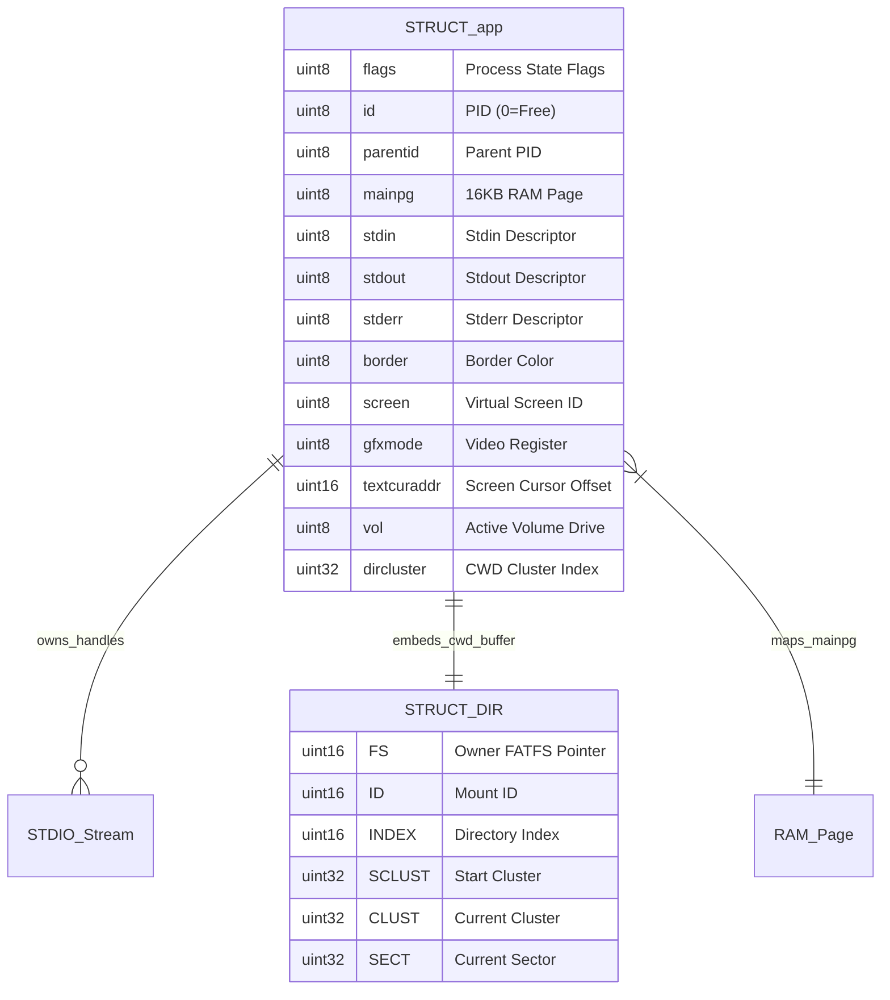
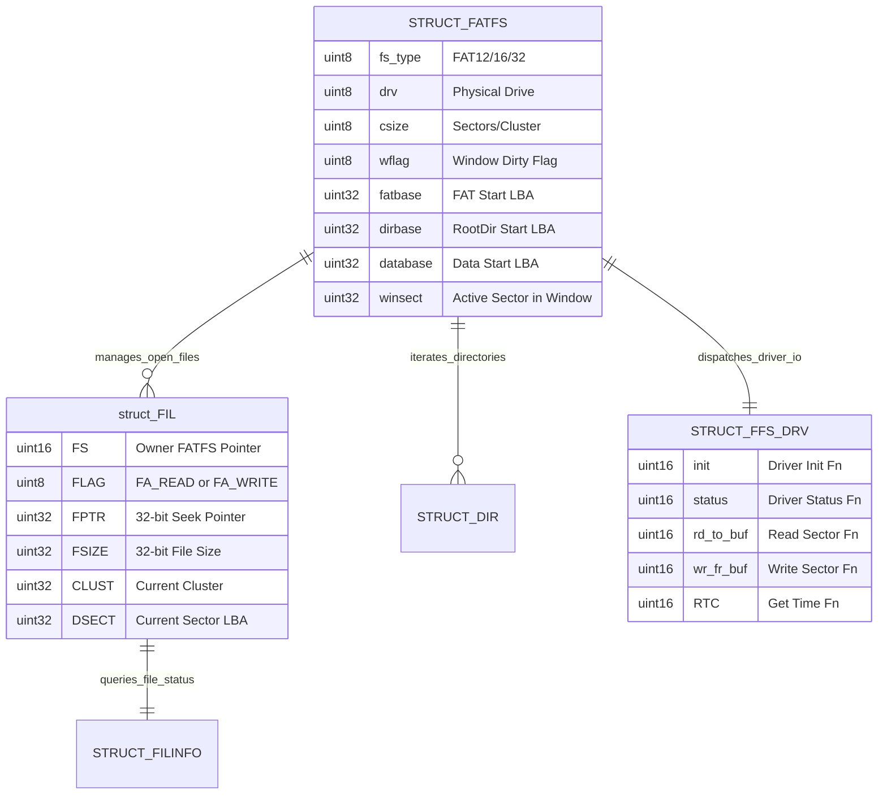
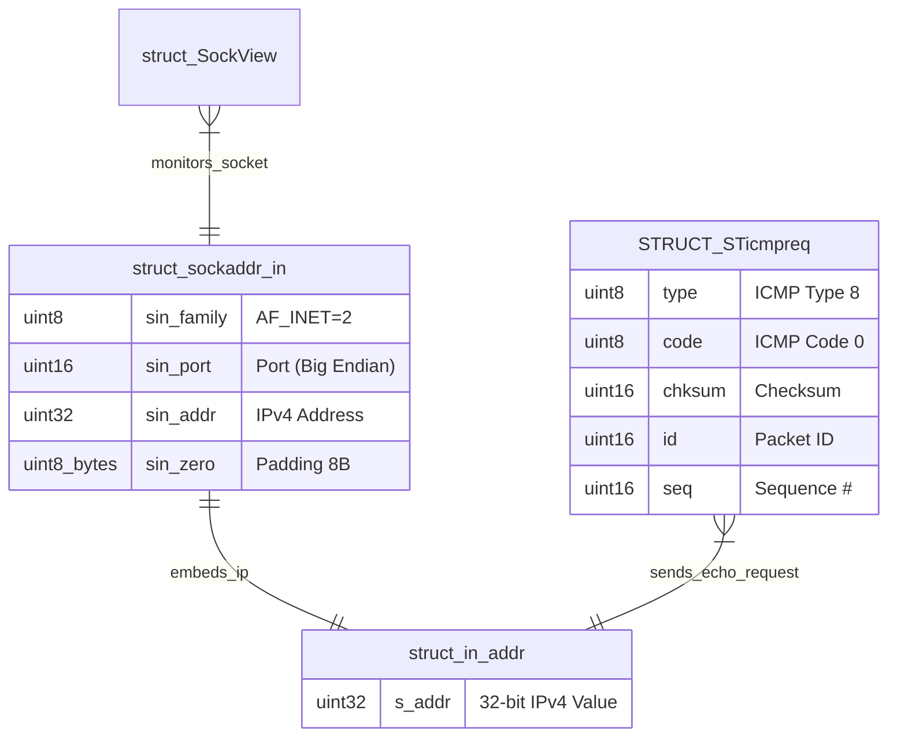
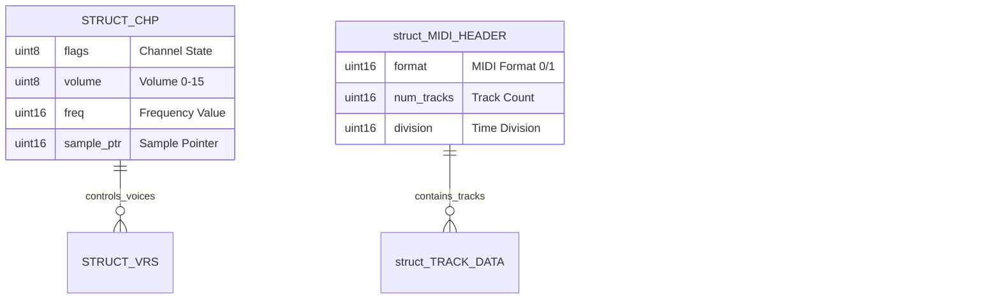
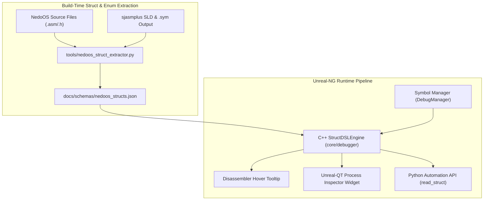
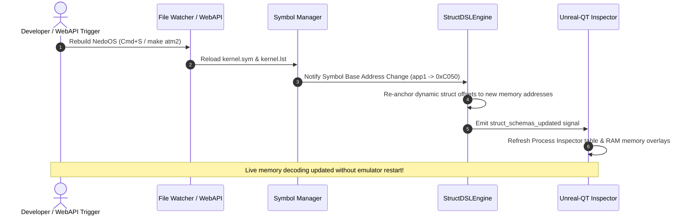
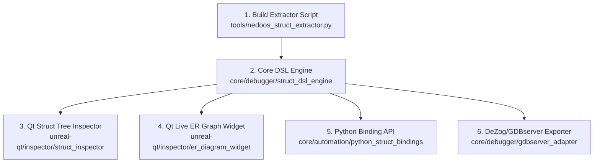

# NedoOS Data Structure Catalog & Struct DSL Transformation Architecture

**Target Path:** [`docs/inprogress/2026-09-17-nedoos-triage-and-struct-dsl/nedoos-struct-catalog-and-dsl-transformation.md`](https://github.com/alfishe/unreal-ng/blob/master/docs/inprogress/2026-09-17-nedoos-triage-and-struct-dsl/nedoos-struct-catalog-and-dsl-transformation.md)  
**Date:** September 17, 2026  
**Author:** Antigravity / Unreal-NG Core & NedoOS Reverse-Engineering Core  
**Status:** Exhaustive Architectural Specification & Extracted Catalog  

### Repository References
- **Unreal-NG Repository:** [https://github.com/alfishe/unreal-ng](https://github.com/alfishe/unreal-ng)
- **NedoOS Development Support Repository:** [https://github.com/alfishe/NedoOS-dev](https://github.com/alfishe/NedoOS-dev)
- **NedoOS Upstream SVN Mirror (Read-Only):** [https://github.com/alfishe/NedoOS](https://github.com/alfishe/NedoOS) (nightly synced from official SVN `svn://nedoos.ru/nedoos/nedoos`)
- **NedoOS Reverse-Engineering Docs:** [https://github.com/alfishe/NedoOS-dev/tree/main/docs](https://github.com/alfishe/NedoOS-dev/tree/main/docs)

---

## 1. Categorized Struct & Entity Index Table

This comprehensive catalog indexes **all** data structures, application state objects, player tables, and diagnostic entities identified across the NedoOS repository:

| Category | Struct Name | `alfishe/NedoOS-dev` Locator | `alfishe/NedoOS` Upstream Locator | Size (Bytes) | Primary Scope |
|---|---|---|---|---|---|
| **Process Control** | `STRUCT app` | [`NedoOS/src/kernel/syskrnl.asm#L137-L170`](https://github.com/alfishe/NedoOS-dev/blob/main/NedoOS/src/kernel/syskrnl.asm#L137-L170) | [`src/kernel/syskrnl.asm#L137-L170`](https://github.com/alfishe/NedoOS/blob/master/src/kernel/syskrnl.asm#L137-L170) | ~180 | Task Control Block (TCB), process state, RAM pages, stdio streams, video registers. |
| **File System** | `STRUCT FATFS` | [`NedoOS/src/kernel/fatfs_h.asm#L74-L95`](https://github.com/alfishe/NedoOS-dev/blob/main/NedoOS/src/kernel/fatfs_h.asm#L74-L95) | [`src/kernel/fatfs_h.asm#L74-L95`](https://github.com/alfishe/NedoOS/blob/master/src/kernel/fatfs_h.asm#L74-L95) | 563 | Volume mount descriptor, cluster sizes, sector window buffer (`win[512]`). |
| **File System** | `struct FIL` | [`NedoOS/src/kernel/fatfs_h.asm#L125-L138`](https://github.com/alfishe/NedoOS-dev/blob/main/NedoOS/src/kernel/fatfs_h.asm#L125-L138) | [`src/kernel/fatfs_h.asm#L125-L138`](https://github.com/alfishe/NedoOS/blob/master/src/kernel/fatfs_h.asm#L125-L138) | 544 | Active file handle, 32-bit seek pointer (`FPTR`), 32-bit size (`FSIZE`), 512B buffer. |
| **File System** | `STRUCT DIR` | [`NedoOS/src/kernel/fatfs_h.asm#L99-L110`](https://github.com/alfishe/NedoOS-dev/blob/main/NedoOS/src/kernel/fatfs_h.asm#L99-L110) | [`src/kernel/fatfs_h.asm#L99-L110`](https://github.com/alfishe/NedoOS/blob/master/src/kernel/fatfs_h.asm#L99-L110) | 26 | Directory iterator object, cluster indices, SFN/LFN pointers. |
| **File System** | `STRUCT FILINFO` | [`NedoOS/src/_sdk/sysdefs.asm#L65-L75`](https://github.com/alfishe/NedoOS-dev/blob/main/NedoOS/src/_sdk/sysdefs.asm#L65-L75) | [`src/_sdk/sysdefs.asm#L65-L75`](https://github.com/alfishe/NedoOS/blob/master/src/_sdk/sysdefs.asm#L65-L75) | 83 | File status structure returned by `sys_findfirst`/`sys_findnext`. |
| **Storage Driver** | `STRUCT FFS_DRV` | [`NedoOS/src/kernel/fatfs_h.asm#L33-L56`](https://github.com/alfishe/NedoOS-dev/blob/main/NedoOS/src/kernel/fatfs_h.asm#L33-L56) | [`src/kernel/fatfs_h.asm#L33-L56`](https://github.com/alfishe/NedoOS/blob/master/src/kernel/fatfs_h.asm#L33-L56) | 36 | FatFS block disk driver jump table and buffer parameters. |
| **Networking** | `struct sockaddr_in` | [`NedoOS/src/kernel/w5300.asm#L59-L60`](https://github.com/alfishe/NedoOS-dev/blob/main/NedoOS/src/kernel/w5300.asm#L59-L60) | [`src/kernel/w5300.asm#L59-L60`](https://github.com/alfishe/NedoOS/blob/master/src/kernel/w5300.asm#L59-L60) | 16 | BSD IPv4 socket address structure (`sin_port`, `sin_addr`). |
| **Networking** | `struct in_addr` | [`NedoOS/src/kernel/w5300.asm#L58`](https://github.com/alfishe/NedoOS-dev/blob/main/NedoOS/src/kernel/w5300.asm#L58) | [`src/kernel/w5300.asm#L58`](https://github.com/alfishe/NedoOS/blob/master/src/kernel/w5300.asm#L58) | 4 | 32-bit IPv4 internet address wrapper. |
| **Networking** | `STRUCT STicmpreq` | [`NedoOS/src/ping/ping.asm#L6-L12`](https://github.com/alfishe/NedoOS-dev/blob/main/NedoOS/src/ping/ping.asm#L6-L12) | [`src/ping/ping.asm#L6-L12`](https://github.com/alfishe/NedoOS/blob/master/src/ping/ping.asm#L6-L12) | 40 | ICMP Echo Request header & payload packet layout. |
| **Networking UI** | `struct SockView` | [`NedoOS/src/kapps/common/espnet/sockets.h#L1-L15`](https://github.com/alfishe/NedoOS-dev/blob/main/NedoOS/src/kapps/common/espnet/sockets.h#L1-L15) | [`src/kapps/common/espnet/sockets.h#L1-L15`](https://github.com/alfishe/NedoOS/blob/master/src/kapps/common/espnet/sockets.h#L1-L15) | 24 | Socket Inspector UI view model for network telemetry. |
| **CP/M Compat** | `STRUCT FCB` | [`NedoOS/src/_sdk/sysdefs.asm#L50-L63`](https://github.com/alfishe/NedoOS-dev/blob/main/NedoOS/src/_sdk/sysdefs.asm#L50-L63) | [`src/_sdk/sysdefs.asm#L50-L63`](https://github.com/alfishe/NedoOS/blob/master/src/_sdk/sysdefs.asm#L50-L63) | 37 | Legacy CP/M 36-byte File Control Block. |
| **File Manager UI**| `STRUCT PANEL` | [`NedoOS/src/nv/nv.asm#L15-L35`](https://github.com/alfishe/NedoOS-dev/blob/main/NedoOS/src/nv/nv.asm#L15-L35) | [`src/nv/nv.asm#L15-L35`](https://github.com/alfishe/NedoOS/blob/master/src/nv/nv.asm#L15-L35) | 64 | Nedo Navigator dual-panel file manager state object. |
| **Audio Tracker** | `STRUCT CHP` / `VRS` | [`NedoOS/src/_sdk/ptsplay.asm#L15-L35`](https://github.com/alfishe/NedoOS-dev/blob/main/NedoOS/src/_sdk/ptsplay.asm#L15-L35) | [`src/_sdk/ptsplay.asm#L15-L35`](https://github.com/alfishe/NedoOS/blob/master/src/_sdk/ptsplay.asm#L15-L35) | 32 | PT3/PTS Tracker Player sound channel & voice state structure. |
| **MIDI / OPL4** | `struct MIDI_HEADER` | [`NedoOS/src/gp/moonmid/midi_def.asm#L66`](https://github.com/alfishe/NedoOS-dev/blob/main/NedoOS/src/gp/moonmid/midi_def.asm#L66) | [`src/gp/moonmid/midi_def.asm#L66`](https://github.com/alfishe/NedoOS/blob/master/src/gp/moonmid/midi_def.asm#L66) | 32 | General MIDI / MoonSound OPL4 Synth track header. |
| **S3M Player** | `struct S3MHEADER` | [`NedoOS/src/gp/moonmod/s3m.asm#L15`](https://github.com/alfishe/NedoOS-dev/blob/main/NedoOS/src/gp/moonmod/s3m.asm#L15) | [`src/gp/moonmod/s3m.asm#L15`](https://github.com/alfishe/NedoOS/blob/master/src/gp/moonmod/s3m.asm#L15) | 96 | ScreamTracker 3 S3M module player state structure. |
| **MOD Player** | `struct MODHEADER` | [`NedoOS/src/gp/moonmod/mod.asm#L12`](https://github.com/alfishe/NedoOS-dev/blob/main/NedoOS/src/gp/moonmod/mod.asm#L12) | [`src/gp/moonmod/mod.asm#L12`](https://github.com/alfishe/NedoOS/blob/master/src/gp/moonmod/mod.asm#L12) | 128 | Amiga MOD 4-channel module header & sample table. |

---

### 1.1 Subsystem Entity-Relationship (ER) Diagrams

#### A. Process & System Core Subsystem ER Diagram



#### B. File System & Storage Subsystem ER Diagram



#### C. Networking & Communication Subsystem ER Diagram



#### D. Multimedia & Tracker Audio Subsystem ER Diagram



---

## 2. Detailed Struct Catalog

### 2.1 Process Control: `STRUCT app` (Task Control Block)

#### Narrative & Description
`STRUCT app` is the core Task Control Block (TCB) of NedoOS. The kernel allocates an array of `MAXAPPS=16` instances starting at label `app1` in kernel RAM bank `syskrnl.asm`. Register `IY` points to the currently executing task's `app` structure during system calls and context switching.

* **Locators:** [`NedoOS/src/kernel/syskrnl.asm#L137-L170`](https://github.com/alfishe/NedoOS-dev/blob/main/NedoOS/src/kernel/syskrnl.asm#L137-L170) (NedoOS-dev) \| [`src/kernel/syskrnl.asm#L137-L170`](https://github.com/alfishe/NedoOS/blob/master/src/kernel/syskrnl.asm#L137-L170) (Upstream SVN)
* **Base Symbol:** `app1` (array index offset = `PID * app_sz`)
* **Pointer Register:** `IY`

#### Original Assembly Source Code Block
```assembly
        STRUCT app
flags           BYTE ;флаги (всегда в начале структуры)
id              BYTE ;номер задачи (0=свободно)
parentid        BYTE ;номер родительской задачи
mainpg          BYTE ;главная страница задачи (там userkernel)
stdin           BYTE
stdout          BYTE
stderr          BYTE
lasttime        BYTE
border          BYTE ;текущий цвет бордера 0..15
screen          BYTE ;текущий номер экрана ;fd_user + 8*screen
gfxmode         BYTE ;текущий видеорежим ;значение для 0xbd77
gfxkeep         BYTE ;b7 = keep gfx pages
scr0low         BYTE ;pages
scr0high        BYTE ;pages
scr1low         BYTE ;pages
scr1high        BYTE ;pages
childresult     WORD ;filled by closed child
textcuraddr     WORD ;адрес курсора на экране
curcolor        BYTE ;текущий атрибут при печати
dta             WORD ;data transfer address
vol             BYTE ;текущий драйв (volume)
dircluster      DWORD ;текущая директория
dir             BLOCK DIR_sz ;временный буфер для чтения каталога
bdosstack       BLOCK bdosstack_sz ;стек при вызове BDOS
pal             BLOCK 32 ;палитра (EGA/VGA 32 байта)
        ENDS
```

#### Proposed Struct DSL JSON Schema
```json
{
  "struct_name": "NedoOS_App",
  "category": "ProcessControl",
  "source_origin": "NedoOS/src/kernel/syskrnl.asm:L137",
  "base_symbol": "app1",
  "stride_bytes": 180,
  "fields": [
    { "name": "flags",       "type": "uint8",  "offset": 0,  "description": "Process State Flags" },
    { "name": "id",          "type": "uint8",  "offset": 1,  "description": "PID (0=Free)" },
    { "name": "parentid",    "type": "uint8",  "offset": 2,  "description": "Parent PID" },
    { "name": "mainpg",      "type": "uint8",  "offset": 3,  "description": "Main 16KB RAM Page" },
    { "name": "stdin",       "type": "uint8",  "offset": 4,  "description": "Stdin Stream Descriptor" },
    { "name": "stdout",      "type": "uint8",  "offset": 5,  "description": "Stdout Stream Descriptor" },
    { "name": "stderr",      "type": "uint8",  "offset": 6,  "description": "Stderr Stream Descriptor" },
    { "name": "border",      "type": "uint8",  "offset": 8,  "description": "Border Color (0-15)" },
    { "name": "screen",      "type": "uint8",  "offset": 9,  "description": "Virtual Screen ID" },
    { "name": "gfxmode",     "type": "uint8",  "offset": 10, "description": "Video Mode Register" },
    { "name": "childresult", "type": "uint16", "offset": 16, "endian": "little" },
    { "name": "textcuraddr", "type": "uint16", "offset": 18, "endian": "little" },
    { "name": "curcolor",    "type": "uint8",  "offset": 20, "description": "Text Attribute Byte" },
    { "name": "dta",         "type": "uint16", "offset": 21, "endian": "little" },
    { "name": "vol",         "type": "uint8",  "offset": 23, "description": "Active Volume Drive" },
    { "name": "dircluster",  "type": "uint32", "offset": 24, "endian": "little", "description": "CWD Cluster Index" },
    { "name": "dir",         "type": "struct", "offset": 28, "schema": "NedoOS_DIR" },
    { "name": "pal",         "type": "bytes",  "offset": 118, "size": 32, "description": "EGA/VGA Palette Table" }
  ]
}
```

---

### 2.2 File System: `STRUCT FATFS`, `struct FIL`, `STRUCT DIR`, `STRUCT FILINFO`

#### Locators & Sources
- `STRUCT FATFS`: [`NedoOS/src/kernel/fatfs_h.asm#L74-L95`](https://github.com/alfishe/NedoOS-dev/blob/main/NedoOS/src/kernel/fatfs_h.asm#L74-L95) (563 bytes)
- `struct FIL`: [`NedoOS/src/kernel/fatfs_h.asm#L125-L138`](https://github.com/alfishe/NedoOS-dev/blob/main/NedoOS/src/kernel/fatfs_h.asm#L125-L138) (544 bytes)
- `STRUCT DIR`: [`NedoOS/src/kernel/fatfs_h.asm#L99-L110`](https://github.com/alfishe/NedoOS-dev/blob/main/NedoOS/src/kernel/fatfs_h.asm#L99-L110) (26 bytes)
- `STRUCT FILINFO`: [`NedoOS/src/_sdk/sysdefs.asm#L65-L75`](https://github.com/alfishe/NedoOS-dev/blob/main/NedoOS/src/_sdk/sysdefs.asm#L65-L75) (83 bytes)

#### Assembly Source for `STRUCT FILINFO`
```assembly
        STRUCT FILINFO
FSIZE           DWORD           ;/* FILE SIZE */
FDATE           WORD            ;/* LAST MODIFIED DATE */
FTIME           WORD            ;/* LAST MODIFIED TIME */
FATTRIB         BYTE            ;/* ATTRIBUTE */
FNAME           BLOCK 13        ;/* SHORT FILE NAME (8.3 FORMAT with dot) */
LNAME           BLOCK 64        ;/* LONG FILE NAME (ASCIIZ) */
        ENDS
```

---

### 2.3 Networking: `struct sockaddr_in`, `struct in_addr`, `STRUCT STicmpreq`

#### Locators & Sources
- `struct sockaddr_in`: [`NedoOS/src/kernel/w5300.asm#L59-L60`](https://github.com/alfishe/NedoOS-dev/blob/main/NedoOS/src/kernel/w5300.asm#L59-L60) (16 bytes)
- `STRUCT STicmpreq`: [`NedoOS/src/ping/ping.asm#L6-L12`](https://github.com/alfishe/NedoOS-dev/blob/main/NedoOS/src/ping/ping.asm#L6-L12) (40 bytes)

#### Assembly Source for `STRUCT STicmpreq`
```assembly
        STRUCT STicmpreq
type            BYTE            ;/* ICMP Type (8 = Echo Request) */
code            BYTE            ;/* ICMP Code (0) */
chksum          WORD            ;/* Checksum */
id              WORD            ;/* Identifier */
seq             WORD            ;/* Sequence Number */
data            BLOCK 32        ;/* Echo Data Payload */
        ENDS
```

---

## 3. Extracted NedoOS Pseudo-Enums, Constants & Flags

Beyond layout structures, NedoOS relies on strict bit-flag groups, BDOS syscall numbers, and hardware mode constants. Registering these as **Enums** in Unreal-NG allows disassemblers and debuggers to render `OS_OPENFILE` instead of `0x0001`:

### 3.1 BDOS Syscall Dispatch Vectors (`src/_sdk/sysdefs.asm`)

| Syscall Constant | Code (Hex) | Parameters & Input Registers | Description |
|---|---|---|---|
| `OS_EXIT` | `0x0000` | `A` = Return exit code | Terminate current process and return to parent shell. |
| `OS_OPENFILE` | `0x0001` | `HL` -> Filename, `A` = Access Mode | Open existing file or create new file descriptor. |
| `OS_READFILE` | `0x0002` | `BC` = Handle, `DE` -> Buffer, `HL` = Size | Read bytes from file handle into memory buffer. |
| `OS_WRITEFILE` | `0x0003` | `BC` = Handle, `DE` -> Buffer, `HL` = Size | Write bytes from memory buffer to file handle. |
| `OS_CLOSEFILE` | `0x0004` | `BC` = Handle | Close open file descriptor. |
| `OS_SEEKFILE` | `0x0005` | `BC` = Handle, `DE:HL` = 32-bit seek offset | Reposition read/write file pointer. |
| `OS_DELETEFILE` | `0x0006` | `HL` -> Filename string | Delete file from mounted filesystem. |
| `OS_GETKEY` | `0x0008` | Returns `A` = Char, `DE` = Mouse (Y,X), `L` = Buttons | Non-blocking poll of keyboard, mouse, and joystick. |
| `OS_PRINTHEX` | `0x0009` | `A` = Byte value | Print 2-digit hexadecimal byte to stdout. |
| `OS_PRINTSTRING` | `0x000A` | `HL` -> ASCIIZ string | Print null-terminated string to active screen buffer. |
| `OS_SETCOLOR` | `0x000E` | `A` = Ink/Paper attribute | Set active text print attribute color byte. |
| `OS_ALLOCPAGE` | `0x0010` | Returns `A` = Page ID (or `0xFF` if error) | Allocate 16KB extended RAM page. |
| `OS_FREEPAGE` | `0x0011` | `A` = Page ID | Release 16KB extended RAM page back to OS pool. |
| `OS_NEWAPP` | `0x0012` | Returns `IY` -> New process `STRUCT app` | Create new child process structure. |
| `OS_EXEC` | `0x0013` | `BC` = File Handle, `DE` -> Args string | Execute program binary into child process. |
| `OS_GETTIME` | `0x0018` | Returns `DE:HL` = Unix timestamp | Read current RTC timestamp. |
| `OS_FATFS` | `0x0020` | `A` = Subfunction code | Extended FatFS low-level file system calls. |
| `OS_SOCKET` | `0x0030` | `A` = Network command code | BSD Socket extension vector (W5300 / ESP8266). |

### 3.2 Key Code Enums (`src/_sdk/sysdefs.asm`)

```json
{
  "enum_name": "NedoOS_KeyCodes",
  "values": {
    "K_BS": 8, "K_TAB": 9, "K_ENTER": 13, "K_ESC": 27,
    "K_LEFT": 28, "K_RIGHT": 29, "K_UP": 30, "K_DOWN": 31,
    "K_PGUP": 128, "K_PGDN": 129, "K_HOME": 130, "K_END": 131,
    "K_F1": 144, "K_F2": 145, "K_F3": 146, "K_F4": 147, "K_F5": 148,
    "K_F6": 149, "K_F7": 150, "K_F8": 151, "K_F9": 152, "K_F10": 153
  }
}
```

### 3.3 Video Mode Enums (`gfxmode` byte)

```json
{
  "enum_name": "NedoOS_GfxModes",
  "values": {
    "GFX_TEXT_80x30": 0,
    "GFX_ATM_EGA_320x200_16C": 2,
    "GFX_ATM_HIGHRES_640x200": 6,
    "GFX_SPECTRUM_256x192": 7
  }
}
```

---

## 4. Transformation & Pipeline Architecture



### 4.1 Transforming `sjasmplus` Output to DSL Schemas

1. **Build-Time Extraction Tool (`tools/nedoos_struct_extractor.py`)**:
   * Analyzes `STRUCT ... ENDS` syntax blocks in NedoOS assembly sources during build execution (`make atm2`).
   * Evaluates byte sizes (`BYTE` = 1, `WORD` = 2, `DWORD` = 4, `BLOCK N` = N) to compute exact cumulative field offsets.
   * Cross-references symbol addresses from `sjasmplus` `--sym` output to attach `base_symbol` bindings (e.g., `app1` at address `0xC050`).
2. **Schema Output**: Emits structured JSON schema files (`docs/schemas/nedoos_structs.json`) alongside build artifacts (`osatm2.trd`, `kernel.sym`).

### 4.2 Unreal-NG Struct DSL Engine Core (`core/debugger/struct_dsl_engine.h`)

```cpp
namespace unreal::debugger {

enum class FieldType { Uint8, Uint16, Uint32, Bytes, NestedStruct };

struct StructField {
    std::string name;
    FieldType type;
    size_t offset;
    size_t size;
    bool is_little_endian;
    std::string description;
    std::string nested_schema_name;
};

class StructSchema {
public:
    std::string name;
    std::string base_symbol;
    size_t stride_bytes;
    std::vector<StructField> fields;
};

class StructDSLEngine {
public:
    bool load_schemas(const std::string& json_path);
    std::map<std::string, std::string> decode_struct_at_address(
        uint16_t address, uint8_t page, const std::string& schema_name);
};

} // namespace unreal::debugger
```

---

## 5. Runtime Management & Hot Reload Lifecycle



### Hot Reload Execution Steps:
1. **Artifact Reload Detection**: Upon receiving a WebAPI reload request (`POST /api/v1/reload_artifact`) or detecting file modifications in `kernel.sym`.
2. **Symbol Re-Anchoring**: `StructDSLEngine` queries `DebugManager` for updated addresses of base symbols (`app1`, `curr_fatfs`).
3. **Live Inspector Refresh**: `unreal-qt` Process Inspector and Memory Overlays re-evaluate active process fields (`STRUCT app`) from new RAM offsets instantly.

---

## 6. Implementation Requirements for Metadata/DSL & ER Recognition in Unreal-NG

To realize dynamic Struct DSL recognition, live entity-relationship (ER) graph visualizers, and metadata-driven triage in Unreal-NG, six core architectural modules must be developed:



### 6.1 Component Breakdown & Implementation Specifications

#### 1. Build-Time Schema Extractor (`tools/nedoos_struct_extractor.py`)
* **Task**: Create a Python build-tool script that parses `STRUCT ... ENDS` syntax blocks in `NedoOS/src` assembly and `.h` header files. Combines line numbers with `sjasmplus` `--sym` and `--SLD` outputs to emit unified JSON schemas (`docs/schemas/nedoos_structs.json`) and relationship mappings (`nedoos_er_relations.json`).
* **Complexity**: **Low** (1–2 days)
* **Priority**: **P1 (Immediate)**

#### 2. Unreal-NG Core Struct DSL Engine (`core/debugger/struct_dsl_engine.{h,cpp}`)
* **Task**: C++ engine component embedded in `unreal-core` that parses JSON DSL schemas, interfaces with `DebugManager` for base symbol addresses (`app1`, `curr_fatfs`), resolves banked RAM page contexts (`sys_curpg4000`), and evaluates struct field offsets on the fly.
* **Complexity**: **Medium** (3–4 days)
* **Priority**: **P1 (Immediate)**

#### 3. Qt Struct Tree Inspector & Hover Tooltips (`unreal-qt/inspector/struct_inspector_widget.{h,cpp}`)
* **Task**: A rich Qt Widget panel in `unreal-qt` rendering hierarchical tree views of decoded structs (`STRUCT app`, `STRUCT FATFS`, `struct FIL`). Includes an interactive hover tooltip filter for memory dumps and disassembler views.
* **Complexity**: **Medium** (3–5 days)
* **Priority**: **P2 (Near-Term)**

#### 4. Qt Live ER Diagram & Relationship Visualizer Widget (`unreal-qt/inspector/er_diagram_widget.{h,cpp}`)
* **Task**: A dynamic graphical node graph widget in `unreal-qt` rendering live Entity-Relationship (ER) linkages during emulation (e.g. visualizing Process PID 2 -> File Handle 3 -> FATFS Volume C: -> Disk Window Sector).
* **Complexity**: **High** (4–6 days)
* **Priority**: **P2 (Near-Term)**

#### 5. Python Automation Struct Bindings (`core/automation/python_struct_bindings.cpp`)
* **Task**: Expose high-level struct inspection methods to the CPython static automation API (`emulator.read_struct("app1[0]")` and `emulator.get_active_processes()`) for automated `pytest` triage scripts.
* **Complexity**: **Small** (1–2 days)
* **Priority**: **P2 (Near-Term)**

#### 6. DeZog / GDBserver Type Metadata Exporter (`core/debugger/gdbserver_dezog_adapter.{h,cpp}`)
* **Task**: Format struct schemas and symbol tables into GDB remote protocol type definitions over TCP port `23456`, enabling native VS Code variable window decoding.
* **Complexity**: **Medium** (2–4 days)
* **Priority**: **P3 (Future)**

---

### 6.2 Complexity & Priority Matrix

| Subsystem Component | Target Source Path | Development Effort | Architectural Complexity | Implementation Priority | Primary Value |
|---|---|---|---|---|---|
| **Build-Time Schema Extractor** | `tools/nedoos_struct_extractor.py` | 1–2 days | **Low** | **P1 (Immediate)** | Automatically converts `sjasmplus` source structs to JSON schemas. |
| **Core Struct DSL Engine** | `core/debugger/struct_dsl_engine.{h,cpp}` | 3–4 days | **Medium** | **P1 (Immediate)** | Evaluates struct byte offsets on paged Z80 memory safely. |
| **Qt Struct Tree Inspector** | `unreal-qt/inspector/struct_inspector_widget.{h,cpp}` | 3–5 days | **Medium** | **P2 (Near-Term)** | Renders interactive tree views & disassembler hover tooltips. |
| **Qt Live ER Diagram Widget** | `unreal-qt/inspector/er_diagram_widget.{h,cpp}` | 4–6 days | **High** | **P2 (Near-Term)** | Dynamically visualizes process-to-file-to-disk ER graphs in UI. |
| **Python Automation Bindings** | `core/automation/python_struct_bindings.cpp` | 1–2 days | **Low** | **P2 (Near-Term)** | Enables Python `pytest` scripts to query process & FATFS state. |
| **DeZog / GDBserver Exporter** | `core/debugger/gdbserver_dezog_adapter.{h,cpp}` | 2–4 days | **Medium** | **P3 (Future)** | Transmits type definitions to VS Code debug windows. |

---

*End of Comprehensive Struct Catalog & Transformation Specification.*
