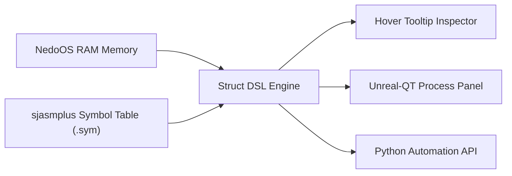
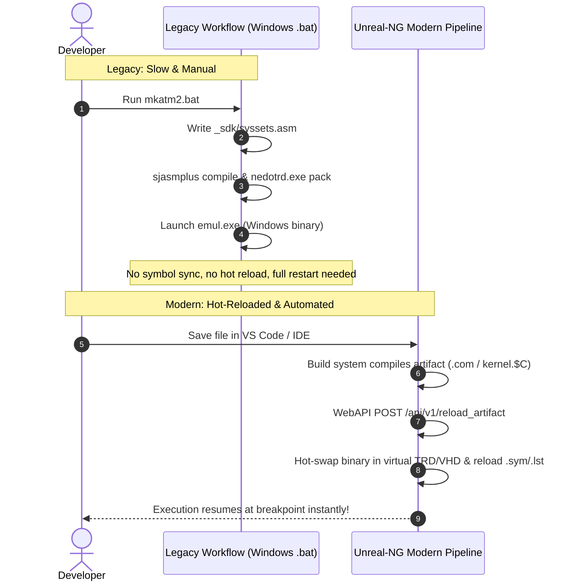
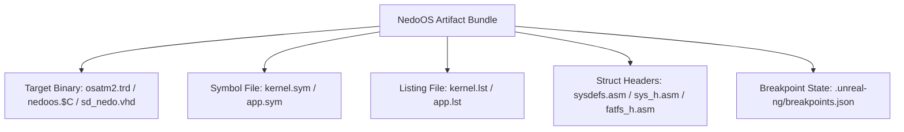
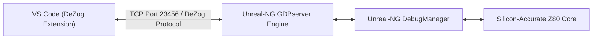
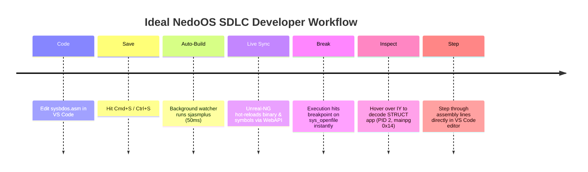
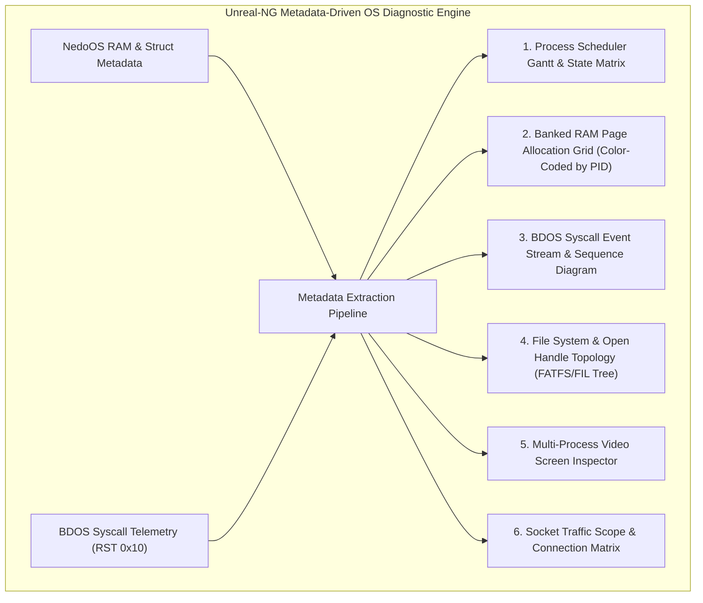

# Architectural Proposal: NedoOS Data Struct DSL, IDE Integration & High-Efficiency Debugging in Unreal-NG

**Target Path:** [`docs/inprogress/2026-09-17-nedoos-triage-and-struct-dsl/nedoos-struct-dsl-and-triage-design.md`](https://github.com/alfishe/unreal-ng/blob/master/docs/inprogress/2026-09-17-nedoos-triage-and-struct-dsl/nedoos-struct-dsl-and-triage-design.md)  
**Date:** September 17, 2026  
**Author:** Antigravity / Unreal-NG & NedoOS Reverse-Engineering Core  
**Status:** Comprehensive Design Proposal & Ideal SDLC Vision  

### Repository References
- **Unreal-NG Repository:** [https://github.com/alfishe/unreal-ng](https://github.com/alfishe/unreal-ng)
- **NedoOS Development Support Repository:** [https://github.com/alfishe/NedoOS-dev](https://github.com/alfishe/NedoOS-dev)
- **NedoOS Official Upstream SVN Mirror (Read-Only):** [https://github.com/alfishe/NedoOS](https://github.com/alfishe/NedoOS) (nightly synced from official SVN `svn://nedoos.ru/nedoos/nedoos`)
- **NedoOS Reverse-Engineering Docs:** [https://github.com/alfishe/NedoOS-dev/tree/main/docs](https://github.com/alfishe/NedoOS-dev/tree/main/docs)

---

## 1. Executive Summary

This document formalizes the technical analysis, architectural design, and prioritized roadmap for establishing high-efficiency development, debugging, and forensic triage of **NedoOS** (the multitasking ZX Spectrum operating system) within **Unreal-NG**.

While Unreal-NG provides silicon-accurate Z80 emulation, banked memory tracking, and basic debugging tools, triaging a multitasking OS at the raw CPU opcode level is inefficient. This proposal introduces:
1. **A Struct Definition Language (DSL)** engine to parse and decode NedoOS kernel/SDK structures (`STRUCT app`, `STRUCT FATFS`, `struct FIL`, `STRUCT DIR`) directly in `unreal-qt` memory viewers and Python automation scripts.
2. **OS-Aware Debugging Primitives**, including automated `sjasmplus` symbol loading, BDOS syscall interception (`RST 0x10`), and a dedicated NedoOS Task Inspector panel.
3. **Frictionless Build & Loading Workflow**: Replacing legacy Windows-only `.bat` scripts with hot-reloading artifact pipelines via WebAPI and Shared Memory IPC.
4. **IDE & Source-Level Debugging**: Integration with VS Code via a **DeZog / GDB Remote Protocol Bridge**, featuring symbol-anchored breakpoint persistence.
5. **The Ideal NedoOS SDLC Vision**: A modern IDE workflow where developers write assembly/C, hit save, and instantly see hot-reloaded binaries with full source-level breakpoints and OS task telemetry.

---

## 2. NedoOS Data Structure Audit

NedoOS sources in [`NedoOS/src`](https://github.com/alfishe/NedoOS-dev/tree/main/NedoOS/src) extensively use `sjasmplus` assembly structures (`STRUCT ... ENDS`) and fixed byte-offset tables across the kernel, SDK, and application layers:

### Primary Identified Structures

| Structure Name | GitHub Source Location | Size / Layout | Purpose & Key Fields |
|---|---|---|---|
| `STRUCT app` | [`NedoOS/src/kernel/syskrnl.asm#L137-L170`](https://github.com/alfishe/NedoOS-dev/blob/main/NedoOS/src/kernel/syskrnl.asm#L137-L170) | ~180 bytes per PID (array of `MAXAPPS=16`) | **Task Control Block (TCB)**: `id` (PID), `parentid`, `mainpg` (RAM page), `stdin`/`stdout`/`stderr` streams, `border`, `screen`, `gfxmode`, `scr0low`/`scr0high`/`scr1low`/`scr1high` (dual video pages), `childresult`, `textcuraddr`, `vol` (current drive), `dircluster` (cwd cluster), `pal[32]` (EGA/VGA color palette). |
| `STRUCT FATFS` | [`NedoOS/src/kernel/fatfs_h.asm#L74-L95`](https://github.com/alfishe/NedoOS-dev/blob/main/NedoOS/src/kernel/fatfs_h.asm#L74-L95) | 563 bytes | **Volume Mount Descriptor**: `fs_type`, `csize` (sectors/cluster), `fsize` (sectors/FAT), `database`, `fatbase`, `dirbase`, `winsect`, `win[512]` (sector window buffer). |
| `struct FIL` | [`NedoOS/src/kernel/fatfs_h.asm#L125-L138`](https://github.com/alfishe/NedoOS-dev/blob/main/NedoOS/src/kernel/fatfs_h.asm#L125-L138) | 544 bytes | **Active File Handle**: `FS` pointer, `FLAG`, `FPTR` (32-bit seek offset), `FSIZE` (32-bit file size), `FCLUST` (start cluster), `CLUST` (current cluster), `BUF[512]` (sector data buffer). |
| `STRUCT DIR` | [`NedoOS/src/kernel/fatfs_h.asm#L99-L110`](https://github.com/alfishe/NedoOS-dev/blob/main/NedoOS/src/kernel/fatfs_h.asm#L99-L110) | 26 bytes | **Directory Iterator**: `FS` pointer, `INDEX`, `SCLUST` (start cluster), `CLUST`, `SECT`, `FN` (SFN pointer), `lfn` (LFN buffer pointer). |
| `STRUCT FFS_DRV` | [`NedoOS/src/kernel/fatfs_h.asm#L33-L56`](https://github.com/alfishe/NedoOS-dev/blob/main/NedoOS/src/kernel/fatfs_h.asm#L33-L56) | 36 bytes | **Disk Driver Function Table**: `init`, `status`, `rd_to_buf`, `wr_fr_buf`, `RTC`, `memcpy_lib2usp`. |
| `struct sockaddr_in` | [`NedoOS/src/kernel/w5300.asm#L59-L60`](https://github.com/alfishe/NedoOS-dev/blob/main/NedoOS/src/kernel/w5300.asm#L59-L60) | 16 bytes | **BSD Network Socket Address**: `sin_family`, `sin_port` (uint16_t), `sin_addr` (uint32_t IP), `sin_zero[8]`. |

---

## 3. Struct DSL Architecture for Unreal-NG

### 3.1 DSL Grammar Specification

To eliminate raw hexadecimal offset calculation during debugging, Unreal-NG adopts a lightweight C-like Struct DSL parser. Schemas can be registered via JSON config files or inline declarations:

```json
{
  "struct_name": "NedoOS_App",
  "source_origin": "NedoOS/src/kernel/syskrnl.asm",
  "base_symbol": "app1",
  "stride_bytes": 180,
  "fields": [
    { "name": "flags",       "type": "uint8",  "offset": 0 },
    { "name": "id",          "type": "uint8",  "offset": 1, "description": "Process ID (0=Free)" },
    { "name": "parentid",    "type": "uint8",  "offset": 2, "description": "Parent Process ID" },
    { "name": "mainpg",      "type": "uint8",  "offset": 3, "description": "16KB RAM Page" },
    { "name": "stdin",       "type": "uint8",  "offset": 4 },
    { "name": "stdout",      "type": "uint8",  "offset": 5 },
    { "name": "stderr",      "type": "uint8",  "offset": 6 },
    { "name": "border",      "type": "uint8",  "offset": 8, "description": "Border Color (0-15)" },
    { "name": "screen",      "type": "uint8",  "offset": 9, "description": "Active Screen Index" },
    { "name": "gfxmode",     "type": "uint8",  "offset": 10, "description": "Video Register Mode" },
    { "name": "childresult", "type": "uint16", "offset": 16, "endian": "little" },
    { "name": "textcuraddr", "type": "uint16", "offset": 18, "endian": "little" },
    { "name": "curcolor",    "type": "uint8",  "offset": 20 },
    { "name": "dta",         "type": "uint16", "offset": 21, "endian": "little" },
    { "name": "vol",         "type": "uint8",  "offset": 23, "description": "Drive Letter / Volume" },
    { "name": "dircluster",  "type": "uint32", "offset": 24, "endian": "little" },
    { "name": "pal",         "type": "bytes",  "offset": 116, "size": 32 }
  ]
}
```

### 3.2 UI & Inspector Integration in `unreal-qt`



1. **Hover Tooltip Inspector**: Hovering over registers (`IY`, `IX`) or addresses in the `unreal-qt` disassembler decodes active struct fields.
2. **Memory Viewer Overlay**: The memory viewer highlights active struct boundaries in RAM with semantic labels.
3. **Python Automation Inspection**:
   ```python
   app_info = emulator.read_struct("app1[0]", schema="NedoOS_App")
   print(f"Active PID: {app_info.id}, RAM Page: {hex(app_info.mainpg)}")
   ```

---

## 4. Build Pipeline & Artifact Hot-Reloading

### 4.1 Current Legacy Workflow vs. Unreal-NG Pipeline



* **Legacy Setup (Windows Only)**:
  * `mkatm2.bat` / `mkatm2hd.bat` write configuration parameters to `_sdk/syssets.asm`.
  * Invokes `make.bat` (`sjasmplus`), packs `BOOT6000.$B` and `nedoos.$C` into `test.trd` via `nedotrd.exe` or `dmimg.exe` (into `sd_nedo.vhd`).
  * Launches legacy `emul.exe` with `-i atm2.ini`.
  * *Pain Points*: Windows-only, no live hot-reloading, emulator must be closed and restarted on every code change, no `.sym` symbol auto-loading.

* **Unreal-NG Cross-Platform Hot-Reload Pipeline**:
  1. **Cross-Platform Build**: Standardized Makefile/Python build triggers across Linux, macOS, and Windows (`make TARGET=atm2`).
  2. **Live Binary Injection via WebAPI (`POST /api/v1/reload_artifact`)**:
     * When an app (`src/cmd/cmd.asm` or `src/texted/texted.asm`) is edited, only `texted.com` is reassembled.
     * Unreal-NG injects `texted.com` directly into the mounted virtual RAM/disk structure without restarting the emulator.
  3. **Kernel Hot-Reset**: If `nedoos.$C` changes, Unreal-NG issues a soft reset (`POST /api/v1/emulator/reset`) and reloads `osatm2.trd` in under 100 milliseconds.

### 4.2 Artifact Bundle Auto-Load Checklist

When a NedoOS build executes, Unreal-NG automatically watches and synchronizes the following **Artifact Bundle**:



---

## 5. IDE Integration & Source-Level Debugging

### 5.1 DeZog / VS Code Adapter Integration

Unreal-NG exposes a **DeZog / GDBserver Remote Debugging Protocol Endpoint** over TCP port `23456`:



#### Key Capabilities:
- **Source-Level Stepping**: Step through original `syskrnl.asm`, `sysbdos.asm`, or `cmd.asm` assembly code directly inside VS Code.
- **Line-to-Address Mapping**: `kernel.lst` provides exact source file and line number mapping to Z80 memory addresses.
- **Register & Stack Inspection**: View Z80 register pairs (`AF`, `BC`, `DE`, `HL`, `IX`, `IY`, `SP`, `PC`) and alternate register sets (`AF'`, `BC'`, `DE'`, `HL'`) natively in the IDE debug view.

### 5.2 Symbol-Anchored Breakpoint Persistence

Standard address-based breakpoints (`0x3309`) break every time code is modified and reassembled. 

Unreal-NG introduces **Symbol-Anchored Breakpoints**:
- Breakpoints are stored as `symbol_name + byte_offset` (e.g. `BDOS_setpgstructs + 0x04` or `sys_openfile`).
- Upon artifact rebuild, Unreal-NG re-resolves symbol addresses using `kernel.sym` and re-anchors breakpoints automatically.

---

## 6. The Ideal NedoOS SDLC Vision

Imagine a frictionless development environment where a developer works on NedoOS with zero context switching:



---

## 7. Complete Feature Matrix: Present vs. Missing in Unreal-NG

| Subsystem | Feature | Present in Unreal-NG | Missing / Required to Complete Ideal SDLC |
|---|---|---|---|
| **CPU Core** | Z80 Parity Engine | **Yes** (100% bit-accurate Zilog/NEC/ST) | None |
| **Hardware Models** | ATM Turbo 2+, Evo, BaseConf | **Yes** (Banked RAM up to 4MB, WD1793 TR-DOS) | Full W5300 / ESP8266 host network proxy bridge. |
| **Debugger Core** | Unitary Step & Landmark Debugger | **Yes** (Pause/Resume sync, page execution breakpoints) | **DeZog / GDBserver TCP adapter** for VS Code. |
| **Automation** | OpenAPI 3.0 WebAPI, Python, Lua | **Yes** (REST API, Python-static, `DebugKeyboardManager`) | **Hot-reload WebAPI endpoint** for dynamic TRD/VHD image swap without restart. |
| **Symbol Resolution** | `.sym` & `.lst` Symbol Importer | **Partial** (Manual symbol loading) | **Automated `.sym` / `.lst` watching & line-number mapping**. |
| **Struct Decoding** | Struct DSL Inspector Engine | **No** | **NedoOS Struct DSL parser & Process Inspector widget (`STRUCT app` TCB decoder)**. |
| **Breakpoints** | Symbol-Anchored Persistence | **Partial** (Address-based breakpoints) | **Symbol-anchored breakpoint persistence** (`symbol + offset`). |

---

## 8. Prioritized Implementation Roadmap

| Priority | Feature | Architectural Rationale | Estimated Effort | Impact on NedoOS SDLC |
|---|---|---|---|---|
| **P1 (Immediate)** | `sjasmplus` Symbol & Listing Auto-Loader | Enables line-number mapping and automatic symbol resolution in disassembler. | Small (1–2 days) | **Critical** |
| **P1 (Immediate)** | DeZog / GDBserver Protocol Adapter | Enables source-level debugging directly inside VS Code and modern IDEs. | Medium (2–3 days) | **High** |
| **P1 (Immediate)** | BDOS Syscall Interceptor (`RST 0x10`) | Enables semantic OS-level tracing of process creation, file I/O, and memory allocation. | Medium (2–3 days) | **High** |
| **P2 (Near-Term)** | WebAPI Hot-Reload & Artifact Watcher | Eliminates emulator restarts by injecting updated binaries and reloading `.sym` files on save. | Medium (2–4 days) | **High** |
| **P2 (Near-Term)** | NedoOS Process Inspector & Struct DSL Engine | Replaces manual byte counting with auto-decoded field tooltips for `app`, `FATFS`, `FIL`. | Medium (3–5 days) | **High** |
| **P2 (Near-Term)** | Symbol-Anchored Breakpoint Persistence | Prevents breakpoint displacement when reassembling NedoOS kernel code. | Small (1–2 days) | **Medium** |
| **P3 (Future)** | W5300 / ESP8266 Host Socket Proxy Bridge | Enables real network testing (`browser`, `telnet`, `3ws`) against local host services. | Large (1–2 weeks) | **Medium** |

---

## 9. Verification & Risk Assessment

### Verification Strategy
1. **VS Code DeZog Debugging**: Connect VS Code via DeZog to Unreal-NG on port `23456`, set breakpoint on `sys_openfile` in `sysbdos.asm`, trigger file open from NedoOS `cmd`, verify IDE pauses at exact source line.
2. **Artifact Hot-Reloading**: Edit `cmd.asm`, run `make`, send `POST /api/v1/reload_artifact`, verify `unreal-ng` updates binary and re-anchors breakpoints without resetting task state.
3. **Struct Triage**: Open NedoOS Process Inspector widget, run `texted.com`, verify PID 1 (`cmd`) and PID 2 (`texted`) correctly decode `STRUCT app` fields (`mainpg`, `vol`, `border`, `textcuraddr`).

### Risk Mitigations
* **Memory Page Switching Hazard**: NedoOS dynamically pages RAM banks into slot 0x4000-0x7FFF. Struct reading logic must verify active bank context before dereferencing struct offsets to prevent reading unmapped RAM.
* **Symbol Divergence**: Ensure symbol tables re-sync automatically upon loading new release binaries or rebuilding kernel sources.

---

## 10. Metadata-Driven Visualizations & Forensic OS Diagnostics

To elevate NedoOS debugging from low-level opcode stepping into a state-of-the-art operating system diagnostic suite, Unreal-NG will provide **Metadata-Driven Visualizations**. These views derive live system state directly from Z80 RAM struct metadata (`STRUCT app`, `STRUCT FATFS`, `struct FIL`) and telemetry streams:



### 10.1 Key Visualizations Specification

#### 1. Process Scheduler Timeline & State Matrix (PID CPU Allocation)
* **Metadata Source**: `app1` struct array (`id`, `parentid`, `flags`, `lasttime`).
* **Visual Representation**: A real-time Gantt/Timeline chart showing CPU time slice distribution across active PIDs (PID 0 = Kernel/Idle, PID 1 = `cmd`, PID 2 = `texted`).
* **Diagnostic Value**: Instantly detects process starvation, scheduler deadlocks, background thread execution, and context-switching overhead.

#### 2. Banked RAM Page Allocation Grid (Color-Coded by PID)
* **Metadata Source**: `app1.mainpg`, `app1.scr0low`/`high`, `app1.scr1low`/`high`, kernel syssets `sys_npages` (64 to 192 pages).
* **Visual Representation**: A 2D heat-grid representing all 16KB RAM pages (0x00 to 0xBF). Each page block is color-coded by owning PID:
  * **Blue**: Kernel pages (`pgfatfs2`, `pgtrdosfs`, `pgkillable`).
  * **Green**: App Main Code & Stack pages (`mainpg`).
  * **Orange**: Video Screen Buffers (`scr0low`/`high`).
  * **Gray**: Free Unallocated RAM.
* **Diagnostic Value**: Identifies RAM memory leaks, orphaned pages upon process termination, and double-allocation bugs.

#### 3. BDOS Syscall Diagnostic Event Stream & Sequence Diagram
* **Metadata Source**: Z80 vector `RST 0x10` trap telemetry + `sysdefs.asm` call numbers + stack parameters.
* **Visual Representation**: An interactive, filterable event stream and auto-generated Sequence Diagram showing OS call flow:
  ```text
  [14:20:01.002] PID 2 (cmd)    ──> sys_openfile("C:/DOCS/README.TXT", FA_READ) ──> OK (Handle 3)
  [14:20:01.015] PID 2 (cmd)    ──> sys_readfile(Handle 3, Buf=0x8000, Size=512) ──> OK (512 bytes)
  [14:20:01.028] PID 2 (cmd)    ──> sys_exec(Handle 3)                           ──> Spawned PID 3
  ```
* **Diagnostic Value**: Allows filtering by PID, subsystem (Filesystem, Process, Socket, Console), or error status (`A != 0`).

#### 4. File System & Open Handle Topology (FATFS / DIR / FIL Tree)
* **Metadata Source**: `curr_fatfs`, `STRUCT FATFS` (`winsect`, `win[512]`), `struct FIL` (`FPTR`, `FSIZE`, `CLUST`), `STRUCT DIR` (`dircluster`).
* **Visual Representation**: Hierarchical tree view displaying mounted volume drives (`C:`, `D:`, `0:`), current active directory cluster (`dircluster`), open `FIL` handles per PID, byte seek offset (`FPTR`), and dirty sector window buffers.
* **Diagnostic Value**: Visualizes unclosed file handles, file pointer corruption, cluster chain traversal errors, and disk window dirty flag state.

#### 5. Multi-Process Video Display Inspector
* **Metadata Source**: `app1.screen`, `app1.gfxmode`, `app1.pal[32]`.
* **Visual Representation**: A multi-thumbnail strip in `unreal-qt` rendering live miniature previews of **all** process screen buffers in parallel—even background tasks that are not currently in display focus!
* **Diagnostic Value**: Allows developers to observe background rendering (e.g. `modplay` audio visualizers, background downloads) without switching display focus.

#### 6. Network Socket Traffic Scope (W5300 / ESP8266 Sockets)
* **Metadata Source**: `struct sockaddr_in` in kernel RAM (`w5300.asm` / `espnet.asm`).
* **Visual Representation**: A socket matrix displaying open TCP/UDP sockets, remote IP/port endpoints, connection state (`LISTEN`, `ESTABLISHED`), and real-time transmit/receive buffer throughput graphs.
* **Diagnostic Value**: Essential for debugging network applications (`browser`, `telnet`, `3ws` web server, `netterm`).

---

*End of Comprehensive Design Proposal.*
