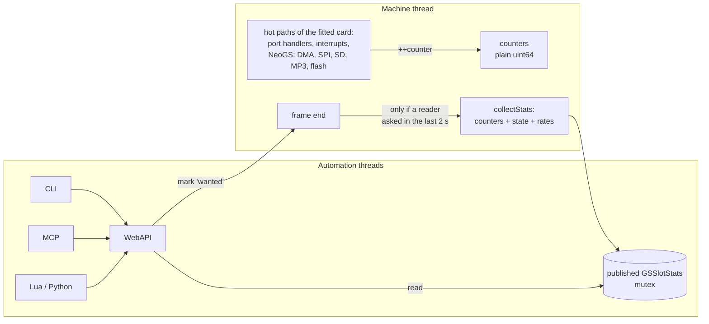

# GS-slot automation: state, statistics and control - design

Status: design, not implemented (2026-09-28).
Covers every card the GS slot can hold: the **classic GS** (LLE, Z80 +
firmware), the **lightweight player** (LW) and **NeoGS**. One mechanism, one
set of surfaces; each card fills in the sections it has.
Related: [neogs-tdd.md](neogs-tdd.md) §7.5 (today's automation),
[neogs-zxdma-design.md](neogs-zxdma-design.md) §6-§7 (ZX-DMA debugger and
automation), [diagnostics-gaps-proposal.md](diagnostics-gaps-proposal.md)
(the GS counters and the "logic on the card, surfaces forward" rule).

## 1. Goal

Software uses the GS slot in different ways: as a sound card (modules,
samples, MP3) and, on NeoGS, as a **coprocessor** - The Link
(docs/disasm/demo/thelink) plays no sound on it and renders every effect on
it, moving 7 KB a frame through ZX-DMA. Automation must show **everything**
the fitted card does:

- how many commands and data bytes went each way, how many were confirmed,
  and how many were lost;
- interrupts, the coprocessor, the audio output;
- on NeoGS also every DMA transaction, the SPI, SD card and MP3 decoder
  traffic and their errors, and the flash operations;
- on the lightweight player, its sequencer and the loaded module.

Two constraints:

1. **One surface for every card, different amounts of information.** The
   classic GS, LW and NeoGS answer the same requests with the same field
   names. A section a card does not have is simply absent, and
   `capabilities` lists what is there. Nothing existing is deprecated;
   today's fields keep their names and places.
2. **No emulation slowdown.** With no automation client reading, the cost is
   a handful of integer increments on paths that already do far more work.
   Nothing is logged per access, nothing is atomic, nothing is copied per
   frame (section 5).

## 2. What exists today

| Surface | GS slot today |
|---|---|
| Core | `GeneralSoundCard`: mailbox, status, channels, `getCPUReg`, `GSActivityCounters`; NeoGS adds `neogsState(NeoGSStateInfo&)` |
| WebAPI | `GET /state/audio/gs` (all cards; a `neogs` object on NeoGS); `POST /control/audio/gs` (resets, bytes, personality switch, module dump; NeoGS: `sd_insert`, `sd_eject`, `flash_save`) |
| CLI | `state audio gs`, `gs <action>`, `gsporttrace` |
| MCP | `inspect_state` aspect `audio_gs`; `emulator_manage` `gs_*` actions |
| Lua / Python | `gs_state()` and `gs_*` functions |
| HUD | "GS" / "NeoGS" / "NeoGS MP3" / "NeoGS+MP3", "NeoGS DMA", "NeoGS <->" |

Counters that exist: `GSActivityCounters` (CPU steps, interrupts,
DAC fetches, host commands / data - host side only), `NeoGSZxDma` (bytes
read / written / dropped, wait T-states, late starts), `NeoGSDma::bytesMoved`,
`SdCardSpi` (blocks read / written), `Vs10xxDecoder` (bytes received, frames
decoded, samples played).

Missing on every card: the card side of the mailbox (what the card read,
confirmed, answered) and a count of lost bytes (the overwrite counters that
diagnostics-gaps-proposal.md §5.1 asks for). Missing on NeoGS: DMA as
transactions, SPI per master, SD commands and errors, MP3 errors, flash
operations. Missing everywhere: a per-second view and a single error summary.

## 3. The model



- **Counters** - monotonic `uint64_t`, incremented on the machine thread only,
  where the event already happens.
- **State** - what the card is now.
- **Rates** - per second over the last 50 frames, computed at publish time,
  so every surface shows the same numbers.

`GeneralSoundCard::collectStats(GSSlotStats&)` is one virtual call: the base
class fills the common sections, each card adds its own. The published block
is the only thing automation reads; the emulator never waits for it and
nothing reads card objects from another thread (the rule
`SoundManager::generalSoundSlot()` already follows). A personality switch
publishes a block for the new card at the next frame end.

## 4. The data

JSON names; the C++ struct uses the same names in camelCase. **Cards**: GS =
classic, LW = lightweight, NGS = NeoGS.

### 4.1 `card` (all)

| Field | GS | LW | NGS |
|---|---|---|---|
| `implementation` (`lle` / `lightweight` / `ngs`), `device`, `capabilities[]` | yes | yes | yes |
| `firmware` | ROM version | "in-tree player" | flash title |
| `ram_kb`, `ready` (in its command loop) | yes | yes | yes |
| `clock_hz` | 12 MHz | - | from GSCFG0 |
| `resets` `{cold, host_33, nmi}` (counters) | yes | yes | yes |
| `gscfg0` decoded, `pages[4]`, `window_flash[4]`, `mpag`, `mpagex`, `led`, `clock_switches` | - | - | yes |

`capabilities` - the sections present: e.g. classic GS
`["mailbox","interrupts","cpu","audio","rates","errors"]`, LW
`["mailbox","player","module","audio","rates","errors"]`, NeoGS adds
`["dma","spi","sd","mp3","flash"]` to the classic list.

### 4.2 `mailbox` (all) - both sides of the host protocol

| Field | Incremented on | GS | LW | NGS |
|---|---|---|---|---|
| `host_commands` | ZX `OUT #BB` | yes | yes | yes |
| `host_data_out` | ZX `OUT #B3` | yes | yes | yes |
| `host_data_in` | ZX `IN #B3` | yes | yes | yes |
| `host_status_polls` | ZX `IN #BB` | yes | yes | yes |
| `card_commands_read` | card `IN #01` (LW: the interpreter takes the command) | yes | yes | yes |
| `card_command_acks` | card `OUT #05` (command flag cleared = confirmed) | yes | yes | yes |
| `card_data_in` | card `IN #02` | yes | yes | yes |
| `card_data_out` | card `OUT #03` | yes | yes | yes |
| `card_status_polls` | card `IN #04` | yes | - | yes |
| `command_overwrites` | ZX `OUT #BB` while the command flag was still set | yes | yes | yes |
| `data_overwrites` | a data write while the data flag was still set, either side | yes | yes | yes |
| `unconfirmed` | state: command flag set now | yes | yes | yes |

The existing `activity_counters` object stays as it is; its host-side
fields are the same numbers as the first four rows.

Worked example: The Link sends 3 commands (3, 4, 5) during the upload and
then 2 a frame (0 and 1). After 100 effect frames: `host_commands` 203,
`card_command_acks` 3, `command_overwrites` 200 - the effect loop reads the
command register directly and never clears the flag. The numbers say it
instead of leaving the user to guess.

### 4.3 `interrupts` (GS, NGS)

`accepted`, `periods` (timer ticks), `coalesced` (counters, already in
`GSActivityCounters`); NeoGS also `enable`, `request`, `tim_freq` (state) and
`accepted` per source `{timer, sd_dma, mp3_dma, software}`.

### 4.4 `cpu` (GS, NGS)

The coprocessor: the full register file (`GSCpuRegister`), `halted`,
`steps` (counter). Already exposed in part (`cpu` object); completed as
diagnostics-gaps-proposal.md §1.2 describes.

### 4.5 `audio` (all)

`channels[]` `{sample, volume}` - 4 on GS and LW, 8 on NeoGS; `mode`
(NeoGS: 4ch / 8ch / pan4ch); `dac_level` `{left, right}` (NeoGS: before the
output coupling); `volume`; `dac_fetches` (counter); `active` (the HUD's
measure).

### 4.6 `player`, `module` (LW)

The sequencer and the parsed module, as diagnostics-gaps-proposal.md §2-§3
defines them: song position, row, tick, speed, per-channel sample / volume /
period; sample and pattern tables.

### 4.7 `dma` (NGS) - transactions, not just bytes

Per module `zx`, `sd`, `mp3`:

| Field | Meaning |
|---|---|
| `selected`, `running`, `address` (21 bits), `page` | state |
| `starts`, `completions` | a CST 0->1 edge; a module finishing its work (SD: one block, MP3: one 512-byte burst, ZX: a CST 1->0 edge) |
| `bytes` | moved by this module |
| `aborts` | CST cleared before completion |
| `errors` | SD: a data token other than `#FE` (the module stops, still interrupts) |
| `busy_clocks`, `stall_clocks` | card clocks running; card clocks the CPU was held off the bus |
| `last` | the last completed transaction: `{address, bytes, clocks, frame}` |

`zx` also keeps today's fields: `mode` (off / watch / divert),
`overlay_installed`, `read_latch`, `pending` + `pending_address`,
`bytes_read`, `bytes_written`, `bytes_dropped`, `wait_tstates`,
`late_starts`, `late_start_units`, `watch_setting`, `watch_frames`,
`watch_frames_left`.

### 4.8 `spi` (NGS)

Per master `sd`, `mc` (MP3 control), `md` (MP3 data): `bytes`, `restarts`
(a byte cut off by a new one), `last_tx`, `last_rx`; `sctrl` decoded.

### 4.9 `sd` (NGS)

State: `present`, `path`, `type` (sdsc / sdhc), `size_bytes`, `initialized`,
`write_mode`, `write_protect`. Counters: `commands` by index (`cmd0` ...
`cmd59`, `acmd41`, others), `blocks_read`, `blocks_written`,
`illegal_commands`, `crc_errors`, `write_errors`, `out_of_range`,
`inserts`, `ejects`.

### 4.10 `mp3` (NGS)

State: `chip`, `running`, `dreq`, `rate`, `channels`, `bitrate`,
`input_fill`, `pcm_queued`, `gain`. Counters: `bytes_received`,
`frames_decoded`, `samples_played`, `bytes_while_busy` (sent with DREQ low -
dropped), `resyncs`, `underruns`, `control_reads`, `control_writes`.

### 4.11 `flash` (NGS)

State: `title`, `modified`, `write_mode`, `persist_path`, `busy`.
Counters: `bytes_programmed`, `program_failures` (0 -> 1 bit attempts),
`sectors_erased`, `chip_erases`, `saves`.

### 4.12 `rates` (all)

Per second over the last 50 frames: `commands`, `data_bytes` (both
directions), `interrupts`, `cpu_mhz` (card clocks run per second; GS, NGS),
`dac_fetches`; NeoGS adds `zx_dma_bytes`, `sd_dma_bytes`, `mp3_dma_bytes`,
`sd_bytes`, `mp3_bytes`.

Worked example: The Link's tunnel on NeoGS - `zx_dma_bytes` about
345,000/s (6,913 bytes a frame x 50), `commands` 100/s, `interrupts` 0 (the
effect runs with interrupts off). A module on the classic GS - `interrupts`
37,500/s, `dac_fetches` 150,000/s (four channels), `commands` a few per second.

### 4.13 `errors` (all) - one place to look

Every error counter the fitted card has, with its section, and `total`:
all cards `command_overwrites`, `data_overwrites`, `interrupts_coalesced`;
LW `param_queue_overflows` (today's `hostDataDropped` on LW); NeoGS
`zx_bytes_dropped`, `dma_aborts`, `sd_dma_errors`, `sd_illegal`, `sd_crc`,
`sd_write_errors`, `mp3_dropped`, `mp3_resyncs`, `flash_program_failures`.

## 5. Performance

### 5.1 Where each counter lives

| Counter group | Path | Frequency | Cost |
|---|---|---|---|
| mailbox, card config, resets | card and host port handlers | per port access | one increment in a function that already decodes the port and updates state |
| interrupts | the existing acknowledge path | 37.5 kHz | one increment (NeoGS: an array index by source) |
| NeoGS ZX-DMA bytes | `NeoGSZxDma` access path (already counted) | per diverted access | none new |
| NeoGS SD / MP3 DMA | `NeoGSDma` block / burst / per MP3 byte | per byte at most | one increment next to the byte copy |
| NeoGS SPI | `NeoGSSpi::deliver` | per byte | one increment |
| NeoGS SD, MP3, flash | command decode, feed, program / erase | per command / byte | one increment |
| LW player | none: the state is read from the sequencer at publish time | - | - |

Nothing is added to the CPU's per-instruction path, the memory interface or
the mixer. No `std::atomic` in the counters: one thread writes them, and only
the published copy is read elsewhere.

### 5.2 Publishing only when someone reads

- `SoundManager` keeps an `std::atomic<int64_t> _gsStatsWantedUntil`
  (a frame number).
- Every read of the published block stores `current frame + 100` (2 s)
  there.
- At frame end the machine thread does one relaxed atomic load:
  - no reader in the last 2 s: nothing else happens;
  - a reader: `collectStats` into the published block under a mutex (about
    1 KB on NeoGS, less on the others), and the counters go into the 50-frame
    ring for the rates.
- A read returns the last published block with `age_frames`. A client that
  needs a fresh value asks with `?fresh=1`: the request waits for the next
  frame end, at most one frame (20 ms).

### 5.3 Reset without a race

`reset_counters` does not zero anything on the machine thread. It stores the
current published counters as a **baseline** on the automation side, and
reads with that baseline subtract it. The machine keeps counting; two clients
can keep separate baselines. A personality switch starts a new card with its
counters folded in as today (`accumulateActivityCounters`); the baselines
stay valid.

### 5.4 Proof

- Benchmarks before / after the counters, within noise (< 1%):
  `BM_GeneralSoundFrame_*` (classic), the LW benchmarks, `BM_NeoGSFrame_*`,
  and a new `BM_NeoGSFrame_ZxDmaEffect` (The Link's tunnel loop).
- With a reader polling at 10 Hz: publish cost under 0.2% of a frame.
- `BM_PentagonFrame_NoGS`: no change (no code on that path).

## 6. TTD

- The counters are **statistics, not machine state**: not in the TTD blobs,
  not in the state hash, like the port trace.
- During a replay (seek, step back) the card runs again and the counters keep
  counting; the published block carries `replaying: true`.
- Media changes are refused while TTD records (neogs-tdd.md §7.4); the stats
  are read-only and allowed at any time.

## 7. Surfaces

The logic is on the card (`collectStats`), published by `SoundManager`, read
by the WebAPI. CLI, MCP, Lua and Python forward to the WebAPI, as every GS
action does today (diagnostics-gaps-proposal.md §6.0).

### 7.1 WebAPI

| Method and path | Returns / does |
|---|---|
| `GET /api/v1/emulator/{id}/state/audio/gs` | as today, plus `capabilities`; its `neogs` object stays on NeoGS |
| `GET .../state/audio/gs/stats` | the whole stats block of the fitted card (section 4) |
| `GET .../state/audio/gs/stats/{section}` | one section; 404 when the fitted card does not have it (the body names the card and its `capabilities`) |
| query `?fresh=1`, `?since=<baseline id>` | wait for the next frame end; counters relative to a baseline |
| `POST .../control/audio/gs` | today's actions, plus `reset_counters` (returns a baseline id) for every card; NeoGS also `zxdma_watch` (`selected` / `always`, `frames`) and `mp3_gain` (`value`) |

`/state/audio/neogs` and `/control/audio/neogs` are **aliases** of the same
paths for NeoGS sessions (the NeoGS sections and actions), for clients that
work with NeoGS only; on another card they answer 404 with the card named.

Automation never changes what the card's own program controls - clock,
paging, DMA - as on the board. The controls are the emulator's settings and
media.

### 7.2 MCP

- `inspect_state` aspect `audio_gs` as today; new aspect `audio_gs_stats`
  (whole block) accepting `audio_gs_stats.<section>`.
- `emulator_manage` gets `gs_reset_counters` (all cards) and, for NeoGS,
  `gs_zxdma_watch`, `gs_mp3_gain`, next to today's `gs_*` actions.

### 7.3 CLI

```
state audio gs                  as today (+ capabilities)
gs stats [section] [--since B]  the stats block of the fitted card, or one section
gs stats reset                  new baseline, prints its id (`gs reset` stays the card reset)
gs watch [ms]                   rates every <ms> (default 1000) until a key
gs sd insert <image> | sd eject | flash save | zxdma watch <selected|always> [frames]   (NeoGS)
```

`neogs ...` is an alias of `gs ...` for the NeoGS sections.

Worked example, `gs stats rates` during The Link's tunnel:

```
GS slot: NeoGS, rates (last 50 frames):
  commands      100/s   data  0 B/s
  ZX-DMA    345,650 B/s  read, 0 B/s written, waits 0 T
  SD DMA          0 B/s  MP3 DMA 0 B/s
  interrupts      0/s   card 24.0 MHz
errors.total 0
```

The same command on the classic GS during a module:

```
GS slot: GS (classic), rates (last 50 frames):
  commands        4/s   data 12 B/s
  interrupts 37,500/s   DAC fetches 150,000/s   card 12.0 MHz
errors.total 0
```

### 7.4 Lua / Python

`gs_stats([section], [baseline])`, `gs_reset_counters()`, and today's
`gs_state()`, `gs_*`; NeoGS adds `gs_zxdma_watch(setting, frames)`,
`gs_mp3_gain(value)`. Same tables / dicts as the WebAPI JSON; `neogs_*` names
are aliases.

### 7.5 Documentation

`command-interface.md`, OpenAPI (`openapi_state.inc`), MCP `README.md` and
tool descriptions, the Lua and Python references - with one table of
sections per card.

## 8. Tests

| File | Checks |
|---|---|
| `generalsoundcard_stats_test.cpp` (new) | The same host program on all three cards: the common sections have the same names and meanings; `capabilities` matches the sections present; a missing section answers 404 with the card named. |
| `soundchip_gs_stats_test.cpp`, `soundchip_gslw_stats_test.cpp`, `soundchip_neogs_stats_test.cpp` (new) | Each counter from a program that does exactly one thing: N commands answered and confirmed; an overwrite; on NeoGS an SD read and a bad CRC, an SD DMA block and an error token, MP3 bytes with DREQ low, a flash program and a failed 0 -> 1 program, a clock switch. |
| publishing | Nothing published without a reader; published within one frame of a `fresh` read; stops 2 s after the last read; baselines are independent; a personality switch publishes the new card. |
| automation (WebAPI / CLI / Lua) | Sections and names per card; the `neogs` aliases. |
| `soundchip_neogs_acceptance_test.cpp` | The Link: `rates.zx_dma_bytes` about 345,000/s in the tunnel, `errors.total` 0. |
| Benchmarks | Section 5.4. |

## 9. Rollout

1. Common counters (mailbox both sides, overwrites, resets) on the classic
   GS, LW and NeoGS; benchmarks before / after.
2. NeoGS counters (DMA transactions, SPI, SD, MP3, flash).
3. `collectStats` per card + publish-on-demand in `SoundManager`; the stats
   tests.
4. WebAPI `gs/stats`, `reset_counters`, the NeoGS actions and aliases;
   OpenAPI.
5. CLI, MCP, Lua, Python; docs.

Each step keeps the suite green on its own.
