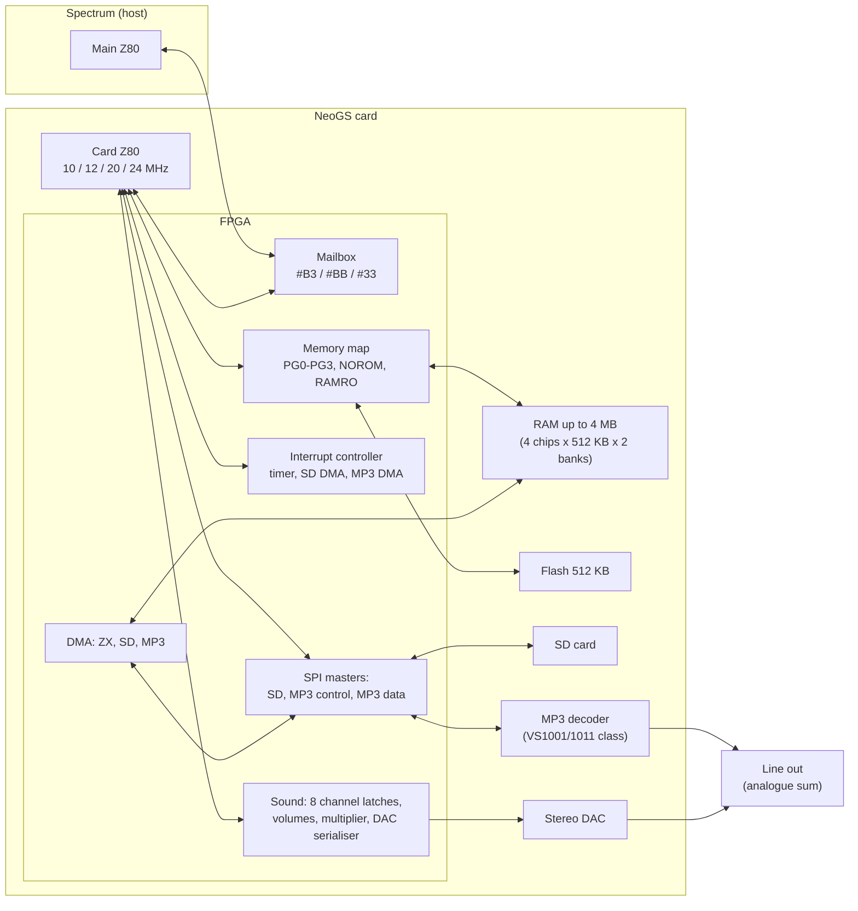
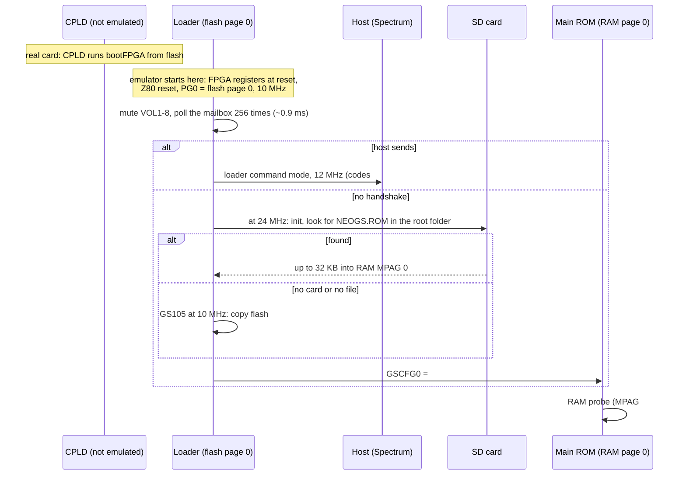
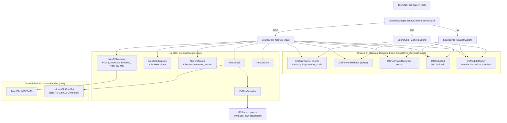
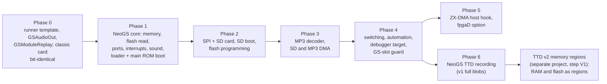

# NeoGS sound card — technical design

- **Date:** 2026-09-27. This replaces the 2026-09-19 sketch.
- **Status:** phases 0-4 and phase 6 on TTD v1 implemented (2026-09-27,
  branch `neogs`); §14 is the as-built record and lists what differs from
  this design, the findings and what is still open (phase 5: ZX-DMA and
  fpgaD; moving the TTD bulk memory to v2 regions). Review
  round 4 (§13) checked every hardware claim against the FPGA Verilog, the
  firmware, the datasheets and the unreal-ng code.
- **Scope:** a full emulation of the NeoGS card. It fits the one General
  Sound slot, so it is **mutually exclusive** with the classic GS card (LLE)
  and the lightweight card (LW). It runs the card's own flash firmware
  unchanged: the loader and the GS-compatible main ROM. It also covers SD card,
  MP3 decoder, DMA, flash programming, TTD, automation and the debugger hooks.

## 0. Summary

NeoGS (NedoPC, 2008-2026) is a General Sound clone built around an FPGA. The
card has a real Z80 and runs the same kind of GS firmware; around it the FPGA
provides 4 MB of RAM, 512 KB of flash, four switchable memory windows, eight
DAC channels, an interrupt controller, DMA, an SD card slot and an MP3 decoder
chip.

The design in one paragraph:
- NeoGS becomes the third **personality** of the existing GS slot:
  `GSType=NGS`, `GSCardImplementation::NGS`, TTD peripheral id 12. Because there
  is only one slot, GS and NeoGS cannot both be fitted, and nothing else has
  to enforce that.
- The new card class `SoundChip_NeoGS` is a sibling of `SoundChip_GeneralSound`,
  not a subclass. The parts both cards need are first extracted from the
  classic card into shared components:
  - the card-CPU catch-up loop, as a template over the card, where each card
    keeps its own time unit (the classic card stays bit-identical);
  - the host mailbox;
  - the port trace;
  - the audio output stage;
  - the module replay used when switching cards.
- New, separate components carry the NeoGS hardware:
  - memory windows and flash;
  - the interrupt controller;
  - the 8-channel sound mixer;
  - the SPI bus with an SD card;
  - a VS1001 / VS1011-compatible MP3 decoder with its own audio output;
  - three DMA engines.
- Every behaviour follows the **current FPGA sources**. Where Unreal Speccy
  differs, the FPGA wins (§3.11 lists the differences).

## 1. Background

### 1.1 Terms

| Term | Meaning here |
|---|---|
| **card CPU** | The Z80 on the NeoGS card (a physical Z84C00; the FPGA is glue logic, not a soft core). |
| **host** | The Spectrum. It talks to the card through ports `#B3`, `#BB` and `#33`. |
| **FPGA** | The Altera ACEX 1K chip that implements everything on the card except the Z80, the memories and the analogue parts. Its sources are the reference for this design. |
| **CPLD** | A small second chip that loads the FPGA's configuration at power-on. After that it only answers ports `#40`-`#FF`, which the firmware no longer uses. |
| **page** | 16 KB of RAM or flash. Page number × 16 KB + (address & `#3FFF`) is the physical address. |
| **window** | One of the card CPU's four 16 KB address ranges (`#0000`, `#4000`, `#8000`, `#C000`). Each has its own page register. |
| **flash** | The card's 512 KB rewritable ROM (a 29F040B: ST M29F040B, AMD Am29F040B compatible). It holds the loader, the main ROM and the FPGA configuration. |
| **loader** | The first program the card CPU runs from flash. It copies the main ROM into RAM, or loads another one from the SD card. |
| **main ROM** | The GS-compatible firmware (v1.11 in the current sources). It runs from RAM. |
| **SPI** | A serial bus: the FPGA exchanges one byte at a time with the SD card or with the MP3 decoder. |
| **VS1001** | The MP3 decoder chip family (VLSI Solution VS1001 / VS1011; the board uses MA8201 clones). |
| **DMA** | Transfers the FPGA does without the card CPU: SD card → RAM, RAM → MP3 decoder, and host ↔ card RAM. |
| **base tick** | The NeoGS card's internal time unit: 1/120,000,000 s. All four card clock rates and the 24 MHz crystal are a whole number of base ticks (§5.2). The classic card keeps its 12 MHz cycle. |
| **personality** | Which card sits in the GS slot: LLE (classic GS with firmware), LW (lightweight player), NGS (this design). |

### 1.2 Sources used (all verified 2026-09-27)

| Source | What it gives | Location |
|---|---|---|
| NeoGS FPGA, current | The hardware behaviour: ports, memory map, interrupts, sound, SPI, DMA | `emulators/github/neogs/fpga/current/` (git-svn mirror of NedoPC `ngs`, HEAD `b45d5f8`, SVN r191) |
| NeoGS FPGA, fpgaD | The older revision (2 MB, fixed windows 0/1, no DMA or interrupt controller) | `materials/neogs/fpgaD/`, `neogs/fpga/obsolete/fpgaD_release/` |
| NeoGS firmware sources | Loader, main ROM v1.11, FPGA boot program, flasher, flash-image build | `emulators/github/neogs/z80/` (assembler: AS `asw`/`asl`, in `neogs/tools/`) |
| Port definitions | Names and bits | `neogs/z80/ports_ngs.a80`, `materials/neogs/ports.inc` (identical to `neogs/docs/ports.inc`) |
| SPI and ZX-DMA notes | Timing rules for software | `neogs/docs/spi_doc.txt`, `neogs/docs/dma_zx_doc.txt` (CP1251) |
| Unreal Speccy | A working NeoGS emulation, used for comparison only | `emulators/github/unreal-speccy/gsz80.cpp`, `vs1001.cpp`, `sdcard.cpp` |
| VS1001 datasheet | Decoder registers and protocol | `materials/neogs/vs1001_datasheet.pdf` |
| Board BOM and flash notes | Flash chip (29F040, PLCC32), decoder alternatives | `neogs/pcad/revC-VS/NeoGS.bom`, `neogs/z80/pgmflash/README`, `neogs/z80/flasher00/readme.txt` |
| minimp3 | MP3 decoder library (CC0) | upstream `lieff/minimp3`; local copies in `emulators/github/mame/3rdparty/minimp3/`, `zxtune/3rdparty/minimp3/` |

Paths starting with `emulators/github/` are under `/Volumes/TB4-4Tb/Projects/`.
Paths starting with `materials/` are under
`docs/inprogress/2026-09-19-general-sound/`.

### 1.3 What already exists in unreal-ng

| Piece | State | Where |
|---|---|---|
| `GSTypeKind::NGS` | Parsed from `[SOUND] GSType=NGS`. The `SoundManager` constructor creates a card only for Z80 and LW, so NGS **silently** gets no card; the factory's warning branch is only reached through a switch request, which rejects NGS first | `platform.h:421-428`, `config.cpp:457-459`, `soundmanager.cpp:139, 1395-1412, 1510` |
| `GSCardImplementation::NGS` | Enum value only | `generalsoundcard.h:34-39` |
| `ttd::PeripheralId::NeoGS = 12` | Reserved | `ttdserializable.h:54`, `ttd.ksy` |
| `[NGS] RamSize`, `SDCardImage`/`SDCARD`, `MP3Support` | Parsed into `gs_ramsize`, `ngs_sd_card_path`, `ngsMP3SupportKind` (code default `stub`), under `#ifdef MOD_GSZ80`; **read by nobody** except the BUG-6 guard test | `config.cpp:505-530`, `platform.h:699-707` |
| Placeholder tests | Assert that NGS creates no card; the comment "the NeoGS card will extend SoundChip_GeneralSound" is stale | `soundchip_gs_test.cpp:759-770`; switch rejection in `soundchip_gslw_test.cpp:1588, 1610` |
| BUG-6 guard | `RamSize_NeoGSConfigDoesNotLeakIntoClassicCard` writes `config.gs_ramsize` | `soundchip_gs_test.cpp:772-786` |
| SD card, SPI, flash, MP3 decoding | **None** in core. The Z-Controller SD port on ATM3 is a stub, and nothing parses `[ZC] SDCARD`. miniaudio (with its `dr_mp3`) is compiled only into unreal-qt, with `MA_NO_DECODING` | `ports/models/portdecoder_atm3.cpp:45-55`, `unreal-qt/src/emulator/soundmanager.cpp:17` |
| Known-ROM table | Host ROMs only (16 hashes). Card images never pass through it | `rom.cpp:23-55` |

Two shipped facts to fix along the way:
- Every shipped `[NGS]` section has only `RamSize=2048`. The `SDCARD=wc.img`
  lines sit in `[ZC]`, so the NeoGS SD path is always empty.
- `data/rom/bootGS.rom` (SHA-256 `37b14b25…`) is an **old NeoGS flash image**:
  loader 2314 bytes, main ROM "Version 1.08", old FPGA configuration. Yet
  `data/configs/profi/unreal.ini` uses it as a GS ROM (`GS=rom\bootgs.rom`
  with `GSType=BASS`).

## 2. Goals and non-goals

**Goals**

1. Run the real flash image (loader, then main ROM) unchanged, including the
   RAM-size detection, the 20 MHz clock choice and the SD boot path.
2. Be cycle-faithful where software can observe it:
   - card CPU clock (10/12/20/24 MHz, switchable at run time);
   - interrupt timing and vectors;
   - DAC sampling at 37.5 kHz;
   - SPI byte timing;
   - DMA bus stalls.
3. Reproduce the analogue output digitally as the FPGA computes it (16-bit
   signed per side), plus the MP3 decoder's output.
4. Stay deterministic: TTD replays are exact, and so is the MP3 decoder.
5. Cost nothing when no NeoGS is fitted, and cost little when idle.
6. Share code with the classic card instead of copying it; the debugger design
   (`docs/inprogress/2026-09-27-gs-debugger/`) works for both.

**Non-goals**

- The CPLD and the FPGA configuration process: the card starts as "FPGA
  configured" (§4.2).
- Analogue behaviour (filters, DC offsets) beyond a gain setting.
- Board revisions other than the current FPGA and fpgaD (§3.12).
- A NeoGS mode for the LW player.

## 3. Hardware model

All facts in this section are from `neogs/fpga/current/` unless marked. File
references are relative to it.

### 3.1 Block diagram



### 3.2 Memory

**Page register → physical memory** (`memmap/memmap.v:73-128`):

| Page byte bits | Meaning |
|---|---|
| 4:0 | page within a 512 KB chip (32 pages) |
| 6:5 | which of 4 RAM chips |
| 7 | second bank (MA21), for 4 MB boards |

- RAM is 256 pages = 4 MB. On 2 MB boards bit 7 has no effect, so pages
  128-255 mirror 0-127. Config `RamSize` chooses 2048 or 4096 KB (§6).
- **ROM mode** (`GSCFG0.NOROM = 0`, the reset state): windows 0, 2 and 3 read
  **flash**, using page bits 4:0 only, so 32 flash pages mirror through the
  whole byte. Window 1 (`#4000`) is **always RAM**.
- **RAM mode** (`NOROM = 1`): all four windows read RAM.
- **Write protection** (`RAMRO = 1` and `NOROM = 1`): writes are blocked to
  any page whose bits 6:1 are 0, i.e. RAM pages 0, 1, 128 and 129, in **any**
  window (`memmap.v:125-128`).
  - **A real quirk on 4 MB boards.** The main ROM runs with RAMRO on
    (`GSCFG0 = #23`), and its page list covers MPAG `#02`-`#7F`. MPAG `#40`
    maps pages 128 and 129, which RAMRO protects, so that 32 KB is not
    writable. A module uploaded across it loses those bytes. This is how the
    hardware behaves: the emulator reproduces it, and a test pins it.
- **Flash writes** are passed to the flash chip, which ignores them unless
  they form a command (§3.8).
- **Reset:**
  - PG0 = 0 (flash page 0: the loader);
  - PG1 = 3;
  - PG2 and PG3 are **not reset** in the FPGA. The emulator sets them to 0 and
    2 and documents this choice, so a replay is deterministic.

**Worked example.** Main ROM running normally: `GSCFG0 = #23`, `MPAG = 5`.

| Window | Page | Physical RAM |
|---|---|---|
| `#0000` | PG0 = 0 | `#000000` (write-protected, the ROM copy) |
| `#4000` | PG1 = 3 | `#00C000` (firmware variables and DAC buffers) |
| `#8000` | PG2 = `{5<<1 \| 0}` = 10 | `#028000` |
| `#C000` | PG3 = 11 | `#02C000` |

`#4000` shows the same cells as `#C000` under MPAG 1, as on the classic GS
(see BUG-10 in `verification-findings-and-bugs.md`).

### 3.3 Card-side ports

The FPGA decodes A5..A0 of ports `#00`-`#3F` (A7 = A6 = 0) and ignores
A15..A8, so every port repeats every 256 addresses (`ports/ports.v:242`).
- **Reads of `#00`-`#3F`.** The FPGA drives the data bus on every one of them
  (`ports.v:267-273`). An undefined port, or an undefined bit, returns the
  synthesiser's "don't care" value, which is not knowable from the sources.
  The emulator returns `#FF` for undefined ports and `1` for undefined bits.
  That covers status bits 6:1 (`#7E` idle, as on GS), CST bits 6:0 and
  `#1C`-`#1F` when DMA_MOD is not 1-3.
- **Ports `#40`-`#FF`.** After configuration the CPLD leaves the bus floating
  (`cpld/cpld6_revC_onlyclock/GS_cpld.v`), so reads give `#FF`. Writes are
  ignored, except **`#80`**. That is the CPLD's FPGA reconfiguration port.
  The flasher writes it after reprogramming the flash (§3.8) to restart the
  card. The emulator treats any write to `#80` as a cold restart of the card,
  the same as power-on.
- **No card-side wait states.** The FPGA has no WAIT output to the card Z80
  (`top.v`).

| Port | Dir | Function | Reset |
|---|---|---|---|
| `#00` MPAG | W | Normal: PG2 = `{d6..d0,0}`, PG3 = `{d6..d0,1}`. EXPAG: PG2 = `{d6..d0,d7}` (rotate left). | — |
| `#10` MPAGEX | W | EXPAG only: PG3 = `{d6..d0,d7}` | — |
| `#20`-`#23` PG0-PG3 | W | Raw page byte for each window | PG0 = 0, PG1 = 3 |
| `#01` | R | Command from host (`#BB`) | — |
| `#01` | W | LED: d0 = 0 on, 1 off | on |
| `#02` | R | Data from host (`#B3`); clears the data bit | — |
| `#03` | W | Data to host; sets the data bit | — |
| `#04` | R | Status: bit 7 data bit, bit 0 command bit; bits 6:1 undefined (emulated as 1, `#7E`, as on GS) | — |
| `#05` | R/W | Any access clears the command bit | — |
| `#06`-`#09`, `#16`-`#19` | W | VOL1-VOL8; bits 5:0 used; always stored, in every mode | 0 |
| `#0A` | R/W | Any access: data bit ← NOT PG2 bit 0 | — |
| `#0B` | R/W | Any access: command bit ← bit 5 of VOL4 (`#09`) | — |
| `#0C` INTENA | W | d7 = set/clear, d2:0 = mask (timer, SD DMA, MP3 DMA) | `001` |
| `#0D` INTREQ | R/W | Read `{00000,req}`; write as INTENA | `000` |
| `#0E` TIM_FREQ | W | d2:0 = timer divider index (§3.5) | 0 |
| `#0F` GSCFG0 | R/W | Bit 0 NOROM, 1 RAMRO, 2 8CHANS, 3 EXPAG, 5:4 clock, 6 PAN4CH, 7 INV7B | `#30` |
| `#11` SCTRL | R/W | Write: every bit set in d5..d0 takes the value of d7. Bits: 0 SD nCS, 1 MP3 control nCS, 2 MP3 XRESET (1 = run), 3 MCSPD0, 4 MDHLF, 5 MCSPD1. Read `{00, bits 5:0}`. | `#0B` |
| `#12` SSTAT | R | `{0000, MCRDY, SD_WP, SD_DET, MP3 DREQ}` | — |
| `#13` | W / R | SD_SEND (starts an exchange) / SD_READ (last received byte) | — |
| `#14` | R / W | SD_RSTR (returns the last byte and starts an exchange sending `#FF`) / MD_SEND (MP3 data) | — |
| `#15` | W / R | MC_SEND / MC_READ (MP3 control) | — |
| `#1B` DMA_MOD | R/W | d2:0 selects the DMA module shown at `#1C`-`#1F`: 1 ZX, 2 SD, 3 MP3 | 0 |
| `#1C`-`#1F` | R/W | HAD (6 bits stored and read back, address 21:16), MAD, LAD, CST (bit 7 = run; bits 6:0 read as 1) of the selected module. **HAD bit 5 has no effect**: see §3.9 | — |

**Clock select** (GSCFG0 bits 5:4): `#00` = 24 MHz, `#10` = 12 MHz, `#20` =
20 MHz, `#30` = 10 MHz. So the card leaves reset at **10 MHz**.
- The CPLD switches clocks through a glitch-free synchronised multiplexer
  followed by a /2 stage (`clocker.bdf`). The clock pauses for a few source
  cycles and no wait is inserted. The emulator applies the new clock from the
  next instruction (§5.2) and ignores the pause.
- Every FPGA timing counted in "clocks" (reset stretch, NMI pulse, SPI) uses
  the **card CPU clock**, so its length in time depends on the selected clock.
  Only the timer and the DAC run from the fixed 24 MHz crystal.

### 3.4 Host-side ports

The FPGA decodes the low 8 address bits exactly (`zxbus/zxbus.v:217-227`). The
host machine's own port decoder decides which host addresses reach the card;
unreal-ng already has those tables for GS (§7.3).

| Port | Access | Effect |
|---|---|---|
| `#BB` | W | Command latch ← byte; command bit ← 1 |
| `#BB` | R | Status: bit 7 data, bit 0 command; bits 6:1 are FPGA-driven "don't care" (emulated as 1, giving `#7E` idle as on GS) |
| `#B3` | W | Data latch ← byte; data bit ← 1 |
| `#B3` | R | Card's reply byte; data bit ← 0 after the cycle |
| `#33` | W | Decoded on d7..d5 **exactly**: `100` resets the card, `010` sends an NMI, `001` toggles the LED; anything else (e.g. `#C0`) does nothing |
| `#33` | R | Data not driven (`#FF`), but the card still asserts IORQGE, so no other host device answers it |

- The mailbox latches and the two bits have **no reset**: a card reset keeps
  them.
- The bit changes reach the card side 2-3 FPGA clocks later. The emulator
  applies them at once. This is safe because catch-up (§5.3) already orders
  every host access against card time.
- **A card reset restarts the whole card from the loader.** It resets the
  FPGA registers, which sets `GSCFG0 = #30` (ROM mode) and PG0 = 0.
  - The main ROM copy in RAM survives, but the loader copies it again anyway.
  - **Each write of `100` gives one reset** (`zxbus.v:392-464`). The write
    flips a toggle; the card clock sees the flip as an edge and pulls
    `rst_from_zx_n` low. The resulting internal reset clears the request
    again. `common/resetter.v` stretches the reset to about 12 card CPU
    clocks in all (2 sync + 8 count + 1, after a 2-clock path). The emulator
    treats it as instant.
  - **What a card reset does not clear.** The FPGA has no reset clause for:
    - the eight sample latches and eight volumes (`mem512b`), so the DAC
      keeps playing the old values until the firmware rewrites them (the
      loader mutes the volumes at once);
    - PG2 and PG3, the `#03` reply latch, the VOL4 bit 5 copy used by `#0B`;
    - the three DMA address registers (only the run bits reset);
    - the SPI masters: an exchange in progress completes;
    - the timer and DAC dividers (§3.5).
- **Resets from outside the card** (board netlist
  `neogs/pcad/revC-VS/NeoGS.sch`):
  - **Spectrum reset.** ZX-BUS `/RES` (connector pin 50) goes through an
    inverter (D1, 74HC04), transistor VT1 and **jumper J1** to `~WARMRES`,
    the FPGA's second reset input (`top.v:333-334`). With J1 fitted a Spectrum
    reset is exactly a card reset as above; without it the card ignores it.
  - **Power-on and the reset button** (supervisor DA4, button S1) drive
    `~COLDRES`. The CPLD uses it to reconfigure the FPGA, and the card
    restarts from scratch, mailbox included.
- **What the emulator implements (decided 2026-09-27).** Any emulator reset is
  a cold boot of the whole machine and resets the NeoGS completely: FPGA
  registers, mailbox, CPU, and the loader starting again. Separate resets of
  the Spectrum and the card (J1 / warm reset, the `GSReset` option) are not
  implemented for NeoGS for now. The software-driven card reset through host
  port `#33` is implemented, because programs use it.

### 3.5 Interrupts

- **Timer.** It runs from the fixed 24 MHz crystal, independent of the card
  CPU clock: 24 MHz / 5 / 128 = **37,500 Hz**. TIM_FREQ divides it by 1, 2,
  4, 8, 16, 64, 256 or 1024 (`interrupts/timer.v:33-60`).
  - The divider chain is free-running. Only power-up clears it: neither a
    card reset nor a TIM_FREQ write does. The emulator keeps one **24 MHz
    phase counter** for the card, shared with the DAC (§3.6), cleared only
    on a cold boot.
  - A tick is the falling edge of the counter bit that TIM_FREQ selects.
    Changing TIM_FREQ from a selection whose bit is 1 to one whose bit is 0
    produces **one immediate extra tick** (`timer.v:50-78`). The emulator
    reproduces this: on a TIM_FREQ write it compares the old and new bits at
    the current phase.
  - The tick passes a 3-flop synchroniser on the card clock, so it reaches
    the interrupt controller 2-3 card clocks late. The emulator uses a fixed
    delay of 2 card clocks.
- **Controller.** Three request bits:
  - bit 0, timer;
  - bit 1, SD DMA done;
  - bit 2, MP3 DMA done.

  Each request is masked by INTENA. `/INT` is a **level**, held while any
  enabled request is pending. It is not a pulse (`interrupts.v:95-112`).
- **Priority** is timer, then SD, then MP3. The choice is latched at the start
  of every M1, and the acknowledge clears the request chosen there.
- **Software access.** A write to INTREQ with d7 = 1 sets requests, with
  d7 = 0 clears them. When a hardware request and a clear arrive in the same
  clock (from software or an acknowledge), the hardware request wins
  (`interrupts.v:81-86`).
- **Vector** on the bus is `{11, 1, ~p2, ~p1, 111}`: timer `#FF` (so IM 1 and
  `RST 38` work), SD `#F7`, MP3 `#EF`.
- **Missed ticks.** A request that is already pending absorbs further timer
  ticks.
- **NMI** comes only from host `#33` = `010`, as a 4-card-clock pulse. The
  emulator delivers it at the next card instruction boundary, as for GS.
- **What the firmware relies on.** The main ROM stays in DI and IM 0 while
  idle. It enables interrupts only for quantum playback, where it sets IM 1 or
  IM 2 (its IM 2 table is 257 bytes of `#42`, so any vector works). In IM 0
  the timer vector `#FF` executes as `RST 38`, so that vector must be exact.
  It never writes INTENA or TIM_FREQ and relies on their reset values `001`
  and 0. No firmware or host program in the sources uses the SD or MP3 DMA
  interrupts, INTREQ or TIM_FREQ. They are still implemented from the
  Verilog, with unit tests as the only check.

**Worked example.** At 20 MHz with TIM_FREQ = 0, the timer fires every
20,000,000 / 37,500 = 533⅓ CPU cycles. In base ticks (§5.2) that is 3,200
ticks, and one CPU cycle at 20 MHz is 6 ticks. So interrupts land after 533
or 534 cycles, alternating so that three periods take exactly 1,600 cycles.

### 3.6 Sound

**Sample capture** (`ports.v:245, 311-320, 551-569`):
- Any memory read in `#6000`-`#7FFF`, including opcode fetches, copies the
  byte read into a channel latch. This depends on the **CPU address only**,
  whatever page window 1 shows.
- The channel is A9:A8 in 4-channel mode and A10:A8 in 8-channel mode.

**Multiplier** (`sound/sound_mulacc.v:113`, `sound_main.v:190-220, 290-345`):
- Each channel contributes sample × volume.
- The sample is treated as signed with its top bit flipped, sign = NOT(d7 XOR
  INV7B). With INV7B = 0 the byte is unsigned with `#80` as silence (GS
  convention); with INV7B = 1 it is two's complement.
- Volume is 0-63.

**Output mix per side**, as 16-bit two's complement:

| Mode | Left | Right |
|---|---|---|
| 4 channels | 2 × (c1·v1 + c2·v2) | 2 × (c3·v3 + c4·v4) |
| 8 channels (`8CHANS`) | c1·v1 + c2·v2 + c5·v5 + c6·v6 | c3·v3 + c4·v4 + c7·v7 + c8·v8 |
| `PAN4CH` (only when 8CHANS = 0) | c1·v1 + c2·v2 + c3·v5 + c4·v6 | c1·v3 + c2·v4 + c3·v7 + c4·v8 |

- **The DAC takes a new stereo frame every 1/37,500 s** (LRCK = 24 MHz / 640).
  The two sides are computed separately:
  - The mixer runs every 320 crystal clocks (75 kHz) and computes **one side**
    each time, alternately (`sound_main.v:173-177, 303-351`). So L and R are
    sampled from the latches 13.3 µs apart (1,600 base ticks), and each side
    is output about half a frame after it is computed.
  - INV7B, 8CHANS and PAN4CH are applied at mix time
    (`sound_main.v:164-169`). Changing them re-interprets bytes that are
    already latched.
  - The DAC counter and the timer counter are the same /5, /128 chain on the
    same crystal, both cleared at configuration, so they are **phase-locked**:
    a TIM_FREQ 0 timer tick coincides with the start of the left half-frame
    (`timer.v:33-47`, `sound_dac.v:58-70`). The emulator derives both from
    the one 24 MHz phase counter (§3.5), as two events 1,600 ticks apart.
- **Hard stereo.** The classic GS emulation cross-feeds 50%; NeoGS doesn't.
- **Worked example, 4-channel mode.** Channel 1 holds `#FF` (+127) at volume
  63, channel 2 holds `#80` (0). Then L = 2 × (127·63 + 0) = 16,002, just
  under half of full scale.

### 3.7 SPI, SD card and MP3 decoder

**Masters** (`common/spi.v`, `top.v:816-856`): mode-0 SPI masters clocked by
the **card CPU clock**. The SCK divider is /2, /4, /8 or /16.

| Channel | Divider | Pacing |
|---|---|---|
| SD | always /2 | A byte takes 16 CPU clocks; software must wait. There is no ready bit (`docs/spi_doc.txt:172-178`). |
| MP3 control (SCI) | MCSPD bits | MCRDY in SSTAT bit 3 |
| MP3 data (SDI) | /2, or /4 with MDHLF | BSYNC generated in hardware during bit 7 (VS1001 style); no chip select |

**Signals:**
- DREQ goes straight to SSTAT bit 0.
- XRESET is SCTRL bit 2.
- SD_DET and SD_WP are the slot switches.

**Timing rules for the emulator** (`common/spi.v`, `top.v:816-856`):
- **Byte time.** At /2 a byte takes **16** card clocks. At /4, /8 and /16 it
  takes 8 × divider + 2 clocks (34 at /4). DMA engines pace themselves on the
  ready signal, which adds 2 clocks: **18** clocks per byte at /2.
- **Reading early.** A read of the result before the byte completes returns
  the previous byte, as on the real card.
- **Boundary is inclusive.** An access exactly 16 clocks after the start sees
  the finished byte. The loader depends on this: `OUT (C),A / NOP /
  OUT (C),A` and `IN (C) / NOP / IN (C)` are exactly 16 T apart
  (`loader_ngs.a80` `OUT_COM`, `SECM200`). Both accesses are timed at the
  same point inside their instruction, so the spacing in the emulator is
  also exactly 16.
- **A new start during an exchange restarts it.** At /2 a write (or an
  SD_RSTR read of `#14`) during an exchange aborts the byte in flight and
  starts the new one: the counter returns to 0 and the new byte is loaded
  (`spi.v:25-27, 110-114`). The receive register keeps its old value until
  the new byte completes. At /4-/16 a start is accepted only on the internal
  enable clock; otherwise it is lost but the phase counter still resets. The
  emulator models the restart at every divider and treats the rare lost start
  as a restart as well. The SD card or decoder model receives the truncated
  byte as "no byte" and logs it.
- **CPU and DMA share the SD master.** Their start strobes are ORed
  (`top.v:852`), so a CPU access to `#13` or `#14` during an SD DMA transfer
  corrupts that transfer. The emulator reproduces this.
- **MCRDY** is the FPGA master's ready bit, not a busy flag from the decoder.

**The decoder** is an MA8201 / MA8201A, a clone of VS1001 / VS1011, with a
14 MHz crystal and the clock doubler enabled (`spi_doc.txt:275-307`). The
revC-VS BOM also lists a VS1033 as an alternative fit
(`pcad/revC-VS/NeoGS.bom:159`):
- Control goes through SCI: 16-bit registers, read or write.
- MP3 bytes go through SDI while DREQ = 1.
- Its analogue output is summed with the DAC's on the board.
- **Software tells the chips apart** by STATUS bits 6:4 (bits 7:4 in Neo
  Player Light) and behaves differently for each (§5.6), so the emulator
  models the chip type as a setting.

### 3.8 Flash

**The chip.** The BOM lists a "29F040" in PLCC32 (`pcad/revC-VS/NeoGS.bom:9`).
`z80/flasher00/readme.txt` says the boards carry the **ST M29F040B**, and
`z80/pgmflash/README:67-71` says the code was tested on it and "should work"
with the AMD **Am29F040B**. Both "B" parts unlock at `555`/`2AA`. The
original Am29F040 (no B) unlocks at `5555`/`2AAA` and would not work with the
NeoGS flasher, so it is not modelled.

The chip is modelled as a **29F040B**:
- 8 sectors of 64 KB;
- unlock cycles compare address bits **A10..A0 only**;
- read-array, reset (`F0`), autoselect, byte program (`A0`), sector erase
  (`80`, then `30` per sector) and chip erase (`80`, then `10`);
- autoselect IDs are a setting: ST `20`/`E2` (the default, as fitted) or AMD
  `01`/`A4`. No NeoGS program reads them; the host-side `pgmflash` knows both;
- status while busy: DQ7 inverted data, DQ6 toggling on every read, DQ5 set
  on a failure. The status is returned at **any** chip address, because the
  flasher polls `#8000` of the current page rather than the target address;
- programming only clears bits. Programming a 0 back to 1 fails: DQ5 is set
  and the chip stays in status mode until `F0`;
- the sector-erase command window (more `30` commands accepted for 50 µs) is
  modelled; erase suspend and resume (`B0`/`30`) are not, as nothing uses them.

**What the flasher does** (`z80/flasher/flasher.a80`, host side, and
`flasher_ngs.a80`, card side). Flashing needs SD (phase 2) and main ROM
commands `#11`, `#13`, `#14` and `#15`:
1. The host resets the card (`#33` ← `#80`) and sends main ROM command `#F3`.
   It detects NeoGS with command `#11`, which reads card port `#0F`; `#FF`
   means "not NeoGS". Command `#15` reads the version.
2. It uploads a mini-loader to `#5800` (`#14`) and runs it (`#13`). The
   mini-loader receives `loader_ngs.rom` over the mailbox, puts it in RAM page
   0 with `GSCFG0 = #11`, and jumps into the loader's command mode at `#0045`.
3. Loader command `#0A` reads `NGS_ROM.UPD` from the SD card into pages 2 and
   up. `#07` (status) and `#09` (CRC, expects `#80`) check it. `#06` runs the
   programming code.
4. For each 64 KB block: **sector erase only** (never chip erase), then a
   50 µs wait, then polling on the **DQ6 toggle only** (no DQ7 or DQ5 checks,
   no timeout), then byte programming with `GSCFG0 = #10`. Last, the 8-byte
   trailer at `#xFFF8` (§4.1). It sends `#99` when done.
5. Finally it writes 0 to port `#80`, the CPLD reconfiguration port, which
   restarts the whole card (§3.3).

Busy times are fixed in emulated time so that polling loops behave. They are
chosen values near the datasheet's typical times:
- program: 10 µs per byte;
- sector erase: 1 s;
- chip erase: 8 s.

The chip is visible only in ROM mode (§3.2), at the CPU addresses of windows
0, 2 and 3. Chip offsets are formed from the page bits 4:0 and the address
within the window.

**Worked example.** To erase sector 2 (`#20000`-`#2FFFF`), software writes:
`AA` to chip `#555`, `55` to `#2AA`, `80` to `#555`, `AA` to `#555`, `55` to
`#2AA`, then `30` to any address in the sector, e.g. page 8 (8 × 16 KB =
`#20000`). Chip `#555` is page 0, window offset `#0555`; with PG0 = 0 that is
CPU address `#0555`. Any page works, since only A10..A0 are compared.

### 3.9 DMA

**Common to all three modules**
- Each module has a RAM address register of 22 bits (HAD 6 bits, MAD, LAD)
  and a run bit (CST bit 7). The address increments after every byte, so
  after a 512-byte block it points just past it. Software relies on this for
  consecutive blocks.
- **Only 21 address bits reach the memory.** The sequencer that picks the
  active module passes `[20:0]` (`dma/dma_sequencer.v:168-187`), so bit 21 is
  always 0. HAD bit 5 is stored and read back but ignored: **DMA reaches only
  the lower 2 MB**, even on a 4 MB board. (Unreal Speccy's 5-bit HAD gives
  the same effective behaviour.)
- DMA never touches flash.
- **Arbitration.** When the sequencer starts from idle, priority is fixed:
  ZX, then SD, then MP3. While it is busy, pending modules take turns
  (`dma_sequencer.v:86, 177`).
- **The card CPU stalls** (BUSRQ) while the FPGA moves bytes: 2 card clocks
  per byte, back to back, inside a burst (`dma/dma_access.v:86-240`). Each
  grant also costs the Z80's BUSRQ latency (the rest of the current machine
  cycle) plus about 2 clocks of request and release. The emulator starts a
  stall at the next instruction boundary. That is the one simplification
  here: a real stall can begin between machine cycles of an instruction.
- **No interrupt or NMI is accepted during a stall.** The CPU is off the bus.

| Module | What it does | End |
|---|---|---|
| 2, SD → RAM | One 512-byte block. Software sends CMD17 (or CMD18) and drives nCS itself. SD MOSI is forced to `#FF` during the transfer. **Wait phase:** clocks `#FF` until a byte other than `#FF` arrives, with **no timeout**. **Receive phase:** if that byte is `#FE` (data token), receives 512 bytes into a FIFO while the CPU keeps running; about 18 card clocks per byte (§3.7). The two CRC bytes are clocked but not stored or checked. **Burst phase:** writes the 512 bytes to RAM (CPU stalled about 1,024 clocks); it starts while the second CRC byte is still being clocked. **Error:** if the first non-`#FF` byte is not `#FE`, the module stops at once, writes nothing, and still ends normally; the only sign is that the address did not advance (`dma/dma_sd.v:103-178`). | Clears CST bit 7; sets INTREQ bit 1 |
| 3, RAM → MP3 | Reads 512 bytes into a FIFO (CPU stalled), then sends each byte when both the SPI master is ready and DREQ = 1, checked **per byte** | Clears CST bit 7; sets INTREQ bit 2 |
| 1, ZX ↔ card RAM | Described below | Software clears CST |

Clearing CST bit 7 while a module runs aborts it. No interrupt is raised.

**The ZX module** (`zxbus/zxbus.v:160-179, 237-255`, `dma_zx.v`,
`docs/dma_zx_doc.txt`) lets the **host** read and write card RAM directly.
While CST bit 7 is set:
- Every host memory access to `#0000`-`#3FFF` is a DMA byte. That includes
  M1 opcode fetches. For example, a host IM 1 interrupt handler running from
  ROM at `#0038` consumes DMA bytes. The documentation warns about this.
- **Reads** happen only when the host ROM is paged in: the ZX-bus `/CSROM`
  signal, i.e. the host's window 0 shows ROM. The card blocks the host ROM
  (`ZXBLKROM`) and puts the card byte on the bus instead. Each read returns
  the byte fetched by the **previous** read, so the first byte is junk. The
  address advances on every card-side fetch, including that first one.
- **Writes** are captured whatever is paged in. If host RAM is paged at
  `#0000`, the write goes to **both** host RAM and card RAM.
- **/WAIT.** When the host makes any memory access to `#0000`-`#3FFF` while
  the previous DMA byte has not been transferred yet, the card holds the host
  in wait until it has (`dma_zx.v:192-204`). The card CPU stalls through
  BUSRQ for every host byte, paying the grant overhead each time.

### 3.10 LED

The LED is driven by port `#01` bit 0 (card side) and `#33` = `001` (host
side). The emulator shows it in the UI and reports it through automation.
The Verilog stores d0 as written and resets it to 0. Which level lights the
LED depends on the board: the port documentation says 0 = on, and the
emulator follows it. No firmware depends on the LED.

### 3.11 Where Unreal Speccy differs, and the choice here

The emulator follows the FPGA in every case below. Tests pin the FPGA
behaviour.

| # | Behaviour | Unreal Speccy | FPGA (this design) |
|---|---|---|---|
| 1 | Clock | always 24 MHz; config reset `0` | CKSEL honoured; reset `#30` = 10 MHz |
| 2 | Port `#0A` | data bit ← PG2 bit 0 | ← NOT PG2 bit 0 |
| 3 | Port `#0B` | bit 5 of VOL1 | bit 5 of VOL4 |
| 4 | RAMRO | windows 2 and 3 only | every window; pages 0, 1, 128, 129 |
| 5 | VOL5-8 writes | dropped unless 8CH or PAN4CH | always stored |
| 6 | Mixing | cross-feed, scaled | hard L/R, 4-channel sum doubled |
| 7 | `#33` decode | bit 7 resets, bit 6 NMIs | exact `100` / `010` / `001` |
| 8 | SCTRL | bits 3:0 kept, random reset | 6 bits, reset `#0B` |
| 9 | SD_READ / SD_RSTR | one step late; RSTR skips exchange | last byte; RSTR always exchanges |
| 10 | ZX-DMA | 5-bit HAD, any CST enables, needs ROM for writes, no WAIT | 6-bit HAD register but only 21 address bits used (so the 2 MB reach matches), CST bit 7, writes unconditional, WAIT, M1 fetches count |
| 11 | Port `#02` write / `#03` read | change the data bit | no effect |
| 12 | Window `#C000` after reset in ROM mode | flash page 1 | undefined (emulator: 2, see §3.2) |
| 13 | PG0-PG3, TIM_FREQ, INTENA/INTREQ, SD and MP3 DMA, INV7B, PAN4CH | missing | implemented |

### 3.12 Board revisions

The current FPGA is the default. **fpgaD** (2 MB boards, 2008-2013) is a
config option, `[NGS] Fpga=D`. It differs in these ways:
- window 0 is fixed to page 0 and window 1 to page 3, with no PG0-PG3 ports;
- 7-bit pages, MPAG d5..d0 only;
- no interrupt controller: every 640 crystal clocks INT is raised for a
  window of 100 crystal clocks (4.17 µs). It drops at the end of the window
  **or on the acknowledge**, whichever comes first. The vector is `#FF`;
- no DMA, TIM_FREQ or INV7B, and GSCFG0 bit 7 reads 0.

The differences are table entries in the memory map, port decoder and
interrupt source, not separate code paths. The old flash images (`bootGS.rom`,
`materials/neogs/ngsrom109/`) go with fpgaD.

## 4. Firmware and boot

### 4.1 Flash images

| Image | SHA-256 | Contents | Board |
|---|---|---|---|
| `neogs/z80/create_update/full_ngs.rom` | `f8087ecd…d3b18e` | loader at `#00000`, main ROM v1.11 at `#10000`, FPGA boot + configuration at `#70000`; 8-byte trailers ("LOADER", "ROM   ", "FPGA  ") at each 64 KB page end | current FPGA |
| `materials/neogs/ngsrom109/full_ngs.rom` | `c12a87e9…124f075` | older loader, main ROM "Version 1.08" (NeoGS build), older FPGA; no trailers | fpgaD era |
| `data/rom/bootGS.rom` | `37b14b25…` | loader 2314 bytes, main ROM with "Version 1.08", FPGA 17,396 bytes | fpgaD era |

**Layout of the current image** (verified byte for byte):
- `loader_ngs.rom` (2,476 bytes) at `#00000`;
- `neogs.rom`, the main ROM (32 KB), at `#10000`. It contains "Version 1.11"
  at `#10130`, and also an older "Version 1.04 Beta" string at `#10095`, so a
  version check must not take the first match;
- `bootFPGA.crc` (18,770 bytes: the FPGA boot program plus the MegaLZ-packed
  configuration) at `#70000`;
- `#FF` everywhere else;
- 8-byte trailers at `#0FFF8`, `#1FFF8` and `#7FFF8`: 6 ASCII bytes
  ("LOADER", "ROM   ", "FPGA  ") plus a packed little-endian date whose bit
  15 means "stable" (07.02.26 for loader and ROM, 19.01.11 for FPGA). Loader
  command `#08` reads them, so they are part of the protocol, not decoration.

The old images both hold main ROM 1.08, no trailers, and a 17,396-byte FPGA
page (the same bytes as `create_update/fpga__.bin`). Their loaders are 2,314
bytes (`bootGS.rom`) and 2,376 bytes (`ngsrom109`). That they belong to fpgaD
is inferred from their date, not verified.

**Rebuilding the image.** `neogs/z80/create_update/build_full_rom.bat` builds
the main ROM, the loader and the FPGA boot program with AS and packs the FPGA
configuration. It cannot run as is:
- the AS binaries in `neogs/tools` are Win32 only;
- the MegaLZ packer `mhmt` exists only as a Windows `.exe` and a 32-bit Linux
  binary, with no source;
- the scripts call missing `setpath_*.bat` files and copy to a hard-coded
  `D:\` path.

So the check is split:
- `tools/neogs/pack_flash.py` rebuilds `full_ngs.rom` from its three parts
  plus the trailers, and CI checks the result byte for byte. This is exact
  and cheap.
- The FPGA page (`bootFPGA.crc`) is imported as a binary.
- Reassembling the Z80 parts needs AS built from source (it is portable C).
  That is done once, when the debugger's symbol build (§7.6) needs it, not
  in CI.

**Shipping.**
- The current image goes to `data/rom/neogs/full_ngs.rom`.
- **Image identification.** The known-ROM table in `rom.cpp` covers host
  ROMs only. The card computes the SHA-256 of its flash image when loading
  it and looks it up in its own small table (`neogsflashimages.h`): "NeoGS
  flash v1.11" (`f8087ecd…`), "NeoGS flash v1.08" (`37b14b25…`, `c12a87e9…`).
  An unknown image is still loaded, with a log line. The GS debugger's digest
  table (its design §6) reuses this table.
- The profi config line is fixed separately (§11.5).
- The NeoGS sources and images are treated as MIT (no licence file upstream)
  and get a row in THIRD_PARTY_NOTICES.

**Host programs and old images.** The test programs and Neo Player Light
patch the main ROM at hard-coded v1.11 addresses (for example `#11D6`,
`#0942` and the command table at `#0300`). They are expected to fail on the
v1.08 images, so the acceptance tests (§8) use v1.11 only.

### 4.2 Boot



**Clock during boot** (all from `loader_ngs.a80`):

| Stage | GSCFG0 | Clock |
|---|---|---|
| Mailbox poll | `#30` (reset) | 10 MHz |
| SD probe and SD load (`LOAD_SD`) | `#01` | 24 MHz |
| GS105 copy | `#30` / `#31` | 10 MHz |
| Handshake command mode | `#11` (RAM mode, RAMRO off) | 12 MHz |
| Main ROM | `#23` (loader line 430) | 20 MHz |

**The handshake** (`loader_ngs.a80:41-129`):
- Each handshake byte must be written to **both** `#B3` and `#BB`. The loader
  compares the command latch with the data latch.
- One poll is 256 × 35 T = 8,960 card clocks, about 0.9 ms at 10 MHz, or about
  3,150 host T-states on a 3.5 MHz Spectrum. That is the time the host has for
  `#55` after the card leaves reset. After the loader clears the command bit,
  `#AA` gets another 0.9 ms.
- In practice the host writes `#55` into both latches **before** it resets
  the card with `#33` ← `#80`. This works because the mailbox survives a card
  reset (§3.4).
- Command mode dispatches `#00`-`#0B` through a table and answers `#1D` with
  `#76`. Anything from `#0D` up, including `#F3`/`#F4`, goes to GS105.
- **Firmware bug, reproduced as is:** the range check
  `CP (FLOADE-FLOADER)/2+1` (line 114) also accepts `#0C`, which jumps
  through whatever follows the table.
- No program in the sources uses the handshake itself. `test_ngs` has it
  under `IF 0`, and the flasher enters command mode another way (§3.8).

**SD boot** (`LOAD_SD`, line 596 on). The loader never reads SD_DET; it
simply tries.
- Init: CMD0 (up to 256 tries), CMD8, then CMD55 + ACMD41 until ready, with
  HCS set when CMD8 was accepted. That loop has **no timeout**. Then CMD59
  (CRC off) and CMD16 (512 bytes). All three drivers in the sources use this
  sequence (`loader_ngs.a80:607-663`, `main_rom/ngs_sd_drv.a80:59-120`,
  `zx/Neo_Player_Light/sd_on_ngs.a80:109-160`).
- Each read: CMD58 (checks CCS, OCR bit 30, to choose byte or block
  addresses), then CMD18 (multi-block read), then CMD12. It never uses
  CMD17. SDHC is supported.
- File systems: FAT12, FAT16 and FAT32, found through an MBR partition of
  type 1, 4, 6, `#0E`, `#0B` or `#0C`, or a bare boot sector with no
  partition table.
- It loads at most 64 sectors (32 KB) into MPAG 0.
- It leaves the SD chip select asserted: **SCTRL = `#0A`** afterwards.
- With no card, the probe takes about 22 ms at 24 MHz.

**GS105** copies flash MPAG 2 in ROM mode (`#10000`-`#17FFF`), through an
8 KB buffer at `#6000`, into RAM MPAG 0 (pages 0 and 1). It always copies:
"the main ROM copy in RAM survives a reset" matters only for loader command
`#01` (`JPLDROM`), which runs whatever is in RAM page 0 without copying.

**What the loader leaves for the main ROM:**
- GSCFG0 = `#23`; PG0 = 0 and PG1 = 3 (reset values, never written, but
  relied on: the loader's own code runs at `#4080` in RAM page 3);
  PG2 = 0 and PG3 = 1 (from MPAG 0);
- SP = `#4080`, **IM 0**, DI;
- INTENA = `001`, TIM_FREQ = 0 (reset values, never written);
- VOL1-8 = 0; LED untouched; SCTRL = `#0A` (after the SD probe).

**The main ROM** then:
- clears the command bit at start (`OUT (CLRCBIT)`, main line 83). Host
  commands sent during the boot are lost, although the host sees the bit
  clear, so a host must wait for "ready" (§7.1);
- probes RAM by writing a marker at `#8000` under MPAG `#7F`, `#3F`, `#0F`.
  NUMPG (at `#4080`) = marker − 1, so command `#23` reports **`#7E`** (4 MB),
  **`#3E`** (2 MB) or **`#0E`** (512 KB): usable 32 KB pages, excluding 0-1.
  It also writes NUMPG to the host data port at boot;
- reaches its command poll loop `COMINT_` at **`#026E`** (`IN A,(ZXSTAT)`,
  bytes `31 00 44 DB 04` at `#026B`) with RAM page 0 in window 0. The test
  programs hard-code the same address. This is the "ready" point (§7.1);
- uses only the classic GS ports (MPAG, mailbox, VOL1-8), plus `IN`/`OUT (C)`
  for commands `#10` and `#11`, which reach any card port. It never touches
  GSCFG0, PG0-PG3, SD, MP3, DMA or the LED.

**Boot cost:** poll 0.9 ms + no-card SD probe about 22 ms + GS105 about
138 ms, about **165 ms** of card time before the main ROM is ready.

**Nothing depends on** the PG2/PG3 reset values (MPAG is always written
first), the ~1 s FPGA configuration delay, or the LED.

**Boot modes** (`[NGS] Boot`):
- `loader` (default): runs the flash from page 0 as the real card does.
- `direct`: the emulator does GS105 itself and starts the main ROM in exactly
  the state listed above under "What the loader leaves": the copy of flash
  `#10000`-`#17FFF` into RAM pages 0-1, the registers, SP, IM 0, DI and
  SCTRL = `#0A`. It is for tests and quick starts only. It skips the SD path
  and the 165 ms. A test checks that `direct` and `loader` (with no SD image)
  reach `COMINT_` with identical card registers and RAM pages 0-1.

**The FPGA configuration stage is not emulated.** Its only visible effect is
the time it takes, about 1 s on the real card. The emulator starts after it.
If a program depends on that delay, `[NGS] BootDelayMs` adds it.

## 5. Architecture in unreal-ng

### 5.1 Where it plugs in



**Why a sibling class, not a subclass.**
- `SoundChip_GeneralSound`'s internals are private and non-virtual
  (`soundchip_gs.h:223-334`): memory access, port handlers, banking, sample
  output.
- Making them virtual would put an indirect call on every card memory access
  of the classic card. That costs performance and couples the two memory
  models, which differ (32K pairs vs four page registers, ROM vs flash).
- Extracting the genuinely shared parts keeps both cards simple and fast.
  - It also gives the GS debugger (`2026-09-27-gs-debugger/design.md` §4) one
    runner to hook, not two.

### 5.2 Time base

Each card counts time in **its own unit**, fixed at compile time:

| Card | Unit | CPU cycle costs |
|---|---|---|
| Classic GS (LLE) | 12 MHz card cycle, as today | 1 unit |
| NeoGS | **base tick** of 1/120,000,000 s | 5, 6, 10 or 12 ticks (24, 20, 12, 10 MHz) |

120 MHz is the least common multiple of the four NeoGS clocks and the 24 MHz
crystal (5 ticks per crystal clock), so every NeoGS event lands on an exact
tick:

| NeoGS event | Period in base ticks |
|---|---|
| Timer, TIM_FREQ 0 (37.5 kHz) | 3,200 |
| DAC side (75 kHz, L and R alternate) | 1,600 |
| SPI byte at /2 | 16 × ticks per cycle |

**Why the classic card keeps its 12 MHz unit.** Moving it to base ticks would
change behaviour and data, not just code:
- the host-to-card conversion `llround(relative × ratio)` rounds differently
  from `10 × llround(relative × ratio / 10)` whenever the fraction lies in
  [0.45, 0.5). The card would then sometimes run one more instruction before
  a host port access, which reorders the mailbox;
- the TTD fixed state (`gsCyclesAbs`, `intQuantum`, the frame bases,
  `soundchip_gs.h:190-206`), the recorded TTD fixture corpus, the port trace
  timestamps, `lastDacFetchGsCycle`, the debugger's `cardCycles()` and the
  replay constants (`soundchip_gs.cpp:776-777`) are all in 12 MHz cycles.

With a per-card unit, phase 0 is a pure refactor: the classic card's numbers
stay bit-identical.

**Host time conversion.** Each card keeps the current formula in its own unit:
`target = frameStartUnits + llround(relative × unitsPerZxTact())`, where
`unitsPerZxTact()` is built from `config.frame`, `frame_duration_us` and
`HostSpeedMultiplier` exactly as `gsCyclesPerZxTact()` is today
(`soundchip_gs.cpp:238-286`). For NeoGS the ratio is 10 × the classic one.

**A GSCFG0 clock change** takes effect from the next instruction: the runner
reads the tick cost after each instruction, so the instruction that wrote
GSCFG0 is charged at the old rate.

**The 24 MHz phase.** NeoGS keeps one counter of crystal clocks (tick / 5),
cleared only by a cold boot. The timer and the DAC both derive from it
(§3.5, §3.6).

**Audio clock.** blip_buf is not run at 120 MHz: `clock × factor` gets close
to 64-bit overflow at 2.4 M ticks per frame with high output rates. NeoGS
feeds blip at the **24 MHz crystal rate** (tick / 5). All DAC output changes
happen on crystal clocks anyway, so nothing is lost. The classic card stays
at 12 MHz.

### 5.3 The shared runner

`GSCardRunner<Card>` takes the catch-up loop out of
`SoundChip_GeneralSound::runTo` (`soundchip_gs.cpp:288-353`). It is a
**template over the card type**, so every call from the loop to the card is
direct and inlinable. It is not a virtual interface.

**What stays with the card.** The card binds unreal-z80's memory and port bus
to **its own** static trampolines (`Z80CpuSetMemoryBus` / `SetPortBus`, as
today, `soundchip_gs.cpp:46-48, 953-976`). The runner never sits between the
CPU and memory. That keeps one indirect call per access, as now, and matches
the debugger design (§4.1 there), where the card swaps `gsMemRead` for
`gsMemReadDbg`.

**What the runner owns:**
- the `Z80CPU*` stepping, the unit counter and the frame bases;
- `flush()`: catch up to the host's current time (§5.2);
- `runTo(target)`: the loop. Each round, in this order:
  1. if a **stall** is active, advance time to its end and run nothing else.
     No NMI and no interrupt is accepted during a stall;
  2. run every **event** that is due (timer tick, DAC side, SPI byte done,
     DMA step, flash ready, decoder step);
  3. deliver a pending NMI;
  4. deliver an interrupt if `card.intLine()` is true and the CPU accepts it
     (the acknowledge calls `card.intAcknowledge()` for the vector);
  5. otherwise run one CPU step and add its cycles × `card.unitsPerCycle()`;
- a small **event queue** ordered by time. It holds at most about ten
  entries, so a sorted fixed array is enough. The classic card uses it for
  one periodic event, its 320-cycle interrupt quantum;
- **stalls**: `stall(units)` makes the CPU lose that time without running
  instructions. DMA bursts use it (§5.7);
- **"now" inside a bus callback**: the unit count at the start of the current
  instruction. Two accesses in different instructions are therefore spaced
  exactly by the instructions between them, which is what the SPI boundary
  rule needs (§3.7). Where unreal-z80 reports the machine-cycle offset of an
  access, the runner adds it. Either way, both cards use the same rule;
- the **debug hook points** from the GS debugger design (§4 there): a fast
  loop and a debug loop, swapped by a pointer. Only the debug loop reaches
  the card through a virtual interface.

The card provides these members, found at compile time:

```cpp
// Required by GSCardRunner<Card>; all non-virtual and inlinable.
bool     intLine() const;            // level
uint8_t  intAcknowledge();           // vector byte; clears the request
void     onEvent(uint32_t kind);     // a scheduled event fired
uint32_t unitsPerCycle() const;      // classic: constant 1; NeoGS: 5/6/10/12
static constexpr double kUnitsPerSecond; // 12e6 or 120e6
```

**The classic card is migrated first**, with no behaviour change:
- Its interrupt stays "request every 320 cycles, level-held until accepted".
- The check is the existing GS tests, plus a before/after comparison of the
  card RAM hash, the DAC stream and the port trace over the GS test
  scenarios, plus the TTD fixture corpus loading unchanged.

**Optional speed-up for NeoGS.** unreal-z80 has a paged bus
(`Z80CpuAttachPageTables`, `z80cpu.h:350-368`): a table entry points
straight at memory, and a null entry falls back to the callbacks. NeoGS could
map windows 0, 2 and 3 directly while in RAM mode and leave only window 1
(the DAC capture range) and flash on callbacks. The debugger design rejects
this for the classic card only. It is kept as a phase 1 option, used only if
the cost budget (§5.9) is missed.

### 5.4 Components and files

| Component | Location | Responsibility |
|---|---|---|
| `GSCardRunner<Card>` | `emulator/sound/chips/gs/gscardrunner.h` | Catch-up loop, events, stalls, debug loop swap |
| `GSAudioOut` | `emulator/sound/chips/gs/gsaudioout.{h,cpp}` | The blip_buf pair and per-side output. Used by LLE, LW and NeoGS |
| `GSModuleReplay` | `emulator/sound/chips/gs/gsmodulereplay.{h,cpp}` | Module capture and replay after a personality switch, moved out of `SoundChip_GeneralSound` (`soundchip_gs.cpp:703-823`) |
| `SoundChip_NeoGS` | `emulator/sound/chips/neogs/soundchip_neogs.{h,cpp}` | `GeneralSoundCard` implementation; owns the rest; host ports; TTD; introspection |
| `NeoGSMemory` | `.../neogs/neogsmemory.{h,cpp}` | Page registers, NOROM / RAMRO / EXPAG, 2 or 4 MB RAM, window pointers (`_bankR[4]`, `_bankW[4]` as in the classic card, rebuilt on every page or GSCFG0 write), flash routing |
| `NeoGSInterrupts` | `.../neogs/neogsinterrupts.{h,cpp}` | 24 MHz phase, timer divider incl. the TIM_FREQ extra tick, INTENA, INTREQ, priority, vectors |
| `NeoGSSound` | `.../neogs/neogssound.{h,cpp}` | 8 latches, 8 volumes, capture decode, the three mixing modes, INV7B, alternating L/R mixing |
| `NeoGSSpi` | `.../neogs/neogsspi.{h,cpp}` | SCTRL / SSTAT, three SPI masters with byte timing and restart, routing to SD and decoder |
| `NeoGSDma` | `.../neogs/neogsdma.{h,cpp}` | Three modules, arbitration, stalls, interrupts, the ZX-DMA host hook |
| `Vs10xxDecoder` | `.../neogs/vs10xx.{h,cpp}` | SCI registers per chip type, SDI FIFO, DREQ, frame parser, minimp3, PCM queue |
| `neogsflashimages.h` | `.../neogs/` | Known flash image digests (§4.1) |
| `Flash29F040B` | `emulator/io/flash/flash29f040b.{h,cpp}` | Command state machine, busy timing, dirty tracking, persistence |
| `SdCardSpi` | `emulator/io/sdcard/sdcardspi.{h,cpp}` | SD card in SPI mode over an image file (§5.5) |

**One SD card model for the whole emulator.** The TS-Conf design plans its
own `TsConfSdCard` in `io/tsconfsd.{h,cpp}`
(`2026-09-27-tsconf/technical-design.md` §3.10), and the ATM3 Z-Controller
port is a stub. Whichever lands first builds `emulator/io/sdcard/SdCardSpi`,
and the others reuse it, behind their own port glue. The TS-Conf design's
shared `SdCardState` automation descriptor is used by NeoGS too. Both designs
link to each other.

> **2026-09-27 sync (ATM3 storage design,
> [tdd-storage-sd-ide-cd.md](../2026-09-15-atm-baseconf-highres-ports/tdd-storage-sd-ide-cd.md) §1):**
> `SdCardSpi` reads and writes through the shared IDE `IBlockDevice` instead of a
> `FILE*` (raw image, host folder, memory disk), and `WriteMode::Session` uses the
> shared `SessionWriteMap` decorator instead of a private overlay. The ATM3 and
> TS-Conf Z-Controller ports share one `ZControllerSpi` glue.

### 5.5 SD card (`SdCardSpi`)

**Protocol.** SD in SPI mode, versions 1 and 2, SDSC and SDHC.

| Command | Used by NeoGS software | Behaviour |
|---|---|---|
| CMD0 | yes | Enter SPI mode, R1 = `#01` (idle) |
| CMD8 | yes | R7, echoes `#1AA` |
| CMD55 + ACMD41 | yes | R1 = `#01` for a fixed 4 calls, then `#00` (ready). HCS honoured |
| **CMD59** | **yes, every driver** | CRC on/off, R1 = `#00`. Without it the loader hangs |
| CMD16 | yes | Block length; only 512 accepted |
| CMD58 | yes | OCR, CCS (bit 30) = 1 for SDHC |
| CMD17, CMD18 + CMD12 | yes (NPL: 17; firmware: 18/12) | Single and multi-block read |
| CMD24, CMD25 (`#FC` / `#FD` tokens) | yes (firmware writes with 25) | Single and multi-block write |
| CMD9, CMD10, CMD13 | defined in sources, not issued | CSD (v1 for SDSC, v2 for SDHC), CID, R2 status |
| CMD1, ACMD23, others | no | R1 with "illegal command" |

- **CRC** is off by default in SPI mode. It is checked only for CMD0 and CMD8,
  and after CMD59 turns it on. Every NeoGS driver sends CMD55, ACMD41, CMD58
  and CMD59 with CRC byte `#FF`, so this matters.
- **Addressing.** SDSC takes byte addresses, SDHC block addresses (the
  firmware checks CCS and shifts by 512 for SDSC, `ngs_sd_drv.a80:157-193`).
- **A byte cut off by an SPI restart** (§3.7) is dropped and logged.

**Image.** A raw image file, `[NGS] SDCardImage`:
- up to 2 GB is presented as SDSC, bigger as SDHC (SDXC sizes too; in SPI
  mode the protocol is the same, and CSD v2 describes them);
- `[NGS] SDType = auto | sdsc | sdhc` overrides that choice. `sdhc` on a small
  image lets tests cover block addressing and CCS without a 2 GB fixture;
  CSD v2 then reports the image's real size;
- an image whose size is not a multiple of 512 is padded with zeros;
- detect (SD_DET) = an image is present.

**Write protection.** Two separate things:
- `[NGS] SDWriteProtect` only sets the SSTAT SD_WP bit, like the slot's
  mechanical switch, which the card itself ignores (`spi_doc.txt:239-249`).
  The polarity of SD_WP and SD_DET (0 = protected, 0 = present) is marked
  "???" in the source. The emulator uses it as documented.
- `[NGS] SDWrite = off` makes the card reject writes: data response `#0D`
  and WP_VIOLATION in CMD13's status. The firmware never checks the data
  response (`ngs_sd_drv.a80:240-262`).

**Writes** (`[NGS] SDWrite`):
- `session` (default): written sectors are kept in an overlay map and
  discarded at exit.
- `persist`: written through to the file.
- `off`: see above.

**Timing.** Reads and writes complete in emulated time with fixed latencies.
Read: the data token appears after 8 poll bytes. Write: busy for 64 poll
bytes. These are chosen values that keep polling loops short; the firmware
polls up to 48 bytes for a response.

**TTD.** The card's protocol state and the overlay are part of the card's
state. Persistent writes are applied only on live runs, never during replay.

### 5.6 MP3 decoder (`Vs10xxDecoder`)

**Chip type** (`[NGS] Mp3Chip = vs1001 | vs1011`, default `vs1001`, the
MA8201 fitted with the clock doubler). Software reads the version from STATUS
and branches on it, so each type differs:

| | VS1001 | VS1011 |
|---|---|---|
| STATUS version bits 6:4 | 0 | 1 (Neo Player Light reads 7:4) |
| Register 2 | INT_FCTLH: `#8008` enables the clock doubler | SCI_BASS |
| MODE bit 7 | SM_BASS | must be 0 |
| AUDATA | bits 8:0 kbit/s, 12:9 sample-rate index, 15 stereo (datasheet p.26) | bits 15:1 rate / 2, bit 0 stereo |
| WAV / PCM input | no | yes, stubbed as silence |

Register 2 is a plain read/write register in both, since Neo Player Light
writes bass values to it even on VS1001 (Unreal Speccy returns `#FFFF` for it,
which is wrong for VS1011).

**Registers.** MODE, STATUS, register 2, CLOCKF, DECODE_TIME, AUDATA,
WRAM, WRAMADDR, HDAT0, HDAT1, AIADDR, VOL:
- **HDAT1:HDAT0** is the raw 32-bit header of the current frame. Neo Player
  Light parses it.
- **DECODE_TIME** is whole seconds of **decoded audio**: samples output ÷
  sample rate. It freezes on underrun.
- **VOL** is two 8-bit attenuations in 0.5 dB steps, left in the high byte.
  `#FFFF` powers the analogue output down.
- **CLOCKF** is stored. On the real chip a wrong CLOCKF shifts the pitch;
  the firmware always sets the right value (`#9B58`), so the emulator plays
  at the stream's own rate and ignores CLOCKF.
- WRAM, WRAMADDR and AIADDR are stored but inert.

**Reset** (datasheet p.10, 22, 28-29):
- **Hardware reset** (XRESET = SCTRL bit 2 low): every register reads 0, so
  VOL = 0 means full volume. SCTRL resets to `#0B`, so the chip starts held
  in reset. DREQ = 0 while XRESET is low and for 50,000 crystal clocks after
  it rises (about 3.6 ms at 14 MHz).
- **Software reset** (MODE bit 2 set, then cleared): DREQ = 0 for 6,000
  clocks. VOL is kept.
- Either reset clears HDAT0/1 and DECODE_TIME and empties both FIFOs.
- The firmware sequence it must survive (`sd4ngs.a80:437-490`): save VOL,
  write MODE bit 2 then clear it, wait for DREQ = 1, write CLOCKF = `#9B58`,
  on VS1001 write `#8008` to register 2, restore VOL.

**Data path.**
1. SDI bytes go into a **2,048-byte** input FIFO. This size holds for both
   VS1001 (16,384 bits, datasheet Fig. 11 p.21) and VS1011.
2. DREQ = 1 while at least 32 bytes are free.
3. A **frame parser** of our own finds the next valid MP3 header, skips ID3v2
   tags and junk, and hands minimp3 **exactly one frame**. Feeding minimp3 a
   raw stream would not work: it accepts a frame only if the next header is
   visible or the buffer is exactly one frame, and otherwise it clears its
   state (`memset`) and loses the bit reservoir. The trailing 2,048 zeros the
   firmware sends at the end of a file (`sd4ngs.a80:374-386`) would then drop
   the last frame.
4. A frame is decoded when the PCM queue falls below 512 stereo samples, the
   chip's own audio FIFO size (p.21).
5. The PCM queue plays at the stream's rate, in emulated time. DREQ, HDAT,
   AUDATA, DECODE_TIME and the FIFO levels depend only on the headers and
   sample counts.
6. **Audio output is a separate path**, as on the board, where the decoder's
   analogue output is summed with the card DAC's. The PCM goes to its own
   `GSAudioOut`-style source at the stream's native rate and is resampled
   once, to the host rate, in the sound manager, where VOL and `[NGS]
   Mp3Gain` are applied. It is not resampled into the card's 37.5 kHz grid,
   which would cut everything above 18.75 kHz and resample twice.

**Formats.** MPEG 1/2/2.5 layers I, II and III (the MA8201 decodes layers I
and II, and minimp3 does unless `MINIMP3_ONLY_MP3` is defined, which the
build therefore does not define). Free-format streams cannot be split into
frames from their headers and are treated as unsupported (silence, logged).

**Decoder library.** minimp3 (CC0, a single header) is vendored into
`core/src/3rdparty/minimp3/` and listed in THIRD_PARTY_NOTICES.
- `mp3dec_t` holds only arrays of floats, ints and bytes, no pointers, so it
  can be copied byte for byte into TTD. `mp3dec_init` sets only `header[0]`,
  so the struct is zeroed first, to make snapshots byte-stable.
- **Determinism.** Everything the emulated machine can observe (DREQ, HDAT,
  AUDATA, DECODE_TIME, FIFO levels) depends only on headers and sample
  counts. TTD replays are therefore exact on every platform. The PCM samples
  themselves are identical between runs of one build, but can differ in the
  last bits between x64 and arm64 builds: minimp3 picks different SIMD paths,
  and clang on arm64 fuses float operations. So the PCM and the float parts
  of `mp3dec_t` are excluded from any cross-platform state hash. If bit-exact
  audio across platforms is wanted later, that one file is compiled with
  `MINIMP3_NO_SIMD` and `-ffp-contract=off`.
- **State saved for TTD:** `mp3dec_t`, the input FIFO, the frame parser
  state, the **decoded but not yet played PCM queue**, the play position and
  the registers.

**Levels** (`[NGS] MP3Support`):
- `none`: no decoder chip. SSTAT DREQ reads 0 and SCI reads return `#FFFF`.
  Players poll DREQ before every SCI access (`sd4ngs.a80:398-419, 531-535`),
  so **they wait forever**, as they would on a board without the chip.
- `stub`: accepts data, DREQ always 1, STATUS as the chip type, silence.
- `software` (default once implemented): full decoding.

**Performance.** One MP3 frame (1,152 samples) decodes in roughly 50-100 µs
on the development machine. At 44.1 kHz that is about 38 frames per second of
music, under 0.5% of one core.

### 5.7 DMA (`NeoGSDma`)

- **SD and MP3 modules** are events on the runner's queue:
  - the SD module waits for the token, receives the bytes at the paced SPI
    byte time (18 clocks at /2), then bursts;
  - the MP3 module bursts, then sends one byte at a time while DREQ = 1.

  Bursts are stalls (§5.3): 2 card clocks per byte plus the grant overhead.
- **The ZX module** needs a hook in the **host** memory path, so it comes last
  (phase 5). **Superseded by the detailed design
  [`neogs-zxdma-design.md`](neogs-zxdma-design.md)**; the sketch below is kept
  for history. It must cost nothing on machines without NeoGS and nothing on a
  NeoGS machine while ZX-DMA is off.
  - **Mechanism.** The host `Z80` already swaps its memory interface between
    `FastMemIf` and `DbgMemIf` (`z80.h:352-354`). A third pair,
    `NeoGSDmaMemIf` and its debug twin, is swapped in while CST bit 7 of the
    ZX module is set, and swapped out when it clears. It wraps the normal
    interface and diverts only accesses to `#0000`-`#3FFF`, including M1
    opcode fetches. A branch in `MemoryReadFast` was rejected: it would cost
    every machine, and `ScorpionMemory` overrides those functions
    (`scorpionmemory.cpp:50-65`).
  - **Reads** go to the card only when the host has ROM paged at `#0000`
    (the `/CSROM` condition). That needs a per-model query, because ATM and
    Profi can map RAM there: `Memory::isRomAt0000()`.
  - **Writes** go to the card, and also to host RAM when RAM is paged at
    `#0000`.
  - **/WAIT.** Before each diverted access the hook calls the card's
    `flush()`. If the previous DMA byte is still pending in card time, the
    difference is converted to host T-states (the inverse of §5.2, as in the
    debugger design §5.4) and added to the host CPU's T-state count, the same
    way ULA contention is added inside `Z80::rd`/`wd`
    (`z80.cpp:769-783, 799-811`). A small `Z80::addWaitStates(n)` helper
    makes this explicit.
  - The card CPU stalls for each host byte through the runner's `stall()`.

### 5.8 Flash persistence

`[NGS] FlashWrite`:
- `session` (default): writes live in memory until exit.
- `persist`: the modified image is saved to the user settings folder as
  `neogs-flash-<sha256 of the original>.rom` and loaded next time in place of
  the original. The shipped file is never modified.
- `off`: all command sequences are ignored.

The flasher programs work in `session` and `persist`.

### 5.9 Threading and cost

- **Threading** is the same as the classic card: everything runs on the
  emulation thread, driven by catch-up. The MP3 decoder runs inline too; it
  is cheap (§5.6).
- **Cost when idle.** The main ROM sits in DI polling its mailbox at 20 MHz,
  about 1.7× the classic card's instruction count per frame (20 vs 12 MHz).
  The budget: NeoGS idle within 2× the classic card's cost on the GS
  playback benchmark, and module playback within 2.5×. If it is missed, the
  paged bus (§5.3) is the first remedy.
- **Cost when not fitted:** zero. No object is created, no ports are
  registered, and the host memory interface is never swapped.
- **Phase 0 cost:** the runner template must keep the classic card within 2%
  of today on the GS benchmark.

## 6. Configuration

```ini
[SOUND]
GSType=NGS              ; Z80 | LW | NGS | NONE — the one GS slot

[NGS]
Flash=rom/neogs/full_ngs.rom   ; 512 KB image
FlashId=st                     ; st (20/E2, as fitted) | amd (01/A4)
Fpga=current                   ; current | D
RamSize=4096                   ; 2048 | 4096 (KB)
Boot=loader                    ; loader | direct
BootDelayMs=0
SDCardImage=                   ; raw image; empty = no card
SDType=auto                    ; auto (by size) | sdsc | sdhc
SDWriteProtect=0               ; only the SSTAT switch bit
SDWrite=session                ; session | persist | off
MP3Support=software            ; none | stub | software
Mp3Chip=vs1001                 ; vs1001 | vs1011
Mp3Gain=1.0
FlashWrite=session             ; session | persist | off
Volume=8000                    ; output gain, same scale as [SOUND] GSVol
ZxDmaWatch=selected            ; selected | always (neogs-zxdma-design.md §5.4)
ZxDmaWatchFrames=5             ; watch window after ZX-DMA activity, frames
```

**Parsing** (`config.cpp:505-530`):
- `gs_ramsize` is renamed `ngsRamKB` and clamped to 2048 / 4096. The BUG-6
  guard test (`RamSize_NeoGSConfigDoesNotLeakIntoClassicCard`) moves to the
  new name and keeps its purpose: the classic card reads only
  `[SOUND] GSRamSize`.
- `ngs_sd_card_path` keeps `SDCARD` as an alias.
- The new keys get fields next to the existing ones (`platform.h:699-707`,
  inside `#ifdef MOD_GSZ80`).
- The code default of `MP3Support` stays `stub` until phase 3 ships the
  decoder, then becomes `software`.
- Shipped configs already have an `[NGS]` section with only `RamSize=2048`.
  They gain the new keys with their defaults. Their `GSType` is unchanged, and
  the "NGS (placeholder)" comment on `GSType` in every ini is updated.
- `pentagon128k/unreal.ini` is CRLF, so it is edited byte-preserving.

## 7. Integration

### 7.1 SoundManager

**Creation.** The constructor currently creates a card only for Z80 and LW
(`soundmanager.cpp:139`). It is changed to go through
`createGeneralSoundCard` for all three, and `createGeneralSoundCard(NGS)`
creates `SoundChip_NeoGS(ctx, config)` and loads the flash image.

**Runtime personality switching** accepts NGS as a source and a target
(`switchGeneralSoundCard`, `soundmanager.cpp:1406-1508`). The target filters
at `:1408` and `:1510`, the target ternary and the from/to labels
(`:1422, :1426-1427`) all change. The steps stay the same:
1. snapshot the mailbox;
2. unregister the ports;
3. create the card;
4. `UpdatePeripheral(old id, new id)`;
5. register the ports;
6. restore the mailbox and replay the uploaded module.

**Module replay after a switch.** `replayModuleUpload` is private LLE code
today (`soundchip_gs.cpp:703-823`), and it decides "booted" as "at least 4
volume writes". That does not work for NeoGS: the loader mutes VOL1-8 first,
so the replay would send COM30 into the loader's handshake poll, and the main
ROM discards commands that arrive during its boot (§4.2). So:
- the replay moves to the shared `GSModuleReplay`, which counts time in the
  card's own unit;
- each card answers `isReadyForCommands()`. The classic card keeps its
  current rule. NeoGS answers true once the card CPU has fetched the opcode
  at `COMINT_` (`#026E`) with RAM page 0 in window 0 and `GSCFG0 = #23`.
  An unknown flash image falls back to "at least 200 ms of card time after
  `GSCFG0 = #23` was written";
- the replay waits for it.

**The `gs_lightweight` feature.** A feature-on transition today requests an
unconditional switch to LW (`soundmanager.cpp:1303-1307`), which would
replace a fitted NeoGS. The rule becomes: the feature switches between Z80
and LW only, and is ignored while NGS is fitted.

**The audio registry entry** stays `AudioSourceType::GeneralSound`. Its name
is set once at construction today (`:151`); it becomes "NeoGS" or "GS" and is
updated on every switch. The MP3 output is registered as a second source,
`GeneralSoundMp3`, present only while NeoGS is fitted.

### 7.2 GeneralSoundCard interface

**Pure virtuals, as NeoGS answers them:**

| Method | NeoGS answer |
|---|---|
| `implementation()` | `NGS` |
| `hasCoprocessor()` | true |
| `resetCard()` (host `#33`) | exact d7..d5 decode (§3.4) |
| `hostReset()` | cold boot of the whole card (§3.4) |
| `loadROM()` | the 512 KB flash image |
| `getMPAG()` | last MPAG write |
| `getChannelSample` / `getChannelVolume` | 8 channels (index 0-7). The classic card masks with `& 3`, so callers use `channelCount()` |
| `getRamSizeKB()` | 2048 / 4096 |
| `getCommandQueueCount` / `getDataQueueCount` | as the classic card |
| `isROMLoaded()` | flash image loaded |

**Moves out of the base interface.** `GS_CLOCK_HZ` and `GS_CYCLES_PER_INT`
are "board facts" in `generalsoundcard.h:63-65`. They are wrong for NeoGS and
move to `SoundChip_GeneralSound` (LW also uses `GS_CLOCK_HZ` for its blip
clock, `soundchip_gslw.cpp:69-72`, and gets its own constant).

**New optional virtual methods,** with defaults for the other cards:
- `channelCount()` (default 4);
- `cardClockHz()` (default 12 MHz; NeoGS: the current clock);
- `ledOn()`;
- `isReadyForCommands()` (§7.1);
- `debugAccess()`: the debugger design's `GSDebugAccess`
  (`gs-debugger/design.md:260-270`). Its GS-shaped members change as follows:
  - `mpag()` stays, for both cards;
  - new `pageRegister(window)` returns the page byte of each of the four
    windows, and `windowIsFlash(window)` says whether it shows flash;
  - `romData()` becomes `flashData()` for NeoGS (512 KB);
  - `cardCycles()` becomes `cardTime()` in the card's own unit, plus
    `unitsPerSecond()`.
- `neogsState()`: a plain struct for automation (config, pages, clock, LED,
  interrupts, SPI, SD, decoder, DMA). Null for other cards.

**Labels and assumptions to fix** (found by searching, not only those listed
earlier):
- Two-way ternaries that label the implementation: WebAPI
  `state_audio_api.cpp:520, 772`, Lua `lua_emulator.h:1909`, Python
  `python_emulator.h:1558`, `soundmanager.cpp:1422, 1426-1427`. All move to
  one shared `ToString(GSCardImplementation)`.
- Personality parsers: CLI `cli-processor-gs.cpp:345-349`, WebAPI
  `state_audio_api.cpp:711-719`, Python `:1638`, Lua `:2004`, MCP
  `mcp-tools.cpp:112-129, 258`. All move to one shared parser.
- Loops `for i < 4` over channels: CLI `cli-processor-gs.cpp:77`, WebAPI
  `state_audio_api.cpp:542, 1185`, Lua `lua_emulator.h:1923`, Python
  `python_emulator.h:1572`. They use `channelCount()`.
- The device string "Z80 coprocessor @ 12 MHz, 4 x 8-bit DAC" (CLI:57,
  WebAPI:518, Lua:1907, Python:1556) comes from the card.
- **WebAPI `?ram=1`** (`state_audio_api.cpp:569-585`) is gated only on
  `hasCoprocessor()`, then indexes the TTD blob using the classic card's
  `FIXED_WINDOW_RAM_PAGE` and `PAGE_SIZE`. On NeoGS it would return the wrong
  bytes. It is changed to read through `debugAccess()`.

### 7.3 Ports

- The host ports and machine decode tables are unchanged. The GS slot already
  claims `#B3`, `#BB` and `#33` with `PortTag::SoundGs` on Pentagon, Scorpion
  and ATM (`soundmanager.cpp:1541-1549`).
- Card ports never reach the host decoder.

### 7.4 TTD

- **Peripheral id** `NeoGS = 12`.
  - `ttdmodelstatecontract_test.cpp:30-41` uses `NeoGS` as its "never
    registered" id. It moves to a test-only id so that the reservation can be
    used.
- **State** is a fixed header of all registers and component state, versioned
  by a leading byte:
  - CPU registers (unreal-z80 layout, as in the classic card);
  - the time counter, frame bases and the 24 MHz phase;
  - page registers, GSCFG0, INTENA / INTREQ / TIM_FREQ;
  - latches and volumes, LED;
  - SPI masters;
  - decoder registers, input FIFO, frame parser state, PCM queue, play
    position, `mp3dec_t` (§5.6);
  - DMA modules and their FIFOs, active stall, flash state machine;
  - the event queue.
- **As built, layout 3:** the 256-byte header (the list above minus the
  devices below), then fixed-size device blocks - `SdCardSpi::saveState`
  (protocol, command and data buffers, the queued output, up to 2 KB),
  `Vs10xxDecoder::saveState` (registers, times, the 2 KB input FIFO, the
  unplayed PCM, `mp3dec_t`), `NeoGSDma::saveState` (registers, phases and
  times, both 512-byte FIFOs), `NeoGSZxDma::saveState` (latch, pending byte,
  watch window, counters; layout 3, phase 5c) - then RAM and flash. `TTDHashState` covers the
  header and the device blocks, without the decoded PCM and minimp3's floats,
  which may differ between x64 and arm64 (§5.6).
- **Bulk memory** — RAM (2-4 MB), the flash image and the SD overlay — is
  registered as **TTD v2 memory regions** (`2026-09-25-ttd-v2-migration/
  target-architecture.md` §2.1, which already lists "later NeoGS RAM"). They
  are stored in changed 4 KB pieces.
- **Until TTD v2 regions exist: full blobs (TTD v1).** Regions are planned
  but not implemented: the v2 migration puts them (its step V1) after steps
  0, V0 and V0b and the profi merge. The v1 format holds a 4.5 MB blob
  (`peripheral_blob.size` is 32-bit, `ttd.ksy:483`), and the classic card
  already stores its whole RAM in every checkpoint. **Decided (2026-09-27):**
  NeoGS records in v1 now, with RAM and flash in every checkpoint's blob, and
  moves to regions together with every other device in the v2 migration.
  - The blob is compressed like every peripheral blob. Measured: about 55 KB
    a checkpoint with the firmware booted and idle (the RAM is mostly
    zeros). A module or MP3 data in the card RAM raises it towards the raw
    size, up to 4.5 MB a checkpoint.
  - The recording veto built for the first decision
    (`TTDSerializable::TTDCanRecord`, asked by `StartRecording`) is removed:
    nothing else used it. A switch to NGS during a recording is allowed;
    `UpdatePeripheral` moves the registration.
- **The SD card's sectors are not in the blob**: an image can be gigabytes,
  and the session overlay grows without bound. Only the protocol state is.
  So a card write is a replay barrier: every accepted block calls
  `SdCardSpi::setWriteListener`'s listener, and the card records a
  `DiskWrite` external-event marker, at most one a frame. Inserting or
  ejecting the card records an `Other` marker.
- **GS-slot guard.** A recording made with one GS personality refuses to load
  into a machine configured with another, with the message "recorded with
  NeoGS, fitted: GS". This mirrors the TurboSound guard
  (`timetravelmanager.cpp:2833, 3184-3207`), which assumes no runtime
  switching. The GS guard compares the personality **at the start of the
  recording**, so in-session switches (handled by `UpdatePeripheral`) still
  replay. It fixes the same gap for LLE ↔ LW.

### 7.5 Automation

| Surface | Additions |
|---|---|
| CLI `gs` | `gs switch_personality ngs`; `gs neogs` (config, pages, clock, LED, SD, decoder, DMA); `gs sd insert <image>` / `gs sd eject`; `gs flash save` |
| WebAPI | `/state/audio/gs` gains a `neogs` object with the same fields; `/control/audio/gs` accepts `personality: "ngs"`, `sd_insert`, `sd_eject`, `flash_save` |
| MCP | the one `gs` tool: its `action` enum and personality values gain `ngs`, `sd_insert`, `sd_eject`, `flash_save` |
| Lua / Python | `implementation` label and switch targets extended; `neogs()` state table |
| Docs | `command-interface.md` and the OpenAPI file, in the same change |

The SD media fields follow the shared `SdCardState` descriptor (§5.4).

### 7.6 Debugger

The NeoGS card supplies the `neogs` debug target from the GS debugger design
(`2026-09-27-gs-debugger/design.md`, requirements N1-N5):
- four switchable windows;
- 8-bit pages over RAM and flash;
- `GSCFG0` and the clock as panel fields;
- a firmware profile built from `main_rom/main_ngs.a80` and
  `loader_ngs.a80`. The symbols are assembled with AS, built from source
  because only Win32 binaries ship (§4.1), and marked up on the flash image.
  The main ROM's `COMINT_` = `#026E` and `NUMPG` = `#4080` are the first
  two checks of that mark-up;
- the runner hooks of §5.3; time conversion in the card's own unit (the
  debugger design §5.5 is updated to match).

## 8. Testing

Test files are named after the file under test. They live next to the
existing GS tests: `core/tests/emulator/sound/chips/` for the shared parts,
`core/tests/emulator/sound/chips/neogs/` for the card, and
`core/tests/emulator/io/{sdcard,flash}/` for the devices. Tests that boot the
real flash image use the shipped `data/rom/neogs/full_ngs.rom`. CMake picks
new files up by `GLOB_RECURSE`, after a reconfigure.

| File | Checks |
|---|---|
| `gscardrunner_test.cpp` | Unit accounting for the classic unit and for all four NeoGS clocks; a clock change charged from the next instruction; event ordering; stalls block INT and NMI; the classic card's interrupt spacing unchanged (320 cycles) |
| `soundchip_gs_test.cpp` (existing) | Unchanged results after the extraction; plus card RAM hash, DAC stream and port trace before/after on the GS scenarios; the TTD fixture corpus loads unchanged |
| `gsmodulereplay_test.cpp` | Replay waits for `isReadyForCommands()`; classic rule unchanged |
| `neogsmemory_test.cpp` | Reset map; MPAG normal and EXPAG; MPAGEX; PG0-PG3; ROM mode (windows 0/2/3 flash, 1 RAM, 32-page mirror); RAMRO on pages 0, 1, 128, 129 in every window; the MPAG `#40` quirk on 4 MB; 2 MB mirror of bit 7; the §3.2 worked example |
| `neogsinterrupts_test.cpp` | 37.5 kHz at each clock (the 533/534 alternation at 20 MHz); TIM_FREQ dividers; the extra tick on a TIM_FREQ write; divider not reset by a card reset; level hold; priority and vectors `#FF`/`#F7`/`#EF`; INTENA/INTREQ set/clear encoding; hardware request beats a same-clock clear |
| `neogssound_test.cpp` | Capture on M1 and data reads; channel decode in 4 and 8-channel modes; all three mixing formulas; INV7B; the §3.6 worked example; L and R sampled 1,600 ticks apart; mode bits applied at mix time; DAC phase-locked to the timer |
| `neogsspi_test.cpp` | Byte times per divider (16, 34, …; 18 when paced); read before completion returns the old byte; access exactly at +16 sees the new byte; restart on a write or SD_RSTR during an exchange; SCTRL write rule and reset `#0B`; SSTAT bits |
| `soundchip_neogs_test.cpp` | Port table §3.3 incl. `#0A`/`#0B` rules and undefined ports; host `#33` exact decode; card reset restarts at the loader, keeps the mailbox and what §3.4 lists; port `#80` cold restart; LED |
| `soundchip_neogs_boot_test.cpp` | `Boot=loader` with no SD reaches `COMINT_` with `GSCFG0 = #23` and SCTRL `#0A`; COM23 reports `#7E` (4 MB) and `#3E` (2 MB); `Boot=direct` reaches the same registers and RAM pages 0-1; the handshake with bytes preloaded to both latches before `#33` ← `#80`, then `#1D` answers `#76` |
| `sdcardspi_test.cpp` | The drivers' init sequence (CMD0, CMD8, CMD55+ACMD41, **CMD59**, CMD16, CMD58) for SDSC and SDHC; CRC off by default; CMD17, CMD18+CMD12, CMD24, CMD25 with `#FC`/`#FD`; overlay vs persist; `SDWrite=off` responses; padding |
| `soundchip_neogs_sdboot_test.cpp` | Loader finds `NEOGS.ROM` and runs it, with the flash main ROM page blanked: FAT16 with MBR, FAT16 without MBR, FAT32 as SDSC and as SDHC (`SDType=sdhc`) |
| `vs10xx_test.cpp` | Reset values per chip type; hardware and software reset DREQ latencies; VOL kept by software reset; register 2 per chip; AUDATA per chip; HDAT; DREQ with the FIFO; frame parser with ID3v2, junk and the trailing zeros (last frame still played); decoded PCM matches minimp3's reference output on the same build; DECODE_TIME; determinism of the observable state |
| `neogsdma_test.cpp` | SD block to RAM with token wait, error token, 18-clock pacing, stall length and INTREQ bit 1; address advances by 512; HAD bit 5 ignored; MP3 DMA with per-byte DREQ pacing and INTREQ bit 2; abort by clearing CST; ZX-DMA one-byte read lag, M1 fetches consume bytes, writes to both, wait states |
| `flash29f040b_test.cpp` | Autoselect ids for both settings; unlock on A10..A0; program clears bits only, 0→1 fails with DQ5 until `F0`; sector and chip erase; DQ7/DQ6 status at any address during busy; the flasher's erase-program sequence from `flasher_ngs.a80` |
| `soundchip_neogs_ttd_test.cpp`, `ttdneogs_test.cpp` | Phase 6: save/load round trip in the middle of SD and MP3 DMA transfers; exact replay under the TTD engine from every kind of restore point; SD-write markers; GS-slot guard |
| `soundchip_gslw_test.cpp` (`GSLightweight_Switch_Test`, extended) | Switch LLE → NGS → LW with the mailbox and module replay; `gs_lightweight` feature ignored while NGS is fitted; the NGS rejection tests at `:1588, :1610` replaced |
| Benchmarks | Idle and playback cost against the budgets in §5.9; no change for machines without NeoGS |

**Test assets** (`testdata/sound/neogs/`, described in its `SOURCES.md`):
- `mp3/`: three streams recorded from `eyeache1.sna` (AY music): a 30 s
  44.1 kHz stereo 128 kbit/s CBR MP3 with no tags (the main stream), an 8 s
  22.05 kHz mono VBR MPEG-2 file with an ID3v2 tag and a Xing info frame (for
  the frame parser), and an 8 s Layer II file.
- SD card images are **not committed**: the tests build them at run time in
  `scratch/`, sparse, and remove them afterwards
  (`core/tests/_helpers/fatimagebuilder.h`, `neogstestsdcard.h`). The builder
  is deterministic: FAT16 with an MBR (8 MB), FAT16 without a partition table
  (8 MB) and FAT32 with an MBR (36 MB, the FAT32 cluster minimum forces the
  size; sparse, so it costs only its files on disk). Each holds `NEOGS.ROM`
  (main ROM v1.11), `NGS_ROM.UPD`, `EYEACHE.MP3` and a second MP3,
  `EYE22K.MP3` (Neo Player Light v0.44 needs two, §14.2).
  `tools/neogs/make_sd_image.py` builds the same layout for use outside the
  tests.
- The SD boot test proves the ROM came from the card, not from flash: it
  fills the flash's main ROM page (`#10000`-`#17FFF`) with `#FF` in its copy
  of the image before booting. SDHC runs use `SDType=sdhc` on the same images.

**Acceptance with host programs** (on an emulated Pentagon). Both `.scl`
files are present; their contents are MegaLZ-packed, so a check reads the
depacked program in RAM. Results are printed with the programs' own font, so
the automated check traps the message routine's `HL` (`PRINT_MSG`) or finds
the message in RAM, not by reading the screen.
- `zx/test_ngs/testngs.scl`. Its checks, in order: NeoGS detect (it leaves
  the card at 24 MHz), version, COM23 page count, write/read of every MPAG
  page from 2 up ("Test pages: ok" or "Page error: .."), SD init, then with
  SD only: a "frequency test" that only checks the card still answers, FAT
  type, and MP3 chip detection through STATUS bits 7:4 (0 or 1). Phase 1
  covers detect, version and pages; phase 2 the SD part; phase 3 the chip
  detection.
- `zx/test_emu_ngs/testngs.scl`: patches the main ROM at v1.11 addresses,
  uses EXPAG with MPAGEX = `#80`, runs a 256-step mailbox echo, then reads
  256 SD sectors without checking the data. It prints "Test OK, press any
  key 4 reset" or "Error test". With no SD it waits forever for `#77`, so it
  belongs to phase 2.
- **8-channel mode, PAN4CH and INV7B** are used by no program in the sources.
  We write a small host test program for them (in `testdata/neogs/`), built
  with sjasmplus like the other test programs.

## 9. Phases



| Phase | Work | Done when |
|---|---|---|
| 0 | `GSCardRunner<Card>`, `GSAudioOut`, `GSModuleReplay` extracted; `GS_CLOCK_HZ`/`GS_CYCLES_PER_INT` moved out of the base interface; shared `ToString`/parser for personalities | All GS tests pass unchanged; RAM hash, DAC stream and port trace identical before/after; TTD fixture corpus loads unchanged; benchmark within 2% |
| 1 | Config keys; `SoundChip_NeoGS` with memory, flash reads, ports, interrupts, sound; `Boot=loader` and `direct`; creation from config; shipped image and `pack_flash.py` | A GS module plays through NeoGS on a Pentagon with the real flash image; our 8-channel test program passes; all §8 memory, interrupt, sound, SPI-free port and boot tests pass; `test_ngs` passes detect, version and pages |
| 2 | `SdCardSpi`, `NeoGSSpi`, `Flash29F040B` programming, port `#80` restart, persistence | The loader boots `NEOGS.ROM` from FAT16 and FAT32 images; the flasher updates the flash in `session` mode and the card restarts into it; `test_emu_ngs` passes; `test_ngs` passes its SD part |
| 3 | `Vs10xxDecoder` with minimp3, the MP3 audio source, SD and MP3 DMA | Neo Player Light plays an MP3 from the SD image (no DMA); `npl_044_dma` plays one with SD and MP3 DMA; `test_ngs` detects the chip. **As built:** v0.60 and v0.44 play; `npl_044_dma` cannot play on the board either (its CMD17 is commented out, §14.2), so SD and MP3 DMA are proven by the unit and TTD tests |
| 4 | Runtime switching to and from NGS, automation surfaces and docs, `neogs` debugger target, the TTD refusal (superseded by phase 6) and GS-slot guard | `gs switch_personality ngs` works with module handoff; every surface shows the `neogs` state; the debugger shows the target; recording with NeoGS is refused with a clear message (until phase 6) |
| 5 | ZX-DMA host hook; `Fpga=D` | Our ZX-DMA test program transfers a block in both directions; the v1.08 images boot with `Fpga=D`. **As built:** ZX-DMA done (phases 5a-5c, [`neogs-zxdma-design.md`](neogs-zxdma-design.md)); `Fpga=D` skipped by decision (2026-09-28), §3.12 kept for reference |
| 6 | NeoGS TTD on v1 full blobs (regions later, with the v2 migration) | A NeoGS recording replays exactly from every kind of restore point; a snapshot taken mid SD transfer, mid MP3 DMA and mid decoding continues identically |

## 10. Worked example: a module on NeoGS

1. `GSType=NGS`, `Boot=loader`, no SD image. At power-on the loader runs from
   flash page 0 at 10 MHz. It polls the mailbox for about 0.9 ms and sees no
   handshake. It switches to 24 MHz, finds no SD card (about 22 ms), drops to
   10 MHz and copies the main ROM into RAM pages 0-1 (about 138 ms). It then
   sets `GSCFG0 = #23` (RAM mode, RAMRO, 20 MHz), MPAG 0, and jumps to 0.
2. The main ROM clears the command bit and probes RAM with MPAG `#7F`, `#3F`
   and `#0F`. On a 4 MB card NUMPG = `#7E`. It reaches `COMINT_` (`#026E`),
   about 165 ms after power-on, and waits for commands in DI and IM 0.
3. The game uploads a module with `#30` and starts it with `#31`, exactly as
   on a GS. One page of it, MPAG `#40`, is write-protected by RAMRO (§3.2),
   as on the real card. The firmware sets IM 1 or IM 2 and enables
   interrupts. Its handler now runs every 533⅓ cycles (37.5 kHz at 20 MHz),
   writes mixed sample quanta into `#6000`-`#7FFF` and reads them back; each
   read latches a channel.
4. Every 1,600 base ticks the sound block computes one side, alternately:
   L = 2 × (c1·v1 + c2·v2), then R = 2 × (c3·v3 + c4·v4). Each side goes to
   the audio output at 24 MHz blip resolution.

## 11. Decisions and remaining choices

| # | Point | Decision |
|---|---|---|
| 1 | Sibling class plus extracted runner, rather than subclassing the classic card | As §5.1. It needs a refactor of the classic card first (phase 0), with no behaviour change. |
| 2 | Time base | **Revised (round 4):** a per-card unit. The classic card keeps 12 MHz cycles, bit-identical, and NeoGS uses 120 MHz base ticks. The runner is a template, not a virtual interface (§5.2, §5.3). |
| 3 | MP3 library | **Decided:** minimp3, vendored in `core/src/3rdparty/minimp3/`, fed one frame at a time by our own parser (§5.6). |
| 4 | Host `#33` = `100`: pulse or toggle? | **From the sources:** one reset per write (§3.4). |
| 5 | `profi` config uses a NeoGS flash image as a GS ROM (`GS=rom\bootgs.rom`, `GSType=BASS`) | Separate small fix: make it `GSType=NGS` with that image and `Fpga=D`, or point it at `gs105a.rom`. It is the owner's call. The line also spells the file `bootgs.rom` while it is `bootGS.rom`, which only works on case-insensitive file systems; the fix corrects the case too. |
| 6 | Shipping the flash image | **Decided:** `full_ngs.rom` v1.11 ships in `data/rom/neogs/`, treated as MIT. |
| 7 | Relative levels (DAC, MP3, card vs other sound devices) | **Decided:** tuned experimentally later. Until then the defaults are `Volume=8000` (the `GSVol` scale) and `Mp3Gain=1.0`. |
| 8 | Reset value of PG2/PG3 | **From the sources:** the FPGA has no reset clause for them (`ports.v:412-429`), and no firmware depends on them. Emulator: 0 and 2 at cold boot, kept across a card reset. |
| 9 | SD read/write latencies | Fixed small values (§5.5), chosen for determinism, not measured. |
| 10 | Host reset (ZX `/RES`) and the card | **From the schematic:** only through jumper J1, as a warm reset (§3.4). **Decided:** not implemented for now; any emulator reset is a cold boot of everything. |
| 11 | Flash chip | **From the sources:** a 29F040**B** (ST M29F040B fitted, AMD Am29F040B compatible). Default ID ST `20`/`E2`, AMD by setting (§3.8). |
| 12 | Decoder chip | **Decided:** `Mp3Chip` setting, default `vs1001` (§5.6). |
| 13 | MP3 audio path | **Decided:** its own audio source at the stream rate, not mixed into the card's 37.5 kHz output (§5.6). |
| 14 | NeoGS and TTD before TTD v2 regions | **Decided (revised 2026-09-27):** NeoGS records on v1 with full blobs (§7.4); every device moves to regions together in the v2 migration. The first decision, to refuse recording, is superseded. |
| 15 | ZX-DMA host hook | **Decided:** swap the host `Z80` memory interface while ZX-DMA runs (§5.7), not a branch in the memory functions. |
| 16 | SD card model | **Decided:** one shared `emulator/io/sdcard/SdCardSpi` for NeoGS, TS-Conf and Z-Controller (§5.4). |

## 12. References

### NeoGS sources and documents

| Source | Contents |
|---|---|
| `emulators/github/neogs/fpga/current/` | FPGA sources: `ports/ports.v`, `memmap/memmap.v`, `interrupts/`, `sound/`, `dma/`, `common/spi.v`, `zxbus/zxbus.v`, `top.v` |
| `emulators/github/neogs/fpga/obsolete/fpgaD_release/`, [`materials/neogs/fpgaD/`](materials/neogs/fpgaD/) | fpgaD revision |
| `emulators/github/neogs/z80/` | Firmware: `loader_ngs/`, `main_rom/`, `bootFPGA00/`, `create_update/`, `flasher/`, `gs_old_vers/` (verified GS 1.04/1.05a/1.05b/1.08 disassemblies) |
| `emulators/github/neogs/docs/` | `ports.inc`, `spi_doc.txt`, `dma_zx_doc.txt` (CP1251), programming manual |
| `emulators/github/neogs/pcad/revC-VS/` | Board schematic and BOM (flash chip, decoder alternatives, reset jumper J1) |
| `emulators/github/neogs/cpld/` | CPLD sources (clock switch, port `#80`) |
| `emulators/github/neogs/zx/` | Host-side software: Neo Player Light, and the test programs `test_ngs/` and `test_emu_ngs/` (§8) |
| [`materials/neogs/neogs-differences.md`](materials/neogs/neogs-differences.md) | Earlier notes on NeoGS vs GS. Known errors: DMA_HAD is 6 bits (but only 21 address bits reach memory, §3.9); RAMRO covers pages 128/129; ports `#1B`-`#1F` are in the FPGA; the clock is 10/12/20/24 MHz |
| [`materials/neogs/ports.inc`](materials/neogs/ports.inc), [`materials/neogs/GS_PORTS.TXT`](materials/neogs/GS_PORTS.TXT) | Port names; original GS port document |
| [`materials/neogs/vs1001_datasheet.pdf`](materials/neogs/vs1001_datasheet.pdf), [`materials/neogs/ma8201_dac.pdf`](materials/neogs/ma8201_dac.pdf), [`materials/neogs/acex.pdf`](materials/neogs/acex.pdf) | Decoder, DAC and FPGA datasheets |
| [`materials/neogs/ngsrom109/`](materials/neogs/ngsrom109/) | Older flash image and update file |
| NedoPC SVN `ngs`, `http://nedopc.com/gs/ngs_eng.php` | Upstream |

### unreal-ng documents

| Document | Relevance |
|---|---|
| [`gs-tdd.md`](gs-tdd.md) | Classic GS emulation; catch-up, mailbox |
| [`gs-card-interface.md`](gs-card-interface.md) | `GeneralSoundCard` interface (§7.2) |
| [`gs-card-personalities-tdd.md`](gs-card-personalities-tdd.md) | GS slot personalities and switching (§7.1) |
| [`verification-findings-and-bugs.md`](verification-findings-and-bugs.md) | BUG-10: fixed window = upper half of MPAG 1 |
| [`TODO.md`](TODO.md) | GS work status |
| [`../2026-09-27-gs-debugger/requirements.md`](../2026-09-27-gs-debugger/requirements.md), [`design.md`](../2026-09-27-gs-debugger/design.md) | Debugger requirements N1-N5 and the runner hooks |
| [`../2026-09-25-ttd-v2-migration/target-architecture.md`](../2026-09-25-ttd-v2-migration/target-architecture.md) | TTD memory regions (§7.4) |
| [`../2026-09-27-tsconf/technical-design.md`](../2026-09-27-tsconf/technical-design.md) §3.10 | TS-Conf SD card; shares `SdCardSpi` (§5.4) |
| [`../../emulator/design/audio/sound-device-registry.md`](../../emulator/design/audio/sound-device-registry.md) | Audio device contract |

### Reference emulator

| Source | Use |
|---|---|
| `emulators/github/unreal-speccy/gsz80.cpp`, `gsz80.inl`, `vs1001.cpp`, `sdcard.cpp` | Comparison only; its differences are listed in §3.11 |

## 13. Review round 4 (2026-09-27)

Four parallel reviews checked this design against the FPGA Verilog, the
firmware and host-program sources, the peripheral datasheets and the
unreal-ng code. What changed:

**Wrong claims corrected**
- SPI: a write during an exchange **restarts** it; it is not ignored. The
  byte time is 16 clocks at /2 but 8 × div + 2 above that, and 18 when paced
  (§3.7).
- DMA reaches only **21 address bits** (2 MB), despite the 6-bit HAD (§3.9).
- The flash chip is a **29F040B** (ST ID `20`/`E2` fitted), not the original
  Am29F040; the flasher polls DQ6 only and ends with a CPLD restart through
  port `#80` (§3.3, §3.8).
- The main ROM idles in **DI / IM 0**, and the SD probe runs at **24 MHz**
  (§3.5, §4.2, §10).
- SD init needs **CMD59** (§5.5).
- A virtual `GSCardBus` would slow the classic card, and moving it to 120 MHz
  ticks would change its rounding and its TTD data. Replaced by a template
  runner and a per-card time unit (§5.2, §5.3).
- `rom.cpp` has no card images; the card identifies its flash itself (§4.1).
- The CI "byte-for-byte rebuild" was not possible with the available tools;
  replaced by a packer check (§4.1).
- Several `file:line` references and the "factory logs a warning" claim
  (§1.3).

**Gaps filled**
- Card reset: what it does not clear (§3.4). Timer: free-running divider,
  extra tick on TIM_FREQ writes, synchroniser delay (§3.5). DAC: alternating
  L/R mixing, phase-locked to the timer (§3.6).
- SD DMA error token, no timeout, address auto-increment; ZX-DMA M1 fetches,
  writes to both, `/CSROM`, `/WAIT` (§3.9).
- Loader handshake details, clock per stage, register state left for the main
  ROM, `COMINT_` ready address, boot cost, `Boot=direct` parity (§4.2).
- VS1001 vs VS1011 differences, reset latencies, register meanings, minimp3
  framing, determinism, separate audio path (§5.6).
- SD command table, CRC, addressing, write protection semantics, shared SD
  model with TS-Conf (§5.4, §5.5).
- ZX-DMA host hook mechanism and wait states (§5.7).
- SoundManager creation path, `gs_lightweight` feature, module replay ready
  detection, registry label (§7.1). Interface constants, 4-channel loops,
  label ternaries, `?ram=1` (§7.2). TTD refusal mechanism (§7.4).
- Test list, acceptance-program details and phases, with TTD split out into
  phase 6 behind TTD v2 regions (§8, §9).

**Also updated:** the GS debugger design and requirements (clock set
10/12/20/24 MHz, no re-basing, AS instead of sjasmplus for NeoGS symbols).

## 14. As built (2026-09-27)

Phases 0-4 are implemented on the `neogs` branch. 3,772 core tests run and
3,768 pass (the other 4 are the same ones not run on master);
the NeoGS suites are listed below.

### 14.1 Where the code differs from the design

- **Runner** (§5.3): the next event time lives in the runner
  (`setNextEvent`), not behind a card call, and the stall check compiles out
  for cards that cannot stall (`Card::kCanStall`). Both keep the classic
  card's loop as cheap as before. The DAC-window test moved out of the
  classic card's `dacFetch` into its inline read path: the extraction had
  made the compiler stop inlining it, which cost 24% until found. The classic
  card is now 4-8% *faster* than before phase 0, and its golden fingerprints
  (audio, trace, TTD state, counters) are bit-identical.
- **Time base** (§5.2): as designed - the classic card keeps 12 MHz cycles,
  NeoGS counts 120 MHz ticks, blip runs at the 24 MHz crystal rate.
- **Card reset in a port callback** (#80 write): applied as a runner event
  between instructions, never inside a CPU step.
- **DMA** (§5.7): byte-level SD and MP3 work is batched into events; the SD
  burst's end-of-transfer effects (CST clear, INTREQ) apply at the burst's
  start, which the CPU cannot observe because it is stalled for the burst.
  A CPU access to the SD master during SD DMA is not modelled (the real card
  corrupts the transfer).
- **MP3 audio** (§5.6): its own mixer source, `AudioSourceType::GeneralSoundMp3`
  ("NeoGS MP3"), present only while NeoGS is fitted, fed from the card's
  auxiliary buffer (`GeneralSoundCard::getAuxBuffer`). Played PCM is
  resampled once to the host rate per frame (linear, continuous across
  frames). `[NGS] Mp3Gain` and VOL apply.
- **SD card images**: FAT16 is typed `#06` at every size, and the generator
  picks the largest cluster the FAT type allows - Neo Player Light accepts
  only partition types 1/6/B/C/E.
- **GS-slot TTD guard** (§7.4): refuses a session whose recorded GS
  personality differs from the fitted one. An instance with no GS card keeps
  the missing-blob report instead of a refusal, because the test runner
  leaves GS cards out and the fixture corpus carries GS state.
- **Automation**: `NeoGSStateInfo` (a plain struct on the card interface)
  carries the NeoGS state to every surface, so none of them includes NeoGS
  headers. WebAPI `?ram=1` reads through `peekCardMemory`, correct on both
  cards.
- **Not built**: the `neogs` debugger target - the GS debugger itself is not
  implemented yet; the card already exposes what it needs (`pageRegister`,
  `windowIsFlash`, `peek`/`poke`, `flash()`, `cardTicks`).

### 14.2 Findings while testing against the real software

- **`test_ngs` on a 4 MB card reports "Page error: 00"**: the RAMRO quirk of
  §3.2 (MPAG `#40` maps the protected pages 128/129). On 2 MB it passes. The
  acceptance test expects exactly that.
- **`test_emu_ngs` needs an SDHC card of more than 16 GiB**: its driver packs
  the sector number as {15-8, 7-0, 31-24, 23-16}, so its reads land 32 MB
  apart from 8 GiB upward. The test uses a sparse 17 GiB image.
- **The authors' SCL files miss the SCL checksum** (four of six); the fixture
  copies have it appended.
- **The flasher's update file is a different build** from the shipped flash
  image (one loader byte, and the block name "MAIN" instead of "ROM "); the
  flasher test checks against the update file itself.
- **IM 0 with the DMA vectors**: unreal-z80 executes every IM 0 interrupt as
  `RST 38`, which is right for the timer (`#FF`) but not for `#F7`/`#EF`.
  No NeoGS software uses the DMA interrupts.
- **Neo Player Light v0.44 (`npl044`) hangs on a card with exactly one MP3
  file - a bug of the player, not of the emulation (explained 2026-09-28).**
  Every test card used to hold one MP3 (`EYEACHE.MP3`). The chain, in the
  player's card-side code (`zx/npl_044/fat4ngs.a80`):
  1. `FINDMP3` builds the MP3 list in page `PG4MP3` (MPAG 3) and the
     directory list in `PG4DIR` (MPAG 5), both at `#8000`. At the end,
     `FNDMP30` counts the files and, with fewer than two, returns (`RET C`)
     *before* its `OUT (0),PG4MP3`: page 5 stays mapped.
  2. `OPENFIL` -> `SET_MP3` reads the file descriptor at `#8000` assuming
     page 3; it gets the directory list's root record `00 00 00 00`, a null
     pointer, and copies the "directory cluster" from card address `#0000` -
     the main ROM copy: `F3 C3 48 01` (`DI : JP #0148`).
  3. It follows that cluster chain (`#0148C3F3`) through the FAT, computes a
     sector far past the card and waits for its data token without a
     timeout: the card hangs, and the host shows "search MP3 files" for ever.

  Found by reading the player's FAT variables (`#4500+`: `TEK_DIR`) and
  stack in the hung card, then its sources. With two MP3 files the player
  finds both and plays in real time. The test cards now carry a second MP3
  (`EYE22K.MP3`, `core/tests/_helpers/neogstestsdcard.h`). Neo Player Light
  v0.60 has no such bug.
- **The DMA build of v0.44 (`npl044_dma`) cannot play, on the board too.**
  Its `LDI_MP3` (`zx/npl_044_dma/sd4ngs.a80`) has the CMD17 call
  commented out (`;CALL SECM200`, NedoPC commit "added npl044 modified to
  use sd and mp3 dma") and leaves the card deselected. The SD DMA module
  sends no command of its own and waits for the data token with no timeout
  (`dma_sd.v`, §3.9), so on "Play" the card polls `DMA_CST` for ever. Its
  search works like the SPI build's. SD and MP3 DMA are covered by the
  `neogsdma` unit tests and the SD boot / MP3 DMA TTD tests instead.

### 14.3 Tests

| File | What it covers |
|---|---|
| `soundchip_gs_golden_test.cpp` | Classic card fingerprints pinned across the phase 0 extraction |
| `neogs/neogsmemory_test.cpp` | Memory map, MPAG/MPAGEX, ROM mode, RAMRO incl. the 4 MB quirk, 2 MB mirror, flash status fallback |
| `neogs/neogsinterrupts_test.cpp` | Controller encodings, level hold, priority, vectors, timer periods, the TIM_FREQ extra tick |
| `neogs/neogssound_test.cpp` | Capture decode, sign conventions, the three mixing modes, the §3.6 example |
| `neogs/neogsspi_test.cpp` | Byte times, inclusive boundary, restart, SCTRL rule, chip selects |
| `neogs/neogsdma_test.cpp` | SD block with token wait, error token, no timeout + abort, 18-clock pacing, 21-bit address, MP3 burst and DREQ pacing |
| `neogs/vs10xx_test.cpp` | Resets and latencies, chip versions, register 2, DREQ/FIFO, sample-exact decoding vs minimp3, ID3v2 + Xing + trailing zeros, Layer II, real-time pace, stub |
| `neogs/soundchip_neogs_test.cpp` | The card through its own Z80: port table, #0A/#0B, mailbox, host #33, card and cold resets, 37.5 kHz at every clock, TIM_FREQ, INTENA, vectors, CPU clock, DAC output in 4/8-channel and INV7B, opcode-fetch capture, TTD round trip |
| `neogs/soundchip_neogs_boot_test.cpp` | Real flash: loader to COMINT_, COM23 for 2/4 MB, direct boot parity, handshake, #33 reboot, GS module playback, replay waits for the main ROM, flash persistence |
| `neogs/soundchip_neogs_sdboot_test.cpp` | NEOGS.ROM from FAT16 (MBR, no MBR), FAT32, SDSC and SDHC, with the flash main ROM blanked |
| `neogs/soundchip_neogs_acceptance_test.cpp` | On an emulated Pentagon: `test_ngs` (2 and 4 MB), the flasher (update from SD, exact sectors), `test_emu_ngs`, Neo Player Light v0.60 playing the MP3 in real time, Neo Player Light v0.44 finding both MP3 files and playing in real time, and its DMA build finding the files and then waiting in the SD DMA for ever (§14.2) |
| `io/sdcard/sdcardspi_test.cpp` | SD protocol: init for SDSC/SDHC, CRC rules, illegal commands, CMD17/18/12, writes session/persist/off, padding, the write listener, a state round trip in the middle of a CMD18 stream |
| `io/flash/flash29f040b_test.cpp` | Autoselect, program, sector/chip erase with window and DQ3, failures, the flasher's sequence, state |
| `ttd/ttdgeneralsoundswitch_test.cpp` (extended) | NeoGS records with the whole card in the checkpoint blob; switch to NeoGS during a recording repoints the registry; GS-slot session guard |
| `neogs/soundchip_neogs_ttd_test.cpp` | Blob saved during the SD boot (init, FAT walk, 32 KB load) and during MP3 DMA playback (reset latency, first frames, full FIFO), loaded into a second card: both run on identically - state hash, MP3 output, RAM, flash and devices |
| `ttd/ttdneogs_test.cpp` | The SD boot under the TTD engine replays exactly from the session start, a per-frame checkpoint and a mid-frame seek; SD writes leave one `DiskWrite` marker a frame |
| `soundchip_gslw_test.cpp` (extended) | LW -> NeoGS -> LLE switching with module replay; the lightweight feature leaves NeoGS alone |
| Benchmarks | `BM_GeneralSoundFrame_*` (classic) and `BM_NeoGSFrame_*`: NeoGS 1.8x the classic card idle and 1.75x playing, inside the 2x / 2.5x budgets |

### 14.4 Still open

- Phase 5: ZX-DMA is done (5a-5c, [`neogs-zxdma-design.md`](neogs-zxdma-design.md));
  5d waits for the GS debugger; `Fpga=D` (5e) is skipped by decision.
- TTD: RAM and flash move from the v1 blob to v2 memory regions with the
  v2 migration (§7.4). The SD card's sectors stay outside TTD; writes are
  replay barriers.
- The `neogs` debugger target, with the GS debugger.
- `npl044`: explained (§14.2) - nothing left in the emulation.

