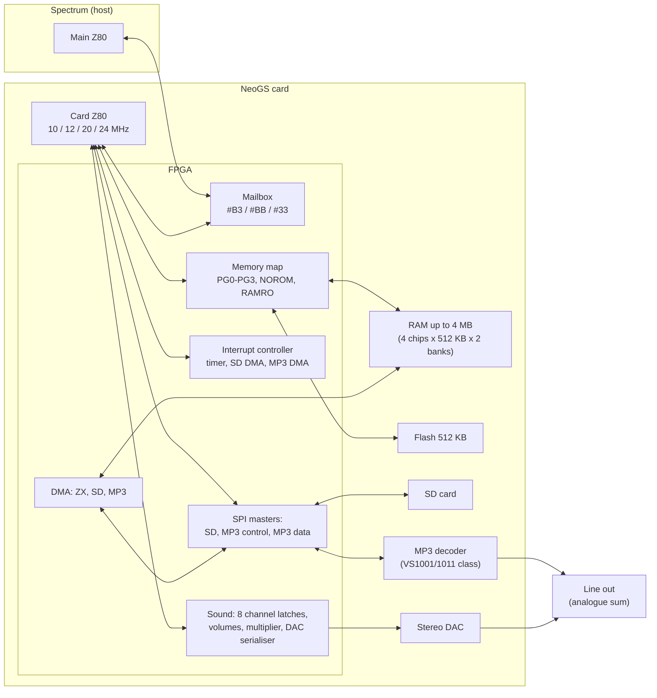
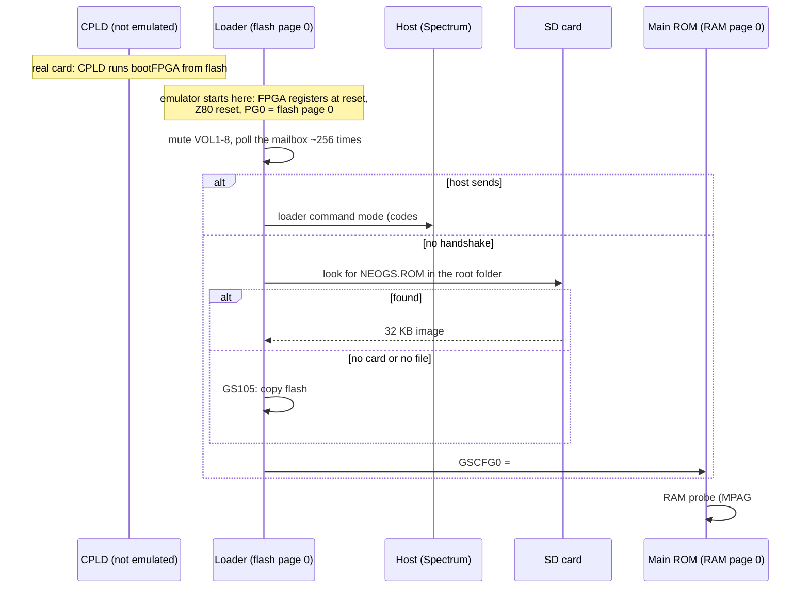
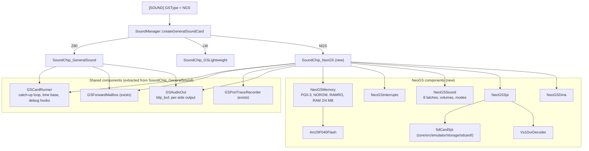
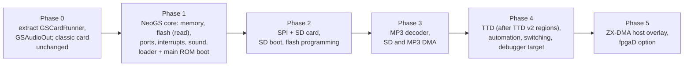

# NeoGS sound card — technical design

- **Date:** 2026-09-27. This replaces the 2026-09-19 sketch.
- **Status:** design for review. Nothing described here is implemented yet,
  apart from the placeholders listed in §1.3.
- **Scope:** a full emulation of the NeoGS card. It fits the one General
  Sound slot, so it is **mutually exclusive** with the classic GS card (LLE)
  and the lightweight card (LW). It runs the card's own flash firmware
  unchanged: the loader and the GS-compatible main ROM. It also covers SD card,
  MP3 decoder, DMA, flash programming, TTD, automation and the debugger hooks.

## 0. Summary

NeoGS (NedoPC, 2008-2026) is a General Sound clone built around an FPGA. The
card has a real Z80 and runs the same kind of GS firmware; around it the FPGA
provides 4 MB of RAM, 512 KB of flash, four switchable memory windows, eight
DAC channels, an interrupt controller, DMA, an SD card slot and an MP3 decoder
chip.

The design in one paragraph:
- NeoGS becomes the third **personality** of the existing GS slot:
  `GSType=NGS`, `GSCardImplementation::NGS`, TTD peripheral id 12. Because there
  is only one slot, GS and NeoGS cannot both be fitted, and nothing else has
  to enforce that.
- The new card class `SoundChip_NeoGS` is a sibling of `SoundChip_GeneralSound`,
  not a subclass. The parts both cards need are first extracted from the
  classic card into shared components:
  - the card-CPU catch-up loop, which moves to a configurable time base;
  - the host mailbox;
  - the port trace;
  - the audio output stage.
- New, separate components carry the NeoGS hardware:
  - memory windows and flash;
  - the interrupt controller;
  - the 8-channel sound mixer;
  - the SPI bus with an SD card;
  - a VS1001-compatible MP3 decoder;
  - three DMA engines.
- Every behaviour follows the **current FPGA sources**. Where Unreal Speccy
  differs, the FPGA wins (§3.11 lists the differences).

## 1. Background

### 1.1 Terms

| Term | Meaning here |
|---|---|
| **card CPU** | The Z80 on the NeoGS card (a physical Z84C00; the FPGA is glue logic, not a soft core). |
| **host** | The Spectrum. It talks to the card through ports `#B3`, `#BB` and `#33`. |
| **FPGA** | The Altera ACEX 1K chip that implements everything on the card except the Z80, the memories and the analogue parts. Its sources are the reference for this design. |
| **CPLD** | A small second chip that loads the FPGA's configuration at power-on. After that it only answers ports `#40`-`#FF`, which the firmware no longer uses. |
| **page** | 16 KB of RAM or flash. Page number × 16 KB + (address & `#3FFF`) is the physical address. |
| **window** | One of the card CPU's four 16 KB address ranges (`#0000`, `#4000`, `#8000`, `#C000`). Each has its own page register. |
| **flash** | The card's 512 KB rewritable ROM (Am29F040-class). It holds the loader, the main ROM and the FPGA configuration. |
| **loader** | The first program the card CPU runs from flash. It copies the main ROM into RAM, or loads another one from the SD card. |
| **main ROM** | The GS-compatible firmware (v1.11 in the current sources). It runs from RAM. |
| **SPI** | A serial bus: the FPGA exchanges one byte at a time with the SD card or with the MP3 decoder. |
| **VS1001** | The MP3 decoder chip family (VLSI Solution VS1001 / VS1011; the board uses MA8201 clones). |
| **DMA** | Transfers the FPGA does without the card CPU: SD card → RAM, RAM → MP3 decoder, and host ↔ card RAM. |
| **base tick** | The design's internal time unit for the card: 1/120,000,000 s. All four card clock rates are a whole number of base ticks (§5.2). |
| **personality** | Which card sits in the GS slot: LLE (classic GS with firmware), LW (lightweight player), NGS (this design). |

### 1.2 Sources used (all verified 2026-09-27)

| Source | What it gives | Location |
|---|---|---|
| NeoGS FPGA, current | The hardware behaviour: ports, memory map, interrupts, sound, SPI, DMA | `emulators/github/neogs/fpga/current/` (git-svn mirror of NedoPC `ngs`, HEAD `b45d5f8`, SVN r191) |
| NeoGS FPGA, fpgaD | The older revision (2 MB, fixed windows 0/1, no DMA or interrupt controller) | `materials/neogs/fpgaD/`, `neogs/fpga/obsolete/fpgaD_release/` |
| NeoGS firmware sources | Loader, main ROM v1.11, FPGA boot program, flasher, flash-image build | `emulators/github/neogs/z80/` (assembler: AS `asw`/`asl`, in `neogs/tools/`) |
| Port definitions | Names and bits | `neogs/z80/ports_ngs.a80`, `materials/neogs/ports.inc` (identical to `neogs/docs/ports.inc`) |
| SPI and ZX-DMA notes | Timing rules for software | `neogs/docs/spi_doc.txt`, `neogs/docs/dma_zx_doc.txt` (CP1251) |
| Unreal Speccy | A working NeoGS emulation, used for comparison only | `emulators/github/unreal-speccy/gsz80.cpp`, `vs1001.cpp`, `sdcard.cpp` |
| VS1001 datasheet | Decoder registers and protocol | `materials/neogs/vs1001_datasheet.pdf` |

Paths starting with `emulators/github/` are under `/Volumes/TB4-4Tb/Projects/`.
Paths starting with `materials/` are under
`docs/inprogress/2026-09-19-general-sound/`.

### 1.3 What already exists in unreal-ng

| Piece | State | Where |
|---|---|---|
| `GSTypeKind::NGS` | Parsed from `[SOUND] GSType=NGS`; the factory then creates **no card** and logs a warning | `platform.h:421-428`, `config.cpp:454-456`, `soundmanager.cpp:1397-1402` |
| `GSCardImplementation::NGS` | Enum value only | `generalsoundcard.h:34-39` |
| `ttd::PeripheralId::NeoGS = 12` | Reserved | `ttdserializable.h:41-59`, `ttd.ksy:472` |
| `[NGS] RamSize`, `SDCardImage`/`SDCARD`, `MP3Support` | Parsed into `gs_ramsize`, `ngs_sd_card_path`, `ngsMP3SupportKind`; **read by nobody** | `config.cpp:508-527`, `platform.h:699-707` |
| Placeholder tests | Assert that NGS creates no card | `soundchip_gs_test.cpp:732-758` |
| SD card, SPI, flash, MP3 decoding | **None** in core. The Z-Controller SD port on ATM3 is a stub. miniaudio's embedded `dr_mp3` is compiled out. | `portdecoder_atm3.cpp:45-55`, `unreal-qt/src/emulator/soundmanager.cpp:17-18` |

Two shipped facts to fix along the way:
- Every shipped `[NGS]` section has only `RamSize=2048`. The `SDCARD=wc.img`
  lines sit in `[ZC]`, so the NeoGS SD path is always empty.
- `data/rom/bootGS.rom` (SHA-256 `37b14b25…`) is an **old NeoGS flash image**:
  loader 2314 bytes, main ROM "Version 1.08", old FPGA configuration. Yet
  `data/configs/profi/unreal.ini` uses it as a GS ROM (`GS=rom\bootgs.rom`
  with `GSType=BASS`).

## 2. Goals and non-goals

**Goals**

1. Run the real flash image (loader, then main ROM) unchanged, including the
   RAM-size detection, the 20 MHz clock choice and the SD boot path.
2. Be cycle-faithful where software can observe it:
   - card CPU clock (10/12/20/24 MHz, switchable at run time);
   - interrupt timing and vectors;
   - DAC sampling at 37.5 kHz;
   - SPI byte timing;
   - DMA bus stalls.
3. Reproduce the analogue output digitally as the FPGA computes it (16-bit
   signed per side), plus the MP3 decoder's output.
4. Stay deterministic: TTD replays are exact, and so is the MP3 decoder.
5. Cost nothing when no NeoGS is fitted, and cost little when idle.
6. Share code with the classic card instead of copying it; the debugger design
   (`docs/inprogress/2026-09-27-gs-debugger/`) works for both.

**Non-goals**

- The CPLD and the FPGA configuration process: the card starts as "FPGA
  configured" (§4.2).
- Analogue behaviour (filters, DC offsets) beyond a gain setting.
- Board revisions other than the current FPGA and fpgaD (§3.12).
- A NeoGS mode for the LW player.

## 3. Hardware model

All facts in this section are from `neogs/fpga/current/` unless marked. File
references are relative to it.

### 3.1 Block diagram



### 3.2 Memory

**Page register → physical memory** (`memmap/memmap.v:73-128`):

| Page byte bits | Meaning |
|---|---|
| 4:0 | page within a 512 KB chip (32 pages) |
| 6:5 | which of 4 RAM chips |
| 7 | second bank (MA21), for 4 MB boards |

- RAM is 256 pages = 4 MB. On 2 MB boards bit 7 has no effect, so pages
  128-255 mirror 0-127. Config `RamSize` chooses 2048 or 4096 KB (§6).
- **ROM mode** (`GSCFG0.NOROM = 0`, the reset state): windows 0, 2 and 3 read
  **flash**, using page bits 4:0 only, so 32 flash pages mirror through the
  whole byte. Window 1 (`#4000`) is **always RAM**.
- **RAM mode** (`NOROM = 1`): all four windows read RAM.
- **Write protection** (`RAMRO = 1` and `NOROM = 1`): writes are blocked to
  any page whose bits 6:1 are 0, i.e. RAM pages 0, 1, 128 and 129, in **any**
  window (`memmap.v:125-128`).
- **Flash writes** are passed to the flash chip, which ignores them unless
  they form a command (§3.8).
- **Reset:**
  - PG0 = 0 (flash page 0: the loader);
  - PG1 = 3;
  - PG2 and PG3 are **not reset** in the FPGA. The emulator sets them to 0 and
    2 and documents this choice, so a replay is deterministic.

**Worked example.** Main ROM running normally: `GSCFG0 = #23`, `MPAG = 5`.

| Window | Page | Physical RAM |
|---|---|---|
| `#0000` | PG0 = 0 | `#000000` (write-protected, the ROM copy) |
| `#4000` | PG1 = 3 | `#00C000` (firmware variables and DAC buffers) |
| `#8000` | PG2 = `{5<<1 \| 0}` = 10 | `#028000` |
| `#C000` | PG3 = 11 | `#02C000` |

`#4000` shows the same cells as `#C000` under MPAG 1, as on the classic GS
(see BUG-10 in `verification-findings-and-bugs.md`).

### 3.3 Card-side ports

The FPGA decodes A5..A0 of ports `#00`-`#3F` (A7 = A6 = 0) and ignores
A15..A8, so every port repeats every 256 addresses (`ports/ports.v:242`).
Ports `#40`-`#FF` belong to the CPLD and read `#FF` after configuration. An
undefined FPGA port reads as an undriven bus, which the emulator models as
`#FF`.

| Port | Dir | Function | Reset |
|---|---|---|---|
| `#00` MPAG | W | Normal: PG2 = `{d6..d0,0}`, PG3 = `{d6..d0,1}`. EXPAG: PG2 = `{d6..d0,d7}` (rotate left). | — |
| `#10` MPAGEX | W | EXPAG only: PG3 = `{d6..d0,d7}` | — |
| `#20`-`#23` PG0-PG3 | W | Raw page byte for each window | PG0 = 0, PG1 = 3 |
| `#01` | R | Command from host (`#BB`) | — |
| `#01` | W | LED: d0 = 0 on, 1 off | on |
| `#02` | R | Data from host (`#B3`); clears the data bit | — |
| `#03` | W | Data to host; sets the data bit | — |
| `#04` | R | Status: bit 7 data bit, bit 0 command bit; bits 6:1 undefined (emulated as 1, `#7E`, as on GS) | — |
| `#05` | R/W | Any access clears the command bit | — |
| `#06`-`#09`, `#16`-`#19` | W | VOL1-VOL8; bits 5:0 used; always stored, in every mode | 0 |
| `#0A` | R/W | Any access: data bit ← NOT PG2 bit 0 | — |
| `#0B` | R/W | Any access: command bit ← bit 5 of VOL4 (`#09`) | — |
| `#0C` INTENA | W | d7 = set/clear, d2:0 = mask (timer, SD DMA, MP3 DMA) | `001` |
| `#0D` INTREQ | R/W | Read `{00000,req}`; write as INTENA | `000` |
| `#0E` TIM_FREQ | W | d2:0 = timer divider index (§3.5) | 0 |
| `#0F` GSCFG0 | R/W | Bit 0 NOROM, 1 RAMRO, 2 8CHANS, 3 EXPAG, 5:4 clock, 6 PAN4CH, 7 INV7B | `#30` |
| `#11` SCTRL | R/W | Write: every bit set in d5..d0 takes the value of d7. Bits: 0 SD nCS, 1 MP3 control nCS, 2 MP3 XRESET (1 = run), 3 MCSPD0, 4 MDHLF, 5 MCSPD1. Read `{00, bits 5:0}`. | `#0B` |
| `#12` SSTAT | R | `{0000, MCRDY, SD_WP, SD_DET, MP3 DREQ}` | — |
| `#13` | W / R | SD_SEND (starts an exchange) / SD_READ (last received byte) | — |
| `#14` | R / W | SD_RSTR (returns the last byte and starts an exchange sending `#FF`) / MD_SEND (MP3 data) | — |
| `#15` | W / R | MC_SEND / MC_READ (MP3 control) | — |
| `#1B` DMA_MOD | R/W | d2:0 selects the DMA module shown at `#1C`-`#1F`: 1 ZX, 2 SD, 3 MP3 | 0 |
| `#1C`-`#1F` | R/W | HAD (6 bits, address 21:16), MAD, LAD, CST (bit 7 = run) of the selected module | — |

**Clock select** (GSCFG0 bits 5:4): `#00` = 24 MHz, `#10` = 12 MHz, `#20` =
20 MHz, `#30` = 10 MHz. So the card leaves reset at **10 MHz**.

### 3.4 Host-side ports

The FPGA decodes the low 8 address bits exactly (`zxbus/zxbus.v:217-227`). The
host machine's own port decoder decides which host addresses reach the card;
unreal-ng already has those tables for GS (§7.3).

| Port | Access | Effect |
|---|---|---|
| `#BB` | W | Command latch ← byte; command bit ← 1 |
| `#BB` | R | Status: bit 7 data, bit 0 command; others undefined (`#7E` pull-ups as on GS) |
| `#B3` | W | Data latch ← byte; data bit ← 1 |
| `#B3` | R | Card's reply byte; data bit ← 0 after the cycle |
| `#33` | W | Decoded on d7..d5 **exactly**: `100` resets the card, `010` sends an NMI, `001` toggles the LED; anything else (e.g. `#C0`) does nothing |
| `#33` | R | Not driven (`#FF`) |

- The mailbox latches and the two bits have **no reset**: a card reset keeps
  them.
- The bit changes reach the card side 2-3 FPGA clocks later. The emulator
  applies them at once. This is safe because catch-up (§5.3) already orders
  every host access against card time.
- **A card reset restarts the whole card from the loader.** It resets the
  FPGA registers, which sets `GSCFG0 = #30` (ROM mode) and PG0 = 0.
  - The main ROM copy in RAM survives, but the loader copies it again anyway.
  - **Each write of `100` gives one reset** (`zxbus.v:392-464`). The write
    flips a toggle; the card clock sees the flip as an edge and pulls
    `rst_from_zx_n` low. The resulting internal reset clears the request
    again. `common/resetter.v` stretches the reset to 8 FPGA clocks.
- **Resets from outside the card** (board netlist
  `neogs/pcad/revC-VS/NeoGS.sch`):
  - **Spectrum reset.** ZX-BUS `/RES` (connector pin 50) goes through an
    inverter (D1, 74HC04), transistor VT1 and **jumper J1** to `~WARMRES`,
    the FPGA's second reset input (`top.v:333-334`). With J1 fitted a Spectrum
    reset is exactly a card reset as above; without it the card ignores it.
  - **Power-on and the reset button** (supervisor DA4, button S1) drive
    `~COLDRES`. The CPLD uses it to reconfigure the FPGA, and the card
    restarts from scratch, mailbox included.
- **What the emulator implements (decided 2026-09-27).** Any emulator reset is
  a cold boot of the whole machine and resets the NeoGS completely: FPGA
  registers, mailbox, CPU, and the loader starting again. Separate resets of
  the Spectrum and the card (J1 / warm reset, the `GSReset` option) are not
  implemented for NeoGS for now. The software-driven card reset through host
  port `#33` is implemented, because programs use it.

### 3.5 Interrupts

- **Timer.** It runs from the fixed 24 MHz crystal, independent of the card
  CPU clock: 24 MHz / 5 / 128 = **37,500 Hz**. TIM_FREQ divides it by 1, 2,
  4, 8, 16, 64, 256 or 1024 (`interrupts/timer.v:33-60`).
- **Controller.** Three request bits:
  - bit 0, timer;
  - bit 1, SD DMA done;
  - bit 2, MP3 DMA done.

  Each request is masked by INTENA. `/INT` is a **level**, held while any
  enabled request is pending. It is not a pulse (`interrupts.v:95-112`).
- **Priority** is timer, then SD, then MP3, latched at the start of M1. The
  acknowledge clears that one request.
- **Vector** on the bus is `{11, 1, ~p2, ~p1, 111}`: timer `#FF` (so IM 1 and
  `RST 38` work), SD `#F7`, MP3 `#EF`.
- **Missed ticks.** A request that is already pending absorbs further timer
  ticks.
- **NMI** comes only from host `#33` = `010`, as a 4-clock pulse. The emulator
  delivers it at the next card instruction boundary, as for GS.

**Worked example.** At 20 MHz with TIM_FREQ = 0, the timer fires every
20,000,000 / 37,500 = 533⅓ CPU cycles. In base ticks (§5.2) that is 3,200
ticks, and one CPU cycle at 20 MHz is 6 ticks. So interrupts land after 533
or 534 cycles, alternating so that three periods take exactly 1,600 cycles.

### 3.6 Sound

**Sample capture** (`ports.v:245, 311-320, 551-569`):
- Any memory read in `#6000`-`#7FFF`, including opcode fetches, copies the
  byte read into a channel latch. This depends on the **CPU address only**,
  whatever page window 1 shows.
- The channel is A9:A8 in 4-channel mode and A10:A8 in 8-channel mode.

**Multiplier** (`sound/sound_mulacc.v:113`, `sound_main.v:190-220, 290-345`):
- Each channel contributes sample × volume.
- The sample is treated as signed with its top bit flipped, sign = NOT(d7 XOR
  INV7B). With INV7B = 0 the byte is unsigned with `#80` as silence (GS
  convention); with INV7B = 1 it is two's complement.
- Volume is 0-63.

**Output mix per side**, as 16-bit two's complement:

| Mode | Left | Right |
|---|---|---|
| 4 channels | 2 × (c1·v1 + c2·v2) | 2 × (c3·v3 + c4·v4) |
| 8 channels (`8CHANS`) | c1·v1 + c2·v2 + c5·v5 + c6·v6 | c3·v3 + c4·v4 + c7·v7 + c8·v8 |
| `PAN4CH` (only when 8CHANS = 0) | c1·v1 + c2·v2 + c3·v5 + c4·v6 | c1·v3 + c2·v4 + c3·v7 + c4·v8 |

- **The DAC takes a new stereo frame every 1/37,500 s** (LRCK = 24 MHz / 640).
  It uses the latches as they are at that moment.
- **Hard stereo.** The classic GS emulation cross-feeds 50%; NeoGS doesn't.
- **Worked example, 4-channel mode.** Channel 1 holds `#FF` (+127) at volume
  63, channel 2 holds `#80` (0). Then L = 2 × (127·63 + 0) = 16,002, just
  under half of full scale.

### 3.7 SPI, SD card and MP3 decoder

**Masters** (`common/spi.v`, `top.v:816-856`): mode-0 SPI masters clocked by
the **card CPU clock**. The SCK divider is /2, /4, /8 or /16.

| Channel | Divider | Pacing |
|---|---|---|
| SD | always /2 | A byte takes 16 CPU clocks; software must wait. There is no ready bit (`docs/spi_doc.txt:172-178`). |
| MP3 control (SCI) | MCSPD bits | MCRDY in SSTAT bit 3 |
| MP3 data (SDI) | /2, or /4 with MDHLF | BSYNC generated in hardware during bit 7 (VS1001 style); no chip select |

**Signals:**
- DREQ goes straight to SSTAT bit 0.
- XRESET is SCTRL bit 2.
- SD_DET and SD_WP are the slot switches.

**Timing rule for the emulator.** A byte exchange completes 16 × divider/2 CPU
clocks after it starts:
- A read of the result before that returns the previous byte, as on the real
  card.
- A new write during an exchange is ignored, as on the real card.

**The decoder** is an MA8201 / MA8201A, a clone of VS1001 / VS1011, with a
14 MHz crystal and the clock doubler enabled (`spi_doc.txt:275-307`):
- Control goes through SCI: 16-bit registers, read or write.
- MP3 bytes go through SDI while DREQ = 1.
- Its analogue output is summed with the DAC's on the board.

### 3.8 Flash

The flasher programs the flash with the standard AMD/JEDEC byte sequence
(`neogs/z80/flasher/flasher_ngs.a80:15-76`): unlock at `555`/`2AA`, sector
erase of 64 KB blocks 0-7, byte program with `A0`. The chip is modelled as
**Am29F040-compatible**:
- 8 sectors of 64 KB;
- read-array, autoselect (manufacturer and device id), byte program, sector
  erase and chip erase;
- status polling with DQ7 inverted-data and DQ6 toggle while busy;
- programming only clears bits.

Busy times are fixed in emulated time so that polling loops behave:
- program: 10 µs;
- sector erase: 0.5 s;
- chip erase: 4 s.

The chip is visible only in ROM mode (§3.2), at the CPU addresses of windows
0, 2 and 3. The `555`/`2AA` addresses are chip offsets, formed from the page
bits and the address within the window.

### 3.9 DMA

**Common to all three modules**
- Each module has a 22-bit linear RAM address (HAD 6 bits, MAD, LAD) and a
  run bit (CST bit 7).
- DMA never touches flash.
- The modules share the bus round-robin.
- **The card CPU stalls** (BUSRQ) while the FPGA moves bytes: 2 CPU clocks
  per byte, back to back (`dma/dma_access.v:86-240`).

| Module | What it does | End |
|---|---|---|
| 2, SD → RAM | One 512-byte block. **Receive phase:** clocks `#FF` until a non-`#FF` byte arrives; if it is `#FE` (data token), receives 512 bytes plus 2 CRC bytes into a FIFO while the CPU keeps running. **Burst phase:** writes the 512 bytes to RAM, CPU stalled 1,024 clocks. Software sends CMD17 and drives nCS itself. SD MOSI is forced to `#FF` during the transfer. | Clears CST bit 7; INTREQ bit 1 |
| 3, RAM → MP3 | Reads 512 bytes into a FIFO (CPU stalled), then sends each while DREQ = 1 | Clears CST bit 7; INTREQ bit 2 |
| 1, ZX ↔ card RAM | While running, **host** accesses to `#0000`-`#3FFF` go to card RAM at the DMA address, which then increments. Reads need the host ROM paged in and return the byte of the *previous* read, so the first byte is junk. Writes are captured without that condition. The host gets `/WAIT` when the card falls behind. | Software clears CST |

### 3.10 LED

The LED is driven by port `#01` bit 0 (card side) and `#33` = `001` (host
side). The emulator shows it in the UI and reports it through automation.

### 3.11 Where Unreal Speccy differs, and the choice here

The emulator follows the FPGA in every case below. Tests pin the FPGA
behaviour.

| # | Behaviour | Unreal Speccy | FPGA (this design) |
|---|---|---|---|
| 1 | Clock | always 24 MHz; config reset `0` | CKSEL honoured; reset `#30` = 10 MHz |
| 2 | Port `#0A` | data bit ← PG2 bit 0 | ← NOT PG2 bit 0 |
| 3 | Port `#0B` | bit 5 of VOL1 | bit 5 of VOL4 |
| 4 | RAMRO | windows 2 and 3 only | every window; pages 0, 1, 128, 129 |
| 5 | VOL5-8 writes | dropped unless 8CH or PAN4CH | always stored |
| 6 | Mixing | cross-feed, scaled | hard L/R, 4-channel sum doubled |
| 7 | `#33` decode | bit 7 resets, bit 6 NMIs | exact `100` / `010` / `001` |
| 8 | SCTRL | bits 3:0 kept, random reset | 6 bits, reset `#0B` |
| 9 | SD_READ / SD_RSTR | one step late; RSTR skips exchange | last byte; RSTR always exchanges |
| 10 | ZX-DMA | 5-bit HAD, any CST enables, needs ROM for writes, no WAIT | 6-bit HAD, CST bit 7, writes unconditional, WAIT |
| 11 | Port `#02` write / `#03` read | change the data bit | no effect |
| 12 | Window `#C000` after reset in ROM mode | flash page 1 | undefined (emulator: 2, see §3.2) |
| 13 | PG0-PG3, TIM_FREQ, INTENA/INTREQ, SD and MP3 DMA, INV7B, PAN4CH | missing | implemented |

### 3.12 Board revisions

The current FPGA is the default. **fpgaD** (2 MB boards, 2008-2013) is a
config option, `[NGS] Fpga=D`. It differs in these ways:
- window 0 is fixed to page 0 and window 1 to page 3, with no PG0-PG3 ports;
- 7-bit pages, MPAG d5..d0 only;
- no interrupt controller: a 4.17 µs pulse every 640 × 24 MHz clocks, vector
  `#FF`;
- no DMA, TIM_FREQ or INV7B, and GSCFG0 bit 7 reads 0.

The differences are table entries in the memory map, port decoder and
interrupt source, not separate code paths. The old flash images (`bootGS.rom`,
`materials/neogs/ngsrom109/`) go with fpgaD.

## 4. Firmware and boot

### 4.1 Flash images

| Image | SHA-256 | Contents | Board |
|---|---|---|---|
| `neogs/z80/create_update/full_ngs.rom` | `f8087ecd…d3b18e` | loader at `#00000`, main ROM v1.11 at `#10000`, FPGA boot + configuration at `#70000`; 8-byte trailers ("LOADER", "ROM   ", "FPGA  ") at each 64 KB page end | current FPGA |
| `materials/neogs/ngsrom109/full_ngs.rom` | `c12a87e9…124f075` | older loader, main ROM "Version 1.08" (NeoGS build), older FPGA; no trailers | fpgaD era |
| `data/rom/bootGS.rom` | `37b14b25…` | loader 2314 bytes, main ROM with "Version 1.08", FPGA 17,396 bytes | fpgaD era |

**Rebuilding the image.** It can be rebuilt entirely from source. The script
`neogs/z80/create_update/build_full_rom.bat` builds the main ROM, the loader
and the FPGA boot program with AS, and packs the FPGA configuration built from
`fpga/current`. No part needs disassembling. The tools are in `neogs/tools`;
the script has a hard-coded path (`build_full_rom.bat:36`).

**Shipping.**
- The current image goes to `data/rom/neogs/full_ngs.rom`. Its SHA-256 goes
  into the known-ROM table (`rom.cpp`) as "NeoGS flash v1.11".
- A script `tools/neogs/build_flash.py` rebuilds it from the imported sources
  and checks it byte for byte in CI.
- `bootGS.rom` stays, renamed in the table as "NeoGS flash v1.08 (fpgaD)". The
  profi config line is fixed separately (§11.5).
- The NeoGS sources and images are treated as MIT (no licence file upstream)
  and get a row in THIRD_PARTY_NOTICES.

### 4.2 Boot



**Boot modes** (`[NGS] Boot`):
- `loader` (default): runs the flash from page 0 as the real card does.
- `direct`: the emulator performs GS105 itself, then starts the main ROM with
  `GSCFG0 = #23`, `MPAG = 0` and `PC = 0`:
  - copy flash `#10000`-`#17FFF` into RAM pages 0-1;
  - fill PG0-PG3 as the loader leaves them.

  It is for tests and quick starts only, and it skips the SD path.

**The FPGA configuration stage is not emulated.** Its only visible effect is
the time it takes, about 1 s on the real card. The emulator starts after it.
If a program depends on that delay, `[NGS] BootDelayMs` adds it.

## 5. Architecture in unreal-ng

### 5.1 Where it plugs in



**Why a sibling class, not a subclass.**
- `SoundChip_GeneralSound`'s internals are private and non-virtual
  (`soundchip_gs.h:223-334`): memory access, port handlers, banking, sample
  output.
- Making them virtual would put an indirect call on every card memory access
  of the classic card. That costs performance and couples the two memory
  models, which differ (32K pairs vs four page registers, ROM vs flash).
- Extracting the genuinely shared parts keeps both cards simple and fast.
  - It also gives the GS debugger (`2026-09-27-gs-debugger/design.md` §4) one
    runner to hook, not two.

### 5.2 Time base

The classic card counts card cycles at a fixed 12 MHz. NeoGS needs four
rates, changeable between two instructions, and a timer and DAC on a separate
24 MHz clock. The shared runner therefore counts **base ticks** at 120 MHz,
the least common multiple:

| Card clock | Base ticks per CPU cycle |
|---|---|
| 24 MHz | 5 |
| 20 MHz | 6 |
| 12 MHz | 10 |
| 10 MHz | 12 |

| Event | Period in base ticks |
|---|---|
| Timer (37.5 kHz, TIM_FREQ 0) | 3,200 |
| DAC frame (37.5 kHz) | 3,200 |
| Classic GS interrupt (37.5 kHz) | 3,200 (= 320 cycles × 10) |

- **Host time** converts as today: `targetTicks = frameStartTicks +
  (hostT − frameStartT) × 120e6 / hostClockHz`, with the same rounding
  `flush()` uses now.
- **The classic card** runs with 10 ticks per cycle. Its behaviour is
  unchanged, and its tests pin that.
- **A GSCFG0 clock change** takes effect from the next instruction: the runner
  multiplies that instruction's cycles by the new tick cost.

### 5.3 The shared runner

`GSCardRunner` takes the catch-up loop out of `SoundChip_GeneralSound::runTo`
(`soundchip_gs.cpp:277-353`). It owns:
- the `Z80CPU*` (unreal-z80) and its bus callbacks, which it forwards to the
  card;
- the tick counter and the frame bases;
- `flush()`: catch up to the host's current time;
- `runTo(ticks)`: the loop, which each round
  - delivers a pending NMI,
  - delivers an interrupt if the card's interrupt source says so,
  - runs the next scheduled event (timer, DAC frame, SPI byte done, DMA step,
    flash ready) when it is due,
  - otherwise runs one CPU step and adds its cycles × ticks per cycle;
- a small **event queue** ordered by tick, for the card's periodic and
  one-shot events. It holds at most about ten entries, so a sorted array is
  enough;
- **stalls**: DMA bursts push the CPU's next step later by 2 cycles per byte,
  without running instructions;
- the **debug hook points** from the GS debugger design (§4 there): a fast
  loop and a debug loop, swapped by a pointer.

The card supplies an interface:

```cpp
struct GSCardBus
{
    virtual uint8_t memRead(uint16_t addr, bool m1) = 0;
    virtual void memWrite(uint16_t addr, uint8_t v) = 0;
    virtual uint8_t portIn(uint16_t port) = 0;
    virtual void portOut(uint16_t port, uint8_t v) = 0;
    virtual bool intLine() const = 0;           // level
    virtual uint8_t intAcknowledge() = 0;       // vector, clears the request
    virtual void onEvent(uint32_t kind) = 0;    // scheduled event fired
    virtual uint32_t ticksPerCycle() const = 0; // from the clock select
};
```

**The classic card is migrated first**, with no behaviour change:
- Its interrupt becomes "request every 3,200 ticks, level-held until
  accepted" (as it is now).
- It is checked by the existing GS tests plus a before/after comparison of
  card RAM hash and DAC stream over the GS test scenarios.

### 5.4 NeoGS components

| Component | Location | Responsibility |
|---|---|---|
| `SoundChip_NeoGS` | `emulator/sound/chips/neogs/soundchip_neogs.{h,cpp}` | `GeneralSoundCard` implementation; owns the rest; host ports; TTD; introspection |
| `NeoGSMemory` | `.../neogs/neogsmemory.{h,cpp}` | Page registers, NOROM / RAMRO / EXPAG, 2 or 4 MB RAM, window pointers (`_bankR[4]`, `_bankW[4]` as in the classic card, rebuilt on every page or GSCFG0 write), flash routing |
| `Am29F040Flash` | `emulator/storage/flash/am29f040.{h,cpp}` | Command state machine, busy timing, dirty tracking, persistence |
| `NeoGSInterrupts` | `.../neogs/neogsinterrupts.{h,cpp}` | Timer divider, INTENA, INTREQ, priority, vectors |
| `NeoGSSound` | `.../neogs/neogssound.{h,cpp}` | 8 latches, 8 volumes, capture decode, the three mixing modes, INV7B, the 37.5 kHz frame |
| `NeoGSSpi` | `.../neogs/neogsspi.{h,cpp}` | SCTRL / SSTAT, three SPI masters with byte timing, routing to SD and decoder |
| `SdCardSpi` | `emulator/storage/sdcard/sdcardspi.{h,cpp}` | SD card in SPI mode over an image file; reusable by Z-Controller |
| `Vs10xxDecoder` | `emulator/sound/chips/neogs/vs10xx.{h,cpp}` | SCI registers, SDI input FIFO, DREQ, MP3 decoding, PCM output FIFO |
| `NeoGSDma` | `.../neogs/neogsdma.{h,cpp}` | Three modules, arbitration, stalls, interrupts, host memory overlay for ZX-DMA |

### 5.5 SD card (`SdCardSpi`)

**Protocol.** SD in SPI mode, versions 1 and 2, SDSC and SDHC. Commands:
- CMD0, CMD8, CMD55 + ACMD41, CMD58, CMD9, CMD10, CMD12, CMD13, CMD16;
- CMD17 and CMD18 (read), CMD24 and CMD25 (write).

CRC is checked only where SD requires it in SPI mode (CMD0 and CMD8). Data
tokens, response formats and a busy phase after writes follow the SD Physical
Layer spec.

**Image.** A raw image file, `[NGS] SDCardImage`:
- up to 2 GB is presented as SDSC, bigger images as SDHC;
- detect (SD_DET) = an image is present;
- write protect (SD_WP) from `[NGS] SDWriteProtect`.

**Writes** (`[NGS] SDWrite`):
- `session` (default): written sectors are kept in an overlay map and
  discarded at exit.
- `persist`: written through to the file.
- `off`: write commands answer with a write-protect error.

**Timing.** Reads and writes complete in emulated time with fixed latencies.
Read: the data token appears after 8 poll bytes. Write: busy for 64 poll
bytes. These are deterministic values chosen to keep polling loops short.

**TTD.** The card's protocol state and the overlay are part of the card's
state. Persistent writes are applied only on live runs, never during replay.

### 5.6 MP3 decoder (`Vs10xxDecoder`)

**Registers.** It models the VS1001/VS1011 SCI register file:
- MODE, STATUS, CLOCKF, DECODE_TIME, AUDATA, HDAT0 / HDAT1 and VOL, with
  their reset values;
- MODE software reset;
- DECODE_TIME counting emulated seconds;
- AUDATA reporting the stream's rate and channels;
- WRAM / WRAMADDR and AIADDR stored but inert.

**Data path.**
1. SDI bytes go into a 2,048-byte input FIFO (VS1011 size).
2. DREQ = 1 while at least 32 bytes are free.
3. The decoder takes a whole MP3 frame from the FIFO when its PCM output queue
   runs low.
4. The PCM queue plays at the stream's own rate, in emulated time.
5. It is resampled into the card's output at 37.5 kHz.
6. The output is summed with the DAC output after VOL attenuation and the
   `[NGS] Mp3Gain` factor.

**Decoder library.** minimp3 (CC0, a single header) is vendored into
`core/src/3rdparty/minimp3/` and listed in THIRD_PARTY_NOTICES.
- Its state `mp3dec_t` is a plain struct of arrays, so it can be serialised
  byte for byte into TTD.
- Decoding depends only on the bytes fed in and the emulated time, so replays
  are exact.

**Levels** (`[NGS] MP3Support`):
- `none`: no decoder chip. SSTAT DREQ reads 0, SCI reads return `#FFFF`.
- `stub`: accepts data, DREQ always 1, silence.
- `software` (default once implemented): full decoding.

**Performance.** One MP3 frame (1,152 samples) decodes in roughly 50-100 µs
on the development machine. At 44.1 kHz that is about 38 frames per second of
music, under 0.5% of one core.

### 5.7 DMA (`NeoGSDma`)

- **SD and MP3 modules** are events on the runner's queue:
  - the SD module waits for the token, receives the bytes at the SPI byte
    time, then bursts;
  - the MP3 module bursts, then sends at the SDI byte time while DREQ = 1.

  Bursts are stalls (§5.3).
- **ZX module.** It needs a hook in the **host** memory path, so it comes last
  (phase 5). While CST bit 7 is set, host reads and writes of `#0000`-`#3FFF`
  go to the card. Design:
  - The host `Memory` gets an **external bus overlay** for one 16 KB window:
    a pointer to an object with `read(addr)` / `write(addr, v)`. It is
    consulted only while set, from the debug and fast memory paths alike, as
    one predictable branch on window 0.
  - Reads apply the one-byte lag and the "host ROM paged in" condition.
  - `/WAIT` is modelled as host T-states added when the card has not caught
    up. The overlay forces a `flush()` first, then adds the difference as
    wait states.
  - The overlay is also the natural place for other ZXBUS devices that map
    memory. It is designed generically, but only NeoGS uses it here.

### 5.8 Flash persistence

`[NGS] FlashWrite`:
- `session` (default): writes live in memory until exit.
- `persist`: the modified image is saved to the user settings folder as
  `neogs-flash-<sha256 of the original>.rom` and loaded next time in place of
  the original. The shipped file is never modified.
- `off`: all command sequences are ignored.

The flasher programs work in `session` and `persist`.

### 5.9 Threading and cost

- **Threading** is the same as the classic card: everything runs on the
  emulation thread, driven by catch-up. The MP3 decoder runs inline too; it
  is cheap (§5.6).
- **Cost when idle.** The main ROM's idle loop at 20 MHz makes about 1.7×
  the classic card's instruction count per frame (20 vs 12 MHz). The budget:
  NeoGS idle within 2× the classic card's cost on the GS playback benchmark,
  and module playback within 2.5×.
- **Cost when not fitted:** zero. No object is created, and no ports are
  registered.

## 6. Configuration

```ini
[SOUND]
GSType=NGS              ; Z80 | LW | NGS | NONE — the one GS slot

[NGS]
Flash=rom/neogs/full_ngs.rom   ; 512 KB image
Fpga=current                   ; current | D
RamSize=4096                   ; 2048 | 4096 (KB)
Boot=loader                    ; loader | direct
BootDelayMs=0
SDCardImage=                   ; raw image; empty = no card
SDWriteProtect=0
SDWrite=session                ; session | persist | off
MP3Support=software            ; none | stub | software
Mp3Gain=1.0
FlashWrite=session             ; session | persist | off
Volume=8000                    ; output gain, same scale as [SOUND] GSVol
```

**Parsing** (`config.cpp`):
- `gs_ramsize` is renamed `ngsRamKB` and clamped to 2048 / 4096.
- `ngs_sd_card_path` keeps `SDCARD` as an alias.
- The new keys get fields next to the existing ones (`platform.h:699-707`).
- Shipped configs gain an `[NGS]` section with the defaults. Their `GSType` is
  unchanged.
- `pentagon128k/unreal.ini` is CRLF, so it is edited byte-preserving.

## 7. Integration

### 7.1 SoundManager

- **`createGeneralSoundCard(NGS)`** creates `SoundChip_NeoGS(ctx, config)` and
  loads the flash image.
- **Runtime personality switching** accepts NGS as a source and a target
  (`switchGeneralSoundCard`, `soundmanager.cpp:1406-1508`). The steps are the
  same:
  1. snapshot the mailbox;
  2. unregister the ports;
  3. create the card;
  4. `UpdatePeripheral(old id, new id)`;
  5. register the ports;
  6. restore the mailbox and replay the uploaded module.

  The NeoGS main ROM is GS-compatible, so the module replay works unchanged.
  After a switch to NGS, the replay waits until the main ROM has finished
  booting: the card's "ready" flag is the main ROM reaching its command poll
  loop.
- The `gs_lightweight` feature keeps meaning "LW instead of Z80" and does not
  affect NGS.
- **The audio registry entry** stays `AudioSourceType::GeneralSound`, labelled
  "NeoGS" when that card is fitted.

### 7.2 GeneralSoundCard interface

NeoGS implements all pure virtuals. Beyond them:

| Method | NeoGS answer |
|---|---|
| `implementation()` | `NGS` |
| `hasCoprocessor()` | true |
| `getMPAG()` | last MPAG write |
| `getChannelSample` / `getChannelVolume` | 8 channels (index 0-7) |
| `getRamSizeKB()` | 2048 / 4096 |
| `isROMLoaded()` | flash image loaded |

New optional virtual methods, with defaults for the other cards:
- `channelCount()` (default 4);
- `ledOn()`;
- `cardClockHz()`;
- `debugAccess()` (the debugger design's `GSDebugAccess`, extended with page
  registers and flash).

All callers that label the implementation with a two-way ternary (`LLE ?
"lle" : "lightweight"`) move to one shared `ToString(GSCardImplementation)`:
- `state_audio_api.cpp`, `lua_emulator.h:1908`, `python_emulator.h:1557`;
- the CLI and WebAPI personality parsers (`state_audio_api.cpp:711-719`,
  `cli-processor-gs.cpp:334-349`).

### 7.3 Ports

- The host ports and machine decode tables are unchanged. The GS slot already
  claims `#B3`, `#BB` and `#33` with `PortTag::SoundGs` on Pentagon, Scorpion
  and ATM (`soundmanager.cpp:1541-1549`).
- Card ports never reach the host decoder.

### 7.4 TTD

- **Peripheral id** `NeoGS = 12`.
  - `ttdmodelstatecontract_test.cpp:30-41` uses `NeoGS` as its "never
    registered" id. It moves to a test-only id so that the reservation can be
    used.
- **State** is a fixed header of all registers and component state, versioned
  by a leading byte:
  - CPU registers (unreal-z80 layout, as in the classic card);
  - page registers, GSCFG0, INTENA / INTREQ / TIM_FREQ;
  - latches and volumes, LED;
  - SPI masters, SD card protocol state, decoder registers and FIFOs;
  - `mp3dec_t`, DMA modules, flash state machine;
  - the event queue.
- **Bulk memory** — RAM (2-4 MB), the flash image and the SD overlay — is
  registered as **TTD v2 memory regions** (`2026-09-25-ttd-v2-migration/
  target-architecture.md` §2.1, which already lists "later NeoGS RAM"). They
  are stored in changed 4 KB pieces.
  - NeoGS TTD support therefore depends on TTD v2 memory regions.
  - Until they exist, NeoGS reports TTD as unsupported and recording refuses
    with a clear message. A 4 MB blob per checkpoint would be 1.2 GB for 300
    frames.
- **GS-slot guard.** A recording made with one GS personality refuses to load
  into a machine with another, with the message "recorded with NeoGS, fitted:
  GS". This mirrors the TurboSound guard (`timetravelmanager.cpp:2834,
  3180-3205`) and fixes the gap for LLE ↔ LW too.
  - Runtime switches inside one recording are already handled by
    `UpdatePeripheral`.

### 7.5 Automation

| Surface | Additions |
|---|---|
| CLI `gs` | `gs switch ngs`; `gs neogs` (config, pages, clock, LED, SD, decoder, DMA); `gs sd insert <image>` / `eject`; `gs flash save` |
| WebAPI | `/state/audio/gs` gains a `neogs` object with the same fields; `/control/audio/gs` accepts `personality: "ngs"`, `sd_insert`, `sd_eject` |
| MCP | the `gs_*` tools pass through; `gs_switch_personality` accepts `ngs` |
| Lua / Python | `implementation` label and switch targets extended; `neogs()` state table |

### 7.6 Debugger

The NeoGS card supplies the `neogs` debug target from the GS debugger design
(`2026-09-27-gs-debugger/design.md`, requirements N1-N5):
- four switchable windows;
- 8-bit pages over RAM and flash;
- `GSCFG0` and the clock as panel fields;
- a firmware profile built from `main_rom/main_ngs.a80` and
  `loader_ngs.a80` (symbols assembled with AS and marked up on the flash
  image);
- the runner hooks of §5.3.

## 8. Testing

Test files are named after the file under test. Tests that boot the real
flash image use the shipped `data/rom/neogs/full_ngs.rom`.

| File | Checks |
|---|---|
| `gscardrunner_test.cpp` | Tick accounting for all four clocks; clock change between two instructions; event ordering; stalls; the classic card's interrupt spacing unchanged (320 cycles at 12 MHz) |
| `soundchip_gs_test.cpp` (existing) | Unchanged results after the runner extraction; plus RAM hash and DAC stream before/after on the GS scenarios |
| `neogsmemory_test.cpp` | Reset map; MPAG normal and EXPAG; PG0-PG3; ROM mode (windows 0/2/3 flash, 1 RAM, 32-page mirror); RAMRO on pages 0, 1, 128, 129 in every window; 2 MB mirror of bit 7; the §3.2 worked example |
| `neogsinterrupts_test.cpp` | 37.5 kHz at each clock (the 533/534 alternation at 20 MHz); TIM_FREQ dividers; level hold; priority and vectors `#FF`/`#F7`/`#EF`; INTENA/INTREQ set/clear encoding |
| `neogssound_test.cpp` | Capture on M1 and data reads; channel decode in 4 and 8-channel modes; all three mixing formulas; INV7B; the §3.6 worked example; 37.5 kHz frame sampling |
| `soundchip_neogs_test.cpp` | Port table §3.3 incl. `#0A`/`#0B` rules and undefined ports; host `#33` exact decode; card reset restarts at the loader and keeps the mailbox; LED |
| `soundchip_neogs_boot_test.cpp` | `Boot=loader` with no SD: reaches the main ROM command loop, `GSCFG0 = #23`, 20 MHz; COM23 reports the page count for 2 MB and 4 MB; `Boot=direct` reaches the same state; loader handshake `#55`/`#AA` then `#1D` answers `#76` |
| `sdcardspi_test.cpp` | Init sequence (CMD0, CMD8, ACMD41, CMD58) for SDSC and SDHC; CMD17/18/24/25/12; overlay vs persist; write protect; `SD_READ` / `SD_RSTR` semantics at the port level |
| `soundchip_neogs_sdboot_test.cpp` | Loader finds `NEOGS.ROM` on a FAT16 image and runs it |
| `vs10xx_test.cpp` | SCI register reset values and read/write; DREQ with the FIFO; decoding a short test MP3 matches minimp3's reference output; DECODE_TIME; determinism: two runs give identical PCM |
| `neogsdma_test.cpp` | SD block to RAM with token wait, CPU stall length and INTREQ bit 1; MP3 DMA with DREQ pacing and INTREQ bit 2; ZX-DMA one-byte read lag, write capture, wait states |
| `am29f040_test.cpp` | Autoselect ids; program clears bits only; sector and chip erase; DQ7/DQ6 polling during busy; the flasher's erase-program sequence from `flasher_ngs.a80` |
| `soundchip_neogs_ttd_test.cpp` | Save/load round trip at a DMA and SPI midpoint; replay exact over 300 frames of module playback and of MP3 playback; GS-slot guard refuses a GS recording on NeoGS |
| `soundmanager_test.cpp` (extended) | Switch LLE → NGS → LW with the mailbox and module replay; placeholder tests replaced |
| Benchmarks | Idle and playback cost against the budgets in §5.9; no change for machines without NeoGS |
| Acceptance (host programs) | The NeoGS authors' own test programs from `neogs/zx/` run on an emulated Pentagon: `test_ngs/testngs.scl` (card test) and `test_emu_ngs/testngs.scl` (test written for emulators, incl. SD access via `sd_on_ngs.a80`). Both have sources, so their pass/fail points can be checked from memory or the screen by an automated test, not by eye. |

## 9. Phases



| Phase | Done when |
|---|---|
| 0 | All GS tests pass unchanged; before/after RAM hash and DAC stream identical; benchmark within 2% |
| 1 | A GS module plays through NeoGS on a Pentagon with the real flash image, in 4 and 8-channel test programs; all §8 memory, interrupt, sound and port tests pass; `test_ngs` passes its non-SD checks |
| 2 | The loader boots `NEOGS.ROM` from an SD image; the flasher updates the flash in `session` mode; `test_emu_ngs` passes |
| 3 | Neo Player Light (`neogs/zx/`) plays an MP3 from the SD image |
| 4 | A NeoGS TTD recording replays exactly; `gs switch ngs` works; the debugger shows the `neogs` target |
| 5 | ZX-DMA test program transfers a block in both directions; fpgaD images boot with `Fpga=D` |

## 10. Worked example: a module on NeoGS

1. `GSType=NGS`, `Boot=loader`, no SD image. At power-on the loader runs from
   flash page 0 at 10 MHz. It polls the mailbox, sees no handshake, finds no
   SD card and copies the main ROM into RAM pages 0-1. It then sets
   `GSCFG0 = #23` (20 MHz) and jumps to 0.
2. The main ROM probes RAM with MPAG `#7F`, `#3F` and `#0F`. It finds 4 MB,
   builds its page table, and waits for commands. Its interrupt handler runs
   every 533⅓ cycles (37.5 kHz at 20 MHz).
3. The game uploads a module with `#30` and starts it with `#31`, exactly as
   on a GS. The firmware writes its mixed sample quanta into `#6000`-`#7FFF`.
   The interrupt handler reads them back, and each read latches a channel.
4. Every 3,200 base ticks the sound block computes L = 2 × (c1·v1 + c2·v2)
   and R = 2 × (c3·v3 + c4·v4) and pushes one stereo frame to the output.

## 11. Decisions and remaining choices

| # | Point | Decision |
|---|---|---|
| 1 | Sibling class plus extracted runner, rather than subclassing the classic card | As §5.1. It needs a refactor of the classic card first (phase 0), with no behaviour change. |
| 2 | 120 MHz base-tick time base | As §5.2. Exact for all clocks, and the classic card's behaviour is unchanged. |
| 3 | MP3 library | **Decided:** minimp3, vendored in `core/src/3rdparty/minimp3/`. |
| 4 | Host `#33` = `100`: pulse or toggle? | **From the sources:** one reset per write (§3.4). |
| 5 | `profi` config uses a NeoGS flash image as a GS ROM (`GS=rom\bootgs.rom`, `GSType=BASS`) | Separate small fix: make it `GSType=NGS` with that image and `Fpga=D`, or point it at `gs105a.rom`. It is the owner's call. |
| 6 | Shipping the flash image | **Decided:** `full_ngs.rom` v1.11 ships in `data/rom/neogs/`, treated as MIT. |
| 7 | Relative levels (DAC, MP3, card vs other sound devices) | **Decided:** tuned experimentally later. Until then the defaults are `Volume=8000` (the `GSVol` scale) and `Mp3Gain=1.0`. |
| 8 | Reset value of PG2/PG3 | **From the sources:** the FPGA has no reset clause for them (`ports.v:412-429`), so the value is whatever the flip-flops power up with. Emulator: 0 and 2, documented. |
| 9 | SD read/write latencies | Fixed small values (§5.5), chosen for determinism, not measured. |
| 10 | Host reset (ZX `/RES`) and the card | **From the schematic:** only through jumper J1, as a warm reset (§3.4). **Decided:** not implemented for now; any emulator reset is a cold boot of everything. |

## 12. References

### NeoGS sources and documents

| Source | Contents |
|---|---|
| `emulators/github/neogs/fpga/current/` | FPGA sources: `ports/ports.v`, `memmap/memmap.v`, `interrupts/`, `sound/`, `dma/`, `common/spi.v`, `zxbus/zxbus.v`, `top.v` |
| `emulators/github/neogs/fpga/obsolete/fpgaD_release/`, [`materials/neogs/fpgaD/`](materials/neogs/fpgaD/) | fpgaD revision |
| `emulators/github/neogs/z80/` | Firmware: `loader_ngs/`, `main_rom/`, `bootFPGA00/`, `create_update/`, `flasher/`, `gs_old_vers/` (verified GS 1.04/1.05a/1.05b/1.08 disassemblies) |
| `emulators/github/neogs/docs/` | `ports.inc`, `spi_doc.txt`, `dma_zx_doc.txt` (CP1251), programming manual |
| `emulators/github/neogs/zx/` | Host-side software: Neo Player Light, and the test programs `test_ngs/` and `test_emu_ngs/` (§8) |
| [`materials/neogs/neogs-differences.md`](materials/neogs/neogs-differences.md) | Earlier notes on NeoGS vs GS. Known errors: DMA_HAD is 6 bits; RAMRO covers pages 128/129; ports `#1B`-`#1F` are in the FPGA; the clock is 10/12/20/24 MHz |
| [`materials/neogs/ports.inc`](materials/neogs/ports.inc), [`materials/neogs/GS_PORTS.TXT`](materials/neogs/GS_PORTS.TXT) | Port names; original GS port document |
| [`materials/neogs/vs1001_datasheet.pdf`](materials/neogs/vs1001_datasheet.pdf), [`materials/neogs/ma8201_dac.pdf`](materials/neogs/ma8201_dac.pdf), [`materials/neogs/acex.pdf`](materials/neogs/acex.pdf) | Decoder, DAC and FPGA datasheets |
| [`materials/neogs/ngsrom109/`](materials/neogs/ngsrom109/) | Older flash image and update file |
| NedoPC SVN `ngs`, `http://nedopc.com/gs/ngs_eng.php` | Upstream |

### unreal-ng documents

| Document | Relevance |
|---|---|
| [`gs-tdd.md`](gs-tdd.md) | Classic GS emulation; catch-up, mailbox |
| [`gs-card-interface.md`](gs-card-interface.md) | `GeneralSoundCard` interface (§7.2) |
| [`gs-card-personalities-tdd.md`](gs-card-personalities-tdd.md) | GS slot personalities and switching (§7.1) |
| [`verification-findings-and-bugs.md`](verification-findings-and-bugs.md) | BUG-10: fixed window = upper half of MPAG 1 |
| [`TODO.md`](TODO.md) | GS work status |
| [`../2026-09-27-gs-debugger/requirements.md`](../2026-09-27-gs-debugger/requirements.md), [`design.md`](../2026-09-27-gs-debugger/design.md) | Debugger requirements N1-N5 and the runner hooks |
| [`../2026-09-25-ttd-v2-migration/target-architecture.md`](../2026-09-25-ttd-v2-migration/target-architecture.md) | TTD memory regions (§7.4) |
| [`../../emulator/design/audio/sound-device-registry.md`](../../emulator/design/audio/sound-device-registry.md) | Audio device contract |

### Reference emulator

| Source | Use |
|---|---|
| `emulators/github/unreal-speccy/gsz80.cpp`, `gsz80.inl`, `vs1001.cpp`, `sdcard.cpp` | Comparison only; its differences are listed in §3.11 |
