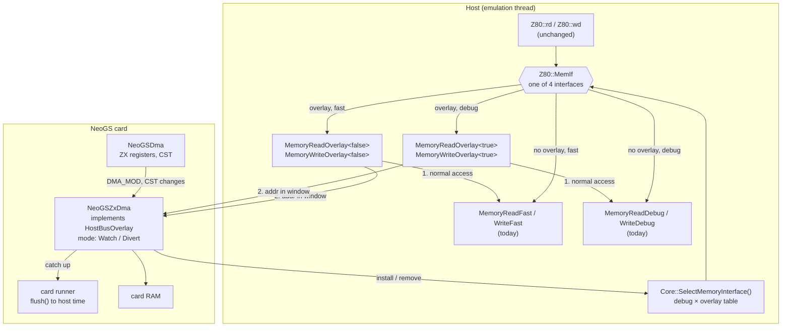
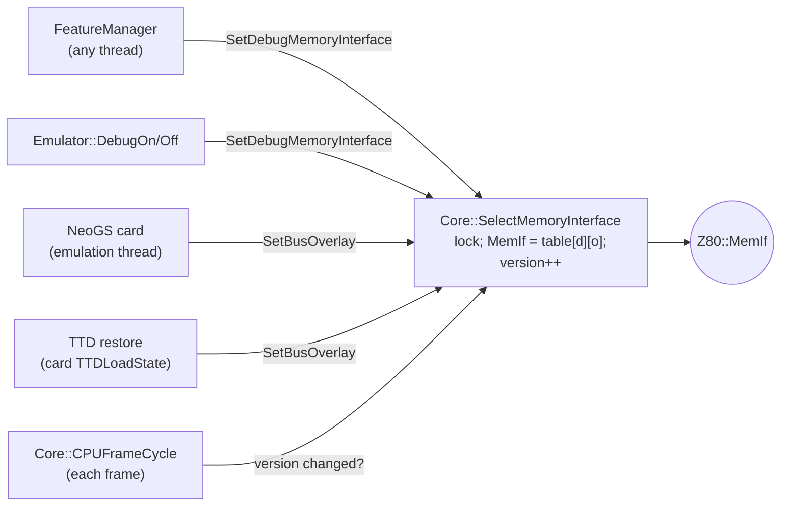
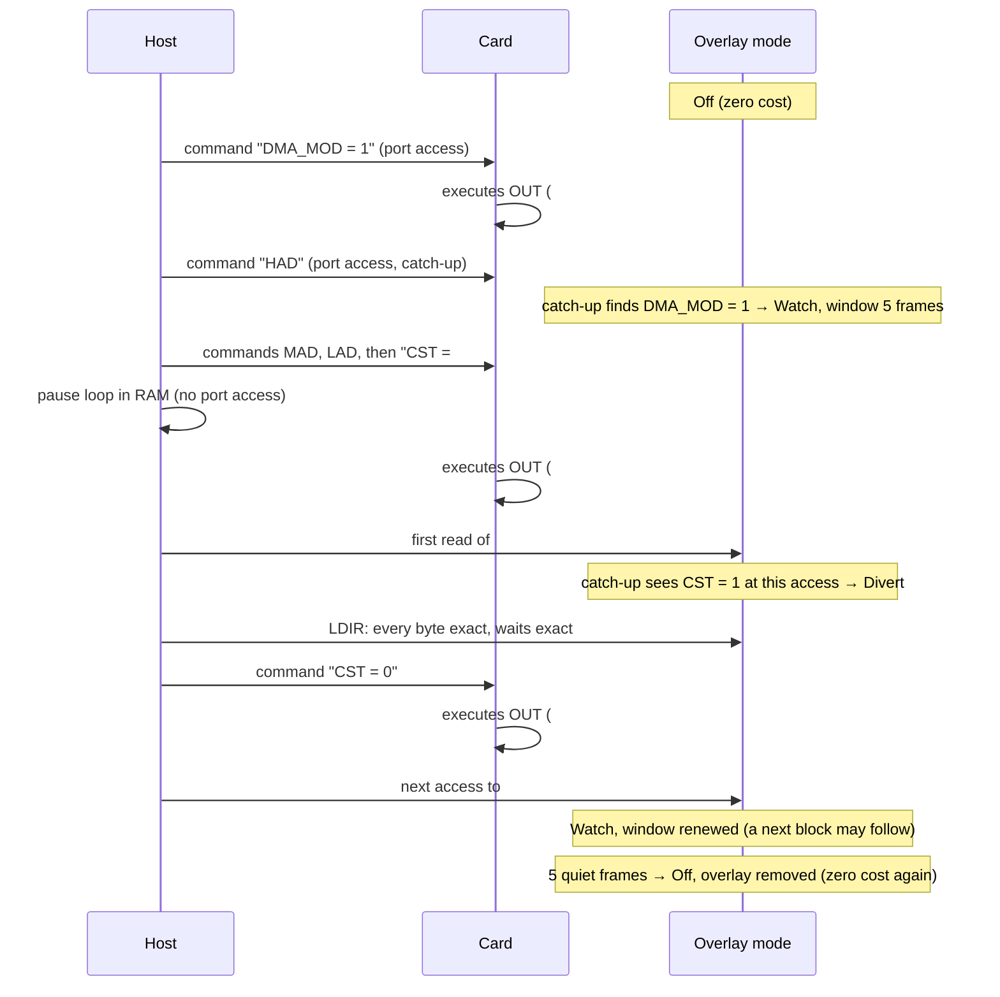
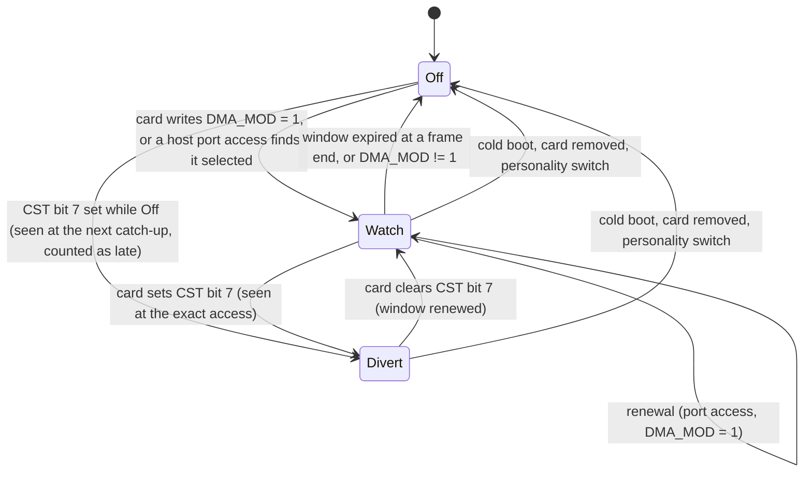
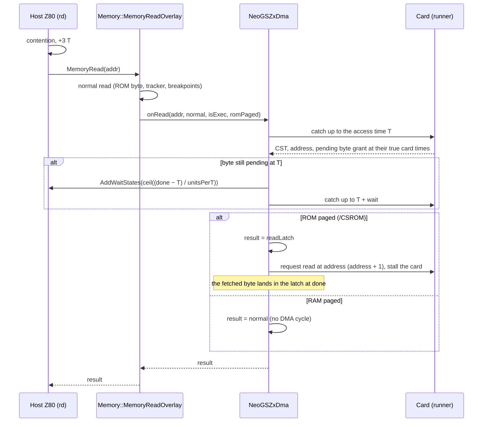
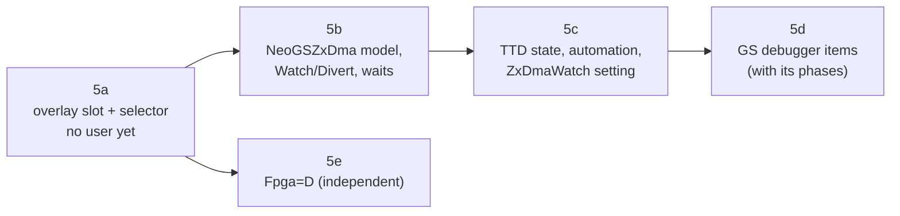

# NeoGS ZX-DMA (phase 5) — technical design

- **Date:** 2026-09-27.
- **Status:** design, not implemented. Parent design:
  [`neogs-tdd.md`](neogs-tdd.md) (§3.9 hardware, §5.7 first sketch, §9
  phase 5). This document replaces the §5.7 sketch for the ZX module.
- **Scope:** the NeoGS "ZX" DMA module, which lets the Spectrum read and
  write NeoGS card RAM through its own memory cycles at `#0000`-`#3FFF`. The
  document covers:
  - the host-side mechanism: where the code lives, how the host memory
    interface is replaced, how the replacement is switched on and off;
  - the card-side model;
  - TTD;
  - the extensions to the GS debugger and to automation;
  - the test suite and the benchmarks.
- **Hard requirement from the user:** switching must not slow the emulator.
  With no NeoGS fitted, or with ZX-DMA not in use, the Spectrum's memory path
  must cost exactly what it costs today.

## 0. Summary

**What ZX-DMA is.** It is not an extra port for addressing more memory in
layers. While the card's program has the ZX module running, the card
**takes over the Spectrum's memory cycles** in the first 16 KB:

- every Spectrum read of `#0000`-`#3FFF` (opcode fetches included) returns a
  byte of card RAM, provided the Spectrum has ROM paged there;
- every Spectrum write there goes into card RAM, and into Spectrum RAM too if
  RAM is paged there;
- the card address moves on by one after each byte;
- a read returns the byte fetched by the **previous** read, so the first read
  is junk;
- if the card has not finished the previous byte, it holds the Spectrum with
  `/WAIT`.

The feature exists so the Spectrum can move blocks to and from card RAM with
`LDIR`, faster than through the one-byte mailbox ports. No known program uses
it.

**The design in five points.**

1. **A host bus overlay slot** (§5.2). `Memory` gets one optional pointer,
   `HostBusOverlay* _busOverlay`, and two more memory interfaces (fast and
   debug) that call the normal read or write first and then the overlay.
   These interfaces are selected **only while an overlay is installed**. With
   no overlay, the Z80 uses the very same `FastMemIf` / `DbgMemIf` objects as
   today. So there is no new branch in `Z80::rd`, `Z80::wd` or
   `MemoryReadFast`.
2. **One selector** (§5.3). Today four places assign `Z80::MemIf`, and one of
   them (`Core::CPUFrameCycle`) re-assigns it every frame. They all become one
   function, `Core::SelectMemoryInterface()`, which picks from a 2 × 2 table
   (fast/debug × plain/overlay) under a small lock. The per-frame
   re-assignment becomes a check of a version number.
3. **Three overlay modes, gated by the card, costly only around a transfer**
   (§5.4):
   - **Off**: no overlay installed. This is the state whenever no NeoGS is
     fitted, whenever the card has not selected the ZX module, and a few
     frames after the last transfer.
   - **Watch**: a short, renewable window around a transfer. It opens when
     the card selects the ZX module, when a host port access finds it
     selected, and when a transfer ends. It closes after `ZxDmaWatchFrames`
     quiet frames (default 5). Spectrum accesses to `#0000`-`#3FFF` only
     bring the card up to date, so a start is seen at exactly the right
     access.
   - **Divert**: the ZX module is running (`CST` bit 7 = 1). Accesses to
     `#0000`-`#3FFF` go to the card. The moment the card clears `CST`, the
     next access reads ROM again and the mode drops to Watch.
4. **The card is brought up to date at each diverted access** (§5.5). The
   card normally runs up to a frame behind the Spectrum and catches up at
   port accesses and at the frame end. While the overlay is installed, it
   also catches up at every Spectrum access to `#0000`-`#3FFF`. That makes
   every DMA byte, every `/WAIT` and every stop exact. Only the moment the
   card *selects* the ZX module can be seen late (§5.5.3). With the
   documented way of driving ZX-DMA this is always in time, and a setting
   covers custom card programs.
5. **The ZX module is modelled from the FPGA state machine** (§5.6): the
   one-byte read lag, the pending byte, `/WAIT` in Spectrum T-states, the
   card CPU stall per byte, arbitration with the SD and MP3 modules, abort,
   and what the hardware does when reads and writes are mixed.

The GS debugger's planned **tight mode** (catch the card up at every main-CPU
memory access, `2026-09-27-gs-debugger/design.md` §5.2) becomes a fourth
overlay use rather than a branch inside `MemoryReadDebug` (§6.1).

## 1. Terms

| Term | Meaning here |
|---|---|
| **Host**, Spectrum | The main machine and its Z80 (`Z80`, `core/src/emulator/cpu/z80.*`). |
| **Card** | The NeoGS board and its own Z80 (`SoundChip_NeoGS`, unreal-z80 core). |
| **Memory interface** (`MemIf`) | A pair of member-function pointers (read, write) that the host Z80 calls for every memory access (`memory.h:59`, `z80.cpp:785, 814`). Today there are two: fast and debug. |
| **Overlay** | An object that sees the host's memory accesses in an address window after the normal access, and may replace the value read or add wait states. |
| **Catch-up** (flush) | Running the card's CPU up to the host's current moment. Today it happens before every host access to a GS port and at the frame end (`neogs-tdd.md` §5.3). |
| **Card unit** | NeoGS base tick, 1/120,000,000 s (`neogs-tdd.md` §5.2). |
| **T-state** (T) | One host CPU clock. |
| **/CSROM** | ZX-bus signal: the host's ROM chip is selected, i.e. ROM is paged at `#0000`. |
| **/WAIT** | ZX-bus signal that stretches the host's memory cycle. |
| **Arming** | The card has selected the ZX module (`DMA_MOD = 1`), so ZX-DMA may start at any moment. |

## 2. The hardware

Sources:
- `emulators/github/neogs/fpga/current/dma/dma_zx.v` (the module's state
  machines);
- `zxbus/zxbus.v:234-259` (bus decode, `/WAIT`, ROM blocking);
- `dma/dma_access.v` (bus grant);
- `dma/dma_sequencer.v` (arbitration);
- `docs/dma_zx_doc.txt` (the author's notes, CP1251).

### 2.1 Registers and control

- The module is selected with `DMA_MOD` (`#1B`) = 1. `#1C`-`#1F` then show
  its `HAD`, `MAD`, `LAD` (a 22-bit address) and `CST`. Only 21 address bits
  reach the memory (`neogs-tdd.md` §3.9).
- `CST` bit 7 switches the module on and off (`dma_zx.v:106-107`). Only the
  card writes it: the Spectrum cannot start ZX-DMA by itself.
- The address increments at the start of every card-side transfer
  (`dma_zx.v:110-111`).
- When `CST` bit 7 is 0 the two state machines are held idle and `/WAIT` is
  released (`dma_zx.v:166-167, 266-267, 293-294`).

### 2.2 The bus side (`zxbus.v:234-259`)

| Signal | Condition |
|---|---|
| ROM blocked (`/ZXBLKROM`) | module on **and** address `#0000`-`#3FFF`, any access |
| DMA read strobe | module on, address `#0000`-`#3FFF`, `/MREQ`, `/RD` **and `/CSROM`** |
| DMA write strobe | module on, address `#0000`-`#3FFF`, `/MREQ`, `/WR` (whatever is paged) |
| `/WAIT` to the host | module on, address `#0000`-`#3FFF`, `/MREQ`, and the module asks for a wait |
| Data put on the bus | on a DMA read: the module's read latch |

Consequences:
- **Reads with RAM paged at `#0000`** make no DMA cycle and do not move the
  address. They are still held by `/WAIT` if a byte is pending.
- **Writes with RAM paged** go to both Spectrum RAM and the card.
- **Writes with ROM paged** go to the card only; the ROM is not written.

### 2.3 The module's state machine (`dma_zx.v:151-278`)

| Host action | Card side | What the host sees |
|---|---|---|
| Read begins | Request a card RAM read at the current address; address + 1 at the grant | The byte currently in the **read latch** (from the previous read) |
| Read ends, card byte already fetched | Latch ← fetched byte | Nothing |
| Read ends, byte not yet fetched | Latch updated when it arrives; `/WAIT` armed | The **next** access to the window waits until the byte arrives |
| Write ends | Request a card RAM write of the byte; `/WAIT` armed until the grant | The next access to the window waits until the grant |
| Read begins while a write is still waiting | The write request is dropped (`dma_zx.v:238, 326`, "to prevent dead end") | No wait; the written byte is lost |
| Write begins while a read is still waiting | The read request is dropped (`dma_zx.v:214, 310`) | No wait |
| `CST` bit 7 cleared | Both machines idle, `/WAIT` released | Following accesses see ROM / RAM again |

The author warns against mixing reads and writes (`dma_zx_doc.txt`,
recommendation 3). The model follows the Verilog in these cases (§5.6.5) and
does not try to do better than the hardware.

### 2.4 Timing

Everything runs on the FPGA clock, which is the card CPU clock (10, 12, 20
or 24 MHz; `top.v:550, 801`).

| Step | Card clocks | Source |
|---|---|---|
| Synchronising the host strobe (negedge register, then posedge register, then edge detect) | about 2 | `dma_zx.v:126-145` |
| Request to `START` | 1 | `dma_access.v:92-103` |
| `START` → bus granted (`BUSRQ` → `BUSAK`): the card Z80 finishes its current machine cycle | 1-4, about 2 on average | `dma_access.v:105-116`; Z80 samples `BUSRQ` in the last T-state of each machine cycle |
| `READ1`, `READ2` / `WRITE1`, `WRITE2` | 2 | `dma_access.v:118-150` |
| Read data to the latch | 1 | `dma_zx.v:247-259` |

The model uses these constants:

| Constant | Value (card clocks) | Meaning |
|---|---|---|
| `kZxReadDoneClocks` | 8 | host read start → byte in the latch |
| `kZxWriteGrantClocks` | 5 | host write end → grant (end of the wait) |
| `kZxCardStallClocks` | 6 | card CPU off the bus per byte (the same as a one-byte burst today: 2 + `GRANT_OVERHEAD_CLOCKS` 4, `neogsdma.h:55-56`) |

These are estimates read from the Verilog, not measurements on a board, and
they are marked as such in the code. The one approximation that matters is
the `BUSRQ` latency, since the card core runs whole instructions (§5.6.3).

## 3. What exists in unreal-ng today

### 3.1 The host memory path

- `Z80::rd` adds ULA contention, adds 3 T, then calls
  `(_memory->*MemIf->MemoryRead)(addr, isExecution)`. `Z80::wd` does the
  same for writes (`z80.cpp:765-815`). Opcode fetches go through the same
  `rd` with `isExecution = true` (`z80.cpp:696`), and so do interrupt vector
  reads and interrupt pushes (`z80.cpp:1011, 1157, 1177`).
- `MemIf` points to one of two `MemoryInterface` objects created in the `Z80`
  constructor (`z80.cpp:35-37`):
  - `FastMemIf` → `MemoryReadFast` / `MemoryWriteFast`: one table lookup;
  - `DbgMemIf` → `MemoryReadDebug` / `MemoryWriteDebug`: access tracker, TTD
    dirty pages and journal, probes, breakpoints.
- `MemoryReadFast` and `MemoryReadDebug` are **virtual**: `ScorpionMemory`
  overrides them to clock its ProfROM switching (`scorpionmemory.cpp:50-65`).
  A member-function pointer to a virtual function dispatches virtually, so
  the override runs through `MemIf` too.
- Writes to a ROM bank go to a trash page (`memory.cpp:960, 1004`).
  `Memory::IsBank0ROM()` tells whether `#0000` shows ROM (`_bank_mode[0] ==
  BANK_ROM`, `memory.cpp:1125`). The Pentagon cache (`BANK_CACHE`) is not ROM.

### 3.2 Who assigns `MemIf` today

| Place | When | What |
|---|---|---|
| `Core::Init` (`core.cpp:330`) | creation | fast |
| `Core::CPUFrameCycle` (`core.cpp:765-781`) | **every frame** | fast or debug from `Z80::isDebugMode` |
| `FeatureManager::onFeatureChanged` (`featuremanager.cpp:566-574`) | a debug feature toggled, from any thread | fast or debug |
| `Emulator::DebugOn` / `DebugOff` (`emulator.cpp:2903-2918`) | debugger attach / detach | fast or debug |

An overlay installed by setting `MemIf` directly would be undone at the next
frame start, or by any feature toggle. So selection has to be centralised
first (§5.3).

### 3.3 The card's catch-up

- The card follows the host lazily: `flush()` runs it up to the host's
  current T before every host access to `#B3`, `#BB` and `#33`, and
  `handleFrameEnd` runs it to the end of the frame (`neogs-tdd.md` §5.3). So
  it can be up to one frame behind the host at any other moment.
- The mailbox is exact under this rule because the two CPUs only see each
  other through ports. ZX-DMA breaks that assumption: the card now also sees
  host **memory** accesses, and the host sees the card through them.
- `NeoGSDma` already stores the ZX module's registers and ignores `CST` for
  it (`neogsdma.cpp:99-100`).

### 3.4 Other emulators

- Unreal Speccy has no ZX-DMA.
- NedoPC's patched Unreal 0.39 (`pentevo/tools/unreal_fix/0.39.0/nedopc/
  gsz80.cpp:496-517, 565-585`) keeps the registers only; its debugger shows
  the DMA address in the memory view title (`dbgmem.cpp:164`). No transfer is
  emulated.

There is no reference implementation to compare with. The FPGA sources are
the only authority, and our own test programs are the acceptance tests
(§8.3).

## 4. Goals and non-goals

**Goals**

| ID | Goal |
|---|---|
| G1 | Exact ZX-DMA behaviour for every host access to `#0000`-`#3FFF` while the module runs: data, lag, address, `/WAIT`, /CSROM rule, write-through. |
| G2 | **Zero cost** when no NeoGS is fitted, and when NeoGS is fitted but has not selected the ZX module: the same `MemIf` objects as today, no new code on any per-access or per-instruction path. |
| G3 | Correct in fast and debug mode, with every switch between them in any state: breakpoints, memory tracking and TTD keep working while ZX-DMA runs. |
| G4 | Deterministic, and restorable at any point by TTD (a v1 blob today). |
| G5 | Visible to the debuggers and to all automation surfaces. |
| G6 | Measured cost in every mode, and a bit-identical host for everything else. |

**Non-goals**

- Faithful failure when the card is slower than the host (the documentation
  says it "does not work"). The model produces waits instead (§5.6.3).
- Machine-cycle accurate `BUSRQ` inside card instructions: the card core
  steps whole instructions (§5.6.3).
- `Fpga=D`: that board has no DMA, so the overlay is never installed.

## 5. Design

### 5.1 Overview



### 5.2 The host bus overlay slot

**Files**
- `core/src/emulator/memory/hostbusoverlay.h`: the interface (new).
- `core/src/emulator/memory/memory.h/.cpp`: the slot, the two overlay
  interfaces.
- `core/src/emulator/cpu/core.h/.cpp`: the selector (§5.3).
- `core/src/emulator/cpu/z80.h`: `AddWaitStates` (§5.7).

**The interface**

```cpp
// emulator/memory/hostbusoverlay.h
/// A device that watches host memory accesses in one address window, after
/// the normal access has been made. Installed only while the device needs it
/// (Core::SetBusOverlay); never on the plain fast / debug path.
class HostBusOverlay
{
public:
    virtual ~HostBusOverlay() = default;

    /// Window [start, end) of the host address space the overlay sees
    uint16_t windowStart = 0x0000;
    uint32_t windowEnd = 0x4000;   // 0x10000 = the whole space

    /// A host read in the window. `normal` is what the normal access
    /// returned; the result is what the CPU gets. `romPaged` is /CSROM.
    virtual uint8_t onRead(uint16_t addr, uint8_t normal, bool isExecution, bool romPaged) = 0;
    /// A host write in the window, after the normal write was made
    virtual void onWrite(uint16_t addr, uint8_t value, bool romPaged) = 0;
};
```

**The slot and the overlay interfaces in `Memory`**

```cpp
// memory.h
HostBusOverlay* _busOverlay = nullptr;       // set only through Core::SetBusOverlay
static MemoryInterface* GetOverlayMemoryInterface(bool debug);
template <bool Debug> uint8_t MemoryReadOverlay(uint16_t addr, bool isExecution);
template <bool Debug> void MemoryWriteOverlay(uint16_t addr, uint8_t value);

// memory.cpp
template <bool Debug>
uint8_t Memory::MemoryReadOverlay(uint16_t addr, bool isExecution)
{
    // The normal access first: model overrides (Scorpion ProfROM), the access
    // tracker, TTD coverage and probes and breakpoints all run as today
    const uint8_t normal = Debug ? MemoryReadDebug(addr, isExecution) : MemoryReadFast(addr, isExecution);
    HostBusOverlay* overlay = _busOverlay;
    if (addr < overlay->windowStart || addr >= overlay->windowEnd)
        return normal;
    return overlay->onRead(addr, normal, isExecution, _bank_mode[0] == BANK_ROM);
}
```

- `MemoryReadFast` and `MemoryReadDebug` are called virtually here (plain
  member calls on `this`), so `ScorpionMemory`'s override still runs.
- Writes: the normal write first, so that Spectrum RAM, the trash page for
  ROM, TTD dirty tracking and write breakpoints behave as today. Then
  `onWrite`.
- The four `MemoryInterface` objects (fast, debug, overlay fast, overlay
  debug) are created once in the `Z80` constructor, next to today's two.

**Why not a branch in `MemoryReadFast`.** It would add a load and a compare
to every memory access of every machine (G2). The ULA contention check in
`Z80::rd` shows what that looks like; the point of the overlay is that this
check exists only while an overlay is installed.

**Why the normal access first.** A diverted read on real hardware still
places the address on the bus and still clocks anything that decodes it.
Scorpion's ProfROM switch decodes the address, not the ROM's output.
Breakpoints and the access tracker keep seeing every access. The cost is one
wasted table lookup per diverted access, only while ZX-DMA runs.

**One slot, not a chain.** Only one device can own the host bus window at a
time. `Core::SetBusOverlay` refuses a second overlay with a logged error. The
NeoGS card is the only user; the GS debugger's tight mode (§6.1) goes
through the same NeoGS overlay object, not a second one.

### 5.3 One selector for the memory interface

```cpp
// core.h
void SetDebugMemoryInterface(bool debug);    // replaces UseFast/UseDebugMemoryInterface
void SetBusOverlay(HostBusOverlay* overlay); // nullptr removes it
void SelectMemoryInterface();                // MemIf = table[debug][overlay != nullptr]
```



- **The table.** `Z80` holds four interface pointers: `{Fast, Dbg,
  OverlayFast, OverlayDbg}`. The selector writes
  `MemIf = table[debug][overlay != nullptr]` and sets
  `Memory::_busOverlay = overlay`. With no overlay, `MemIf` is the very same
  `FastMemIf` / `DbgMemIf` pointer as today (G2), and tests check that by
  pointer identity (§8.1).
- **The call sites.** The four places of §3.2 call the selector instead of
  writing `MemIf`. `Core::UseFastMemoryInterface` and
  `UseDebugMemoryInterface` remain as one-line wrappers during the migration.
- **Threading.** Feature toggles come from the UI and automation threads; the
  card installs and removes its overlay on the emulation thread. Two threads
  writing `MemIf` without order could leave the wrong interface in place: for
  example, the UI thread reads "no overlay", the card installs one, and the
  UI thread then writes the plain debug interface over it.
  - All writers take one small mutex (`_memIfMutex`) and recompute the
    pointer from both flags inside it.
  - `Z80::rd`/`wd` read `MemIf` without a lock, as today; a pointer store is
    atomic on every platform we build for. `MemIf` becomes
    `std::atomic<const MemoryInterface*>` with relaxed loads, which generate
    the same instruction as a plain load.
  - Switches happen at most a few times per transfer, so the mutex costs
    nothing measurable.
- **The per-frame re-assignment.** `Core::CPUFrameCycle` today writes `MemIf`
  every frame from `isDebugMode`. It becomes: "if the selector's version
  differs from the one seen last frame, call `SelectMemoryInterface()`". That
  is one relaxed atomic load per frame.
- **The switch takes effect on the next access.** A switch made during an
  access (the card installs the overlay while it catches up inside a port
  access, for example) applies from the next memory access. The access in
  progress has already been dispatched.

### 5.4 Gating and switching: the overlay modes

The NeoGS card owns one overlay object, `NeoGSZxDma`. Its **mode** decides
what it does with an access in the window. Whether the overlay is installed
at all follows from the mode. The rule is: pay while a transfer runs, watch
closely for a short time around it, and pay nothing otherwise.

| Mode | Installed | Condition (card state) | What an access in `#0000`-`#3FFF` does |
|---|---|---|---|
| **Off** | no | none of the below; always when no NeoGS is fitted or with `Fpga=D` | — (plain path) |
| **Watch** | yes | `CST` bit 7 = 0, `DMA_MOD` = 1, and the **watch window** is open | brings the card up to the access time; if that turns ZX-DMA on, the access is handled as in Divert |
| **Divert** | yes | `CST` bit 7 = 1 | brings the card up to date, then the ZX module model (§5.6) |

**The watch window.** It is a deadline in frames, `_watchUntilFrame`:
- **Opened or renewed**, to `current frame + ZxDmaWatchFrames`
  (`[NGS] ZxDmaWatchFrames`, default 5, about 100 ms), by:
  1. the card writing `DMA_MOD = 1`;
  2. the card clearing `CST` bit 7, i.e. a transfer ended, so a following
     block is watched too;
  3. a **host GS port access** (`#B3`, `#BB`, `#33`, read or write) whose
     catch-up finds `DMA_MOD = 1`. The catch-up runs before the port access,
     so at that moment the card state is exact.
- **Closed** at a frame end when the deadline has passed, `CST` bit 7 is 0,
  and nothing renewed it: the mode drops to Off and the overlay is removed.
  The check runs once per frame in `handleFrameEnd`, never per access or per
  instruction.
- **`[NGS] ZxDmaWatch=always`** (§5.5.3) keeps the window open for good
  whenever NeoGS is fitted with the current FPGA.

**One transfer, start to end** (stock firmware, commands through the ports):





- **Who switches.** The card's port handlers for `#1B` (`DMA_MOD`) and `#1F`
  (`CST`), the host port handlers after their catch-up, and the frame-end
  check call `NeoGSZxDma::updateMode()`. That calls
  `Core::SetBusOverlay(this)` or `SetBusOverlay(nullptr)` only when the
  installed / not-installed status changes. Watch ↔ Divert changes only the
  object's own field.
  - Everything happens on the emulation thread: inside a catch-up, in a host
    port access or at the frame end.
- **More responsive once a transfer runs.** Divert cannot be made more
  prompt: every access in the window already catches the card up first, so
  a `CST` clear is honoured at the very next access. Accesses outside the
  window cost only the window compare (§5.10).
- **Leaving.** A cold boot (host reset, `#80` restart), the FPGA reset
  (`#33`: `NeoGSDma::reset` clears the run bits and `DMA_MOD`), a personality
  switch and card destruction all set the mode to Off.
  The card destructor removes the overlay before the object dies. A test
  covers each path (§8.2).
- **Fast / debug.** The mode is independent of the debug flag: the selector
  combines them. Turning debug on or off in any mode keeps the mode (§8.2).

### 5.5 Keeping the card in step with the host

#### 5.5.1 The rule

The card never runs ahead of the host (`2026-09-27-gs-debugger/design.md`
§5.1): a host access that belongs earlier would otherwise reach a card that
has already moved on. ZX-DMA keeps that rule and **adds catch-up points**:
while the overlay is installed, every host access to `#0000`-`#3FFF` first
runs the card up to that access.

| Mode | Card behind the host by at most | Catch-up points |
|---|---|---|
| Off | one frame | host GS port access, frame end (today) |
| Watch, Divert | one frame, but never at a `#0000`-`#3FFF` access | the above, plus every host access to `#0000`-`#3FFF` |

#### 5.5.2 Why this is exact while the overlay is installed

Take a host access at host time `T`:
1. The card is run up to `T`. Everything the card program did before `T` has
   happened: `CST` on or off, an address change, the previous byte's grant.
2. The access is then handled with the state at `T`.

So in Watch mode the **first access after the card sets `CST`** is already
diverted, however long the host ran from RAM before it. In Divert mode a
`CST` clear takes effect at exactly the right access. Each byte's `/WAIT` is
computed from the card's real completion time.

#### 5.5.3 The one case that can be late: a start with no watch window open

In mode Off nothing watches the window. A start is seen late only if all of
these hold:
- the card sets `CST` while the watch window is closed, which means no port
  access with the module selected in the last `ZxDmaWatchFrames` frames, and
  no transfer ended in that time;
- and the host reads `#0000`-`#3FFF` before the next catch-up (a GS port
  access or the frame end).

The host then reads ROM there instead of DMA bytes.

- **The documented way of driving ZX-DMA is always in time.** The card is
  told what to do through the mailbox, one command at a time. Each command
  is a host port access, and so a catch-up. With the stock firmware
  (`gs105a`), the host writes `DMA_MOD`, `HAD`, `MAD`, `LAD` and `CST` through
  "write card port" commands, waiting for each to be taken
  (`dma_zx_doc.txt`, recommendation 2). By the time the host sends the `CST`
  command, `DMA_MOD = 1` has been seen and the `CST` command's own port
  access has renewed the window. The card executes the command well within
  5 frames (the documentation measures the firmware's latency in bytes, i.e.
  microseconds), so the pause it asks for after `CST` is exact.
- **Back-to-back blocks** stay watched: each `CST` clear renews the window.
- **A custom card program** that starts the module on its own, long after
  any port traffic, can raise `ZxDmaWatchFrames` or use
  `[NGS] ZxDmaWatch=always`. The overlay is then in Watch mode
  whenever NeoGS is fitted with the current FPGA, at the cost of a catch-up
  on every host access to `#0000`-`#3FFF` (measured, §9). The default is
  `selected`.
- **It is never silent.** When a catch-up finds that `CST` was set at card
  time `Tc` while the overlay was Off, the card records how late the start
  was seen: `lateStartUnits = catch-up time − Tc`. It logs a warning once per
  session and exposes the counter to automation (§7) and to the debugger
  (§6). A test case reproduces the window on purpose and checks the counter
  (§8.3).

Alternatives considered and rejected:

| Alternative | Why not |
|---|---|
| Watch the window whenever NeoGS is fitted | A catch-up per ROM access (BASIC, the IM 1 handler) on every NeoGS machine: breaks G2. Kept as the opt-in `always`. |
| Watch for as long as `DMA_MOD = 1` | A card program that leaves the module selected after a transfer would keep the overlay installed for good. The renewable window gives the same exactness for the command-driven protocol and returns to zero cost a few frames after the last transfer. |
| Run the card ahead of the host | A later host port write would have to undo card work: a rollback of 4.5 MB of state. |
| Catch up every N T-states while NeoGS is fitted | A bounded error, not zero, and a cost on every NeoGS machine. |
| Undo the host's reads after a late start | Impossible without a host rollback. |

### 5.6 The ZX module model (`NeoGSZxDma`)

**Files**
- `core/src/emulator/sound/chips/neogs/neogszxdma.h/.cpp`: the model and the
  `HostBusOverlay` implementation (new).
- `neogsdma.h/.cpp`: keeps the ZX registers (`_regs[ZX]`) and tells the
  model about `DMA_MOD` and `CST` writes.
- `soundchip_neogs.h/.cpp`: owns the model and gives it the catch-up,
  the stall and the host-time conversion.

#### 5.6.1 State

```cpp
class NeoGSZxDma final : public HostBusOverlay
{
    enum class Mode : uint8_t { Off, Watch, Divert };
    enum class Pending : uint8_t { None, Read, Write };

    Mode _mode = Mode::Off;
    uint8_t _readLatch = 0xFF;       // what the next host read returns
    Pending _pending = Pending::None;
    int64_t _pendingDone = 0;        // card units: read byte in the latch / write granted
    uint8_t _pendingData = 0;        // write data
    uint32_t _pendingAddress = 0;    // card RAM address of the pending byte
    bool _pendingLatchFromRead = false;

    // Statistics (automation, debugger; also TTD state, so a replay shows them)
    uint64_t _bytesRead = 0, _bytesWritten = 0, _bytesDropped = 0;
    uint64_t _waitTStates = 0, _lateStartUnits = 0;
    int64_t _cstOnAt = 0;            // card time CST last went to 1 (late-start check)
    uint32_t _watchUntilFrame = 0;   // watch window deadline (§5.4)
};
```

#### 5.6.2 A host access in the window (Divert mode)



In detail, for an access whose `rd`/`wd` call happens at host time `t`
(after the 3 T of the access; the access began at `t − 3`, `/WAIT` is
sampled at `t − 2`):

1. **Catch up** the card to `t`. If the mode is now Off or Watch (the card
   cleared `CST` before `t`), return `normal`: no DMA.
2. **Wait.** If a byte is pending and `_pendingDone` (card units) is later
   than the sample point `t − 2`, add
   `w = ceil((_pendingDone − toCard(t − 2)) / unitsPerT)` T-states to the
   host (§5.7), and catch the card up to `t + w`. This finishes the pending
   byte:
   - a pending read puts its byte in the latch;
   - a pending write has been granted.
3. **Read** (ROM paged):
   - the result is `_readLatch`;
   - a new read is requested at the module's address;
   - the address is incremented (at the grant, as the hardware does);
   - the fetched byte goes to the latch at `request + kZxReadDoneClocks`;
   - `_pendingDone` is set to that time.
4. **Read** (RAM paged): the result is `normal`, and the address does not
   move. The wait of step 2 still applies (`zxbus.v:248`).
5. **Write:**
   - the byte is requested;
   - it is written to card RAM at the grant, at
     `t + kZxWriteGrantClocks`;
   - the address is incremented;
   - the grant time becomes `_pendingDone`.
6. **Card stall.** Each byte stalls the card CPU for `kZxCardStallClocks`,
   through the runner's `stall()`, the same path as the SD and MP3 bursts.
7. **Pending byte done.** The card-side event that completes the pending
   byte (latch update or RAM write, address increment) is an event on the
   card runner at `_pendingDone`. It fires during whichever catch-up passes
   that time: the next access's, a port access's, or the frame end's.

#### 5.6.3 The `BUSRQ` approximation

The card core runs whole instructions. A real grant comes at the end of the
card's current **machine cycle** (≤ 4 clocks). The model does not wait for
the card's next **instruction** boundary (up to 23 clocks), because that
would make host waits much longer than on the board. Instead:

- the host-visible completion time is `request + k…Clocks` (§2.4), whatever
  the card CPU is doing;
- the card's stall for that byte is added at its next instruction boundary,
  as for the existing bursts (`neogs-tdd.md` §3.9).

What the card CPU sees is therefore off by at most one instruction for the
stall, and the card RAM byte may land "during" an instruction that reads the
same location. The documentation forbids that kind of sharing anyway. The
host sees realistic waits.

#### 5.6.4 Arbitration with the SD and MP3 modules

The sequencer takes turns between pending modules while it is busy
(`dma_sequencer.v:86, 177`). A ZX byte requested during an SD or MP3 burst
therefore gets the next slot, not the end of the burst:
- its completion is later by one burst byte (2 clocks);
- the burst is longer by the ZX byte's slot.

`NeoGSDma` exposes the current burst window, and the model applies both
adjustments.

#### 5.6.5 Mixed directions, abort, edge cases

| Case | Model (after `dma_zx.v`) |
|---|---|
| Host read while a write is still pending | The write is dropped (`_bytesDropped++`), no wait, then the read proceeds |
| Host write while a read is still pending | The read is dropped (the latch keeps its old value), no wait |
| `CST` cleared with a byte pending | The pending byte is discarded, no wait, the mode changes |
| `DMA_MOD` changed while `CST` = 1 | The module keeps running: `CST` belongs to the module, not to the selection |
| `HAD` bit 5 | Stored, read back, ignored for the address (21 bits, `neogs-tdd.md` §3.9) |
| Address past the end of card RAM | Wraps within the 2 MB DMA space, as `NeoGSDma` does |
| Refresh cycles | Not seen: the host Z80 model has no refresh access, and `/WAIT` is not sampled in refresh |
| Host IM 1 or IM 2 interrupt with ROM paged | The vector read and the handler's fetches at `#0038` consume DMA bytes, as the documentation warns (recommendation 1) |

### 5.7 Wait states in the host Z80

```cpp
// z80.h
/// Stretches the memory cycle in progress by `tStates` (a device's /WAIT).
/// Called from a memory overlay; the plain memory paths never call it.
inline void AddWaitStates(uint32_t tStates) { tt += static_cast<uint64_t>(tStates) * rate; }
```

- It is the same increment as ULA contention (`IncrementCPUCyclesCounter`,
  `z80.cpp:1226-1229`). It happens after the 3 T of the access instead of
  before them, which changes nothing the machine can observe: the
  instruction's total length is what counts.
- `Z80::rd`/`wd` do not change (G2).
- Host speed and hardware turbo: the wait is computed in host T-states from
  the card's time at the current host rate. So a host at 14 MHz against a
  12 MHz card gets more T-states of wait, as on the board.

### 5.8 Worked examples

**Read a 512-byte block** (the documented recipe). Pentagon at 3.5 MHz, card
at 24 MHz: one host T is 6.86 card clocks.

1. The host asks the card (stock firmware, "write card port" commands) to
   write `DMA_MOD = 1`. The host's next port access catches the card up,
   which sees the write → mode Watch, overlay installed.
2. The card writes the start address `#012000`, then `CST = #80`. Both
   happen inside catch-ups at the host's port accesses → mode Divert.
3. The host runs `LD A,(#0000)` (a dummy read):
   - it gets the old latch;
   - the card fetches `#012000`, and the address becomes `#012001`.
4. The host runs `LD HL,#0000 : LD DE,#8000 : LD BC,512 : LDIR`. Each
   `LDIR` step reads `#0000`-`#3FFF` (21 T apart) and writes to `#8000+`.
   - Read *n* returns the byte fetched by read *n − 1*: card bytes
     `#012000`, `#012001`, …
   - A fetch takes 8 card clocks = 1.2 T, far less than 21 T, so there are
     no waits.
5. After the block, the host tells the card to clear `CST` → the next
   catch-up sets the mode to Watch, and the next `#0000` access reads ROM
   again.

**Waits at a fast host.** The host runs at turbo 4× (14 MHz, 1 T = 71.4 ns)
and the card at 12 MHz (8 clocks = 667 ns = 9.3 T). `LD HL,(#0000)` reads
`#0000` and `#0001` back to back, 3 T apart:
- the second read's `/WAIT` sample comes 1 T into its cycle;
- the first byte is done 9.3 T after the first read began;
- so the host waits `ceil(9.3 − 3 − 1) = 6` T.

The same instruction at 3.5 MHz with a 12 MHz card (8 clocks = 2.3 T) does
not wait.

### 5.9 TTD

- **State.** The model's fields (§5.6.1), including the statistics and the
  watch window deadline (a frame number, restored with the frame counter), join the
  NeoGS blob as a fixed-size `NeoGSZxDma::saveState` block (layout version 3,
  after the DMA block; `neogs-tdd.md` §7.4).
- **Restore.** `SoundChip_NeoGS::TTDLoadState` restores the model, then calls
  `updateMode()`. That installs or removes the overlay through the selector,
  so a seek into the middle of a transfer continues exactly, in fast or
  debug mode.
- **Recording** turns debug mode on (`timetravelmanager.cpp:137-176`). The
  selector keeps the overlay and switches it to its debug variant, so the
  host's RAM writes during write-through are dirty-tracked and journalled as
  usual.
- **Card RAM** written by ZX-DMA is in the v1 blob. With v2 memory regions,
  the model marks the card page dirty on every write, like the SD burst.
- **Determinism.** Every catch-up happens at a host access time that is
  itself deterministic, so a replay makes the same catch-ups in the same
  order (§8.2 checks fast = debug = replay).

### 5.10 Cost

| Situation | Host memory path | Per instruction | Per frame | Card side |
|---|---|---|---|---|
| No NeoGS | today's `FastMemIf` / `DbgMemIf`, **same pointers** | nothing | one relaxed atomic load (replaces today's `MemIf` store) | — |
| NeoGS, mode Off (every player, `test_ngs`, NPL with SD/MP3 DMA) | the same | nothing | the same | one compare in the `#1B` / `#1F` write handlers |
| NeoGS, mode Watch (at most `ZxDmaWatchFrames` after DMA activity) | + overlay call (a table lookup and a window compare) on every access; a catch-up call on accesses to `#0000`-`#3FFF` | — | one frame-counter compare | the card runs in more, shorter stretches |
| NeoGS, mode Divert | as Watch, plus the model per access in the window | — | — | + stall per byte |
| `ZxDmaWatch=always` | Watch on every NeoGS machine | — | — | as Watch |

Watch and Divert are paid only by programs that select the ZX module. The
budgets are in §9.

## 6. GS debugger extensions

This builds on `2026-09-27-gs-debugger/design.md` (not implemented yet).
Section numbers below refer to that document.

### 6.1 Tight mode goes through the overlay

The debugger design adds `if (_cardTight) gs->flush();` to
`MemoryReadDebug`/`MemoryWriteDebug` (§5.2 there). With the overlay slot it
becomes an overlay mode instead:

- `NeoGSZxDma` (and a small equivalent for the classic card,
  `GSTightOverlay`) gets a **tight** flag. While it is set, the window is the
  whole 64 KB and every access catches the card up.
- In Divert or Watch mode the ZX behaviour still applies inside
  `#0000`-`#3FFF`. The two combine in one object, so there is still one
  overlay slot.
- **Gain:** `MemoryReadDebug` gets no branch at all. The debug path also
  stays as it is when card debugging is off.
- The coordinator turns tight mode on and off through
  `Core::SetBusOverlay`, like the card does.

### 6.2 Main CPU target

| Item | Behaviour |
|---|---|
| Memory view `#0000`-`#3FFF` | Shows the host's ROM/RAM, as now. A banner while Divert: "ZX-DMA active: reads here return card RAM @`#012345`; next byte `#A7`". The banner reads the model without side effects. |
| Peek / disassembly at `#0000`-`#3FFF` | Side-effect free: never consumes a DMA byte. While Divert, the disassembler marks the region "bytes come from the card at run time". |
| Memory breakpoints in the window | Fire as today (address based). The access tracker records the host's normal byte; the ZX-DMA trace (§6.4) records the card byte. |
| Instruction progress (§5.4 there) | Counts ZX-DMA waits like contention: `contentionAccumulated` gains the waits, and the progress line says "wait". |

### 6.3 NeoGS card target (requirement N4)

- **DMA panel**, per module (ZX, SD, MP3):
  - selected, running;
  - 21-bit address with its 16K page;
  - for ZX: mode (Off / Watch / Divert), read latch, pending byte (kind,
    address, done in card clocks), bytes read / written / dropped, wait
    T-states, late-start counter.
- **Page-tied breakpoints on card RAM** (§3.3 there) also fire for card RAM
  written by the ZX module. The hit reports "written by ZX-DMA" and the host
  PC that caused it.
- **New event breakpoints**, in the `BRK_EVENT` type that the GS debugger
  design proposes (it does not exist yet; today's types are memory, I/O and
  keyboard, `breakpointmanager.h:21-24`):
  - ZX-DMA started or stopped (a `CST` edge);
  - host wait over N T-states;
  - byte dropped (mixed directions);
  - late start detected.

### 6.4 The ZX-DMA trace

- The GS port trace (`GSPortTraceRecorder`, `gsporttrace.h:134`) gets a new
  `GSTraceSide::ZxDma` with the fields:
  host time, card time, direction, card address, value, wait, host PC.
- It is recorded only while tracing is on, like the port trace.
- Use: "what exactly moved, and where did the host wait".

### 6.5 Pause and step with ZX-DMA

- A host step or a host breakpoint inside the window happens after the
  catch-up and the model, so the paused state is consistent: card and host
  agree on the latch and the address.
- A card step while the host is parked in a diverted access follows the
  coordinator walk-through (§5.3 there): the host is inside a bus callback,
  which is a park point.

## 7. Automation extensions

Every surface shows the same fields, from one `NeoGSStateInfo` extension:

```cpp
struct NeoGSZxDmaInfo
{
    const char* mode;              // "off" | "watch" | "divert"
    bool selected, running;
    uint32_t address;              // 21 bits in effect
    uint8_t readLatch;             // the byte the next host read gets
    const char* pending;           // "none" | "read" | "write"
    uint32_t pendingAddress;
    uint64_t bytesRead, bytesWritten, bytesDropped, waitTStates, lateStartUnits;
    const char* watchSetting;      // "selected" | "always"
    uint32_t watchFrames;          // ZxDmaWatchFrames
    int32_t watchFramesLeft;       // until the window closes; -1 when closed
};
```

| Surface | Addition |
|---|---|
| CLI | The NeoGS section of the GS state output shows a ZX line: `ZX: divert @0x012345 latch A7 pending read, 512 rd / 0 wr, waits 0 T, late 0`. New `gszxdma` command prints the full record. `gsporttrace events` shows `zxdma` entries. |
| WebAPI | `GET /api/v1/emulator/{id}/state/audio/gs` → `neogs.dma.zx` object; `.../state/audio/gs/porttrace` includes `zxdma` entries; OpenAPI (`openapi_state.inc`) updated. |
| MCP | `gs_state` returns `neogs.dma.zx`; `gs_porttrace_events` includes `zxdma` entries. |
| Lua / Python | `neogs.dma.zx` table / dict next to the existing `neogs` fields; `gs_zxdma()` convenience call. |
| Settings | `[NGS] ZxDmaWatch = selected \| always` (default `selected`) and `[NGS] ZxDmaWatchFrames` (default 5); `settings` shows and changes them at run time: switching to `always` installs the overlay at once. |
| Docs | `command-interface.md`, MCP `README.md`, the Lua/Python references. |

Automation never starts ZX-DMA: only the card's program does, as on the
board. For tests, the card's program is loaded through the existing module
and program upload paths.

## 8. Tests

The suite has five parts. Parts 8.1 and 8.2 guard everything that exists
today; part 8.3 is the hardware behaviour. File names follow the file under
test.

### 8.1 Nothing changes without NeoGS

| File | Checks |
|---|---|
| `core/tests/emulator/cpu/core_test.cpp` (new, after `core.cpp`) | For every shipped model (`data/configs`: 48K, 128K, +3, Pentagon 128K/512K, Scorpion, Profi, Profi-Scorpion, ATM 710, ATM 3, TS-Conf): after creation, after 10 frames, after every debug-feature toggle and after `DebugOn`/`DebugOff`, `z80->MemIf` **is** `FastMemIf` or `DbgMemIf` (pointer identity), never an overlay interface. The selector's version does not change across frames without a toggle. |
| `core/tests/emulator/memory/modelsregression_test.cpp` (extended) | Golden digests recorded on master before the change: for each model, a fixed program and three snapshots from the corpus run 200 frames in fast and in debug mode. Host RAM hash, T-state count, CPU registers and the TTD machine hash must match master. |
| `core/tests/debugger/ttd/ttddivergencecorpus_test.cpp` (unchanged) | The TTD corpus replays as before: proves the debug path and TTD are untouched. |
| `soundchip_gs_golden_test.cpp` (unchanged) | The classic GS card stays bit-identical. |
| `soundchip_neogs_acceptance_test.cpp` (extended) | NeoGS fitted, programs that never select the ZX module (`test_ngs`, NPL v0.60 with SD and MP3 DMA, the flasher): `MemIf` stays plain for the whole run (checked every frame). |

### 8.2 Switching is always right, in fast and debug mode

| File | Checks |
|---|---|
| `core/tests/emulator/memory/hostbusoverlay_test.cpp` (new) | With a fake overlay on a Pentagon, the selector table for all four combinations; window bounds (`#3FFF` in, `#4000` out); normal access first (a write breakpoint in the window fires; Scorpion ProfROM switches while an overlay diverts); a second `SetBusOverlay` is refused. |
| `core_test.cpp` | **Every transition × every debug state:** Off→Watch→Divert→Watch→Off with debug toggled at each step, including in the middle of a diverted `LDIR`; the frame-start check keeps the overlay; after each step `MemIf == table[debug][installed]`. |
| `core_test.cpp` | **Threads:** a UI-side thread toggles debug features 10,000 times while the emulation thread installs and removes the overlay 10,000 times. At the end, and at every frame boundary, `MemIf` matches both flags. Run under ThreadSanitizer in CI. |
| `soundchip_neogs_zxdma_test.cpp` (new) | **Leaving paths**, each in fast and debug mode, with ZX-DMA running: host reset, card cold boot (`#80`), `#33` reboot, personality switch NGS→GS→NGS, NGS→LW, emulator destruction. After each: overlay removed, `MemIf` plain, no dangling pointer (ASan). |
| `soundchip_neogs_zxdma_test.cpp` | **Watch window:** opened by `DMA_MOD = 1`, by a port access with the module selected, by a `CST` clear; renewed by each; closed at the frame end after exactly `ZxDmaWatchFrames` quiet frames (overlay removed, `MemIf` plain again); a `CST` set 1 frame before expiry is exact, one after expiry is counted late; `always` never closes; each in fast and debug mode. |
| `soundchip_neogs_zxdma_test.cpp` | **Fast = debug = replay:** one transfer program (reads, writes, waits, a mid-transfer `CST` clear) runs in fast mode, in debug mode, and under a TTD recording. Host RAM, card RAM, T-state count, latch and statistics are identical in all three. |
| `core/tests/debugger/ttd/ttdneogs_test.cpp` (extended) | Recording across the transfer. Seeks to: before arming, Watch, the middle of a read block, a pending write, just after `CST` clear. From each, the replay reaches the recorded end with the identical host and card state; the overlay is installed exactly when the restored mode needs it. |
| `ttdneogs_test.cpp` | Recording started while Divert (debug turned on by TTD mid-transfer) and stopped mid-transfer (debug off): no byte lost or duplicated. |

### 8.3 The hardware behaviour

The test programs for both CPUs are built in the tests with the `Asm`
program builder of `soundchip_neogs_test.cpp`, moved to a shared test header
(`_helpers/z80asm.h`). The host program is written to host RAM, the card
program to card flash page 0, as the existing card tests do. They run on a
Pentagon (ROM paged) and on Scorpion (RAM can be paged at `#0000` through
`#1FFD`).

| Case | Expected |
|---|---|
| Dummy read, then 512 reads | Bytes = card RAM from the start address; the first read is the old latch; address advanced by 513 |
| 512 writes, ROM paged | Card RAM holds the bytes; host ROM unchanged; address +512 |
| 512 writes, RAM paged at `#0000` (Scorpion) | Both host RAM and card RAM hold the bytes |
| Reads with RAM paged | Host gets its RAM; address unchanged; no DMA byte counted |
| Execute from `#0000` (`JP #0000` into a card-RAM program) | Opcode fetches consume DMA bytes; the host runs the card's code (with the one-byte lag) |
| IM 1 interrupt while Divert, ROM paged | The handler's fetches consume bytes; the address moved by the fetch count |
| Waits: card 24 MHz, host 3.5 MHz, `LDIR` | 0 T of wait |
| Waits: card 12 MHz, host turbo 4×, `LD HL,(#0000)` | 6 T (§5.8), exact |
| Waits: card 10 MHz, host 7 MHz, `INI`-style back-to-back reads | The value from the constants, exact |
| `CST` cleared by the card mid-block | The next host access reads ROM; the pending byte discarded; no wait |
| Read after write with the write pending | Write dropped (`bytesDropped` = 1); no wait |
| Write after read with the read pending | Read dropped; latch unchanged |
| SD burst running when the host reads | ZX completion + 2 clocks; burst + one slot |
| `HAD` bit 5 set | Ignored: 21-bit address |
| Start with the window closed (card starts on its own 10 frames after the last port access) | Default: `lateStartUnits` > 0 and a single warning; with `ZxDmaWatchFrames=20` or `always`: exact, counter 0 |
| Stock-firmware command flow (`DMA_MOD`, `HAD`, `MAD`, `LAD`, `CST` as "write port" commands, then the documented pause) | Exact, counter 0; the overlay is removed 5 frames after the final `CST = 0` |
| `Fpga=D` | `CST` writes do nothing; overlay never installed |
| Card at every clock (10/12/20/24 MHz) × host 48K, Pentagon, turbo 2×/4× | Wait totals match the model's formula |

The model's own unit tests go in `neogszxdma_test.cpp`: a fake card clock and
a fake host drive the state machine table of §2.3 row by row.

### 8.4 Debugger and automation

- `soundchip_neogs_zxdma_test.cpp`:
  - peek, disassembly and memory-view reads never consume a byte (the
    address and latch are unchanged after 1,000 peeks);
  - a host read breakpoint at `#0000` fires once per access while Divert.
- Automation: the CLI `gs zxdma` output and the WebAPI / MCP / Lua / Python
  `neogs.dma.zx` fields, compared with the model after a scripted transfer.
- The debugger parts of §6 are tested with the GS debugger's own phases.

## 9. Benchmarks

New file `core/benchmarks/emulator/memory/hostbusoverlay_benchmark.cpp`, plus
additions to `generalsound_frame_benchmark.cpp`. Every result is taken as an
interleaved A/B run against a master build, as the project's benchmarks
already require on a loaded machine.

| Benchmark | Mode | Budget |
|---|---|---|
| `BM_HostFrame_{48K,Pentagon,Scorpion}_{Fast,Debug}` | no NeoGS | equal to master within run-to-run noise (±1%): **G2** |
| `BM_HostFrame_Pentagon_NeoGSIdle_{Fast,Debug}` | NeoGS fitted, mode Off | equal to today's NeoGS numbers (±1%) |
| `BM_HostFrame_Pentagon_NeoGSWatch_{Fast,Debug}_{RamCode,BasicRom}` | mode Watch held open; host code in RAM, then a BASIC loop in ROM | measured and recorded; target ≤ 5% (RAM code), stated (ROM code) |
| `BM_HostFrame_Pentagon_NeoGSAfterTransfer_{Fast,Debug}` | a transfer, then 100 frames of BASIC | from frame `ZxDmaWatchFrames + 1` on, equal to `NeoGSIdle`: the return to zero cost |
| `BM_HostFrame_Pentagon_ZxDmaRead_{Fast,Debug}` | Divert, `LDIR` 3,000 bytes per frame | measured and recorded; host frame ≤ 2× |
| `BM_HostFrame_Pentagon_ZxDmaWrite_{Fast,Debug}` | Divert, write-through | as above |
| `BM_HostFrame_Pentagon_NeoGSAlwaysWatch_BasicRom` | `ZxDmaWatch=always` | measured and recorded, shown next to the setting in the docs |
| `BM_MemoryInterfaceSelect` | 1,000,000 selector calls | measured; it runs a few times per transfer |
| `BM_NeoGSFrame_*` (existing) | card cost | unchanged in mode Off |

The tight-mode benchmark of the GS debugger (P4 there) is added when §6.1 is
built.

## 10. Phases



| Phase | Work | Done when |
|---|---|---|
| 5a | `HostBusOverlay`, `Memory` overlay interfaces, `Core::SelectMemoryInterface` and its four call sites, `Z80::AddWaitStates`, the `MemIf` atomic | §8.1 all green against master digests; §8.2 selector and thread tests green with a fake overlay; §9 no-NeoGS benchmarks equal to master |
| 5b | `NeoGSZxDma`, `NeoGSDma` hooks, arbitration, the late-start counter | §8.3 all green, in fast and debug mode |
| 5c | TTD layout 3, automation fields and commands, the `ZxDmaWatch` setting, docs | §8.2 TTD rows and §8.4 automation green; all §9 benchmarks recorded |
| 5d | §6 items, delivered inside the GS debugger's phases (tight mode through the overlay in its phase 1; panels and events in its phases 4-6) | the GS debugger's own checks |
| 5e | `Fpga=D` (`neogs-tdd.md` §3.12) | the v1.08 images boot with `Fpga=D` |

5a lands on its own first: it changes the host core for every machine, so it
must be proven harmless before anything uses it.

## 11. Decisions and open points

| # | Point | Decision |
|---|---|---|
| 1 | Where the diversion lives | A host bus overlay slot with its own two memory interfaces, selected only while installed. Not a branch in `MemoryReadFast`, not a subclass per model. |
| 2 | Normal access first, then the overlay | Yes: it keeps ProfROM, breakpoints, tracking and TTD unchanged at one extra lookup. |
| 3 | Selection | One selector under a mutex; `MemIf` atomic with relaxed loads; the per-frame store becomes a version check. |
| 4 | When to install | Divert while the module runs; Watch in a renewable window of `ZxDmaWatchFrames` frames around a transfer (opened by selecting the module, by a port access that finds it selected, by a transfer end); Off otherwise. `ZxDmaWatch=always` or a longer window for card programs that start on their own. |
| 5 | Late start | Counted, warned once, exposed; not hidden. |
| 6 | `BUSRQ` latency | Constant estimate from the Verilog (§2.4, §5.6.3); card stall at the instruction boundary. Revisit if a board measurement appears. |
| 7 | Mixed directions | Follow the Verilog, including dropped bytes. |
| 8 | Tight mode of the GS debugger | Through the same overlay object (§6.1); proposed here, decided in that design. |
| 9 | Open | Whether `LW` or the classic card need an overlay other than tight mode: no known case. |

## 12. References

- `neogs-tdd.md` §3.9, §3.12, §5.2, §5.3, §5.7, §7.4 (this repository).
- `2026-09-27-gs-debugger/design.md` §3, §5, §7 and `requirements.md` §4.9,
  §4.10.
- NeoGS FPGA, current: `emulators/github/neogs/fpga/current/` — `dma/dma_zx.v`,
  `dma/dma_access.v`, `dma/dma_sequencer.v`, `zxbus/zxbus.v`, `top.v`.
- `emulators/github/neogs/docs/dma_zx_doc.txt` (CP1251).
- NedoPC Unreal 0.39 patch:
  `emulators/github/pentevo/tools/unreal_fix/0.39.0/nedopc/gsz80.cpp`,
  `dbgmem.cpp`.
- unreal-ng:
  - `core/src/emulator/cpu/z80.cpp:670-815, 1226`, `z80.h:352-354`;
  - `core/src/emulator/memory/memory.h:54-72, 276-288`,
    `memory.cpp:195-420, 960-1128`;
  - `core/src/emulator/cpu/core.cpp:320-335, 574-582, 765-781`;
  - `core/src/base/featuremanager.cpp:555-578`;
  - `core/src/emulator/emulator.cpp:2903-2918`;
  - `core/src/emulator/memory/scorpion/scorpionmemory.cpp:50-65`.

Paths starting with `emulators/github/` are under `/Volumes/TB4-4Tb/Projects/`.
