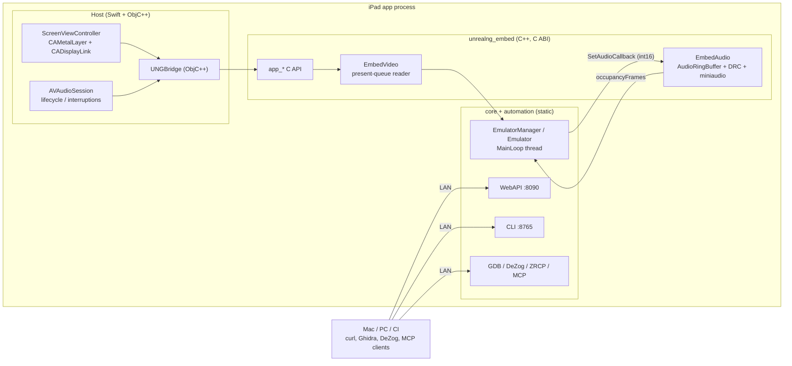

# iOS / iPadOS Host — Design

**Status:** Draft
**Date:** 2026-09-19
**Baseline:** `main` @ `d116cc5`
**Related docs:**
- [UE4/UE5 Integration Design](../2026-09-19-unrealengine-integration/ue-integration-design.md) (shares the `unrealng_embed` layer defined in §4)
- [WebAPI Media Upload](webapi-media-upload-tdd.md) (embedded content in POST requests)

## Summary

Run the unreal-ng core on iPad as a **headless appliance**: the device renders the
emulated screen and plays audio, and everything else — lifecycle, media, input,
debugging — is driven remotely through the existing WebAPI / CLI / GDB / MCP servers.
No emulator GUI is built for Phase 1.

The core is already close to this shape: `core/src` is a Qt-free static library,
`automation-main.cpp` is effectively a headless `main()`, and audio/video leave the
core through two narrow seams (`Emulator::SetAudioCallback`, `Screen::CopyPresentedFramebuffer`).
The work is a cross-compile of the existing CMake tree, a small set of portability fixes,
a Qt-free port of `AppSoundManager`, and a thin native host app.

---

## 1. Goals / Non-goals

### Goals

| # | Goal |
|---|------|
| G1 | `core` + `automation_*` cross-compile for `iphoneos` (arm64) and `iphonesimulator` (arm64) from the existing CMake tree, packaged as an XCFramework. |
| G2 | A native host app shows the presented framebuffer full-screen and plays audio with the same A/V-sync behaviour as `unreal-qt` (DRC ring, present delay). |
| G3 | WebAPI (8090), CLI (8765), GDB, DeZog, ZEsarUX and MCP servers are reachable from the LAN; every existing remote workflow works unchanged against the iPad. |
| G4 | Media (tape, disk, snapshot) can be supplied remotely without shell access to the device. |
| G5 | The Qt-free host plumbing (`unrealng_embed`) is reusable by the UE/Unity integrations. |

### Non-goals

- No on-device emulator UI (menus, debugger views, file pickers) in Phase 1.
- No App Store submission work (review guidelines, ROM licensing). Sideload / TestFlight only.
- No Python automation (`ENABLE_PYTHON_AUTOMATION` stays OFF).
- No shared-memory IPC (`sharedmemory` feature) — not usable from the iOS sandbox.
- No CRT shader chain in Phase 1 (see §9 Phase 3).

---

## 2. Current-state findings (code audit)

| Area | Finding | Impact |
|---|---|---|
| Core build | `core/src/CMakeLists.txt` → static lib; Apple links only Foundation + CoreFoundation; zstd/lzma/ymfm vendored. No JIT, no `MAP_JIT`, no `fork`/`system`/`popen`. | Cross-compiles as-is. |
| Headless entry | `core/automation/automation-main.cpp`: `Automation::GetInstance().start()` + idle loop. | Template for the host bootstrap. |
| WebAPI | Drogon 1.9.11 on its own thread (`automation-webapi.cpp:143`), `addListener("0.0.0.0", 8090)`. trantor patched to throw instead of `exit()` on bind failure. | Works; needs build fixes (§5.2). |
| Video out | `Screen::CopyPresentedFramebuffer(dst, size)` serves a latched, tear-free frame from a 4-slot present queue with `_presentDelayFrames` (default 2) for A/V sync. Pixels are `uint32` ABGR on little-endian = **RGBA8 bytes in memory**. | Direct upload to an `RGBA8Unorm_sRGB` texture. |
| Audio out | `Emulator::SetAudioCallback(obj, cb, occupancyFrames*, deviceDescriptor*)` delivers interleaved int16 stereo at `CORE_SAMPLING_RATE` (44100); `SetAudioDeviceSampleRate()` feeds the DRC resampler base ratio. | Host owns the ring + device. |
| Qt audio host | `unreal-qt/src/emulator/soundmanager.cpp` (`AppSoundManager`): miniaudio device, `AudioRingBuffer`, DRC occupancy publishing, hard-resync, reroute handling. Qt usage limited to `QObject`, `QTimer`, `qWarning`. | Portable to plain C++ ~1:1. |
| Resource paths | `FileHelper::GetExecutablePath()` uses `_NSGetExecutablePath`; `GetResourcesPath()` checks for `.app/Contents/MacOS`. On iOS the binary sits at the `.app` root, so both resolve to the bundle root. | ROM/config lookup works if `data/` is copied to the bundle root. Bundle is **read-only**. |
| Writable paths | `config.cpp` screenshot path falls back to `$HOME/Library/Application Support/UnrealNG`; on iOS `$HOME` is the app container. | Works by accident; replace with an explicit override (§5.3). |
| Deployment target | `cmake/MacOSDeploymentTarget.cmake` forces `CMAKE_OSX_DEPLOYMENT_TARGET=12.0` for any `APPLE`. | On iOS this means iOS 12 → `std::filesystem` unavailable (needs 13+). **Must guard.** |
| OpenSSL | `webapi/CMakeLists.txt` `return()`s (disables WebAPI) when OpenSSL is missing, and falls back to `/opt/homebrew/opt/openssl/*.dylib`. | Cross-build would either disable WebAPI or link macOS dylibs. **Must guard.** |
| Lua | Lua 5.4.7 `loslib.c` calls `system()`, which the iOS SDK marks unavailable; `LUA_USE_IOS` branch exists but is never defined. | Compile error until defined. |
| RT scheduling | `ThreadHelper::setRealtimePriority()` passes nanoseconds to `THREAD_TIME_CONSTRAINT_POLICY`, which takes **mach absolute time units**. Timebase is 1:1 on Intel but 125/3 on Apple Silicon → period ≈ 833 ms, computation ≈ 167 ms instead of 20 / 4 ms. | Bug on every ARM Apple device, including M-series Macs today. Fix is shared (§5.4). |
| Shared memory | `shm_open`/`mmap` paths in `memory.cpp`, `shmhelper.h`; runtime feature `sharedmemory`, **OFF by default** (`featuremanager.cpp:389`). | Keep off; reject enabling on iOS. |
| Disk load | `Emulator::LoadDisk(path)` hard-codes drive A (`emulator.cpp:1577` FIXME); WebAPI `disk/{drive}/insert` parses `drive` but ignores it. | Not blocking for iOS; tracked in the UE doc. |

---

## 3. Architecture



Threads in the running app:

| Thread | Owner | Work |
|---|---|---|
| Main | UIKit | Display link, texture upload, UI overlay |
| MainLoop (per emulator) | core | Z80 + devices, `LatchFramebuffer`, audio callback → ring enqueue |
| CoreAudio IO | miniaudio | Ring dequeue, hard-resync, occupancy publish |
| Drogon ×2, CLI, GDB, … | automation | Remote control |
| MessageCenter dispatcher | core | Async notifications |

The core paces itself (steady-clock frame deadline + emergency refill in `MainLoop`);
the display link only samples the latest presented frame.

---

## 4. `unrealng_embed` — host embedding layer

A new target `core/embed/` producing `unrealng_embed` (static on iOS; shared on desktop
for engines). It is the **only** thing a non-Qt host talks to. Rationale:

- Core public headers pull `stdafx.h`, which injects `using std::min/max/string/vector/list/map…`
  into the global namespace; the core also throws (76 sites) and uses `dynamic_cast`.
  A C ABI keeps all of that behind the boundary (mandatory for UE/Unity, good hygiene for iOS).
- It is where the Qt-free port of `AppSoundManager` lives, so every host gets identical A/V behaviour.

### 4.1 C API (Phase 1 subset)

```c
// unrealng_embed.h — all functions are noexcept; errors via app_result
typedef struct app_emulator app_emulator;
typedef enum { APP_OK = 0, APP_ERR_ARG, APP_ERR_STATE, APP_ERR_IO, APP_ERR_INTERNAL } app_result;

typedef struct {
    const char* resource_root;   // read-only: rom/, configs/, fonts/ ...
    const char* writable_root;   // config writes, screenshots, TTD, uploads
    uint32_t    log_level;
    uint32_t    automation_mask; // APP_AUTOMATION_WEBAPI | _CLI | _GDB | _DEZOG | _ZESARUX | _MCP | _LUA
} app_init_params;

app_result app_init(const app_init_params*);          // FileHelper overrides + Automation::start()
void       app_shutdown(void);

app_result app_create(const char* model, const char* symbolic_id, app_emulator** out);
app_result app_start(app_emulator*);                  // EmulatorManager::StartEmulatorAsync
void       app_destroy(app_emulator*);

// Video — safe from any thread; copies the presented (delayed, latched) frame
app_result app_frame_info(app_emulator*, uint16_t* w, uint16_t* h, uint64_t* latch_ts_us);
app_result app_copy_frame(app_emulator*, void* dst_rgba8, size_t dst_size);
void       app_set_present_delay(app_emulator*, uint8_t frames);

// Audio — two modes
app_result app_audio_open_device(app_emulator*);      // embed owns a miniaudio device (iOS host)
app_result app_audio_attach_pull(app_emulator*, uint32_t device_rate); // engine pulls (UE/Unity)
size_t     app_audio_pull_f32(app_emulator*, float* interleaved, size_t frames); // audio thread only
void       app_audio_set_active(app_emulator*, int active); // interruptions / backgrounding
```

Input and media functions (`app_key`, `app_mouse`, `app_disk_insert`, …) are specified in the
UE design; the iOS Phase 1 host does not need them because input arrives through WebAPI.

### 4.2 `EmbedAudio` (port of `AppSoundManager`)

Kept byte-for-byte equivalent in behaviour:

- Producer: core audio callback on the MainLoop thread → `AudioRingBuffer::enqueue`; publish
  `occupancyFrames` (the atomic passed to `SetAudioCallback`) so `SoundManager::updateDrcControl()`
  steers the ±0.5 % trim toward `DRC_TARGET_MS = 40`.
- Consumer: device callback → `dequeue`; if occupancy > `HARD_RESYNC_MS` (160) discard down to target.
- On device (re)start or route change: `SetAudioDeviceSampleRate(actualRate)` + `resetDrcController()`
  — same as the Qt `deviceNotificationCallback` path.
- Qt removals: `QTimer` format-change debounce → a monotonic-time check on the next callback;
  `qWarning` → core `ModuleLogger`.

### 4.3 `EmbedVideo`

Thin wrapper over `Screen::CopyPresentedFramebuffer` + `GetFramebufferDescriptor` + `GetDisplayViewport`
(for overscan cropping) + `GetLastLatchTimestampUs` (to skip uploads when nothing new was latched).

---

## 5. Build-system and portability changes

### 5.1 Toolchain

```bash
cmake -S . -B build-ios -G Xcode \
  -DCMAKE_SYSTEM_NAME=iOS -DCMAKE_OSX_ARCHITECTURES=arm64 \
  -DCMAKE_OSX_DEPLOYMENT_TARGET=16.0 \
  -DBUILD_QT_APPS=OFF -DTESTS=OFF -DBENCHMARKS=OFF -DBUILD_TESTCLIENT=OFF -DBUILD_POC=OFF \
  -DENABLE_PYTHON_AUTOMATION=OFF -DENABLE_RECORDING=ON \
  -DTRANTOR_USE_TLS=none -DBUILD_C-ARES=OFF
```

Repeat with `-DCMAKE_OSX_SYSROOT=iphonesimulator`, merge each static lib set with
`libtool -static`, then `xcodebuild -create-xcframework`. A `scripts/build-ios-xcframework.sh`
wraps this.

`ENABLE_RECORDING` changes the `EmulatorContext` layout — it must be identical for every
target in the build. VideoToolbox/AVFoundation exist on iOS and no AppKit usage was found in
`core/recording`, so ON is the default; OFF is the fallback if the recording `.mm` sources need work.

### 5.2 Required CMake fixes

| File | Change |
|---|---|
| `cmake/MacOSDeploymentTarget.cmake` | Apply the 12.0 default only when `CMAKE_SYSTEM_NAME STREQUAL "Darwin"`. |
| `core/automation/webapi/CMakeLists.txt` | When `CMAKE_SYSTEM_NAME` is `iOS`: skip the Homebrew OpenSSL fallback and do **not** `return()` when OpenSSL is absent; force `TRANTOR_USE_TLS=none`. Drogon's internal MD5/SHA1 covers the WebSocket handshake. |
| trantor | `BUILD_C-ARES=OFF` for iOS so `find_package(c-ares)` cannot pick up a macOS Homebrew build; trantor falls back to `getaddrinfo`. |
| `core/automation/lua/lib/lua/CMakeLists.txt` | Add `LUA_USE_IOS` for iOS (`os.execute` → returns -1). |
| All `find_package`/`find_library` in automation | Verify `CMAKE_FIND_ROOT_PATH_MODE_*` so no `/opt/homebrew` artefact leaks into the iOS link. |
| Root `CMakeLists.txt` | Skip the Qt discovery block and packaging (`macdeployqt`, DMG) when `BUILD_QT_APPS=OFF` / iOS. |

### 5.3 Path overrides (core change)

Add to `FileHelper`:

```cpp
static void SetResourcesPathOverride(const std::string& readOnlyRoot);
static void SetWritablePathOverride(const std::string& writableRoot);
static std::string GetWritablePath();   // new; used for screenshots, saved config, TTD, uploads
```

`GetResourcesPath()` / `GetExecutablePath()` consumers (`config.cpp:42,119,576`, `rom.cpp:498`,
`trdosbootinjector.cpp:148`) keep working; screenshot/config-write paths move to `GetWritablePath()`.
The same override is required for UE/Unity (editor executable dir) and Android (resources inside the APK).

| iOS location | Role |
|---|---|
| `<bundle>/data/` | `resource_root` (ROMs, default `unreal.ini`, fonts) — read-only |
| `Library/Application Support/UnrealNG/` | `writable_root` — config writes, screenshots, TTD |
| `Documents/` | User media; exposed in Files.app via `UIFileSharingEnabled` + `LSSupportsOpeningDocumentsInPlace` |

### 5.4 Realtime thread policy fix (shared with macOS)

```cpp
mach_timebase_info_data_t tb; mach_timebase_info(&tb);
auto ns2abs = [&](uint64_t ns) { return static_cast<uint32_t>(ns * tb.denom / tb.numer); };
policy.period      = ns2abs(20'000'000);
policy.computation = ns2abs(4'000'000);
policy.constraint  = ns2abs(10'000'000);
```

Add a unit test asserting the converted values on the build host.

### 5.5 Feature guards

- `sharedmemory`: refuse to enable on iOS (FeatureManager returns an error; WebAPI surfaces it).
- `setRealtimePriority()`: allowed on iOS (mach time-constraint policy is available to apps).

---

## 6. Host application

### 6.1 Structure

```
unreal-ios/                              # root-level, matches unreal-qt/
  UnrealNG.xcodeproj
  UnrealNG/
    App/AppDelegate.swift, SceneDelegate.swift
    Screen/ScreenViewController.swift    # CAMetalLayer, CADisplayLink, overlay
    Screen/Present.metal                 # textured quad, nearest / integer-scale sampling
    Bridge/UNGBridge.h/.mm               # ObjC++ facade over app_*
    Audio/AudioSession.swift             # AVAudioSession setup + notifications
    Resources/data/ -> copied from repo data/{rom,configs,fonts,boot}
    Info.plist
  Frameworks/UnrealNGCore.xcframework
```

miniaudio must be compiled as Objective-C on iOS (it calls into AVAudioSession); the
implementation TU inside `unrealng_embed` is built as `.mm` for Apple targets.

### 6.2 Startup sequence

1. `AVAudioSession`: category `.playback`, mode `.default`, preferred IO buffer ~5 ms, preferred rate 48 kHz; activate.
2. `app_init({resource_root: bundle/data, writable_root: AppSupport/UnrealNG, automation_mask: ALL − PYTHON})`.
3. `app_create(model from last-used setting or "PENTAGON")` → `app_audio_open_device` → `app_start`.
4. Start `CADisplayLink`; show overlay with device IP, ports and a QR code for `http://<ip>:8090/`.

### 6.3 Video presentation

- Each display-link tick: `app_frame_info`; if `latch_ts_us` changed → `app_copy_frame` into one of
  3 `MTLBuffer`s (shared storage) → blit to an `MTLTexture` `RGBA8Unorm_sRGB` → draw quad.
- Scaling: integer scale when it fits, otherwise aspect-fit with nearest sampling; crop from `GetDisplayViewport`.
- Refresh: request `preferredFrameRateRange(50, 50, 50)` on ProMotion. The system may not honour
  exactly 50 Hz; the effective rate must be measured (`targetTimestamp` deltas). On fixed 60 Hz panels
  a 50→60 cadence gives a periodic 1-frame repeat; that is accepted for Phase 1.
- `UIApplication.isIdleTimerDisabled = true` while an emulator is running.

### 6.4 Audio lifecycle

| Event | Action |
|---|---|
| `interruptionNotification` began | `app_audio_set_active(0)` (ring cleared, DRC reset on resume) |
| interruption ended (`.shouldResume`) | reactivate session → `app_audio_set_active(1)` |
| `routeChangeNotification` | reported device rate → `SetAudioDeviceSampleRate` + `resetDrcController` |
| `mediaServicesWereReset` | tear down + reopen the miniaudio device |

### 6.5 Backgrounding

iOS suspends background apps, taking the network servers down with them.

**Background audio mode (default ON).** `UIBackgroundModes = audio` keeps the process alive while audio is
playing, so remote sessions survive screen lock. Required for the headless-appliance use case.
On `sceneDidEnterBackground` the emulator keeps running; on interruption the audio callback pauses
but the servers stay reachable. A setting allows disabling for battery-conscious use.

### 6.6 Networking & permissions

- Servers bind `0.0.0.0`. Bonjour advertisement (`_unrealng._tcp`, `_http._tcp` for 8090) lets
  clients discover the device → requires `NSBonjourServices` and `NSLocalNetworkUsageDescription`.
  Whether a plain listening socket triggers the local-network prompt needs verification on device
  (Apple TN3179).
- Ports are hard-coded today (WebAPI `automation-webapi.cpp:192`, CLI `automation-cli.cpp:24`).
  Make them configurable through `app_init_params` so the overlay shows the truth.
- No TLS; LAN-only tool. The overlay states that plainly.

---

## 7. Remote media delivery

Loaders are path-based (`LoadTape`, `LoadDisk`, `LoadSnapshot` take server-side paths).
Two mechanisms, both in Phase 1:

1. **Files.app / Finder.** `Documents/` is user-visible; WebAPI accepts relative paths resolved
   against `Documents/` (absolute paths outside the sandbox are rejected).
2. **Upload endpoint (new, all platforms).**
   `POST /api/v1/files` (multipart or raw body + `name`) → stored in `writable_root/uploads/`,
   returns the path; `GET /api/v1/files` lists; `DELETE` removes. Existing `tape/load`,
   `disk/{drive}/insert`, `snapshot/load` then take that path. Size limit configurable
   (default 16 MB). Documented in the OpenAPI spec per `OPENAPI_MAINTENANCE.md`.

---

## 8. Verification

| Check | Method |
|---|---|
| Cross-compile | CI job on `macos-14`: build XCFramework for device + simulator. |
| Unit tests on simulator | Build `core-tests` for `iphonesimulator`, run via `xcodebuild test` host app. Gtest is already vendored. |
| RT policy fix | New gtest for the ns→abs conversion (runs on macOS CI too). |
| A/V sync | Existing `SoundAdaptivity.AVLatencyBudget` passes; on device, log ring occupancy (already exposed via `AudioDeviceDescriptor`) and confirm it settles at ~40 ms. |
| Remote parity | Run the WebAPI/CLI test clients from the Mac against the iPad IP; GDB session from Ghidra against the iPad. |
| Thermal/perf | Instruments: MainLoop thread < 10 % of one P-core at 1× speed (~0.8 ms/frame on M-series Mac as reference). |

---

## 9. Phases

| Phase | Scope | Estimate |
|---|---|---|
| 1a | CMake fixes (§5.2), path overrides (§5.3), RT fix (§5.4), XCFramework script | 1–2 days |
| 1b | `unrealng_embed` video + audio (§4), host app (§6), overlay | 2–3 days |
| 1c | Upload endpoint + Documents resolution (§7), Bonjour | 1–2 days |
| 2 | On-device input: hardware keyboard (`UIPress` → `MC_KEY_PRESSED`), pointer → Kempston mouse; game controller → Kempston joystick needs a joystick input device first (only the port decode `IsPort_KempstonJoystick` exists today) | ~1 week (+ joystick device) |
| 3 | Metal CRT shader chain (shared design with the UE doc's CRT section; librashader has a Metal backend) | open-ended |

## 10. Decisions

1. **Minimum iOS version: 16** — broad iPad coverage; newer APIs can be runtime-checked.
2. **Background audio mode: ON by default** — required for remote sessions to survive screen lock.
3. **Upload endpoint: media only** — ROMs supplied in bundle resources (`<bundle>/data/rom/`).
