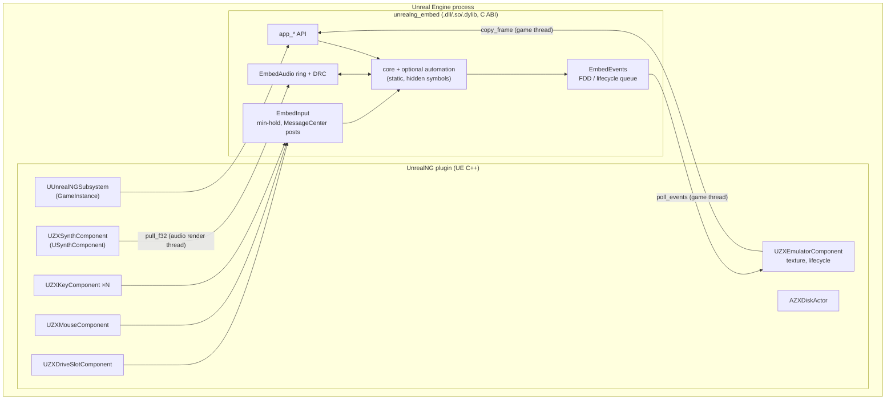

# Unreal Engine 4/5 Integration — Design

**Status:** Draft
**Date:** 2026-09-19
**Baseline:** `main` @ `d116cc5`
**Related docs:** [iOS / iPadOS Host Design](../2026-09-19-ios-integration/ios-host-design.md) (defines `unrealng_embed`, §4, and the path overrides, §5.3)

## Summary

Embed one or more unreal-ng instances in an Unreal Engine scene as **physical objects**:
a CRT monitor mesh whose screen is a live emulator texture with a CRT material, a speaker
that plays the emulator's audio spatially, a keyboard with pressable keys, floppy disks that
can be picked up and inserted into a drive, and a mouse that moves on a desk. It must work in
flat desktop play and in VR (OpenXR, PC VR and standalone Quest).

The engine never includes core headers. It talks to `unrealng_embed` — a C ABI shared
library that wraps the static core — through a UE plugin (`UnrealNG`). The core keeps running
its own paced MainLoop thread per instance; the engine samples frames, pulls audio, and pushes
input events.

---

## 1. Goals / Non-goals

### Goals

| # | Goal |
|---|------|
| G1 | UE plugin supporting **UE 5.3+** (primary) and **UE 4.27** (secondary) from one source tree; engine C++ version is irrelevant because of the C ABI. |
| G2 | Platforms: Win64, macOS, Linux (editor + packaged), Android arm64 (Quest standalone). |
| G3 | Screen: tear-free 50 Hz texture on a monitor mesh, CRT material (scanlines, mask, glow, glass). |
| G4 | Audio: spatialised from the monitor/speaker, same DRC A/V-sync quality as `unreal-qt`. |
| G5 | Interaction: physical ZX keyboard, drive slot with insertable disks (A/B/C/D), Kempston mouse on a desk plane, reset/NMI/power buttons. Desktop and VR input paths. |
| G6 | Multiple independent emulators per level (e.g. a computer-lab room). |
| G7 | Optional: WebAPI/GDB/MCP inside the running game for debugging and automation. |

### Non-goals

- No UE Editor tooling (asset editors for disk images, debugger panels) in the first phases.
- No networking/replication of emulator state between clients.
- No console platforms.
- No port of the Qt debugger UI.

---

## 2. Current-state findings (code audit)

| Area | Finding | Impact |
|---|---|---|
| Header hygiene | `emulator.h` includes `stdafx.h`, which injects `using std::min/max/string/vector/list/map/atomic…` into the global namespace. | Core headers must not enter UE translation units → C ABI boundary. |
| Exceptions / RTTI | 76 `throw` sites and 9 `dynamic_cast` in `core/src`; UE modules build with exceptions disabled by default. | Exceptions are caught inside `unrealng_embed`; never cross the ABI. |
| Video | `Screen::CopyPresentedFramebuffer(dst, size)` gives a latched, tear-free frame from a 4-slot queue; `_presentDelayFrames` (default 2) delays video to match audio latency. Pixel format RGBA8 bytes (ABGR `uint32` LE). | Direct upload to `PF_R8G8B8A8`, sRGB. Present delay needs retuning per engine audio latency (§6.3). |
| Audio | `SetAudioCallback` (int16 stereo @ 44100) + `occupancyFrames` for the DRC controller; `SetAudioDeviceSampleRate` sets the DRC base ratio. `AppSoundManager` is the reference consumer. | Engine audio thread pulls from the `EmbedAudio` ring. |
| Pacing | `MainLoop` keeps its own steady-clock deadline (50.08 Hz Pentagon) with emergency refill. | Independent of engine FPS (60/72/90/120 Hz). |
| Keyboard | Canonical host path: `MessageCenter::Post(MC_KEY_PRESSED/RELEASED, new KeyboardEvent(zxKey, type, emulatorId))`, used by the Qt screen widgets. `DebugKeyboardManager::PressKey` (used by WebAPI) mutates `_directPressedKeys` and the matrix **directly from the caller thread** with no lock. | Use the MessageCenter path. Flag the WebAPI path as a thread-safety issue. |
| Mouse | `Mouse::Move(dx, dy)` uses CAS on atomics → thread-safe. `MouseDeltaAccumulator` defines host-physical-pixel → emulated-pixel scaling. | Callable from the game thread. |
| Disk | `Emulator::LoadDisk(path)` **hard-codes drive A** (`emulator.cpp:1577`, FIXME). WebAPI `disk/{drive}/insert` parses `drive` and then ignores it. Pauses/resumes around the swap. | Needs `LoadDisk(path, drive)` for a multi-drive VR rig; also fixes the WebAPI bug. |
| Disk telemetry | `NC_FDD_STATE_CHANGED` with `FDDStatePayload{emulatorId, drive, side, track, motor}` is posted on change only; `NC_FDD_DISK_INSERTED/EJECTED` carry `emulatorId` + `driveId`. | Drives LEDs, motor hum and head-step sounds with no polling. |
| Joystick | Only port decode exists (`IsPort_KempstonJoystick`, `PortDecoder` `Joystick` flag); no joystick input device. | VR thumbstick → Kempston joystick is new core work (Phase 4). |
| Resource paths | `GetExecutablePath()` resolves to the **editor/game executable directory** (`UnrealEditor.exe`, `UE4Editor`), and on Android to `app_process`. | Needs the path override (iOS doc §5.3). |
| Singletons | `EmulatorManager::GetInstance()`, `MessageCenter::DefaultMessageCenter()`, `Automation::GetInstance()` are process-wide. | Survive PIE sessions; lifecycle must be explicit (§4.4). |
| WebAPI | Port 8090 hard-coded; trantor patched to throw (not `exit()`) on bind failure. | Must be configurable and default OFF in-engine; a stray `exit()` would kill the editor. |
| Lua on Android | `lua/lib/lua/CMakeLists.txt` defines `LUA_USE_READLINE` for `UNIX AND NOT APPLE`. | NDK has no readline → build break for Quest. Guard with `NOT ANDROID`. |
| Linux link | `core/src/CMakeLists.txt` adds `-static-libstdc++` for `UNIX AND NOT APPLE`. | Fine inside a hidden-visibility `.so`; must not leak into the UE module link. |

---

## 3. Architecture



### 3.1 Thread model

| Thread | Calls into `app_*` | Notes |
|---|---|---|
| Game thread | create/destroy, `copy_frame`, input, disk, `poll_events` | All non-audio calls. |
| Render thread | none | Receives a copied buffer via `UpdateTextureRegions` / `RHIUpdateTexture2D`. |
| Audio render thread | `app_audio_pull_f32` only | Lock-free SPSC dequeue; never blocks. |
| MainLoop (per emulator) | — (core-owned) | Emulation, latch, audio enqueue. |
| MessageCenter dispatcher | — (core-owned) | Delivers key events; `EmbedEvents` observers enqueue into an SPSC queue for the game thread. |

---

## 4. `unrealng_embed` — additions over the iOS subset

The Phase-1 API (init/create/start, video, audio) is defined in the iOS doc §4.1. UE adds:

```c
// Input — game thread
typedef enum { APP_KEY_UP = 0, APP_KEY_DOWN = 1 } app_key_state;
app_result app_key(app_emulator*, uint8_t zx_key /* ZXKeysEnum */, app_key_state);
app_result app_keys_release_all(app_emulator*);
app_result app_mouse(app_emulator*, int32_t dx, int32_t dy, uint8_t buttons);

// Media — game thread; paths are absolute, resolved by the plugin
app_result app_disk_insert(app_emulator*, uint8_t drive, const char* path, int autostart);
app_result app_disk_eject(app_emulator*, uint8_t drive);
app_result app_tape_load(app_emulator*, const char* path);
app_result app_tape_control(app_emulator*, uint32_t op /* PLAY/STOP/REWIND */);
app_result app_snapshot_load(app_emulator*, const char* path);

// Machine — game thread
app_result app_reset(app_emulator*);
app_result app_nmi(app_emulator*);
app_result app_pause(app_emulator*, int paused);

// Events — game thread, drained each tick
typedef struct {
    uint32_t type;               // APP_EV_FDD_STATE, APP_EV_DISK_INSERTED, APP_EV_DISK_EJECTED, APP_EV_STOPPED ...
    uint8_t  drive, side, motor;
    int16_t  track;
} app_event;
size_t app_poll_events(app_emulator*, app_event* out, size_t max);

// Diagnostics
app_result app_audio_stats(app_emulator*, uint32_t* occupancy_frames, uint32_t* underruns);
```

### 4.1 Input semantics

- `app_key` posts `MC_KEY_PRESSED/RELEASED` with a `KeyboardEvent` **targeted at the instance UUID**
  (same path as `unreal-qt`); broadcast is never used, so several keyboards in one level stay independent.
- **Minimum hold:** a VR finger can tap a key for less than one frame. Programs scan the matrix once per
  frame or less, so a sub-frame press can be missed. `EmbedInput` records the press time and defers a
  release until at least `min_hold_frames` (default 2, matching `DebugKeyboardManager::DEFAULT_HOLD_FRAMES`
  semantics) have been latched (`GetLastLatchTimestampUs`).
- CAPS SHIFT / SYMBOL SHIFT combinations are natural: they are separate matrix keys held simultaneously.
- `app_mouse` → `Mouse::Move` / `SetButtons` (atomic, safe from the game thread).

### 4.2 Core changes required

| Change | Reason |
|---|---|
| `Emulator::LoadDisk(const std::string& path, uint8_t drive = 0)`; WebAPI `disk/{drive}/insert` passes `driveNum` | Multi-drive rig; fixes the ignored `drive` parameter. |
| `FileHelper` resource/writable overrides (iOS doc §5.3) | Editor exe dir, Android APK. |
| Configurable automation ports + per-module enable in `Automation::start()` | Several PIE instances / packaged builds; default OFF in-engine. |
| `DebugKeyboardManager` direct-press path: marshal to the emulator thread (or lock) | Existing race with the WebAPI thread; unrelated to UE but found here. |
| `lua/lib/lua/CMakeLists.txt`: no `LUA_USE_READLINE` on Android | Quest build. |
| Optional: buffer-based loaders (`LoadDiskFromMemory`) | Lets cooked disk assets load without temp files (Phase 3). |

### 4.3 Shared-library build

- Target `unrealng_embed` **SHARED**, linking `core` and selected `automation_*` statically.
- Exports: only `app_*` (`__declspec(dllexport)` on Windows; `-fvisibility=hidden` +
  `-fvisibility-inlines-hidden` + a version script on Linux/Android; `-exported_symbols_list` on macOS).
  This matters because the core/WebAPI vendor zlib, jsoncpp, zstd, lzma. UE ships its own zlib;
  exported duplicates would interpose on Linux/Android.
- Toolchains: MSVC (C++20, already supported), AppleClang, Clang/libstdc++ static on Linux,
  NDK r25+ with `c++_static` on Android (automation limited to WebAPI+CLI+GDB there; Lua optional).
- Distributed prebuilt inside the plugin under `Source/ThirdParty/UnrealNGLibrary/<Platform>/`, built by
  `scripts/build-ue-thirdparty.{sh,ps1}`.

### 4.4 Lifecycle

- `app_init` once per process (refcounted); `app_shutdown` on module shutdown only.
- Emulator instances are owned by `UUnrealNGSubsystem` and destroyed in `Deinitialize()`, so PIE
  sessions never leak running MainLoops into the next session even though `EmulatorManager`
  persists for the editor's lifetime.
- Live Coding / hot reload never reloads the third-party library; changing `unrealng_embed` needs an
  editor restart (documented).

---

## 5. Plugin structure

```
Plugins/UnrealNG/
  UnrealNG.uplugin
  Source/
    ThirdParty/UnrealNGLibrary/
      UnrealNGLibrary.Build.cs          # PublicAdditionalLibraries, RuntimeDependencies, delay-load
      include/unrealng_embed.h
      Win64/  Mac/  Linux/  Android/arm64-v8a/
    UnrealNG/                           # Runtime module
      Public/ ZXEmulatorComponent.h, ZXSynthComponent.h, ZXKeyComponent.h,
              ZXDriveSlotComponent.h, ZXDiskActor.h, ZXMouseComponent.h,
              UnrealNGSubsystem.h, ZXKeys.h (UENUM mirror of ZXKeysEnum)
      Private/ …
      UnrealNG_APL.xml                  # Android: package .so + data
  Content/
    Materials/M_ZX_CRT.uasset, MF_Scanlines, MF_ShadowMask, MF_Phosphor
    Meshes/ (sample monitor, keyboard, drive, disk)
    Data/ -> rom/, configs/, fonts/ staged as non-asset files
```

`Build.cs` stages `Content/Data` via `RuntimeDependencies` (desktop) and the APL (Android). At startup
on Android the subsystem copies `Data/` from the package to `FPaths::ProjectPersistentDownloadDir()/UnrealNG`
using UE file APIs (native `fopen` cannot read inside the APK/OBB) and passes that directory as `resource_root`.

`ZXKeys.h` mirrors `ZXKeysEnum` as a `UENUM(BlueprintType)` generated from `keyboard.h` by a small
script so the two cannot drift.

---

## 6. Screen, audio and CRT

### 6.1 Texture path

- `UZXEmulatorComponent` creates `UTexture2D::CreateTransient(w, h, PF_R8G8B8A8)` with `SRGB = true`,
  `Filter = TF_Nearest`, `CompressionSettings = TC_VectorDisplacementmap` (no compression), no mips.
- Each tick: `app_frame_info`; if `latch_ts_us` changed → `app_copy_frame` into one of 3 staging
  buffers → `UpdateTextureRegions(0, 1, &Region, Pitch, 4, Buffer, Cleanup)` (returns the buffer to the pool
  on the render thread). Framebuffer size changes (mode/overscan switch) recreate the texture.
- Upload cost: 352×288×4 ≈ 400 KB per 20 ms per instance — negligible.
- Ticks at the engine rate (e.g. 90 Hz); new frames arrive at 50.08 Hz. On a CRT in a 3D scene
  this is the correct behaviour (the content is a 50 Hz source); head motion stays at the HMD rate.

### 6.2 CRT material (`M_ZX_CRT`)

Applied to the screen mesh (the tube face is real curved geometry, so no UV barrel warp is needed):

| Layer | Implementation |
|---|---|
| Source reconstruction | Sample at native res; horizontal sharp-bilinear to avoid shimmer at oblique VR angles. |
| Scanlines | Gaussian beam profile across `v * source_height`; width modulated by pixel luminance. |
| Shadow mask / aperture grille | Tiled mask texture in screen-space-of-tube UVs; selectable (Trinitron / slot / dot). |
| Phosphor persistence (optional) | Previous frame in a second texture blended by `exp(-dt/τ)`, `dt` from latch timestamps. |
| Emission | Output to Emissive (linear); the screen lights the room via Lumen / baked emissive; engine bloom supplies halation. |
| Glass | Separate translucent shell mesh: Fresnel reflection, slight tint, smudge/roughness map. |
| Power-off | Parameter-driven collapse-to-dot animation on power button. |

**Phase 5 (quality path):** render slang presets (MegaBezel, CRT-Royale, Guest) through librashader
into a render target on the RHI (D3D12 / Vulkan / Metal backends exist), and sample that RT in a
simplified material. Same shader chain as the planned standalone C++ CRT work, one implementation
across UE, Unity, iOS.

### 6.3 Audio

- `UZXSynthComponent : USynthComponent`, attached to the monitor's speaker socket, with attenuation +
  spatialization settings.
  - `Init(int32& SampleRate)`: set `SampleRate = 48000`, `NumChannels = 2`; call
    `app_audio_attach_pull(inst, 48000)` → core `SetAudioDeviceSampleRate(48000)`; the core DRC resamples
    44.1 k → 48 k (engine resampler bypassed).
  - `OnGenerateAudio(float* Out, int32 NumSamples)`: `app_audio_pull_f32(inst, Out, NumSamples / 2)`;
    zero-fill on underrun. Never allocates or locks.
- Speaker "character": optional submix effect chain (low-pass/resonance of a small TV speaker). This
  sits after the pull, so the core's recording tap and `AudioCharacterChain` are unaffected.
- **Present delay:** UE's audio mixer adds `callback buffer × num buffers` (e.g. 1024 × 2 @ 48 k ≈ 43 ms)
  on top of the 40 ms ring. `EmbedAudio` measures the effective output latency (ring occupancy + reported
  mixer buffer) and sets `app_set_present_delay` accordingly. With `PRESENT_SLOTS = 4` the maximum is
  3 frames (~60 ms); if measured latency exceeds that, either raise `PRESENT_SLOTS` or lower the mixer
  buffer in project settings. In VR, prefer lower latency: a smaller mixer buffer and delay ≤ 2.

### 6.4 Drive and machine sounds

`UZXDriveSlotComponent` consumes `APP_EV_FDD_STATE` (from `NC_FDD_STATE_CHANGED`, already emulator-scoped):
motor on/off → looping motor hum; `track` change → head-step click (one per step, pitch by direction);
activity LED material parameter. `DISK_INSERTED/EJECTED` confirm the physical animation.

---

## 7. Interaction

### 7.1 Keyboard

- Each key mesh has a `UZXKeyComponent { ZXKey, TravelCm, bToggleLatch }` plus a small box collider.
- VR: fingertip colliders (hand tracking) or controller poke spheres generate overlaps; press when
  travel exceeds 60 %, release below 30 % (hysteresis), haptic tick on press. Key cap animates by travel.
- Desktop: line-trace from the cursor, or a pass-through mode mapping the host keyboard with the same
  host→ZX translation the Qt client uses (`Keyboard::OnKey`, modifiers aware).
- One-hand helpers: `bToggleLatch` on CAPS SHIFT / SYMBOL SHIFT (tap to latch, tap again to release),
  and an optional "extended mode" gesture.

### 7.2 Disks and drives

- `AZXDiskActor`: grabbable (`UGrabComponent` / VR Template interaction), holds `DiskImagePath`
  (`FFilePath`, relative to `Content/Data/disks` or the user folder), label texture, write-protect toggle.
- `UZXDriveSlotComponent { DriveIndex }`: a guided insertion channel. Entering the slot snaps the disk to
  a spline; completing travel latches it and calls `app_disk_insert(drive, path, autostart=false)`.
  The eject button plays the ejection animation and calls `app_disk_eject`.
- Unsaved writes: on `NC_FDD_DISK_PENDING_WRITE` the drive LED blinks; save policy follows the core's
  existing `FDD_DISK_WRITTEN` / `SAVE_RETARGETED` flow (writes go to `writable_root`, never the cooked copy).
- Tape (optional prop): cassette actor + deck with PLAY/STOP/REW buttons → `app_tape_*`.

### 7.3 Mouse

- `UZXMouseComponent` on a mouse mesh constrained to the desk plane. Per tick: planar displacement (cm) →
  emulated pixels via `PixelsPerCm` (default tuned so a 20 cm sweep ≈ full screen width), accumulating the
  fractional remainder like `MouseDeltaAccumulator`. Buttons from trigger/grip or physical click on the mesh.
- Desktop: raw mouse deltas while the "use computer" mode is active (cursor captured).

### 7.4 Machine controls

Power switch (create/destroy or pause + screen power-off effect), reset button (`app_reset`), NMI "magic"
button (`app_nmi`), speed knob (optional, via turbo API).

---

## 8. Platform notes

| Platform | Notes |
|---|---|
| Win64 | `unrealng_embed.dll` delay-loaded from `Binaries/ThirdParty/UnrealNG/Win64`; WebAPI needs `ws2_32` (already linked by core). |
| macOS | `.dylib` with `@rpath`; code-signed with the app. The RT thread-policy fix (iOS doc §5.4) applies. |
| Linux | `.so`, hidden symbols, static libstdc++ internal to the library. |
| Android / Quest | NDK build, `arm64-v8a`; APL packages the `.so`; data copied to persistent dir at first run; automation default OFF; 1–3 instances fit the CPU budget (~0.8 ms/frame per instance on an M-series Mac as reference; Quest cores are slower — measure). |
| UE 4.27 | Same plugin; differences confined to `#if ENGINE_MAJOR_VERSION` in texture update and synth component init. OpenXR plugin available in 4.27. |

---

## 9. Verification

| Check | Method |
|---|---|
| ABI | Header-only C test (`c99 -pedantic`) compiles `unrealng_embed.h`; `nm`/`dumpbin` shows only `app_*` exported. |
| Lifecycle | Automation test: 20× PIE start/stop with 3 instances; no leaked threads (`EmulatorManager::GetEmulatorIds()` empty after each). |
| Video | Functional test: load a test snapshot, compare the texture readback against `ScreenDigest` of the same frame. |
| Audio | `app_audio_stats` occupancy converges to ~40 ms within 5 s; zero underruns over 10 min at 90 Hz VR frame rate. |
| Input | Key-tap test: 5 ms press produces a registered keystroke (min-hold); two keyboards in one level stay independent. |
| Disk | Insert into B: → `NC_FDD_DISK_INSERTED` with `driveId = 1`; TR-DOS `CAT B:` lists it. |
| Quest | Packaged build, 72 Hz, 1 instance: frame time headroom and thermal over 30 min. |

---

## 10. Phases

| Phase | Scope | Estimate |
|---|---|---|
| 0 | Shared with iOS: path overrides, RT fix, `unrealng_embed` core (video/audio) | (iOS doc Phase 1a/1b) |
| 1 | Shared library build + symbol hiding (Win/Mac/Linux); plugin skeleton; texture + synth on a static monitor; desktop keyboard pass-through | ~1 week |
| 2 | CRT material v1 + glass; drive/machine sounds; multi-instance; subsystem lifecycle hardening | ~1 week |
| 3 | VR interaction: keys, disks/drives (`LoadDisk(path, drive)` core change), mouse, controls | 1–2 weeks (mostly content) |
| 4 | Quest/Android build; Kempston joystick device in core + thumbstick mapping | ~1 week + joystick |
| 5 | librashader render-target path; phosphor persistence; buffer-based loaders for cooked disk assets | open-ended |

## 11. Open questions

1. Minimum engine: is 4.27 worth carrying, or 5.3+ only?
2. Disk assets: filesystem paths only, or a `UZXDiskImage` asset type cooked into paks (needs buffer loaders)?
3. Should in-game WebAPI/MCP be a shipping feature (e.g. an AI agent operating the in-world computer), or dev-only?
4. Unity: the same `unrealng_embed` library serves a Unity package (P/Invoke, `Texture2D.LoadRawTextureData`, `OnAudioFilterRead`). Separate doc when needed.
