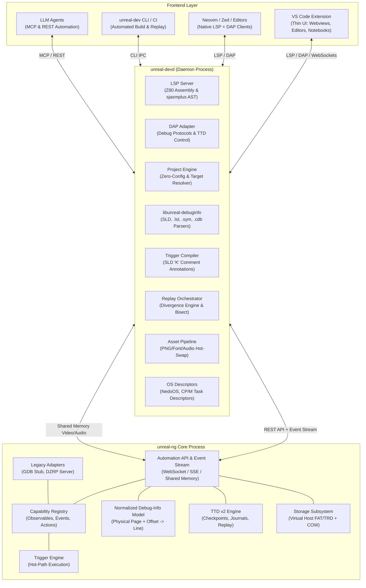
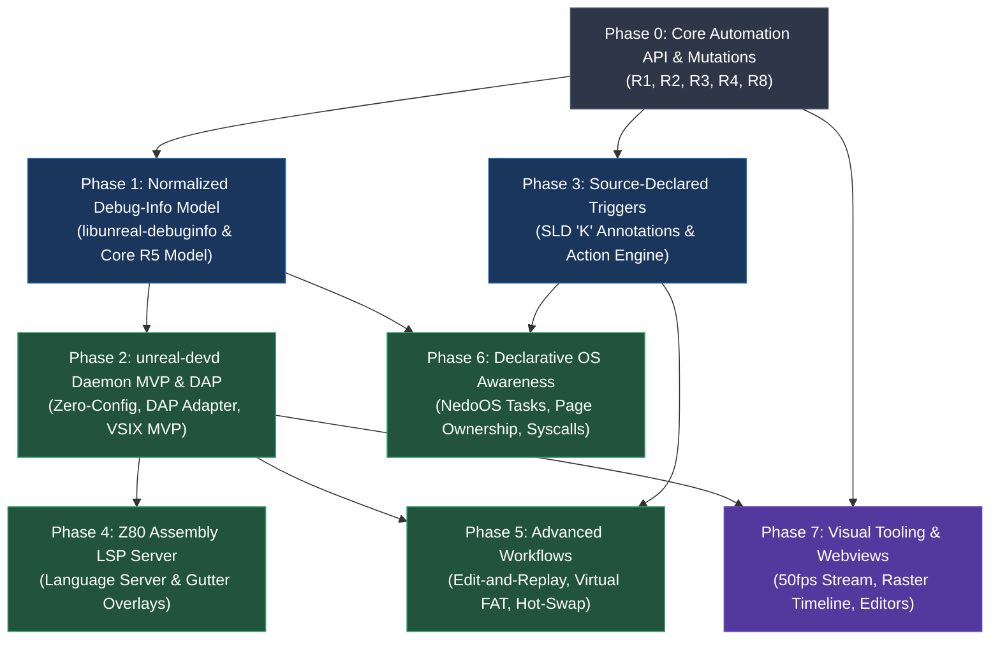
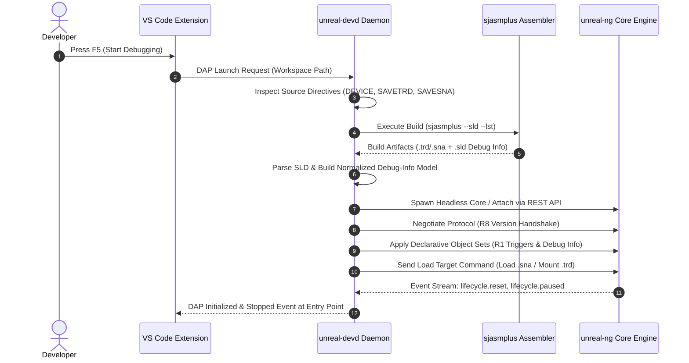
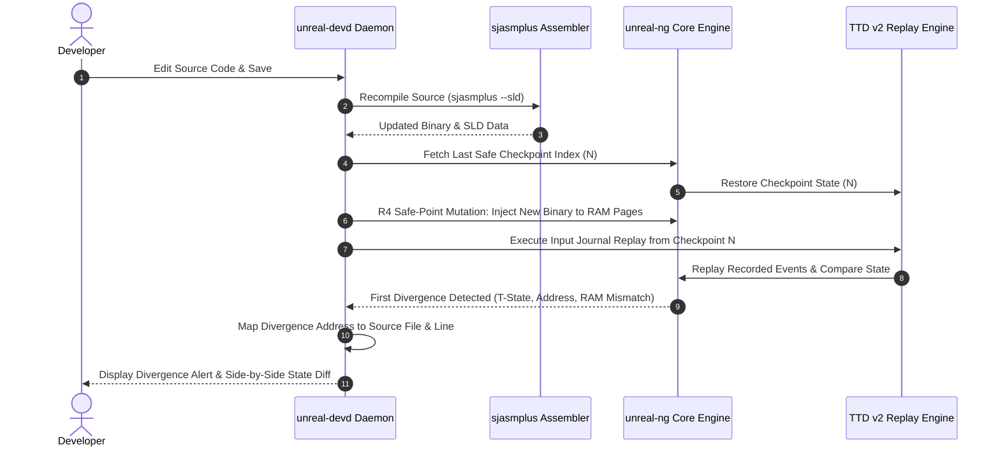
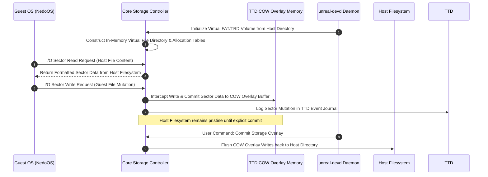

# unreal-ng Developer Toolchain — Prioritized Implementation Roadmap

| Attribute | Details |
|---|---|
| **Status** | Priority Roadmap & Execution Plan |
| **Date** | 2026-09-21 |
| **Baseline Architecture** | [unreal-ng-developer-toolchain-design.md](unreal-ng-developer-toolchain-design.md) |
| **Target Audience** | Core Engineers, Automation Leads, Toolchain Developers |
| **Primary Goal** | Deliver an editor-agnostic, source-aware Z80 development environment powered by `unreal-devd` and standard LSP/DAP protocols |

---

## 1. Executive Summary & Vision

The `unreal-ng` developer toolchain bridges the gap between low-level emulator execution mechanisms (Time-Travel Debugging, cycle-exact timing, opcode profiling, coverage analysis) and high-level source-code development (sjasmplus assembly, C compilers, OS development like NedoOS, and demo/game creation).

### Key Architectural Pillars
1. **Strict Core / Daemon Boundary**: Core handles in-process, cycle-exact execution, determinism, and hardware emulation. The standalone daemon (`unreal-devd`) manages language intelligence, debug-info parsing, build orchestration, DAP/LSP adapters, and OS descriptors.
2. **Editor Independence**: Frontend logic is strictly isolated in `unreal-devd`. VS Code, Neovim, Zed, JetBrains, CLI scripts, and LLM agents interact through standard protocols (LSP, DAP, WebAPI, MCP).
3. **Determinism & TTD Integration**: All state mutations from external tools are journaled as `TTDExternalEvent` records. Edit-and-replay replaces flaky live hot-swapping.
4. **Zero Configuration**: Build configuration, emulator models, and initial snapshot/disk launch targets are automatically derived from sjasmplus source directives (`DEVICE`, `SAVETRD`, `SAVESNA`, `SAVENEX`).

---

## 2. System Architecture Diagram



---

## 3. Milestone Dependency Graph

The roadmap is structured into 8 sequential phases (P0 through P7). Each phase unlocks specific developer capabilities and produces standalone, testable software artifacts.



---

## 4. Phase-by-Phase Detailed Breakdown

### Phase 0: Core Automation API & Deterministic Mutation Foundations
> **Objective**: Harden the core automation primitives required by external daemons while enforcing strict TTD determinism.

#### Key Deliverables
- **R1: Owner-Scoped Declarative Object Sets**: Core API interface allowing clients (`devd:<proj>`, `mcp:<sess>`) to register and update triggers, labels, and debug metadata via atomic `apply()` operations with generational reconciliation.
- **R2: Core Event Stream**: Implement topic-based WebSocket/SSE notification channels for emulator lifecycle (`reset`, `paused`, `resumed`, `model_changed`), debugging (`breakpoint_hit`, `trigger_fired`), storage operations, and TTD timeline seeks.
- **R3: Lifecycle Persistence Rules**: Standardize state retention behaviors across soft resets, hard resets, snapshot loads, and TTD timeline seeks.
- **R4: Safe-Point Journaled Mutations**: Ensure memory pokes, register edits, and media swaps requested externally are scheduled at safe execution boundaries (`now_if_paused`, `frame_boundary`, `on_trigger`) and logged as `TTDExternalEvent` records for replay integrity.
- **R8: API Version & Schema Handshake**: Client/server protocol negotiation on initial connection to prevent silent incompatibilities.

#### Exit Criteria
- External tools can inject and update declarative trigger sets.
- All live mutations are successfully recorded into TTD journals and survive exact replay.

---

### Phase 1: Normalized Debug-Info Engine (`libunreal-debuginfo`)
> **Objective**: Eliminate the 64 KB flat address mapping limitation by establishing a page-aware, module-based debug-info subsystem.

#### Key Deliverables
- **`libunreal-debuginfo` Library**: Standalone C++ parser library capable of reading sjasmplus SLD v1, `.lst`, `.sym`, `.map`, and SDCC `.cdb`/`.adb` files.
- **R5: Core Normalized Debug-Info Model**:
  ```text
  Module { id, name, content_hash, source_root, compile_memory_model, segments[], lines[], symbols[], types[], keywords[] }
  Binding { module_id, compile_page -> physical_page, relocation_delta, process_id }
  Lookup: (physical_page, Z80_offset) -> (file, line, col_begin, col_end)
  ```
- **Module Load Binding & Staleness Detection**: Real-time validation comparing active physical RAM page bytes with compiled segment hashes to detect stale debug symbols or modified code.
- **Subsystem Migration**: Replace the legacy flat `ListingParser` in the Qt disassembler and GDB stub with the unified `libunreal-debuginfo` engine.

#### Exit Criteria
- Multi-page 128K/1024K games and OS binaries resolve exact source line references across arbitrary RAM page swaps.
- Code edits or mismatched binaries trigger explicit visual staleness warnings instead of displaying invalid source lines.

---

### Phase 2: `unreal-devd` Daemon MVP, DAP Adapter & VS Code VSIX
> **Objective**: Deliver a functional end-to-end debugging experience from VS Code using standard Debug Adapter Protocol (DAP).

#### Key Deliverables
- **`unreal-devd` Core Executable**: Lightweight, standalone daemon hosting project discovery, build orchestration, and emulator process management.
- **Zero-Config Build Resolver**: Automatic extraction of target parameters (`DEVICE`, `SAVETRD`, `SAVESNA`, `SAVENEX`) directly from sjasmplus source files.
- **DAP Protocol Adapter**: Implementation of standard DAP requests: `launch`, `attach`, `setBreakpoints`, `threads`, `stackTrace`, `scopes`, `variables`, `readMemory`, `writeMemory`.
- **TTD Reverse Stepping**: Mapping DAP `stepBack` and `reverseContinue` directly onto the emulator's TTD v2 replay engine.
- **VS Code Extension VSIX**: Initial UI wrapper published to VS Code Marketplace and Open VSX bundling `unreal-devd`, sjasmplus, and a headless `unreal-ng` binary.

#### Exit Criteria
- Developers can install the VSIX extension, open an assembly project, press `F5`, hit breakpoints in source code, step forward, step backward via TTD, and inspect Z80 registers/memory without manual configuration.

---

### Phase 3: Source-Declared Trigger Engine & Action Classes
> **Objective**: Allow developers to specify breakpoints, logging, assertions, and performance budgets directly inside source assembly comments.

#### Key Deliverables
- **Registry-Driven Trigger Engine**: Generalize conditional breakpoint evaluation to accept registered hardware observables (PC, RAM, ports, INT, raster line, paging state).
- **SLD `K` Record Compiler**: Automatic extraction and compilation of `@break`, `@log`, `@watch`, `@assert`, `@budget`, and `@trace` comment annotations generated by sjasmplus.
- **Deterministic Action Classification**:
  | Class | Actions | Live Execution Behavior | TTD Replay Behavior |
  |---|---|---|---|
  | `observe` | `@log`, `@watch`, trace span | Output to log/timeline | Suppressed / Served from log |
  | `annotate` | TTD bookmark, label | Add timeline marker | Idempotent re-execution |
  | `mutate` | memory poke, reg write | Execute & log `TTDExternalEvent` | Replayed strictly from journal |
  | `control` | `@break`, pause, speed | Trigger emulator pause | Suppressed during replay |
- **Retroactive TTD Query Engine**: Execute trigger condition queries over previously captured TTD execution journals.

#### Source Annotation Examples
```asm
main_loop:
    halt
    call render_frame   ; @budget 22000T
    call process_input  ; @log "Joy: {a:02x}" if (a != 0)
    call update_game    ; @break if (lives == 0)
    jr main_loop

player_lives db 3       ; @watch write
```

#### Exit Criteria
- Source annotations trigger conditional stops, log messages, and budget assertion failures.
- Mutation actions execute deterministically during live runs and replay seamlessly during TTD seeks.

---

### Phase 4: Z80 / sjasmplus Language Server Protocol (LSP)
> **Objective**: Provide rich code intelligence, real-time timing analysis, and AST-driven diagnostics inside modern code editors.

#### Key Deliverables
- **Z80 Assembly LSP Server**: Embedded LSP server inside `unreal-devd` speaking standard JSON-RPC protocol.
- **Language Features**:
  - Structured diagnostics from sjasmplus build output.
  - Go to definition, find references, and symbol renaming across `INCLUDE`, `MODULE`, macros, and `STRUCT` fields.
  - Contextual auto-completion for Z80 opcodes, registers, I/O ports, and labels.
  - Document formatting and macro expansion views.
- **Model-Aware Hover Timing**: Display exact T-state counts, flag mutations, and memory contention numbers tailored to the active target model (`ZXSPECTRUM48`, `PENTAGON`, `ATM3`).
- **Gutter Performance Overlays**: Real-time display of opcode coverage, measured per-line execution T-states, and CodeLens call frequency counters.

#### Exit Criteria
- Developers receive real-time syntax checking, instant symbol navigation, and precise T-state budget feedback directly inside their code editor.

---

### Phase 5: Advanced Developer Workflows & Quality Assurance Tools
> **Objective**: Automate complex development workflows including edit-and-replay, asset hot-swapping, host filesystem access, and headless testing.

#### Key Deliverables
- **Edit-and-Replay Engine**: Re-compile source code, restore a previous TTD checkpoint, inject updated binaries into target RAM pages, replay recorded input streams, and pinpoint the exact T-state of divergence.
- **Virtual Host-Directory Volume**: Emulated SD card (Z-Controller) or IDE disk backed by a virtual FAT/TRD filesystem populated directly from a host directory, featuring a Copy-On-Write (COW) overlay for TTD compatibility.
- **Safe-Point Asset Pipeline**: Automatic conversion and injection of modified graphics (PNG), fonts, and tracker audio directly into RAM `INCBIN` offsets during execution pauses.
- **Z80 Unit Testing Framework**: Automated test runner and pytest integration plugin for executing Z80 routine unit tests against booted machine snapshots.
- **Automated Regression Bisect**: CLI tool (`unreal-dev bisect`) for identifying commits that introduce execution or screen digest regressions.

#### Exit Criteria
- Developers can edit assembly source and see the emulator replay input to the exact point of modification without manually navigating game menus.
- Guest operating systems (NedoOS) read host directory files natively without requiring disk image repacking.

---

### Phase 6: Declarative OS Awareness & Multi-Task Debugging
> **Objective**: Enable full multi-process debugging and OS-level introspection for Z80 operating systems (NedoOS, CP/M, iS-DOS) without hardcoding OS logic into the emulator core.

#### Key Deliverables
- **Declarative OS Descriptor Format (YAML/JSON)**: Formal schema specifying task table structures, register save contexts, page allocation maps, and syscall trap definitions.
- **Tasks as DAP/GDB Threads**: Translate OS task tables into DAP/GDB thread abstractions, enabling thread switching, per-task stack traces, and isolated register views.
- **Page Ownership Protection Triggers**: Automatically halt execution when a task attempts unpermitted memory writes into RAM pages owned by another process.
- **Syscall Event Stream**: Structured log and timeline display of OS system calls with decoded parameters (e.g., `FOPEN`, `FREAD`, `MALLOC`).

#### NedoOS Descriptor Overview (`nedoos.yaml`)
```yaml
os: NedoOS
task_table:
  address: "app_table"
  stride: 32
  max_tasks: 16
  state_offset: 0
  pid_offset: 1
  pages_offset: 4
syscall_trap:
  address: 0x0010
  function_reg: "C"
```

#### Exit Criteria
- Multiple NedoOS processes loaded at identical logical addresses (`0x8000`) can be debugged concurrently with isolated thread state and page protection enforcement.

---

### Phase 7: Visual Tooling, Webview Integration & Custom Editors
> **Objective**: Deliver rich graphical inspection tools, low-latency display streams, and media editors inside editor webview panels.

#### Key Deliverables
- **R6 Low-Latency Shared Memory Stream**: Direct seqlock shared-memory video buffer and SPSC audio ring buffer delivering 50 fps screen streaming to editor webviews.
- **Visual Debugger Webviews**:
  - Live Emulator Screen canvas with interactive mouse/keyboard input forwarding.
  - Raster Line Timeline showing real-time Z80 code execution synchronized with video beam positioning.
  - TTD Execution Timeline with visual markers for triggers, log events, and memory writes.
  - Dynamic Memory Heatmap and Page Ownership Grid.
- **Custom Media Editors**: Native VS Code custom editors for `.trd`, `.scl` disk images, `.tap`, `.tzx` tape catalogs, and `.scr` screen files.
- **Interactive Notebook Recipes**: VS Code Notebook integration allowing execution of Lua/Python debugging scripts with embedded screen captures and memory plots.

#### Exit Criteria
- High-resolution 50 fps display streaming operates smoothly inside VS Code webviews with synchronized raster execution timeline visualization.

---

## 5. System Workflows & Interaction Sequence Diagrams

### 5.1 Session Initialization & Zero-Config Launch



---

### 5.2 Edit-and-Replay Execution Flow



---

### 5.3 Source-Declared Trigger Processing Pipeline

```mermaid
sequenceDiagram
    autonumber
    participant Src as Assembly Source
    participant Asm as sjasmplus
    participant DevD as unreal-devd Daemon
    participant Core as Core Trigger Engine
    participant TTD as TTD Journal

    Src->>Asm: Assembly with Annotations (; @break if lives==0)
    Asm->>DevD: Emit SLD File containing Type 'K' Comment Records
    DevD->>DevD: Parse 'K' Records & Compile RPN Condition Expressions
    DevD->>Core: API R1: Apply Declarative Trigger Set
    loop Instruction Execution Loop
        Core->>Core: Evaluate Hot-Path Trigger Conditions
        alt Condition Met & Action is 'mutate'
            Core->>Core: Execute Safe-Point Mutation
            Core->>TTD: Record TTDExternalEvent Entry
        else Condition Met & Action is 'control'
            Core->>Core: Pause Emulation Engine
            Core-->>DevD: API R2 Event Push: trigger_fired {id, PC, T-State}
            DevD-->>User: Pause Debugger & Highlight Source Line
        end
    end
```

---

### 5.4 Virtual Host-Volume Storage Pipeline



---

## 6. Risk Matrix & Quality Assurance Plan

| Risk Description | Severity | Probability | Impact Area | Mitigation Strategy |
|---|---|---|---|---|
| **SLD Specification Drift**: Upstream `sjasmplus` updates SLD schema format. | Medium | Medium | `libunreal-debuginfo` | Maintain strict SLD version header validation (`|SLD.data.version|1`); contribute directly to upstream specification docs. |
| **Hot-Path Trigger Overhead**: High density of conditional triggers degrades core emulation performance. | High | Low | Trigger Engine | Utilize compiled RPN expression evaluation; apply fast PC/Page pre-filtering before invoking complex expression evaluators. |
| **TTD Determinism Corruption**: External mutations alter state without proper journaling. | Critical | Low | TTD v2 Engine | Mandatory R4 safe-point enforcement: all external memory/register pokes MUST route through `TTDExternalEvent` journaling. |
| **Self-Modifying Code Mismatches**: Code rewriting RAM causes source mapping inaccuracies. | Medium | Medium | Debug-Info Model | Byte-level segment hashing (Staleness Detection). Automatically flag modified code sections and fallback to disassembled view. |
| **Shared Memory IPC Latency**: Video streaming drops frames inside VS Code webviews. | Medium | Low | Webview Performance | Implement seqlock triple-buffering for video frames and SPSC lock-free ring buffers for audio PCM output. |

### Quality Assurance & Verification Mandates
1. **Zero Compiler Warnings**: All new C++ codebase additions (`libunreal-devd`, `libunreal-debuginfo`) must adhere strictly to the project's zero-warning build policy across GCC, Clang, and MSVC.
2. **Automated Unit Testing**: Core trigger expression compilation, SLD parser algorithms, and debug-info page lookups must achieve >90% code coverage in unit tests (`core-tests`).
3. **Deterministic Replay Verification**: Continuous integration checks must execute automated edit-and-replay cycles to guarantee zero state drift across TTD seeks.

---

## 7. References & Information Sources

### Assembler & Debug Info Specifications
- **sjasmplus Official Documentation**: [https://z80.github.io/sjasmplus/](https://z80.github.io/sjasmplus/)
- **Source Level Debugging (SLD) v1 Specification**: [https://z80.github.io/sjasmplus/documentation.html#s_sld](https://z80.github.io/sjasmplus/documentation.html#s_sld)
- **sjasmplus Open Source Repository**: [https://github.com/z80/sjasmplus](https://github.com/z80/sjasmplus)

### Protocol & IDE Specifications
- **Language Server Protocol (LSP) Specification (v3.17)**: [https://microsoft.github.io/language-server-protocol/specifications/lsp/3.17/specification/](https://microsoft.github.io/language-server-protocol/specifications/lsp/3.17/specification/)
- **Debug Adapter Protocol (DAP) Specification (v1.65)**: [https://microsoft.github.io/debug-adapter-protocol/specification](https://microsoft.github.io/debug-adapter-protocol/specification)
- **OpenOCD RTOS Awareness Architecture**: [https://openocd.org/doc/html/Server-Configuration.html#RTOS-Type](https://openocd.org/doc/html/Server-Configuration.html#RTOS-Type)
- **GDB Remote Serial Protocol (RSP) Threading Protocols**: [https://sourceware.org/gdb/current/onlinedocs/gdb/General-Query-Packets.html](https://sourceware.org/gdb/current/onlinedocs/gdb/General-Query-Packets.html)
- **DeZog / DZRP Protocol Specification**: [https://github.com/maziac/DeZog](https://github.com/maziac/DeZog)

### Internal `unreal-ng` Specifications & Architectural Specs
- **Developer Toolchain Architecture Proposal**: [unreal-ng-developer-toolchain-design.md](unreal-ng-developer-toolchain-design.md)
- **Conditional Breakpoints & Trigger Engine Design**: [../2026-08-17-conditional-breakpoints/design.md](../2026-08-17-conditional-breakpoints/design.md)
- **Shared Expression Evaluator Specification**: [../2026-08-26-expression-evaluator/README.md](../../../README.md)
- **Time-Travel Debugging (TTD v2) Architecture**: [../2026-07-19-time-travel/README.md](../2026-07-19-time-travel/README.md)
- **Automation Gaps & Schema Generation (T4 #22, T4 #23)**: [../2026-08-26-automation-gaps/action-plan.md](../2026-08-26-automation-gaps/action-plan.md)
- **NedoOS Struct DSL & Syscall Triage Design**: [../2026-09-17-nedoos-future-support/nedoos-struct-dsl-and-triage-design.md](../2026-09-17-nedoos-future-support/nedoos-struct-dsl-and-triage-design.md)
- **DeZog Integration & Workflows**: [../2026-08-27-dezog-integration/dezog-workflows.md](../2026-08-27-dezog-integration/dezog-workflows.md)
