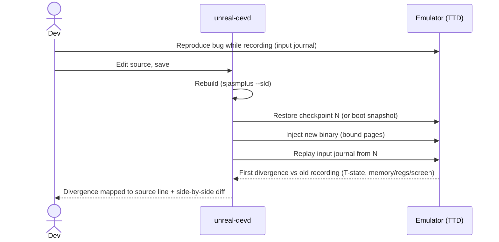

# unreal-ng Developer Toolchain — Architecture Proposal

| | |
|---|---|
| **Status** | Proposal / draft for review |
| **Date** | 2026-09-21 |
| **Baseline** | `unreal-ng` master `ae4d40b` (2026-09-19); sjasmplus docs (`docs/documentation.xml`, SLD format v1) |
| **Scope** | Source-level development tooling for Z80 software on unreal-ng: system software (NedoOS, CP/M-class OSes, drivers) and games/demos developed from source |
| **Supersedes (in part)** | Toolchain/IDE sections of `docs/inprogress/2026-09-17-nedoos-future-support/*` |
| **Related** | `2026-08-17-conditional-breakpoints/design.md`, `2026-08-26-expression-evaluator/`, `2026-07-19-time-travel/`, `tools/poc/011-ttd-v2-capture-analysis/`, `2026-08-26-automation-gaps/` (T4 #22 schema generation, T4 #23 event push) |

---

## 1. Summary

unreal-ng already has most of the *mechanisms* a first-class Z80 development environment needs: time-travel debugging with reverse execution, a GDB stub, a DZRP (DeZog) server, WebAPI/Lua/Python/MCP automation, coverage and opcode profiling. What it lacks is a **coherent, installable toolchain** that connects those mechanisms to source code.

This document proposes:

1. **A strict core/daemon boundary.** The emulator core keeps only what needs in-process, cycle-exact, deterministic or hot-path access. Everything that knows about a specific assembler, file format, OS or workflow moves out into an external daemon.
2. **`unreal-devd`** — a standalone daemon that speaks standard protocols (**LSP** for the assembler, **DAP** for debugging) plus the emulator's own API. It is editor-independent and usable from VS Code, other LSP/DAP editors, CLI, CI and LLM agents.
3. **A thin VS Code extension** providing UI only: webviews (live screen, raster timeline, TTD timeline, memory maps), custom editors (disk/tape/screen images), drag-and-drop, notebooks. No VS Code fork.
4. **A set of emulator API upgrades** that make external tooling reliable: owner-scoped declarative object sets, an event stream, safe-point mutations journaled into TTD, a normalized debug-info model with staleness detection.
5. **One-click distribution**: platform-specific VSIX packages bundling daemon, headless emulator and sjasmplus, published to both the VS Code Marketplace and Open VSX; zero configuration derived from the source itself (`DEVICE`, `SAVETRD`, `SAVESNA`, `SAVENEX`).

DeZog support in the emulator stays for compatibility, but it is no longer the primary developer path.

---

## 2. Motivation

### 2.1 Where things stand

- **DeZog integration works** (manual E2E 2026-09-16, including backward debugging against TTD). But DeZog is architecturally coupled to other emulators' proprietary plugins and conventions, implements its debugger logic inside the VS Code extension (TypeScript, not reusable), and parses source listings with its own heuristics. Building the rest of the toolchain on top of it would inherit those constraints.
- **The NedoOS design set** (2026-09-17) correctly identifies needs (struct decoding, syscall tracing, hot reload, source-level debugging), but assumes they are implemented *inside* the emulator and reduces the developer story to "hot reload + struct inspector + DeZog". It also contains factual errors (see §17).
- **Source-level mapping is 64 KB-flat.** `core/src/debugger/listing/listingparser.h` maps one `.lst` file into a flat 65536-entry `_addressToLine` table; rows above `0xFFFF` are kept but not mapped. This cannot represent banked code, multiple modules, or an OS that loads each process into its own pages at the same logical addresses (NedoOS).

### 2.2 What developers actually need

| Developer | Pain today | What changes the game |
|---|---|---|
| System (NedoOS kernel, drivers, apps) | Multi-process, banked, relocated code; raw-opcode debugging; image repacking via Windows `.bat` + `nedotrd` | Page/module-aware source mapping; OS tasks as debugger threads; host directory as an emulated volume; edit-and-replay |
| Game | Rebuild → reload → navigate back to the point of interest by hand | Edit-and-replay on recorded input; asset hot-swap; source-declared triggers; unit tests for routines |
| Demo | Cycle-exact timing is invisible; budget overruns found by eye | Per-line T-states incl. contention; raster timeline (code vs beam); budget assertions in source |
| Everyone | Manual setup of emulator, assembler, launch configs | Install one extension, open a folder, press F5 |

---

## 3. Goals and non-goals

### Goals

- **G1** Install from the extension store and work with no manual setup for a standard sjasmplus project.
- **G2** Editor independence: all intelligence lives in LSP/DAP servers; VS Code is one frontend.
- **G3** Correct source mapping for banked, multi-module, relocated and OS-loaded code.
- **G4** Every new emulator capability (device, event, observable) becomes available to the toolchain without toolchain code changes (registry-driven, see §7.1).
- **G5** Determinism is preserved: nothing the toolchain does can silently break TTD, replay or reverse debugging.
- **G6** The same daemon serves interactive use, CI and LLM agents.

### Non-goals

- **N1** No custom VS Code build/fork. Everything must be achievable through the public extension API.
- **N2** No assembler-, OS- or product-specific code in the emulator core (consistent with the "Strict System Universality" principle already stated in the NedoOS design).
- **N3** Not replacing DeZog for existing users; DZRP stays supported, just not primary.
- **N4** No new high-bandwidth IPC in the core *for its own sake* — it is built when the webview screen stream (§12.1) needs it.

---

## 4. Design principles

1. **Mechanism in the core, policy outside.** The core executes; the daemon decides what to execute.
2. **Standard protocols at the edges.** LSP and DAP towards editors; the emulator's own API towards the core; DZRP/GDB RSP retained as compatibility adapters.
3. **Declarative, owner-scoped state.** External clients describe the desired set of objects they own; the core reconciles. No imperative add/remove races.
4. **Determinism contract.** Every mutation from outside the emulated machine is journaled as a TTD external event and replayed from the journal, never re-executed.
5. **Content addressing.** Debug info, triggers and asset bindings are keyed by hashes of the code/data they describe, so staleness is detectable.
6. **One model, many views.** Parsers produce one normalized debug-info model consumed by the Qt UI, the GDB stub, DAP, MCP and LLM tooling alike.

---

## 5. Current-state audit (verified against code)

| Area | Location | Finding | Implication |
|---|---|---|---|
| Listing parser | `core/src/debugger/listing/listingparser.{h,cpp}` | Single sjasmplus `.lst`, flat 64 KB `_addressToLine`, no page/module notion | Replace with normalized debug-info model (§8) |
| Labels | `core/src/debugger/labels/labelmanager.h` | Labels carry `bank`, `bankOffset`, `bankType`; loaders for `.sym`, `.map` | Good base; becomes a consumer of the normalized model |
| GDB stub | `core/automation/gdb/src/gdbserver.cpp` | Advertises `qXfer:threads`, `qXfer:osdata:processes`, `qOffsets`; returns one thread `"Z80"`; supports `replaylog` stop replies | Plumbing exists for OS-aware threads (§14) |
| DZRP server | `core/automation/dezog/src/dzrpserver.cpp` | Full DZRP incl. slots (`handleSetSlot`, `getSlots`) | Keep as compatibility adapter |
| WebSocket | `core/automation/webapi/src/emulator_websocket.{h,cpp}` | Drogon `WebSocketController` skeleton with a pub/sub topic; echo/ACK handlers | Foundation for the event stream (R2) |
| MCP transport | `core/automation/mcp/src/mcp-sse.h` | SSE framing + `notifications/progress` for Streamable HTTP | Second foundation for the event stream |
| TTD external events | `core/src/debugger/ttd/ttdexternalevents.h` | Timeline markers for pokes/injections from control, Lua and WebAPI threads | Basis for the mutation journal (R4) |
| Breakpoints | `2026-08-17-conditional-breakpoints/design.md` | Trigger = address/port; action = "pause + notify (future: log, count-only)"; fixed symbol set compiled to RPN | Must generalize to registry-driven observables/events/actions (§9) |
| Coverage / profiling | `core/src/debugger/analyzers/coverage/`, `core/src/emulator/cpu/opcode_profiler.h` | Raw data exists | Daemon maps it to source (lcov, per-line T-states) |
| Schema-driven API | PLAN T4 #22 | Deferred | Becomes a prerequisite once external clients multiply |
| Event push | PLAN T4 #23 | Deferred ("polling sufficient") | Becomes a prerequisite for the daemon |

---

## 6. Architecture overview

```mermaid
flowchart LR
    subgraph Editors["Frontends"]
        VSC["VS Code extension<br/>(UI only: webviews, custom editors,<br/>notebooks, DnD)"]
        OTHER["Neovim / Zed / JetBrains<br/>(LSP + DAP clients)"]
        CLI["unreal-dev CLI / CI"]
        AGENT["LLM agents<br/>(via MCP or daemon API)"]
    end

    subgraph Daemon["unreal-devd"]
        LSP["LSP server<br/>(Z80 asm, sjasmplus dialect)"]
        DAP["DAP adapter"]
        PROJ["Project model<br/>(DEVICE, SAVE*, includes, modules)"]
        DBG["Debug-info builder<br/>(SLD, .lst, .sym, .cdb/.adb)"]
        TRG["Trigger compiler<br/>(SLD 'K' records)"]
        BLD["Build orchestrator<br/>(sjasmplus, image packing)"]
        AST["Asset pipeline<br/>(PNG, fonts, music → binaries)"]
        RPL["Edit-and-replay orchestrator"]
        OSD["OS descriptors<br/>(NedoOS, CP/M, iS-DOS …)"]
    end

    subgraph Core["unreal-ng core"]
        API["Automation API<br/>(WebAPI + event stream)"]
        REG["Capability registry<br/>(observables, events, actions)"]
        ENG["Trigger engine<br/>(hot path)"]
        DIM["Normalized debug-info model"]
        TTD["TTD v2<br/>(checkpoints, journals, replay)"]
        VOL["Storage devices<br/>(SD/IDE/FDD + COW overlays,<br/>host-dir backing)"]
        COMPAT["Compat adapters<br/>(GDB RSP, DZRP, MCP)"]
    end

    VSC <-->|LSP / DAP / custom| Daemon
    OTHER <-->|LSP / DAP| Daemon
    CLI <--> Daemon
    AGENT <--> Daemon
    Daemon <-->|API + events + binary streams| API
    API --- REG --- ENG
    API --- DIM
    API --- TTD
    API --- VOL
    COMPAT --- REG
```



---

## 7. Core / daemon boundary

### 7.1 Placement rule

A function belongs in the core if **any** of these hold:

- it runs on the emulation hot path or needs cycle-exact timing;
- it must be captured in, or restored from, TTD checkpoints;
- it serves every frontend identically and cannot be expressed as a composition of API calls without unacceptable latency.

Everything else — parsing, formats, toolchain knowledge, workflows, UI — lives outside.

### 7.2 Placement table

| Capability | Daemon / extension | Core |
|---|---|---|
| Source-declared triggers | Read SLD `K` records, resolve symbols, compile to trigger specs, apply as an owned set | Trigger engine: evaluate conditions, execute actions |
| Debug info | SLD / `.lst` / `.sym` / `.cdb` parsers, module relocation, runtime page binding logic | Normalized model storage, lookup (page, offset) → file:line, staleness check |
| Struct decoding | Extract `STRUCT` definitions (SLD `+struct_def` traits + source), inspector UI | Struct-typed dereference inside trigger expressions (`app[pid].mainpg`) |
| Asset hot-swap | Watch files, convert (PNG → screen/sprite data, fonts, music), locate `INCBIN` regions | Write into physical pages at a safe point; journal as TTD external event |
| Image packing (TRD/SCL/TAP) | Entirely | Load the finished image |
| Edit-and-replay | Orchestration and reporting | Checkpoint restore, binary injection, journal replay, first-divergence detection |
| Host directory as a volume | Selects directory, reports changes | Emulated SD/IDE + virtual FAT backing + COW overlay (sector I/O latency and TTD determinism require in-core) |
| OS awareness | OS descriptor files (declarative) | Descriptor evaluation inside GDB/DAP-facing thread model |
| Coverage, profiling | Aggregation, lcov, flamegraphs, per-line T-states | Raw counters |
| Screen/raster streaming | Webview rendering | Frame/raster data publication (shared memory) |

---

## 8. Emulator API requirements

These are the core-side deliverables. Each is independently useful beyond this toolchain (MCP, LLM workers, UE/iOS hosts).

### R1 — Owner-scoped declarative object sets

- Object kinds: `triggers`, `debug_info`, `struct_schemas`, `asset_bindings`, `os_descriptors`, `labels`.
- Each set is owned by a client namespace (`devd:<project-id>`, `mcp:<session>`, `user`) and carries a monotonically increasing `generation`.
- `apply(namespace, kind, generation, objects[])` replaces the whole set atomically. The core computes the diff internally.
- Sets from different owners never overwrite each other. `list` returns objects with owner and generation.
- Model: `kubectl apply`, not imperative add/remove.

### R2 — Event stream

- One subscription channel (WebSocket on the existing Drogon controller; SSE for MCP clients) with topic filters.
- Topics:
  - lifecycle: `reset`, `model_changed`, `snapshot_loaded`, `ttd_seek`, `paused`, `resumed`;
  - debugging: `breakpoint_hit`, `trigger_fired`, `log`;
  - loading: `module_loaded` (see §8.3);
  - storage: `volume_write`;
  - recording: `recording_started` / `recording_stopped`.
- Events carry the T-state timestamp and TTD frame index so clients can correlate with the timeline.
- Reclassify PLAN T4 #23 as a prerequisite.

### R3 — Lifecycle semantics

For each object kind, the spec states whether it survives reset, model change, snapshot load and TTD seek. Default: survives everything except model change. The daemon re-applies on `model_changed`.

### R4 — Safe-point mutations

- Memory/page writes, image swaps and register edits requested from outside take a `when` qualifier: `now_if_paused`, `frame_boundary`, `on_trigger:<id>`.
- Every such mutation is recorded as a `TTDExternalEvent` and replayed from the journal during seek/replay, never re-requested.

### R5 — Normalized debug-info model

See §8.1–8.3. Exposed through the API, the GDB stub (symbol lookup, `qXfer:libraries` equivalent), DAP (via daemon), Qt disassembler and MCP.

### R6 — Binary data streams

Framebuffer, raster timeline and audio are published through shared memory. The daemon forwards them as binary WebSocket frames to webviews. This is the concrete first consumer that justifies the high-bandwidth IPC work (seqlock triple-buffer for video, SPSC rings for audio).

### R7 — Schema-generated API surface

Promote PLAN T4 #22: one command schema generates CLI, WebAPI (OpenAPI), Lua, Python, MCP tools and documentation. External clients are version-pinned against the schema.

### R8 — Version negotiation

On connect: `api_version`, `schema_hash`, capability list. The daemon refuses to proceed with a clear error on incompatibility, rather than degrading silently.

### 8.1 Debug-info model

```text
Module
  id, name, content_hash (of emitted bytes), source_root
  compile_memory_model   (from SLD 'Z' record: page size, page count, slots)
  segments[]             (compile page, offset range, bytes hash)
  lines[]                (compile page, offset, length) -> (file, line, col_begin, col_end,
                                                            def_file, def_line)   // macro origin
  symbols[]              (module, main, local, value, compile page, traits: +local +equ +macro
                          +reloc +reloc_high +struct_def +struct_data +sizeof ...)
  types[]                (struct layouts; C types from .cdb/.adb)
  keywords[]             (SLD 'K' records: file, line, comment text)

Binding (runtime)
  module_id, compile page -> physical page, relocation delta, process id (optional)
```

Lookups are always **(physical page, offset) → line**, resolved through active bindings.

### 8.2 Compile-time vs runtime pages

SLD `<page>` is the page in the *assembler's* device model (`DEVICE`), not where the code runs:

- For games/demos using `DEVICE ZXSPECTRUM128` with `SAVESNA`/`SAVETRD`, compile pages usually equal runtime pages. The binding is identity and is created automatically.
- For OS-loaded programs (NedoOS apps, CP/M `.com`), code is placed in physical pages chosen by the OS loader at run time. The binding must be created when the program is loaded.

### 8.3 Module load binding

- An OS descriptor (§14) declares the loader trap: an address or syscall, which registers hold the destination pages, and how to identify the loaded image.
- On trap the core emits `module_loaded {pages, image_hash, process_id}`.
- The daemon matches `image_hash` against built modules and applies the binding (R1).
- **Staleness:** if bytes in bound pages no longer hash to the module's segment hashes (rebuilt binary not reloaded, self-modifying code, overwritten memory), the binding is marked stale, and the UI shows it instead of wrong source lines.

---

## 9. Triggers from source

### 9.1 Carrier: sjasmplus `SLDOPT COMMENT`

sjasmplus already exports end-of-line comments containing registered keywords into SLD as type `K` records (`SLDOPT COMMENT <kw1>, <kw2>, ...`; keywords are case sensitive). This gives exact file/line, page and address for every annotation **without a custom parser of source files**.

The daemon injects the keyword list: via a generated include, or by prepending `SLDOPT COMMENT @break,@log,@watch,@assert,@budget,@trace` through the build invocation. Source stays clean:

```asm
    DEVICE ZXSPECTRUM128
    ORG $8000
main:
    call init          ; @log "init, hl={hl:04x}"
.loop:
    halt
    call draw_frame    ; @budget 22000T
    call update        ; @break if (lives == 0)
    jr .loop

lives   db 3           ; @watch write
```

### 9.2 Annotation grammar (initial)

| Keyword | Form | Meaning |
|---|---|---|
| `@break` | `@break [if <expr>] [hits <n>]` | Conditional breakpoint at this address |
| `@log` | `@log "<fmt>" [if <expr>]` | Logpoint, no stop; format placeholders are expressions |
| `@watch` | `@watch [read\|write\|rw] [if <expr>]` | Watchpoint on the label on this line (size from `+sizeof`/struct) |
| `@assert` | `@assert <expr>` | Stop and report when false |
| `@budget` | `@budget <n>T` \| `@budget line <n>` | Routine starting here must return within N T-states, or before raster line N |
| `@trace` | `@trace <name>` | Emit a named span start/end into the TTD timeline |

Expressions use the shared expression evaluator (`2026-08-26-expression-evaluator`). Symbols resolve through the normalized debug-info model, including struct fields.

### 9.3 Engine requirements (core)

The current conditional-breakpoint design must generalize in three ways:

1. **Registry-driven vocabulary.** Observables (expression symbols), event sources (PC, memory, port, frame, INT, raster position, paging change, video-mode change, FDC command, tape block, device writes) and actions are registered by devices and models, the same way `PortDecoder::CreateTTDSerializers()` registers TTD state today. A new device automatically brings its symbols and events.
2. **Action classes with a determinism contract:**

   | Class | Examples | Live | During seek/replay |
   |---|---|---|---|
   | observe | log, count, trace span | execute | suppressed (or served from recorded log) |
   | annotate | TTD bookmark, label | execute | idempotent |
   | mutate | poke, register edit, input injection, Lua write | execute + journal as external event | replayed from journal only |
   | control | pause, speed change | execute | suppressed |
   | delegate | enqueue task for daemon/LLM | enqueue (async) | suppressed |

3. **Two execution backends for one compiled condition:** live (hot path) and retroactive scan over the TTD timeline. `find-last` and `reverse-continue` become special cases. Every annotation works both as a breakpoint and as a query over a recording.

Execution tiers: native actions run inline without allocation. Lua and daemon callbacks run deferred through a queue at an instruction boundary. Synchronous Lua is available only via an explicit flag.

---

## 10. `unreal-devd`

### 10.1 Responsibilities

- **Project model:** workspace scan, include graph, modules, build targets.
- **Build orchestration:** sjasmplus invocation with `--sld`, `--lst`, `--sym`; image packing (TRD/SCL/TAP); incremental rebuild on save.
- **Debug-info building and binding** (§8).
- **Trigger compilation and application** (§9).
- **Asset pipeline and hot-swap** (§13.3).
- **Edit-and-replay orchestration** (§13.1).
- **OS descriptors** (§14).
- **LSP server** (§11) and **DAP adapter** (§12).
- **Coverage/profiling aggregation:** lcov, per-line T-states, flamegraphs.
- **Crash/anomaly dossiers:** the same bundle serves humans and LLM workers.
- **Emulator lifecycle:** spawn a bundled headless emulator, or attach to a running unreal-qt/headless instance.

### 10.2 Zero configuration

sjasmplus sources already declare most configuration:

| Source directive | Derived configuration |
|---|---|
| `DEVICE ZXSPECTRUM48/128/…/4096, ZXSPECTRUMNEXT` | Emulator model and RAM size (a `unreal-dev.toml` override maps e.g. `ZXSPECTRUM1024` → Pentagon 1024 vs ATM) |
| `SAVESNA "x.sna", start` | Launch = load snapshot, start address |
| `SAVETRD "x.trd", "name.C", …` | Launch = mount TRD, autostart via TR-DOS autostart (already implemented) |
| `SAVETAP`, `SAVENEX`, `SAVEDEV` | Corresponding media/launch mode |
| `SLDOPT COMMENT …` | Preserved and merged with daemon keywords |

A project file (`unreal-dev.toml`) is optional and only needed for overrides: model variant, peripherals (GS, TSFM, MoonSound), OS descriptor, host-directory volumes.

### 10.3 Internal structure

```text
unreal-devd
├── core/        project model, file watching, job scheduler
├── parsers/     libunreal-debuginfo: SLD, .lst, .sym, .map, .cdb/.adb, TRD/SCL/TAP/TZX
├── lsp/         Z80 asm language server
├── dap/         debug adapter (talks to emulator API, not DZRP)
├── emu/         emulator client: API, event stream, binary streams, version negotiation
├── triggers/    SLD 'K' → trigger specs
├── assets/      converters + INCBIN region mapping
├── replay/      edit-and-replay, divergence reports, bisect driver
└── os/          OS descriptor loader/validator
```

`libunreal-debuginfo` is a separate library, also linked by the CLI and optionally by unreal-qt, so the Qt disassembler and the daemon never disagree.

---

## 11. LSP feature set

| Feature | Notes |
|---|---|
| Diagnostics | sjasmplus errors/warnings as structured diagnostics (reuse the build-analyzer approach: compiler output → structured, AST-enriched diagnostics) |
| Go to definition / references / rename | Across `INCLUDE`, `MODULE`, macros, local labels, `STRUCT` fields |
| Completion | Labels, struct fields, device-specific ports/constants, directives |
| Hover | Instruction T-states, flags affected, contention for the active model (from `DEVICE`/project), value/address of symbols, struct layout |
| Selection T-state sum | Status bar / CodeLens for selected block, with best/worst case for conditional branches |
| Macro expansion view | Virtual document with the expanded macro (SLD def-file/def-line gives origin) |
| Annotation support | Syntax highlight, validation and quick fixes for `@break`, `@budget`, … |
| Runtime overlays (when connected) | Gutter coverage, measured per-line T-states, CodeLens call counts and cumulative time per routine |
| Semantic tokens | Distinguish code/data/equ/macro/struct symbols using SLD traits |

---

## 12. DAP adapter

- Standard: launch/attach, breakpoints (conditional, hit count, logpoints map directly onto triggers), stepping, stack traces, scopes/variables.
- **Reverse debugging:** `supportsStepBack`, `stepBack`, `reverseContinue` backed by TTD. VS Code renders the reverse buttons natively.
- **Memory:** `readMemory`/`writeMemory` for the built-in memory inspector. Writes go through R4 (journaled).
- **Threads = OS tasks** when an OS descriptor is active (§14), otherwise a single "Z80" thread (plus a GS Z80 thread when General Sound is fitted).
- **Variables:** registers, flags, paging state, struct-decoded memory, C locals (from `.cdb`/`.adb`).
- **Stack traces:** reconstructed from call-trace data and debug info. Frames outside known modules are shown as addresses with a page.
- The DZRP and GDB RSP servers in the core remain for DeZog, Ghidra and gdb users.

### 12.1 Screen and raster streaming

A webview cannot sustain 50 fps through `postMessage` (JSON). The webview connects directly to a daemon-local binary WebSocket through the webview `portMapping` option. The daemon reads frames from the emulator's shared memory (R6).

---

## 13. Workflows

### 13.1 Edit-and-replay

"Hot reload without resetting task state" is ill-defined for kernel code: a new binary over old in-memory structures is undefined behavior. The deterministic alternative:



Derived features:

- **Regression bisect:** `git bisect run unreal-dev replay --journal bug.ttd --expect-screen <digest>`.
- **Demo iteration:** replay to frame N with the new effect code without navigating there by hand.
- **Compact fixtures:** TTD v2 makes recordings small enough (1.85 MB for 1209 frames in the POC corpus) to attach to bug reports and commit as test fixtures.

### 13.2 Host directory as a volume

- Emulated SD (Z-controller) or IDE device backed by a **virtual FAT image generated from a host directory**. The build writes `.com` files into the directory, and they are immediately visible inside NedoOS. No image repacking.
- Writes from the guest go to a **COW overlay** referenced by TTD checkpoints. The host directory and any base image stay untouched until an explicit commit. This also closes the current gap where storage devices are not covered by TTD (`io/hdd` is not registered in the TTD peripheral registry).
- The same mechanism for TR-DOS: a virtual TRD generated from a directory.

### 13.3 Asset hot-swap

- SLD and the listing identify `INCBIN` regions (address, page, length, source file).
- The daemon watches asset sources (PNG, fonts, tracker modules), converts them and writes the result into bound pages at a safe point (R4).
- It refuses when the size changes, and offers a rebuild instead.

### 13.4 Unit tests for Z80 routines

- A pytest plugin (via daemon or Python bindings): set registers/memory → call label → run until return or budget → assert registers/memory/T-states.
- Boot-snapshot fixtures: each test starts from a booted OS state in milliseconds.
- Headless CI with golden screen digests. A GitHub Action is published alongside the extension.

### 13.5 Timing for demos and games

- Per-source-line T-states including contention, from opcode profiler data mapped through debug info.
- **Raster timeline:** which source line executed at which beam position. For multicolor, border effects and interrupt sync.
- `@budget` violations are reported with the offending path.

### 13.6 Crash and anomaly reports

On reset, jump into non-code, stack overflow, `RST 38` loop or watchdog, the daemon produces:

- the last N executed source lines (TTD M1 records via debug info);
- the reconstructed call stack;
- the active task and last syscalls;
- a minimal TTD recording.

The same dossier is the input for LLM investigation tasks.

---

## 14. OS awareness

### 14.1 Declarative OS descriptors

A descriptor (YAML/JSON, shipped with the extension, loaded by the daemon, applied via R1) declares:

- task table location and layout (e.g. NedoOS `STRUCT app` array, `MAXAPPS`);
- how to find the current task;
- where a suspended task's register context is saved;
- task → page ownership (e.g. `mainpg` and additional pages);
- syscall entry (e.g. `RST 0x10` with function in `C`) and argument decoding (`FIL`, `FILINFO`, …);
- loader trap for module binding (§8.3).

This is the OpenOCD RTOS-awareness model (FreeRTOS, Zephyr) made declarative. No OS-specific code in the core, consistent with N2.

### 14.2 Resulting features

- **Tasks as GDB/DAP threads:** thread list from the task table. Selecting a thread shows its saved context. Uses the already-advertised `qXfer:threads` / `qXfer:osdata`.
- **Per-task breakpoints:** implicit condition on current task or physical page (the conditional-breakpoint design already plans slot and physical-page filters).
- **Page-ownership violations:** a task writing into a page owned by another task fires a trigger. This is the dominant bug class in a multitasking OS on a Z80 without memory protection.
- **Syscall stream:** structured, argument-decoded syscall events on the TTD timeline.

---

## 15. VS Code extension

| Capability | VS Code API | Use |
|---|---|---|
| Live screen, raster timeline, TTD timeline, page-ownership map, struct ER graph | Webview panels (canvas / WebGL / WebGPU) + `portMapping` binary stream | Visual debugging |
| Disk/tape/screen editors | Custom editors (`CustomEditorProvider`) | Open `.trd`/`.scl` as a catalog, `.tap`/`.tzx` as a block list, `.scr` as an image; font/sprite editors |
| Drag-and-drop | `TreeDragAndDropController`, `DocumentDropEditProvider` | Drag files into a disk image; drop a PNG into source → converted asset + `INCBIN` |
| Recipes / investigations | Notebooks API | Cells run Lua/Python/emulator commands; outputs are screens, timelines, struct dumps. Readable and writable by LLMs |
| Memory | Built-in memory inspector via DAP | Hex view, journaled writes |
| Commands | Command palette, status bar | Build, run, record, replay-from-here, bisect, commit volume overlay |

The remaining limits of the extension API (custom window chrome, native GPU outside webviews) are irrelevant for this toolchain.

---

## 16. Distribution and packaging

- **Platform-specific VSIX** (`vsce package --target darwin-arm64|darwin-x64|linux-x64|linux-arm64|win32-x64`), each bundling:
  - `unreal-devd`;
  - the headless emulator (or `unrealng_embed` + a thin host);
  - sjasmplus (BSD license, redistributable).
- **Publish to both the VS Code Marketplace and Open VSX.** VS Code forks (VSCodium, Cursor, Windsurf, Antigravity, Qoder) install from Open VSX.
- **Versioning:** extension, daemon and emulator API versions are negotiated at connect (R8). The daemon can attach to a newer user-installed unreal-qt if the API is compatible.
- **Licensing boundary:** the emulator stays GPL-3.0. The daemon and extension communicate over protocols and can be licensed independently (e.g. MIT) if desired. Bundling the GPL emulator binary in a VSIX requires shipping its source offer/notice.
- **CLI:** the same daemon binary with a CLI front (`unreal-dev build|run|test|replay|bisect`) for CI; a GitHub Action wraps it.

---

## 17. Corrections required in the NedoOS design set

`docs/inprogress/2026-09-17-nedoos-future-support/*` needs a truth pass before anyone (human or LLM) builds on it:

| Claim in docs | Reality |
|---|---|
| DeZog adapter is missing, P1, "3–4 days" | DZRP server landed; manual E2E incl. backward debugging passed 2026-09-16 |
| "DeZog / GDBserver (TCP 23456)" as one adapter | Two different protocols (DZRP vs GDB RSP) and two separate modules (`core/automation/dezog`, `core/automation/gdb`) |
| Hot reload "via Shared Memory IPC" | Not needed; the correct primitive is edit-and-replay (§13.1) |
| Hot reload "without resetting task state" | Ill-defined for kernel code; see §13.1 |
| Symbol importer "Partial (manual)" with line mapping as a small add-on | Line mapping is fundamentally 64 KB-flat today; needs the model in §8 |
| "Z80 Parity Engine 100% bit-accurate Zilog/NEC/ST", effort estimates in days | Unsubstantiated; remove or back with test evidence |
| NedoOS-specific endpoints avoided, but struct DSL engine, trap interceptor and inspectors all placed in core | Parsing/extraction belongs in the daemon; the core provides struct-typed dereference, triggers and OS-descriptor evaluation |

The *content* worth keeping: the structure catalog (`STRUCT app`, `FATFS`, `FIL`, `DIR`, `FILINFO`, sockets), the syscall enums, and the visualization ideas (scheduler timeline, page grid, handle topology). They become input for the NedoOS OS descriptor (§14) and webviews (§15).

---

## 18. Phasing

| Phase | Deliverables | Depends on | Exit criteria |
|---|---|---|---|
| **P0 — Core foundations** | R1 declarative sets, R2 event stream (on existing WebSocket/SSE), R3 lifecycle spec, R4 safe-point journaled mutations, R8 version negotiation | — | External client can own a trigger/label set across reset; all mutations visible as TTD external events; replay unaffected |
| **P1 — Debug info** | `libunreal-debuginfo` (SLD first, then `.lst`/`.sym`), normalized model in core (R5), identity binding, staleness detection; Qt disassembler switched to the model | P0 | Banked 128K/1024K project shows correct source lines in every page; stale binary flagged |
| **P2 — Daemon MVP + DAP + extension MVP** | `unreal-devd` with project model, build, zero-config launch, DAP incl. reverse stepping; thin extension; platform VSIX on Marketplace + Open VSX | P1 | Fresh machine: install extension, open sample project, F5 → breakpoint in source, step back works |
| **P3 — Triggers from source** | Registry-driven trigger engine (conditional-breakpoints design generalized), SLD `K` pipeline, action classes, retroactive backend | P0, expression evaluator | All §9.2 annotations work live and as TTD queries; mutate actions survive seek/replay |
| **P4 — LSP** | Diagnostics, navigation, hover T-states/contention, macro expansion, runtime overlays | P1, P2 | Parity with best existing Z80 extensions plus model-aware timing |
| **P5 — Workflows** | Edit-and-replay + divergence reports + bisect; host-dir volume with COW overlay; asset hot-swap; pytest plugin + GitHub Action | P2, P3, TTD v2 | Bug-fix loop without manual navigation; NedoOS app rebuild visible in guest without repacking |
| **P6 — OS awareness** | Descriptor format, NedoOS descriptor, module-load binding, tasks as threads, ownership violations, syscall stream | P1, P3 | Two NedoOS processes at the same logical address debug independently with correct source |
| **P7 — Visual tooling** | R6 shared-memory streams, screen/raster/TTD webviews, custom editors, DnD, notebooks | P2, R6 | 50 fps screen in webview; raster timeline aligned to source lines |

---

## 19. Risks and open questions

| # | Risk / question | Mitigation / direction |
|---|---|---|
| 1 | SLD format is marked "still under development" by sjasmplus | Track upstream; engage the sjasmplus maintainers as the doc invites; version-gate the parser |
| 2 | Non-sjasmplus assemblers (legacy ALASM/STORM sources, pasmo, zmac) | `.lst`/`.sym` fallback with reduced features; SLD remains the reference format |
| 3 | Self-modifying code and runtime-generated code break source binding | Staleness detection (§8.3) shows "no source" rather than wrong source; TTD shows the generator |
| 4 | Virtual FAT from a host directory: long file names, concurrent host edits during guest writes | Snapshot the directory at mount; COW overlay for guest writes; explicit sync/commit commands |
| 5 | Trigger evaluation cost with many source annotations | Existing fast-predicate + RPN design, match-first ordering; benchmarks as regression gates (Phase 0 of conditional breakpoints) |
| 6 | Bundled emulator vs user-installed unreal-qt version skew | R8 negotiation; prefer attaching to a compatible running instance |
| 7 | OS descriptor expressiveness (pointer chasing, variable-size tables) | Descriptor fields are expressions in the shared evaluator; escape hatch via Lua evaluated in the daemon for non-hot-path views |
| 8 | Scope creep into an IDE | Hard rule: the extension is UI only; logic goes to the daemon, mechanisms to the core |

---

## Appendix A — SLD v1 quick reference (from sjasmplus docs)

```text
|SLD.data.version|1
||comment line
<source file>|<src line>|<definition file>|<def line>|<page>|<value>|<type>|<data>
```

- `<src line>` / `<def line>`: `line[:col_begin[:col_end]]`, 1-based; `def line` = 0 when there is no separate definition (non-macro).
- `<page>`: page of the address in the assembler's device model, or `-1` if not an address.
- `<value>`: 32-bit value. For addresses, a 16-bit Z80 address whose top bits beyond page size encode the slot.
- `<type>`:
  - `T` — instruction trace;
  - `L` — label (`F`/`D` deprecated, parse as `L`);
  - `Z` — device memory model;
  - `K` — keyword comment.
- `L` data: `module,main,local[,traits…]`, traits include `+local +equ +macro +reloc +reloc_high +used +module +endmod +struct_def +struct_data +sizeof`.
- `K` data: the comment text containing a registered keyword (`SLDOPT COMMENT kw1, kw2`, case-sensitive).
- `Z` data: `pages.size:<n>,pages.count:<n>,slots.count:<n>[,slots.adr:<a0>,…]`.
