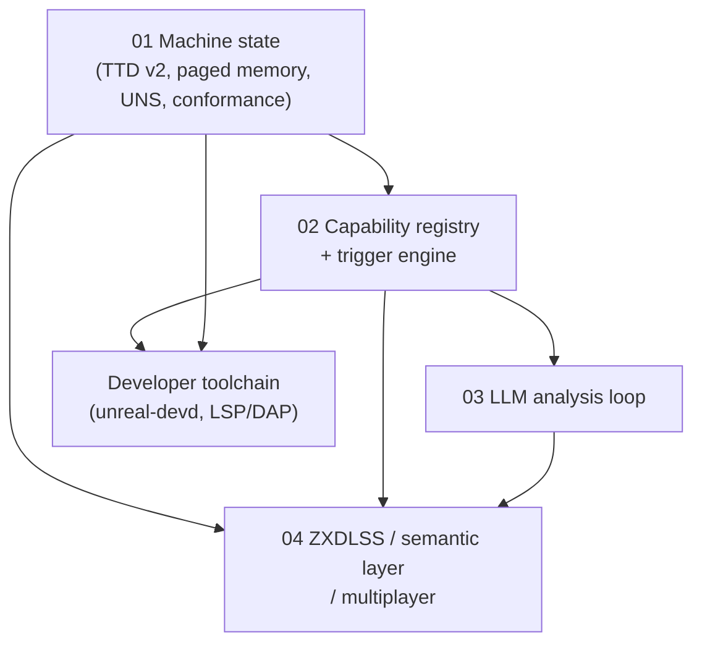

# unreal-ng — Feature Proposals Index

| | |
|---|---|
| **Status** | Proposal set / draft for review |
| **Date** | 2026-09-21 |
| **Baseline** | `unreal-ng` master `ae4d40b` (2026-09-19); branches `generalsound`, `moonsound`, `uns-snapshots`; `tools/poc/011-ttd-v2-capture-analysis` |

This set captures the directions discussed on 2026-09-20/21, turned into descriptions and requirements. Every claim about the current state was checked against the repository at the baseline commit; the file/line references are given where they matter.

## Documents

| # | Document | Scope |
|---|---|---|
| 01 | [Roadmap and machine-state consolidation](01-roadmap-and-machine-state.md) | Order of work, machine "definition of done", TTD v2 integration across the machine zoo, paged device memory, storage in TTD, multi-CPU replay, universal snapshot (UNS) on top of the TTD registry, conformance matrix |
| 02 | [Capability registry and trigger engine](02-capability-registry-and-triggers.md) | Registry of observables/events/actions, generalized conditional breakpoints → triggers, determinism contract, execution tiers, live + retroactive backends, Lua state in checkpoints, schema-generated automation surface |
| 03 | [LLM analysis loop](03-llm-analysis-loop.md) | MCP work cycles, recipes and their regression, oracles and differential testing, batch corpus runner, title knowledge base, emulator-initiated LLM tasks (delegate actions), hypothesis verification via TTD |
| 04 | [ZXDLSS, semantic game layer, mods and multiplayer](04-zxdlss-semantic-layer-and-multiplayer.md) | Game manifest, GigaScreen de-flicker, sprite/clash processing, draw-call recovery, asset packs, reconstructed rendering, audio remastering, UX features, rollback netplay, ghosts, grafted multiplayer |
| — | [Developer toolchain](unreal-ng-developer-toolchain-design.md) (delivered earlier) | Core/daemon boundary, `unreal-devd`, LSP/DAP, VS Code extension, source-level debugging, NedoOS/system development |

## Dependency map

- **01 is the foundation.** Every later feature relies on complete, compact, deterministic machine state.
- **02 is the central mechanism.** Triggers, automation, source annotations, LLM tasks, ZXDLSS sample points and mod scripts all reduce to "observable + event + action" executed by one engine.
- **03 produces the data** (title knowledge base, verified manifests) that **04 consumes**.

## Cross-cutting principles

1. **Mechanism in the core, policy outside** (see the toolchain doc, §4/§7).
2. **Determinism is never optional.** Anything that mutates machine state from outside is journaled as a TTD external event and replayed from the journal.
3. **Registry-driven extensibility.** A new machine, device or event makes itself known to TTD, snapshots, triggers, automation and the toolchain by registering, not by editing those subsystems.
4. **Content addressing.** Manifests, packs, recipes and debug info are keyed by hashes of the code/data they describe.
5. **Verified vs draft.** Anything produced by heuristics or LLMs is a draft until an automated check (usually a TTD-based one) promotes it.
