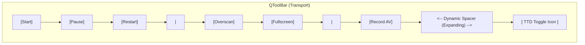
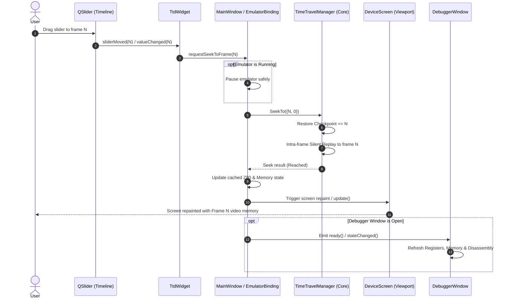

# Technical Design: Unreal-QT Toolbar TTD Toggle & Time Travel Control Widget

**Target Module:** `unreal-qt` (Desktop UI)  
**Author/Status:** Draft Specification / In Progress  
**Date:** 2026-09-23  
**Tracked in:** `docs/inprogress/2026-09-23-ttd-qt-toolbar-widget/`  

---

## 1. Overview & Objectives

Time Travel Debugging (TTD) in Unreal-NG provides frame-accurate recording, checkpointing, and intra-frame silent replay across Spectrum hardware platforms. While the TTD engine is fully exposed to automation interfaces (WebAPI, MCP, CLI, Python, Lua), the `unreal-qt` desktop interface currently lacks an integrated GUI toolbar control for recording, loading, exporting, and scrubbing through timelines visually.

This document details the architectural design and implementation plan for integrating a **TTD Toggle Icon** into the main `unreal-qt` transport toolbar and embedding a dedicated **TTD Control Widget** (`TtdWidget`) in the main window UI.

### 1.1 Core Requirements

1. **Toolbar Right-Aligned Toggle Icon**:
   - Add a right-aligned checkable toggle button to the main `unreal-qt` transport toolbar (`ToolBarManager`).
   - Use a dynamic spacer (`QWidget` with `QSizePolicy::Expanding`) placed before the TTD toggle button to push it to the right edge of the toolbar.
   - Display a theme-aware SVG icon (`icons/timetravel.svg`).
   - Toggling the button on/off displays or collapses the TTD control widget panel (`TtdWidget`).

2. **TTD Control Widget (`TtdWidget`)**:
   - Collapsible horizontal control panel integrated into `MainWindow` (directly beneath the transport toolbar).
   - **Session Transport & Management**:
     - **Record / Stop**: Start live recording (`TimeTravelManager::StartRecording()`) or stop capture (`StopRecording()`).
     - **Load `.ttd`**: Open file dialog to load saved `.ttd` timeline session file (`DeserializeSession`).
     - **Export `.ttd`**: Save active timeline recording to `.ttd` file (`SerializeSession`).
     - **Clear / Reset**: Invalidate current session history (`InvalidateSession`).
     - **Session Telemetry Display**: Live status badge (Idle, Recording, Detached), frame counter (`currentEndFrame`), total memory footprint (`sessionHeapBytes`), and file provenance (Live vs Loaded file path).
   - **Interactive Timeline Scrubber & Navigation**:
     - **Timeline Slider (`QSlider`)**: Interactive timeline range (`sessionStartFrame` to `currentEndFrame`) showing current position.
     - **Step Back (-1 Frame)**: Step backward exactly one frame (`StepBackFrame()`).
     - **Step Forward (+1 Frame)**: Step forward exactly one frame (`StepForwardFrame()`).
     - **Jump to Start (`|<`)**: Seek to initial captured baseline checkpoint (`frame 0`).
     - **Jump to End (`>|`)**: Seek to the end of recorded history (`SessionEndPosition()`).
     - **Resume Recording from Current Position**: Truncate future recorded timeline past current position and resume live recording (`ResumeRecordingFrom`).

3. **Immediate Repositioning & Live Screen Refresh Mandate**:
   - Any scrubbing or position change on the timeline slider MUST:
     1. Pause emulator execution if running.
     2. Invoke `TimeTravelManager::SeekTo({targetFrame, 0})` to reposition machine CPU, memory, banking, and chipset state.
     3. Instantly refresh the emulator video viewport (`DeviceScreenWrapper` / `DeviceScreen`) so the visual display reflects the exact target frame instantly.
     4. Notify attached debugger windows (Registers, Disassembler, Memory View) to update display for the target frame.

---

## 2. Architecture & UI Component Design

### 2.1 Toolbar Integration (`ToolBarManager`)

The `ToolBarManager` owns the transport toolbar (`QToolBar`) situated under the menu bar in `MainWindow`.



#### Toolbar Modifications (`toolbarmanager.h` / `toolbarmanager.cpp`):
- Insert a dynamic layout spacer before the TTD toggle action:
  ```cpp
  QWidget* spacer = new QWidget(_toolBar);
  spacer->setSizePolicy(QSizePolicy::Expanding, QSizePolicy::Preferred);
  _toolBar->addWidget(spacer);
  ```
- Create checkable `_ttdAction`:
  ```cpp
  _ttdAction = new QAction(tintedSvgIcon(QStringLiteral("timetravel")), tr("Time Travel Debugging"), this);
  _ttdAction->setCheckable(true);
  _ttdAction->setToolTip(tr("Toggle Time Travel Debugging (TTD) Control Panel"));
  _toolBar->addAction(_ttdAction);
  connect(_ttdAction, &QAction::toggled, this, &ToolBarManager::ttdWidgetToggled);
  ```

---

### 2.2 TTD Control Widget Panel (`TtdWidget`)

`TtdWidget` inherits from `QWidget` and provides a compact two-row horizontal layout:

```
+--------------------------------------------------------------------------------------------------------------------+
| [REC] Start/Stop  [LOAD] Load .ttd  [EXPORT] Export .ttd  [CLEAR] Reset | State: Recording | Frame: 1420/3000 (12.4 MB)|
+--------------------------------------------------------------------------------------------------------------------+
| [|<] [ -1F ]  ===================O============================================= [ +1F ] [>|]  [REC FROM HERE]   |
+--------------------------------------------------------------------------------------------------------------------+
```

#### Layout Breakdown:

1. **Top Row (Session Management & Telemetry)**:
   - **Record Button (`QPushButton`)**: Styled button with recording state indicator. Toggles recording on active emulator context.
   - **Load Button (`QPushButton`)**: Opens `QFileDialog::getOpenFileName` with filter `"Time Travel Session (*.ttd)"`.
   - **Export Button (`QPushButton`)**: Opens `QFileDialog::getSaveFileName` with filter `"Time Travel Session (*.ttd)"`. Enabled when history exists.
   - **Clear Button (`QPushButton`)**: Invalidates current timeline history.
   - **Status & Telemetry Label (`QLabel`)**:
     - Formatted string: `State: [Recording/Idle/Detached] | Position: Frame #1420 / 3000 | Memory: 14.2 MB | Provenance: Live / recording.ttd`
     - State badge highlighted using subtle background tints (Red for Recording, Amber for Detached, Neutral Gray for Idle).

2. **Bottom Row (Scrubber & Navigation Controls)**:
   - **Jump Start (`QPushButton`)**: Seeks to baseline checkpoint 0.
   - **Step Back (`QPushButton`)**: Calls `TimeTravelManager::StepBackFrame()`.
   - **Timeline Slider (`QSlider`)**:
     - Horizontal orientation.
     - Min: `sessionStartFrame` (typically 0).
     - Max: `currentEndFrame` (last recorded frame).
     - Value: current frame position.
     - Interactive scrubbing: handles `sliderMoved` and `valueChanged` signals.
     - Hover Tooltip: displays frame number and converted timestamp `[MM:SS.fff]`.
   - **Step Forward (`QPushButton`)**: Calls `TimeTravelManager::StepForwardFrame()`.
   - **Jump End (`QPushButton`)**: Seeks to `SessionEndPosition()`.
   - **Resume Recording From Here (`QPushButton`)**: Resumes live recording from scrubbed historical position.

---

## 3. Data Flow & Signal Orchestration

### 3.1 Timeline Scrubbing & Real-Time Screen Refresh Flow

When the user drags or clicks the timeline slider:



> [!IMPORTANT]
> **Replay Muting & Suppression**: During `SeekTo`, `TimeTravelManager` enables silent replay mode (`ttdReplayActive = true`). Audio output is muted, input event logging is suspended, and video frame notification hooks are suppressed during internal replay. Only after `SeekTo` completes does `MainWindow` trigger an explicit screen repaint (`DeviceScreen::update()`).

---

### 3.2 Telemetry Synchronization Loop

To keep the timeline slider bounds, position, and session memory telemetry up to date while the emulator is running and recording:

1. `TtdWidget` maintains a `QTimer` (`_telemetryTimer`, interval 100 ms).
2. On timer timeout, if `activeEmulator` exists:
   - Queries `TimeTravelManager::GetSessionInfo()`.
   - Updates status label text (`state`, `sessionHeapBytes`, `currentEndFrame`).
   - If user is NOT currently dragging the slider (`!_timelineSlider->isSliderDown()`):
     - Temporarily blocks slider signals (`_timelineSlider->blockSignals(true)`).
     - Adjusts slider range: `_timelineSlider->setRange(sessionStartFrame, currentEndFrame)`.
     - Sets slider position to current frame counter.
     - Re-enables slider signals (`_timelineSlider->blockSignals(false)`).

---

### 3.3 File Serialization & Deserialization Flow

#### Export `.ttd` File:
1. User clicks **Export .ttd**.
2. `TtdWidget` pops `QFileDialog::getSaveFileName` for destination `.ttd` file path.
3. Pauses emulator if running.
4. Opens `std::ofstream` and calls `timeTravelManager->SerializeSession(outStream, errString)`.
5. Displays success message box or error alert if export failed.

#### Load `.ttd` File:
1. User clicks **Load .ttd**.
2. `TtdWidget` pops `QFileDialog::getOpenFileName` for source `.ttd` file path.
3. Pauses emulator if running.
4. Opens `std::ifstream` and calls `timeTravelManager->DeserializeSession(inStream, errString)`.
5. Sets source path `timeTravelManager->SetSessionSourcePath(path.toStdString())`.
6. Performs automatic `SeekTo` to frame 0 (or last frame) of loaded session.
7. Refreshes screen viewport and updates slider bounds to match loaded history.

---

## 4. Class Specifications & API Signatures

### 4.1 `TtdWidget` Class (`unreal-qt/src/widgets/ttdwidget.h`)

```cpp
#pragma once

#include <QWidget>
#include <QSlider>
#include <QLabel>
#include <QPushButton>
#include <QTimer>
#include <memory>

class Emulator;
class MainWindow;

/**
 * @brief TtdWidget - Time Travel Debugging control panel & timeline scrubber.
 */
class TtdWidget : public QWidget
{
    Q_OBJECT

public:
    explicit TtdWidget(MainWindow* mainWindow, QWidget* parent = nullptr);
    ~TtdWidget() override = default;

    void updateState(std::shared_ptr<Emulator> activeEmulator);

public slots:
    void onRecordToggled();
    void onLoadSession();
    void onExportSession();
    void onClearSession();
    void onJumpStart();
    void onStepBack();
    void onStepForward();
    void onJumpEnd();
    void onResumeFromHere();
    void onSliderScrubbed(int value);

private:
    void updateTelemetry();
    void performSeekToFrame(uint64_t frame);

    MainWindow* _mainWindow = nullptr;
    std::shared_ptr<Emulator> _activeEmulator = nullptr;
    QTimer* _telemetryTimer = nullptr;

    // Controls
    QPushButton* _recordBtn = nullptr;
    QPushButton* _loadBtn = nullptr;
    QPushButton* _exportBtn = nullptr;
    QPushButton* _clearBtn = nullptr;
    QLabel* _statusLabel = nullptr;

    QPushButton* _jumpStartBtn = nullptr;
    QPushButton* _stepBackBtn = nullptr;
    QSlider* _timelineSlider = nullptr;
    QPushButton* _stepForwardBtn = nullptr;
    QPushButton* _jumpEndBtn = nullptr;
    QPushButton* _resumeFromHereBtn = nullptr;
};
```

---

### 4.2 `ToolBarManager` Additions (`unreal-qt/src/toolbarmanager.h`)

```cpp
// Additions to ToolBarManager class:
public:
    QAction* ttdAction() const { return _ttdAction; }

signals:
    void ttdToggled(bool visible);

private:
    QAction* _ttdAction = nullptr;
```

---

### 4.3 SVG Icon Resource (`unreal-qt/resources/icons/timetravel.svg`)

A custom theme-aware vector SVG icon (16x16 viewbox) representing Time Travel Debugging (counter-clockwise timeline arc with 22.5° rotated arrowhead and clock hands):

```xml
<svg xmlns="http://www.w3.org/2000/svg" viewBox="0 0 16 16" fill="none" stroke="currentColor" stroke-width="1.3" stroke-linecap="round" stroke-linejoin="round">
  <!-- Counter-clockwise time travel arc -->
  <path d="M 3.8 6.5 A 5 5 0 1 1 8 13 A 5 5 0 0 1 4.5 11.5" />
  <!-- Rewind Arrow Head (rotated 22.5 deg clockwise around tip at 3.8, 6.5) -->
  <polyline points="2.2 4.5 3.8 6.5 5.8 4.8" transform="rotate(22.5 3.8 6.5)" />
  <!-- Clock Hands (8,8 center) -->
  <polyline points="8 4.8 8 8 10.5 8" />
</svg>
```

Add entry in `unreal-qt/resources/icons.qrc`:
```xml
<file>icons/timetravel.svg</file>
```

---

## 5. Verification & Testing Plan

### 5.1 Automated Build & Regression Tests
```bash
# 1. Configure and build unreal-qt with Ninja
cmake -S . -B cmake-build-release -G Ninja -DTESTS=ON
ninja -C cmake-build-release

# 2. Run unit tests
./cmake-build-release/bin/core-tests --gtest_filter="*TTD*"
```

### 5.2 Manual Verification Playbook
1. **Toolbar Toggle Verification**:
   - Start `unreal-qt`. Verify TTD icon appears on far right of transport toolbar.
   - Click TTD icon -> verify `TtdWidget` panel expands below transport bar.
   - Click TTD icon again -> verify `TtdWidget` panel collapses smoothly.

2. **Live Recording & Telemetry Verification**:
   - Click **Record** button in `TtdWidget`.
   - Run emulator for 5 seconds.
   - Verify timeline slider range continuously updates (`0` to `~250` frames).
   - Verify memory telemetry reflects session heap consumption.

3. **Scrubbing & Screen Refresh Verification**:
   - Drag timeline slider back to frame `100`.
   - Verify emulator pauses and screen viewport instantly updates to show visual state of frame `100`.
   - Click Step Back (-1F) / Step Forward (+1F) buttons -> verify frame steps and instant screen repaints.

4. **File Serialization (.ttd) Verification**:
   - Click **Export .ttd** -> save session as `test_session.ttd`.
   - Click **Clear** -> verify session history resets.
   - Click **Load .ttd** -> select `test_session.ttd`.
   - Verify timeline slider and session telemetry are restored to match exported recording.
   - Drag slider on loaded session -> verify scrubbing and visual screen repaints work identically on loaded files.

---

## 6. Implementation Phasing

- **Phase 1**: Add SVG icon `timetravel.svg` and register in `icons.qrc`.
- **Phase 2**: Extend `ToolBarManager` with right-aligned dynamic spacer and checkable `_ttdAction`.
- **Phase 3**: Build `TtdWidget` UI layout and connect session controls (Record, Load, Export, Clear).
- **Phase 4**: Wire timeline scrubber with `SeekTo` and immediate screen refresh in `DeviceScreenWrapper`.
- **Phase 5**: Build and execute manual and automated verification pass.
