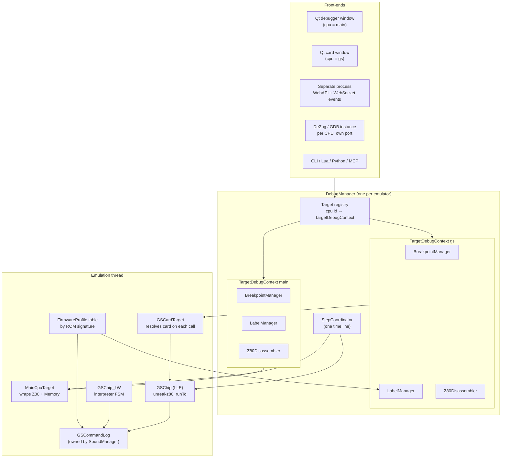
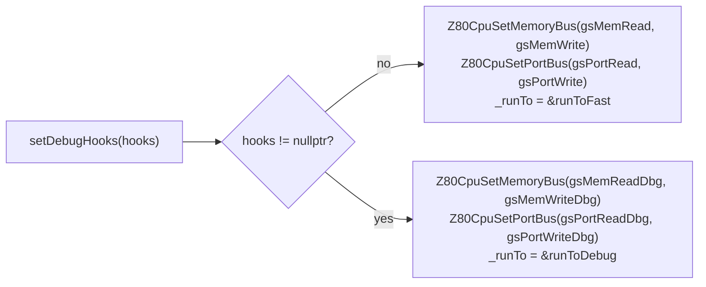
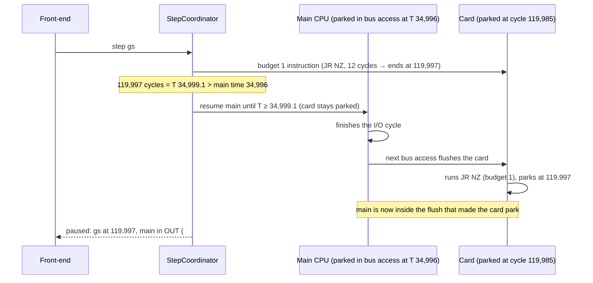
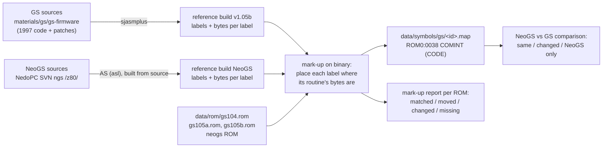
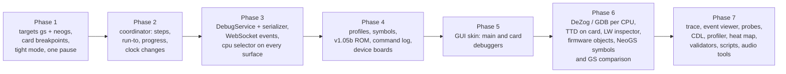

# Sound-card CPU debugging (General Sound, NeoGS) — design

- **Date:** 2026-09-27; revisions 2 and 3 on 2026-09-28
- **Status:** draft for review.
- **Implements:** [requirements.md](requirements.md) (revision 4).
- **Revision 3** adds §8A: the engine for the tracing and analysis tools
  (X1-X21), the audio tools (AU1-AU6) and the firmware metadata (M1-M12) of
  requirements §4.13-§4.15. It also adds these to the phases (§10).
- **Revision 2** does three things:
  - It aligns the design with NeoGS as built and merged into master (§3.1,
    §10).
  - It hands every front-end matter to the debugger model
    ([2026-09-28-debugger-model](../2026-09-28-debugger-model/)): §7 of this
    document now only records what the engine gives the model. The protocol
    (routes, commands, events, surface bindings) is
    [protocol.md](../2026-09-28-debugger-model/protocol.md).
  - It moves the NeoGS target from phase 6 into phases 1-2.
  Requirement IDs (T1, S4, F1c, ...) refer to that document. Terms (machine
  time, clock ratio, instruction progress, firmware profile, FSM) are defined
  in its §1.

## 0. Summary

Five pieces, each described in its own section:

1. **Debug targets (§3).** A small interface, `IDebugTarget`, describes one
   CPU: registers, side-effect-free memory access, memory map, clock. There are
   two implementations now (main Z80, GS card Z80) and a third later (NeoGS).
   `DebugManager` keeps, per target, its own breakpoint manager, label manager
   and disassembler. The main target keeps today's instances, so existing
   callers do not change.
2. **Card hooks (§4).** The card CPU (unreal-z80) gets debug variants of its
   bus callbacks and of its catch-up loop, swapped in only while card
   debugging is active. The card can stop only between its instructions;
   memory and port watchpoints stop right after the instruction that made the
   access.
3. **One time line (§5).** The rule is **the main CPU leads, the card
   follows.** Today the card follows lazily, up to a frame behind. While card
   debugging is active it follows **tightly**: it catches up at every main-CPU
   bus access, so it is never more than one main bus cycle behind. A stepping
   coordinator on the emulation thread executes all step and run requests for
   both CPUs. The main CPU's instruction progress is computed from the time it
   started its instruction and the opcode's T-state count.
4. **Firmware knowledge (§6).** Firmware profiles are data tables selected by
   ROM SHA-256. Symbols come from the firmware sources and are marked up and verified
   against the ROMs. The command log is a compact ring owned outside the card,
   so it survives an LLE ↔ LW switch.
5. **Front-ends (§7).** Every automation surface takes a CPU selector. A new
   event stream on the WebAPI WebSocket serves separate processes. The Qt card
   window, and a second DeZog or GDB instance per target, sit on the same
   target interface.

Delivery is in six phases (§10). Phase 1 gives card breakpoints and a
consistent pause.

## 1. What exists today (facts the design builds on)

Paths are relative to `core/src/` unless they start with another top-level
folder.

**Main-CPU debugger**

- `DebugManager` (`debugger/debugmanager.h:24-54`) is one per emulator. It
  owns one `BreakpointManager`, one `LabelManager`, one `Z80Disassembler`, the
  analyzers and the keyboard and mouse debug managers.
- Callers reach it through `ctx->pDebugManager->GetBreakpointsManager()` (60
  call sites), `Emulator::GetBreakpointManager()` (72), `GetLabelManager()`
  (44) and `GetDisassembler()` (21).
- `BreakpointManager`:
  - It is keyed by address, or by page plus address, with the key layout
    `[pageType:8][page:8][addr:16]` (`breakpointmanager.cpp:1402-1411`), and
    by port.
  - It has a hot-path filter, `_hotState`: `hasExec/Read/Write/PortIn/PortOut`
    plus a 64K `addressFlags[]` array.
  - Its only tie to the main machine is
    `_context->pMemory->MapZ80AddressToPhysicalPage` in
    `FindAddressBreakpoint(uint16_t)` (`:1477-1485`). An overload that takes
    the page explicitly already exists (`:1492`).
- `LabelManager`:
  - Lookup is keyed by the 16-bit address only (`labelmanager.h:19-58`), so
    there is one label per address. The bank is metadata.
  - `AddLabel` marks addresses below `#4000` as ROM, which is Spectrum-specific
    (`labelmanager.cpp:67-70`).
  - The `.map` parser accepts `ROM1:0000` / `RAM2:4000` page prefixes
    (`:543-606`).
- `Z80Disassembler` decodes from a byte buffer.
  - Its runtime helpers take a concrete `Memory*`:
    `disassembleSingleCommandWithRuntime`, `getNextInstructionAddress`,
    `getStepOverExclusionRanges`.
  - Label lookup is hard-wired to `_context->pDebugManager->GetLabelManager()`
    (`z80disasm.cpp:2052, 2905`).
  - Each opcode record carries its T-states: `t`, `met_t`, `notmet_t`
    (`z80disasm.h:21-28`).
- **Pause sequence.** Every breakpoint call site runs the same inline code:
  `Pause()`, then `Post(NC_EXECUTION_BREAKPOINT, BreakpointTriggeredPayload)`,
  then `WaitWhilePaused()`. This blocks the emulation thread where it stands.
  - For execute breakpoints that is the instruction start.
  - For memory and port breakpoints it is inside the bus callback, in the
    middle of the instruction (`z80.cpp:277-294`, `memory.cpp:295-312`).
  - The payload has `emulatorId`, `address` and `hidden`, but no CPU field
    (`notifications.h:313-338`).
- **Stepping.**
  - `RunSingleCPUCycle` / `RunNCPUCycles` run `ExecuteStep` on the *calling*
    thread (`emulator.cpp:2178-2247`).
  - Step over uses a hidden execute breakpoint and a one-shot observer
    (`:2649-2795`). Step out uses `RunUntilCondition` (`:2836-2881`).
- **Cost gating.** The main Z80 swaps between fast and debug memory
  interfaces (`core.cpp:574-582, 768-783`). Feature flags feed cached booleans
  (`memory.cpp:95-106, 1820-1830`). `breakpoints` auto-enables `debugmode`
  (`featuremanager.cpp:193-213`).

**GS card (LLE)**

- The card CPU is `Z80CPU*` from the vendored unreal-z80. Its static bus
  callbacks are `gsMemRead`, `gsMemWrite`, `gsPortRead`, `gsPortWrite` and
  `gsIntRead` (`soundchip_gs.h:216-221`), set through `Z80CpuSetMemoryBus` /
  `Z80CpuSetPortBus` (`z80cpu.h:339-342`).
- `Z80CpuStep` runs exactly one instruction and returns its cycles. A
  redundant DD/FD prefix is a step of its own. Callbacks cannot stop a step.
  `Z80CpuTstates` is the cycle counter, published before each bus callback.
  `Z80CpuInstructionPc` is the address of the current instruction's first
  byte (`z80cpu.h:139-200`).
- **Catch-up.**
  - `flush()` (`soundchip_gs.cpp:277`) computes
    `target = frameStartGs + llround((AudioTstate(z80->t) - frameStartZx) * gsCyclesPerZxTact())`
    and calls `runTo(target)` (`:288`).
  - `runTo`'s loop (`:293-353`) delivers the pending NMI, then the pending
    INT, then advances the 320-cycle interrupt quantum, then calls
    `Z80CpuStep`. It has no early exit.
  - Callers: host port IN/OUT on `#B3`/`#BB`/`#33` (`:505-549`), the
    automation actions (`:612-641`), and frame end (`:404`).
- **Main CPU T during a port access.** The port callback runs inside the
  instruction, with `z80->t` already at the I/O cycle. For example,
  `OUT (n),A` is `cputact(1); out(); cputact(3)` (`op_noprefix.cpp:1235`).
- **Memory map** (`applyBanking`, `:879-906`):
  - `#0000-#3FFF`: ROM page 0.
  - `#4000-#7FFF`: RAM page 3. Reads in `#6000-#7FFF` are DAC fetches.
  - `#8000-#FFFF`: MPAG 0 maps ROM (32K); MPAG V≥1 maps RAM pair
    `(V-1) & mask`.
  - RAM is 128-512K.
- **Mailbox** (`gsmailbox.h`): status bit 7 is the data flip-flop, bit 0 the
  command flip-flop.
  - Host side: `onHostDataWrite` / `onHostCommandWrite` (`:562, 576`); the
    latter already tracks module-upload commands.
  - Card side: `gsIn` / `gsOut` (`:827, 845`).
- **Port trace** (`gsporttrace.h`): a 65,536-entry ring of 24-byte events.
  `start/stop/pause/resume/clear` are exposed through CLI, WebAPI, Lua and
  Python. Checking whether capture is on costs two atomic loads.
- **LW card**: the interpreter state and a mirror of the firmware variables
  live in `soundchip_gslw.h:209-255`. Entry points are `acceptHostCommand`,
  `acceptHostData`, `dispatchCommand` and `postReply`.
- **Personality switch** (`soundmanager.cpp:1311, 1411`) deletes the card
  object and creates a new one. **Nothing may cache the card pointer.**

**Front-ends**

- There is no shared automation command layer. CLI, WebAPI, Lua, Python and
  GDB call the core directly; MCP calls WebAPI over HTTP.
  - MCP already uses the argument name `target` for the emulator instance
    (`mcp/src/target-resolver.h`).
- The WebAPI WebSocket (`/api/v1/websocket`) is a stub. It sends a welcome
  string and echoes messages. `broadcastEmulatorData` has no callers, and
  there is no subscription protocol and no event types.
- There are no `/debug*` WebAPI routes; the debug routes sit at the emulator
  level (`/step`, `/registers`, `/breakpoints`, `/disasm`, …), and none takes
  a CPU.
- DeZog talks to an abstract interface, `dzrp::IDebugInterface`
  (`dzrpserver.h:17-118`). GDB is wired to `EmulatorContext` directly, with a
  single fixed thread.
- The Qt `DebuggerWindow` is a single instance (`mainwindow.cpp:214`). Its
  widgets reach into `Emulator` / `Memory` / `Z80` directly. Its breakpoint,
  label and CPU-step handlers are not subscribed (`debuggerwindow.cpp:215-223`);
  it learns about breakpoint hits only from the Paused state change. It is
  not the reference for the new UI (requirements rev. 3, §6).

## 2. Architecture overview



## 3. Debug targets

### 3.1 The target interface

```cpp
// debugger/targets/debugtarget.h
enum class DebugCpuId : uint8_t { Main = 0, GS = 1, NeoGS = 2 };

struct DebugMemoryWindow            // one address window of the CPU
{
    uint16_t start, size;           // e.g. #8000, #8000
    MemoryBankModeEnum kind;        // ROM / RAM / FLASH (FLASH added)
    uint16_t page;                  // page mapped now
    bool writable;
};

struct DebugPageSpace               // everything the CPU can page in
{
    MemoryBankModeEnum kind;
    uint16_t pageCount;             // GS RAM: 8..32 (16K pages); NeoGS RAM up to 256
    uint32_t pageSize;              // 16K
};

class IDebugTarget
{
public:
    virtual DebugCpuId id() const = 0;
    virtual const char* name() const = 0;               // "main", "gs", "neogs"
    virtual bool available() const = 0;                 // gs: LLE card fitted
    virtual double clockHz() const = 0;                 // current clock, S9
    virtual uint64_t cycles() const = 0;                // monotonic cycle count

    virtual Z80Registers registers() const = 0;         // plain struct (z80.h:20)
    virtual void setRegisters(const Z80Registers&) = 0; // only while paused
    virtual uint8_t boundaryState() const = 0;          // int shadow, pending prefix

    virtual uint8_t peek(uint16_t addr) const = 0;      // no side effects (no DAC fetch)
    virtual void poke(uint16_t addr, uint8_t v) = 0;    // respects ROM read-only unless forced
    virtual uint8_t peekPage(MemoryBankModeEnum, uint16_t page, uint32_t offset) const = 0;
    virtual void pokePage(MemoryBankModeEnum, uint16_t page, uint32_t offset, uint8_t) = 0;

    virtual size_t windows(DebugMemoryWindow* out, size_t max) const = 0;
    virtual size_t pageSpaces(DebugPageSpace* out, size_t max) const = 0;
    virtual MemoryPageDescriptor mapAddress(uint16_t addr) const = 0;  // for page-tied BP/labels
};
```

- **`MainCpuTarget`** wraps `pCore->GetZ80()` and `pMemory`. `mapAddress`
  calls `Memory::MapZ80AddressToPhysicalPage`.
- **`GSCardTarget`** holds only the `EmulatorContext*`. Every call resolves
  `ctx->pSoundManager->getGeneralSound()` and checks
  `hasCoprocessor()`, so a personality switch never leaves a stale pointer.
  It calls a new debug access interface on the card:

```cpp
// gs/generalsoundcard.h additions (LLE implements; LW returns "no CPU")
struct GSDebugAccess
{
    virtual Z80CpuRegisters cpuRegisters() const = 0;
    virtual void setCpuRegisters(const Z80CpuRegisters&) = 0;
    virtual uint8_t peek(uint16_t) const = 0;         // _bankR lookup, no dacFetch
    virtual void poke(uint16_t, uint8_t) = 0;
    virtual uint8_t* romData(); virtual uint8_t* ramData(); virtual size_t ramSize() const = 0;
    virtual uint8_t mpag() const = 0;
    virtual uint64_t cardTime() const = 0;            // in the card's own unit; GS: totalGsCycles()
    virtual double unitsPerSecond() const = 0;        // GS 12e6 (one cycle); NeoGS 120e6 (base tick)
    virtual void setDebugHooks(GSDebugHooks*) = 0;    // §4; nullptr = off
    // NeoGS additions (neogs-tdd.md §7.2); GS answers from its fixed map
    virtual uint8_t pageRegister(int window) const;   // page byte of window 0-3
    virtual bool windowIsFlash(int window) const;     // ROM mode shows flash in windows 0/2/3
    virtual uint8_t* flashData();                     // NeoGS 512 KB flash; GS: nullptr
};
virtual GSDebugAccess* debugAccess() { return nullptr; }   // GeneralSoundCard
```

**GS memory map through the interface:**

| Window | Kind | Page |
|---|---|---|
| `#0000-#3FFF` | ROM | 0 |
| `#4000-#7FFF` | RAM | 1, fixed: the upper half of MPAG 1 (§11 risk 7) |
| `#8000-#BFFF` | ROM or RAM | MPAG 0: ROM 0; MPAG V: RAM `2·((V-1)&mask)` |
| `#C000-#FFFF` | ROM or RAM | MPAG 0: ROM 1; MPAG V: RAM `2·((V-1)&mask)+1` |

- The target never hard-codes this table: `windows()` and `mapAddress()`
  read the card's live bank pointers (`_bankR` / `_bankW` against `_rom` /
  `_ram`). The debugger shows whatever the emulation does, so a correction of
  the emulation's map (§11 risk 7) needs no debugger change.
- GS RAM is 128-512 KB = 8-32 pages of 16K. NeoGS has up to 4 MB = 256 pages
  (current FPGA; the fpgaD revision in our materials addresses 2 MB), which
  still fits the 8-bit page field. NeoGS flash is a new `MemoryBankModeEnum`
  value.
- **NeoGS already has most of this access** (as built, 2026-09-28):
  - `SoundChip_NeoGS::peek` / `poke` (no side effects);
  - `pageRegister(w)`, `windowIsFlash(w)`;
  - `memory()` (`NeoGSMemory`: `page`, `isFlash`, `physical`, `ram`) and
    `flash()`;
  - `cardTicks()`, `cardClockHz()` and `neogsState()`.

  The NeoGS `GSDebugAccess` is therefore mostly a thin adapter. What is
  still missing:
  - register read and write through `Z80CpuGetRegisters` /
    `Z80CpuSetRegisters` on the private `_cpu`;
  - `setDebugHooks`, and the debug variant of the runner loop (the
    `GSCardRunner` hooks are templates, not virtual, so the debug loop is a
    second instantiation).

  The classic GS needs `poke`, page access and the full register file.
- **NeoGS windows are all switchable.** In its current FPGA, each of the four
  windows has its own 8-bit page register (ports `#20`-`#23`, `ports.v:159-162,
  416-442`; reset values PG0 = 0, PG1 = 3). `MPAG` / `MPAGEX` write PG2 / PG3,
  and `GSCFG0` bit NOROM chooses ROM or RAM (`memmap.v`). The window table is
  therefore four rows of `{kind, page, writable}` for any card, never a GS
  special case.

**Pages are always 16K** (decided in review; the Spectrum standard). The
MPAG register selects 32K pairs, but the debugger never shows pairs: MPAG 3
appears as RAM pages 4 and 5. Symbol files, breakpoints, memory views and
automation all use 16K page numbers.

**The same page in two windows.** With MPAG 0, ROM page 0 is visible at both
`#0000` and `#8000`. A page-tied breakpoint or label therefore matches by
**page + offset within the page**, not by CPU address. Both
`BreakpointDescriptor` and `Label` already carry `bankOffset`. So
`ROM0:0038` also matches execution at `#8038` while MPAG is 0. Address-only
breakpoints (no page) keep matching by CPU address, as on the main CPU.

### 3.2 Per-target debug context

```cpp
// debugger/debugmanager.h
struct TargetDebugContext
{
    std::unique_ptr<IDebugTarget> target;
    std::unique_ptr<BreakpointManager> breakpoints;
    std::unique_ptr<LabelManager> labels;
    std::unique_ptr<Z80Disassembler> disassembler;
};

class DebugManager
{
    // existing accessors unchanged: they return the Main context's objects
    BreakpointManager* GetBreakpointsManager();          // == Target(Main).breakpoints
    ...
    TargetDebugContext* GetTarget(DebugCpuId);            // nullptr if not available
    TargetDebugContext* GetTarget(std::string_view name); // "main" / "gs" / "neogs"
    size_t ListTargets(DebugCpuId* out, size_t max) const;
    StepCoordinator& Coordinator();
};
```

- **Compatibility.** The 60 + 72 + 44 + 21 existing call sites keep working:
  the old accessors return the main target's objects. Only code that should
  become CPU-aware changes: automation, Qt, DeZog, GDB.
- **Lifetime (T4).** The `gs` context is created the first time any
  front-end asks for it, and it stays alive for the emulator's lifetime.
  - `available()` follows the card: false while the card is LW or absent.
  - Its breakpoints and labels stay in memory while it is unavailable, and
    fire again after a switch back to LLE.
  - The debug hooks (§4) are re-attached on every card creation. For this,
    `SoundManager` calls `DebugManager::OnCardCreated()` after
    `createGeneralSoundCard` and after a switch.

### 3.3 Changes to the managers

**`BreakpointManager`**

- New constructor argument: `IDebugTarget* target`.
- `FindAddressBreakpoint(uint16_t)` uses `target->mapAddress(addr)` in place
  of `_context->pMemory`, then calls the existing page overload.
- **The page-tied key changes to the physical address.** Today it is
  `[pageType:8][page:8][z80address:16]` (`breakpointmanager.cpp:1406-1410`,
  `:1501-1502`), i.e. page plus *CPU* address. A breakpoint on ROM page 0 at
  `#0038` therefore misses when the same byte executes at `#8038`. The new key
  is `[pageType:8][page:8][offset:16]` with `offset = addr & #3FFF` (taken from
  `MemoryPageDescriptor::offset` / `BreakpointDescriptor::bankOffset`, which
  both exist). Address-only breakpoints keep the `0xFFFF'0000 | addr` key.
  - This fixes the same miss on the main CPU: on a 128K machine RAM page 5 is
    visible at `#4000` and, when paged in, at `#C000`; page 2 at `#8000` and
    `#C000`.
  - Existing page-tied breakpoints are created with a CPU address. On add, the
    manager converts it to the offset (`addr & #3FFF`). Saved breakpoint
    files keep their format; the conversion happens on load.
  - The hot filter `addressFlags[]` is indexed by CPU address. A page-tied
    breakpoint marks the CPU addresses of *every* window where its page can
    appear (four entries at most), so the filter stays a single lookup.
- The `_DEBUG` log line in `HandlePCChange` uses the target too.
- Descriptors, groups and the Handle* entry points are per instance already.

**`LabelManager`** (needed for L2: one address, different names per page)

- Page-tied labels are indexed by physical address, `(bankType, bank,
  bankOffset)`, in a new map. Address-only labels stay in
  `_labelsByZ80Address`. New lookup `GetLabelByAddress(addr, const
  MemoryPageDescriptor&)`:
  - It returns the page-tied label at the page and offset the CPU address maps
    to now, so a ROM 0 label shows at `#0038` and at `#8038`.
  - Failing that, it returns an address-only label.
  - `.map` entries such as `ROM1:C000` store page 1 offset `#0000`: the offset
    is `address & #3FFF`, whatever window the file wrote.
- The old `GetLabelByAddress(addr)` keeps its behaviour for the main target:
  the first label at that address.
- The "below `#4000` is ROM" guess in `AddLabel` moves to the target: labels
  added without a page take `target->mapAddress(addr)` when they are added
  interactively. File imports keep what the file says.
- `.map` files with `ROM1:0000` / `RAM5:8000` prefixes load as they do today
  (L3, "same format as now").

**`Z80Disassembler`**

- The constructor takes `TargetDebugContext*` (labels and target).
- The `Memory*` parameters of the runtime helpers become `const IDebugTarget&`.
  Their body reads through `peek` / `mapAddress`.
- The main-CPU overloads that take `Memory*` stay as thin wrappers during
  migration, then go.
- `Z80ControlFlowDecoder` gets the same change.
- New helper `instructionTiming(const DecodedInstruction&)` returns
  `{t, met_t, notmet_t}` from the opcode table. Instruction progress (§5.4)
  uses it.

## 4. Card hooks

### 4.1 Two loops, two callback sets

The zero-cost requirement (P1) is met the way the main CPU meets it: the
debug path is a separate path, chosen by a swap, not by a branch in the hot
path.



- **`runToFast`** is today's `runTo`, unchanged.
- **`runToDebug`** is the same loop with three additions:
  1. Before each `Z80CpuStep` it asks the hooks whether to stop:
     - an execute breakpoint at the current PC and page (via the `gs`
       `BreakpointManager::HandlePCChange`, with the page from
       `GSCardTarget::mapAddress`);
     - a pending watchpoint hit from the last instruction;
     - a step budget from the coordinator (§5.3);
     - a time limit from the coordinator.
  2. After an interrupt or NMI is accepted, it reports the card event for B2.
  3. When a stop is due, it calls `hooks->park(reason)`. Park returns a
     command (§5.3), and the loop then continues, runs one more step, or
     returns early with the card behind its target.
- **Debug bus callbacks** do the normal work, then:
  - call `HandleMemoryRead/Write` and `HandlePortIn/Out` on the `gs`
    breakpoint manager, gated by its `_hotState` flags;
  - record a hit as *pending*, with address, value and PC.

  They never park. The library has no way to stop mid-instruction, and a
  card instruction is at most 23 cycles (6.7 main T). So the hit is reported
  at the next instruction boundary, before the next instruction: "write
  `#4100` ← `#12` by instruction at `#0C30`". This is how most hardware
  watchpoints work. It keeps the card on an instruction boundary (S2).
  - It differs from the main CPU, which parks inside the access. The UI
    states which one applies.
- **Card events (B2):**
  - INT and NMI acceptance: `runToDebug`, as above.
  - Reset: `resetCard`.
  - Page switch: `gsOut` port `#00`, with the value.

  They go into the `gs` breakpoint manager as a new breakpoint type,
  `BRK_EVENT`, with an event kind and an optional value filter. They use the
  same Handle* shape, `HandleEvent(kind, value)`.
- **Protocol breakpoints (B3)** use the same `BRK_EVENT` type, with kinds
  `HostCommandWrite`, `HostDataWrite`, `HostReplyRead`, `CardCommandRead`,
  `CardDataRead` and `CardReplyWrite`, plus an optional command filter.
  - Host-side kinds live in the **main** breakpoint manager and fire in the
    main CPU's port callback, which already parks mid-instruction.
  - Card-side kinds live in the `gs` manager and fire at the card's next
    instruction boundary, like the watchpoints.

### 4.2 Why not the paged bus or the contention hook

unreal-z80 offers page tables (`Z80CpuAttachPageTables`) and an M1 contention
hook (`Z80CpuSetContendFn`). They were considered and not used:

- The GS card uses the plain callback bus, and switching it to page tables is
  a performance change unrelated to debugging.
- The contention hook fires on every opcode fetch and costs more than a check
  between steps.

A check between steps sees every instruction start, because each step ends on
a boundary, and it costs nothing when the fast loop is selected.

## 5. One time line

### 5.1 The rule: main leads, card follows

- The card and the main CPU affect each other only through the host ports
  (`#B3`, `#BB`, `#33`). Before every such access the card is brought up to
  the access time (`flush`). So the order of everything the two CPUs can see
  of each other is exact, however far behind the card otherwise runs. That is
  why lazy catch-up is correct today.
- The debugger keeps that rule: **the card never runs ahead of the main CPU.**
  If the card ran ahead, a main-CPU `OUT` to the card that belongs earlier in
  time would reach a card that has already polled the port and moved on. The
  results would change (S8).
- To move the card forward past the main CPU's position, the coordinator
  first moves the main CPU (§5.3).

What changes while card debugging is active is **how far behind** the card
may be:

| Mode | When | Card behind main by at most | Where the card catches up |
|---|---|---|---|
| Lazy (today) | no card debugging | one frame | host port access, frame end |
| Tight | any card breakpoint, card step or card run-to active; or a `gs` pause being shown | one main bus cycle (3-6 T) | additionally at every main-CPU memory access and instruction start |

**Worked example, the §2 case of the requirements.** A card breakpoint sits
at cycle 60,000, which is main T 17,500.

- **Lazy:** the card reaches cycle 60,000 only in the burst at main T 34,996.
  The main CPU would be shown 17,496 T in the future (S4 violated).
- **Tight:** the card catches up at every main bus access. It reaches cycle
  60,000 in the flush at the first main memory access at or after T 17,500,
  say T 17,502. The main CPU parks there, inside its current instruction.

### 5.2 Tight mode: where the flushes go

- The main CPU already has a debug memory interface (`DbgMemIf`), active
  whenever `debugmode` is on. Tight mode turns on `debugmode` in the same way
  `breakpoints` does.
- It adds one cached check to `Memory::MemoryReadDebug` / `MemoryWriteDebug`
  and to `Z80::RunInstructionStartHooks`:
  `if (_cardTight) gs->flush();`.
- `flush()` already returns at once when the card is caught up. Its cost is
  one `llround` of a double, called about 3 times per main instruction.
- The fast memory interface is untouched, so P1 holds: no card debugging
  means no tight flag, which means the fast path as today.
- Measuring the tight-mode cost is part of phase 1 (P4). An expected order of
  magnitude: the main CPU makes about 20,000 memory accesses per frame, which
  means 20,000 short calls against a card burst of about 25,000 instructions.

**When tight mode is on:**

- `gs` breakpoints exist and are enabled: `BreakpointManager::_hotState`
  reports any flag.
- A coordinator command targets the card (§5.3).
- The machine is paused with the `gs` target selected in any front-end.

When all three are false, tight mode is off. The card then simply stays
behind until the next port access or frame end, as today.

### 5.3 The stepping coordinator

All run and step requests from all front-ends go to one object,
`StepCoordinator`. It executes them **on the emulation thread**, at the park
points. This also removes a latent hazard: today `RunSingleCPUCycle` runs
`ExecuteStep` on the calling thread even while the emulation thread is
parked inside a bus callback.

**Park points.** These are the places where the emulation thread can stop
and take commands:

| Park point | CPU state there |
|---|---|
| Main instruction start (`RunInstructionStartHooks`) | main on a boundary |
| Main bus callback: memory breakpoint, port breakpoint, protocol breakpoint, tight-mode flush that made the card park | main inside an instruction |
| Card `runToDebug`, between steps | card on a boundary |

- A park calls `StepCoordinator::park(where)`. That replaces today's
  `Pause(); Post(); WaitWhilePaused();` sequence at every call site, with the
  same behaviour when no card is involved.
- The coordinator publishes the pause (event with CPU id, §7.2). It then
  waits for a command and returns an action to the park point.

**Commands and what the parked code does with them:**

| Command | Card parked in `runToDebug` | Main parked |
|---|---|---|
| Continue | return from park; loops continue normally | same |
| Step card 1 instruction | run one `Z80CpuStep` if the card's next instruction ends at or before main's current time. Otherwise, first let main run to its next park point past that time (card still parked), then step | set a main "stop after time X" limit and card budget 1; resume main until the card catches up and parks |
| Step main 1 instruction | return from the card park with "stop main after its current instruction"; main finishes it (the card follows in tight mode, bounded by the new main time) and parks at the next instruction start | as today (`StepInstruction`), but executed here |
| Step over / out, run to cursor (either CPU) | expressed as a hidden breakpoint (over, cursor) or a condition (out) on the chosen CPU, followed by Continue | same |
| Run to card cycle N / main T N / next frame / next card INT | set time limits; Continue; the limit parks the CPU that reaches it | same |

**Walk-through: stepping the card while main is inside `OUT (#B3),A`.**



Main is parked inside a flush, which happens at a main bus access, not at a
precise T. So main's clock may be slightly past the card's time. That
difference is the **gap** in S2, and it is shown.

### 5.4 Instruction progress for the main CPU

- **Start T.** A new field `Z80::instrStartTT` (same scale as `tt`) is set
  next to `m1_pc` in `RecordInstructionStart`, which runs once per
  instruction start already (commit `1bce58b7`). It costs one store in the
  debug path only.
- **Shown moment.** When the card is the target that stopped, the moment
  shown is the card's time converted to main T:
  `tShown = frameStartZx + (cardTime - frameStartCard) / unitsPerZxTact`.
  This is the inverse of `flush`'s formula, so conversion is exact both ways.
  Each card uses its own unit (GS: 12 MHz cycles, NeoGS: 120 MHz base ticks,
  `neogs-tdd.md` §5.2), so the formula holds across NeoGS clock changes.
- **Progress.** Elapsed = `tShown - instrStartT`. Total = the opcode's T from
  `Z80Disassembler::instructionTiming`, decoded at `m1_pc`. For a conditional
  instruction whose condition is not yet decided, both totals are shown
  (`met_t` / `notmet_t`).
  - Contention (48K / 128K) makes the real total longer than the table's. The
    progress then uses the table total plus the contention counted so far
    (`Z80::contentionAccumulated`, if exposed; otherwise the table total, and
    the note "contended").
- **Bus cycle.** The UI turns elapsed T into the bus cycle under way: opcode
  fetch, operand read, memory write, I/O. It uses a per-opcode M-cycle table
  added to the disassembler's opcode records (`mcycles`, e.g. `OUT (n),A` is
  `{4 OCF, 3 OD, 4 IO}`).
- **Payload.**

  ```cpp
  struct CpuTimePosition
  {
      DebugCpuId cpu;
      uint64_t cycles;          // on its own clock
      bool onBoundary;
      uint16_t instrPc;         // == m1_pc when inside
      double elapsedT, totalT, totalTAlt;  // alt for conditional
      uint8_t busCycleIndex;    // index into the opcode's mcycles
      double gapT;              // how far its real clock is past the shown moment
  };
  ```

### 5.5 Clock ratio changes (S9)

- `flush` already reads `gsCyclesPerZxTact()` at each call, so a ratio change
  applies from the next flush. `AudioTstate` removes hardware turbo, and host
  speed cancels out.
- NeoGS switches its clock between 10, 12, 20 and 24 MHz. No re-basing is
  needed: the shared card runner counts **base ticks** at 120 MHz, and every
  card clock is a whole number of ticks per cycle (`neogs-tdd.md` §5.2). A
  clock change only changes the tick cost of the following instructions. The
  inverse conversion (§5.4) works in ticks and divides by the tick cost in
  effect at that point.

### 5.6 Determinism check (S8)

Tight mode only changes *when* the card runs, never *what* it runs. Every
host-port access is still preceded by a flush to the exact access time. The
card-side order of events is identical in lazy and tight mode, and the test
suite asserts it (§9).

## 6. Firmware knowledge

### 6.1 Firmware profiles (F2, L4)

```cpp
// emulator/sound/chips/gs/firmware/firmwareprofile.h
enum class GSParamKind : uint8_t { Byte, Word, Slot, Volume, Note, Position };
enum class GSTransferKind : uint8_t { None, ModuleUpload, SampleUpload, Stream };

struct GSCommandInfo
{
    const char* name;            // "load module"
    uint8_t paramCount;          // data bytes the firmware reads before running it
    GSParamKind params[4];
    bool hasReply;
    const char* replyMeaning;    // "slot number"
    GSTransferKind transfer;
};

struct GSVariableInfo { const char* name; uint16_t addr; uint8_t size; const char* meaning; };

struct GSFirmwareProfile
{
    const char* sha256;          // hex SHA-256 of the 32K ROM image (SignatureCache)
    const char* sha256Pages[2];  // hex SHA-256 of each 16K ROM page
    const char* id;              // "gs105a"
    const char* title;           // "General Sound firmware v1.05a"
    GSCommandInfo commands[256]; // index = command number; name == nullptr → unknown
    const GSVariableInfo* variables; size_t variableCount;
    const char* symbolFile;      // "symbols/gs/gs105a.map"
    uint16_t comtab, comtabh;    // command table addresses, for the self-check
};

const GSFirmwareProfile* FindGSFirmwareProfile(const std::string& sha256);
```

- **Built in (phase 3).** There are tables for v1.04, v1.05a and v1.05b in
  `gs/firmware/profile_gs10x.cpp`. They are written from the firmware sources
  (`COMTAB`, `COMTABH`), not from the guide.
- **Signature: SHA-256, as elsewhere in unreal-ng.**
  - The card computes the digests once in `loadROM` with
    `SignatureCache::Sha256Hex` (`common/signaturecache.h`): one for the 32K
    image, one per 16K page. The main machine's `ROM` class names its pages
    the same way.
  - The card exposes them as `firmwareSha256()` and `firmwarePageSha256(i)`.
    The profile is looked up by the image digest.
  - The 16K page digests identify a ROM that has been re-paired from pages
    of known versions, and a page shown in the memory view.
  - The GS and NeoGS ROM digests are also added to the known-ROM table in
    `ROM` (`rom.cpp`), so every place that shows ROM titles names them. That
    table covers host ROMs only today; card images never pass through it. The
    NeoGS card keeps its own digest table (`neogsflashimages.h`,
    `neogs-tdd.md` §4.1), and the `rom.cpp` entries are generated from it and
    from the GS list, not maintained twice.
- **From files (later).** The same structure is read from
  `data/firmware/gs/<id>.json`, selected by SHA-256. Built-in tables remain
  as the fallback. The file format is decided when this is implemented.
- **Self-check test.** For each profile, read the handler address table from
  the ROM at `comtab`. Resolve every handler address to a label through the
  symbol file. Assert the profile names a command for every entry whose
  handler is not the "unknown command" stub. A table typed by hand therefore
  cannot drift from the ROM.

### 6.2 Firmware symbols (L3, L5, R1, N5)

The binaries are the truth; the sources supply the names. For each shipped
ROM, symbols are marked up directly on the binary using what the sources say
about each routine. No version needs to be reproduced from sources
byte-for-byte, except v1.05b, which R1 adds as a ROM built from sources.



- **Tool.** `tools/gsfirmware/markup_symbols.py`, with `sjasmplus` as a
  build-time tool. The firmware builds with it (`make_rom.bat`); it is not
  installed on the development machine yet.
  - The generated `.map` files and reports are committed. Normal builds
    need neither the script nor `sjasmplus`.
  - CI reruns the script and fails if the committed output differs.
- **Mark-up steps, per ROM:**
  1. Assemble the reference build. For each label, record its address and
     the bytes of its routine or data (up to the next label).
  2. Place every label on the binary:
     - at the same address, if the bytes match there. The readme says the
       patches keep routines in place, so this is the common case;
     - otherwise, at the unique place where the bytes match (moved);
     - otherwise, at the same address, if most of the bytes match (changed).
       The report lists the differing ranges; these are the patch areas;
     - otherwise, not at all (missing), listed in the report.
  3. Write the `.map` and the report. The report is reviewed once per ROM,
     and the "changed" entries are checked against the patch notes
     (`firmware/gs105a.txt`, `gs105b.txt`, `firmware/patch/*.a80`).
- **Verification (L3):** for every label in a shipped `.map`, the ROM bytes at
  that label equal the reference bytes, except the ranges the report lists as
  changed. A test checks this on every build.
- **Format.** Symbols use the existing `.map` format, with a 16K page prefix
  per label (`ROM0:0038`, `ROM1:C000`), so that one file per firmware covers
  all pages. The existing parser reads it (`labelmanager.cpp:543-606`).
- **v1.05b ROM (R1).** The reference build is v1.05b. The script writes it to
  `data/rom/gs105b.rom`, adds its SHA-256 to the known-ROM table, and CI
  checks that the build and the committed file are identical. Config:
  `GS=rom/gs105b.rom`.
- **User labels (L5)** are saved separately in the user settings folder, as
  `gs-<sha256>.map`, and loaded after the shipped file.
- **NeoGS (N5).**
  - The sources are imported from the NedoPC SVN into
    `materials/neogs/firmware/`, with a README giving the revision.
  - The script marks up the NeoGS ROM the same way.
  - A comparison step matches NeoGS routines against the GS v1.05a mark-up
    by bytes, and writes `materials/neogs/firmware/COMPARISON.md`: same as
    GS, changed from GS, NeoGS only.

### 6.3 The command log (F1-F1c, F3, F4, W1-W4)

**Ownership.** `GSCommandLog` is owned by `SoundManager`, not by the card.
The card gets a pointer at creation and after a switch, so the log survives
LLE ↔ LW switches (W1), and both cards feed the same log.

**Entry (32 bytes):**

```cpp
struct GSCommandLogEntry
{
    uint64_t cardCycle;       // machine time on the card clock (LW: its virtual clock)
    uint32_t frame;
    uint32_t mainT;
    uint16_t mainPc;          // main CPU instruction that did the IN/OUT (m1_pc)
    uint8_t kind;             // Command, Param, Reply, Block, Anomaly, CardTook, Marker
    uint8_t command;          // command number this entry belongs to
    uint8_t value;            // param / reply byte; anomaly code
    uint8_t destKind;         // Block: RAM / unknown
    uint16_t destAddr;        // Block: start address in the card window
    uint32_t count;           // Block: bytes; Anomaly: extra info
    uint8_t destPageFirst, destPageLast;
    uint8_t flags;            // truncated, dropped-before, ...
    uint8_t reserved[1];
};
static_assert(sizeof(GSCommandLogEntry) == 32);
```

- **Capacity.** The ring holds 65,536 entries (2 MB). F1c's sizing gives
  about 30,000 entries for 5 minutes at 2 commands per frame, so this is
  twice that. The entry count and memory use are listed in the WebAPI
  status.
- **Feeds.**

| Event | LLE hook | LW hook |
|---|---|---|
| Host writes command | `onHostCommandWrite` | `acceptHostCommand` |
| Host writes data | `onHostDataWrite` | `acceptHostData` |
| Host reads reply | `portDeviceInMethod` `#B3` | same |
| Card takes command | `gsIn` port `#01` (debug + log-on only) | interpreter step |
| Card takes data | `gsIn` port `#02` | `consumeParam` |
| Card writes reply | `gsOut` port `#03` | `postReply` |

- **Decoder.** A small state machine in the log, per the profile (the FSM of
  requirements §4.11):
  - After a command it expects `paramCount` data bytes (`Param` entries).
  - After a command whose transfer is not `None`, it switches to block mode.
    Data bytes are only counted, and one `Block` entry is written when the
    transfer ends: the next command, or the terminator the profile names.
  - The block entry takes its destination from the firmware state after the
    transfer: the module table variables named in the profile (LLE), or the
    `_store` bookkeeping (LW). When unknown, it is marked unknown.
  - The existing module-upload capture in `onHostCommandWrite` already tracks
    `#30`/`#D2`/`#31`. The decoder reuses its boundaries, so the two cannot
    disagree.
- **Anomalies (F4)**, each written as an `Anomaly` entry:
  - Host writes data while status bit 7 says the previous byte was not taken:
    `DataOverwritten`, with the lost byte.
  - Host writes a command while bit 0 is still set: `CommandOverwritten`.
  - Host reads `#B3` when bit 7 says no reply is there: `ReplyNotReady`.
  - An upload makes no progress for N frames (default 50): `TransferStalled`.
- **Activation (F1b).** `start/stop/clear` work like the port trace, through
  the same five surfaces. An option in the debugger settings starts the log
  when a debugger front-end attaches.
  - Gating is one atomic load in the host port handlers. They already call
    `flush`, which costs far more.
  - The card-side hooks are only installed in the debug callbacks (§4.1). When
    the log is on but card debugging is off, `CardTook` entries are derived
    from status-bit changes seen at the next host access instead.
- **Retention (F1c).** When the ring wraps, the oldest entries are dropped and
  a `droppedCount` counter increases, which the log header shows. Whether the
  log becomes always-on is decided after the P2 measurement in phase 3. The
  design allows it either way: the cost per port access is fixed.
- **TTD (D3).** The log is not part of the checkpoint. On a TTD seek, entries
  with a time after the seek target are cut off, using the per-entry frame
  and cycle. Replay forward regenerates them, because the hooks fire during
  replay as well.

### 6.4 Protocol state and firmware objects (F3, F5, W2, W3)

A common read-only structure is filled by either card:

```cpp
struct GSFirmwareStateView
{
    bool valid; const char* source;     // "firmware variables (gs105a)" / "LW interpreter"
    uint8_t cmdInProgress; uint8_t paramsExpected, paramsReceived;
    GSTransferKind transfer; uint32_t transferDone, transferTotal;
    struct Object { uint8_t slot; bool isModule; uint32_t size; uint8_t page; uint16_t addr; };
    Object objects[32]; uint8_t objectCount;
    uint8_t songPos, row, speed; bool playing; uint8_t volumes[4]; uint8_t masterVolume;
};
```

- **LLE** reads card RAM at the profile's variable addresses through
  `GSDebugAccess::peek`.
- **LW** copies its mirror fields (`_curMod`, `_cntMod`, `_modVol`, ...,
  `soundchip_gslw.h:229`) and its interpreter state. The LW mirror uses the
  firmware's variable names, so the field mapping is one-to-one.
- The protocol-state part comes from the command-log decoder for both cards.
  It is also valid when the firmware variables are unknown, for example for a
  ROM without a profile.

## 7. Front-ends

> **Revision 2.** The front-end side of the debugger is now the debugger
> model, which covers the main CPU too:
> - [widget-catalog.md](../2026-09-28-debugger-model/widget-catalog.md)
>   (widgets and fields);
> - [rules.md](../2026-09-28-debugger-model/rules.md) (behavior);
> - [protocol.md](../2026-09-28-debugger-model/protocol.md) (the one
>   protocol, with a `DebugService` in the core, the WebSocket event
>   protocol, and bindings for every surface);
> - [gui-main-debugger.md](../2026-09-28-debugger-model/gui-main-debugger.md)
>   and [gui-card-debugger.md](../2026-09-28-debugger-model/gui-card-debugger.md)
>   (the GUI).
>
> Where they differ from §7.1-§7.4 below, the model documents win. The
> subsections are kept as the engine's view of what it must provide.

### 7.1 CPU selector in automation (A1, A2)

- **Name.** The selector is named `cpu` (`main` | `gs` | `neogs`), not
  `target`, because MCP already uses `target` for the emulator instance. The
  default is `main`, so existing scripts keep working.
- **Shared resolution.** One helper, `ResolveDebugTarget(ctx, cpuName)`,
  returns a `TargetDebugContext*` or an error: "unknown cpu", or "cpu gs not
  available: LW card fitted". Every surface calls it.

| Surface | Form |
|---|---|
| CLI | `bp add exec 0038 --cpu gs`, `step --cpu gs`, `regs --cpu gs`, `labels load file --cpu gs`; `cpu gs` sets the session default |
| WebAPI | `?cpu=gs` on the existing debug routes; new `GET /debug/targets`; `GET/POST /state/audio/gs/commandlog` modelled on `.../porttrace` |
| MCP | `cpu` argument on `control_execution` and on the breakpoint and memory tools; new `gs_command_log`, `gs_firmware_state` |
| Lua / Python | `emu:target("gs")` returns an object with the same methods as today's debugger object |

### 7.2 Event stream (A4)

- A new `DebugEventBridge` subscribes to `NC_EXECUTION_BREAKPOINT`,
  `NC_EXECUTION_CPU_STEP`, `NC_EMULATOR_STATE_CHANGE` and a new
  `NC_DEBUG_TIMELINE`.
- It publishes JSON through the existing
  `EmulatorWebSocket::publishToSubscribers`.
- Clients subscribe with `{"subscribe": "debug", "emulator": id, "cpu": "gs"}`.
  The `cpu` field is optional; without it the client gets all CPUs.
- The payloads gain a `cpu` field. `BreakpointTriggeredPayload` gets
  `DebugCpuId cpu = Main`. `NC_DEBUG_TIMELINE` carries both
  `CpuTimePosition` records (§5.4).

```json
{"event":"paused","emulator":"a1","cpu":"gs","reason":"breakpoint","id":3,
 "positions":[
  {"cpu":"gs","cycles":119985,"boundary":true,"pc":"0C32"},
  {"cpu":"main","cycles":34996,"boundary":false,"pc":"8123",
   "elapsedT":6.6,"totalT":11,"bus":"OD","gapT":0.4}]}
```

### 7.3 Qt (U1, U1a, U2)

- **Target binding.** `DebuggerWindow` gets a `DebugCpuId` at construction.
  Its widgets stop reaching into `Emulator` / `Memory` / `Z80`, and receive a
  `TargetDebugContext*` plus the coordinator instead:
  `RegistersWidget::setTarget`, `DisassemblerWidget`, `MemoryWidget`,
  `StackWidget`. This is the largest mechanical change. It is done widget by
  widget, and the main window keeps working after each step.
- **Windows.** `MainWindow` keeps a list of debugger windows, one per open
  CPU. The menu gains "Debugger → General Sound CPU", enabled while
  `gs` is available.
- **Other CPU's line.** Each window shows the other CPU's `CpuTimePosition`,
  for example "main: `OUT (#B3),A` 60%, before port write".
- **New panels** (U2): card hardware (V4), command log (F1), protocol state
  (F3) and firmware objects (F5). The LW inspector (§4.11) is the same set of
  panels in read-only mode, opened from the audio menu when an LW card is
  fitted.
- The TUI debugger (U3) uses the same `TargetDebugContext` API.

### 7.4 External debuggers (A3)

- **DeZog.** `GSDezogDebugAdapter` implements `dzrp::IDebugInterface` over
  `TargetDebugContext` and the coordinator. `Automation::startDezog` accepts a
  `cpu` and starts one `AutomationDezog` per requested CPU:
  - default port 12000 for `main`, 12001 for `gs`;
  - override with `UNREAL_DEZOG_PORT_GS`.
- **GDB.** `GDBSession` is changed to hold a `TargetDebugContext*`
  (registers, memory, breakpoints) and the coordinator (run control), in
  place of `EmulatorContext*`. It then runs one instance per CPU on its own
  port: 2000 for `main`, 2001 for `gs`.
  - This was preferred over exposing the card as a second GDB thread: in GDB,
    threads share one address space, and the two CPUs do not.
- **Pause propagation.** Pausing through either connection goes through the
  coordinator, so it pauses the whole machine (S1). The other connection gets
  a stop reply for its CPU with reason "stopped by other CPU".

## 8. TTD (D1-D4)

- **Card reverse step.** The card's instruction count, `cpuSteps`, becomes
  part of the card state (it already counts steps in `runTo`). A reverse step
  is: seek to the nearest checkpoint before the current moment, then replay
  forward with the coordinator's "stop the card at instruction count N-1".
  Tight mode is on during the replay. Replay is deterministic, so the card
  reaches the same states.
- **Who wrote card memory (D2).**
  - The debug write callback appends `(cycle, addr, old, new, pc)` to a card
    write journal when TTD recording is on and card debugging is active.
  - The journal has the same shape as the main CPU's TTD write journal
    (`time-travel-debugging-tdd.md`), in a separate stream.
  - Without card debugging active, "who wrote" answers by replaying the frame
    range in debug mode.
- **Command log (D3):** §6.3.
- **Card breakpoints in reverse search (D4)** reuse the main CPU's reverse
  search, which replays checkpoints forward and records hits. It runs with
  the `gs` breakpoint manager armed.

## 8A. Tracing, audio tools and firmware metadata (revision 3)

The engine behind requirements §4.13-§4.15. Every piece follows the same two
rules:

1. **Debug path only.** A piece runs only while its feature is on, through
   the debug callbacks and the debug runner loop (§4.1). The fast path is
   untouched (P1).
2. **One producer, many views.** A piece produces records once; the widgets
   and every automation surface read them through the `DebugService`
   ([protocol.md](../2026-09-28-debugger-model/protocol.md)).

### 8A.1 Trace rings (X1)

```cpp
struct TraceRecord              // 32 bytes
{
    double   machineT;          // main T since the session start (the card converts, S9)
    uint64_t cycles;            // the CPU's own count
    uint16_t pc; uint8_t pageKind, page;
    uint16_t af, bc, de, hl;    // a register subset; the full set on request
    uint16_t accessAddr; uint8_t accessKind, accessValue;   // the instruction's memory / port access, if any
};
```

- **One ring per target.**
  - The main CPU fills it from `RecordInstructionStart`; the card fills it
    from the debug runner's `onStep`.
  - The default capacity is 1 M records (32 MB), adjustable.
  - A ring is on only while a trace view or a trace request is active.
- **Merge.** A trace view merges the rings by `machineT`. The card converts
  its cycles with the inverse of `flush` (§5.4), so the order is the one
  clock's order.
- **Formatting is lazy.** Text is produced only for the rows on screen, from
  a user format (`[f{frame} T{mainT} c{cycles}] {pc} {label} {mnemonic}
  {regs}`).
- **Loop condensation** happens at format time. A run of records whose PCs
  repeat a short cycle (up to 8 instructions) becomes one line,
  `(loop ×N)`.
- **Filters** use the condition engine (B4) over the record fields, plus
  "while the F3 command is `#30`", which is taken from the command-log
  decoder's state at the record's time.

### 8A.2 Breakpoint actions and probes (X3, X4, X5)

- `BreakpointDescriptor` gains:
  - `action {stop, log, mark, count}`;
  - `format` (for `log`);
  - `forbid` (a PC range with a condition).
- `Handle*` runs the action before any park:
  - `log` appends a formatted line to the session log, and to the trace as
    a marker;
  - `mark` adds a timeline and event-viewer marker;
  - `count` only counts.

  None of them parks, so the machine keeps running.
- **Forbid ranges** are checked after a match, before the action. They are a
  PC-range test.
- **Break before the access (X5)** is an option on memory and port
  breakpoints.
  - For the card: at each step boundary, decode the next instruction (the
    disassembler already gives its operands), compute its effective memory
    and port addresses from the current registers, and compare them with the
    armed watch ranges.
  - It runs only while such a breakpoint exists.

### 8A.3 Event viewer data (X2)

- The event viewer reuses the card port trace, `GSTraceEvent`
  (`gsporttrace.h:43`). Its `side` gains `IntAccept`, `IsrEnd`, `PageWrite`,
  `VolumeWrite`, `DmaBurst` and `Probe`.
- `IsrEnd` is detected in the debug loop:
  - a `RETI` / `RETN` through `Z80CpuSetRetiFn` / `Z80CpuSetRetnFn`;
  - or the firmware's `EI; RET` pattern, found by the profile's ISR exit
    label when one is declared.
- The viewer's grid (rows = interrupt periods, columns = the cycle in the
  period) is computed by the client from `timestamp` and the period length.
  The period length comes from the target (GS: 320 cycles; NeoGS: from
  `tim_freq` and the clock at that time).

### 8A.4 Master-tagged accesses (X6, X10)

Every debug memory callback knows who is on the bus:

| Access | Master | Where it is known |
|---|---|---|
| card CPU fetch / read / write | `cpu` | the card's debug bus callbacks |
| DAC fetch (GS `#6000-#7FFF`, NeoGS equivalent) | `dac` | the same callback, by address |
| NeoGS SD-DMA / MP3-DMA burst | `sd_dma` / `mp3_dma` | `NeoGSDma` burst copy |
| NeoGS ZX-DMA card side | `zx_dma` | `NeoGSZxDma` access path |
| host access diverted to card RAM | `zx_dma` (host side) | the ZX-DMA bus overlay |

- **Watchpoints (X6)** carry a master mask. The DMA paths call the target's
  `HandleMemoryWrite` with the master, only when a watch with that master
  exists: one flag test.
- **Heat map (X10):**
  - One `uint8_t` per 64-byte cell per master (4 MB / 64 = 64 K cells per
    master), saturating, and decayed once a frame by a shift.
  - It is allocated when the heat-map view opens, and freed when it closes.
  - The main CPU's map is the existing `MemoryAccessTracker`, which gains the
    `zx_dma` master.

### 8A.5 Register writers (X7) and validators (X12)

- **Register writers (X7).**
  - A per-target table of the card's ports: `{value, pc, machineT, master}`.
  - It is updated in `cardOut` / `gsOut` on the debug path: one store per
    port write.
  - The host ports `#B3` / `#BB` / `#33` are recorded on the main side, in
    the card's host port handlers.
  - DMA records its registers' programmed values beside the live ones, and
    the PC of the `CST` write that started it.
- **Validators (X12)** are checks in the same debug handlers:
  - an undecoded card port;
  - a page beyond the fitted RAM (from the RAM mask);
  - a DMA address beyond RAM;
  - GSCFG0 clock or paging writes while `dma.running(any)`;
  - SD commands against `SdCardSpi` state;
  - a flash command in RAM mode.

  Each raises a `validator` event (log; optional stop).

### 8A.6 Code / data log (X8), profiler (X9), uninitialized reads (X11)

- **Code / data log (X8).**
  - One flag byte per physical byte: code, operand, data read, data written,
    jump target, subroutine entry, DAC-fetched.
  - The flags are allocated per page space when enabled: GS ROM 32 KB and
    RAM up to 512 KB; NeoGS flash 512 KB and RAM up to 4 MB.
  - They are set in the debug callbacks: the `onStep` PC for code, and the
    access callbacks for data.
  - They are saved per firmware SHA-256 and merged with OR.
  - "Break on the first execution of new code" is a probe on the code flag's
    0 → 1 transition.
- **Profiler (X9).**
  - A shadow call stack per target, driven in `onStep` by the instruction
    class: CALL / RST push, RET pops, and an accepted INT or NMI pushes an
    interrupt frame.
  - Per routine (by the label at the entry): calls, inclusive and exclusive
    cycles, min and max.
  - Interrupt frames are separate, so inclusive time never leaks across
    interrupts.
  - **The ISR budget:** the cycles from the INT accept to its exit (8A.3),
    per interrupt period, kept as min / avg / max against the period length.
- **Uninitialized reads (X11):** a "written since the card reset" bit in the
  code / data log flags. A read of a byte without it raises the event.

### 8A.7 Script callbacks and headless runs (X13)

- The `DebugEventBridge` (protocol §5.4) also feeds the in-process scripting
  hosts (Lua, Python). Callbacks run **on the emulation thread**:
  - a script callback is a probe action that calls into the interpreter;
  - it has a time budget (1 ms); a callback over the budget is logged and
    disabled.
- **Value override** is allowed only for card memory reads and card port
  reads, on the debug path. The callback returns the value the CPU sees.
- **Headless:** `unreal-ng --headless --script test.lua --exit-on-script`
  returns the script's exit code.

### 8A.8 Audio tools (AU1-AU6)

- **Mute and solo (AU1)** are applied in `GSAudioOut` / the NeoGS mixer, on
  the host output only. The card's DAC latches and every emulated value are
  untouched.
- **Scopes (AU2).**
  - A per-channel ring of (card time, latch × volume) is filled by the audio
    output while the scope view is open.
  - The NOW cursor maps through the one clock.
  - A click resolves to the DAC fetch through the trace (8A.1).
- **Export (AU3):** a CSV and WAV writer over the same ring.
- **Audition (AU4):**
  - The sample or module is rendered **on the host thread** from a copy of
    card RAM taken while paused, using the format fields of the profile
    (M1): start, length, loop, rate from the note.
  - It plays through the host audio preview device; nothing is written to
    the card.
  - Play / stop as a real command goes through F6.
- **Capture and replay (AU5):**
  - A capture file of `{mainT delta, port, direction, value}` records the
    host port accesses *with* payloads, only while capturing.
  - Replay feeds `sendCommand` / `sendData` / reads at the recorded times,
    into any card personality.
- **Unknown commands (AU6):**
  - LW: the interpreter's default branch counts the command.
  - LLE: the profile names the unknown-command stub (`unknownStub`). A probe
    there counts the command in A.

### 8A.9 Firmware metadata (M1-M12)

**The profile schema grows** (the file form of §6.1; the built-in tables use
the same structure):

```json
{
  "id": "neotracker", "title": "NeoTracker BIOS",
  "match": [ {"kind": "rom", "sha256": "…"},
             {"kind": "upload", "addr": "0000", "sha256": "…"} ],
  "dispatch": { "pc": "COMINT", "register": "A", "table": "COMTAB", "entries": 256, "unknownStub": "BADCOM" },
  "commands": [ { "number": "E8", "name": "start load", "params": [{"name":"slot","kind":"byte"}],
                  "handshake": { "ack": "data", "barrier": false }, "transfer": "block256" } ],
  "structs":  [ { "name": "smp", "size": 24, "fields": [ {"name":"SamplAdr","offset":0,"type":"u16"},
                                                         {"name":"Vol","offset":6,"type":"u8"} ] } ],
  "instances":[ { "struct": "smp", "at": "SamplTabl", "count": 8, "page": {"kind":"ram","page":2} } ],
  "variables":[ { "name": "streamRingFree", "kind": "register", "register": "HL", "pc": ["ringLoop","ringEnd"] },
                { "name": "streamInfo", "kind": "smc_operand", "at": "streaminfobyte" } ],
  "isrExit": "INTEND",
  "symbolFile": "symbols/gs/neotracker.map"
}
```

- **Active profile stack (M5).**
  - The card keeps a stack of active profiles: the ROM's profile at the
    bottom.
  - A `#14` upload is tracked by a small decoder: the length and address
    parameters, then the bytes, hashed as they arrive (SHA-256 is
    incremental). Only while the log or the debugger is on.
  - On completion, the hash is looked up among the `upload` matches.
  - On `#13 <addr>`, the profile whose upload covers `addr` is pushed. A card
    reset pops back to the ROM's.
  - The command decoder of §6.3 asks the top profile first, then the ones
    below, for commands the new code passes back.
- **Dispatch view (M4).**
  - The table is read at the profile's `dispatch.table` (in RAM on NeoGS, and
    after a firmware copy).
  - It is compared with the ROM baseline, or with the upload baseline; the
    differing entries are "patched", with the upload that wrote them (from
    X7's writer data).
  - The dispatch PC is a probe: its hit records the command and the handler
    for `card_pc` / `card_label`.
- **Handshake (M6)** feeds the decoder's anomaly rules:
  - `ack: data` means the host acknowledges by the data flag, so a command
    flag still set is not "unconfirmed";
  - `barrier` commands reset the decoder state;
  - `strobe` marks `#BB` writes inside a transfer as part of the transfer.
- **Variables (M7).** `register` variables are valid only while the PC is in
  the range. `smc_operand` reads the byte after the instruction's opcode at
  the symbol.
- **Instances (M2)** read through `peekPage(kind, page, offset)` (§3.1),
  never through the current windows.
- **Generator (M8):** `tools/gsfirmware/profile_from_source.py` (next to the
  mark-up tool of §6.2) parses `COMTAB` / `COMTABH`, `STRUCT … ENDS`,
  `EQU` offset blocks and the symbols, and writes the JSON. CI regenerates it
  and compares.
- **Page map (M9)** combines the instances (M2), the F1a block destinations,
  the upload records (M5) and the stream ring declared in the profile.
- **SD transaction log (M12)** is a decoder for the `#1E` extension command,
  driven by the NeoGS SD driver's profile (its handshake and parameters),
  writing entries to the command log with `kind = sd`.

### 8A.10 Validation scenarios (requirements §4.16)

- **Fixtures.** NedoOS disk images carrying gstest, GP, ngsplay, the kernel
  with its NeoGS SD driver, and Moon Rabbit go into
  `testdata/software/nedoos/`, with a README giving their revision.
- **Test.** `gs_nedoos_scenarios_test.cpp` runs each scenario headlessly.
  It asserts:
  - the command log against a golden text file;
  - zero unexpected F4 anomalies, and the expected ones for V-1
    (`reply_read_without_poll`);
  - the profile switches of V-3 and V-4;
  - the patched `#1E` of V-5.
- **Accuracy checks:**
  - `SSTAT.MCRDY` polling: a test with GP's original polling loop (the one
    its TODO says fails in UnrealSpeccy) must complete;
  - host `IN (#0F)`: a test pins what the bus returns on each machine, with
    and without NeoGS.

## 9. Testing

| Test (file after the code under test) | Checks |
|---|---|
| `debugtarget_test.cpp` | `GSCardTarget` window map for MPAG 0, 1, 4, 8 and for 128K / 512K RAM; `peek` has no DAC side effect; a breakpoint and a label at `ROM0:0038` match execution at `#8038` while MPAG is 0; the target survives LLE → LW → LLE and reports unavailable while LW |
| `breakpointmanager_test.cpp` (extended) | Page-tied breakpoint through `IDebugTarget::mapAddress` on a fake target; `BRK_EVENT` filter by value |
| `labelmanager_test.cpp` (extended) | Two labels at `#8000` on different pages; lookup by page; the old lookup unchanged for main |
| `soundchip_gs_debug_test.cpp` | Exec breakpoint in `runToDebug`; watchpoint reported after the instruction with the access PC; card NMI / INT / page-switch events; hooks off selects `runToFast` (pointer check) |
| `stepcoordinator_test.cpp` | The §5.3 walk-through with exact numbers; main step runs the card for about 37.7 cycles; step over `CALL` on the card; run to next frame; **S8 determinism**: card RAM hash, DAC stream and reply bytes over 300 frames are identical in lazy mode, tight mode, with 10 hit-and-resumed card breakpoints, and with 1,000 alternating steps |
| `z80_test.cpp` (extended) | `instrStartTT` equals the T at `m1_pc`; progress for `OUT (n),A` at each of its 11 T |
| `gscommandlog_test.cpp` | Decoding with the v1.05a profile; one `Block` entry for a 38,400-byte upload with its destination; each anomaly kind; wrap and `droppedCount`; the log survives a personality switch; LLE and LW logs of the same scenario match |
| `firmwareprofile_test.cpp` | The `COMTAB` self-check (§6.1) for every built-in profile |
| `tools/gsfirmware` CI job + `gssymbols_test.cpp` | Reruns the mark-up and compares with the committed files; for every shipped label, the ROM bytes equal the reference bytes outside the listed changed ranges; `gs105b.rom` equals the build |
| Benchmarks | GS playback pipeline, no debugging: within 2% of before (P1). Command log on: within 2% (P2). Tight mode: measured and recorded (P4) |

## 10. Phases

Revision 2: NeoGS is in master. Its target is built together with the GS
target, which also proves that the target interface assumes nothing about GS
(N1). The front-end work follows the debugger model and serves the main CPU
too.



| Phase | Delivers requirements | Done when |
|---|---|---|
| 1 | T1-T3, T5, B1, B5, V1-V3 (automation only), S1, S2, S4, N1-N3, P1, P4 | a `gs` and a `neogs` breakpoint set through the CLI stop the machine with both positions reported; P1 benchmark within 2% |
| 2 | S3, S5-S9, B2, B4, N2, N6 (tight mode through the overlay) | the §5.3 walk-through passes as a test on GS and on NeoGS with a clock change; S8 determinism test passes |
| 3 | A1, A2, A4, T4 (the protocol: `DebugService`, serializer, events, all surfaces) | the surface-parity test (protocol.md §10) passes; a separate process follows events |
| 4 | F1-F4, F6, L1-L4, R1, P2, N4, N7, N8 (boards, stats, the SD board) | the command log decodes a real game's module load; symbols auto-load for v1.04 / v1.05a / v1.05b; every NeoGS board reads through `GET /debug/boards` |
| 5 | U1, U1a, U2, B3 (the GUI skin: gui-main-debugger.md, then gui-card-debugger.md) | two Qt windows paused together; the acceptance checklists of both documents |
| 4 (rev. 3 additions) | M1-M8 (profiles with structs, dispatch, handshake, uploaded code), AU6, the F4 extensions | the §8A.10 scenarios V-1 to V-6 pass with their golden logs |
| 6 | A3, D1-D4, F5, F7, V4-V5, L5, N5, W1-W5, U3 | DeZog on port 12001 debugs the card; NeoGS firmware symbols and the GS comparison report |
| 7 (rev. 3) | X1-X21 (trace, event viewer, probes, CDL, profiler, heat map, validators, scripts, …), AU1-AU5, M9-M12 | the ISR budget of a GS module reads out; a Lua headless test passes; the heat map shows the playing samples; benchmarks: all off = P1 |

## 11. Risks and open points

| # | Point | Handling |
|---|---|---|
| 1 | Tight-mode cost (flush at every main memory access) | Measured in phase 1. If too high, flush only at instruction start. The card can then be one whole main instruction behind (still meets S4's "within one instruction"). |
| 2 | Contention makes the table total wrong on 48K / 128K | Progress uses the table total plus contention so far (§5.4); marked "contended" |
| 3 | Labels that cannot be placed on an older binary (routine rewritten, not just patched) | Listed as missing in the mark-up report; named by hand if needed, in the same `.map` (§6.2) |
| 4 | NeoGS sources | A local git-svn mirror of NedoPC `ngs` exists (synced 2026-09-19); imported from it with the revision recorded |
| 5 | `LabelManager` physical index touches main-CPU code paths | Old address-only lookup kept; covered by the existing label tests plus new mirror tests |
| 6 | Qt widget refactor size | Widget by widget, with the main window working after each step |
| 7 | Which RAM the GS fixed window `#4000-#7FFF` shows | **Resolved 2026-09-27**: the upper half of MPAG 1 (16K RAM page 1), from the original schematic; the emulator mapped MPAG 2's upper half and was fixed (GS verification findings BUG-10). The target still reads the live map, never a copy of this table. |
| 8 | Changing the page-tied breakpoint key affects the main CPU | Intended: it fixes misses at mirrored pages (§3.3). Covered by tests on 128K page 5 at `#4000` / `#C000` and GS ROM 0 at `#0038` / `#8038`. |

## 12. References

See [requirements.md §7](requirements.md#7-references) for the full list.
Documents this design depends on directly:

- [requirements.md](requirements.md) — what this design implements.
- [`docs/emulator/design/debugger/label-manager.md`](../../emulator/design/debugger/label-manager.md) — label manager, changed in §3.3.
- [`docs/inprogress/2026-08-17-conditional-breakpoints/design.md`](../2026-08-17-conditional-breakpoints/design.md) — condition engine used by B4 on both CPUs.
- [`docs/emulator/design/debugger/time-travel-debug/time-travel-debugging-tdd.md`](../../emulator/design/debugger/time-travel-debug/time-travel-debugging-tdd.md) — write journal and reverse search reused in §8.
- [`docs/emulator/design/debugger/time-travel-debug/overhead-and-gating.md`](../../emulator/design/debugger/time-travel-debug/overhead-and-gating.md) — the gating pattern §4.1 and §5.2 follow.
- [`docs/inprogress/2026-09-19-general-sound/gs-tdd.md`](../2026-09-19-general-sound/gs-tdd.md) — card emulation, catch-up and mailbox.
- [`docs/inprogress/2026-09-19-general-sound/neogs-tdd.md`](../2026-09-19-general-sound/neogs-tdd.md) — NeoGS target (phase 6).
- [`core/src/3rdparty/unreal-z80/README.md`](../../../core/src/3rdparty/unreal-z80/README.md) — card CPU library API used in §4.

## Appendix A. Page mapping: verification of an external analysis

A separate analysis of GS / NeoGS paging was reviewed against primary
sources before this design was fixed. Its claims, one by one:

| Claim | Verdict | Evidence |
|---|---|---|
| The page register is port `#30` | **Wrong.** It is port `#00` on both GS and NeoGS. | Original GS port doc `materials/neogs/GS_PORTS.TXT` (CP866): "порт 0 — расширенная память"; `materials/neogs/ports.inc:38` `MPAG equ #00`; emulator `soundchip_gs.cpp:850`. |
| MPAG low bits select `#8000-#BFFF`, high bits `#C000-#FFFF` | **Wrong for GS.** D0-D3 select one 32K page for the whole `#8000-#FFFF`; D4-D7 are unused. On NeoGS, normal mode sets PG2 = 2v, PG3 = 2v+1; only in extended mode (`GSCFG0.EXPAG`) do `MPAG` and `MPAGEX` set the two windows separately. | `GS_PORTS.TXT` lines 1-4; NeoGS `fpgaD/ports/ports.v:406-415`; current `fpga/current/ports/ports.v:416-429`. |
| Window 0 (`#0000-#3FFF`) is switchable through a latch | **Wrong for GS** (always ROM 0). **Right for the current NeoGS FPGA**: PG0 at port `#20`, plus `GSCFG0.NOROM` for ROM / RAM. The older fpgaD fixes page 0. | `GS_PORTS.TXT` "#0000-#3FFF - первые 16Kb ПЗУ"; `fpga/current/memmap/memmap.v`, `ports.v:434-436`; `fpgaD/memmap/memmap.v`. |
| Window 1 is fixed RAM page 0 | **Wrong**: it is the upper half of MPAG 1 (16K RAM page 1). Settled by the original schematic, see §11 risk 7. | GS doc and Xpeccy (`gs.c:120`): first 16K of the first RAM page. NeoGS FPGA (`memmap.v`: `high_addr = 3`) and Unreal Speccy (`gsz80.cpp:132`, `GSRAM_M + 3*PAGE`, with RAM pages 0-1 holding the ROM copy): upper half of MPAG 1. Firmware probe (`INIT_L.a80:50-81`): expects `#7FFF` to alias `#FFFF` of some page. Emulator before the fix: upper half of MPAG 2. Original schematic `GeneralSound/v.1.0/GS_GENER.TXT`: the `0x4000` window decode and page 1 both select chip RAM1, and A14=1 picks its upper half. |
| With MPAG 0, ROM page 0 is also visible at `#8000` | **Right.** MPAG 0 maps the 32K ROM to `#8000-#FFFF`: ROM 0 at `#8000`, ROM 1 at `#C000`. | `GS_PORTS.TXT` "страница 0 - ПЗУ"; emulator `applyBanking`; Xpeccy `gs.c:65-66`. |
| Physical address = page × 16K + (address & `#3FFF`); breakpoints and labels should be stored by physical address | **Right**, and the current breakpoint key does not do it (it keys page + CPU address). Adopted in §3.3. | `breakpointmanager.cpp:1406-1410`. |
| NeoGS RAM is 2 MB, pages 0-127 | **Right for fpgaD, outdated for the current FPGA**, which has 8-bit pages and `mema21`: 4 MB, 256 pages. | `fpgaD/memmap/memmap.v` (7-bit `mode_pg`); `fpga/current/memmap/memmap.v` (8-bit, `mema21`). |
| Flat ROM / RAM arrays plus four window pointers | **Already so** in the emulator (`_rom`, `_ram`, `_bankR[4]`, `_bankW[4]`). | `soundchip_gs.h:263-271`. |
| Two views: CPU 64K and a physical page inspector | **Already required** (V3). | requirements V3. |

Sources outside the repository used here live under
`/Volumes/TB4-4Tb/Projects/emulators/github/`: `neogs` (git-svn mirror of
NedoPC `ngs`, FPGA and firmware sources), `GeneralSound` (original hardware
revisions and programming guides), `Xpeccy`, `unreal-speccy`.
