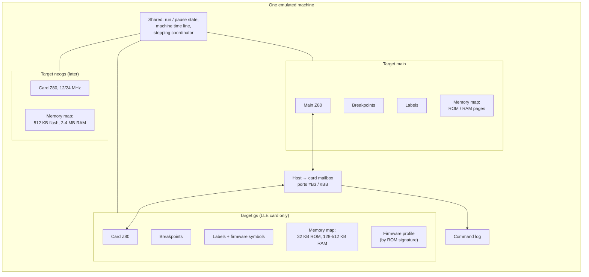
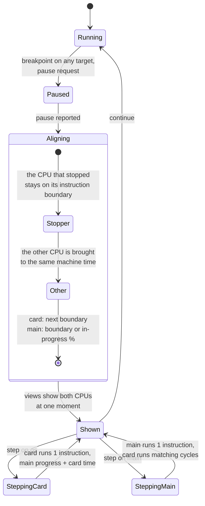
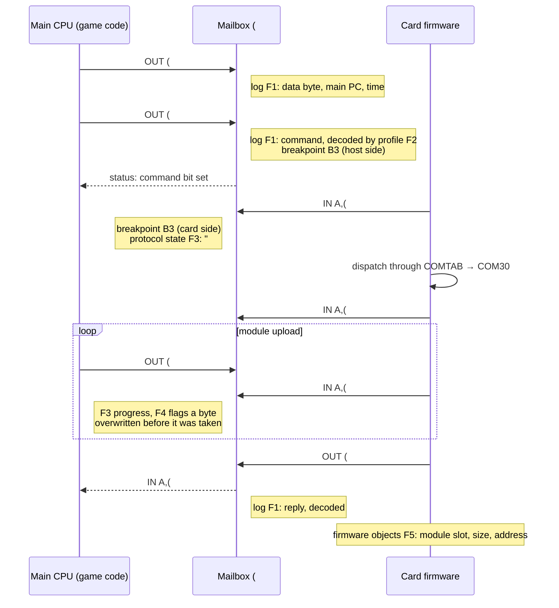
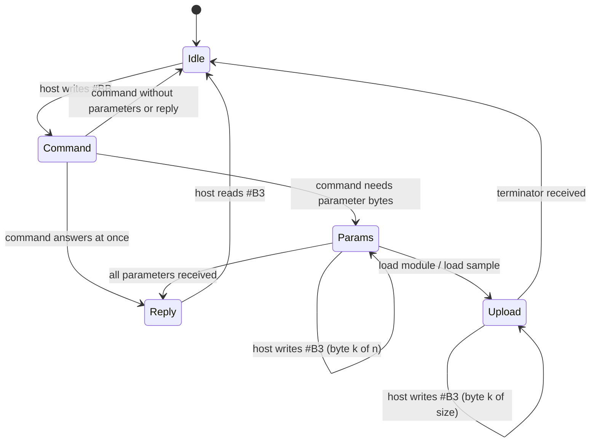

# Sound-card CPU debugging (General Sound, NeoGS) — requirements

- **Date:** 2026-09-27
- **Status:** draft, revision 2 (first review answers applied, see §6).
  Requirements only; the design follows once these are agreed.
- **Scope:** debugging the program that runs on a sound card's own Z80 - the
  General Sound (GS) firmware today, the NeoGS firmware next - side by side
  with the main machine, plus card-specific tools built around the host ↔ card
  command protocol.

## 0. Summary

A General Sound card is a second computer inside the machine: its own Z80 at
12 MHz, its own ROM and RAM, its own ports, running its own firmware. The
Spectrum talks to it through two ports (a command register and a data
register). Today we can watch that conversation from the outside (port trace,
activity counters, a few registers through automation), but we cannot debug
the card's program: no breakpoints on it, no disassembly, no labels, no
stepping, no memory view of its address space.

This document asks for:

1. **Every CPU in the machine is something the debugger can point at** - the
   main Z80, the GS card's Z80, later the NeoGS card's Z80 - each with its own
   breakpoints, labels, disassembly, registers and memory view (§4.1).
2. **One pause for the whole machine, one time line.** Whichever CPU hits a
   breakpoint, both stop at the same moment of machine time. Stepping one CPU
   holds the other frozen but moves it along the time line by the clock ratio;
   because the card is faster, the main CPU is usually shown *inside* an
   instruction, with how far through it is (§4.2).
3. **Card-aware tools around the command protocol**: a decoded log of every
   command the Spectrum sends and every reply, breakpoints on commands, a view
   of what the firmware has loaded (modules, samples) and what it is doing
   (§4.6).
4. **Built for more than one card**: nothing in the design may assume the GS
   memory map, port list or command table, because NeoGS differs in all three
   (§4.9). Firmware knowledge (command names, variables) comes from metadata
   tables selected by firmware signature, not from code (§4.6).
5. **The LW card gets a read-only inspector**, not a debugger: its command log
   and the state of its command interpreter (§4.11).

## 1. Terms

| Term | Meaning here |
|---|---|
| **main CPU** | The Spectrum's own Z80. |
| **card CPU** | The Z80 on a sound card (GS, NeoGS). |
| **debug target** | One CPU the debugger shows and controls: its registers, memory, breakpoints, labels. The main CPU is target `main`; the GS card CPU is target `gs`; NeoGS will be `neogs`. |
| **card firmware** | The program in the card's ROM (GS: `gs105a.rom`, v1.05a; NeoGS: its flash image). |
| **host** | The Spectrum side of the card conversation. |
| **host command / data byte** | A byte the Spectrum writes to the card's command port (`#BB`) or data port (`#B3`). The firmware reads it, runs the matching command handler, and may answer through the data port. |
| **command table** | The firmware's list of command handlers, indexed by command number (GS: `COMTAB` / `COMTABH` in the firmware sources). |
| **page / bank** | A 16 KB (or 32 KB) piece of ROM or RAM that the CPU sees through one of its address windows; which piece is visible is switched by a port write. |
| **catch-up** | How the card runs today: it does not run in lockstep with the main CPU. It runs in bursts - when the Spectrum touches a card port, and at the end of each frame - executing as many card instructions as fit into the main-CPU time that passed since the last burst. |
| **LLE / LW card** | The two GS models the emulator has: LLE runs the real firmware on a card CPU; LW (lightweight) plays modules with an in-emulator player and has no card CPU. |
| **machine time** | One time line for the whole machine. Each CPU's position on it is its own clock count divided by its clock rate. |
| **clock ratio** | Card clock ÷ main clock: 12 MHz ÷ 3.5 MHz = 24/7 ≈ 3.43 on a Pentagon with GS. One main T-state is ≈3.43 card cycles, one card cycle ≈0.29 main T. It changes with main-CPU turbo and with NeoGS 12/24 MHz. |
| **instruction progress** | How far a CPU is through the instruction it is executing: elapsed T-states of that instruction ÷ its total. `OUT (#B3),A` takes 11 T; 7 T in is 64%. From the elapsed T-states and the opcode's timing the UI can tell which bus cycle is under way (opcode fetch, operand read, port write). |
| **firmware profile** | A metadata table describing one firmware build: its signature (SHA-256 of the ROM image, as the emulator names ROMs elsewhere), command names and parameters, addresses of its variables, its symbol file. Selected automatically by signature. |
| **FSM** | Finite state machine: here, the LW card's command interpreter (which command is in progress, which byte it waits for). |

## 2. How the card runs today (what the debugger has to live with)

- **Two clocks.** The main CPU counts its own time in T-states (3.5 MHz on a
  Pentagon, one frame = 71,680 T); the card counts cycles at 12 MHz. They
  convert by the clock ratio: main T 35,000 into a frame corresponds to card
  cycle 35,000 × 12 / 3.5 = 120,000 into the same frame.
- **Catch-up, not lockstep.** At main T 35,000 the card may still be at card
  cycle 90,000. It jumps forward to 120,000 only when the Spectrum next
  touches a card port, or at the end of the frame. A card breakpoint that
  fires during such a burst fires while the main CPU is *in the middle of an
  instruction* (the port access that triggered the burst).

  ```mermaid
  sequenceDiagram
      participant M as Main CPU (3.5 MHz)
      participant G as GS card CPU (12 MHz)
      Note over M,G: frame starts - both at machine time 0
      M->>M: runs instructions up to T 34,989
      Note over G: idle in machine time (still at cycle 0)
      M->>G: OUT (#B3),A reaches its port write at T 34,996
      G->>G: catch-up burst: runs cycles 0 .. 119,986
      G-->>M: data byte latched
      M->>M: continues to the end of the frame (T 71,680)
      M->>G: frame end
      G->>G: catch-up burst: runs cycles 119,986 .. 245,760
  ```

  Every burst runs card instructions that belong to *earlier* machine time
  than the main CPU's current position. A card breakpoint hit at cycle 60,000
  in the first burst belongs to main T 17,500, but the main CPU has already
  run to T 34,996. §4.2 S3 addresses this.
- **The card has its own everything.** Its own 64 KB address space built from
  pages (GS: 32 KB ROM and 128-512 KB RAM, switched through the page port
  `#00`), its own port space (`#00`-`#0B`), its own 37.5 kHz interrupt, an
  NMI the Spectrum can trigger (`#33` bit 6), a reset (`#33` bit 7).
- **What already exists** (the base to build on):
  - the card CPU is the unreal-z80 library (since 2026-09-27): full register
    file, exact state at any instruction boundary, callbacks on every memory
    and port access;
  - GS port trace (host ports, card ports, DAC fetches, interrupts), activity
    counters, register read-out (`getCPUReg`, full register file);
  - automation: WebAPI `/state/audio/gs`, `/control/audio/gs`, port trace;
    MCP `gs_send_command`, `gs_send_data`, `gs_read_status`, `gs_read_data`,
    `gs_nmi`, `gs_reset`, `gs_reset_card`, `gs_dump_module`,
    `gs_switch_personality`, `gs_porttrace`;
  - TTD checkpoints include the whole card state (registers, latches, RAM).
- **What the main CPU's debugger has, that the card has none of:** execute /
  read / write / port breakpoints (optionally tied to one bank), breakpoint
  groups, step into / over / out, labels, disassembly, memory views, call
  trace, opcode profiler, analyzers, reverse debugging, GDB and DeZog servers.

## 3. Goals and non-goals

**Goals**

- G1. Debug card firmware with the same basic tools as main-CPU code.
- G2. See both CPUs at one consistent moment, and control them together.
- G3. Understand the host ↔ card conversation at the level of commands and
  their meaning, not raw port bytes.
- G4. One design that serves GS now and NeoGS later without rework.
- G5. No cost when nobody is debugging the card.

**Non-goals (this round)**

- A debugger for the LW card. It has no CPU; it gets a read-only inspector of
  its command log and interpreter state instead (§4.11).
- Debugging other sound devices without a CPU (AY, TurboSound FM, MoonSound).
- Editing or rebuilding firmware from the debugger.
- Cycle-exact modelling of the real GS/NeoGS bus arbitration beyond what the
  emulator already models.

## 4. Requirements

Priorities: **P0** - needed for the first usable version; **P1** - needed for
the feature to be complete; **P2** - later. Every requirement has a check that
tells whether it is met.

### 4.1 Debug targets

| ID | Pri | Requirement | Check |
|---|---|---|---|
| T1 | P0 | Every CPU in the machine is a debug target with a stable id (`main`, `gs`, later `neogs`). The list of targets can be queried. The LW card is not a debug target (§4.11). | Pentagon with an LLE GS card lists `main` and `gs`; with an LW card or no card, only `main`. |
| T2 | P0 | Each target has its **own** breakpoint set and **own** label set. Nothing is shared implicitly: a label `PLAY` defined on `gs` never appears in the main CPU's disassembly, a breakpoint at `#0038` on `gs` never fires on the main CPU. | Set a `gs` breakpoint at `#0038` and a `main` breakpoint at `#0038`; each fires only for its CPU. |
| T3 | P0 | Each target describes its own memory: its address windows, which pages exist (ROM, RAM, flash), how pages are switched, and which page each window shows right now. Breakpoints and labels can be tied to a page on every target, as on the main CPU today. | A `gs` breakpoint at `#8000` in RAM page 2 fires when page 2 is mapped, not when ROM or page 3 is. |
| T4 | P1 | Targets follow the machine: switching the GS card between LLE and LW at runtime, or removing the card, removes the `gs` target and brings it back later with its breakpoints and labels intact (kept but inactive while the card has no CPU). | Switch LLE → LW → LLE; the `gs` breakpoints are still there and fire again. |
| T5 | P1 | Every notification, log entry and API response that concerns a CPU carries its target id (breakpoint hit, pause, step done, register dump). | A `gs` breakpoint hit arrives in the UI and in automation as "target `gs`, breakpoint 3, PC `#0C32`". |

What each target owns, and what stays shared:



### 4.2 Synchronisation, pause and stepping

The heart of the feature. The card normally lags behind the main CPU and
catches up in bursts (§2). A debugger that stopped "somewhere inside a burst"
would show two CPUs at unrelated moments. The rule this section sets is
**one time line**: while paused, both CPUs sit at the same machine time, with
positions converted by the clock ratio.

The card is ≈3.4× faster (12 MHz against 3.5 MHz), and its instructions are
short: 4-23 card cycles, which is 1.2-6.7 main T. So the card can always be
put on an instruction boundary close to any moment. The main CPU cannot: one
main instruction (4-23 T) spans 14-79 card cycles, several card instructions.
When the card is the one that stopped or is being stepped, the main CPU is
therefore usually *inside* an instruction, and the debugger shows how far.

Worked example (Pentagon, GS, ratio 24/7):

```text
machine time ─────────────────────────────────────────────────────────────►

main CPU   │ LD A,(HL) 7T │ OUT (#B3),A  11T: fetch 4 │ operand 3 │ I/O 4 │ ...
T          34,982         34,989                     34,993      34,996  35,000

card CPU   │..│ LD A,(IX+2) 19c │ OUT (#03),A 11c │ JR NZ 12c ▲ │..
cycle                       119,955          119,974    119,985 │
                                                         card breakpoint hit
```

The card stops before `JR NZ` at cycle 119,985 = main T 34,995.6. The main CPU
is shown as: "executing `OUT (#B3),A` at `#8123`, started at T 34,989,
6.6 of 11 T done (60%)". From 6.6 T of `OUT (n),A` the UI can tell that the
opcode fetch (T 0-4) and the operand read (T 4-7) are done and the port write
(T 7-11) has not started yet, so the card has not received this byte.



| ID | Pri | Requirement | Check |
|---|---|---|---|
| S1 | P0 | **One pause.** A breakpoint on any target pauses the whole machine. | A `gs` breakpoint stops the main CPU too; a `main` breakpoint stops the card too. |
| S2 | P0 | **One time line.** While paused, both CPUs are at the same machine time, positions converted by the current clock ratio. The CPU that stopped is on an instruction boundary. If the card is the other CPU, it is brought to its nearest instruction boundary not after that moment; the gap (under one card instruction) is shown. Worked example: main breakpoint at T 35,000 → the card runs forward to the last boundary at or before cycle 120,000 and shows e.g. "3 cycles behind". | Break on `main` at a known T; the card's cycle is T × 24/7 minus less than one card instruction. |
| S3 | P0 | **Main CPU inside an instruction.** When the card stopped (breakpoint, step) at a moment inside a main instruction, the main CPU is shown with: the instruction address and text, the T-state it started at, elapsed and total T-states, the percentage, and which bus cycle is under way (derived from the opcode's timing). Resuming finishes that instruction exactly as without the pause. | Break on the card during the example above; the main view reads "`OUT (#B3),A`, 6.6/11 T (60%), before port write"; continue; the card's received byte and the main CPU's registers match a run without the breakpoint. |
| S4 | P0 | **Never shown in the future.** The main CPU is never shown later than the card's stop point by more than its current instruction. Today's catch-up lets the main CPU run ahead by up to a frame (§2 diagram); while any card breakpoint or card step is active, the emulation must keep the two CPUs within one main instruction of each other. When card debugging is not active, catch-up stays as it is (P1). | Card breakpoint at cycle 60,000 (main T 17,500): the main CPU is shown at the instruction containing T 17,500, not at the next card-port access at T 34,996. |
| S5 | P0 | **Step one target, the other frozen, timing kept.** Stepping one CPU freezes the other: it runs no instruction of its own beyond what the elapsed time requires. The time line advances by the stepped CPU's cycles converted by the clock ratio. Stepping the card by one instruction moves the main CPU's progress by the matching T. When the progress crosses the end of its instruction, that instruction completes and the next one starts. Stepping the main CPU by one instruction runs the card for the matching cycles, several card instructions, and stops it on a boundary per S2. | From the example, step `gs` once over `JR NZ` (12 cycles = 3.5 T): the main CPU shows `OUT (#B3),A` at 10.1 of 11 T (92%, port write under way). A second `gs` step of 19 cycles (5.5 T) completes `OUT` and shows the next instruction 4.6 T in. Step `main` once over an 11 T instruction: the card advances ≈37.7 cycles, ending on a boundary. |
| S6 | P0 | **Step modes on the card.** Step into, step over, step out and run to cursor work on the card target with the same meaning as on the main CPU, and follow S5 for the other CPU. | Step over a `CALL` on `gs`: the card is at the next instruction; the main CPU advanced by the routine's duration × 7/24 T. |
| S7 | P1 | **Run to a moment.** "Run until the card reaches cycle N", "until main T reaches N", "until the next frame", "until the next card interrupt", with both CPUs moving on the one time line. | Run to next frame from any pause: the main CPU is at T 0 of the next frame, the card at its matching boundary. |
| S8 | P1 | **Debugging does not change results.** Stepping, pausing and breakpoints change when the CPUs are looked at, never what they compute. | Card RAM hash, DAC output and every reply byte over 300 frames are identical with and without 10 card breakpoints that are hit and resumed, and with a run of 1,000 alternating `gs` / `main` steps. |
| S9 | P1 | **Ratio changes are honoured.** Main-CPU turbo (e.g. 7 MHz: ratio 12/7) and NeoGS 12 ↔ 24 MHz switching change the conversion from the moment they happen; progress and gaps are computed with the ratio in effect at that time. | Switch to turbo mid-frame; a step of the card by 12 cycles moves the main CPU by 7 T instead of 3.5 T. |

### 4.3 Breakpoints on the card

| ID | Pri | Requirement | Check |
|---|---|---|---|
| B1 | P0 | Execute, memory read, memory write and port in / out breakpoints on the card's own address and port spaces, optionally tied to a page (T3). | Write breakpoint on card RAM `#4000` fires on the firmware's buffer writes. |
| B2 | P1 | Card-event breakpoints: card interrupt accepted, card NMI accepted, card reset, page switch (a write to the page port), with an optional value filter (e.g. "page switch to page 5"). | "NMI accepted" fires when the Spectrum pulses `#33` bit 6. The periodic 37.5 kHz interrupt breakpoint takes a hit count or condition, since it fires 768 times per Pentagon frame. |
| B3 | P0 | **Protocol breakpoints** on the host ↔ card conversation: host writes a command (any, or a given number, e.g. `#30` load module), host writes a data byte, host reads the reply, the card reads the command (the firmware picked it up), the card writes a reply. These are available on the `main` side (stop when the Spectrum sends it) and the `gs` side (stop when the firmware takes it). | "Command `#31` (start playback)" stops the machine at the Spectrum's `OUT (#BB),A`; its `gs` twin stops at the firmware's first instruction that reads the command. |
| B4 | P1 | Conditions and hit counts work on card breakpoints with the same syntax and meaning as main-CPU breakpoints (the condition engine of the conditional-breakpoints design, when it lands). | `gs` execute breakpoint at `#1234` with condition `A == #30` stops only for that value. |
| B5 | P1 | Breakpoint groups, enable/disable, and the hidden internal breakpoints used by step over / out exist per target. | Disabling the `gs` group leaves `main` breakpoints active. |

### 4.4 Labels and symbols

| ID | Pri | Requirement | Check |
|---|---|---|---|
| L1 | P0 | A separate label set per target, with the same features as main-CPU labels (add, rename, delete, import, export). | Import a label file into `gs`; `main` labels unchanged. |
| L2 | P0 | Labels can be tied to a page, because the card's upper windows are paged: `#8000` in ROM and `#8000` in RAM page 3 carry different names. | Disassembly of `#8000` shows the name for the page currently mapped. |
| L3 | P0 | **Firmware symbols from the sources, marked up on the binaries.** Symbol files are kept in `data/symbols/gs/` in the same format as the existing main-CPU files in `data/symbols/` (address, label, type, comment, with a 16K page prefix per label). The binaries are the truth: the sources (GS: the 1997 code plus patches, which builds v1.05b; NeoGS: N5) supply the names, and each label is placed on each shipped ROM (`gs104.rom`, `gs105a.rom`, `gs105b.rom`) where its routine's bytes are. A mark-up report per ROM lists labels that matched, moved, changed (patch areas) or could not be placed. An automated check confirms that every shipped label points at the bytes the sources give it, outside the reported changed ranges. | `COM30` and `COMTAB` are named in all three GS ROMs. The report for v1.05a lists its changed ranges, and they agree with the patch notes. |
| L4 | P0 | **Automatic loading by signature.** When the card boots, its ROM's SHA-256 selects the firmware profile (F2), and the profile names its symbol file; the symbols load into the `gs` target without user action. An unknown ROM loads no symbols and says so, showing its SHA-256. | Boot with `gs105a.rom`: `COMINT`, `COMTAB` and the command handlers appear by name. Boot with a patched ROM: "unknown firmware, no symbols". |
| L5 | P2 | User-added card labels persist per firmware SHA-256 and come back for the same ROM in the next session, separate from the shipped symbol file. | Add a label, restart, boot the same ROM; the label is there; the file in `data/symbols/gs/` is unchanged. |

### 4.5 Views

| ID | Pri | Requirement | Check |
|---|---|---|---|
| V1 | P0 | Registers of the card CPU: the full register file incl. shadow registers, MEMPTR, IFF1/IFF2, IM, halted, and the instruction-boundary state (interrupt shadow, pending prefix). | Matches the card state serialized in TTD for the same moment. |
| V2 | P0 | Disassembly of card code with labels, current PC, breakpoint markers, page awareness. | Disassembly at `#0038` shows the firmware's interrupt handler with names from L3. |
| V3 | P0 | Memory view of the card: what the card CPU sees now (its 64 KB), and each physical page (ROM, every RAM page; for NeoGS flash and RAM). Editable while paused. | Edit a byte of card RAM page 2 while paused; the card sees the new value after resume. |
| V4 | P1 | Card hardware panel: page register(s), the four DAC channel values and volumes, interrupt timing (position in the current 320-cycle period), pending INT / NMI, the host mailbox latches and status bits. For NeoGS additionally its configuration register, extended paging, eight channels, DMA, SD card and MP3 decoder state. | The panel shows page register 3 after the firmware writes 3 to port `#00`. |
| V5 | P1 | Stack view and call stack of the card CPU. | Inside a nested firmware routine, the call stack lists the callers by name. |
| V6 | — | LW card state: see §4.11. | — |

### 4.6 Firmware command interface (card-specific tools)

The unique part: making the host ↔ card conversation readable.

The conversation, and where each tool in this section attaches:



| ID | Pri | Requirement | Check |
|---|---|---|---|
| F1 | P0 | **Command log contents.** Every host command, its parameter bytes and the firmware's reply are logged with: machine time (frame, main T, card cycle), the main-CPU PC of the `IN`/`OUT` that did it, the command's name and decoded parameters (F2), and the reply. Worked example: `frame 412  T 34,996  PC #8123  #30 "load module"  → reply #01 (slot 1)`. | Load a module from a real program: the log shows the load command, one block entry for the upload, and start playback, all by name. |
| F1a | P0 | **Bulk data is not stored, only described.** Payload bytes of multi-byte transfers (module and sample uploads, streamed data) are dropped. The transfer is logged as one block entry: command, byte count, start and end time, and, when the firmware profile says where the firmware puts the data, the destination in card memory (page and address range). Worked example: `frame 412-431  upload for #30: 38,400 bytes → RAM pages 2-3, #8000-#FFFF / #8000-#95FF`. | A 38,400-byte module upload produces one log entry, not 38,400. |
| F1b | P0 | **Activation, like the port trace.** The log records in the background only after it is activated (UI, automation, config). Activating the debugger can switch it on automatically; this is an option. Off by default until the design settles the always-on ring (F1c). | With the log off, nothing is recorded and P1 holds; activate it and the next command appears. |
| F1c | P1 | **Retention.** The log is a ring. Its capacity holds at least a complete load plus 5 minutes of playback. Worked sizing: 5 minutes at 48.83 frames/s is 14,650 frames. A game that sends 2 commands per frame (e.g. volume and position polling) produces ≈30,000 entries. Uploads are one entry each (F1a). The design states the entry size and the resulting memory, and decides whether the ring can be always on (then F1b's default changes). When the ring wraps, the oldest entries are dropped, and the log says how many. | Load a module and play it for 5 minutes with 2 commands per frame: the first load command is still in the log. |
| F2 | P0 | **Firmware profiles as metadata tables.** All knowledge of a firmware - command names, parameter count and meaning, reply meaning, which commands start multi-byte transfers, addresses of its variables (for F3, F5), its symbol file (L3) - is data in a firmware profile, selected by the ROM signature (L4). No firmware-specific code in the debugger. First version: profiles built into the emulator for GS v1.04, v1.05a and v1.05b. Later: profiles read from files by signature, so a new firmware needs no rebuild. The source of truth for a profile is the firmware source (command tables `COMTAB` / `COMTABH`), not the published guide, which omits e.g. `#0E` Covox streaming, `#13` jump, `#16` put byte. Commands missing from the profile are logged as "unknown command #NN". | Commands `#0E`, `#13`, `#16` appear by name in the log with v1.05a. A ROM with no profile still logs every command, by number. |
| F3 | P1 | **Protocol state.** What the card is doing with the conversation right now: which command is in progress, how many parameter bytes it expects and has received, and for multi-byte transfers (module upload) the progress. | During a module upload the view shows "load module: 12,288 of 38,400 bytes". |
| F4 | P1 | **Protocol problem detection**, flagged in the log: a byte written before the card consumed the previous one (lost byte), a command sent while the previous one was not yet taken, a reply read that was never written, a transfer that stalls. | A program that writes two data bytes back to back without waiting gets a "byte `#12` overwritten before the card read it" entry. |
| F5 | P1 | **Firmware objects view.** What the firmware holds: loaded modules and samples (slot, size, address in card RAM), and playback state (song position, pattern row, speed, active channels, global volume), read from the firmware's own variables through a per-firmware map. | After loading and starting a module, the view shows the slot, its size, song position 0 and advancing rows. |
| F6 | P1 | **Send from the debugger.** Send a command or data byte and read the reply from the debugger UI, with the same name/parameter decoding (this exists in automation today; the requirement is the debugger-side tool with decoding). | Send `#23` (number of pages) from the UI; the log shows it and the reply `#10` with its meaning. |
| F7 | P2 | Export of the command log (text / JSON) and a filter by command, by main-CPU routine and by time range. | Export the log of a session to JSON; filter to `#30`-`#33`. |

### 4.7 Time travel (TTD)

| ID | Pri | Requirement | Check |
|---|---|---|---|
| D1 | P1 | Reverse step and reverse continue on the card target, like on the main CPU. | Reverse-step five card instructions; registers match a forward run to the same point. |
| D2 | P1 | "Who wrote this byte" in card memory: the history of writes to a card address, with the card PC of each write. | Ask for the last writer of card RAM `#4100`; get the firmware routine that wrote it. |
| D3 | P1 | The command log (F1) is part of the recorded history: seeking back shows the log up to that point; nothing after it. | Seek to frame 200; the log ends at frame 200. |
| D4 | P2 | Card breakpoints participate in reverse search (reverse continue stops at the previous hit of a card breakpoint). | Reverse continue from frame 400 stops at the previous `#31` command. |

### 4.8 Automation, protocols and user interface

| ID | Pri | Requirement | Check |
|---|---|---|---|
| A1 | P0 | Every debugger function in every automation interface (CLI, WebAPI, MCP, Lua, Python) accepts a target (`main` by default), so existing scripts keep working and card debugging is scriptable. A call lists the available targets. | `breakpoint add gs exec #0038` from the CLI; the same through WebAPI and MCP. |
| A2 | P0 | Command log (F1), protocol state (F3) and firmware objects (F5) are readable through automation. | WebAPI returns the last 100 decoded commands as JSON. |
| A3 | P1 | **External debuggers attach per target.** Each external debug adapter (GDB server, DeZog) is started as a separate instance for each target, on its own port. The card instance is the same adapter as for the main CPU, bound to target `gs`. Pause and resume from either instance follow the one-pause rule (S1): pausing through the card's GDB connection stops the main CPU too, and the main CPU's connection reports it. | Start the GDB adapter for `main` on its port and for `gs` on another. Set a breakpoint on firmware symbol `COM30` through the `gs` connection. A game's module load stops both; each connection shows its own CPU's registers. |
| A4 | P0 | **Events for external front-ends.** Pause, resume, breakpoint hit, step done and "time line moved" are pushed to subscribed clients with the target id (T5), so a separate process (U1 b) follows the machine without polling. | A second process subscribed to `gs` receives the hit within one UI frame of the pause. |
| U1 | P0 | **Separate front-ends per target.** The debugger core per target (§4.1-4.7) does not depend on any one UI. Each target can be driven by its own front-end, and several can run at once, all sharing the one pause and time line (S1, S2): (a) a second debugger window in the same process, fixed to the card; (b) a separate process driving a target through the automation API (A1, A4); (c) a front-end built for one job, e.g. a firmware-protocol monitor that shows only F1/F3/F5. | Open the main debugger window and a card window side by side; a `gs` breakpoint stops both and each shows its own CPU at the same machine time. The same through a second process connected over the API. |
| U1a | P0 | Qt: the card debugger window has registers, disassembly, memory, breakpoint and label editors for its target, and shows the other CPU's state at the pause (S3 progress for the main CPU). | During a `gs` pause, the card window shows the main CPU line "`OUT (#B3),A`, 60%". |
| U2 | P1 | Qt debugger: panels for the card hardware (V4), the command log (F1), protocol state (F3) and firmware objects (F5). | — |
| U3 | P2 | TUI debugger as a front-end for any target, including the card (U1 b/c). | — |

### 4.9 NeoGS readiness

| ID | Pri | Requirement | Check |
|---|---|---|---|
| N1 | P0 | Nothing in the design assumes the GS memory map, port list, number of DAC channels or command table. Each card model supplies: its address windows and pages, its port list with names, its hardware panel fields, its command tables per firmware version, its firmware variable map. | Adding NeoGS needs only a new card description plus its own panel fields, no change to the debugger core. |
| N2 | P1 | The card CPU clock can change while running (NeoGS 12 ↔ 24 MHz); time conversion (§4.2) follows the current clock. | Switch NeoGS to 24 MHz mid-frame; a main breakpoint still reports the card at the matching cycle. |
| N3 | P1 | Large and deep memory: NeoGS has 2-4 MB of RAM and 512 KB of flash with extended paging; memory views, page-tied breakpoints and labels handle page numbers beyond GS's 16 RAM pages. | Breakpoint in NeoGS RAM page 100 fires only for that page. |
| N4 | P2 | NeoGS-only devices appear as inspectable state: SD card (current sector, transfer state), MP3 decoder (buffer fill, status), DMA (source, destination, remaining count). | — |
| N5 | P1 | **NeoGS firmware symbols from its sources, plus a comparison with GS.** The NeoGS firmware sources are in the NedoPC SVN repository `ngs` (`svn.nedopc.com`, folder `/z80/`). It contains `main_rom/` (`main_ngs.a80`, `main_full.a80`, `ngs_sd_drv.a80`, `version.a80`, `build.bat`, the built `neogs.rom`), `gs105a_fix/`, `loader_ngs/`, `bootGS01/`, `sdcomand.a80` and `ports_ngs.a80`. They are imported into the GS materials and used to mark up the NeoGS ROM binary like L3. The results go into `data/symbols/gs/` and a NeoGS firmware profile. A comparison against the GS v1.05a firmware is a deliverable too: each routine is marked "same as GS `NAME`", "changed from GS `NAME`" or "NeoGS only", which shows what NeoGS adds on top of GS. | The mark-up report places every label, or lists it. The profile names every command in its command table. The comparison report lists every routine in one of the three classes. |

### 4.10 Performance

| ID | Pri | Requirement | Check |
|---|---|---|---|
| P1 | P0 | **No cost when unused.** With no card breakpoints, no card views open and the command log off, the card runs at today's speed (reference: the GS module-playback pipeline measured after the switch to unreal-z80, 213 ms on the development machine). | The same measurement within 2%. |
| P2 | P1 | The command log is cheap enough to leave on during normal play: it records commands, not instructions, and drops upload payloads (F1a). If it proves free enough, it may become always on (F1c). | Log on vs off: within 2% on the same scenario. |
| P3 | P1 | With card breakpoints set but not hit, the card slows by a bounded amount, stated in the design and measured. | — |
| P4 | P1 | The tight synchronisation needed while card debugging is active (S4) has a stated, measured cost, and is switched off as soon as no card breakpoint or card step is active. | Measured in the design; the GS playback measurement returns to within 2% of P1 after the last card breakpoint is removed. |

### 4.11 LW card inspector (read-only)

The LW card has no CPU and no firmware, so there is nothing to debug as code.
Its command interpreter is a state machine (FSM) implemented in the emulator.
The LW card gets a read-only inspector over the same data the LLE card's tools
show, so the two cards can be compared.



(Illustrative; the actual states are defined by the LW interpreter.)

| ID | Pri | Requirement | Check |
|---|---|---|---|
| W1 | P1 | The command log (F1) works for the LW card with the same format and decoding (the LW card emulates GS v1.05a behaviour, so the v1.05a profile applies). | The same game on LLE and LW gives command logs that match line for line in commands, parameters and replies. |
| W2 | P1 | The interpreter state is shown read-only: current state, command in progress, bytes expected / received, reply pending, upload progress. | During a module upload the inspector reads "Upload, 12,288 of 38,400 bytes". |
| W3 | P1 | Player state is shown read-only: loaded modules and samples, song position, row, speed, channel volumes, playing / stopped. The fields are the same as the LLE firmware objects view (F5). | Start a module on LW: position and row advance, matching the same module on LLE. |
| W4 | P2 | Protocol problem detection (F4) works on the LW card too. | A lost-byte case gets the same flag on both cards. |
| W5 | — | No breakpoints, stepping, registers or memory editing on the LW card. Pausing the machine freezes the inspector's view. | — |

### 4.12 Firmware ROMs

| ID | Pri | Requirement | Check |
|---|---|---|---|
| R1 | P1 | GS v1.05b is added as a selectable card ROM (`data/rom/gs105b.rom`, chosen with the existing `GS=` config key), built from the in-tree sources. v1.05a stays the default. CI checks that the build matches the shipped file byte for byte, and its SHA-256 is in the emulator's known-ROM table. | Set `GS=rom/gs105b.rom`: the card boots, answers the version query with v1.05b, and its profile and symbols load (L4). |

## 5. Worked example: "the game loads music but nothing plays"

1. The user turns on the command log and runs the game. The log shows
   `#30 load module` followed by 38,400 data bytes and `#31 start playback`,
   and an F4 flag: "byte overwritten before the card read it" at byte 1,025.
2. They set a protocol breakpoint "host writes a data byte" with hit count
   1,025 on `main`. The machine stops at the game's `OUT (#B3),A`; the
   disassembly shows the game's upload loop does not wait for the card's
   "byte taken" flag after the first kilobyte.
3. To confirm from the card side, they switch to target `gs` (labels from the
   firmware are already loaded), set an execute breakpoint on the firmware's
   byte-receive routine, and step through it: the card reads the second byte
   only, the first was replaced.
4. The firmware objects view shows the module slot with a wrong size; the
   playback state never advances past row 0.

Every step uses one requirement: F1, F4, B3/B4, T2, L4, S5/S6, F5.

## 6. Decisions and open questions

### Decided in review (2026-09-27)

| Question | Decision | Where |
|---|---|---|
| Card breakpoint while the main CPU is inside an instruction | The main CPU is shown inside its instruction, with instruction progress (elapsed / total T, percentage). The UI derives the bus cycle from it. | S3, S4 |
| Freeze the other CPU when stepping one? | Yes. The other CPU is frozen but keeps relative timing by the clock ratio. | S5 |
| Which firmware versions, and how | Firmware profiles as metadata tables selected by ROM signature. Built in first; later read from files by signature. | F2, L4 |
| Where firmware symbols come from | Names from the sources, marked up directly on each ROM binary, verified, in `data/symbols/gs/`, existing `.map` format. | L3 |
| NeoGS firmware | Sources from the NedoPC SVN (`ngs`, `/z80/`), built and verified like GS; plus a routine-by-routine comparison with GS. | N5 |
| GDB / DeZog for the card | The same adapter, one more instance per target on its own port. | A3 |
| LW card | No debugger; a read-only inspector of the command log and interpreter state. | §4.11 |
| Window layout | Separate front-ends: a second window, a separate process over the API, or task-specific interfaces. | U1, A4 |
| Command log lifetime | Background recording after activation, like the port trace; optionally switched on with the debugger. The ring holds a full load plus 5 minutes of play. Payloads dropped, uploads logged as one block with their destination. Always-on to be decided in the design. | F1-F1c |
| v1.05b | Added as a ROM option. | R1 |
| Page size in the debugger | 16K pages everywhere (the Spectrum standard); MPAG's 32K pairs are shown as two 16K pages. | T3 |
| Signatures | SHA-256, as the emulator's signature cache and known-ROM table use. | F2, L4 |

### Left to the design

1. How the main CPU is kept within one instruction of the card while card debugging is active (S4), and what it costs (P4).
2. Log entry layout, ring size in memory, and whether the ring can be always on (F1c).
3. Event transport for separate processes (A4): the existing WebAPI / WebSocket channels or a new one.

## 7. References

### General Sound and NeoGS

| Document | What it contains | Status |
|---|---|---|
| [`docs/inprogress/2026-09-19-general-sound/gs-tdd.md`](../2026-09-19-general-sound/gs-tdd.md) | GS emulation design; §9 is the only earlier note on card debugging (register window, `GS:` address space, breakpoints) | implemented (§9 not) |
| [`docs/inprogress/2026-09-19-general-sound/TODO.md`](../2026-09-19-general-sound/TODO.md) | GS implementation status, incl. the switch to unreal-z80 | live |
| [`docs/inprogress/2026-09-19-general-sound/gs-card-interface.md`](../2026-09-19-general-sound/gs-card-interface.md) | The `GeneralSoundCard` interface shared by the LLE and LW cards (introspection, `getCPUReg`) | implemented |
| [`docs/inprogress/2026-09-19-general-sound/gs-card-personalities-tdd.md`](../2026-09-19-general-sound/gs-card-personalities-tdd.md) | LLE vs LW cards, runtime switching (relevant to T4, V6) | implemented |
| [`docs/inprogress/2026-09-19-general-sound/diagnostics-gaps-proposal.md`](../2026-09-19-general-sound/diagnostics-gaps-proposal.md) | Gaps found in live triage: no card disassembly, partial register read-out, fixed banked-RAM window, LW player black box | proposal |
| [`docs/inprogress/2026-09-19-general-sound/verification-findings-and-bugs.md`](../2026-09-19-general-sound/verification-findings-and-bugs.md) | Playback verification against the firmware sources; protocol pitfalls (relevant to F4) | done |
| [`docs/inprogress/2026-09-19-general-sound/neogs-tdd.md`](../2026-09-19-general-sound/neogs-tdd.md) | NeoGS hardware and emulation plan: 12/24 MHz, 2-4 MB RAM, 512 KB flash, extended paging, 8 channels, DMA, SD, VS1001 (§4.9) | design |
| [`docs/inprogress/2026-09-19-general-sound/materials/README.md`](../2026-09-19-general-sound/materials/README.md) | Index of GS / NeoGS reference materials | reference |
| [`.../materials/gs/gs-programming-guide.md`](../2026-09-19-general-sound/materials/gs/gs-programming-guide.md) | Host-side protocol and command reference (incomplete, see F2) | reference |
| [`.../materials/gs/gs-firmware/`](../2026-09-19-general-sound/materials/gs/gs-firmware/) | GS firmware sources; command tables `COMTAB` (`firmware/src/COM_L.a80:72`) and `COMTABH` (`firmware/src/TABLES_H.a80`) | reference |
| [`.../materials/neogs/`](../2026-09-19-general-sound/materials/neogs/) | NeoGS FPGA sources and notes (`NEOGS-DIFFERENCES.md`) | reference |
| [`.../materials/gs/gs-firmware/readme.md`](../2026-09-19-general-sound/materials/gs/gs-firmware/readme.md) | Firmware history: 1997 sources plus the 2007 (v1.05a) and 2015 (v1.05b) binary patches; routines stay in place (L3) | reference |
| [`.../materials/gs/gs-firmware/firmware/patch/`](../2026-09-19-general-sound/materials/gs/gs-firmware/firmware/patch/) | The patch sources: the areas where versions differ (L3) | reference |
| [`.../materials/neogs/ngsrom109/`](../2026-09-19-general-sound/materials/neogs/ngsrom109/) | NeoGS firmware binary `full_ngs.rom`, input to the GS comparison (N5) | reference |
| NedoPC SVN repository `ngs` - `http://svn.nedopc.com/listing.php?repname=ngs&path=%2Fz80%2F` | NeoGS firmware sources (N5); project page `http://nedopc.com/gs/ngs_eng.php` | external |
| [`data/rom/`](../../../data/rom/) | Shipped card ROMs: `gs104.rom`, `gs105a.rom`, `bootGS.rom` (L3 verification) | live |
| [`data/symbols/`](../../../data/symbols/) | Existing main-CPU symbol files (`.map`); `gs/` subfolder to be added (L3) | live |
| [`.recipe/peripherals/generalsound.md`](../../../.recipe/peripherals/generalsound.md) | How to configure and use the GS card | live |
| [`docs/emulator/design/audio/sound-device-registry.md`](../../emulator/design/audio/sound-device-registry.md) | Sound device registration (where cards plug in) | live |
| [`core/src/3rdparty/unreal-z80/README.md`](../../../core/src/3rdparty/unreal-z80/README.md) | The card CPU library: version, origin, verification | live |

### Debugger (main CPU) - what exists and what is planned

| Document | What it contains | Status |
|---|---|---|
| [`docs/emulator/design/debugger/label-manager.md`](../../emulator/design/debugger/label-manager.md) | Label manager design (single 16-bit address space today; T2/L1/L2) | implemented |
| [`docs/inprogress/2026-08-17-conditional-breakpoints/design.md`](../2026-08-17-conditional-breakpoints/design.md) | Breakpoint conditions; hot-path cost (B4, P3); see also `hotpath-walkthrough.md` | partially implemented |
| [`docs/inprogress/2026-08-26-breakpoint-enhancements/design.md`](../2026-08-26-breakpoint-enhancements/design.md) | Address ranges, hit counters, conditions, interrupt breakpoints (B2, B4) | design |
| [`docs/inprogress/2026-08-26-debugger-enhancements/proposal.md`](../2026-08-26-debugger-enhancements/proposal.md) | Debugger UI improvements; `features-parity.md`, `ui-mockups.md` (U1, U2) | proposal |
| [`docs/inprogress/2026-01-11-debugger-events/proposal-debugger-state.md`](../2026-01-11-debugger-events/proposal-debugger-state.md) | Debugger state and pause/resume events (S1, T5) | done |
| [`docs/inprogress/2026-01-27-opcode-profiler/opcode-profiler-tdd.md`](../2026-01-27-opcode-profiler/opcode-profiler-tdd.md) | Opcode profiler (a per-target candidate) | implemented |
| [`docs/inprogress/2026-01-14-analyzers/analyzer-architecture.md`](../2026-01-14-analyzers/analyzer-architecture.md) | Analyzer framework; `interrupt-analyzer.md` | partially implemented |
| [`docs/inprogress/2026-08-24-diagnostic-observability/use-cases.md`](../2026-08-24-diagnostic-observability/use-cases.md) | Diagnostics and observability use cases | done |
| [`docs/inprogress/2026-09-24-tui-debugger/`](../2026-09-24-tui-debugger/) | TUI debugger designs (U3) | PoC |
| [`docs/inprogress/2026-08-27-dezog-integration/design.md`](../2026-08-27-dezog-integration/design.md) | DeZog integration (A4) | implemented |

### Control interfaces

| Document | What it contains | Status |
|---|---|---|
| [`docs/emulator/design/control-interfaces/README.md`](../../emulator/design/control-interfaces/README.md) | Overview of the automation interfaces (A1) | live |
| [`command-interface.md`](../../emulator/design/control-interfaces/command-interface.md), [`cli-interface.md`](../../emulator/design/control-interfaces/cli-interface.md), [`webapi-interface.md`](../../emulator/design/control-interfaces/webapi-interface.md), [`lua-interface.md`](../../emulator/design/control-interfaces/lua-interface.md), [`python-interface.md`](../../emulator/design/control-interfaces/python-interface.md) | Per-interface command sets (A1, A2) | live |
| [`gdb-protocol.md`](../../emulator/design/control-interfaces/gdb-protocol.md), [`udb-protocol.md`](../../emulator/design/control-interfaces/udb-protocol.md) | Remote debugging protocols (A3) | live |

### Time travel

| Document | What it contains | Status |
|---|---|---|
| [`docs/emulator/design/debugger/time-travel-debug/time-travel-debugging-tdd.md`](../../emulator/design/debugger/time-travel-debug/time-travel-debugging-tdd.md) | TTD design: checkpoints, write journal, probes (D1-D4) | implemented |
| [`time-travel-ux.md`](../../emulator/design/debugger/time-travel-debug/time-travel-ux.md), [`ttd-use-cases.md`](../../emulator/design/debugger/time-travel-debug/ttd-use-cases.md) | TTD user experience and use cases | live |
| [`gdb-reverse-debugging-tdd.md`](../../emulator/design/debugger/time-travel-debug/gdb-reverse-debugging-tdd.md) | Reverse debugging through GDB (A3, D1) | implemented |
| [`overhead-and-gating.md`](../../emulator/design/debugger/time-travel-debug/overhead-and-gating.md) | How debugging features stay free when off (P1-P3) | live |
| [`docs/inprogress/2026-09-25-ttd-v2-migration/target-architecture.md`](../2026-09-25-ttd-v2-migration/target-architecture.md) | TTD v2: device state as memory regions (card RAM as a region) | design |

### Performance

| Document | What it contains | Status |
|---|---|---|
| [`docs/inprogress/2026-09-24-core-performance/unreal-ng-core-perf-and-gating-review.md`](../2026-09-24-core-performance/unreal-ng-core-perf-and-gating-review.md) | GS idle cost and gating proposals (P1) | review |
