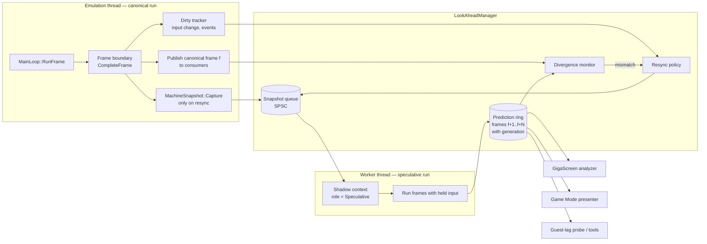
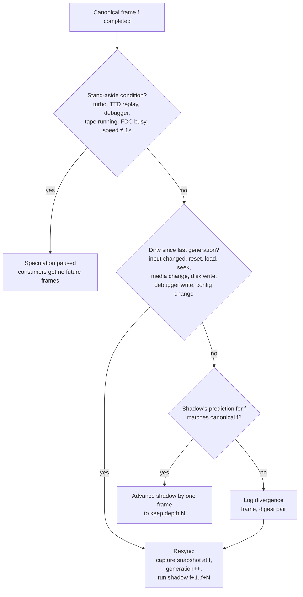
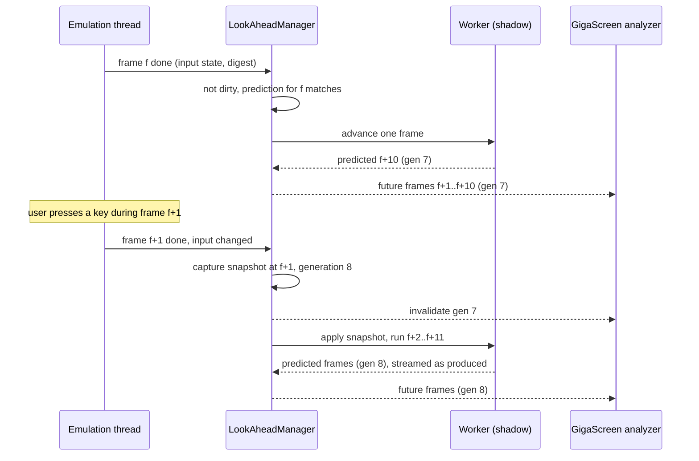

# Look-Ahead Manager — Technical Design

**Created:** 2026-09-27
**Status:** draft for review
**Requirements:** [requirements.md](requirements.md) · **Prior art:** [prior-art.md](prior-art.md)

---

## 1. Choice of model

| Model | Used by | Canonical run rolled back? | Cost per frame | Fits us? |
|---|---|---|---|---|
| Save → run N → show → restore, every frame | xpeccy-plus, Mesen2, Spectral, RetroArch single | yes, every frame | N+1 frames | no: audio/TTD/recording all see rollbacks; 10-frame analysis would cost 11× |
| Preemptive ring, replay on input change | RetroArch preemptive | yes, on input change | ~1 + snapshot | later, Game Mode on single-core hosts |
| **Shadow instance, resync on divergence** | RetroArch second instance | **never** | ~1 extra frame on another core; burst of N on resync | **yes** |

The shadow model is chosen: canonical audio, TTD, recording and debugger
never see speculation (LA-2), the shadow runs on another core (R-8 of the
GigaScreen requirements allows several cores), and steady-state cost is one
extra frame, not N.

**Free look-ahead already present.** The presenter delays video by 2 frames
on purpose to match audio latency (`screen.h:695-722`, `_presentDelayFrames`).
Analysis that runs at frame latch time therefore already sees 2 frames beyond
what is on screen. The manager extends this to 10.

---

## 2. Components

### 2.1 `MachineSnapshot` — raw in-memory state copy

- Taken and applied **only at frame boundaries** (screen raster state is only
  valid there: TTD restore calls `Screen::InitFrame`).
- Contents: CPU POD (as `TTDCpuState`), chipset POD (as `TTDChipsetState`),
  RAM pages, peripheral blobs through the existing `TTDSerializable` registry
  (`ttdserializable.h:42`), FLASH phase and other frame counters, emulated
  clock value.
- RAM copy strategy: full memcpy first (128K = trivially cheap; 4 MB ≈ 0.3 ms);
  per-page dirty copy later. Today's dirty tracker is only hooked on the debug
  memory path (`memory.cpp:342`), so dirty copy needs a fast-path hook.
- No compression, no validation in the hot path (L3). The same type serves the
  later preemptive-frames mode and can serve TTD v2 in-memory checkpoints.
- **Completeness test (LA-5):** for each machine model: capture → run K frames
  → hash → restore → run K frames → hash; hashes must match. The existing
  `MachineStateHash` / `CaptureRestoreSelfTest` are the starting point.

### 2.2 Shadow context

A headless `EmulatorContext` created from the canonical one's configuration,
sharing ROM data read-only, with `role = Speculative`. The role is fixed at
construction and disables, by construction rather than by call-site guards:

| Sink | Canonical | Speculative |
|---|---|---|
| Audio device, ring, DRC, recording audio tap, analyzer audio tap | on | synthesis suppressed; no host audio objects exist |
| Message bus (`NC_*` posts: HUD, FDC, audio activity, CPU freq, speed, breakpoints) | global bus | private null bus |
| Triggers | all action classes | speculative mode: observe/annotate fire tagged `speculative` (metadata pack rules for future frames); control and mutate suppressed |
| TTD journal / checkpoints | on | absent |
| Debugger, breakpoints | on | absent |
| Video/audio recording, screenshots, shared memory sync | on | absent |
| Host pacing (turbo tape controller, frame limiter) | on | absent — runs as fast as possible |
| Disk/tape host write-back | on | writes stop speculation (v1); COW overlay later |
| RTC / CMOS host clock | emulated-time clock | same emulated-time clock |
| RGBA rendering | on | only if a consumer asks for it (L9) |
| Meaning plane (GigaScreen plane B) | if enabled | on when the GigaScreen consumer is registered |

Today the closest mechanism is `EmulatorContext::ttdReplayActive` (a plain
bool honored by breakpoints, analyzers, recording video and frame
notifications). It has gaps (audio recording tap, analyzer audio tap, HUD and
FDC posts, audio activity, speed/CPU-frequency posts, shared-memory sync). The
role design replaces call-site checks with per-context sinks so a new sink
cannot be forgotten.

### 2.3 Input staging

- At each canonical frame boundary, the manager records the **input state**:
  keyboard matrix, mouse absolute position and buttons, joystick bits.
- Speculative frames apply that state and never touch the live input queue
  (live input is otherwise consumed at instruction boundaries via
  `TimeTravelManager::ServiceInput`, which would leak into speculation).
- "Input changed" = the recorded state differs from the one the current
  generation was started with.

### 2.4 Resync policy

- Resync cost: one snapshot (≤ 0.2 ms target on 128K) + N frames on the worker
  (≈ 0.4–0.8 ms each today, so 4–8 ms for N = 10) — within one 20 ms frame and
  off the emulation thread.
- Steady state: one extra frame per canonical frame on the worker.
- Stand-aside and divergence reasons are counted (LA-16).

### 2.5 Prediction ring and consumer contract

- Ring of up to N predicted frames, each: frame number, generation, predicted
  planes (meaning plane B always, RGBA if requested), screen digest.
- Consumers register `{ depth, planes, callback or poll }`. The shadow depth
  is the maximum registered depth.
- A resync publishes an `invalidate(generation)` event; consumers drop
  anything they derived from older generations (metadata records created from
  speculative frames are tagged `speculative` and dropped or confirmed — see
  the Metadata Manager design).

### 2.6 Divergence monitor (LA-10)

When canonical frame f arrives and the current generation predicted f:
compare screen digest (`ScreenDigest`, FNV over pages 5/7 + border) and a light
state hash. A mismatch without any dirty event means non-determinism or an
unmodeled external event — both bugs worth knowing about. In test builds the
monitor can assert; in release it logs and resyncs.

---

## 3. Consumers

### 3.1 GigaScreen analyzer

- Registers depth 10, planes = meaning plane only (no RGBA in the shadow).
- Its window becomes two-sided: past frames from the history ring + future
  frames from the prediction ring. A new flicker is detected from its first
  frame, so there is no warm-up.
- If the future is invalidated (key press), the analyzer falls back to the
  causal (past-only) decision for the affected frames.

### 3.2 Game Mode run-ahead display

- Registers depth N (1–3) with RGBA.
- The presenter shows predicted frame f+N instead of canonical frame f.
- On input change the resync must finish within the host frame: the manager
  runs the N-frame burst with a deadline; if it misses, the canonical frame is
  shown for that tick.
- Audio stays canonical, so video leads audio by N frames; the existing
  2-frame present delay can absorb part of this (to be measured).

### 3.3 Guest-lag probe and tools

- One-shot speculation on demand: fork the shadow, inject a key press, count
  frames until the screen digest changes. Used to suggest N for Game Mode.
- Exposed via WebAPI/MCP ("what happens in the next K frames if key X is
  pressed").

---

## 4. Sequence: steady state and resync

---

## 5. Prerequisites in the existing code

| # | Work | Why | Where |
|---|---|---|---|
| P1 | `MachineSnapshot` + completeness tests per model | LA-4, LA-5 | reuse TTD CPU/chipset structs and `TTDSerializable` blobs |
| P2 | Context role + per-context sinks (audio, message bus, recording, TTD, debugger, shared memory) | LA-8 | replaces scattered `ttdReplayActive` checks |
| P3 | Emulated-time clock for RTC/CMOS | LA-9 | `io/rtc/smucnvram.cpp:226`, `memory/atm/cmos.cpp:71`, `memory/profi/proficmos.cpp:42` |
| P4 | Headless context clone (same config, shared ROM) | LA-3 | `EmulatorManager` has no clone API today |
| P5 | Input staging independent of the live queue | LA-6 | `TimeTravelManager::ServiceInput` |
| P6 | Coprocessor quiescence gating (GS / MoonSound / TSFM idle cost) | LA-12 cost | Game Mode doc §7.3 |
| P7 | Fast-path dirty-page hook (optional optimization) | LA-4 on large machines | `Memory::MemoryWriteFast` |

---

## 6. Tests

| Suite | Checks |
|---|---|
| `machinesnapshot_test.cpp` | run-restore-run hash equality for every machine model and peripheral; FLASH phase; mid-effect captures |
| `lookaheadmanager_test.cpp` | each resync trigger; generation invalidation; depth maintenance; stand-aside conditions |
| Isolation tests | a speculative run produces no audio samples, no TTD records, no recording frames, no message-bus posts, no media writes |
| Divergence tests | injected non-determinism (host clock read, random) is detected within one frame |
| Consumer tests | GigaScreen two-sided window equals offline full-window analysis when input is constant |
| Benchmarks | snapshot/restore cost per model; resync burst time for N = 1..10; steady-state extra CPU |
