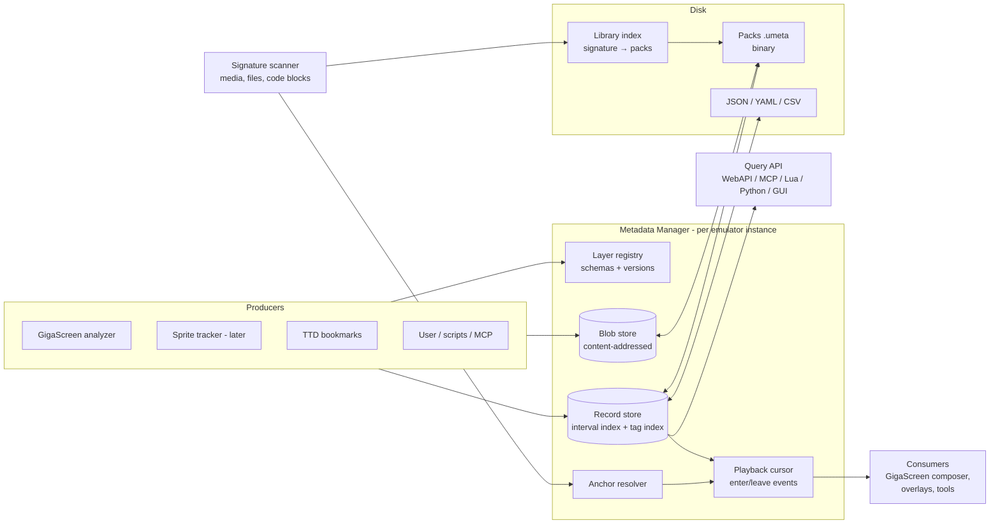
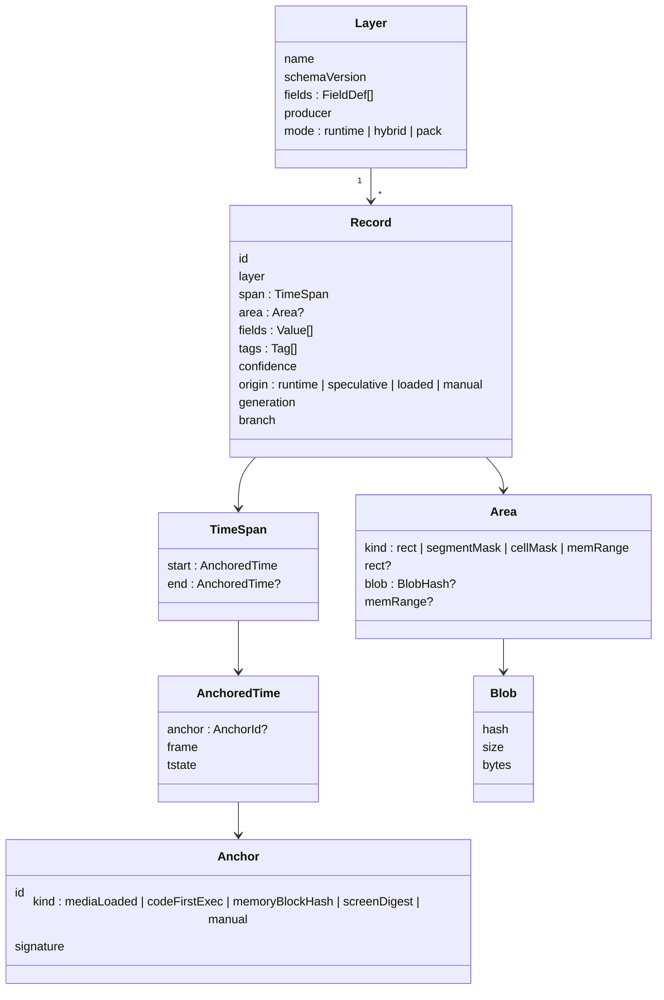
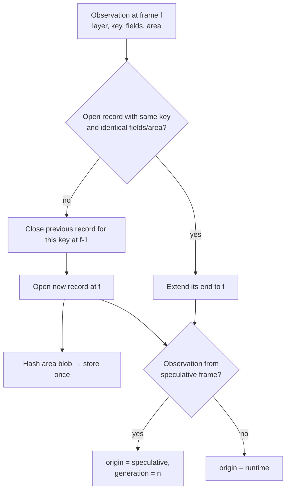
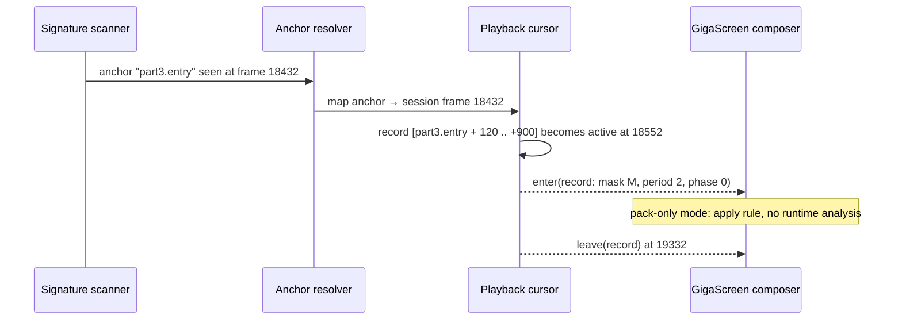
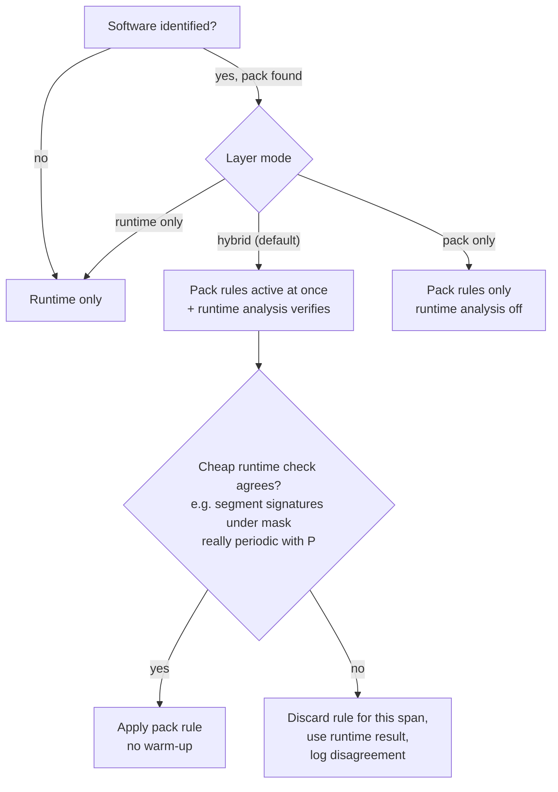

# Metadata Manager — Technical Design

**Created:** 2026-09-27
**Status:** draft for review
**Requirements:** [requirements.md](requirements.md) · **Timing via triggers:** [trigger-integration.md](trigger-integration.md)

---

## 1. Overview



---

## 2. Data model



- **Field types:** bool, int, float, string, enum, vec2, blob reference, array
  of the above. Declared in the layer schema; a newer schema version can add
  fields (older readers ignore them) — never reuse or retype a field.
- **Tags:** interned strings `name` or `name=value`, hierarchical by `/`.
- **Areas:** screen rectangles in picture coordinates; segment masks (32×192
  bits = 768 bytes) and cell masks (32×24 bits) as blobs; memory ranges for
  non-video layers.

---

## 3. Runtime collection

Producers report **observations** per frame. The manager turns them into
records:



- **Key** is producer-defined (e.g. GigaScreen region id) so one producer can
  keep many parallel records open.
- A static GigaScreen picture shown for 40 seconds becomes **one** record with
  one mask blob, not 2000 per-frame entries.
- **Speculative records** (from look-ahead) become `runtime` when the canonical
  run reaches their frames with the same observation, and are deleted when
  their generation is invalidated.
- **Branches:** when TTD rewinds and the user diverges, records after the fork
  point are tagged with the old branch id; the default policy keeps
  `loaded`/`manual` records and drops abandoned `runtime` ones.

---

## 4. Time and anchors

> Anchors and rule switching are implemented with the shared trigger engine —
> see [trigger-integration.md](trigger-integration.md) for the rule forms
> (anchor + offset, on/off triggers, frame-level `while` conditions), the
> additions required from the trigger engine and the prerequisite chain. The
> table below lists the kinds of moments anchors typically capture.

Absolute frame numbers differ between runs of the same demo: loading speed
(fast-load on/off), how long the user waits in a menu, which drive was used.
Pack records are therefore stored as *offset from an anchor*.

| Anchor kind | Detected when | Example |
|---|---|---|
| `mediaLoaded` | a file from the disk/tape with a known hash is loaded into memory | part 3 file loaded |
| `codeFirstExec` | exec trigger at a physical address whose code hash matches | demo part entry point runs |
| `memoryBlockHash` | a memory block reaches a known content hash | effect tables generated |
| `screenDigest` | the screen reaches a known digest | title picture fully drawn |
| `manual` | set by the user or a script | bookmark |



- The runtime producer records its own anchors when a pack is saved: the
  resolver picks, for each record, the most recent anchor seen before it.
- An unresolved anchor (the software took a different path) leaves its records
  dormant — they never fire on the wrong content.

---

## 5. Consumption modes



- **Hybrid** removes warm-up (the rule is known before the effect starts) while
  the cheap check keeps it safe when timing drifts.
- **Pack only** is for curated, verified packs — lowest CPU use and exactly the
  intended presentation.
- Disagreements in hybrid mode are recorded as their own records (layer
  `metadata.disagreements`), which is how packs get improved.

---

## 6. Serialization

### 6.1 Binary pack (`.umeta`)

Chunked, following the `.ttd` precedent (magic, schema version, CRC, zstd):

| Chunk | Content |
|---|---|
| `HEAD` | magic `UMET`, format version, creation info |
| `SIGS` | signatures identifying the software, with weights |
| `ANCH` | anchors |
| `LAYR` | layer definitions and schemas |
| `RECS` | records per layer, columnar (spans, keys, field columns, tag ids), zstd |
| `TAGS` | interned tag table |
| `BLOB` | blobs by hash, zstd |
| `INDX` | offsets for lazy loading |

A Kaitai spec is kept alongside, like `ttd.ksy`.

### 6.2 JSON / YAML

Same content, human-editable. Blobs are either inline base64 or external files
next to the document, referenced by hash. rapidyaml is already vendored (not
yet used in core); JsonCpp is used in automation. CSV export for per-frame
statistics layers.

Example (YAML):

```yaml
format: umeta/1
software:
  title: Across the Edge
  signatures:
    - { kind: image, hash: "sha256:…", weight: 1.0 }
anchors:
  - { id: part3.entry, kind: codeFirstExec, signature: "sha256:…" }
layers:
  - name: gigascreen
    schema: 1
    records:
      - span: { anchor: part3.entry, from: 120, to: 900 }
        area: { kind: segmentMask, blob: "b3:9f2c…" }
        fields: { class: C1, period: 2, phase: 0, mixer: linear-mean }
        tags: [ giga/period=2, verified ]
        confidence: 0.98
        origin: manual
```

---

## 7. Identification

- **Media:** hash of the whole image; per-file hashes from the TRD/SCL catalog
  (`trdoscatalog.cpp`) and tape blocks (`tapecatalog.cpp`), so a demo is found
  even inside a compilation disk.
- **Runtime:** hashes of code blocks at first execution (also used as anchors).
- `SignatureCache` (SHA-256, content-keyed, today used only for ROMs) is
  reused.
- The library index maps signatures to packs; several matching packs are
  offered with scores; the user can pin one.

---

## 8. API sketch

```cpp
class MetadataManager {
public:
    LayerId registerLayer(const LayerSchema& schema);
    void observe(LayerId, ObservationKey, TimePoint, const Fields&, const Area*, Origin);
    void invalidateGeneration(uint64_t generation);           // from look-ahead
    std::vector<RecordRef> query(const Query&) const;          // time, layer, tags, area
    SubscriptionId subscribeActive(LayerId, ActiveCallback);   // enter/leave events
    void addAnchorSighting(AnchorId, TimePoint);
    bool savePack(const std::string& path, PackFormat);        // binary / json / yaml
    bool loadPack(const std::string& path);
};
```

Threading: producers call from the emulation thread (lock-free append into a
per-frame buffer); coalescing and indexing run at frame end; queries from
other threads read a published snapshot.

---

## 9. GigaScreen layer schema (first user)

| Record | Fields |
|---|---|
| `region` | class (C1…C9, B0…B4), period, phase, mask blob, mixer hint, confidence |
| `motion` | region key, per-frame vectors (array), class C6a/C6b/C8/B3 |
| `border` | class, period, stripe shift per frame |
| `sceneCut` | point record |
| `stats` (optional, debug) | per-frame pixel count per class |

---

## 10. Tests

| Suite | Checks |
|---|---|
| `metadatamanager_test.cpp` | layer registration, schema evolution (add field, old reader), coalescing, blob dedup, queries by time/tag/area |
| Speculative lifecycle | confirm on canonical match, drop on invalidation |
| Branch handling | TTD rewind + divergence marks and drops abandoned runtime records |
| Anchors | resolution with shifted absolute timelines; unresolved anchors stay dormant |
| Serialization | binary ↔ JSON ↔ YAML ↔ binary lossless; version skew; fuzzed input never crashes |
| Identification | image, per-file-in-compilation, code-block signatures |
| Playback | enter/leave events at exact frames; hybrid disagreement path |
