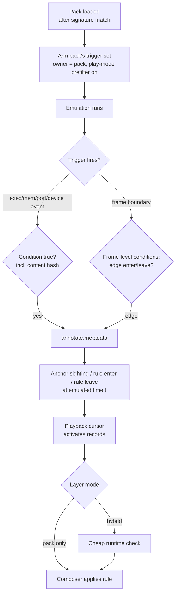
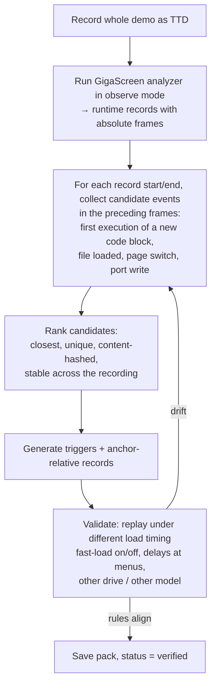
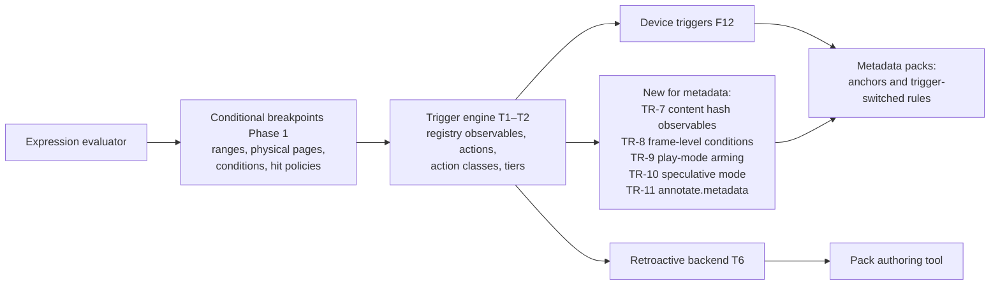

# Metadata Manager — Timing via Triggers

**Created:** 2026-09-27
**Status:** draft for review
**Requirements:** [requirements.md](requirements.md) MD-5, MD-16..MD-20
**Builds on:**
[conditional breakpoints](../2026-08-17-conditional-breakpoints/design.md) (Phase 0 shipped, Phase 1 not started),
[expression evaluator](../2026-08-26-expression-evaluator/design.md) (not started),
[capability registry and trigger engine](../2026-09-21-roadmap/02-capability-registry-and-triggers.md) (proposal),
[breakpoint enhancements](../2026-08-26-breakpoint-enhancements/design.md) (not started)

---

## 1. Why triggers

Frame numbers differ between runs of the same software (fast-load on/off, time
spent in menus, drive used). Pack records therefore cannot say "frame 18552".
They say **"when this happens in the program"** — which is exactly what the
planned trigger engine expresses: *event + condition + actions + policy*.

Two ways a pack uses triggers:

1. **Anchor + offset.** A trigger marks a moment (e.g. the entry point of a demo
   part runs); records count frames from it: `part3.entry + 120 … + 900`.
2. **Condition directly.** A record is switched on and off by conditions, with no
   frame counting: "enable while page 7 is shown on alternate frames and the
   effect's table at `#C000` has hash H; disable when execution enters the next
   part".

Both are needed: anchors suit effects that are timed by the program's own
frame counter; direct conditions suit effects whose length depends on the user
(a menu, a game level).

---

## 2. What the metadata layer needs from the trigger engine

The roadmap trigger model already provides most of it. Items marked **new**
are additions this feature requires.

| # | Need | Provided by | Status |
|---|---|---|---|
| TR-1 | Exec / memory / port events, address ranges, physical-page addressing (`ram3:0000`) so an entry point is found wherever the page is mapped | conditional breakpoints F2, F4 | designed |
| TR-2 | Condition expressions over registers, memory, paging, T-state, frame | expression evaluator + `bpcondition` F1 | designed |
| TR-3 | Hit policies: once, Nth, skip N | F5 | designed |
| TR-4 | Device events: tape block loaded, disk sector read, FDC command, frame start, INT, paging change | F12, roadmap 02 §3.1 | designed (phase 2) |
| TR-5 | Non-pausing actions; action classes (observe / **annotate** / mutate / control / delegate) with defined behavior on replay | roadmap 02 §4–§5 | proposed |
| TR-6 | Retroactive backend: evaluate the same trigger over a TTD recording | roadmap 02 §7 | proposed |
| TR-7 | **Content observables:** `memhash(addr, len)` and `physhash(ram3:0000, len)` — code/data identity, so an entry point is recognized by its bytes, not only its address | **new** | cost class "deferred": evaluated only after the address trigger matched, once per hit |
| TR-8 | **Frame-level (level-sensitive) conditions:** a condition sampled once per frame at the frame boundary, with enter/leave edges — no per-instruction cost | **new** | evaluated in `CompleteFrame`; ideal for "while X holds" rules |
| TR-9 | **Play-mode arming:** triggers active **without** the debugger. Today the exec hook runs only when `cpu.isDebugMode` (`z80.cpp:240`) and memory hooks only on the debug memory interface | **new** | an armed-trigger prefilter (PC bitmap, the Phase 0 two-load check) switched on only while play-mode triggers exist; cost budget per the conditional-breakpoints performance doc |
| TR-10 | **Speculative mode:** in the Look-Ahead shadow run, observe/annotate actions fire and are tagged speculative; control and mutate actions are suppressed | **new** | same mechanism as the replay-mode flag (roadmap 02 D-3) |
| TR-11 | **Metadata action:** `annotate.metadata` — emit an anchor sighting, or enter/leave a pack rule | **new** action | annotate class: idempotent on replay (dedup by trigger id + time) |
| TR-13 | **Cheap frame-level observables** (one check per frame instead of per instruction): PC sampled at the interrupt (where the main loop is), HALT address, paging state, page content hash at the frame boundary. One of the optimization techniques collected in [optimization-ideas.md](../2026-09-27-zxdlss-gigascreen/optimization-ideas.md); v1 implements the naive exec triggers first and measures | **new** (idea) | frame-granular precision suffices for GigaScreen |
| TR-12 | Trigger sets owned by a pack: loaded and unloaded together, namespaced, visible in the debugger's trigger list as read-only | roadmap 02 §4 `owner` + generation | designed |

---

### 2.1 Cost policy (decided)

| DLSS | Software recognized | Cost |
|---|---|---|
| off | — | zero: no triggers armed, prefilter off, no plane B, no raw copy |
| on | no | runtime analysis; no pack triggers |
| on | yes, pack loaded | pack triggers (≈ 1 % of one core while exec triggers are armed) + cheap verification instead of full analysis |

v1 implements exec triggers naively and measures; cheaper forms (TR-13) are
optimization ideas, not v1 scope.

## 3. Pack rule forms

```yaml
triggers:
  - id: part3.entry
    event: exec
    at: ram3:0000                       # physical page, any slot
    condition: physhash(ram3:0000, 256) == 0x9F2C41D07A3B11E5
    policy: once_per_load               # re-arms if the part is loaded again
    actions: [ { annotate.metadata: { anchor: part3.entry } } ]

  - id: part3.leave
    event: exec
    at: ram4:0000
    condition: physhash(ram4:0000, 256) == 0x51C0E2A9D4F37B20
    actions: [ { annotate.metadata: { anchor: part4.entry } } ]

  - id: giga.flip.active                # level-sensitive, sampled once per frame
    event: frame
    condition: SHADOW != SHADOW@prev && (0xC000).w == 0x1A2B
    actions: [ { annotate.metadata: { edge: true } } ]

layers:
  - name: gigascreen
    records:
      # form 1: anchor + offset
      - span: { anchor: part3.entry, from: 120, to: 900 }
        area: { kind: segmentMask, blob: "b3:9f2c…" }
        fields: { class: C1, period: 2, phase: 0 }

      # form 2: switched by triggers, no frame counting
      - span: { on: part3.entry, off: part3.leave }
        area: { kind: segmentMask, blob: "b3:77aa…" }
        fields: { class: C2, period: 3 }

      # form 3: active while a frame-level condition holds
      - span: { while: giga.flip.active }
        area: { kind: rect, rect: [0, 0, 256, 192] }
        fields: { class: C1, period: 2 }
```

`SHADOW@prev` (value of an observable at the previous frame boundary) is part
of the frame-level condition form TR-8.

---

## 4. Runtime flow



---

## 5. Authoring packs: finding good triggers automatically

A human should not have to hunt entry points by hand. With a whole-demo TTD
recording and the retroactive backend (TR-6):



- "First execution of a new code block" comes from the TTD coverage index.
- Validation replays with changed timing are what prove the pack is
  timing-independent; they are part of the pack's test suite.

---

## 6. Prerequisite chain



TR-8 (frame-level conditions) needs only the expression evaluator and a call
from the frame boundary. It can ship before the full trigger engine and already
covers many rules, so it is scheduled first.

---

## 7. Tests

| Suite | Checks |
|---|---|
| Play-mode arming | exec trigger fires without debug mode; miss-path cost within budget; zero cost with no armed triggers |
| Content hash observables | correct over paged/physical ranges; evaluated once per hit |
| Frame-level conditions | enter/leave edges at exact frames; `@prev` values |
| Speculative mode | annotate actions tagged speculative in the shadow run; no pause/mutate |
| Timing independence | the same pack aligns under fast-load on/off, different menu delays, different drive |
| Replay | annotate actions idempotent during TTD replay/seek |
