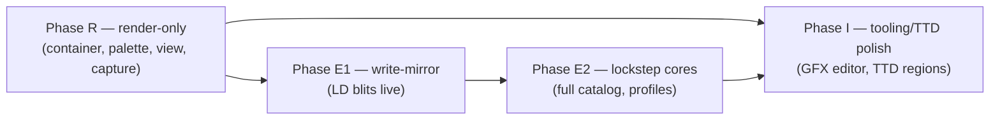

# unreal-ng Integration Analysis — Spec256 Support

**Scope:** how unreal-ng (core, configs, renderers, debugger, TTD, automation,
tests) could support Spec256: the format, the execution model, and the
content. Companion docs: [spec256-format-and-mechanics.md](spec256-format-and-mechanics.md)
(the spec), [spec256-emulator-survey.md](spec256-emulator-survey.md) (how
zxpoly/GZX/oozx do it). Extension-point file/line references were verified
against the tree at `47c40db2`.

## 1. Executive summary

Spec256's engine model (lockstep shadow execution) is foreign to every video
extension unreal-ng has today (ATM/Profi/P16 are port-latched VRAM modes), so
the integration splits cleanly into an **easy 80 %** and a **hard 20 %**:

- **Easy:** container loading, palette, rendering, capture/screenshot, model
  plumbing, automation reporting, tests. The GFX view is just a different
  fetch path over a 256-entry palette — nothing about the beam, timing or
  framebuffer geometry changes.
- **Hard:** the **shadow-execution engine** — making every Z80 memory
  operation simultaneously update 8 colour-plane bytes (including RMW
  opcodes and per-game correction profiles) — and **TTD capture** of a
  512 KB shadow RAM + 8 shadow register files that no Z80 address or port
  touches.

Two delivery tracks exist and should be decided explicitly:

| Track | What | Depends on |
|:--|:--|:--|
| **A. Standalone `SPEC256` model** | own model + engine, independent of ZX-Poly | nothing (can start now) |
| **B. ZX-Poly Phase 4** ([2026-09-27-zxpoly](../2026-09-27-zxpoly/) §4) | 8 GFX cores as satellites of the ZX-Poly multi-CPU scheduler (exactly zxpoly's own architecture) | ZX-Poly Phases 1–2 (PLAN #43) |

Recommendation (details in §3): do **Track A in three phases** — render-only
first (Phase R, genuinely small), then write-mirroring (Phase E1), full
lockstep later — and keep **Track B as the long-term fidelity endpoint**: if
ZX-Poly lands, Spec256 should migrate onto its scheduler rather than maintain
a second multi-core engine. TTD design assumes the [TTD v2](../2026-09-25-ttd-v2-migration/)
**V1 memory regions** land first (PLAN #40; same sequencing rule the plan
already applies to TSConf/ZX-Poly).

## 2. What Spec256 is *not* (anti-scope)

- Not a port-decoder feature: **no Z80-visible activation** exists; software
  never knows the mode is on. A `PortDecoder_Spec256` would decode nothing
  beyond standard 48K/128K behaviour.
- Not a new raster geometry: 256×192, ZX timings, ZX contention — the
  raster descriptor can be byte-identical to ZX.
- Not attribute-based: the visible surface is **6144 bitmap bytes + 8×6144
  colour bytes** (98 304 bytes of GFX shadow for the screen area, of which
  the 49 152 colour bytes of $4000–$57FF pixels drive the display); the
  classic attribute file plays only an optional mixing role.

## 3. Design decisions

### D1 — Machine representation: dedicated model `SPEC256`

A `MEM_MODEL` entry (`MM_SPEC256`, short name `SPEC256`, 48K default; later a
128K variant or `AvailRAMs={48,128}`) rather than an `EmulatorState` flag:

- everything keys off the model: config folder `data/configs/spec256/`,
  `PortDecoder::GetPortDecoderForModel` + `IsModelSupported`
  (`core/src/emulator/ports/portdecoder.cpp:78-140`, `:56-76` — both must be
  updated, comment "Keep both in sync"),
  `Config::IsModelCreatable` (`core/src/emulator/config.cpp:734-759`),
  WebAPI/MCP/CLI model lists flow automatically (parity rule).
- The classic-ULA ↔ GFX **view toggle** (the user's F2) is then a boolean in
  machine-owned state (D4), not a model switch.
- Alternative rejected: EmulatorState-flag-only. Breaks the creatable-models
  contract (a 48K emulator suddenly carrying a 512 KB sidecar and different
  TTD state) and the machine-state isolation rule (machine-specific state
  lives in machine-owned classes, not shared `EmulatorState`/`MM_*`
  branches).
- Naming risk to check at implementation time: the registry already has
  short-name collisions-prone entries; `SPEC256` is free today.

### D2 — Execution engine (the hard 20 %) — three options

| Option | Mechanism | Fidelity | Cost | Notes |
|:--|:--|:--|:--|:--|
| **E0 render-only** | shadow RAM loaded from container, never updated by execution | static screens (title screens of all games) | ~0 CPU | also the base for viewer/analysis tooling |
| **E1 write-mirror** | hook Z80 memory **writes**: plain `LD (nn),r`-class stores replicate 8 plane bytes from a shadow of the source register | most sprite blits (LD-based) | small | fails XOR/RMW-drawn games (Dizzy…) without §6 corrections |
| **E2 lockstep cores** | 8 satellite `unreal-z80` instances aligned to the master (zxpoly/oozx model) + `zxpAlignRegs` profiles + leveled logicals | full catalog | ~9× instruction issue | reuses ZX-Poly Phase-1 scheduler if Track B; turbo headroom exists |

There is a tempting **E2′ "SIMD shadow inside the main core"** (one extra
8-plane-wide register file updated by the same micro-ops, no extra cores) —
~1.3–2× cost instead of ~9×, but it reaches deep into `unreal-z80` opcode
implementations and duplicates per-opcode semantics the 8-core option gets
for free from real cores. Keep E2′ as a spike question, don't commit to it.

**Recommended sequence: E0 → E1 → E2**, each phase shippable and testable
against the local fixture corpus (zxpoly test ZIPs) plus public games. E1
covers the *majority of the catalog* (sprite games using LD blits); E2 is
gated on demonstrated demand, exactly as [unreal-ng-port-analysis.md](../2026-09-27-zxpoly/unreal-ng-port-analysis.md)
gates ZX-Poly Phase 4.

### D3 — GFX shadow RAM placement: machine-owned sidecar + TTD region

- A `Spec256State` machine-owned object (pattern: TSConf/GS device state)
  holds: 512 KB–1 MB shadow RAM, shadow ROM planes, palette selection,
  view flag, loaded-container metadata, correction-profile settings.
- **Not** inside `class Memory`'s page array: Z80 addresses never reach it,
  and `RAMPageAddress`-based consumers (screen digest, memory viewer) must
  not silently scan it. Memory writes land in the shadow via the engine hook
  (D2), not via banking.
- TTD: register the shadow RAM as a **TTD v2 memory region** (PLAN #40-V1)
  rather than a monolithic serializer blob — 512 KB per checkpoint is
  unaffordable; region deltas are the design's whole point. See §4.

### D4 — Video mode: new `M_SPEC256` enum + `ScreenZX::Draw` branch

Follow the **Pentagon P16 precedent** (retired PLAN #21: decoder + mode enum
+ state reporting + TTD + tests) rather than inventing a new Screen subclass:

- `VideoModeEnum::M_SPEC256` before `M_MAX` (`core/src/emulator/video/screen.h:36-66`);
  `rasterDescriptors` entry identical to ZX's (`screen.h:436-483`).
- No port detector exists — mode switching is driven by the view flag:
  flag change → `pScreen->InitRaster()` → `DetectVideoMode` case for
  `MM_SPEC256` returning `M_SPEC256`/`M_ZX48` per the flag
  (`core/src/emulator/video/screen.cpp:235-265`).
- Fetch/render: a `ScreenSpec256` **helper** dispatched from
  `ScreenZX::Draw` exactly like `ScreenAtm`/`ScreenProfi`
  (`core/src/emulator/video/zx/screenzx.cpp:711-750`) — ZX beam, ZX
  contention, per-pixel index = 8 plane bits, then palette + optional
  mixing options (UpColorsMixed etc.).
- `Screen::AllocateFramebuffer` allowlist case (`screen.cpp:831-852`);
  `GetLineGeometry` (`screen.cpp:1129-1156`) = ZX values.
- `GetActiveSurfaceRAMPages` (`screen.cpp:1158-1204`): the GFX surface has
  **no RAM pages** — return the pages the *bitmap* machine displays (5/7,
  ZX semantics) and let the mode endpoint (D8) describe the shadow surface
  separately; forcing fake page numbers would poison `/state/screen/digest`.

### D5 — Container/snapshot loading

- New loader for the Spec256 ZIP (sna + gfx + gfn + gfa/gfb + bnn + pal +
  cfg), placed with the other snapshot loaders; on load: create/reset a
  `SPEC256` emulator, decompress members via the plane codec, seed the
  sidecar, apply `.cfg`, switch view on. Save-back: repack via the inverse
  codec (zxpoly `packGfxData` semantics).
- `.sna` PC quirks ($FFxx trampolines) — preserve, don't "fix".
- `.ezx` (EmuZWin) and FPGA `.256` (karabas) formats: optional later import
  paths, not phase-0.
- Loose-file sets (no ZIP) should also load (original emulator style).

### D6 — Palette

- Ship the default 768-byte table **regenerated from a clean source** (GZX
  `sp256.pal` text file or EmuZWin's `Bmp2RawBk256.dpr` Delphi source) —
  zxpoly's binary resource is GPL-3-licensed data and the ZX-Poly analysis
  already flags GPL hygiene as a rule (reimplement from documented
  behaviour; verify fixture licensing before committing assets).
- `.pal`/`.pnn` override support at load; runtime mixing options as
  renderer settings (INI + WebAPI-exposed), defaults matching EmuZWin
  (`UpColorsMixed=64`, `HideSameInkPaper=1`).
- RGB-triplet byte order and pixel bit order are the two known
  contradictions — both are fixture-verified on day one of implementation
  (§5 open questions).

### D7 — TTD

- New `ttd::PeripheralId` entry (append-only enum,
  `core/src/debugger/ttd/ttdserializable.h:42-59`) + `TTDSpec256State`
  serializer for the *small* state: view flag, palette selection, profile
  options, engine version — `static_assert(sizeof(...))`-style POD like
  `TTDAtmPaging` (`core/src/debugger/ttd/ttdatmpaging.h:36-72`).
- The **512 KB shadow RAM must not** ride in the serializer blob; it belongs
  in TTD v2 memory regions (#40-V1). Interim (pre-V1) fallback: hash-only
  participation + capture at coarse intervals, accepting seek rebuild cost.
- Register-alignment profiles are per-container constants (from `.cfg` /
  app-base DB) — deterministic inputs, recorded once at session start
  (feeds #40-V3 "determinism inputs in the file"), not per-checkpoint.
- E2 only: 8 shadow register files. Under lockstep they are a deterministic
  function of (main CPU trace + initial shadow RAM + profile) — capture
  hashes for divergence detection, not full files; full recompute happens
  naturally during seek replay.
- The known `atmPalette` capture gap (chipset capture misses ATM's 16-cell
  palette — see `ttdcheckpoint.cpp:132-232`) is the cautionary precedent:
  the Spec256 palette/selection must be inside *some* serializer from day
  one or seeks silently desync colour.
- Tests: add `SPEC256` to the contract test's model list
  (`core/tests/debugger/ttd/ttdmodelstatecontract_test.cpp:52`); the
  6912-hardcoded VRAM hash helpers (`ttdseekexhaustive_test.cpp:68`)
  stay ZX-only unless Spec256 joins the divergence corpus — a
  Spec256-specific corpus entry hashing the 6144 bitmap bytes *and* the
  49 152 shadow bytes of the visible screen is more useful.

### D8 — Debugger, viewers, automation

- **DeviceScreen / capture / GIF / screencap**: already descriptor-driven —
  work unchanged once D4 lands (`screencapture.cpp:40-113` uses
  `rasterDescriptors`; palette export needs a 256-entry path next to
  `GetRGBAPalette16`, `screen.h:791-794`).
- **unreal-screen-viewer**: replace the 6912/6144 hardcodes
  (`ScreenViewer.h:122-127`, decoder at `ScreenViewer.cpp:253-313`) with
  mode-aware decoding (query mode + palette; Spec256 branch reads shadow
  RAM through the sidecar's export). Note this hardcode is the same debt as
  PLAN #42a's `/state/screen` "standard" literal — fix once, share.
- **Debugger GFX tooling** (the EmuZWin GFX-Editor angle, longer term):
  shadow-RAM hex view, plane/palette painter, plane-diff view; all of it is
  "memory R/W + screen verify" automation unreal-ng already has — this is
  the ZX-Poly Phase-3 colorizer story transplanted, and a genuinely
  differentiating feature (no modern emulator has it).
- **WebAPI/MCP/CLI parity**: model appears automatically (D1); add an
  `M_SPEC256` case to `/state/screen/mode`'s layout switch
  (`core/automation/webapi/src/api/state_screen_api.cpp:180-410`) —
  bpp=8, colours=256, `memory_layout` describing bitmap pages + shadow
  surface (12288 addresses × 8 = 98 304 bytes for the screen third); a
  `gfx` read path for shadow memory (digest-first); MCP forwards, never
  recomputes (`mcp-tools.cpp:167-178`); update the model-name string in
  `mcp-tools.cpp:121` and OpenAPI/doc literals.

### D9 — Configuration

`data/configs/spec256/unreal.ini` cloned from `spectrum48`
(`data/configs/spectrum48/`): `HIMEM=SPEC256`, `RAMSize=48`; `[ULA]` ZX
timings; palette/mixing defaults; ROM = standard 48K ROM (`ROM::GetROMFilename`
already falls through by model — verify, else add a case,
`core/src/emulator/memory/rom.cpp:66-127`). Timing defaults switch cases in
`Config::ApplyModelTimingDefaults` (`config.cpp:855-997`). `128k` variant
reuses `spectrum128` timing + 128K RAM + 1 MB shadow.

### D10 — Performance

- E0: zero marginal CPU. E1: one extra shadow-store per memory write (~5–10 %
  frame cost, in line with TTD stream overheads). E2: 8 extra cores ≈ 9×
  instruction issue — comparable to today's turbo factor (turbo ≈ 2.7× is
  *rendering*-bound, not issue-bound; headroom exists, but benchmark before
  promising real-time E2 + TTD recording concurrently).
- Shadow store pattern (8 sequential bytes at `page*0x20000 + off*8 + p`) is
  prefetch-friendly; keep planes interleaved per address exactly like zxpoly
  so a blit's 8 stores stay in one or two cache lines.

## 4. Phased plan

| Phase | Contents | Exit criteria |
|:--|:--|:--|
| **R** (≈1–2 wk) | `MM_SPEC256` + config + decoder factory case; ZIP/loose loader + plane codec; `M_SPEC256` view + `ScreenSpec256` helper; default palette + `.pal` override; screenshots/GIF; `/state/screen/mode` case; codec tests vs zxpoly fixtures | title screens of Jetpac/Renegade/TreeWeeks render pixel-exact vs zxpoly captures; classic-ULA toggle lossless |
| **E1** (≈1–2 wk) | shadow-register file for the source operand of stores; write-mirror hook in the memory-write path (pattern: memory-tracking/RWX overlay hooks); coverage report (which catalog games need RMW) | an LD-blit game (e.g. Chuckie Egg class) animates correctly for minutes; no shadow leak into ZX memory |
| **E2** (defer; ≈2–3 wk, ≈ zxpoly Phase-4 estimate) | 8 satellite cores via the multi-CPU scheduler (Track B if ZX-Poly lands, else Track A local); `zxpAlignRegs` + leveled logicals + XOR-buffering; port the `spec256appbase.txt` profile DB as fixture data; 128K variant | the 3 local fixture games + 5 public titles through zxpoly-accuracy A/B; divergence corpus green |
| **I** (opportunistic) | TTD region for shadow RAM (#40-V1 consumer); GFX plane viewer/painter in Qt debugger + WebAPI `gfx` reads; `.bnn` backgrounds + probe palettes; `.ezx` import; MCP `unreal://machine/spec256` resource | TTD seek leaves colour state exact; one game recoloured end-to-end via automation |

Phase R+E1 is a **self-contained, low-risk deliverable** that makes the
majority of the catalog viewable and mostly playable; E2 is explicitly
gated (same discipline as ZX-Poly Phase 4).

## 5. Extension-point checklist (per area)

1. **Registry**: `MEM_MODEL` (`core/src/emulator/platform.h:306-326`) + row in
   `mem_model[]` (`core/src/emulator/config.h:47-66`).
2. **Factory**: `PortDecoder_Spec256` (standard 48K/128K decode, TTD
   declaration, no new ports) + both factory functions
   (`portdecoder.cpp:56-76`, `:78-140`).
3. **Config**: `data/configs/spec256/unreal.ini`; timing cases
   (`config.cpp:855-997`); folder mapping auto-derives (`config.cpp:701-731`).
4. **Video**: mode enum + descriptor + `DetectModeSpec256` case
   (`screen.cpp:235-265`); `ScreenSpec256` helper + `ScreenZX::Draw`
   dispatch (`screenzx.cpp:711-750`); framebuffer allowlist
   (`screen.cpp:831-852`); 256-palette export.
5. **Memory**: no `Memory` changes (sidecar per D3); engine hooks at the
   existing write path (same seam the RWX-overlay/memory-tracking uses).
6. **TTD**: `PeripheralId` + `TTDSpec256State` serializer + decoder
   declaration (`portdecoder.h:581-609`; registry wiring
   `timetravelmanager.cpp:1063-1140`); contract-test model list; shadow RAM
   region once #40-V1 lands.
7. **Viewers/automation**: screen-viewer mode branch; `/state/screen/mode`
   case; MCP model string + forwarding; OpenAPI/doc updates
   (`docs/emulator/design/control-interfaces/command-interface.md` memory-layout
   section).
8. **Tests**: `core/tests/emulator/video/spec256_videomode_test.cpp`
   (atm_videomode_test pattern), codec round-trip test vs fixture ZIPs,
   `core/tests/emulator/machines/spec256/` boot test (Phase R: load → render
   → digest); fixtures from zxpoly test resources **after license check**.

## 6. Risks

| Risk | Severity | Mitigation |
|:--|:--|:--|
| Bit/triplet order contradictions (pixel MSB-first vs LSB-first claims; RGB vs BGR) | High (silent wrong colours) | fixture-verify on day one; codec isolated behind one function |
| Per-game profiles are load-bearing (no profile → wrong sync) | High | ship the profile DB as data; per-container `.cfg` overrides; log profile application |
| TTD without shadow-region support = 512 KB blobs or colour desync | High | gate Phase I on #40-V1; hash-only interim |
| GPL contamination (zxpoly code/palette/fixtures) | Medium | clean-room from docs + GZX/EmuZWin-source palette; regenerate fixtures or verify licensing |
| Scope creep into a second multi-core engine before ZX-Poly decides | Medium | E2 deferred until Track A/B decision; Phase R has no engine at all |
| Performance of E2 + TTD concurrently | Medium | benchmark in spike; turbo; region deltas |
| Content licensing (games under copyright) | Low | same handling as Spec256-Games repo: ship `.gfx` sets only where legal |

## 7. Open questions

1. Pixel bit order: MSB-first (zxpoly `1<<(7-p)`) vs the web-correlation
   anomaly — decide by fixture diff (Jetpac title screen).
2. Palette triplet byte order across EmuZWin `.pal` files vs zxpoly reader.
3. Does any catalog title actually *require* ROM planes (`.gfa/.gfb`) to look
   right (zxpoly loads them; unknown how load-bearing)?
4. Are the $FFxx SNA PC trampolines needed for correct behaviour or just
   loader convention? (Compare zxpoly's PC re-fetch logic,
   `FormatSpec256.java:289-312`.)
5. E2′ SIMD-in-core vs 8 satellite cores — only answerable with a spike;
   default plan assumes satellites (Track B alignment).
6. Should the view toggle be exposed as a WebAPI control (it is a *user*
   action, not machine state)? Parity answer: yes, one endpoint, all
   surfaces forward to it.
