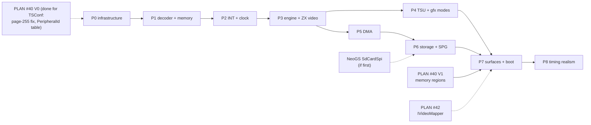

# TSConf — Implementation Plan (phases, test-first work lists)

**Created:** 2026-09-27 · companion to [technical-design.md](technical-design.md)
(the *how*) and [hardware-spec.md](hardware-spec.md) (the *what*). Every work
item here names the failing test that is written **first**, the expected
values it asserts (derived from hardware-spec, section cited), and the code it
drives. Tests are named after the file under test (`<sourcefile>_test.cpp`). Test conventions: [core/tests/README.md](../../../core/tests/README.md)
(CUT pattern, `TestWait`, < 50 ms per test, `EnableTurboMode()` on boot-bound
tests, scratch files via `TestPathHelper::GetUniqueTestScratchPath()`).

## 0. How to use this plan

- **Red → green → refactor per item.** A PR/commit covers one or more whole
  items; its tests are in the same change.
- **Test IDs** (`MEM-3`, `DMA-7` …) are stable; put the ID in the gtest name
  (`TsConfMemory_Test.MEM3_MappedModeGroupLayout`) so a failure maps to this
  document and to the spec section.
- **Other machines stay bit-identical.** Phase 0 touches shared code; the
  existing suites (video goldens, INT timing, memory, TTD contract) are the
  regression net and must stay green without re-baselining.
- **Quality gate per phase** (AGENTS.md): `ninja -C cmake-build-agent-release`
  with zero warnings, `core-tests` green, docs links valid.
- Hardware facts are never "decided" in a test — if a test needs a fact that
  hardware-spec does not state, fix the spec first (with evidence), then the test.

## 1. Dependencies and order

Both PLAN #40 V0 items TSConf depended on are done: the unique `PeripheralId`
table (P1 appends id 16 to it - 13/14 are the +3's, 15 is `EvoSdCard`, which
TSConf reuses for its SD card) and the page-255 sentinel fix (`3a6eabc6`), so
vdos's RAM page 0xFF is fully tracked by TTD. V1
and #42 are only needed by P7; P0-P6 can proceed without them. P4 and P5 are
independent after P3.

Size legend: **S** ≤ 1 day, **M** 2-4 days, **L** ≥ 1 week (single developer
with agent assistance; for sequencing, not commitments).

## Phase 0 — Shared infrastructure (no TSConf behavior yet) · M-L

Goal: every generic extension point exists and is proven not to change any
existing machine.

**Built on branch `tsconf-infra` (2026-09-29): INF-1, INF-2, INF-5; INF-3 measured (A/B, within noise after the per-step gate)**
(PLAN #60(a) plus INF-5). The M1 hook (INF-4) was already on master (#55 E3).
What changed from the v1.0 plan:
- INF-2: the write intercept is a **write-only host bus overlay**
  (technical-design §3.5 item 2), not a per-bank flag in the plain write path;
  several overlays can be installed at once (`Core::AddBusOverlay`).
- INF-3: no gate is needed on the plain path (it is untouched: the overlay
  interfaces are selected only while an overlay is installed); the existing
  `hostbusoverlay_benchmark.cpp` covers the overlay path.
- INF-1: `IInterruptSource` has no `OnFrameStart`; the rollover comes through
  `IMachineStepHook::OnMachineFrameRollover`. It has `OnReti()` (Sprinter).
- INF-4: `IMachineM1Hook::BeforeMachineM1/OnMachineM1(address)` - the opcode
  comes from a debug read, not a hook argument.
INF-6 to INF-10 done 2026-09-29 (branch `tsconf-isolation`): phase 0 is complete; phase 1 starts with the decoder.

| ID | Test first (file) | Asserts | Drives |
|:--|:--|:--|:--|
| INF-1 ✅ | `cpu/int_test.cpp` (`InterruptSource_Test`) | with a fake `IInterruptSource` registered: INT is taken exactly when `IsIntAsserted(t)` is true and `iff1`; IM2 fetches `(I<<8) \| AcknowledgeInterrupt()`; EI shadow and prefix respected; RETI (and mirrors) call `OnReti`, RETN does not; without a source every existing INT test is unchanged | §3.4 interface + `Z80::ProcessInterrupts` branch |
| INF-2 ✅ | `cpu/core_test.cpp` | a write-only overlay sees writes in its window **after** the byte is stored and never a read, in fast and debug mode; two overlays chain in install order; one alone is called directly; at most 4 | §3.5 intercept |
| INF-3 ✅ | `core/benchmarks/emulator/memory/hostbusoverlay_benchmark.cpp` (`BM_HostFrame_*`) | A/B done 2026-09-29 ([performance-guidelines.md](../../guidelines/performance-guidelines.md) §5): the first version's two per-instruction tests cost 0-1 %; after moving them behind the per-step gate `EmulatorContext::stepWork` the classic machines are within noise of the code without the feature (−0.8 … +0.2 %) | gate for INF-1 / INF-2 / INF-5 |
| INF-4 | `cpu/z80_test.cpp` (new cases) | with `CF_MACHINEM1` set and a fake hook: `OnM1(pc, opcode)` called once per instruction with the right opcode (incl. prefixed: once per M1 cycle — ED xx gives two calls); not called when flag clear | §3.6 |
| INF-5 ✅ | `cpu/z80_test.cpp` (`MachineStepHook_Test`) | a registered `IMachineStepHook` runs after every CPU step with the reached `t`, **also when `_renderThisFrame` is false** (turbo decimation), and gets `OnMachineFrameRollover(frame)` once per frame | §3.8, `Z80::OnCPUStep`, `Core::AdjustFrameCounters` |
| INF-6 ✅ | `tsconfisolation_test.cpp` | scan of `core/src` finds no forbidden token outside the allowlist (§3.3) — green since INF-7 (2026-09-29), file `core/tests/emulator/machines/tsconf/tsconfisolation_test.cpp` | enforcement |
| INF-7 ✅ | existing suites + `tsconfisolation_test` green | move `ts`/`cram`/`sfile`/`tsline`/budget/`clut`/`r_ts` out of shared structs; delete the `z80.cpp:1197-1210` block and the undefined `ts_*_int` declarations; remove `state.ts` reads from `DrawZX`/`DrawBorder`/`DrawScreenBorder`; ROM loader dispatch; all existing video goldens unchanged | §3.3 — done; deviations: `clut` stays shared (the ATM drawers and tests read it), the ROM loader dispatch moves to phase 1 ROM-1 |
| INF-8 ✅ | `config_test` (model lookup) | `"TSCONF"` and `"tsl"` resolve to `MM_TSL`; unknown names still fail | D3 alias — done 2026-09-29: `Config::model_aliases` (`FindModelByShortName`, also config `HIMEM`); tests `ConfigModelLookup_Test`, `Config_Test.TsconfConfigHimemSelectsTsl` |
| INF-9 ✅ | `config_test` (timing) | `MM_TSL`: 224 T/line, 320 lines, 71680 T/frame, `frame_duration_us == 20480` | §3.17 — done 2026-09-29: `MM_TSL` in the canonical-geometry switch; test `Config_Test.TsconfCanonicalTiming` |
| INF-10 ✅ | TTD contract test | `PeripheralId::TsConfPaging == 16`, `TtdClockUnits() == 4`, `ttd.ksy` enum matches | §3.13 step 1 (appends to the unique PeripheralId table) — done 2026-09-29 for the table: `PeripheralId::TsConfPaging = 16`, `ttd.ksy`, test `TTDPeripheralIdTable_Test` (checks every id's number and its ttd.ksy entry); `TtdClockUnits() == 4` moves to phase 1 with the decoder |

Exit: all INF tests green; the full suite and the benchmark gate unchanged;
`TSL` still not creatable.

## Phase 1 — Port decoder, memory, reset → creatable · L

**Built 2026-09-30 (branch `tsconf-phase1`).** `TsConfState`
(`platforms/tsconf/tsconfstate.h`, a register file indexed by register number
plus the latches; the TTD blob is the struct), `TsConfMemory`
(`memory/tsconf/`), `PortDecoder_TSConf` (`ports/models/portdecoder_tsconf.*`),
the TTD serializer `TTDTsConfState` (`debugger/ttd/tsconf/`), the power-on CRAM
table from the firmware's `video_cram.mif` (`platforms/tsconf/tsconfcraminit.h`).
Tests in `core/tests/emulator/machines/tsconf/` (`portdecoder_tsconf_test`,
`tsconfmemory_test`, `ttdtsconfstate_test`; fixture `tsconffixture.h`), plus
`TSL` in `TTD_ModelPageBounds_Test` (MEM-6) and `EmulatorManager_Test`.
Deviations and open items:
- **REG-2**: STATUS `VDAC_VER` is the constant 0 of the standard `quartus`
  build (no VDAC, Nemo IDE fitted); a `TS_VDAC` config key comes with the VDAC curves.
- **MRG-1 deferred**: no `modelsregression_test` golden row; the bank map is
  covered by MEM-1…6 and P7F-1…7.
- **Write-protected W0 RAM** (`W0_WE = 0`): the stores go to the trash page but
  the bank stays that RAM page for TTD (reads, execution and write cycles are
  that page's; replay re-executes) - technical-design §3.5 item 1.
- **Cache**: filled only while any window has the cache enabled; entries the
  hardware fills while it is off are not modeled (they differ from RAM only
  after DMA), and switching the cache off drops them. Invalidation is a
  write-only bus overlay installed while `CACHE_CONFIG ≠ 0`.
- `ReadPagingLatch()` / `/state/paging` latches: not yet (the generic report
  shows the window pages).
- SD card (0x57 / 0x77), vdos, DMA: later phases; the ports answer as the board
  does with no card (0xFF / 0x00).

Fixture `tsconffixture.h` (from `profifixture.h`): real `EmulatorContext` +
`Core::Init` for `MM_TSL`, a **synthetic tagged ROM** (each 16 KB page filled
with its page number, byte `0x3D00` = `0xC9`) and tagged RAM (page number at
offset 0 of every page), helpers `Out(port, v)`, `In(port)`, `Peek(addr)`,
`Poke(addr, v)`, `RunInstructions(bytes)`.

| ID | Asserts (spec §) |
|:--|:--|
| DEC-1 | factory creates `PortDecoder_TSConf`; `IsModelSupported(MM_TSL)`; `Config::IsModelCreatable("TSL")` true (§3.7) |
| RST-1 | warm-reset values: PAGE2/3 read 2/0; `MEM_CONFIG` effect = ROM page 0 in W0; W1 = RAM 5, W2 = RAM 2, W3 = RAM 0; `INT_MASK` 1; clock 3.5 MHz; `T_CONFIG` 0 (hs §10) |
| RST-2 | warm reset keeps `BORDER`, `T_MAP_PAGE`, `SG_PAGE`, CRAM, SFILE; power-on zeroes them and loads CRAM from the .mif table (entry 0xF1 = ZX blue normal level; entry 0x00 = RGB222 black) (hs §4.3, §10) |
| REG-1 | `IN (#01AF)` … every write-only register → 0xFF; `IN (#12AF)` = PAGE2; `IN (#13AF)` = PAGE3; `IN (#27AF)` = 0x00 idle (hs §3.2) |
| REG-2 | STATUS: first read after power-on has bit 6 set, second read clear; `[2:0]` = 3 with `TS_VDAC=5BIT`, 0 with `OFF` (hs §3.3, D1) |
| MEM-1 | normal mode: `OUT #10AF,0x1F` → W0 reads ROM tag 0x1F; `0x25` → tag 0x05 (ROM uses page[4:0]) (hs §1, §2.2) |
| MEM-2 | `W0_RAM`: `MEM_CONFIG=0x0C`, `PAGE0=0x80` → W0 = RAM 0x80; writes blocked unless `W0_WE` (0x0E) (hs §2.2) |
| MEM-3 | mapped mode truth table, `PAGE0=0x04`: `MEM_CONFIG=0x00` → ROM 0x06 (128); `0x01` → 0x07 (48); DOS active + `0x01` → 0x05 (TR-DOS); DOS active then `ROM128←0` → 0x04 (SYS) (hs §2.2) |
| MEM-4 | mapped RAM: `MEM_CONFIG=0x09`, `PAGE0=0x40` → W0 = RAM 0x43 (hs §2.2) |
| MEM-5 | windows 1-3: `OUT #11AF,0xFF` → W1 = RAM 255 (4 MB top), writes land in page 255 and TTD marks it dirty (sentinel fixed in `3a6eabc6`) (hs §2.1) |
| MEM-6 | add `TSCONF` to `TTD_ModelPageBounds_Test` (`BankPageCacheAgreesWithTheMappedBank`): every window-0 policy switch and vdos keeps Memory's page cache exact (td §3.5) |
| P7F-1 | 512K mode (`LCK128=00`): `ld bc,#7FFD: ld a,#C7: out (c),a` → PAGE3 = 0x1F, W0 128 group bit ROM128 = 0, V_PAGE = 5 (hs §2.3) |
| P7F-2 | 128K mode (`01`): same → PAGE3 = 0x07 |
| P7F-3 | 1024K mode (`11`): `out (c),a` with 0xE7 → PAGE3 = 0x3F; a following write still accepted (no lock in 1024K) |
| P7F-4 | auto mode (`10`): `ld a,#47: out (#FD),a` → PAGE3 = 0x07 (opcode D3 → 128K rule); `ld bc,#7FFD: ld a,#47: out (c),a` → PAGE3 = 0x0F (ED 79 → 512K rule) |
| P7F-5 | `lock48`: 512K mode, write 0x20 then 0x07 → PAGE3 stays 0, V_PAGE stays 5; `#13AF` writes still work; reset clears the lock |
| P7F-6 | decode: `OUT (#FFFD)` (A15 = 1) never touches paging; `OUT (#7EFD)` does; `OUT (#7FFC)` does not (hs §2.3) |
| P7F-7 | 7FFD bit 3 → V_PAGE 7 **immediately** (visible on the current line in P3) |
| FM-1 | `OUT #15AF,0x14` (window 0x4000): `Poke(0x4000,0x34)`, `Poke(0x4001,0x12)` → CRAM[0] = 0x1234 **and** RAM 0x4000/1 = 0x34/0x12; `Peek(0x4000)` = 0x34 (hs §2.4) |
| FM-2 | `Poke(0x4203,0x80)` after `Poke(0x4202,0x11)` → SFILE[1] = 0x8011; odd write without a preceding even write uses the stale stash |
| FM-3 | `Poke(0x4400+0x13, 7)` ≡ `OUT #13AF,7` → W3 = RAM 7; `Poke(0x4500,…)` and `0x4800` → no register effect |
| FM-4 | MEN clear → no CRAM change; reset clears MEN but keeps the address nibble |
| CCH-1 | cache hit semantics: `CACHE_CONFIG=0x04` (W2), read 0x8000 (fills), DMA-free RAM change via debug poke to the physical page, read 0x8000 → **old** value; CPU write 0x8000 → invalidates, next read → new value (hs §2.5) |
| CCH-2 | `SYS_CONFIG` bit 2 → `CACHE_CONFIG = 0x0F`; any later `SYS_CONFIG` write with bit 2 = 0 → 0x00 |
| MRG-1 | `modelsregression_test.cpp` row for `MM_TSL` |
| TTD-1 | `TTDTsConfState` round-trip of the phase-1 state (registers, 7FFD/lock, FMAPS stash, cache, CRAM, SFILE): capture → mutate → restore → byte-identical; contract test declares ids 16 (paging) and 15 (`EvoSdCard`) |
| ROM-1 | loader: 512 KB `zxevo.rom` and 64 KB `ts-bios.rom` both load; 64 KB pads pages 4-31 with 0xFF; < 64 KB rejected |
| BOOT-0 | real ROM smoke (skip if `data/rom/zxevo.rom` absent): after reset, W0 page 0 bytes at 0x0B05 read "TS-BIOS" (hs §2.2 evidence) |

Exit: `TSL` creatable over WebAPI/MCP; `/state/paging` truthful via
`ReadPagingLatch()`; 48K/128K software runs with the ROMs in pages 2/3 once
mapped (full boot comes in P3 when video exists).

## Phase 2 — Interrupt controller and CPU clock · M

**Built 2026-09-30.** `TsConfInterrupts` (`platforms/tsconf/tsconfinterrupts.*`)
is the `IInterruptSource` and the `IMachineStepHook`; events are evaluated
lazily up to the raster tact the CPU reached (t / multiplier), latches in
`TsConfState` (TTD-2). Tests `tsconfinterrupts_test.cpp`: INT-1…5, INT-7, the
frame pulse across the frame end, the last line event at the rollover, INT-8
(gating part), TTD-2; the clock in `PortDecoder_TSConf_Test.SysConfigClock`.
Open: INT-6 (IM1/IM0 through the CPU), INT-8 with the real vdos (phase 6),
CLK-2, and the engine skeleton (the raster counter lives in the interrupt
controller until the engine of phase 3 needs its own).

Engine skeleton exists from here (raster counter + interrupt source), driven
by the step hook. Test helpers: a tiny IM2 test program counting vectors into
RAM (`EI; HALT` loop, handler `PUSH AF; LD A,(vec); INC; POP; EI; RETI` per
vector table entry at `I=0x80`).

| ID | Asserts (hs §5, §11) |
|:--|:--|
| INT-1 | reset: one frame INT per frame, first at frame tact 1, vector 0xFF, pulse 32 T at 3.5 MHz (an `EI` at tact 33 misses it) |
| INT-2 | `VS_INT=100, HS_INT=10` → frame INT at tact 22410; `HS_INT=224` or `VS_INT=320` → no frame INT |
| INT-3 | `INT_MASK=0x02` → exactly 320 line INTs per frame, vector 0xFD, first at tact 223 (`224·1 − 1`) |
| INT-4 | frame + line pending together (frame at tact 223 via `HS_INT=223`) → first ack 0xFF, second 0xFD; only the served latch clears |
| INT-5 | mask clears pending: line INT latched while DI, write `INT_MASK=0` then 0x02 → no INT until the next event |
| INT-6 | IM1: vector ignored, jump 0x38, highest latch cleared; IM0 with 0xFF = RST 38 |
| INT-7 | 14 MHz: frame pulse = 32 CPU clocks = 8 raster tacts (`EI` 9 tacts after the event misses it) |
| INT-8 | vdos gating (with P6's vdos or a test hook setting vdos): frame, line and DMA events during vdos are **not lost** — they fire right after vdos exits, in priority order |
| CLK-1 | `OUT #20AF,1` → CPU runs 2× T per raster tact **from the next instruction**; `2` and `3` → 4× (hs §3.2, §11) |
| CLK-2 | clock switch mid-frame does not move raster events (frame INT tact unchanged); audio/video descaling via `hw_turbo_ratio_applied` stays consistent (existing turbo tests pattern `atmturbo_test.cpp`) |
| TTD-2 | blob round-trip includes INT latches + frame-pulse counter; restore mid-pulse → same INT outcome |

## Phase 3 — Engine budget, ZX video, palette, border · L

**Video v1 built 2026-09-30** (with GFX-1/2/3 of phase 4): `ScreenTSConf`
draws ZX (new mode `M_TSZX`), 16C, 256C and TXT per T-state into one 720×288
framebuffer, the V_CONFIG geometry window with the X/Y offsets, BORDER outside
it, CRAM through the no-VDAC PWM curve, flash. Shared vocabulary touched:
`M_TSZX`, the TS descriptor rows, `GetLineGeometry`, `VideoFamily::TsConf`
(no debug mapper yet). Tests `screentsconf_test.cpp` (VID-1, VID-3, VID-4,
GFX-1, GFX-3, CRAM colors) and **BOOT-1 / BOOT-2** in `tsconf_boot_test.cpp`:
blank NVRAM → TS-BIOS Setup (TXT, page #F6); ENTER saves NVRAM, reset → TR-DOS
5.04T prompt. BOOT-2 as planned (menu → 128 BASIC) is replaced by the TR-DOS
boot the BIOS defaults select.
Open: the engine (ENG-1…4, per-line budget), line-latched registers (a change
now takes effect at the dot the beam is on), VID-2 golden, VID-5…7, the TSU.

| ID | Asserts |
|:--|:--|
| ENG-1 | per-line budget: with TSU/DMA idle, CPU + video counters ≤ 448 per line; `free` = 448 − sum; chunks never cross a line (§3.8) |
| ENG-2 | line-latched registers: `OUT #01AF` mid-line → current line unchanged, next line uses the new page; `OUT #0FAF` (BORDER) mid-line → change within the line (hs §3.2) |
| ENG-3 | `G_Y_OFFS` write mid-frame reloads the row counter at the next line start with the written value (hs §4.2) |
| ENG-4 | engine results identical with `_renderThisFrame` true/false (state hash after 3 frames) |
| VID-1 | descriptor: framebuffer 720×288 for every TS mode; `/state/screen/mode` = `tsconf-zx-256x192` at reset |
| VID-2 | ZX mode golden (rres 0): known screen at page 5 → PNG reference; flash toggles every 16 frames |
| VID-3 | ZX palette index `{PAL_SEL[3:0],BRIGHT,c}`: `PAL_SEL=0x02`, ink 1 bright → CRAM[0x29] color |
| VID-4 | border: `PAL_SEL=0x0A`, `OUT #FE,5` → `BORDER` = 0xA5 (hs §3.4) |
| VID-5 | ZX in rres 3: window 360×288 at (88,32); columns wrap at 32 bytes (golden) |
| VID-6 | CRAM write mid-frame (FM or DMA later) changes colors from that point; with `TS_VDAC=5BIT` entry 0x801F → pure blue 5-bit direct, 0x001F → linear-24 curve (hs §4.3) |
| VID-7 | 7FFD bit 3 → shadow screen on the same line (P7F-7 visible) |
| BOOT-1 | `tsconf_boot_test.cpp` (real `zxevo.rom`, skip if absent, turbo on): reaches the TS-BIOS steady state — **characterize first** (record PC range, W0 page, screen hash as in `zxevo_boot_test.cpp`), then assert |
| BOOT-2 | BIOS menu → 128 BASIC: W0 = ROM page 2, `ERR_NR` = 0xFF |

Exit: 128K software and demos in ZX mode display correctly; `/state/screen/mode` truthful.

## Phase 4 — Graphics modes and TSU · L

| ID | Asserts (hs §4.2, §4.4) |
|:--|:--|
| GFX-1 | 16C: byte 0x12 at `(V_PAGE&0xF8)<<14` → pixel 0 = `{pal,1}`, pixel 1 = `{pal,2}` (high nibble left); golden per geometry (4) |
| GFX-2 | 256C: `(V_PAGE&0xF0)<<14 \| y<<9 \| x`; golden per geometry |
| GFX-3 | TXT: char 'A' + attr 0x1E at row 0 → ink index `{PAL_SEL,0xE}`, paper `{PAL_SEL,0x1}`; font from page `V_PAGE^1`; 90×36 in rres 3; hires pixels (720 px line) |
| GFX-4 | X/Y offsets wrap at 512 (16C/256C), 256 rows in ZX; TXT vertical pixel scroll |
| GFX-5 | NOGFX → window shows BORDER, TSU still drawn; NOTSU → no TSU; GFXOVR per mode rule |
| TSU-1 | single sprite: descriptor W0/W1/W2 → correct position, size (n+1)×8, flips, palette `{PAL,nibble}`; nibble 0 transparent |
| TSU-2 | layer order S0<T0<S1<T1<S2 via LEAP: overlapping objects on each layer → top one visible |
| TSU-3 | 85-descriptor cap: descriptor 84 drawn, nothing beyond (SFILE word 255 unused) |
| TSU-4 | tile 0 skipped unless T0Z/T1Z; tile index `{PAL_SEL[5:4],pal2,nibble}` |
| TSU-5 | TS window: sprite at X=0 appears at the geometry origin; `T_CONFIG[0]` → origin (88,32) and drawn over the border |
| TSU-6 | render one line ahead: `T_CONFIG` change mid-line L affects line L+1 or L+2 consistently with `ts_start` (document the observed edge, compare with [U]) |
| TSU-7 | tilemap Y prefetch delay: `T0_Y` coarse change mid-frame takes effect ~16 lines later, fine bits immediately |
| TSU-8 | starvation: a line with many 64-px sprites + 256C video + DMA drops late objects (count dropped via engine telemetry); same result rendered or decimated (ENG-4) |
| TTD-3 | round-trip mid-line: capture at tact within a TS line, restore, continue → framebuffer hash identical to the uninterrupted run |
| BENCH-1 | `BM_TsConfFrame_TsuOff/On` — TSU on ≤ 2× TSU off; TSU off ≤ 1.1× ZX 128 frame |

## Phase 5 — DMA · M

Fixture: raw physical RAM access (`RAMPageAddress`) to seed/verify; helper
`Dma(src, dst, len, num, ctrl)` writing the registers and running until busy
clears (with a frame cap).

| ID | Asserts (hs §6) |
|:--|:--|
| DMA-1 | address formula: AX=0x10, AH=0xC1, AL=0x03 → physical 0x40102 (AH bits 7:6 and AL bit 0 ignored) |
| DMA-2 | copy 0x1: LEN=3, NUM=1, no ALGN → 16 bytes copied linearly |
| DMA-3 | S_ALGN, ASZ=0, src offset 0x0010, LEN=1, NUM=1 → reads 0x10-0x13 then 0x110-0x113; ASZ=1 → second block at +0x200 |
| DMA-4 | BLT1 ASZ=1: src `00 55`, dst `AA AA` → `AA 55`; ASZ=0: src 0x0F, dst 0xA5 → 0xAF |
| DMA-5 | BLT2 ASZ=1: 0x80+0x90 → 0x10, with OPT → 0xFF; ASZ=0: 0x99+0x99 → 0x22, with OPT → 0xFF |
| DMA-6 | FILL: source word read once: LEN=3 → four copies of the first word even if the source changes during the run |
| DMA-7 | CRAM 0xC: dst AL=0x02 → entry 1 = `{src[1],src[0]}`; SFILE 0xD likewise; higher dst bits ignored |
| DMA-8 | busy: `IN #27AF` bit 7 = 1 while running, 0 after; DMA INT (vector 0xFB) once at completion when `INT_MASK[2]` |
| DMA-9 | `DMA_CTRL` write while busy → relaunch from reloaded counters, **no INT** for the aborted run |
| DMA-10 | address register write while busy modifies the live counter; `DMA_LEN` write applies at the next block |
| DMA-11 | undefined code (0x0, 0x5, 0x8, 0xE, 0xF; 0x3/0xB with `[HDD] Scheme=NONE`) → busy forever, no INT; next `DMA_CTRL` recovers |
| DMA-12 | pacing: a 256-word copy with video in 256C takes more lines than with NOGFX (budget model, ancestor units); identical when frames are decimated |
| DMA-13 | DMA does not invalidate the CPU cache (CCH-1 with DMA as the writer) |
| DMA-14 | SPI 0x2 with a scripted `SdCardSpi` stub: 512-byte sector = LEN 0xFF, NUM 0; little-endian word assembly; 0xFF transmitted on reads |
| DMA-15 | IDE 0x3 with a memory disk on `ide0.master` after READ SECTORS: `LEN 0xFF, NUM 0` moves 256 words = the sector, low byte at the even address; 0xB writes a sector back (WRITE SECTORS) byte-identical; after 0x3, `IN #11` = high byte of the last word (hs §8.3); an empty unit reads #FFFF and completes |
| TTD-4 | capture mid-transfer (half the words done), restore, continue → destination bytes and completion tact identical |

## Phase 6 — Storage and snapshots · L

> **2026-09-28, the unified media manager (PLAN #58):** the SD card is the
> media manager's `sd.zc` slot ([integration-tsconf-sd.md](../2026-09-28-storage-manager/integration-tsconf-sd.md)).
> Already built and tested by #58 M1 (branch `media-manager`): `SdCardSpi` over
> `IBlockDevice` (SD-0, BLK-1), host folders as FAT16 / FAT32 volumes
> (`HostFolderFat`, checked by the independent `FatVolumeReader`; VFAT-1…3 run
> against it with `fs=fat32` for the xpeccy layout), CP866 / CP1251 short
> names, `[MEDIA] sd.zc = <image or folder>` plus the legacy `[ZC]` keys.
> API-1 is the media verbs of [media-control-design.md](../2026-09-28-storage-manager/media-control-design.md)
> (#58 M4: one `MediaControl` layer for the GUI, WebAPI + OpenAPI, CLI, MCP,
> Lua, Python), not a TSConf `/sd` API. TSConf's own work here: register the
> `sd.zc` slot in its decoder (as `PortDecoder_ATM3::EvoSdSlot`), the DMA SPI
> path, card-detect / WP through `EvoAvr`, SLOT-1 and BOOT-3 — layers 1 and 2 of
> the storage stack ([layers](../2026-09-28-storage-manager/technical-design.md#11-layers-from-the-guests-port-to-the-medium)).
>
> **2026-09-29, Nemo IDE (D2 decided: emulated; hardware-spec §8.3,
> technical-design §3.11).** On the shared IDE core (`f5fc5f05`). TSConf's own
> work: `TryIdePortIn/Out` first in its decoder, `[HDD] Scheme=NEMO-DIVIDE`
> and `IdeStall=0` in the ts-conf ini, `PeripheralId::AtaChannel` (17) in its
> TTD ids, and three small additions to the shared `IdeAdapter`
> (`DmaReadWord`, `DmaWriteWord`, a "this access reached the drive" flag) with
> their own `ideadapter_test.cpp` cases. DMA-15 (phase 5) needs the two DMA
> methods; do them first in this phase or move them into phase 5.

| ID | Asserts |
|:--|:--|
| SPI-1 | `#57` write sends the byte; `#57` read returns the previous exchange's response and sends 0xFF; `#77` read = 0x00; CS bit 1 active-low (hs §8.1) |
| SD-0 | `SdCardSpi` is present on master (NeoGS merged) or lifted unchanged from the `neogs` branch with its own suite (CMD0 → R1 0x01, CMD8 echo 0x1AA, ACMD41 → 0x00, CMD58 CCS, CMD17 token 0xFE + 512 B, write modes, CMD59) — no TSConf changes to the protocol |
| BLK-1 | `sdcardspi_test.cpp`: the `ISdBlockStore` extraction leaves every NeoGS SD test green; a memory-backed store serves CMD17/CMD24 |
| VFAT-1 | `HostFolderFat` with `fs=fat32` (#58 M1, `hostfolderfat_test.cpp`): MBR signature 0x55AA at 510, partition type 0x0C starting LBA 2048; boot sector geometry |
| VFAT-2 | a host folder with `readme.txt` + long-name file → `FatVolumeReader` lists the LFN and the cp866 8.3 alias; file bytes match; guest writes go to the session layer, the folder is unchanged (#58 M1) |
| VFAT-3 | equivalence: same file set via `mkfs.fat` image (fixture checked into `testdata/`) → identical directory listing and file bytes (not identical sectors) |
| SLOT-1 | TSConf registers `sd.zc` with the media manager (tags `block sd zcontroller primary`); `[MEDIA] sd.zc` and a folder insert attach before the first reset; a ZX-Evo → TSConf model switch keeps the card (#58 M5) |
| BETA-1 | VG93 ports answer only in DOS or with `FDD_VIRT[7]`; `#9F` never; joystick `#1F` only outside DOS (hs §8.2, §9) |
| VDOS-1 | drive B virtual (`FDD_VIRT=0x02`), system reg selects B, `IN (#1F)` in DOS → next M1 W0 = RAM 0xFF writable; `IN (#3F)` inside vdos → exit immediately; `OUT (#FF)` inside vdos only changes drive bits |
| VDOS-2 | CMOS reachable inside vdos, not from TR-DOS ROM (hs §9) |
| SPG-1 | uncompressed SPG v1.0 fixture: PC/SP/IFF1/clock/page3 applied, blocks placed |
| SPG-2 | MegaLZ and Hrust blocks decode (fixtures generated with the ancestor's packers or taken from MAME's `tsconf.xml` set) |
| SPG-3 | v1.1 (version 0x11) accepted |
| API-1 | the media verbs on every surface (#58 M4, [media-control-design.md](../2026-09-28-storage-manager/media-control-design.md)): `media insert sd <image or folder>`, `eject`, `info` — nothing TSConf-specific; the #58 conformance test covers TSConf's slot |
| IDE-1 | decode: `IN #F0` (status), `#C8` (alternate status), `#11` answer from the IDE board in DOS, outside DOS and inside vdos, at every clock; `#1F`/`#3F` stay Beta-128 / joystick; with `Scheme=NONE` all read 0xFF (hs §8.3) |
| IDE-2 | Nemo order: `OUT #11,#AB : OUT #10,#CD` writes #ABCD (image bytes `CD AB`); `IN #10` then `IN #11` read a word low, high |
| IDE-3 | DivIDE order: `OUT #10,lo : OUT #10,hi` and two `IN #10`; an access to another IDE port between the halves restarts the pair |
| IDE-4 | stall off (`IdeStall=0`, default): `IN A,(#F0)` costs the same T-states as `IN A,(#FE)`; on: +1 / +2 / +3 T at 3.5 / 7 / 14 MHz; `IN #11` and the latched second `IN #10` add nothing |
| IDE-5 | TTD: capture between the two halves of a Nemo write and mid-sector, restore → identical bytes on the unit and identical latch state (shared `AtaChannel` blob 17) |
| BOOT-4 | TS-BIOS lists and boots a small IDE image on `ide0.master` (characterize, then assert; skip without the fixture) |
| BOOT-3 | TS-BIOS boots a FatFS folder (fixture with a small `.spg` or `.trd`) to its file browser (characterize, then assert) |
| IDE-1 | `[HDD] Scheme=NEMO-DIVIDE` (D2): the decoder reaches the IDE registers through `TryIdePortIn/Out`; DMA 0x3 / 0xB move whole words through `GetIdeAdapter().DmaReadWord/DmaWriteWord` (IDENTIFY sector lands in RAM; a written sector reads back) |

## Phase 7 — Sound, debugger, automation, corpus · M

| ID | Asserts |
|:--|:--|
| SND-1 | AY on `#FFFD/#BFFD` only with A15 = 1; clock 1.75 MHz regardless of `SYS_CONFIG[4:3]` (D5) |
| SND-2 | shared DAC: `OUT #FB,0x40` then `OUT #FE,0x10` → DAC 0xFF; then `OUT #FB,0x40` → 0x40 (§3.12) |
| SND-3 | GS with `GSType=Z80` in the ts-conf ini responds on `#B3/#BB` |
| DBG-1 | `DeviceState::TsConf()` fields = shadow registers, DMA state, SD status; WebAPI `/state/devices` + CLI/Lua/Python parity |
| DBG-2 | port trace decode rules name TS registers (`#01AF` → `V_PAGE`); port map entries present |
| DBG-3 | TSU visualizer layer masks do not change engine state (state hash equal with masks on/off) |
| AUTO-1 | `/state/screen/mode` names for all modes × geometries; OpenAPI enum; MCP `unreal://machine/tsconf` resource served |
| TTD-5 | divergence corpus fixture (TSU + DMA + line INT) recorded and replayed clean |

Plus: Qt docks, `.recipe/machines/tsconf.md`, AGENTS.md creatable list, GUI
settings. Exit = technical-design §3.19 checklist.

## Phase 8 — Timing realism (optional) · M

| ID | Asserts |
|:--|:--|
| TIM-1 | 14 MHz cache-miss waits per `zmem.v:153-172` tables (M1 +3..+6 fclk, read +2..+5) — measured with a timing loop vs. the table. Built on the shared `MemoryWaitOverlay` (PLAN #60(d)): `ExtraClocks(kind, addr, startClock)` asks `TsConfMemory`'s cache whether the access misses; installed only while `zclk` = 14 MHz and a bank is uncached |
| TIM-2 | 14 MHz external I/O (AY, VG93) stall = 8 fclk per access |
| TIM-3 | DMA per-word costs per hs §6.2 (copy 2, BLT 3, fill 1, CRAM/SFILE ~2, SPI ~8 slots) replacing ancestor units; DMA-12 re-baselined deliberately |
| TIM-4 | CPU stall at full video bandwidth (8/8 block) at 3.5/7 MHz |
| TIM-5 | optional per-dot CRAM write log (risk 4) |

## 2. Traceability

| Spec section | Tests |
|:--|:--|
| hs §2.1-2.3 | MEM-1..5, P7F-1..7 |
| hs §2.4 | FM-1..4 |
| hs §2.5 | CCH-1..2, DMA-13, TIM-1 |
| hs §3 | DEC-1, REG-1..2, RST-1..2, VID-4 |
| hs §4 | ENG-2..3, VID-*, GFX-*, TSU-* |
| hs §5 | INT-1..8 |
| hs §6 | DMA-1..15, TIM-3 |
| hs §7 | SND-1..3 |
| hs §8 | SPI-1, SD-*, VFAT-*, BETA-1, VDOS-1..2, IDE-1..5, DMA-15, BOOT-4 |
| hs §9 | BETA-1, VDOS-2 |
| hs §10 | RST-*, ROM-1, BOOT-*, SPG-* |
| hs §11 | CLK-1..2, INT-7, TIM-* |
| td §3.3 | INF-6..7 |
| td §3.13 | INF-10, TTD-1..5 |
