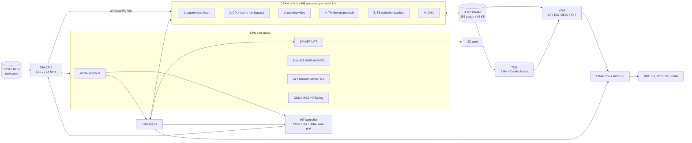
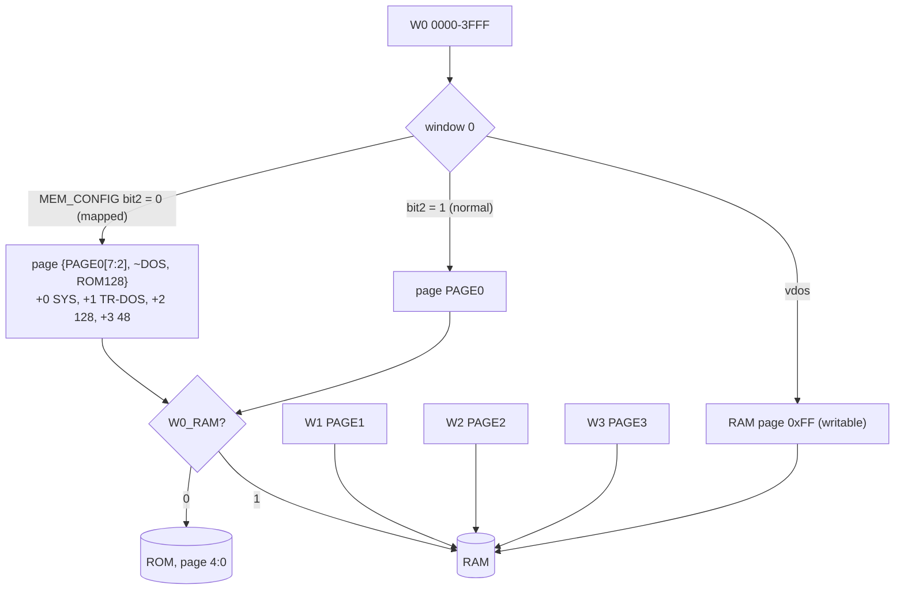
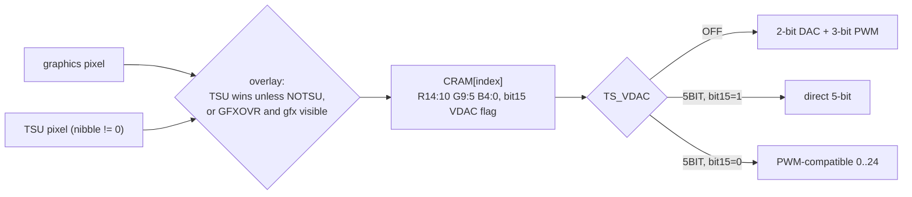
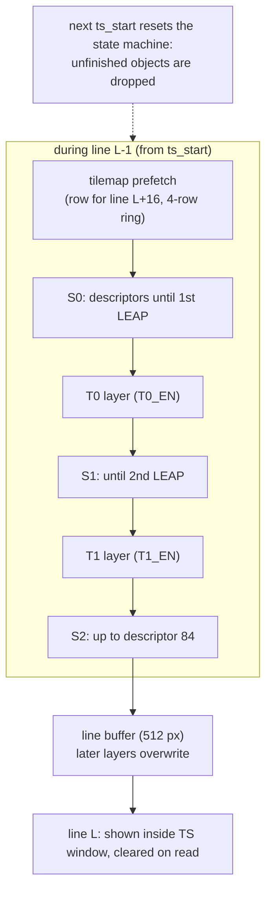
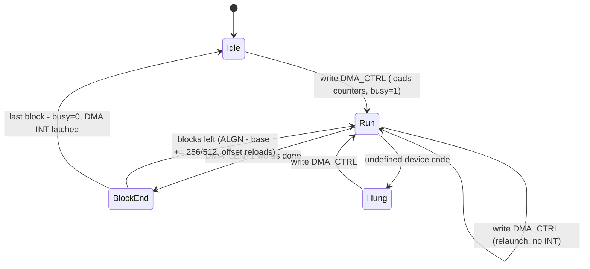
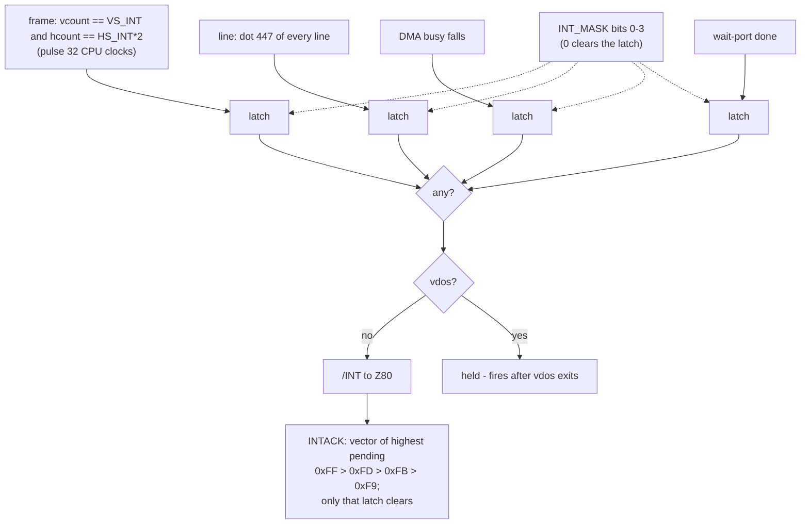

# TSConf Machine — Technical Design for unreal-ng

**Status:** v1.0 (2026-09-27) — review round 1 applied: every hardware claim
re-verified against the Verilog/XLS/ROM images
([hardware-spec.md](hardware-spec.md) §13 lists the corrections) and every
code claim re-verified against the unreal-ng tree (§4 lists what changed).
**Ready for phase 0.** The executable plan with the test-first work lists is
[implementation-plan.md](implementation-plan.md).

This is the implementable design for the ZX-Evo **TS-Conf** machine (model key
`TSL`, accepted alias `TSCONF` — §3.2) in unreal-ng, in three parts:

- **Part I — What TS-Conf is**: the machine in context and why it needs
  dedicated engines, debugger surfaces and TTD support.
- **Part II — The machine, block by block**: how each subsystem works (diagrams
  + rules). Byte-level semantics are in [hardware-spec.md](hardware-spec.md),
  the behavioral contract.
- **Part III — unreal-ng implementation**: current state, the new
  infrastructure the machine needs, per-subsystem design with files and call
  sites, TTD, debugger, automation, risks.

Companion documents: [hardware-spec.md](hardware-spec.md) (contract),
[implementation-plan.md](implementation-plan.md) (phases + TDD work lists),
[references.md](references.md) (sources), [TODO.md](TODO.md) (status).

Source tags as in hardware-spec §0: **[V]** Verilog, **XLS** register
workbook, **[U]** ancestor Unreal (`zx-evo-unreal/Unreal/`), **[M]** MAME,
**[X]** Xpeccy.

---

# Part I — What TS-Conf is

## 1.1 One board, two machines

The ZX-Evo (PentEvo rev C, <http://nedopc.com/zxevo/zxevo_eng.php>) is a board
with a **real Z80** plus an Altera Cyclone FPGA that implements everything else,
and an ATmega128 AVR for PS/2, RTC/NVRAM and the boot loader. The FPGA
configuration *is* the machine; two matter:

| | **Base Configuration** (NedoPC) | **TS-Conf** (TS-Labs) |
|:--|:--|:--|
| Lineage | ATM Turbo 2 + Pentagon-1024 | new design, ZX-compatible |
| unreal-ng | the `ATM3` machine: creatable, but 39 gaps open (PLAN #55, [gap-analysis.md](../2026-09-15-atm-baseconf-highres-ports/gap-analysis.md)) | **this design** |
| CPU clock | 3.5/7/14 MHz via `#xx77`/`#EFF7` | 3.5/7/14 MHz via `SYS_CONFIG`, switches immediately |
| RAM model | ATM windows, inverted page encodings | 4 MB, 4 × 16 KB windows, plain page numbers |
| Video | ATM modes up to 640×200 | ZX / 16C / 256C / TXT × 4 geometries up to 360×288; text at 14 MHz dots (720×288) |
| Colors | fixed 64 + ULAplus | **256-entry palette RAM** (RGB555), 16 banks of 16 |
| Sprites / tiles | none | **2 tile layers + 3 sprite layers, 85 sprites** |
| DMA | none | **one DMA engine**, 8 device codes (copy/fill/2 blits/SPI/IDE/palette/sprite table) |
| Interrupts | one frame INT, vector 0xFF | **4 sources** (frame/line/DMA/wait-port), fixed vectors 0xFF/0xFD/0xFB/0xF9, movable frame INT |
| Storage | VG93 + Nemo IDE + SD | VG93 + virtual-drive swap + SD via SPI (FatFS BIOS) + Nemo IDE (standard build) |
| Register readback | `#xxBD` | only STATUS, PAGE2, PAGE3, DMA busy |

Both share the same ROM image (`data/rom/zxevo.rom`: TS-Conf uses pages 0-3,
BaseConf pages 28-31) and the same board peripherals (keyboard, mouse, CMOS,
SD, FDD). The **core** — memory, video, DMA, interrupts — is a different machine.

## 1.2 TS-Conf versus classic Spectrums

| | ZX 48K / 128K / Pentagon | TS-Conf |
|:--|:--|:--|
| Clock | 3.5 MHz | 3.5 / 7 / 14 MHz, switchable mid-frame |
| Contention | ULA steals cycles | no ULA; a **DRAM arbiter** shares 448 accesses per line between video, CPU, tilemap, sprites, DMA |
| RAM | 48-1024 KB, `#7FFD` paging | 4096 KB, 256 pages, 4 windows; `#7FFD` folded in with 4 lock modes |
| Video | 256×192, 15 colors | 4 modes × 4 geometries, 256-color palette, per-line register latching |
| Interrupts | one INT per frame at a fixed position | frame INT at a programmable position, line INT every line, DMA-done INT; each maskable, each its own IM2 vector |
| Storage | tape / TR-DOS | SD card (primary) + TR-DOS kept |
| Snapshots | SNA / Z80 | **SPG** |

## 1.3 The engine-class subsystems

Six blocks exist in no unreal-ng machine today:

1. **Windowed 4 MB memory with a memory-mapped register window** (FMAPS: CPU
   writes into a 4 KB window go to palette / sprite table / registers *and* to
   RAM) and a 256-entry CPU cache that DMA does not invalidate.
2. **Palette VDU**: per-line latched mode/page/offset registers, 4 geometries,
   text mode with 14 MHz dots → a 720×288 output.
3. **TSU**: hardware compositor, 2 tile layers + 3 sprite layers in fixed order,
   rendered one line ahead from DRAM that it has to *win* from the arbiter.
4. **DMA**: one engine, block/alignment addressing, blits, palette/sprite
   uploads, SPI sector transfers, completion INT; its speed depends on what
   video and TSU leave free.
5. **Interrupt controller**: 4 sources, priority, per-source vectors,
   programmable frame position, outputs gated (not lost) during vdos.
6. **Switchable CPU clock**: takes effect immediately, mid-frame.

Reserved but not built in any firmware (keep encodings reserved, no v1 work):
**copper** (`INT_MASK` bit 4, FM offset 0x600+, DMA code 0xE), FDR ripper
(DMA code 0x5, regs 0x2C/0x30-0x32).

## 1.4 What this means for unreal-ng

| Capability | Consequence |
|:--|:--|
| Per-line latched video, 720×288 | `ScreenTsConf` renderer helper + real `rasterDescriptors` rows (§3.9) |
| TSU / DMA / INT state | dedicated debugger surfaces: register panel, layer visualizer, DMA view, DRAM budget view (§3.14) |
| DMA and TSU race for DRAM | deterministic per-line budget model, run on **every** CPU step (not in the render path) (§3.8) |
| Programmable INT controller | a new machine interrupt-source interface in the Z80 core (§3.4) |
| FMAPS writes | a new memory-write intercept (§3.5) |
| vdos "flip at next M1" | a new instruction-start hook (§3.6) |
| Machine latches + CRAM/SFILE + mid-transfer DMA | TTD serializer id 16 + corpus fixture (§3.13) |
| SD card primary storage | shared `SdCardSpi` (with NeoGS) + vFAT backing + media API on all automation frontends (§3.11) |
| 48.828 Hz raster | already supported by per-model frame timing; verify recording FPS tag (§3.17) |

# Part II — The machine, block by block

## 2.1 Topology



No separate VRAM: VDU, TSU and DMA address RAM pages directly, so arbitration —
not address translation — is the heart of the timing model.

## 2.2 Memory



- **Boot**: `MEM_CONFIG = 0x04` (normal), `PAGE0 = 0` → TS-BIOS. The TR-DOS
  trap works only in mapped mode with `ROM128 = 1`, so it is off until the
  BIOS sets up the 128K ROM set.
- **`#7FFD`** (A15 = 0, low byte FD) folds into `PAGE3`, `ROM128` and `V_PAGE`
  per the `LCK128` mode (512K / 128K / auto-by-opcode / 1024K), with a `lock48`
  latch (7FFD bit 5).
- **FMAPS**: a 4 KB-aligned window where CPU writes also update CRAM
  (0x000-0x1FF), SFILE (0x200-0x3FF) or registers (0x400-0x4FF). Reads see RAM.
- **Cache**: 256 word entries; hits are served at every speed; DMA does not
  invalidate it.

## 2.3 VDU

Mode = `V_CONFIG[1:0]`, geometry = `V_CONFIG[7:6]` (applies to all modes).
All geometries sit inside the 360×288 visible region (dots 88-447, lines
32-319) — the renderer therefore uses **one fixed framebuffer of 720×288**
(2 output pixels per dot) and draws the border around whichever window is
active on each line.

| Mode \ geometry | 0: 256×192 | 1: 320×200 | 2: 320×240 | 3: 360×288 |
|:--|:--|:--|:--|:--|
| **0 ZX** | classic | window widens; columns wrap at 32 B | ✓ | ✓ |
| **1 16C** | 4 bpp, 128 KB (`V_PAGE&0xF8`) | ✓ | ✓ | ✓ |
| **2 256C** | 8 bpp, 256 KB (`V_PAGE&0xF0`) | ✓ | ✓ | ✓ |
| **3 TXT** | 64×24 chars, 14 MHz dots | 80×25 | 80×30 | 90×36 |



Palette indices: ZX `{PAL_SEL[3:0], BRIGHT, color}`; 16C and TXT
`{PAL_SEL[3:0], nibble}`; 256C the byte; tiles `{PAL_SEL[5:4|7:6], pal2, nibble}`;
sprites `{pal4, nibble}`; border = `BORDER` (full byte; in TXT cut to the low
nibble).

**Timing discipline**: `V_CONFIG, V_PAGE, G_X_OFFS, PAL_SEL, T0/T1_X,
T0/T1_G_PAGE` latch at the next line start; `G_Y_OFFS` reloads the row counter
at the next line start; CRAM/SFILE, `BORDER`, `T_CONFIG`, `T_MAP_PAGE`,
`SG_PAGE`, INT position act immediately (CRAM mid-line). Raster demos depend
on exactly this.

## 2.4 TSU



- Tiles: 64×64 map per layer (both in `T_MAP_PAGE`), 12-bit tile number into a
  512×512 4-bpp sheet (`T0/T1_G_PAGE & 0xF8`), 2-bit palette, flips; tile 0 is
  transparent unless T0Z/T1Z.
- Sprites: 85 descriptors in SFILE (3 words each), 8..64 px per side, 9-bit
  coordinates wrap at 512, sheet at `SG_PAGE & 0xF8`.
- Every TSU fetch competes for DRAM: a crowded line runs out of slots and drops
  objects — the emulator must model the budget, not just the picture.

## 2.5 DMA



Device codes `{RW, dev}`: 0x1 copy, 0x9 BLT1 (keep dst where src is 0),
0x6 BLT2 (add, optional saturation), 0x4 fill, 0x2/0xA SPI in/out,
0x3/0xB IDE, 0xC palette, 0xD sprite table, 0x7 wait-port; anything else hangs
busy. Addresses are 21-bit word addresses into DRAM. Register writes during a
transfer act live.

## 2.6 Interrupt controller



This replaces the fixed `intstart/intlen` frame window entirely for this
machine.

## 2.7 Clock and DRAM arbitration

- `SYS_CONFIG[1:0]` = 0 → 3.5, 1 → 7, 2/3 → 14 MHz, effective right after the
  `OUT`. At 14 MHz each external I/O access (AY, VG93) costs a one-tact stall,
  and cache misses add wait states (phase 8).
- Arbitration per 8-slot video block: urgent video > CPU > pending video >
  tilemap > sprites > DMA. At 3.5/7 MHz the CPU stalls only when video takes
  all 8 slots. The emulator keeps five per-line counters (video, CPU, tilemap,
  sprites, DMA) against 448 — the ancestor's model.

## 2.8 Sound

One physical AY at a fixed 1.75 MHz (`xxFD`, A15 = 1); beeper and Covox
(`xxFB`) share one 8-bit DAC register (last write wins); General Sound as an
external card on `#B3/#BB`. No Soundrive, no TurboSound.

## 2.9 Storage and I/O

| Block | Behavior |
|:--|:--|
| SD | FPGA SPI master on `#57` data (reads return the previous exchange) / `#77` chip selects (bit 1 SD, active low); `#77` reads 0 |
| Beta-128 | VG93 1F/3F/5F/7F + system FF, only in DOS or with `FDD_VIRT[7]`; a port access on a drive flagged in `FDD_VIRT[3:0]` swaps RAM page 0xFF into window 0 at the next M1 (vdos) — Z80 code there emulates the drive; a VG93 access inside vdos exits it |
| Gluk CMOS | `#DFF7/#BFF7`, enabled by `#EFF7` bit 7; blocked from the TR-DOS ROM, allowed in vdos; registers F0-FF = AVR extension (PS/2 keyboard log, versions) |
| Mouse / joystick | Kempston mouse `xxDF` (wheel nibble); 8-bit Kempston joystick `#1F` outside DOS |
| Nemo IDE | in the standard build (VDAC builds reuse its pins): CS0 ports `rrr10000` + aliases `rrr01000`, CS1 #C8, high-byte latch #11; Nemo and DivIDE byte orders; answers always; a fixed 6-fclk PIO cycle that stalls the CPU; DMA codes 0x3/0xB move 16-bit words (hardware-spec §8.3) |
| COM / ZiFi (`xxEF`) | AVR wait-port — deferred, reads 0xFF |

## 2.10 Reset and boot

Warm reset: pages {0,5,2,0}, normal mode, 3.5 MHz, ZX mode, `PAL_SEL=0x0F`,
TSU off, `INT_MASK=1`, `HS_INT=1`, `VS_INT=0`, DOS/vdos/lock off. CRAM,
SFILE, border and TSU page registers keep their values (power-on: CRAM from the
FPGA's .mif image, others 0). TS-BIOS (ROM page 0) initializes and boots from
SD (FatFS), TR-DOS or ROM BASIC. `PWR_UP` (STATUS bit 6) tells the BIOS it was
a cold start.

# Part III — unreal-ng implementation

## 3.1 Current state

unreal-ng descends from a TS-Labs Unreal fork; a skeleton is ported, the
functional core is not. The ancestor (`zx-evo-unreal/Unreal/`, cp1251 files)
is the porting blueprint.

| Area | State today | Evidence |
|:--|:--|:--|
| Model registry | **present**: `MM_TSL`; `mem_model[]` row `"TS-Config"/"TSL"` 4096K; config folder `ts-conf` | `platform.h:312`, `config.h:53`, `config.cpp:721` |
| Machine state | **present**, not isolated: `TSPORTS_t` (`TSW_*` enum 8-61, `DMADEV` 80-98, DMA 481-513, TSU 515-554); bitfield unions + raw pointers in the TSU part | `platforms/tsconf/tsconf.h` |
| CRAM / SFILE / tsline | fields in shared structs | `platform.h:999,1002-1003`, `screen.h:137-138` |
| Config + ROM | ini (1376 lines, `Frame=71680`, `Line=224`, `TSL=rom\zxevo.rom`); `rom.cpp` MM_TSL branches: path (110), sys/dos/128/48 = pages 0-3 (237), exactly-32-banks check (350) | `data/configs/ts-conf/unreal.ini`, `config.cpp:212`, `memory/rom.cpp` |
| INT ack | pend-clear block only; `GetTSConfInterruptVector` and `ts_frame_int/ts_line_int/ts_dma_int` declared, **never defined** | `z80.cpp:1197-1210`, `cpu/z80.h:532-535` |
| Video | `ScreenTSConf` exists but is **never instantiated**; engines stubbed, calls commented out; placeholder descriptor rows (ZX geometry) and stub draw callbacks `DrawTS16/256/Text`; mode names present | `video/tsconf/screentsconf.cpp`, `screen.h:458-460,540-542`, `screen.cpp:1546-1559,1943-1945` |
| Port decoder | **missing — the creatability gate** | `ports/portdecoder.cpp:56-138` (factory + `IsModelSupported`) |
| Memory banking | missing (`UpdateZ80Banks` routes only ATM/Profi to decoders) | `memory.cpp:838,859-866,889-896` |
| SD card | **no implementation anywhere** (ATM3 returns 0xFF on #57; `[ZC] SDCARD=` is never parsed) | `portdecoder_atm3.cpp:45-55` |
| Timing defaults | no `MM_TSL` case in the canonical-geometry switch | `config.cpp:948-989` |
| TTD | nothing; `CaptureChipsetState` lists `ts`, `cram`, `sfile` as unsupported | `ttdcheckpoint.cpp:227-228`, `ttdserializable.h:42-59` |
| Shared-code leftovers | see §3.3 table | |
| TUI PoC | layout reference | `tools/poc/018-tui-debuggers/tsconf/` |

Ancestor file map: `tsconf.cpp` (DMA + TSU engines, INT, `tsinit`,
`update_clut`), `io.cpp` (`ts_ext_port_wr`, port in/out), `memory.cpp`
(`set_banks`), `z80_main.inl` (`z80loop_TSL`, cache, FMAPS writes), `draw.cpp`
(`update_screen`, `get_free_memcycles`), `drawers.cpp`, `vars.cpp` (`IntVec`,
cache timing), `zc.cpp` + `sdcard.cpp` (SPI/SD), `snapshot.cpp` + `depack.cpp`
(SPG, MegaLZ, Hrust), `dbgtsconf.cpp`, `visuals.cpp`.

## 3.2 Design principles and decisions

1. **The Verilog is the contract.** Port the ancestor's *structure*; where it
   diverges from [V] (hardware-spec §12: vdos INT loss, dropped DMA writes,
   unknown-code NOP, reset `HS_INT=2`, CMOS in DOS, border formula, CRAM reset
   reload), implement [V].
2. **Isolate, don't embed.** All TSConf state lives in TSConf-owned classes;
   shared code gets only generic extension points (§3.3).
3. **Machine logic is never in the render path.** Screen updates are skipped on
   turbo-decimated frames (`mainloop.cpp:552-557`); DMA, TSU state, budget and
   INT therefore run from the ungated per-step hook (§3.8).
4. **Budget model, not bus simulation.** Five per-line DRAM counters; per-access
   costs from hardware-spec §6.2.
5. **Correctness before timing.** Phases 1-6 are functionally exact with the
   ancestor's cost units; phase 8 calibrates wait states and per-word costs.
6. **One machine, all surfaces.** A phase that makes state real exposes it in the
   debugger, TTD and automation in the same phase.
7. **Test first.** Every work item starts with a failing test derived from
   hardware-spec (implementation-plan.md).

Decisions (recorded; change only with the user):

| # | Decision | Rationale |
|:--|:--|:--|
| D1 | Superset of all firmware builds (XTR_FEAT always on); `TS_VDAC` selects DAC curve + STATUS `VDAC_VER` (OFF → 0, 5BIT → 3, VDAC2 → 7); FT812/ESP32 not modeled | software checks VDAC_VER; ancestor precedent |
| D2 | **Nemo IDE emulated** (decided 2026-09-29) through the shared IDE core: `IdeAdapter` scheme `NEMO-DIVIDE` (the same decode as ZX-Evo BaseConf), `[HDD] Scheme=NEMO-DIVIDE` in the ts-conf ini; the TSConf-only CPU stall emulated but **off by default** (`[HDD] IdeStall=0`); IDE fitted regardless of `TS_VDAC` (superset, D1) | the shared core is on master (`f5fc5f05`; ATM3 uses the scheme), so IDE costs decoder calls, two DMA word methods and the stall; the design was deferred (v1.0) only because no IDE core existed |
| D3 | Model key stays **`TSL`** (existing `mem_model` short name, ini, API, AGENTS.md); **`TSCONF` accepted as an alias** at model lookup (the scope confirmed with the user on 2026-09-27 named `TSCONF`) | no config/API churn; both names work |
| D4 | **Soundrive not emulated** — absent from the hardware; the 2026-09-27 scope "Covox/Soundrive (full set)" is satisfied by Covox + beeper + AY + GS | a Soundrive would make software behave differently from the real machine |
| D5 | No `ayclk` decode — AY fixed 1.75 MHz | `ay_mod` hardwired in [V] |
| D6 | CRAM power-on = the FPGA .mif table; warm reset keeps CRAM | [V] |
| D7 | COM/ZiFi, wait-port DMA (0x7), FT812, copper, FDR out of v1 | not needed for software compatibility; encodings reserved |

## 3.3 State ownership and isolation

**Rule:** no TSConf fields in shared structs; no `MM_TSL`/`state.ts` references
in shared code outside the registration surface.

> **Done 2026-09-29 (INF-6, INF-7; branch `tsconf-isolation`).** What was
> removed from shared code, and what every other machine gets instead:
>
> | Leftover | Now |
> |:--|:--|
> | `EmulatorState::ts` (`TSPORTS_t`), `cram[256]`, `sfile[256]`, `TS_CACHE_SIZE`, the `platforms/tsconf/tsconf.h` include in `platform.h` | gone; every machine's state was carrying the whole TS-Conf register block and 1 KB of TS palette / sprite files, always zero. `tsconf.h` stays as a not-included naming reference for phase 1 |
> | `VideoControl` `ts_pos`, `tsline[2][512]`, `memvidcyc/memcpucyc/memtsscyc/memtstcyc/memdmacyc[320]`, `memcyc_lcmd`; `RASTER::r_ts`; `MEM_CYCLES` | gone. `Z80::ProcessInterrupts` no longer touches `pScreen->_vid` on every step (it only zeroed `memcyc_lcmd`) |
> | `Screen::InitFrame` read `state.ts.g_yoffs` for every machine | `ygctr = UINT32_MAX` - the value it always had (`0 - 1`) |
> | `Screen::DrawZX`, `DrawBorder`, `DrawScreenBorder`, `DrawTS16/256/TSText` (read `state.ts.*`, `clut[state.ts.border]`) | deleted; their rows in the obsolete draw table point to `DrawNull`. The table itself is unreachable (`_currentDrawCallback` is never set; every screen is a `ScreenZX`, which overrides `Draw`) |
> | TSConf block in `Z80::HandleINT`; `GetTSConfInterruptVector`, `ts_frame_int/ts_line_int/ts_dma_int` declarations | deleted; INT is the `IInterruptSource` (§3.4) |
> | `PagingLatch::PBD/PTS/PMEM` (reserved, read 0) | deleted; TSConf's decoder reports its own latches from `TsConfState` (phase 1) |
> | `MISC::TSConf` comment (`config.cpp`), TSConf case in `TimeTravelManager::PortJournalUnsupportedReason` | deleted; TSConf is refused by the generic machine-step-hook check once it installs its engine |
>
> **Kept** (the registration surface and vocabulary): `MM_TSL` in the model
> enum, the `mem_model[]` row, the config folder, the screen factory, and the
> per-model ROM rows in `rom.cpp` (path, ROM set, size check - phase 1's ROM-1
> replaces the size rule with the TSConf loader); `M_TS16/M_TS256/M_TSTX` and
> their descriptor rows; the TSConf logger sub-module names; `VideoControl::clut`
> (the ATM drawers and their tests read its ZX defaults, not TSConf-specific).
>
> **Enforcement:** `core/tests/emulator/machines/tsconf/tsconfisolation_test.cpp`
> scans `core/src` (~40 ms warm) for `state.ts.`, `.cram[`, `.sfile[`,
> `tsline`, `memdmacyc`, `memvidcyc`, `memcyc_lcmd`, `TS_CACHE_SIZE`,
> `TSPORTS_t`, `platforms/tsconf/` outside the TSConf directories, and for
> `MM_TSL` outside the registration files; it reports file and line.

| Leftover in shared code | Target |
|:--|:--|
| `EmulatorState.ts` (`platform.h:999`), `cram`/`sfile` (`:1002-1003`) | `TsConfState` (`platforms/tsconf/tsconfstate.h`), owned by `PortDecoder_TSConf`. Plain fixed-width fields (no bitfield unions) so TTD can serialize field by field |
| TSU raw pointers (`tsu.gptr`, `tmbptr`, `tmap[2]`) | replaced by page/offset integers; pointers derived at use |
| `VideoControl.tsline[2][512]`, `ts_pos` (`screen.h:137-138`), `memvidcyc/memcpucyc/memtsscyc/memtstcyc/memdmacyc[320]`, `memcyc_lcmd` (`:139-144`), `clut[256]` (`:123`), `RASTER.r_ts` (`:118`) | `TsConfEngine` (budget, TSU line buffers) and `ScreenTsConf` (clut) |
| `MEM_CYCLES` (`screen.h:24`), `TS_CACHE_SIZE` (`platform.h:257`) | tsconf headers |
| `Screen::DrawScreenBorder` reads `video.clut[state.ts.border]` (`screen.cpp:1295`); `Screen::DrawBorder` reads `state.ts.border` (`:1921`); `Screen::DrawZX` reads `state.ts.vpage/gpal` (`:1464-1468`) | removed; TSConf border/ZX drawing lives in `ScreenTsConf`. Other machines' goldens must stay bit-identical |
| INT-ack block `z80.cpp:1197-1210` + declared `ts_*_int`/`GetTSConfInterruptVector` | deleted; replaced by the generic interrupt-source interface (§3.4) |
| `rom.cpp` MM_TSL branches (110, 237, 350) | TSConf ROM loader function beside the platform code, dispatched from `rom.cpp` (no model switch) |
| `PagingLatch::PBD/PTS/PMEM` reserved members, static `ReadPagingLatch` reading `EmulatorState` (`portdecoder.cpp:737-762`) | a decoder-instance virtual `ReadPagingLatch()`; TSConf fills it from `TsConfState` |
| `MISC::TSConf` placeholder comment (`config.cpp:177`) | removed |

Stays shared (vocabulary, like `M_ATMTL`): `M_TS16/M_TS256/M_TSTX` (+ a new
`M_TSZX` for ZX-in-TSConf), their `rasterDescriptors` rows and names.

Registration surface (allowed): `MM_TSL`, the `mem_model[]` row, the config
folder case, the decoder factory + `IsModelSupported`, the Core factory case for
`TsConfMemory`, video-mode enum/descriptor rows.

**Enforcement:** `tsconfisolation_test.cpp` scans `core/src` and fails on
`state.ts`, `.cram[`, `.sfile[`, `tsline`, `memdmacyc`, `TS_CACHE_SIZE`,
`MM_TSL` outside the allowlist (`platforms/tsconf/`, `video/tsconf/`,
`memory/tsconf/`, `ports/models/portdecoder_tsconf.*`, `debugger/ttd/tsconf/`
+ the registration lines listed above).

## 3.4 New infrastructure: machine interrupt source

> **Built (PLAN #60(a), branch `tsconf-infra`, 2026-09-29)** — shared code,
> declared in `core/src/emulator/cpu/z80.h` next to `IMachineM1Hook`. What
> changed in shared code and why:
>
> | Where | Change | Cost for other machines |
> |:--|:--|:--|
> | `Z80::SetInterruptSource` | set by a model's port decoder; raises / clears the `kStepWorkInterruptSource` bit of the per-step gate `EmulatorContext::stepWork` | — |
> | `Z80::ProcessInterruptsImpl<bool UseSource>` | with a source: `int_pending = IsIntAsserted(t)`; accept → `HandleINT(AcknowledgeInterrupt(t))`; the ULA window, `RaiseLocalInt` and `IntClearedByAcknowledge` are skipped. The classic step runs the `<false>` instance; `StepInstructionWithWork` picks `<true>` when the bit is set | **none**: behind the per-step gate that TTD input already paid (2026-09-29 fix, see below) |
> | `ope_4D` (RETI and its mirrors ED 5D/6D/7D) | `OnReti()` when a source is set | one pointer test per RETI |
>
> Tests: `InterruptSource_Test` in `core/tests/emulator/cpu/int_test.cpp`
> (the pin, the IM2 vector, IFF1 / EI shadow / prefix still apply, RETI vs
> RETN); every existing INT test is the unchanged no-source path.

Before this, `Z80::ProcessInterrupts` raised INT only from the static
`[_intStart, _intEnd)` window and called `HandleINT()` with vector 0xFF; the
only model-specific hook was `IntClearedByAcknowledge()` (a model check inside
Z80). `HandleINT(uint8_t vector)` already accepted the IM2 byte.

The interface as built:

```cpp
class IInterruptSource
{
public:
    virtual ~IInterruptSource() = default;
    // Is /INT asserted at this instruction boundary (frame T-state t)?
    // Called once per step before the instruction; no CPU-visible side effects.
    virtual bool IsIntAsserted(uint32_t t) = 0;
    // INTACK: returns the data-bus byte (IM2 vector low byte), clears only
    // the served source.
    virtual uint8_t AcknowledgeInterrupt(uint32_t t) = 0;
    // RETI seen on the bus (Z84C15 daisy chain, Sprinter accelerator re-arm).
    virtual void OnReti() {}
};
```

Frame rollover is not part of this interface: an engine that keeps
frame-relative positions gets it from `IMachineStepHook::OnMachineFrameRollover`
(§3.8) — TSConf's `TsConfInterrupts` lives in the engine that implements both.
The EI-shadow, `iff1` and pending-prefix rules stay the CPU's; NMI keeps its
priority. ATM3's `IntClearedByAcknowledge` can migrate to a source later; not
in scope.

TSConf semantics (hardware-spec §5): frame event at `VS_INT*224 + HS_INT`
(disabled when out of range), pulse length `32 × hw_turbo_ratio` T-cycles of
the CPU clock expressed in frame tacts (frozen during vdos); line event at dot
447 of every line = the second half of its last tact, **modeled as frame tact
`224·n − 1` for n = 1..320** (the 320th event, tact 71679, is the one that
precedes line 0 of the next frame; the ancestor's "tact 0 of the next line" is
one tact later — accepted, tested by INT-3); DMA and wait-port events from the
engine; mask clears pending; vdos gates the output.

## 3.5 New infrastructure: memory

`MemoryWriteFast/Debug` are deliberately non-virtual (`memory.h:279-289`) and
store through `_bank_write[bank]`. TSConf needs:

1. **`TsConfMemory : Memory`** (`memory/tsconf/tsconfmemory.{h,cpp}`), selected
   in the Core factory (`cpu/core.cpp:98-101`, the `ScorpionMemory`
   precedent). It overrides `UpdateModelBanks()` (return true, ports
   [U] `set_banks` MM_TSL: window-0 formula, `W0_WE` → trash page
   `MAX_MISC_PAGES` for read-only ROM, vdos → RAM 0xFF) and the virtual read
   pair (cache model).
2. **Write intercept = a write-only host bus overlay** (PLAN #60(a), built
   2026-09-29 on branch `tsconf-infra`; replaces the per-bank
   `_bank_write_intercept[4]` flag of v1.0). The FM window is a
   `HostBusOverlay` (`core/src/emulator/memory/hostbusoverlay.h`, from NeoGS
   ZX-DMA) owned by the TSConf engine: `observesReads = false` (FM is
   write-only, hardware-spec §2.4), window `[FM_ADDR << 12, + 0x500)` (the part
   of the 4 KB window with an FM effect), installed with
   `Core::AddBusOverlay` while `FMAPS.MEN = 1` and removed when it clears; an
   `FMAPS` write that moves the window only updates `windowStart/windowEnd`.
   The overlay runs **after** the normal store, as the hardware does (FM writes
   also land in RAM/ROM). Why this instead of the flag:
   - **Zero cost for every other machine** — not even a branch: the Z80 uses
     the overlay memory interfaces only while an overlay is installed.
   - **TSConf pays only while FM is on** — software opens the window, loads
     the palette / sprite table, closes it.
   - **No new write path** — debug mode, contention, breakpoints, TTD dirty
     tracking and the write journal all run as for any write.

   Shared-code changes this needed (all in `core/src/emulator/`):

   | Where | Change | Why |
   |:--|:--|:--|
   | `memory/hostbusoverlay.{h,cpp}` | `observesReads` flag; `HostBusOverlayChain` | write-only intercepts skip `onRead`; several overlays at once |
   | `cpu/core.{h,cpp}` | `SetBusOverlay` → `AddBusOverlay` / `RemoveBusOverlay` / `ClearBusOverlays` (up to 4, install order) | a TSConf with a NeoGS card has two overlays (FM window + ZX-DMA); one overlay is still called directly, two or more through the chain |
   | `memory/memory.cpp` `MemoryReadOverlay` | returns the normal byte when `!observesReads` | — |
   | `sound/chips/neogs/soundchip_neogs.cpp` | installs through `AddBusOverlay` / `RemoveBusOverlay` | the API change |

   Tests: `core/tests/emulator/cpu/core_test.cpp` (`TwoOverlaysAreChainedInInstallOrder`,
   `WriteOnlyOverlaySeesWritesNeverReads`, `OverlayCountIsBounded`, and the
   existing selection / contention / thread tests on the new API). The same
   mechanism serves the Sprinter (video shadow, graphics pages; its bank
   `_bank_write` points to the trash page where the plain store must not land)
   and ZX-Evo flash writes (PLAN #55 E8).
3. **Cache** (functional, phase 1): 256 entries `{tag13, valid, word}`;
   filled on every CPU RAM read; hit returns the cached byte when
   `CACHE_CONFIG[bank]`; invalidated by a CPU write that hits; not touched by
   DMA. Timing (miss waits at 14 MHz) phase 8.
4. **RAM page 0xFF** (vdos maps exactly that page): ~~sentinel collision~~ —
   **resolved on master in `3a6eabc6`** (PLAN #40 V0): the bank cache holds a
   16-bit `ttd::PhysPage` with `kPhysPageNone = 0xFFFF` (`ttdphyspage.h`), so
   page 255 is dirty-tracked, journaled, probed and coverage-indexed like any
   page (`ttdpage255_test.cpp` on ATM3). `TsConfMemory` must keep the
   invariant pinned by `BankPageCacheAgreesWithTheMappedBank`: every bank
   switch goes through `SetRAMPageToBank*` / `SetROMPageToBank` (which maintain
   the cache) — add `TSCONF` to that test's model list in phase 1.

Renderer/DMA access: `Memory::RAMPageAddress(page)` (`memory.h:373`) +
offset; the 4 MB RAM is contiguous, so 16C/256C spans need no stitching.

## 3.6 New infrastructure: instruction-start hook

> **2026-09-28: already on master** (#55 E3): `IMachineM1Hook` with
> `BeforeMachineM1(address)` (before the opcode read - where vdos's page
> switch at the next M1 belongs) and `OnMachineM1(address)` (after it),
> installed through `Z80::machineM1Hook`. It passes the address only: the
> auto-lock opcode latch reads the fetched byte with a side-effect-free debug
> read. The `CF_MACHINEM1` flag design below is superseded by it.

DOS switching today is flag-driven in `Z80::RunInstructionStartHooks`
(`z80.cpp:178-236`): `CF_SETDOSROM` on `pch == 0x3D`; leave-DOS is
`CF_LEAVEDOSADR` (≥ 0x4000) only for Pentagon/Profi (`memory.cpp:898-900`),
others get `CF_LEAVEDOSRAM`. TSConf needs, at every M1:

- DOS on: `pc` in `#3D00-#3DFF`, window 0, **mapped mode and `ROM128=1`**;
- DOS off: `pc ≥ #4000` unless vdos;
- `pre_vdos` → `vdos` flip;
- the auto-lock opcode latch `!(op7 ^ op6)` (needs the fetched opcode).

Design: a `CF_MACHINEM1` flag in the existing flag set; when set,
`RunInstructionStartHooks` calls `_context->pMachineM1Hook->OnM1(pc, opcode)`
(an interface implemented by the TSConf decoder). `UpdateZ80Banks` sets the
flag for `MM_TSL` only (registration surface). The TSConf hook owns DOS state
entirely; the generic `CF_SETDOSROM/CF_LEAVEDOS*` flags are not set for this
model. The opcode latch uses the byte fetched in the same M1 (read without side
effects via `MemoryReadDebug`) — cost is TSConf-only.

## 3.7 Port decoder (`PortDecoder_TSConf`)

`ports/models/portdecoder_tsconf.{h,cpp}`, derives from `PortDecoder` (Profi
precedent), registered in the factory + `IsModelSupported`
(`portdecoder.cpp:56-138`). Uses `OnPortIn/OutComplete` exactly once per access.

| Port(s) | Condition | Handler |
|:--|:--|:--|
| `xxAF` | always | register write switch (hardware-spec §3.2); reads 0x00/0x12/0x13/0x27 only, else 0xFF |
| `A15=0, lo=FD` | `!lock48` | 7FFD fold (§2.3 of the spec) |
| `xxFD`, A15 = 1 | always | AY via `PeripheralPortOut(0xFFFD/0xBFFD)` (Profi pattern) |
| `xxFE` | always | keyboard/tape in; out: beeper → shared DAC, `BORDER = {PAL_SEL[3:0],0,c}` |
| `xxFB` | always | Covox (`CovoxFB=1` in the ts-conf ini) |
| `0x57` / `0x77` | always | SPI data / chip selects (§3.11) |
| `lo = 1F/3F/5F/7F/FF` | `DOS \|\| FDD_VIRT[7]` | WD1793 (existing registration, `wd1793.cpp:3430-3434`) + vdos arm/exit (hardware-spec §8.2) |
| `lo = 1F` | `!DOS && !FDD_VIRT[7]` | Kempston joystick (8-bit) |
| `lo = F7`, A8 = 1 | EFF7/CMOS gating (spec §9): `(EFF7[7] \|\| DOS) && (!DOS \|\| vdos)` | Gluk CMOS — reuse `EvoAvr` (`memory/atm/evoavr.h`: the same board AVR, already on the shared `Ds12887` chip with extension regs F0-FF); only the gating rule is TSConf's. Add `PeripheralId::Ds12887` (18) to the decoder's TTD ids like ATM3, and `[EVO] NvramFile` handling like `PortDecoder_ATM3` (PLAN #60(c)) |
| `xxDF` | always | Kempston mouse (`Default_Port_KempstonMouse_In`, wheel nibble) |
| IDE: `rrr10000`, `rrr01000`, #C8, #11 | always (checked **first**, like `portdecoder_atm3.cpp:245`) | `TryIdePortIn/Out` → `IdeAdapter` `NEMO-DIVIDE`; a real bus cycle adds the stall when `IdeStall=1` (§3.11) |
| `xxEF` | — | 0xFF (D7) |
| other | — | 0xFF |

Register effects: `SYS_CONFIG` → `hw_turbo_ratio = {1,2,4,4}[zclk]` then
`Z80::ApplyHardwareTurboNow()` (immediate; `z80.h:485` — do **not** use the
host `next_z80_frequency_multiplier`, ATM3 note in `portdecoder_atm3.cpp:303-328`)
and `CACHE_CONFIG = bit2 ? 0xF : 0`; `MEM_CONFIG`/`PAGEn`/`FMAPS` →
`UpdateZ80Banks()`; `V_PAGE`/`V_CONFIG`/offsets/`PAL_SEL`/tile pages → shadow
(line-latched) registers; `HS_INT/VS_INT/INT_MASK` → interrupt source;
`DMA_CTRL` → engine launch; DMA address/len writes → engine live registers.

Also: `GetTTDModelStateIds()` / `CreateTTDSerializers()` (§3.13),
`getPortTraceDecodeRules()` (TSConf rules), `getPortMapEntries` case,
`ReadPagingLatch()` override, `reset()` with the warm-reset list, power-on init.

## 3.8 TSConf engine and scheduling

`TsConfEngine` (`platforms/tsconf/tsconfengine.{h,cpp}`) owns: raster counters,
the five per-line budget counters, line-latched shadows, and the three
sub-engines in their own files — `TsConfTsu` (`tsconftsu.{h,cpp}`: state
machine + two line buffers + prefetch ring), `TsConfDma` (`tsconfdma.{h,cpp}`)
and `TsConfInterrupts` (`tsconfinterrupts.{h,cpp}`, the `IInterruptSource`). It is driven
after every CPU step, **outside** the `_renderThisFrame` gate, through the
generic `IMachineStepHook` registered by the decoder (`Z80::machineStepHook`).

> **Built (INF-5, branch `tsconf-infra`, 2026-09-29)** — shared code, declared
> in `core/src/emulator/cpu/z80.h`:
>
> | Where | Change | Cost for other machines |
> |:--|:--|:--|
> | `Z80::SetMachineStepHook` | set by a model's port decoder; raises / clears the `kStepWorkMachineStep` bit of `stepWork` | — |
> | `Z80::StepInstructionWithWork` | `OnMachineStep(t)` before `OnCPUStep` (screen, Beta, tape, sound then see this step's state); runs after every instruction and INT/NMI acknowledge, on rendered and turbo-skipped frames alike | **none**: behind the per-step gate |
> | `Core::AdjustFrameCounters` | `OnMachineFrameRollover(scaledFrame)` right after `Z80::t` is rebased - the one place the frame counter rolls over, in every run path | one pointer test per frame |
>
> **Per-step gate (2026-09-29).** The first version tested both pointers on
> every instruction, which cost the classic machines 0 to about 1 % of frame
> time depending on the run; with the gate they are within noise of the code
> without the feature (A/B in
> [performance-guidelines.md](../../guidelines/performance-guidelines.md) §5). Both now sit behind `EmulatorContext::stepWork`, the one word
> `StepInstruction` loads per step (it was TTD's `ttdInputWork`); the rare
> step runs out of line in `StepInstructionWithWork`.
> Tests: `MachineStepHook_Test` in `core/tests/emulator/cpu/z80_test.cpp`
> (every step with the reached `t`; every frame of a turbo run with render
> decimation; the rollover length).

```
per CPU step (after the instruction, t = current frame tact):
  engine.CatchUp(t):
    for each chunk up to t, never crossing a line boundary:
      at line start: apply latched registers, G_Y reload, clear/swap line buffers,
                     line INT event, TSU restart at ts_start
      dram = 2 * tacts_in_chunk - cpu_accesses_in_chunk (carry excess)
      free = min(dram, 448 - sum(counters of this line))
      free = tsu.Run(free)      // TSU first
      free = dma.Run(free)      // DMA gets the rest
```

CPU accesses are counted by `TsConfMemory` (1 per cache-missing read, 1 per
write — ancestor rule). The TSU renders into its line buffers on every frame
(cheap: ≤ 512 px/line) so its budget use, dropped objects and DMA pacing are
identical whether or not the frame is displayed. `ScreenTsConf` (gated) only
converts the finished line buffers + graphics into framebuffer pixels.

## 3.9 Video

> **Built (PLAN #60(e), branch `tsconf-infra-2`, 2026-09-29)** — shared code:
>
> | Where | Change | Why |
> |:--|:--|:--|
> | `video/videocontroller.{h,cpp}` | `GetScreenForMode(mode)` → `CreateScreen(model)`: the renderer is a `Screen` subclass chosen by model family (`MM_TSL` → `ScreenTSConf`, every other model → `ScreenZX`); every screen starts in `M_ZX48` | a family whose video is not "a ZX screen with extra modes" (TS-Conf, the Sprinter) owns its renderer instead of adding branches to `ScreenZX` |
> | `cpu/core.cpp` | builds the screen with `CreateScreen(config.mem_model)` | the one creation point |
> | `video/tsconf/screentsconf.{h,cpp}` | `ScreenTSConf : ScreenZX` (constructor only); the never-instantiated skeleton that read the shared `state.ts` is deleted | the selection path is live; phase 3 adds the TS modes here |
>
> Tests: `core/tests/emulator/video/videocontroller_test.cpp`.

- **Selection**: `VideoController::CreateScreen` builds `ScreenTSConf` for
  `MM_TSL`. It derives from `ScreenZX`, so TS-Conf's ZX mode is the ZX
  renderer unchanged; phase 3 overrides the mode switch (`SetVideoMode` /
  the range renderer) for 16C, 256C, TXT and the TSU layers. (The v1.0 fallback
  - a `ScreenZX` helper like `ScreenAtm` - is dropped.)
  `Screen::DetectVideoMode` (`screen.cpp:235-265`) gets an `MM_TSL` case that
  asks the TSConf state accessor (not `state.ts`) for the mode.
- **Geometry**: one descriptor for all TS modes: visible 360×288 dots (dots
  88-447, lines 32-319), framebuffer **720×288** (2 px/dot; non-TXT modes
  draw each dot twice). Replace the placeholder rows (`screen.h:458-460`);
  `AllocateFramebuffer` is descriptor-driven. The unused `MAX_WIDTH` needs no
  change; `MAX_HEIGHT` (320) already covers 288 lines. Display aspect: 720×288
  shown at 4:3 (the widget already scales ATM/Profi hires).
- **Per line**: mode, geometry, page, offsets, palette bank come from the
  line-latched shadows, so a mid-frame mode change renders correctly.
- **Pixels**: drawers for ZX (palette-indexed), 16C, 256C, TXT (hires, 4-bit
  flattening of border/TSU), overlay rules (NOTSU, NOGFX, GFXOVR), border.
- **Palette**: `clut[256]` of host RGBA recomputed per CRAM write
  (immediate, including mid-line — the drawer reads `clut` at the dot's time;
  v1 granularity: per render chunk, i.e. per CPU instruction) using the
  `TS_VDAC` curve (D1).
- **PLAN #42 dependency**: the `IVideoMapper` interface should land first so a
  `TsConfVideoMapper` (beam→fetch address, pixel→memory for all four modes and
  TSU layers) plugs in natively; if #42 slips, TSConf ships without the mapper
  and adds it later.

## 3.10 CPU clock

> **2026-09-29, PLAN #60(b) - built:** the power-of-two `hw_turbo_shift` is
> replaced by the linear `hw_turbo_ratio` (1-8) everywhere (the Sprinter needs
> ×6). TSConf sets ratio {1, 2, 4, 4} for `zclk` 0-3.

`hw_turbo_ratio` from `SYS_CONFIG` via `ApplyHardwareTurboNow()` (immediate,
rescales `t`); audio/video descale via `hw_turbo_ratio_applied`
(`platform.h:949-980`). No new infrastructure. The raster (and so the engine's
tact clock) stays at 3.5 MHz tacts — the engine converts CPU cycles to raster
tacts with the applied ratio. Phase 8 adds the 14 MHz external-I/O stall and
cache-miss waits.

## 3.11 Storage

> **Sync with ATM3 (2026-09-27, [tdd-storage-sd-ide-cd.md](../2026-09-15-atm-baseconf-highres-ports/tdd-storage-sd-ide-cd.md) §1):** `TsConfSpi` below becomes the shared `ZControllerSpi` (ATM3 has the same `#57`/`#77` behavior) plus the TSConf DMA path; `ISdBlockStore` is the IDE design's `IBlockDevice`, `VirtualFatBlockStore` is its `HostFolderFat`, and the SD session write mode reuses `SessionWriteMap` (so a folder SD is writable for the session, exportable). The Gluk extension (hardware-spec §9) is the shared `EvoAvr` ([tdd-evo-control-and-avr.md](../2026-09-15-atm-baseconf-highres-ports/tdd-evo-control-and-avr.md) §6). Whichever machine lands first builds these.

> **2026-09-28, the unified media manager (PLAN #58) supersedes the SD parts below**: the card is the manager's `sd.zc` slot ([integration-tsconf-sd.md](../2026-09-28-storage-manager/integration-tsconf-sd.md)); `VirtualFatBlockStore` is `HostFolderFat` (M1, FAT16 default, FAT32 for the xpeccy layout); the config is `[MEDIA] sd.zc` with the legacy `[ZC]` keys read by `MediaConfig` (`CONFIG::zc` is gone); the "Media API on all frontends" bullet is the media verbs of [media-control-design.md](../2026-09-28-storage-manager/media-control-design.md) (M4). TSConf keeps: the slot registration in its decoder, the DMA SPI path, card-detect / WP through `EvoAvr` — layers 1 and 2 of the storage stack ([storage-manager technical-design §1.1](../2026-09-28-storage-manager/technical-design.md#11-layers-from-the-guests-port-to-the-medium)); layers 3 and 4 (`SdCardSpi`, the block stack) and the control path are shared.

> **2026-09-28: built by ZX-Evo E5** ([e5-sd-card.md](../2026-09-15-atm-baseconf-highres-ports/e5-sd-card.md)): `SdCardSpi` is on master over `IBlockDevice` (`io/storage`: `RawImage`, `MemoryDisk`, `SessionWriteMap`), and `ZControllerSpi` (`io/spi/zcontrollerspi.{h,cpp}`) is the `#77`/`#57` glue. TSConf wires them in its decoder and adds the DMA SPI path; `[ZC] SDCardImage`/`SDWrite`/`SDWriteProtect` are parsed into `CONFIG::zc`. The bullets below predate this.

- **SD card**: `SdCardSpi : SpiDevice` (`emulator/io/sdcard/sdcardspi.{h,cpp}`,
  `emulator/io/spi/spidevice.h`) is the shared card model of
  [neogs-tdd.md](../2026-09-19-general-sound/neogs-tdd.md) §5.4-§5.5. **It
  already exists on the `neogs` branch** (worktree `scratch/wt-neogs`,
  uncommitted as of 2026-09-27): CMD0/8/9/10/12/13/16/17/18/24/25/55/58/59 +
  ACMD41, SDSC/SDHC, CRC off by default, write modes Session/Persist/Off,
  byte-counted deterministic latency, `readBlock/writeBlock` for tests. TSConf
  **reuses it after NeoGS merges** (if TSConf P6 comes first, the class is
  lifted from that branch unchanged). TSConf adds:
  - `TsConfSpi` (port glue in the decoder): `#57` exchange with the
    previous-byte read pipeline, `#77` chip selects → `select()`, the DMA SPI
    device path;
  - a **block-store seam** in `SdCardSpi`: today it reads a `FILE*`; extract
    `ISdBlockStore { blocks(); read(lba, buf); write(lba, buf); }` with
    `FileBlockStore` (current behavior, NeoGS tests stay green unchanged) and
    **`VirtualFatBlockStore`** — FAT32 over a host folder (Xpeccy `vfat.c`
    semantics: MBR, partition at LBA 2048, 2 FATs, 4 KB clusters, LFN + cp866
    8.3 aliases, sectors synthesized on demand, read-only → WriteMode Off);
  - the raw image path from `[ZC] SDCARD=` (a key that exists in the ini but is
    parsed by nothing today).
  - Media API on all frontends: WebAPI `POST/GET/DELETE /api/v1/emulator/{id}/sd`
    (image or folder), MCP `load_software`-family action, CLI, Lua, Python —
    one `SdCardState` descriptor (automation parity rule; consider PLAN #22
    schema generation first).
- **Beta-128**: existing WD1793/track model; decoder adds DOS/`FDD_VIRT[7]`
  gating and vdos arm/exit. TR-DOS ROM lives in ROM page 1.
- **IDE** (D2; hardware-spec §8.3). Built on the shared IDE core
  (`io/ide/`: `IdeController`, `IdeAdapter`, `AtaChannel`, media slots
  `ide0.master` / `ide0.slave`); TSConf adds no IDE class:
  - **Z80 ports**: the decoder calls `TryIdePortIn/Out` before its own table;
    `[HDD] Scheme=NEMO-DIVIDE` in `data/configs/ts-conf/unreal.ini` (set in
    `762d813e`). `IdeController::SchemeFits` already allows it on `MM_TSL`. The
    decode is bit-identical to BaseConf, so the ATM3 adapter tests cover it.
  - **DMA word access** (landed in `762d813e`): two public methods on the shared `IdeAdapter`,
    `uint16_t DmaReadWord()` and `void DmaWriteWord(uint16_t)`, over
    `AtaChannel::ReadData()/WriteData()` (data register). `DmaReadWord` also
    loads `readLatch` with the word's high byte (the hardware's shared
    `iderdreg`); the pending Z80 read / write pairs stay as they are, since their
    triggers move only on Z80 port accesses ([V] `zports.v:784-808`). The TSConf DMA
    engine calls them for codes 0x3/0xB; with `Scheme=NONE` those codes stay
    "not built" (hang).
  - **CPU stall**: `[HDD] IdeStall=0|1` (default 0 = bypass), read by the
    TSConf decoder only (other IDE boards use the Z80's own strobes and have
    no stall). With 1, every real IDE bus cycle from the CPU (CS0/CS1 ports;
    not #11, not a #10 served from the latch) adds 1 / 2 / 3 T at 3.5 / 7 /
    14 MHz through `Z80::AddWaitStates` (port waits need no shared hook:
    PLAN #60(d), `memorywaitoverlay.h`). `IdeAdapter::In/Out` report whether the access reached the
    drive (a flag in the adapter, read by the decoder), so the rule lives in
    one place. The stall is a pure function of the access, so it needs no
    TTD state.
  - **DMA pacing**: an IDE word costs one DRAM access plus one 6-fclk IDE bus
    cycle in the DMA budget (§3.8).
  - **TTD, media, automation, Qt**: nothing TSConf-specific. The decoder adds
    the shared `PeripheralId::AtaChannel` (17) to its TTD ids like the other
    IDE boards; image / folder / CD control is the media manager's
    `ide0.*` slots; `state ide`, `/state/ide`, `ide_state()`, MCP aspect `ide`
    and the Qt status LED already work for every IDE board.
- **ROM loading**: TSConf loader accepts the 512 KB `zxevo.rom` (default) and
  64 KB `ts-bios*.rom` (padded to 32 pages with 0xFF) — replaces the
  exactly-32-banks check (`rom.cpp:350`). No ROM-set remapping: the hardware
  formula selects pages 0-3.

## 3.12 Sound

AY: `PeripheralPortOut` canonical ports, clock 1.75 MHz (D5). Beeper + Covox:
unreal-ng has them as two independent channels, while the hardware has **one**
8-bit DAC register. The decoder owns that value: `OUT #FE` sets it to
0x00/0xFF from bit 4, `OUT xxFB` sets it to the byte; it is fed to the Covox
channel and the beeper channel stays silent for this model (test SND-2:
`OUT #FB,0x40` then `OUT #FE,0x10` → DAC 0xFF; then `OUT #FB,0x40` → 0x40).
Tape input/EAR is unaffected. GS: `GSType=Z80`
opt-in in the ts-conf ini (currently `NONE`, line 361), ROM line present
(`GS=rom/gs105a.rom`). Mixer/capabilities reporting lists AY, DAC, GS.

## 3.13 TTD

1. **`PeripheralId::TsConfPaging = 16`** (defined 2026-09-29, INF-10) (10 MoonSound, 11 GS-LW, 12 NeoGS
   reserved, 13 `Plus3Paging`, 14 `Upd765`, 15 `EvoSdCard` — `ttdserializable.h`;
   re-check the next free id when phase 1 starts); update `ttd.ksy` and
   `ttdmodelstatecontract_test.cpp` in the same change (PLAN #40 V0 rule). The
   SD side needs no new id: TSConf drives the same `ZControllerSpi` +
   `SdCardSpi` as ZX-Evo, so it registers the existing `EvoSdCard` (15)
   serializer (protocol state only; the card's sectors follow the media
   manager's TTD rule).
1a. **TTD time base** (B4, fixed on master 2026-09-28): TTD positions count
   T-states at the model's top clock. The TSConf decoder returns
   `PortDecoder::TtdClockUnits() = 4` (3.5/7/14 MHz), like ZX-Evo, so journal,
   markers and replay stay monotonic across `SYS_CONFIG` clock switches.
2. **`TTDTsConfState`** (`debugger/ttd/tsconf/`): blob = `TsConfState`
   serialized **field by field** (little-endian, versioned): registers and
   shadows, 7FFD/lock/DOS/vdos/pre_vdos state, FMAPS stash byte, cache
   (256 × {tag, valid, word}), CRAM, SFILE, INT latches + frame-pulse counter,
   DMA live counters/state, TSU state machine + both line buffers + prefetch
   ring, budget counters of the current line, SPI pipeline byte. Excluded:
   derived `clut` (recomputed on restore). Mid-transfer DMA and mid-line TSU
   restore exactly because the full engine state is in the blob.
3. Register through `GetTTDModelStateIds()` + `CreateTTDSerializers()`
   (Profi precedent `portdecoder_profi.cpp:378-388`;
   `TimeTravelManager::RegisterModelPeripherals` refuses to record if a
   declared id has no serializer).
4. IDE: the shared `AtaChannel` blob (17) holds the channel, both units and
   the adapter latches; the TSConf decoder only declares the id. An IDE DMA
   caught mid-transfer restores through the DMA counters in the TSConf blob
   plus the channel's transfer position.
5. SD card: the card's protocol state follows the NeoGS TTD design for
   `SdCardSpi` (neogs-tdd §7.4); Session-mode written sectors are part of that
   state; vFAT is read-only, so no sector journal.
6. **Dependencies**: PLAN #40 V1 (memory regions) per the PLAN #41 row. (The
   V0 items TSConf needed - the page-255 sentinel fix, `3a6eabc6`, and the
   unique `PeripheralId` table - are done.)
7. **Divergence corpus**: one fixture with TSU + DMA + line INT activity (a
   MAME `tsconf.xml` SPG, or a purpose-built test program), recorded with the
   existing corpus tooling.

## 3.14 Debugger surfaces

| Surface | Ancestor | unreal-ng |
|:--|:--|:--|
| TSConf register panel (all written registers from the *shadow* state — hardware can't read them back) | `dbgtsconf.cpp` | Qt dock fed by `DeviceState::TsConf()` (new builder following `Fdc()`, `devicestate.cpp:492`) |
| TSU layer visualizer (tile sheets, sprite sheet, per-layer isolation, SFILE table) | `visuals.cpp` | debugger widget; debug-only layer masks consumed by `ScreenTsConf` output only (never by the engine) |
| DRAM budget view | `show_memcycles` | per-line counters of the last frame, overlay + automation field |
| DMA view | — | state, device code, addresses, words/blocks left |
| Memory windows | — | `Memory16KBWidget`×4 works as is: `GetCurrentBankName` already prints generic "RAM n"/"ROM n", which is exactly TSConf's plain page numbering; add a "vdos" marker |
| Port trace | partial | `getPortTraceDecodeRules` + `getPortMapEntries` TSConf entries (PLAN #8); `PortTag::Video/Dma/StorageSd` exist; internal codes built (PLAN #60(g)): set `PortDecodeDisposition::internalCode` per TSConf port-table entry and name them in `GetPortTraceCodeTable()` (the ZX-Evo decoder is the worked example) |
| TUI PoC | — | `tools/poc/018-tui-debuggers/tsconf/` layout reference |

Breakpoints/watchpoints need nothing new.

## 3.15 Automation

`Config::IsModelCreatable` flips once the factory case exists (the ini is
present). Remaining:

| Surface | Change |
|:--|:--|
| `/api/v1/emulator/models` | none; `TSCONF` alias accepted by model lookup (D3) |
| OpenAPI (`openapi_lifecycle.inc`, `openapi_state.inc`) | model enum/descriptions |
| MCP | `mcp-tools.cpp` help already lists TSL; add `unreal://machine/tsconf` in `mcp-resources.cpp` (profi precedent, PLAN #14) |
| `/state/screen/mode` | TS mode names + geometry (`tsconf-16c-320x240` …) via `Screen::GetVideoMode()`; `state_screen_api.cpp:228,339` fall-through removed |
| `/state/paging` | decoder-instance `ReadPagingLatch()` |
| `/state/devices` (+ CLI/Lua/Python) | `DeviceState::TsConf()` |
| SD media | §3.11 |
| Recipes | `.recipe/machines/tsconf.md` (SD folder boot, TR-DOS, TTD) |
| AGENTS.md | move `TSL` to the creatable list |

## 3.16 GUI

Model menu entry; ts-conf settings (VDAC type, SD image/folder picker, GS);
debugger docks (§3.14); screen widget shows 720×288 at 4:3.

## 3.17 Snapshots and timing defaults

- **SPG**: port [U] `snapshot.cpp:190-328` + `depack.cpp` (`demlz`, `dehrust`)
  into `core/src/loaders/snapshot/loader_spg.{h,cpp}` (beside `loader_sna`); accept v1.0 and v1.1; apply load
  defaults (hardware-spec §10); set clock + pages through the decoder. SPG has
  no CRAM/TSU state — tests set CRAM explicitly.
- **Timing**: add `MM_TSL` to the canonical-geometry switch (`config.cpp:948-989`):
  224 T/line, 320 lines, 71680 T/frame; `frame_duration_us` is derived
  (`CalculateFrameDurationUs`) = 20480. The ini `intstart/intlen` are unused
  for this model (the interrupt source replaces them). Verify recording FPS tag
  48.828.

## 3.18 Testing and roadmap

The phase plan, test catalogue (IDs, files, fixtures, golden values) and exit
criteria are in [implementation-plan.md](implementation-plan.md). Summary of
test locations (existing conventions):

Tests are named after the file under test (`<sourcefile>_test.cpp`):

| Area | Location |
|:--|:--|
| Generic hooks (phase 0) | `core/tests/emulator/cpu/interruptsource_test.cpp`, cases added to `cpu/z80_test.cpp` (M1 hook) and `memory/memory_test.cpp` (write intercept), `mainloop_test.cpp` (step hook) |
| Decoder / registers / 7FFD / FMAPS | `core/tests/emulator/ports/models/portdecoder_tsconf_test.cpp` + `tsconffixture.h` (from `profifixture.h`) |
| Memory / cache | `core/tests/emulator/memory/tsconfmemory_test.cpp`; row in `modelsregression_test.cpp` |
| Engine: budget / INT / DMA / TSU | `core/tests/emulator/platforms/tsconf/tsconfengine_test.cpp`, `tsconfinterrupts_test.cpp`, `tsconfdma_test.cpp`, `tsconftsu_test.cpp` |
| Video goldens | `core/tests/emulator/video/tsconf/screentsconf_test.cpp` + PNG references under `testdata/` |
| SD / vFAT | `core/tests/emulator/io/sdcard/sdcardspi_test.cpp` (NeoGS suite), `virtualfatblockstore_test.cpp` |
| SPG | `core/tests/loaders/snapshot/loader_spg_test.cpp` |
| Boot | `core/tests/emulator/machines/tsconf/tsconf_boot_test.cpp` |
| TTD | `core/tests/debugger/ttd/ttdtsconfstate_test.cpp` + contract test |
| Isolation | `core/tests/emulator/platforms/tsconf/tsconfisolation_test.cpp` |

## 3.19 Delivery checklist

- [ ] `ninja -C cmake-build-agent-release` zero warnings; `core-tests` green
- [ ] `TSL` (and `TSCONF`) creatable; boots TS-BIOS; boots from an SD folder; TR-DOS via Beta
- [ ] All modes × geometries golden-tested; TSU/DMA suites green
- [ ] Other machines bit-identical (existing video/INT/memory suites, benchmark gate)
- [ ] TTD capture/restore mid-DMA and mid-line verified; corpus fixture recorded
- [ ] Debugger docks live; port trace decoded
- [ ] Automation: models/screen/paging/devices truthful; SD media API on all frontends; MCP resource + recipe; OpenAPI
- [ ] Docs: AGENTS.md model list, `docs/features/`, folder → `DONE.md`, PLAN.md row

## 3.20 Risks and open questions

1. **Per-step engine cost** — the engine runs every step even in turbo; budget
   target ≤ 10 % over the ZX 128 frame cost with TSU off (benchmark in phase 3).
2. **Write-intercept branch** on every machine's write path — phase 0
   benchmark gate; fallback: make the write pair virtual only in `TsConfMemory`
   via a function pointer swap.
3. **DMA/TSU calibration** — ancestor cost units in v1; [V] per-access costs in
   phase 8; demo-visible drift accepted until then.
4. **CRAM mid-line granularity** — per CPU instruction in v1 (≤ 23 T at 3.5 MHz
   ≈ 46 dots); exact per-dot timing would need a CRAM write log per line
   (phase 8 option).
5. **PLAN dependencies** — #40 V1 (memory regions) before the full TTD phase;
   #42 mapper before video debugging; neither blocks phases 0-2. (#40 V0's
   page-255 fix is done, `3a6eabc6`.)
6. **IDE** — resolved 2026-09-29: emulated in phase 6 (D2, §3.11). The CPU
   stall is off by default; a CPU IDE access during an IDE DMA is not modeled.
7. **SPG coverage** — MAME's list has 27 SPG files; v1.1 files need the version fix.

## 4. Review round 1 (2026-09-27) — what changed from v0.2

Hardware corrections: see [hardware-spec.md](hardware-spec.md) §13. Design
corrections:

- **New infrastructure made explicit** (v0.2 claimed none was needed): interrupt
  source (§3.4), memory write intercept + `TsConfMemory` (§3.5),
  instruction-start hook (§3.6), ungated per-step engine hook (§3.8).
- Video: `ScreenTsConf` becomes a `ScreenZX` helper (not a
  `GetScreenForMode` case) - superseded 2026-09-29 by PLAN #60(e): a
  `ScreenTSConf : ScreenZX` subclass picked by `VideoController::CreateScreen`
  (§3.9); one 720×288 descriptor (not 720×576);
  placeholder descriptor rows/stub callbacks already exist.
- Turbo via `hw_turbo_ratio` + `ApplyHardwareTurboNow` (immediate), not the
  host speed queue.
- TTD id **13** (not 10); TTD never captured `ts` (v0.2 premise wrong);
  field-by-field blob (bitfields/pointers); page-255 sentinel dependency
  (since resolved on master, `3a6eabc6`).
- SD: no Z-controller SD exists in unreal-ng; `SdCardSpi` is the only card
  model, TSConf adds glue + backends (v0.2 contradicted itself).
- SPG compression 0 = raw, depackers ported from [U] (not vendored).
- Isolation list completed (`clut`, `r_ts`, `DrawZX`/`DrawBorder`/
  `DrawScreenBorder`, `PagingLatch`).
- `GetCurrentBankName` needs no model case; DeviceState precedent is `Fdc()`
  (PLAN #20 is open, not a precedent); `memcyc_lcmd` claim removed.
- Decisions D1-D7 recorded; README/TODO scope contradictions (short name,
  Soundrive) resolved by D3/D4.
- Stale line numbers refreshed throughout.
