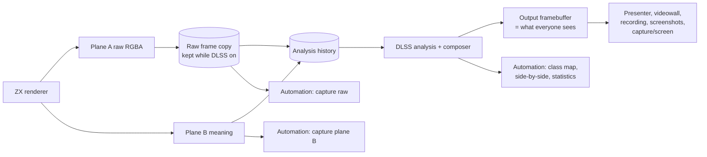
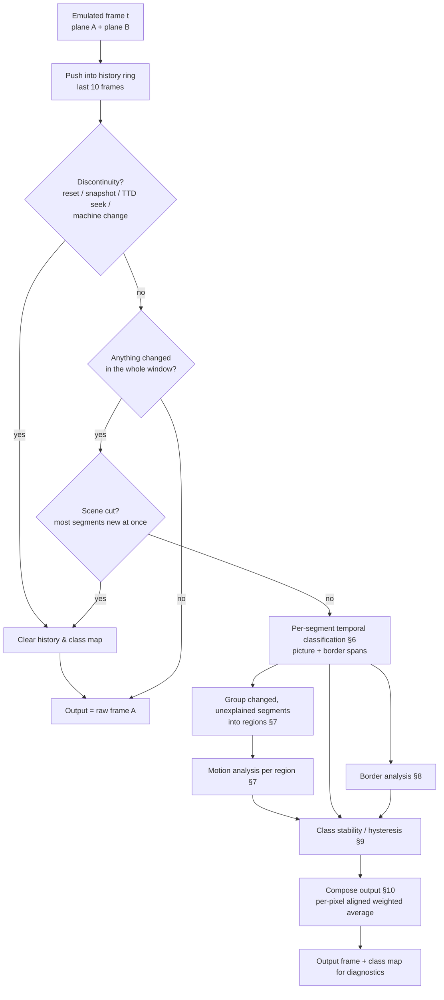
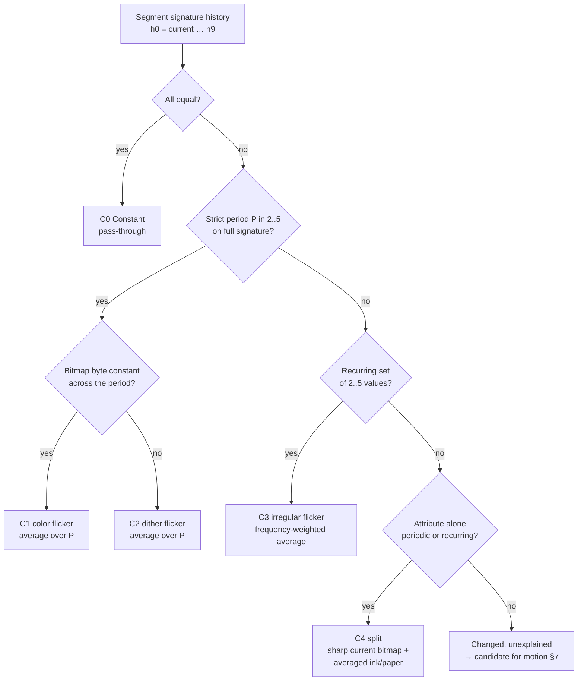
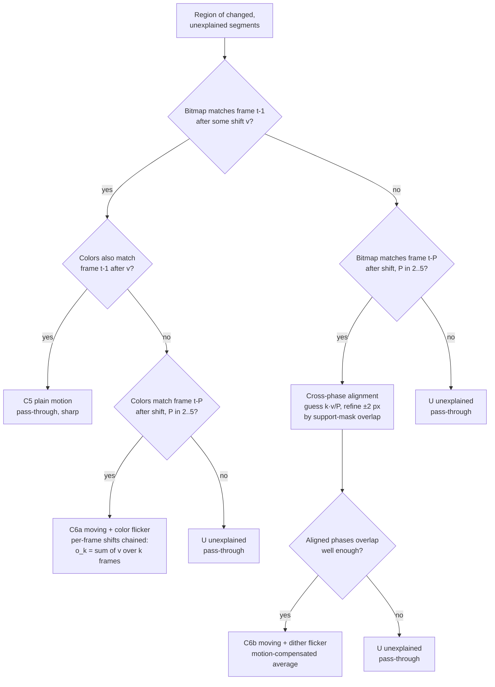
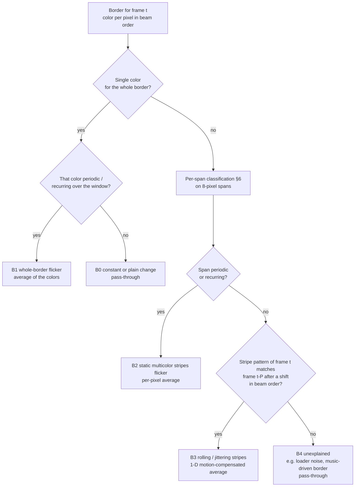
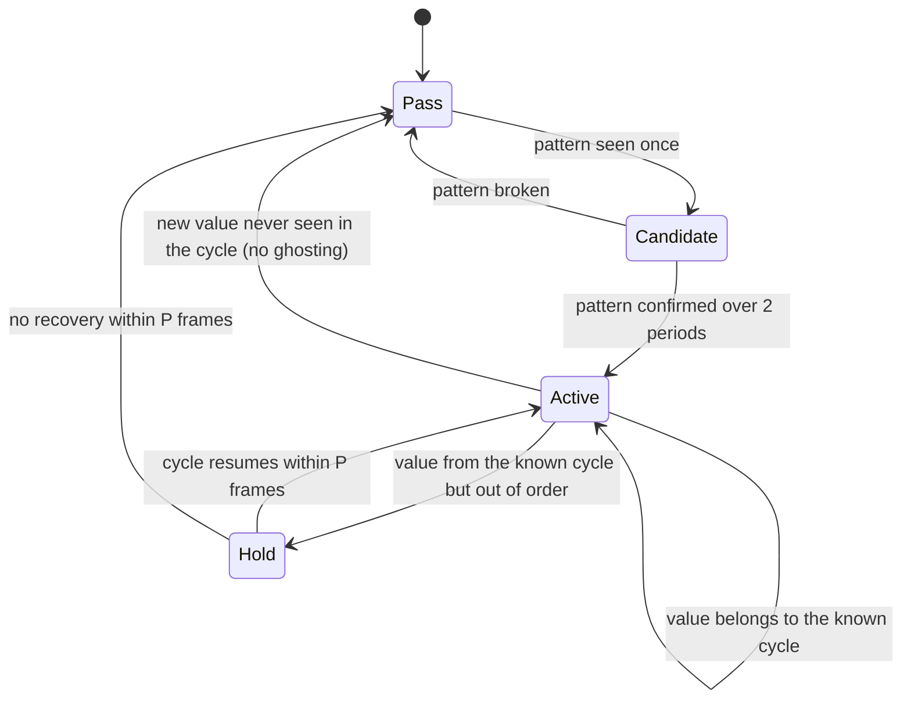
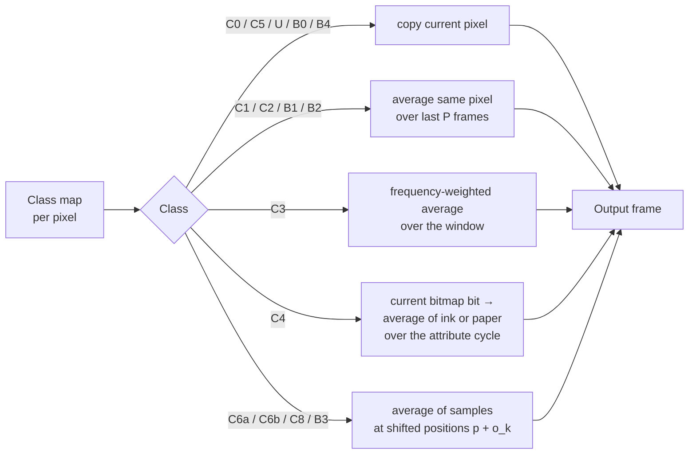

# ZX DLSS GigaScreen — Analysis Algorithm Design

**Created:** 2026-09-27
**Status:** draft for review
**Requirements:** [requirements.md](requirements.md) · **Mixers:** [design-mixers.md](design-mixers.md) · **Tests:** [test-plan.md](test-plan.md)
**Related:** [prior-art.md](prior-art.md) · [Look-Ahead Manager](../2026-09-27-lookahead-manager/design.md) · [Metadata Manager](../2026-09-27-metadata-manager/design.md) · [rollout.md](rollout.md)
**Reference material:** *Across the Edge* by Demarche (`testdata/loaders/trd/across_the_edge_by_demarche.trd`), recorded as a full-demo TTD

---

## 1. What this document covers

How to decide, for every pixel of every frame, whether it is part of an
intentional color-mixing flicker ("GigaScreen"), and if so, how to show the
mixed color instead of the flicker — without smearing anything that moves
normally.

This is the platform-neutral algorithm. The CPU/SIMD and GPU implementations
are separate documents; both implement exactly this algorithm and are tested
against one scalar reference.

**Guiding rule: never worse than the raw frame.** Blending the wrong pixels
produces ghosting, which is worse than flicker. Whenever a detector is not
sure, the pixel is shown exactly as the emulator rendered it.

**Scope:** the standard ZX screen only (256×192 picture area + border).
Hi-res/extended-palette modes of clones are out of scope.

---

## 2. Inputs and output

**Placement:** DLSS runs in the core at the emulated frame end, once per
emulated frame, **before** the framebuffer is latched for presentation
(`MainLoop::OnFrameEnd`, before `Screen::LatchFramebuffer`). The host display
rate therefore does not affect it.



- The output framebuffer carries the corrected picture (R-25).
- The raw frame and plane B are kept next to it while DLSS is on and exposed
  through separate automation methods (R-27).
- The analysis history is fed from the raw planes only; DLSS output is never
  fed back into analysis.

Every emulated frame produces two planes (decision R-2, "A+B"):

| Plane | Content | Used for |
|---|---|---|
| **A — picture** | RGBA frame, exactly what is displayed today | final color mixing, fallback output |
| **B — meaning** | per pixel: color index 0–15, role (ink / paper / border); per 8×1 picture segment: bitmap byte + attribute byte **as the beam actually used them** (so mid-frame attribute changes — multicolor — are exact); per frame: displayed screen page, port `#7FFD` value | classification, masks, bitmap/color separation, motion search |

Consistency invariant (tested): B looked up through the palette equals A,
pixel for pixel.

### 2.1 The analysis unit: the segment

A **segment** is 8 horizontal pixels × 1 line — the natural ZX unit: one
bitmap byte + one attribute byte. Its **signature** is the 16-bit value
`(bitmap << 8) | attribute`.

- Picture area: 32 × 192 = 6144 segments.
- Border: split into 8-pixel spans in raster order; a span's signature is its
  eight 4-bit color indices (32 bits). Border spans have no bitmap.

Using the raw attribute (with the FLASH bit) rather than the resolved color
means FLASH blinking does **not** change the signature, so it is never
mistaken for GigaScreen.

---

## 3. Case catalog

Every case is detected; the cheaper treatment is used whenever the expensive
one is not needed.

| # | Case | What the program does | Example | Treatment |
|---|---|---|---|---|
| C0 | Constant | nothing changes | static title text | pass-through |
| C1 | Color flicker in place | bitmap same, attribute alternates | cell is blue/red on alternate frames → seen as purple | per-pixel average over one period |
| C2 | Pixel-dither flicker in place | bitmap **and** attribute alternate | pixel is ink in frame 1, paper in frame 2 → mix of both | per-pixel average over one period |
| C3 | Irregular flicker in place | like C1/C2, but a phase is sometimes doubled or dropped (effect overran a frame) | A B A B B A B A | average weighted by how often each state appears |
| C4 | Moving bitmap over flickering colors | attributes alternate in place, bitmap moves / changes | a sprite walks across a GigaScreen-colored background | **split**: sharp bitmap from the current frame, averaged ink/paper colors from the attribute cycle |
| C5 | Plain motion | content moves, no flicker | normal sprite, scroller | pass-through (stays sharp) |
| C6a | Moving + color flicker, same shape | object moves, its shape is the same in every phase, its colors alternate | a flying logo cycling two attribute sets | motion-compensated average (align each past frame by the object's shift, then average) |
| C6b | Moving + dither flicker, different shape per phase | object moves and each phase draws a different pixel pattern | moving GigaScreen sprite with two dither halves | motion-compensated average, per-phase offsets found by search |
| C7 | Alternating objects | different objects shown on alternate frames (sprite multiplexing) | two sprites drawn on even/odd frames | handled as C1–C6 — the average is what a CRT viewer saw |
| C8 | Whole-area scroll with flicker | the entire flickering area moves | GigaScreen scroller | C6 with one large region |
| C9 | Scene cut | most of the screen changes to new content at once | demo part switch | reset history, pass-through until patterns are re-established |
| B0–B4 | Border cases | see §8 | | |
| U | Unexplained | changes that fit no model | noise, random effects | pass-through |

### 3.1 One model for all cases

Every treatment is the same formula — a weighted average of *aligned samples
from the last few frames*:

```
out(p) = Σ_k  w_k · color_{t-k}( p + o_k )
```

- `k` — how many frames back (0 = current frame)
- `o_k` — where the same content was in frame `t-k` (zero when nothing moves)
- `w_k` — weight (1/P for a clean period P, measured frequency for C3, 1 for k=0 and 0 otherwise for pass-through)

For the split case C4 the sample is taken with the **current** bitmap bit and
the **past** attribute: `color_{t-k}(p) = bit_t(p) ? ink(attr_{t-k}) : paper(attr_{t-k})`.

So the classes do not need different renderers; they only decide `o_k`, `w_k`
and the sample rule. This is the unified processing hypothesised in the
requirements. The classes still exist because each has a different, cheaper
detector.

---

## 4. Pipeline overview



**Cost tiers (evaluated cheapest first):** whole-frame "nothing changed"
check → per-segment 16-bit compares → region motion search only where
needed. For v1, performance is not the constraint (all GPU and several CPU
cores may be used); tiers exist for correctness clarity first and become the
optimization plan later.

---

## 5. History

- Ring of the last **H = 10** frames of both planes (2 × the longest supported
  period of 5, so a period can be confirmed by seeing it repeat).
- Per segment: ring of the last H signatures (16-bit picture / 32-bit border).
- Frame meta: displayed screen page per frame — a free, strong hint (the page
  toggling every frame means software GigaScreen is running).
- Cleared on every discontinuity: reset, snapshot load, TTD seek, machine or
  video-mode change, palette change.
- Advances exactly once per **emulated** frame (never per host refresh), and is
  fed raw frames only — never blended output (prior-art pitfalls).

### 5.1 The time window: past, and later also future

| Stage | Window | Warm-up | Source of future frames |
|---|---|---|---|
| v1 (decided) | past only (causal) | up to 2 periods of visible flicker when an effect starts | — |
| v1, free | past + 2 frames | reduced by 2 frames | the presenter already delays video by 2 frames to match audio (`screen.h:695-722`); analysis at latch time sees 2 frames beyond the screen |
| Look-ahead | past + up to 10 predicted frames | none (effect detected on its first frame) | [Look-Ahead Manager](../2026-09-27-lookahead-manager/design.md) shadow run |
| Pack playback | known in advance | none | [Metadata Manager](../2026-09-27-metadata-manager/design.md) pack rules |

The classifier is written for a two-sided window from the start: `h[-F..H-1]`
with F future frames (F = 0 in the causal stage). Predicted frames carry a
generation number; when the look-ahead is invalidated (a key press), decisions
for affected frames fall back to the past-only window.

### 5.2 GigaScreen metadata layer

Every decision is also reported to the `gigascreen` layer of the Metadata
Manager (§9 of its design): regions with class, period, phase and mask; motion
vectors; border effects; scene cuts. The manager coalesces them into intervals,
so a whole demo run produces a compact timeline — the basis for statistics,
golden tests and, later, pre-recorded packs that remove runtime analysis for
known software.

---

## 6. Per-segment temporal classification

Signature history `h[0..H-1]`, `h[0]` = current frame.

- **Strict period P** (P = 1..5): `h[i] == h[i+P]` for all valid `i`. Smallest
  P wins. P = 1 means constant.
- **Recurring set** (for C3): the window contains 2..5 distinct values, the
  current value was seen before in the window, and the value changes on at
  least one frame in three.
- **Attribute-only period**: same tests applied to the attribute byte alone
  (used for C4).



Weights for C1/C2: `1/P` over the last P frames (exact). For C3: the count of
each state in the window divided by H.

**Worked example (C1).** A segment alternates attribute `0x0A` (ink red,
paper blue) and `0x11` (ink blue, paper red), bitmap `0xF0` both times.
History: `F00A F011 F00A F011 …` → strict period 2, bitmap constant → C1.
Left 4 pixels show red, blue, red, blue… → output average of red and blue;
right 4 pixels show blue, red… → the same average. Both halves become the
same purple, as on a CRT.

**Worked example (C4).** Attribute alternates `0x0A`/`0x11` as above, but a
sprite moves 1 pixel per frame across the cell, so the bitmap changes every
frame and the full signature has no period. The attribute alone has period
2 → C4. Output: each pixel's ink/paper role is taken from the *current*
bitmap (sprite stays sharp), and its color is the average of that role's
color over the attribute cycle.

---

## 7. Regions and motion analysis

Segments classified "changed, unexplained" are grouped into **regions**:
connected components at 8×8 cell granularity, expanded by the motion search
range (±16 px horizontally, ±16 lines vertically — tunable).

Two kinds of comparison per region:

- **Same-phase match**: frame `t` against frame `t-P`. In a P-phase flicker,
  these two show the same phase, so if the object is the same it only differs
  by a shift. Search the shift `v` minimizing mismatch.
  - Bitmap search: XOR + bit-count over the 1-bit bitmap plane (cheap).
  - Verification: the color-index plane under the found shift.
- **Cross-phase alignment** (C6b only): phase frames draw different
  patterns, so they cannot be matched pixel by pixel. The initial guess is
  the linear interpolation `k · v / P`, refined by a small search (±2 px)
  maximizing overlap of the object's **support mask** (pixels that differ from
  the background color).



**Uncovered background.** A moving object uncovers background that may itself
be flickering (C1–C4). Composition is layered: pixels inside the object's
current-frame support use the motion-compensated average; all other pixels in
the region fall back to their own segment class.

**Page hint.** When the displayed screen page toggles with period P, the
same-phase search starts at that P (faster, and fewer false matches).

---

## 8. Border

The border has no bitmap; it is a sequence of colors in **beam order**.
Stripes that roll or jitter are a *shift in beam time*, so border motion is a
1-D search along beam order rather than a 2-D search.



---

## 9. Class stability

A class that switches on and off from frame to frame is itself a new
flicker, so the class map uses hysteresis. The rule is asymmetric: **leave
blending immediately on new content, keep blending through small
irregularities.**



---

## 10. Composition

For each pixel, the class map gives the sample rule, offsets `o_k` and
weights `w_k` (§3.1). Samples come from plane A (the real palette colors) and
are combined by the active **mixer** from the mixer store — no color formula is
hard-coded here (see [design-mixers.md](design-mixers.md)). Default:
`linear-mean`, pending calibration against real CRT captures. Pass-through pixels are copied from the
current frame A unchanged.



---

## 11. Diagnostics

Automation methods (WebAPI names proposed; the same methods in MCP, CLI, Lua,
Python):

| Method | Returns |
|---|---|
| `GET /api/v1/emulator/{id}/capture/screen` (existing) | what the user sees — processed when DLSS is on |
| `GET …/capture/screen/raw` | raw pre-DLSS frame |
| `GET …/capture/planeb` | plane B (color index, role, segment bitmap/attribute, page) as binary or JSON |
| `GET …/capture/dlss/classmap` | class-map overlay image |
| `GET …/capture/dlss/sidebyside` | raw / processed / class map in one image |
| `GET …/dlss/status`, `…/dlss/stats` | mode, backend, mixer, per-frame class statistics |
| `PUT …/dlss/mixer` | select mixer, set parameters |

Needed for tuning and for tests from day one:

- **Class-map overlay**: one tint per class over the picture (debug view in
  the GUI, image export via WebAPI/MCP).
- **Per-frame statistics**: pixel count per class, regions found, motion
  vectors, periods — exported through WebAPI so a whole-demo run can be
  summarized (e.g. "frames 1200–1850: 38 % C2, 4 % C6b").
- **Side-by-side output**: raw / processed / class map, recordable to GIF/MP4.
- **Metadata timeline**: the `gigascreen` layer shown as a track in the metadata timeline view.

---

## 12. Decisions

All open points are settled; see [requirements.md](requirements.md) R-19..R-30
(causal first + look-ahead, metadata layer, output contract, temporal effects
manager, SIMD policy, quality gates).

---

## Glossary

| Term | Meaning |
|---|---|
| GigaScreen | Showing two (or more) different images on alternate frames so the eye mixes them into extra colors |
| Bitmap | The 1-bit-per-pixel picture data; bit set = ink, clear = paper |
| Attribute | The byte holding ink color, paper color, BRIGHT and FLASH for a block of pixels |
| Multicolor | Changing attributes during the frame so each pixel line (not each 8-line cell) can have its own colors |
| Segment | 8 pixels × 1 line: one bitmap byte + the attribute used for it |
| Signature | The segment's bitmap and attribute packed into one number, compared across frames |
| Period P | Number of frames after which a flicker pattern repeats |
| Phase | Which of the P frames of a cycle is showing |
| Pass-through | Output the pixel exactly as rendered, no mixing |
| Motion compensation | Shifting past frames so a moving object lines up before averaging |
| Support mask | The pixels an object actually covers (differ from background) |
| Hysteresis | Requiring stronger evidence to switch state than to stay in it, to avoid rapid toggling |
