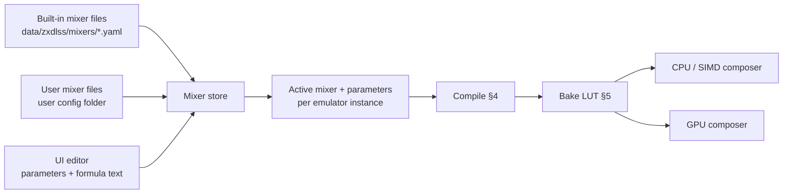
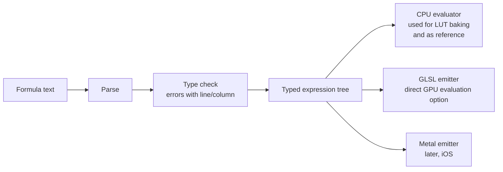

# ZX DLSS GigaScreen — Mixer Library Design

**Created:** 2026-09-27
**Status:** draft for review
**Requirements:** [requirements.md](requirements.md) R-11..R-13
**Used by:** [design-analysis.md §10](design-analysis.md#10-composition)

---

## 1. What a mixer is

The analysis decides **which** samples belong together (which past frames,
which shifted positions, what weights). The **mixer** decides **how** those
samples become one displayed color. The two are strictly separated: the
analysis never hard-codes a color formula, and a mixer never knows about
classes, motion or periods.

Mixer contract:

```
input:  n samples (1..10), each { rgb, weight, age }
          rgb    — palette color of the sample (0..1 per channel)
          weight — from the analysis (sums to 1)
          age    — frames back (0 = current)
output: one rgb
```

Because every sample is a palette color (16 ZX colors, or a user palette of
16), the set of possible inputs is small. That makes it possible to
pre-compute results (§5), so even slow or user-written formulas cost nothing
per frame.

---

## 2. Built-in mixers (initial set)

| Mixer | Idea | Parameters |
|---|---|---|
| `srgb-mean` | plain average of stored values (what `FrameHistory` does today) | — |
| `linear-mean` (default) | convert to linear light, average, convert back; models the eye integrating emitted light | transfer curve: exact sRGB / pure gamma (γ, default 2.2) |
| `crt-gamma` | as `linear-mean` with a CRT display gamma and black level | γ (2.4–2.8), black level |
| `phosphor-decay` | weights also decay with age per channel, as phosphors fade at different speeds (P22 green lasts longer) | decay per R/G/B |
| `oklab-mean` | average in a perceptual space; keeps hue steadier for very different colors | — |
| `matrix-mean` | average in a user 3×3 color space (e.g. a measured CRT primaries matrix) | 3×3 matrix, γ |
| `unreal-pairs` | Unreal Speccy's hand-tuned mixed levels for color pairs (ZZ/ZN/NN/NB/BB/ZB) — historical CRT-calibrated reference ([prior-art §3](prior-art.md#3-unreals-calibrated-pair-levels)) | the six levels |
| `sinc-window` | Unreal's windowed-sinc temporal filter (12 Hz / 8 Hz cut-offs); age-dependent weights | cut-off, window length |
| `koval-compat` | the Spectaculator/Xpeccy plugin's blend (sRGB curve with replaced exponent, current-frame ratio) for side-by-side comparison | gamma, ratio |

Every built-in is **written in the same formula language users use** (§4) and
ships as a file. That keeps the language complete enough for real mixers,
and each built-in doubles as an example.

---

## 3. The store



- One YAML file per mixer: name, description, parameters (type, range,
  default), formula text. YAML matches existing config tooling (rapidyaml is
  already in the tree).
- The store lists built-ins and user mixers; user files override built-ins
  with the same name only when explicitly marked `override: true`.
- Selection and parameter values are saved per emulator instance and
  controllable via WebAPI/MCP (needed for tests and for the fitting tool, §6).
- UI: mixer list, auto-generated sliders for parameters, formula editor with
  live compile errors (line/column) and live preview on the current frame.

Example file:

```yaml
name: linear-mean
description: Average in linear light (eye integrates emitted light)
params:
  gamma: { type: float, min: 1.0, max: 3.0, default: 2.2 }
formula: |
  to(c)   = pow(c, gamma)
  from(c) = pow(c, 1.0 / gamma)
  mix     = from( sum(i, w[i] * to(rgb[i])) )
```

---

## 4. Formula language and compilation

A small, side-effect-free expression language:

- Types: `float`, `vec3`, `mat3`.
- Per-sample inputs: `rgb[i]`, `w[i]`, `age[i]`; count `n`.
- Reducers: `sum(i, expr)`, `max(i, expr)`, `min(i, expr)` over samples.
- Maths: `+ - * /`, `pow exp log sqrt abs min max clamp mix dot`,
  matrix × vector.
- Color helpers: `srgb_to_linear`, `linear_to_srgb`, `to_oklab`, `from_oklab`.
- User-defined helper functions (no recursion) and named parameters.



The CPU evaluator does not need to be fast: it only runs during baking (§5).
The GLSL emitter exists so a formula can also be evaluated directly on the
GPU when a LUT does not fit (e.g. a user palette with more than 16 colors in
the future), and to cross-check the LUT.

---

## 5. Baking: formulas cost nothing per frame

Samples are palette colors, so a mixer result depends only on *which palette
entries* appear and *with what weights*.

- **Clean periods (P ≤ 5, equal weights):** the input is a multiset of at most
  5 entries from 16 colors — about 20 000 combinations in total. The table is
  baked in milliseconds and is tiny.
- **Frequency weights (C3) and motion-compensated mixes:** weights are counts
  over the 10-frame window, i.e. a multiset of 10 entries — about 3.3 million
  combinations (≈ 10 MB as RGB8). This is baked in the background. Until it is
  ready, the direct evaluator is used.
- **Age-dependent mixers** (`phosphor-decay`) depend on sample order, not
  only on the multiset. These are evaluated directly (GLSL on GPU, evaluator
  on CPU) instead of baked, or baked for the fixed age layout of each period.

Re-baking is triggered by a mixer, parameter or palette change. The LUT is
shared by the CPU and GPU paths, so they produce identical colors by
construction.

---

## 6. Calibration against real hardware

Goal: choose default mixers and parameters from evidence, not taste.

- **Reference captures:** video (preferred) or photos of a real CRT running
  the same scenes as the TTD reference (Across the Edge first). Video captures
  the temporal mixing the eye sees; the camera exposure must span whole
  frames (≥ 2 × 20 ms) so the camera integrates like the eye.
- **Fitting tool:** a script that aligns reference frames with emulator
  output for chosen regions (static GigaScreen areas, C1/C2), then fits mixer
  parameters (γ, matrix, phosphor decay) to minimize the perceptual color
  difference (ΔE in OKLab). It uses WebAPI/MCP to set parameters and grab
  output.
- **Outcome:** fitted parameter sets stored as ordinary mixer files (e.g.
  `crt-fitted-<source>.yaml`), selectable like any other mixer.

---

## 7. Tests (summary — full plan in [test-plan.md](test-plan.md))

- Each built-in against hand-computed values (e.g. the blue/red example:
  `srgb-mean` → (107, 37, 110), `linear-mean` γ 2.2 → (156, 37, 145)).
- LUT result equals direct evaluation for every entry.
- GLSL-emitted formula equals CPU evaluator within 1/255 per channel.
- Parser/type-checker: error positions, rejected constructs (recursion,
  unknown names), fuzzing never crashes.
- Single-sample input returns that sample unchanged for every mixer
  (identity property: pass-through pixels must never be altered by a mixer).
