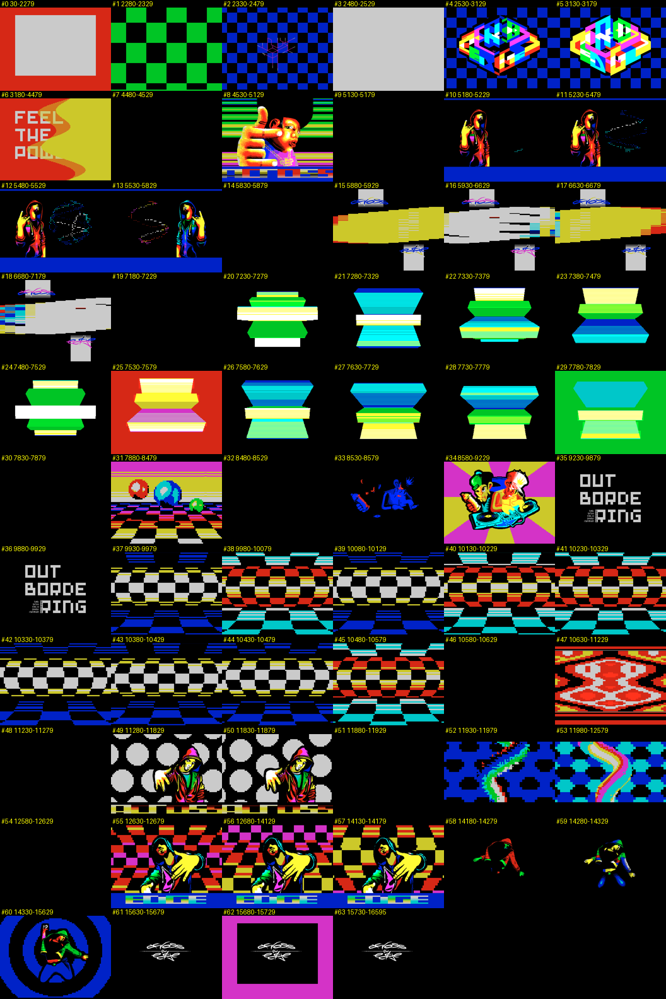

# Reference Material — *Across the Edge* by Demarche

**Created:** 2026-09-28
**Status:** first pass (pixel-level indicators), input for the analyzer (rollout step 1)
**Requirements:** [R-9](requirements.md)

## 1. Recording

| | |
|---|---|
| Disk | `testdata/loaders/trd/across_the_edge_by_demarche.trd` |
| Machine | Pentagon 512K, autostart, TTD recording started right after the boot reset (loader shortcuts locked off by the recording) |
| TTD | `scratch/zxdlss/across_the_edge_full.ttd` (84 MB), frames 25–16595 (≈ 5 min 40 s) |
| Clip | `scratch/zxdlss/clip_full/` (13 MB): every frame extracted with `ttd/step-forward` as its final beam-rendered picture (border and multicolor included), 352×288 palette indices + per-frame meta (active screen, `#7FFD`, border) |
| Tools | `scratch/zxdlss/extract.py`, `analyze.py`, `summarize.py` |

Frame extraction depends on the TTD positioning fix
([2026-09-28-ttd-positioning-and-display](../2026-09-28-ttd-positioning-and-display/design.md)):
before it, frame steps showed a static memory decode without border stripes or
multicolor.

## 2. Indicators

Per pixel, on the final picture of each frame:

- **p2** — differs from the previous frame, equals the one before (A,B,A): period-2 flicker.
- **p3 / p4 / p5** — same test for periods 3–5.
- **other** — changed and none of the above: motion, new content.
- **flip/f** — how often the displayed screen page toggles per frame (1.0 = every frame, software GigaScreen by page flipping).

Values are shares of the picture area (PAPER, 256×192) and of the border.
These are coarse pixel-level signals, not the segment classifier of the
design; they locate the effects, they do not classify them.

## 3. Effect map

| Frames | Time | Content | flip/f | PAPER p2 / other | BORDER p2 / other | Cases to expect |
|---|---|---|---|---|---|---|
| 30–2279 | 46 s | intro, loading, logo | 0 | 0 / 0 | 0.02 / 0.02 | C0 (static), occasional border flicker |
| 2530–3179 | 13 s | isometric logo on checkerboard | **1.0** | 0.41 / 0.02 | 0.03 / 0.07 | C1/C2 via page flipping, nearly static |
| 3180–4479 | 27 s | "FEEL THE POWER", full-screen wavy raster | 0 | 0 / 0.03 | 0 / 0.01 | C5, moving raster — **negative** for mixing |
| 4530–5129 | 12 s | "Hip-Hop King" picture, striped border | **1.0** | 0.18 / 0.07 | **0.34** / 0.12 | C1/C2 page-flip picture + B2 border stripes flicker |
| 5180–5829 | 13 s | hooded figure, dot sphere | 0 | 0.03 / 0.02 | **0.51** / 0.03 | B1/B2 border flicker without page flips; C5 sphere |
| 5880–7179 | 26 s | logo + multicolor bars | 0 | 0.24–0.41 / 0.06 | 0.08 / 0.02 | flicker in one screen (attribute / multicolor), C1/C4 |
| 7180–7879 | 14 s | raster hourglass bars | 0 | ≈0 / 0.27–0.35 | 0 / 0–0.16 | C5/B3 motion — **negative** for mixing |
| 7880–8479 | 12 s | balls over checker floor | 0 | **0.45** / 0.10 | **0.50** / 0.06 | moving objects over flickering multicolor floor: C4/C6 |
| 8580–9229 | 13 s | DJ picture | **0.98** | 0.23 / 0.04 | 0 / 0.10 | C1/C2 page-flip picture |
| 9230–9929 | 14 s | "OUT BORDERING" text | 0 | ≈0 / 0.01 | 0 / 0.01 | C0 |
| 9930–10629 | 14 s | checker tunnel, full screen | 0 | 0.30–0.39 / 0.05–0.20 | 0.32–0.42 / 0.05–0.23 | **moving + flicker**, paper and border: C6/C8/B3 (worst case) |
| 10630–11229 | 12 s | red ornament | 0 | 0.39 / 0.16 | 0.43 / 0.08 | moving + flicker: C6/C8 |
| 11280–11879 | 11 s | hooded figure, dot pattern | **0.98** | 0.31 / 0.08 | 0.26 / 0.09 | page-flip GigaScreen + border |
| 11980–12579 | 12 s | wavy stripe over hex pattern | **0.33** | 0.35 / 0.13 | 0.09 / 0.03 | irregular flipping: **C3**, moving stripe: C4/C6 |
| 12680–14129 | 30 s | figure, checker floor, "EDGE" border | **1.0** | 0.15 / 0.09 | **0.45** / 0.09 | page-flip picture + moving floor + border stripes |
| 14330–15629 | 27 s | figure in pulsing rings | **1.0** | 0.32 / 0.11 | 0.33 / 0.16 | page-flip GigaScreen with zooming rings: C6/C8 |
| 15730–16595 | 18 s | end logo | 0 | 0 / 0 | 0 / 0 | C0 |

Short transitions (≈ 1 s, black frames, border flashes) between parts are
omitted; the full list is `scratch/zxdlss/clip_full/effect_map.json`.

## 4. Observations

- Every case of the [catalogue](design-analysis.md#3-case-catalogue) occurs:
  static page-flip pictures, flicker inside one screen, irregular flipping,
  border flicker with and without stripes, moving objects over flickering
  backgrounds, full-screen moving flicker, and pure motion (negatives).
- **Periods 3–5 barely occur** (≤ 0.02 of the area): this demo is period-2
  material. Periods 3–5 need other sources (3-colour images, synthetic
  generator) — see [prior-art §6](prior-art.md#6-test-material-named-by-the-sources).
- Border flicker is large (up to half the border) and independent of page
  flipping — the border path (design §8) is not optional.
- Page flipping alone does not mean GigaScreen everywhere on screen: in
  12680–14129 only 15 % of the picture flickers while the page flips every
  frame — per-region masks are needed, as designed.

## 5. Candidate golden clips

| Clip | Frames | Why |
|---|---|---|
| `ate-pageflip-static` | 2700–2900 | page-flip picture, nearly static |
| `ate-hiphop-border` | 4600–4800 | page-flip picture + striped border flicker |
| `ate-border-only` | 5300–5500 | border flicker, no page flips |
| `ate-balls-floor` | 8000–8200 | moving objects over flickering floor |
| `ate-tunnel` | 10000–10200 | full-screen moving flicker (worst case) |
| `ate-irregular` | 12100–12300 | irregular flipping (C3) + moving stripe |
| `ate-raster-negative` | 3500–3700, 7300–7500 | pure motion, output must equal raw |
