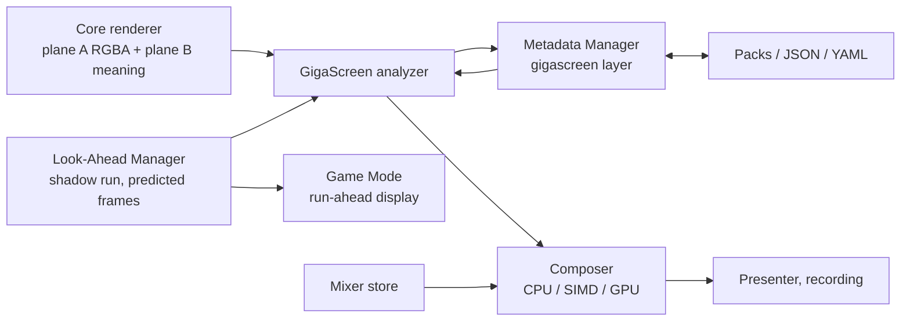
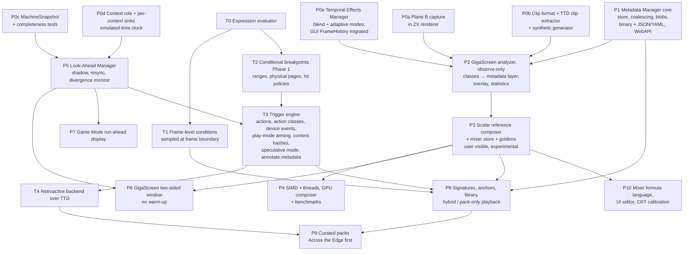

# ZX DLSS GigaScreen, Look-Ahead and Metadata — Integration and Rollout

**Created:** 2026-09-27
**Status:** draft for review
**Features:**
[GigaScreen](requirements.md) ·
[Look-Ahead Manager](../2026-09-27-lookahead-manager/requirements.md) ·
[Metadata Manager](../2026-09-27-metadata-manager/requirements.md) ·
[Timing via triggers](../2026-09-27-metadata-manager/trigger-integration.md)

---

## 1. How the three features fit together

- GigaScreen is the first **producer** and **consumer** of metadata and the
  first **consumer** of look-ahead frames.
- Look-Ahead and Metadata are general services; Game Mode, sprite tracking and
  later ZX DLSS stages reuse them.

---

## 2. Dependency graph and phases

Phases on independent branches of the graph can run in parallel (e.g. P0c/P0d
and P5 alongside P1–P3).

---

## 3. Work order (agreed 2026-09-27)

**Main track (A):**
1. Reference material: full Across the Edge TTD, effect map by frame ranges.
2. P0a plane B + raw frame + `capture/screen/raw`, `capture/planeb`.
3. P0e Temporal Effects Manager skeleton, `blend` port with parity test.
4. P0b clip format, TTD clip extractor, synthetic generator.
5. P1 minimal slice: in-memory store, coalescing, JSON export.
6. P2 analyzer observe-only (scalar) → **M1**.
7. P3 composer + built-in mixers + goldens → **M2**.
8. P4 SIMD / threads / GPU by `SIMD-CANDIDATE` tags.

**Parallel track (B):** P0c `MachineSnapshot` + completeness tests → P0d
context role and sinks → P5 look-ahead → P6 → **M3** (+ P7 Game Mode).

**Later track (C):** T0 expression evaluator (can start any time) → T1 → T2 →
T3 → T4 → P8/P9 → **M4**.

| Milestone | Meaning |
|---|---|
| M1 | analyzer on Across the Edge with a class report — validates the model |
| M2 | smart blending visible in GUI and recordings (experimental) |
| M3 | no warm-up at effect start; Game Mode run-ahead |
| M4 | recognized demos play from packs without runtime analysis |

## 4. Phase details

| Phase | Delivers | Feature flag (features.ini) | Default | Exit criteria |
|---|---|---|---|---|
| P0a | Plane B written by the ZX renderer (color index, role, segment bitmap/attribute, page); raw frame copy; automation methods `capture/screen/raw`, `capture/planeb` | `temporaleffects` (plane B captured when a mode needs it) | off | B→palette equals A on all ZX models and test clips; renderer cost with flag off unchanged, with flag on measured |
| P0e | Temporal Effects Manager skeleton in core; `blend` mode ported from GUI `FrameHistory` with parity test; `adaptive` baseline mode; one GUI dialog; GUI `FrameHistory` removed | `temporaleffects` | off | parity test green; no double blending possible |
| P0b | Clip file format, extractor from TTD via WebAPI/MCP, synthetic generator for all cases, Across the Edge full-demo TTD | — (tooling) | — | clips round-trip losslessly; every case has a generator with ground truth |
| P0c | `MachineSnapshot` raw state copy | — (internal) | — | run-restore-run hash equal for every model and peripheral; cost ≤ 0.2 ms on 128K |
| P0d | Context role, per-context sinks, emulated-time RTC/CMOS | — (internal) | — | isolation tests: a speculative context produces no audio, posts, TTD records, recordings or media writes |
| P1 | Metadata Manager core | — (started on demand by consumers) | — | test suite green; binary↔JSON↔YAML round-trip lossless |
| P2 | GigaScreen analyzer in **observe-only** mode: classifies, fills the metadata layer, shows overlay; picture unchanged | `temporaleffects` mode `dlss/observe` | off | whole Across the Edge run summarized by class and frame range; synthetic class accuracy reported; zero effect on output |
| P3 | Scalar reference composer, mixer store with built-ins, golden sets, review report | `temporaleffects` mode `dlss/blend` | off, **experimental** | zero ghosting on synthetic clips; goldens reviewed and approved; negative material (Shadow Fields, Cubix) equals raw |
| P4 | SIMD + multi-thread CPU composer, GPU composer (Qt GL) | `temporaleffects` + backend setting | CPU | bit-exact CPU paths; GPU within 1/255; benchmark baseline stored |
| P5 | Look-Ahead Manager with divergence monitor | — (started on demand by consumers) | — | resync triggers tested; divergence rate 0 on test corpus; steady-state cost measured |
| P6 | GigaScreen uses predicted frames | `temporaleffects` mode `dlss/lookahead` | off | warm-up frames = 0 on synthetic clips with constant input |
| P7 | Game Mode run-ahead display | Game Mode setting `runahead` | off, opt-in | measured latency reduction; A/V offset documented |
| T0 | Expression evaluator (existing design `2026-08-26-expression-evaluator`) | — | — | grammar tests from the design green |
| T1 | Frame-level conditions: expression sampled once per frame, enter/leave edges, `@prev` values | — | — | exact edge frames in tests; cost per condition measured |
| T2 | Conditional breakpoints Phase 1 (existing design, slices 1a–1h) | `breakpoints` | as today | existing plan's exit criteria |
| T3 | Trigger engine (roadmap 02 T1–T2 + device events) plus metadata additions: play-mode arming, content-hash observables, speculative mode, `annotate.metadata` | `triggers` | on when armed | play-mode miss-path cost within budget; zero cost with nothing armed |
| T4 | Retroactive trigger evaluation over TTD | — | — | same matches live and retroactive on test recordings |
| P8 | Identification, trigger-based anchors and rules, library, hybrid and pack-only playback | `temporaleffects` mode `dlss/auto` | off | pack for a test title aligns under fast-load on/off, different menu delays and drives; hybrid disagreement logging works |
| P9 | Pack authoring tool (automatic trigger proposals from TTD, timing-independence validation) + curated pack for Across the Edge | — | — | pack-only playback matches golden output |
| P10 | Formula language, UI editor, CRT calibration tool | — | — | built-ins expressed in the language; fitted parameter sets from real CRT video |

---

## 5. Rollout rules

- **Observe before acting.** Each analysis feature ships first in observe-only
  mode (collects metadata, shows overlays, never changes the picture). The
  picture-changing mode is enabled only after the observe data on the test
  corpus looks right.
- **Everything behind flags**, default off until the exit criteria of the phase
  are met; picture-changing modes are labeled experimental in the UI for their
  first release.
- **Idle cost is zero or measured.** Every flag has a benchmark for its
  disabled state; plane B capture and the metadata manager must not slow the
  emulator when unused.
- **Canonical run is sacred.** Nothing in these features may change what the
  emulated machine does; the determinism and divergence tests enforce this.
- **Goldens change only by review.**
- **One switch:** users enable temporal effects once and choose a mode; the
  existing whole-frame blend becomes the `blend` mode (P0e).

---

## 6. Where the code goes (proposed)

| Component | Location |
|---|---|
| Plane B capture | `core/src/emulator/video/zx/` (renderer), plane type in `core/src/emulator/video/` |
| Temporal Effects Manager, `blend` / `adaptive` modes | `core/src/temporal/` |
| ZX DLSS mode: GigaScreen analyzer, composer (scalar, SIMD) | `core/src/temporal/zxdlss/` |
| Mixer store, formula language | `core/src/temporal/mixers/` |
| GPU composer | core-side GPU backend writing into the output framebuffer (R-25); lazy readback is optimization O-12 |
| Look-Ahead Manager, `MachineSnapshot` | `core/src/emulator/lookahead/` |
| Metadata Manager | `core/src/metadata/` |
| Tests | `core/tests/...` mirroring the source tree, `<sourcefile>_test.cpp` |
| Test data, clips, goldens | `testdata/zxdlss/` |
| Built-in mixers and packs | `data/zxdlss/mixers/`, `data/metadata/` |
| Platform-specific GPU / SIMD code | `platform/<os>/` subfolders where OS-specific |
