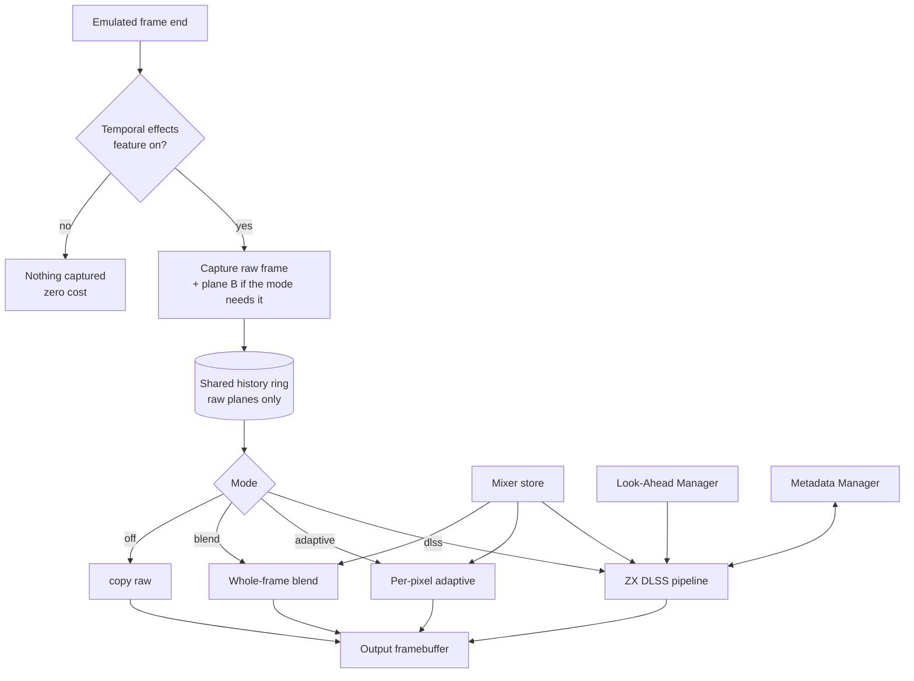

# Temporal Effects Manager

**Created:** 2026-09-27
**Status:** draft for review; step 1 (the `dlss` mode in the core, GUI dialog) implemented - section 7
**Requirements:** [requirements.md](requirements.md) R-28
**Replaces:** GUI-side `FrameHistory` / `TemporalEffectsDialog`
(`unreal-qt/src/widgets/framehistory.*`, `unreal-qt/src/ui/temporaleffectsdialog.cpp`)

---

## 1. Idea

All processing that combines several emulated frames into one displayed frame
lives in **one core component**, switched on by **one feature** and configured
by choosing a **mode** — from the simple whole-frame blend that exists today up
to ZX DLSS with its sub-modes.

It runs at the emulated frame end, before presentation, and writes into the
output framebuffer (R-25), so every consumer gets the result.

---

## 2. Modes

| Mode | What it does | Origin |
|---|---|---|
| `off` | output = raw frame | — |
| `blend` | whole-frame blend over 2–5 frames, equal or exponential weights, any mixer from the store | today's `FrameHistory`, moved into core |
| `adaptive` | per-pixel A,B,A / static-skip / period-3 test, 2- or 3-frame blend | the koval / Xpeccy algorithm ([prior-art §2](prior-art.md#2-the-koval-algorithm-in-detail)); a cheap baseline and comparison reference |
| `dlss` | ZX DLSS GigaScreen: segment classification, masks, motion compensation | this design |

`dlss` sub-modes:

| Sub-mode | Behavior |
|---|---|
| `observe` | analysis + metadata + overlays; picture unchanged |
| `blend` | runtime analysis, past frames only |
| `lookahead` | runtime analysis with predicted future frames (Look-Ahead Manager) |
| `auto` (default once packs exist) | recognized software → pack (hybrid or pack-only, as the pack says); otherwise `lookahead` if available, else `blend` |

---

## 3. Structure



- **One history ring** for all modes (raw planes, depth = the maximum any mode
  needs); cleared on mode change, reset, snapshot load, TTD seek, palette or
  machine change.
- **One mixer store** for all modes — the simple blend gains linear-light and
  the other mixers for free.
- **One backend choice** (scalar / SIMD + threads / GPU) shared by all modes.
- **Services on demand:** the Look-Ahead and Metadata managers are started
  only when the selected mode uses them; they have no separate switch for this
  use.
- Each mode is an implementation of one interface:

```cpp
class ITemporalEffect {
public:
    virtual ~ITemporalEffect() = default;
    virtual TemporalNeeds needs() const = 0;          // history depth, plane B, look-ahead, metadata
    virtual void reset() = 0;
    virtual void process(const TemporalFrameContext& ctx,   // history, predicted frames, meta
                         FramebufferDescriptor& output) = 0;
};
```

---

## 4. Configuration and surfaces

- **Feature flag:** `[temporaleffects] state = on|off, mode = off|blend|adaptive|dlss`
  in `features.ini`; sub-mode and parameters in the emulator settings.
- **GUI:** one "Temporal Effects" dialog replacing `TemporalEffectsDialog`:
  mode selector, per-mode parameters, mixer selector and parameters, backend,
  diagnostics toggles (class-map overlay, side-by-side).
- **Automation:** `GET/PUT …/temporal/mode`, `…/temporal/params`,
  `…/temporal/mixer`, plus the DLSS-specific capture and statistics methods
  (design-analysis §11). Same methods in MCP, CLI, Lua, Python.

---

## 5. Migration of the existing GUI blend

1. Implement `blend` mode in core with the same parameters (history 2–5,
   equal/exponential, decay) and the `srgb-mean` mixer.
2. **Parity test:** for the same input frames, core `blend` output equals the
   old `FrameHistory::getBlendedFrame` output.
3. Switch the GUI dialog to the core mode; keep the old settings keys readable
   and map them to the new ones.
4. Remove `FrameHistory`, `FrameHistoryGL` and `TemporalEffectsDialog` from
   `unreal-qt`.

Until step 4, the old GUI blend and the core temporal effects cannot be on at
the same time (double blending).

---

## 6. Tests

| Suite | Checks |
|---|---|
| `temporaleffectsmanager_test.cpp` | mode switching resets history; feature off captures nothing; needs() drive service start/stop |
| `blend` parity | equals old `FrameHistory` output for the same frames |
| `adaptive` | matches the koval reference behavior on synthetic A,B,A / period-3 / static inputs |
| All modes | run on every synthetic case and golden clip; the review report shows all modes side by side |

---

## 7. Step 1 as built (2026-09-30)

The `dlss` mode runs in the core; the GUI blend (`FrameHistory`) stays where
it is for now, and the two are never on together.

| Part | Where |
|---|---|
| Algorithms | `core/src/emulator/video/zxdlss/` (moved from `tools/verification/zxdlss/algo`; the tools link the core). Built-ins are registered explicitly in `registry.cpp`: the core is a static archive, and a self-registering object file would be dropped by the linker |
| Temporal effect | `core/src/emulator/video/temporaleffects.{h,cpp}` - `TemporalEffects`: a worker thread, one job per latched frame |
| Present queue | `Screen`: 12 slots (was 4), a serial per slot, `SetTemporalAlgorithm(name)` / `GetTemporalAlgorithm()` / `GetTemporalStats()`, `GetEffectivePresentDelayFrames()` |
| Audio | `SoundManager::setOutputDelayFrames(n)`: a whole-frame delay line after the recording and analyzer taps, before the DRC resampler |
| GUI | Tools -> Temporal Effects: Effect = Frame blending / ZX DLSS de-flicker, algorithm choice (default `mod-tpgwafsd`), live status |

**Per frame.** `Screen::LatchFramebuffer` (emulation thread, frame end) copies
the frame into its present slot, then hands the frame's plane B to the worker
and returns. The worker runs the algorithm; its output is the frame pushed
`delay()` frames earlier, and it writes that output over the frame's present
slot (found by serial). The emulation thread never waits for the algorithm.

**Delays.** While the effect is active the present queue serves the frame
`delay() + 1` frames back (the look-ahead + one frame for the worker to finish):
7 frames for `mod-tpgwafsd`, about 143 ms on a Pentagon. The configured A/V
delay (`[VIDEO] AVSyncDelayFrames`, auto = 2) already covers 2 of them; the
audio sent to the device waits the other 5 (`setOutputDelayFrames(7 - 2)`), so
picture and sound stay in sync. The delay line passes one frame of samples per
frame whatever its length - silence while it fills, the oldest frames dropped
when it shrinks - so the DRC ring occupancy and its controller see no change.

**Deadline and what the viewer sees.** The worker has one frame period
(~20 ms) to finish a frame: the output is due in the present queue when that
frame becomes the one served. When it is late the viewer gets the raw frame -
counted as `shown_raw` (a present slot remembers it was served; an output that
arrives afterwards is written but counted), and the Qt dialog's LED goes dark
(`correcting` = the slot served now holds the algorithm's output). The worker
and the algorithm's threads run at the UI's priority
(`ThreadHelper::setInteractivePriority`: macOS QoS user-interactive, never
real-time; stock scheduling on Linux and Windows), and the algorithm keeps its
threads in a `ThreadPool` (`core/src/common/threadpool.h`) instead of starting
them for every stage. On a machine loaded far beyond its cores (load average
~100 on 20 cores during development) the deadline is still missed; one more
frame of margin (+20 ms of picture and sound) would be the next step.

**What the last frame got.** `Algorithm::lastFrame()` reports the pixels each
detector mixed (period 2..5, two-page field) and the whole-frame patterns
(field on the whole paper, scene average); the dialog and every automation
surface show it with the pattern the frame was mostly rendered with.

**Restarts.** The algorithm needs every frame in order. It restarts (and the
queue shows raw frames until its look-ahead refills) after a TTD seek
(`FlushAndPresentFramebuffer`), a frame size change, a new algorithm, or a
worker 3 frames behind.

**Palette.** Every frame carries the emulator's live palette
(`Screen::GetRGBAPalette16`, `FrameInput::palette`); the algorithm mixes in it and
rebuilds its mix tables when it changes. It has no palette of its own. Clips
exported for the tools carry it in `clip.json` ("palette16"); older clips have it
recovered from their RGBA frames.

**Not a ZX screen.** Plane B exists only with the features `zxdlss` +
`screenhq` and a ZX screen (see "Machine support" below); otherwise the effect
is inactive and says why (the dialog switches both features on). A machine that
shows no ZX screen now reports `applicable: false` and an `inactive_reason`
starting with `not applicable:` on every surface; the Qt dialog shows that text
instead of "Waiting".

**Automation.** One status report and one switch (`core/automation/temporalstatus.h`)
on every surface: CLI `video temporal [status|list|off|<algorithm>]`; WebAPI
`GET /api/v1/emulator/{id}/video/temporal` and `PUT` (or `POST`) with
`{"algorithm": "<name>"|""}` (400 with the valid names on an unknown one);
Lua / Python `video_temporal()` and `video_temporal_set(name)`; MCP
`capture_media` actions `temporal_status` / `temporal_set` (through the
WebAPI route, with a one-line summary). Status fields: `algorithm`, `active`,
`inactive_reason`, `video_delay_frames`, `video_delay_ms`,
`audio_extra_delay_frames`, `processed`, `written`, `late`, `restarts`,
`last_ms`, `average_ms`, `algorithms` (all but `raw` and `-ref`) and
`default_algorithm` (`mod-tpgwafsd`).

**Machine support.** The algorithm takes a 352 x 288 ZX frame (256 x 192 paper
at (48, 48)) or the Pentagon overscan 384 x 304, as plane B plus the 16 colors it
is drawn in. `Screen::LatchFramebuffer` asks the machine's screen for that frame
(`Screen::TemporalInput`, emulation thread, only while an algorithm is selected)
and records with the frame's present slot where the ZX frame sits in the
machine's framebuffer (`TemporalWindow`: origin and horizontal scale);
`WriteTemporalOutput` writes the output back through that window.

| Machine / mode | ZX frame | Output written to |
|---|---|---|
| ZX raster machines (48K, 128K, +2/+3, Pentagon, Scorpion, ATM / Profi / TS-Conf in their ZX modes, ...) | plane B as the framebuffer (`ScreenZX`, per-T renderer) | the whole framebuffer |
| Sprinter, Spectrum mode (2026-10-03) | the 32 x 24 Spectrum squares the launcher writes, sampled from the Sprinter's own plane B: every second 14 MHz pixel (a ZX pixel is two), window at (16, 0) of the 736 x 288 frame with the launcher's table; the 16 colors from the text palettes (ink pens `#500 + attribute`) | the window, each output pixel two pixels wide; the 16 border columns left and right repeat the frame's edge pixel |
| Sprinter native modes (text, graphics 320 / 640, mixed) | none: `not applicable: Sprinter native mode (<brief>)` | nothing (no delay added) |
| Other non-ZX frames (Profi 512 x 240, ATM hi-res, ...) | none: `not applicable: frame WxH is not a ZX screen` | nothing |

The Sprinter's Spectrum mode is recognized from the mode table, not from a
register: `SprinterPicture` (the same summary as the status bar) says Spectrum,
not mixed, 768 Spectrum squares, and they form one 256 x 192 screen in ZX order
(`ScreenSprinter::SpectrumWindow`); the window must leave the full 48-pixel ZX
border inside the frame (a HOLD shift of a line already does not). The Sprinter
renderer writes plane B in the same pass as the pixels (`DrawSpanPlaneB`, only
while plane B is on) with the ZX renderer's encoding, so the input is
beam-accurate: the launcher puts the frame INT at T 64 480 (line 287, after the
picture), 80 lines before the first paper line as on a Pentagon. Checked on
Across the Edge (2026-10-03): the same demo frames on a Sprinter (P128 launcher)
and a Pentagon give identical paper plane B; the processed paper is the same
picture in each machine's palette (a one-to-one color map: the Sprinter BIOS
text palette is not the emulator's Pentagon palette). The detector coverage
differs only through the border: the Sprinter shows 8 ZX pixels less border at
each side (blank squares) and its border color changes 8 lines off in the
bottom border. Test: `ScreenSprinterTemporal_Test.SpectrumMode_ProcessedFramesEqualPentagons`.

The GUI frame blending (`FrameHistory`, unreal-qt) works on the presented frame
of any size and needs nothing per machine.

**Look-ahead and latency.** The 7 frames of picture delay (5 of them paid by
the audio) come from the algorithm's 6 frames of look-ahead. A shorter one was
measured (2026-09-30): with 0, 1 or 2 frames 5-6 of the 12 golden scenes
regress, so the look-ahead stays 6 (POC `results.md`, "Limited look-ahead").

**Open:**
- one more frame of margin if the worker still misses its deadline on a loaded
  machine (`shown_raw` grows): +20 ms of picture and sound.
