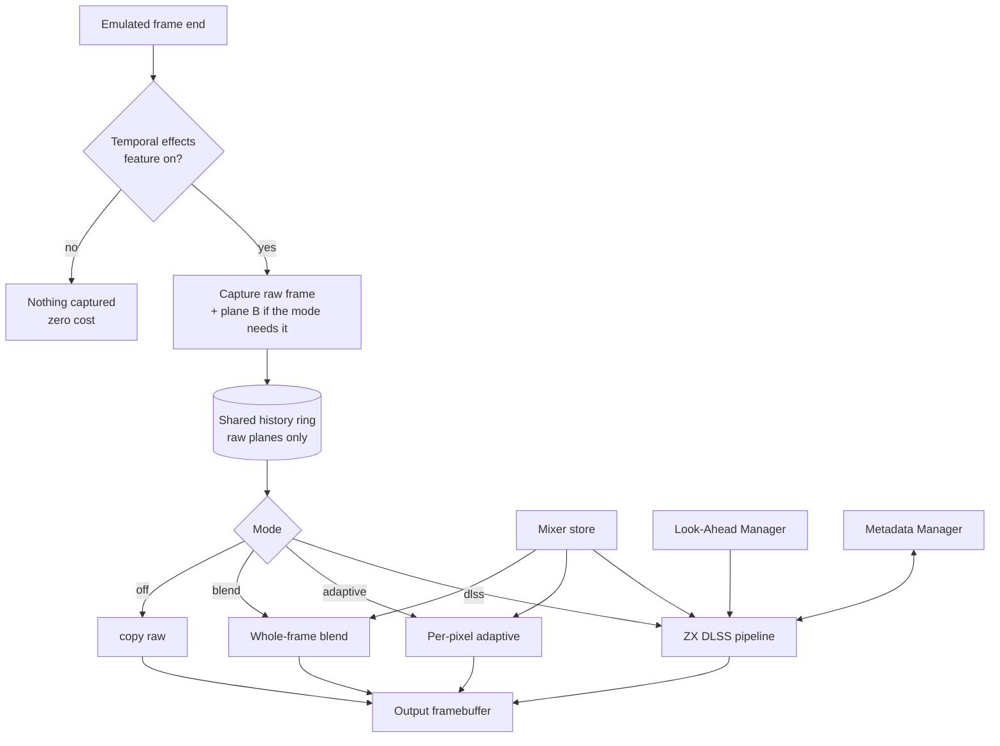

# Temporal Effects Manager

**Created:** 2026-09-27
**Status:** draft for review
**Requirements:** [requirements.md](requirements.md) R-28
**Replaces:** GUI-side `FrameHistory` / `TemporalEffectsDialog`
(`unreal-qt/src/widgets/framehistory.*`, `unreal-qt/src/ui/temporaleffectsdialog.cpp`)

---

## 1. Idea

All processing that combines several emulated frames into one displayed frame
lives in **one core component**, switched on by **one feature** and configured
by choosing a **mode** — from the simple whole-frame blend that exists today up
to ZX DLSS with its sub-modes.

It runs at the emulated frame end, before presentation, and writes into the
output framebuffer (R-25), so every consumer gets the result.

---

## 2. Modes

| Mode | What it does | Origin |
|---|---|---|
| `off` | output = raw frame | — |
| `blend` | whole-frame blend over 2–5 frames, equal or exponential weights, any mixer from the store | today's `FrameHistory`, moved into core |
| `adaptive` | per-pixel A,B,A / static-skip / period-3 test, 2- or 3-frame blend | the koval / Xpeccy algorithm ([prior-art §2](prior-art.md#2-the-koval-algorithm-in-detail)); a cheap baseline and comparison reference |
| `dlss` | ZX DLSS GigaScreen: segment classification, masks, motion compensation | this design |

`dlss` sub-modes:

| Sub-mode | Behavior |
|---|---|
| `observe` | analysis + metadata + overlays; picture unchanged |
| `blend` | runtime analysis, past frames only |
| `lookahead` | runtime analysis with predicted future frames (Look-Ahead Manager) |
| `auto` (default once packs exist) | recognized software → pack (hybrid or pack-only, as the pack says); otherwise `lookahead` if available, else `blend` |

---

## 3. Structure



- **One history ring** for all modes (raw planes, depth = the maximum any mode
  needs); cleared on mode change, reset, snapshot load, TTD seek, palette or
  machine change.
- **One mixer store** for all modes — the simple blend gains linear-light and
  the other mixers for free.
- **One backend choice** (scalar / SIMD + threads / GPU) shared by all modes.
- **Services on demand:** the Look-Ahead and Metadata managers are started
  only when the selected mode uses them; they have no separate switch for this
  use.
- Each mode is an implementation of one interface:

```cpp
class ITemporalEffect {
public:
    virtual ~ITemporalEffect() = default;
    virtual TemporalNeeds needs() const = 0;          // history depth, plane B, look-ahead, metadata
    virtual void reset() = 0;
    virtual void process(const TemporalFrameContext& ctx,   // history, predicted frames, meta
                         FramebufferDescriptor& output) = 0;
};
```

---

## 4. Configuration and surfaces

- **Feature flag:** `[temporaleffects] state = on|off, mode = off|blend|adaptive|dlss`
  in `features.ini`; sub-mode and parameters in the emulator settings.
- **GUI:** one "Temporal Effects" dialog replacing `TemporalEffectsDialog`:
  mode selector, per-mode parameters, mixer selector and parameters, backend,
  diagnostics toggles (class-map overlay, side-by-side).
- **Automation:** `GET/PUT …/temporal/mode`, `…/temporal/params`,
  `…/temporal/mixer`, plus the DLSS-specific capture and statistics methods
  (design-analysis §11). Same methods in MCP, CLI, Lua, Python.

---

## 5. Migration of the existing GUI blend

1. Implement `blend` mode in core with the same parameters (history 2–5,
   equal/exponential, decay) and the `srgb-mean` mixer.
2. **Parity test:** for the same input frames, core `blend` output equals the
   old `FrameHistory::getBlendedFrame` output.
3. Switch the GUI dialog to the core mode; keep the old settings keys readable
   and map them to the new ones.
4. Remove `FrameHistory`, `FrameHistoryGL` and `TemporalEffectsDialog` from
   `unreal-qt`.

Until step 4, the old GUI blend and the core temporal effects cannot be on at
the same time (double blending).

---

## 6. Tests

| Suite | Checks |
|---|---|
| `temporaleffectsmanager_test.cpp` | mode switching resets history; feature off captures nothing; needs() drive service start/stop |
| `blend` parity | equals old `FrameHistory` output for the same frames |
| `adaptive` | matches the koval reference behavior on synthetic A,B,A / period-3 / static inputs |
| All modes | run on every synthetic case and golden clip; the review report shows all modes side by side |
