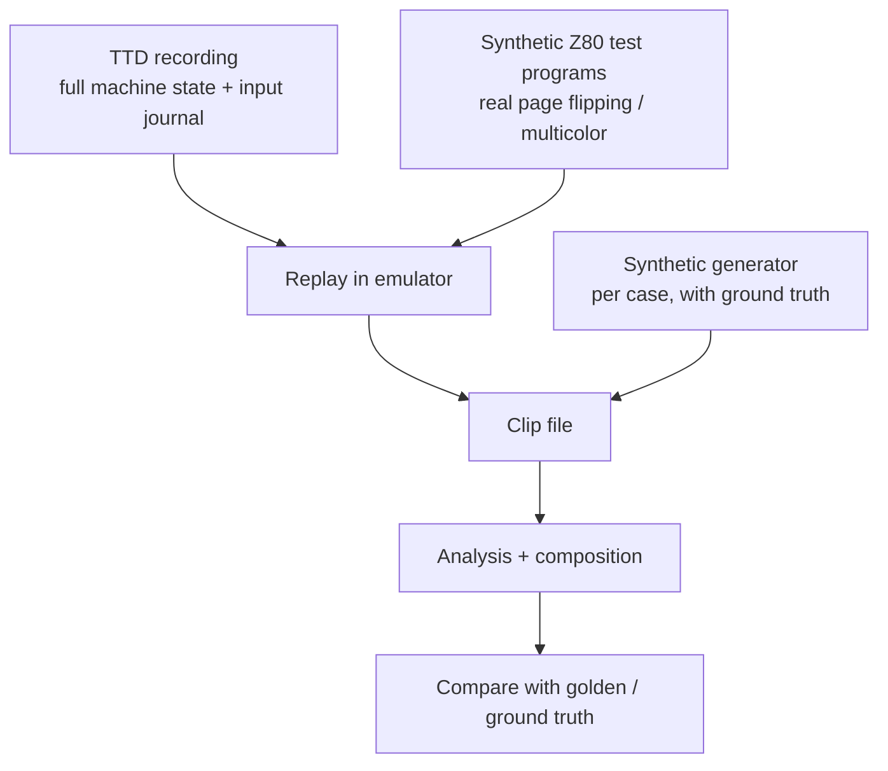

# ZX DLSS GigaScreen — Test and Benchmark Plan

**Created:** 2026-09-27
**Status:** draft for review
**Requirements:** [requirements.md](requirements.md) R-7, R-9, R-14..R-18

---

## 1. Principles

- One **scalar reference** implementation is the source of truth. CPU SIMD,
  multi-threaded CPU and GPU implementations are tested against it.
- Every case of the [case catalog](design-analysis.md#3-case-catalog) has
  its own synthetic test with known ground truth.
- Real material is checked against **reviewed golden sets**; goldens are never
  updated automatically.
- Test files follow the project rule `<sourcefile>_test.cpp`.
- Test data lives under `testdata/zxdlss/`; temporary outputs go to
  `scratch/` and are cleaned up.

---

## 2. Input formats

| Format | What it holds | Why |
|---|---|---|
| **TTD recording** | whole demo, exact and replayable | source for real-material clips; any range can be re-extracted |
| **Clip file** (new, lossless) | sequence of frames: plane A (RGBA), plane B (color index, role, bitmap/attribute per segment), frame meta (screen page, `#7FFD`), optionally screen memory pages 5/7 per frame; zstd-compressed | fast, emulator-free test input; the unit stored in golden sets |
| **Lossless animation export** | plane A as APNG/PNG sequence | human review, external tools, calibration |
| **Ground-truth sidecar** (synthetic clips only) | true class per pixel, true intended mixed color, true motion vectors | exact scoring |

Clips are extracted from TTD via WebAPI/MCP (range by frame numbers), so any
interesting moment found while watching the demo becomes a test input in one
command.

---

## 3. Synthetic generator

A parametric generator writes plane B directly (bitmap, attributes, border
timeline), renders plane A through the palette, and writes ground truth.

| Case | Generator parameters |
|---|---|
| C0 | random static content |
| C1 | period 2..5, attribute sets, bitmap pattern |
| C2 | period 2..5, per-phase bitmaps (checkerboard, random dither, ordered dither) |
| C3 | as C1/C2 + dropped/doubled phases (rate, positions) |
| C4 | flickering attribute field + sprite moving at 0.25..8 px/frame, any direction |
| C5 | sprites/scrollers without flicker, same speed range |
| C6a | moving object, same shape per phase, colors cycling |
| C6b | moving object, different dither pattern per phase, sub-cell speeds |
| C7 | two objects on alternate frames, static and moving |
| C8 | full-area scroll with flicker, 1..8 px/frame |
| C9 | scene cut at frame N, with and without flicker on both sides |
| Multicolor | attributes changed per line, static and moving |
| FLASH | FLASH cells mixed with each case |
| B0–B4 | uniform border flicker, static stripes, rolling stripes, beam-time jitter of 1..8 px, noise |
| Mixed scenes | several cases in one frame, overlapping regions, object crossing a flickering background |
| Noise | random bytes per frame — must stay pass-through |
| Double buffering | page flips every frame with *different* content (ordinary game double buffering) — must stay pass-through |

**Synthetic Z80 programs** (in addition): small test programs that really
flip screen pages via `#7FFD`, write attributes mid-frame, and change the
border in timed loops. They run in the emulator and test the complete chain,
including plane B capture timing — which the direct generator cannot.

---

## 4. Quality metrics

Two kinds (R-30):

- **Hard gates** — fail on any violation from day one: ghosting = 0 on
  synthetic input, pass-through areas exact, negative material equals raw,
  implementation equivalence (§5.3), plane B consistency, warm-up bounds.
- **Measured metrics** — no guessed thresholds. The first full run (synthetic
  + Across the Edge) records a **baseline** per metric, per case and per clip.
  Afterwards a regression against the baseline fails the test; the baseline is
  raised only when an improvement is reviewed and approved (same workflow as
  goldens).

Computed per clip, per case, and per frame:

| Metric | Meaning | Target |
|---|---|---|
| Class accuracy | confusion matrix predicted vs true class | measured: no regression vs baseline |
| **Ghosting** | pixels changed from raw where the truth is pass-through | **0** on synthetic; reported on real clips |
| **Sharpness preservation** | pass-through areas equal raw frame | exact |
| Mixed color error | ΔE (OKLab) vs true intended mix | measured: no regression vs baseline |
| Flicker residue | frame-to-frame change of output inside mixed areas | measured: no regression vs baseline |
| Warm-up | frames from flicker start to blending | hard: ≤ 2 periods causal; 0 with look-ahead and constant input |
| Class stability | class changes per pixel per second | measured: no regression vs baseline |

---

## 5. Test suites

### 5.1 Invariants and properties

- Plane B through the palette equals the raw frame, pixel for pixel.
- With DLSS on, every consumer (presenter, recording, screenshot, `capture/screen`) receives the same processed frame; `capture/screen/raw` returns the raw frame.
- Constant input → output equals input.
- Pure motion (C5) input → output equals input exactly.
- No blending across a scene cut or discontinuity (reset, snapshot load, TTD seek).
- Determinism: same clip → identical output across runs and thread counts.

### 5.2 Metamorphic tests (no golden needed)

- **Shift:** shifting the whole input by k pixels shifts the output by k
  (away from edges).
- **Polarity:** swapping ink/paper in every attribute and inverting the bitmap
  shows the same picture, so the output must be the same.
- **Phase start:** starting a periodic clip at a different phase gives the
  same steady-state output.
- **Palette:** a different palette changes colors but never the class map.

### 5.3 Implementation equivalence

- CPU SIMD and multi-threaded CPU: **bit-exact** vs scalar reference (class
  map and output).
- GPU: class map exact; output within 1/255 per channel.
- Mixer LUT vs direct evaluation vs emitted GLSL (see
  [design-mixers.md §7](design-mixers.md#7-tests-summary--full-plan-in-test-planmd)).

### 5.4 Golden sets (real material)

- Clips from the Across the Edge TTD, one per demo part and per notable
  effect, chosen after the first whole-demo statistics run.
- Further positive material named by other emulators' authors (see
  [prior-art §6](prior-art.md#6-test-material-named-by-the-sources)): GBT269,
  Kpacku, Paralactika, 3-color images, animated-border GigaScreen demos,
  Multi-GigaScreen image formats.
- **Negative material:** Shadow Fields, Cubix (screen-page flipping that is not
  GigaScreen) — output must equal raw.
- **Comparison baselines:** every golden clip is also rendered with the
  `koval-compat` mixer and whole-frame blending, so the report shows how the
  adaptive result compares with existing emulators.
- Golden = processed output + class map + statistics, stored with the
  analysis version and mixer parameters that produced it.
- Comparison: class map exact; output exact for CPU, tolerance for GPU.
- **Update workflow:** an explicit regenerate command produces a review
  report (§6); goldens are replaced only after human approval.

### 5.5 Robustness

- Fuzzing: random segment histories and random clips → no crash, no
  blending of never-seen values.
- History edge cases: first frames after start, window shorter than 2 periods.

---

## 6. Review report

A generated HTML page per clip for human review of new or changed goldens:

- raw / processed / class-map overlay / ground truth (synthetic) side by side;
- difference heat map vs previous golden;
- metric table and per-frame metric graphs;
- frame stepping and a looped playback at 50 Hz, so flicker vs mix is judged
  in motion, not only on stills.

---

## 7. Debug tooling

- **Decision trace:** for a chosen pixel or segment, dump its signature
  history, detected period/set, region, motion vector, class state transitions
  and mixer inputs. Available via WebAPI/MCP, so a failing golden frame can be
  explained without a debugger.
- **Failing frame replay:** any golden mismatch reports clip + frame number;
  one command replays that frame with the trace enabled.

---

## 8. Benchmarks

| Axis | Values |
|---|---|
| Implementation | scalar reference, SIMD, SIMD + threads (1, 2, 4, all cores), GPU |
| Stage | capture of plane B, classification, regions, motion search, composition, mixer baking |
| Input | each synthetic case, worst case (full-screen C6b at maximum speed), real clips |
| Output | time per frame (mean, p99), per stage; emulator speed with capture on/off |

- The cost of capturing plane B in the core renderer is measured separately.
  This is the only part that runs even when the feature is idle.
- Results are stored per machine so regressions show up over time.
- v1 is not performance-constrained (R-8); benchmarks establish the baseline
  and guide the later optimization work.
