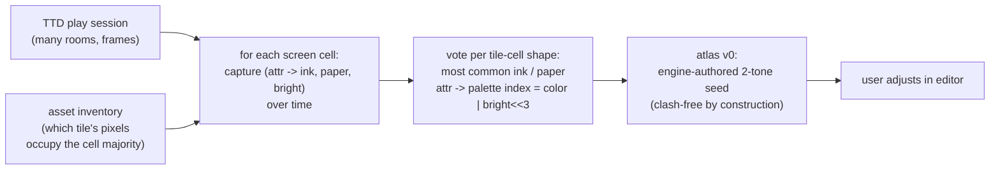

# Automated Colorization: Asset Grabber, Tile Mapper, and the Two-Color Atlas

> Design note, 2026-09-27. Extends [dizzy-adaptation-algorithm.md](dizzy-adaptation-algorithm.md)
> Stage C — replacing freeform pixel painting with a structured, mostly automatic
> pipeline: auto-discover sprites/tiles, auto-map where they are used, then
> colorize via an **atlas of two colors per 8×8 cell** (ink/paper picks instead
> of artwork), with auto-suggested patterns, file import/export, an in-place
> editor, and one-click replication across games built on the same engine.
> Context: [zxpoly-platform.md](zxpoly-platform.md) ·
> [unreal-ng-port-analysis.md](unreal-ng-port-analysis.md).

## 1. The idea in one paragraph

Almost all manual cost in ZX-Poly adaptation is *painting*. But for tile/stamp
engines, ~80% of the visual value comes from a much weaker operation: keep the
original 1-bpp bitmap **exactly as-is** and choose, for every 8×8 cell of every
asset, an **ink color and a paper color** (4 bits each from the standard
16-color palette). The four plane bitmaps are then *computed* from the shape
plus the atlas — no artistic skill, fully scriptable, deterministic, diffable,
and portable across games sharing an engine. Freeform 16-color painting remains
available later for hero sprites and title screens (the two models compose).

## 2. The atlas model: two colors per character cell

### 2.1 Definitions

- A **shape** is an 8×8 cell of original bitmap bytes `s[0..7]` (bit=1 → "ink"
  pixel, bit=0 → "paper" pixel of the original art).
- An **atlas entry** for that cell is a pair `(I, P)` — ink and paper palette
  indices 0–15.
- The **plane transform** computes the cell's bytes for each of the four color
  planes (color bit b: bit0→CPU2, bit1→CPU1, bit2→CPU0, bit3→CPU3):

```
plane_byte[cpu_k][row] = ( bit_k(I) ?  s[row] : 0x00 )
                       | ( bit_k(P) ? ~s[row] : 0x00 )
```

  i.e. original "on" pixels become color I, "off" pixels become color P — in
  every plane, consistently. (In ZX palette terms index = `color | bright<<3`,
  matching `PALETTE_ZXPOLY`.)

- **Masks are untouched**: the mask stays the original shape mask, byte-identical
  in all four planes (the invariance rule of
  [dizzy-adaptation-algorithm.md](dizzy-adaptation-algorithm.md) §3). The
  composite `bg AND mask, OR plane-sprite` then yields, per plane, exactly the
  color bit of I wherever the shape bit was 1 — transparency semantics are
  preserved.
- Consequences:
  - **Tiles/stamps** (drawn opaquely) get full ink+paper two-tone.
  - **Sprites with mask = NOT shape** get ink-only (their interior "off" pixels
    are transparent, not paper). Giving a sprite a paper requires widening its
    mask to the bounding box — an explicit opt-in per asset.
  - The colorized plane data is a **pure function** of `(original data, atlas)`
    → builds are deterministic, diffs are reviewable, and a "mod" is literally
    metadata (base snapshot + atlas + pokes). This is the "metadata-driven
    game mod" artifact in its cleanest form.
  - Lockstep safety is exactly the Stage-A story of the Dizzy document —
    data-only changes, no code paths touched.

### 2.2 What the author actually does

Instead of painting pixels, the author makes color choices — a picker, not a
brush: per cell, per tile, per region ("all cells of this stamp"), or per
shape-pattern ("everything matching this 8×8 hash"). That is the entire manual
payload of the model.

## 3. Layer 1 — auto-discovery: the sprite grabber and tile mapper

Goal: produce the asset inventory (Dizzy doc Stage B) automatically. unreal-ng's
TTD + memory APIs are the enabling infrastructure — this layer is where the port
outclasses the original Java tooling.

Techniques, in the order they should run:

1. **Runtime buffer discovery via TTD.** Load the game, TTD-record a play
   session (turbo-assisted). The draw code's operand addresses are visible in
   the trace: correlate every memory *read* made by the sprite routine's IP
   range → candidate sprite/tile source blocks; every LDIR/loop destination in
   `#4000–#5AFF` → the draw targets. Steady-state (post-unpack) blocks are
   captured for free — packed-data problems disappear because discovery happens
   after the game has unpacked itself.
2. **VRAM frame diffing.** Between TTD bookmarks (rooms, animations), diff the
   screen area: changed rectangles isolate live sprites; stable rectangles are
   background stamps. Repeated identical 8×8 cells across frames → tile
   candidates via shape hash.
3. **Shape heuristics.** For candidate blocks: byte-count multiples of 8,
   column alignment, entropy profile typical of 1-bpp art, mask-block pairing
   (block B ≈ NOT block A ⇒ mask candidate).
4. **Map structure recovery (the "mapper").** For stamp-based engines: the map
   is whatever the engine reads to decide stamps — find it as the memory the
   room-draw loop indexes (again from TTD). The output is structural metadata:
   block ↔ role (tile / sprite frame / mask / font / map), addresses, sizes.
5. **Human confirmation loop.** Discovery proposes; the user confirms roles and
   names in the UI (labels API persists the inventory next to the game).

No step above requires disassembly *skills* — the traces answer "what does the
draw code read", which is the only question needed.

## 4. Layer 2 — attribute mining: the free auto-seed

The game's own attribute traffic already encodes the original authors' color
intentions. Mining it seeds the atlas automatically:



Result before any human touches anything: a full colorization that uses the
game's own palette *without attribute clash* — because the atlas colors belong
to the **tile**, not to the screen cell, so two tiles sharing a screen area no
longer fight over one attribute. FLASH attributes map to ink/paper without
flash (or are skipped). Menu frames can be excluded via TTD bookmarks so they
don't skew votes.

## 5. Layer 3 — the atlas file, patterns, and the editor

**Atlas format** (JSON, human-editable, git-friendly):

```json
{
  "version": 1,
  "engine": "dizzy-codemasters",
  "entries": {
    "a1f3c9d20b8e4477": { "ink": 10, "paper": 0, "tag": "grass-top" },
    "6e7722ab0c91ff38": { "ink": 14, "paper": 1, "tag": "stone" }
  },
  "blocks": {
    "dizzy-frame-03": { "mask": "widen", "ink": 15 }
  }
}
```

Keyed primarily by **64-bit shape hash** of the cell's 8 bytes — that is what
makes atlases portable (§6) — with per-block overrides for context-sensitive
cases (same shape, different meaning).

**Patterns** (auto-colorization rules, themselves importable/exportable):

- *Theme palettes*: remap atlas colors through a theme (autumn, night, Game Boy
  4-tone) — one click, whole game.
- *Tag rules*: cells tagged `sky`, `grass`, `stone` via pattern templates or a
  trained-by-example classifier on shape hashes.
- *Luminance-preserving maps*: gray-shape → colored ramp for gradient assets
  (falls back to freeform painting where 2-tone is insufficient).

**In-place editor** (Qt, or even WebAPI-driven initially): left — the composed
16-color preview (live emulator screenshot via `/state/screen`); right — the
asset grid; a click on a cell opens two 16-color pickers. Batch operations:
apply to region / to block / to all cells matching shape-hash. Export/import
atlas, undo via atlas history. No pixel brush anywhere in v1.

## 6. Layer 4 — engine-family replication

The corpus for this already sits in this repository: `testdata/loaders/`
contains `Dizzy X.sna`, `Dizzy Y.sna`, `Dizzy Y 2.sna`, `dizzyx.z80`, and seven
fan-made `DIZZY_X_*.tap` variants by different authors — same engine family,
different level data and graphics.

The mechanism:

1. Run discovery once per game (automatic) → per-game inventory.
2. Shared shapes (font, Dizzy frames, common objects, UI chrome) hash-match
   across games → the engine atlas transfers **as-is**.
3. New shapes per game default to their attribute-mined seed; the user reviews
   only the genuinely new cells.
4. The **engine profile** (draw-routine signature, block roles, map format
   summary) is captured from the first game and *reused as a discovery hint*
   for siblings — discovery on game #2 starts warm.

Marginal cost per additional same-engine game trends toward "review the diff,
ship".

## 7. Correctness notes

- Data-only transform; all Dizzy-doc Stage-A rules apply unchanged (readback,
  unpackers, masks identical across planes).
- Because plane bytes are recomputed from `s` and `(I,P)`, the transform can
  never corrupt shape information — the original shape is recoverable from any
  single plane given the atlas (and from plane pairs even without it, up to
  color ambiguity).
- Sprites composited from 8×1 strips or drawn with per-char-row addressing
  still decompose into 8×8 cells for atlas purposes — the cell grid is the
  transform unit, not the draw unit.
- Procedurally generated graphics (computed at runtime, not stored) have no
  stable block to atlas — detected during discovery as "no persistent source
  block"; those areas fall back to mode-7/attribute behavior or stay mono.

## 8. Effort and risks

On top of the port's Phase 3 (automation tooling), in rough order:

| Piece | Effort | Note |
|:--|:--|:--|
| TTD discovery harness (read-correlation + frame diff + heuristics) | 1–2 wk | the only research-y piece; scripts first, C++ later if hot |
| Plane transform + atlas apply/export APIs | 3–5 d | pure functions, unit-testable |
| Attribute miner | 2–3 d | TTD + screen-diff reuses discovery plumbing |
| Qt in-place editor (picker-grade) | 1–1.5 wk | far simpler than a pixel editor |
| Engine-profile replication | 3–5 d | mostly bookkeeping + hash matching |

Total ≈ **4–6 weeks** on top of Phase 3; the first three pieces are useful even
without the Qt editor (recipe/CLI workflow, like existing `.recipe/` patterns).

Risks: discovery heuristics vary per engine lineage (mitigated by the human
confirm loop); hash collisions (resolved by block-context overrides); attribute
mining noise from non-gameplay frames (bookmark filtering); temptation to
over-promise "fully automatic" — the honest claim is *auto-seeded, human-confirmed*.

Prior art, for calibration: the zxpoly Sprite Corrector itself (manual
painting), Spec256 editions (hand-made), generic tile editors (YY-CHR class —
manual, no engine awareness), MAME graphics decoders (hand-coded per driver).
TTD-driven dynamic discovery plus shape-hash atlases appears to be new ground.

## 9. Position in the roadmap

This pipeline is the concrete mechanism behind port-analysis §5 claim 2 ("the
framework is the prize"): it converts adaptation from an art project (a week of
evenings per game, [dizzy-adaptation-algorithm.md](dizzy-adaptation-algorithm.md)
§5) into a review workflow (hours per game after the first one), and every
artifact it emits — inventory, atlas, engine profile — is plain metadata that
rides the existing automation stack.
