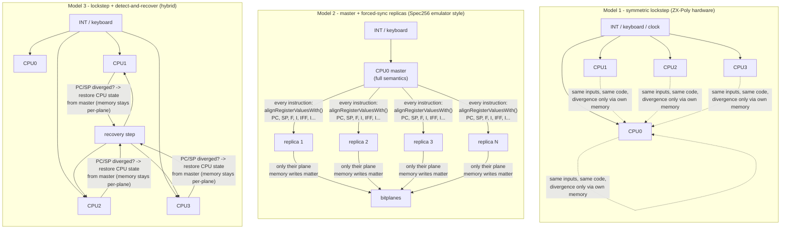

# CPU Synchronization Models: Full Lockstep vs Master/Replica

> Separate design note (2026-09-27), spun off from the Dizzy worked example:
> would it make sense to run **one master CPU that alone reacts to interrupts and
> input**, with the other three CPUs reduced to replicas synchronized from it?
> What does zxpoly already have along these lines, what are the tradeoffs, and
> how hard is it in unreal-ng? Companions:
> [zxpoly-emulator-internals.md](zxpoly-emulator-internals.md) ·
> [dizzy-adaptation-algorithm.md](dizzy-adaptation-algorithm.md) ·
> [unreal-ng-port-analysis.md](unreal-ng-port-analysis.md).

## 1. The three models

**Model 1** is the real platform: four peers, one INT line, one keyboard; every
CPU handles interrupts and polls input itself, identically
([dizzy-adaptation-algorithm.md](dizzy-adaptation-algorithm.md) §2). The master
exists only as a software convention (whose IO writes reach devices).

**Model 2** answers the question with "yes, but replicas still execute": the
master alone owns control flow; after every instruction the replicas' control
state (PC, SP, flags — optionally pointers) is overwritten from the master, so
replica branches on divergent data are irrelevant. Replicas degenerate into
"plane-write engines".

**Model 3** keeps Model 1 as the steady state but converts zxpoly's divergence
*triggers* from a reporting mechanism into a *recovery* mechanism: on PC/SP
divergence, restore the replica's CPU state from the master and continue.

## 2. What zxpoly already has

More than one might expect — both halves of the idea exist:

1. **The Spec256 board mode is Model 2.** The 8 gfx cores are real `Z80`
   instances, but before each of their steps the emulator calls
   `gfxCore.alignRegisterValuesWith(mainCpu, gfxSyncRegsRecord)` — every
   instruction, PC/SP/I/IFF/IM/I/R plus the CFG-selected set (`zxpAlignRegs`,
   default `"1PSsT"`: F-without-carry, PC, SP hi/lo, and `T` = take
   SP/IX/IY/BC/DE/HL and port addressing from the master). Their INT/NMI levels
   mirror the master's saved pulse counters. This is precisely "one CPU reacts,
   the rest are synchronized from it".
2. **Asymmetric hardware primitives** exist for control (not for steady-state
   gameplay): `#3D00` bit 0 parks slaves in WAIT (extreme master-only reaction),
   `#7FFD` D7 gates INT for module 0 alone while unlocked, the mapped-CPU
   IO window lets CPU0 write slave RAM with an NMI pulse, STOP-ADDRESS and
   halt-notification provide rendezvous/signaling. Adapted games use these only
   in the loader, then converge to symmetric lockstep.
3. **Model 2's empirical cost is on record**: Spec256 compatibility in the
   zxpoly emulator is partial — *Knightlore* renders wrongly colored, *Bubbler*
   loses colorization — exactly the failure class of picking the wrong register
   sync set / tolerance knobs. The author also reports that converting Spec256
   editions to true ZX-Poly failed, because the two models tolerate different
   kinds of code damage.

## 3. Why replicas cannot simply be deleted

The tempting shortcut — "run one CPU, just translate its VRAM writes into four
planes" — does not work, and understanding why defines the problem space:

- In the true model the colorization lives in **per-CPU sprite/tile data**. The
  plane content is produced by executing the *same draw code* (LDIR, masked
  AND/OR loops) four times over four different data sets. The game's write
  traffic to slave VRAM is generated by slave execution; there is no master-side
  event to translate.
- A write interceptor on the master sees only plane-0 bytes. Reconstructing
  planes 1–3 requires replaying the draw operations with the other data —
  which is executing the replicas. So the choice is only *how much autonomy*
  replicas have (Model 1 vs 2 vs 3), not whether they run.

## 4. Pros and cons

### Model 2 — master + forced sync (vs Model 1)

Pros:

- **Desync-immune by construction.** Every adaptation headache in
  [dizzy-adaptation-algorithm.md](dizzy-adaptation-algorithm.md) Stage A —
  attribute readback (FlyShark), runtime unpackers branching on plane bytes,
  empty-region optimizations (OFC level 3), pixel-perfect collision — becomes
  harmless: a replica branch that "goes wrong" is overwritten next instruction.
  Colorization could diverge *any* graphics data, including data the code reads.
- Mirrored/flipped sprite problems (Buratino) disappear — replica control flow
  follows the master regardless.
- Debugging story collapses to one CPU; no divergence discipline for asset
  authors.
- Replicas can skip work: since their control state is dictated, an
  implementation may fast-path instructions whose result is already aligned
  (only memory writes with side effects on VRAM matter).

Cons:

- **It is a different machine.** Content authored for true ZX-Poly (the whole
  `.zxp` corpus, the Test ROM's per-CPU detection, MIMD tricks, slave-side
  periphery emulation via halt/interrupt) expects real 4-CPU semantics; under
  forced sync, slave-only code paths (different RUNCODE per plane, slave
  interrupt handlers for sound) cannot run.
- **Register-sync tuning is per-game and fragile** — the entire `zxpAlignRegs`
  alphabet exists because "sync everything" breaks games (carrying flags from
  divergent data is sometimes *desired*, sometimes fatal), and the known
  Knightlore/Bubbler failures live here.
- Subtle timing hazards: replicas must consume identical T-states and INT/RESET
  timing to keep contention and frame alignment, so "cheap replicas" still pay
  full timing bookkeeping.
- Fidelity goal of a preservation-grade port (match the Java reference exactly)
  is compromised for ZXPOLY-mode content.

### Model 3 — lockstep + detect-and-recover

Pros:

- Default behavior = true platform semantics (corpus-compatible, preservation
  goal intact).
- The OFC-class "game reads back graphics" failures become *recoverable*
  instead of fatal: on divergence, restore replica CPU state from master;
  per-plane memory (the whole point) is deliberately **not** restored.
- Recovery is exactly zxpoly's existing trigger set (`DIFF_MODULESTATES`,
  `DIFF_EXE_CODE`) with a different action — the detection code already has to
  exist in any port.

Cons:

- Silent miscolorization risk: recovery hides asset bugs (a plane whose logic
  "wanted" a different branch renders with master's control flow). Needs a
  recoveries-per-frame counter surfaced to the user as a compatibility signal,
  like the zxpoly triggers but non-fatal.
- Correctness of *when* to recover requires PC/SP comparison per step. That
  is cheap (four integers) but on the hot path. In the quad-instance
  design it becomes a check at every slave `IN` plus one at frame end, and
  the exact step is found by a TTD instruction bisect
  ([quad-instance-architecture.md](quad-instance-architecture.md) §6).
- Memory beyond VRAM stays divergent by design; if a game's logic (not
  graphics) depends on divergent RAM, the master's view silently wins —
  acceptable for colorization, wrong for MIMD software.

## 5. Difficulty assessment for unreal-ng

This is where the port plan's existing structure pays off — Model 2/3 are
**increments on top of the Phase 1 scheduler, not new architectures**:

| Piece | unreal-ng plug point | Delta effort |
|:--|:--|:--|
| Replica CPUs | slave instances of the quad-instance route ([quad-instance-architecture.md](quad-instance-architecture.md)); alignment = register copy between instances' Z80 state | already needed by Phase 1 |
| Forced sync (Model 2) | needs the master's control registers after **every instruction**, which the frame-independent quad design deliberately does not have. It requires either a per-instruction register log from the master (heavy) or the instruction-stepped coupled machine (quad-instance §13, deferred). Not part of v1; it returns with Spec256 E2 | **+1–2 weeks**, deferred |
| Detect-and-recover (Model 3) | built into the quad design as divergence policy `recover` (quad-instance §6): on detection, copy the master's CPU state and `t` into the slave, keep its memory, re-join at the next frame boundary, and count recoveries (WebAPI/UI) | **+1–2 days**, in v1 |
| Per-game selection | divergence policy `strict \| recover \| ignore` in `data/configs/zxpoly/unreal.ini` + per-game override (quad-instance §6); `master-replica` comes later with Model 2 | **+1 day** |
| Spec256 later | Model 2 *is* the Spec256 mechanism (`zxpAlignRegs` incl. the `T` pointer-takeover); building it early de-risks Phase 4 | synergy |

The genuinely hard parts are not the plumbing but the **policy** decisions,
inherited from zxpoly's experience rather than rediscovered: which registers to
sync (the `zxpAlignRegs` alphabet, F-without-carry trick), whether replica
memory *writes* outside VRAM should be kept or discarded, and how to surface
recovery events so they read as "compatibility aid active", not silence.

## 6. Recommendation

1. **Implement Model 1 (symmetric lockstep) as the default and the fidelity
   target** — it is the platform, the existing corpus depends on it, and the
   preservation argument requires it.
2. **Add Model 3 (detect-and-recover) as a compatibility mode** — small delta,
   converts the worst adaptation blockers (readback-class failures) from
   "impossible" to "works, flagged". This is the mode that would have saved
   OFC level 3 and Buratino's hero.
3. **Defer Model 2 (master + forced sync)**: it is simultaneously (a) the
   tolerance mode for "colorize anything" adaptations and (b) the substrate
   for the Spec256 board mode later. It needs per-instruction alignment,
   which the quad-instance v1 does not have (see §5). Do not make it the
   default; its per-game tuning burden and semantic drift are documented
   above.

The quad-instance design
([quad-instance-architecture.md](quad-instance-architecture.md)) is Model 1
in effect. The slaves start as exact copies of the master (devices
included), and the master's input events are replicated into them at the
same T. That gives exactly the "same input at the same time" the lockstep
theorem requires. Their device outputs (sound) are simply not sent to the
host, which matches the real platform after `DISABLE_IO_WR`, where only the
master's writes are audible.

This mirrors zxpoly's own architecture decision — two board modes behind one
emulator — but upgrades the weaker mode's divergence triggers from passive
reporting to active recovery, which is the one place unreal-ng's TTD/state
infrastructure makes the original design strictly improvable.
