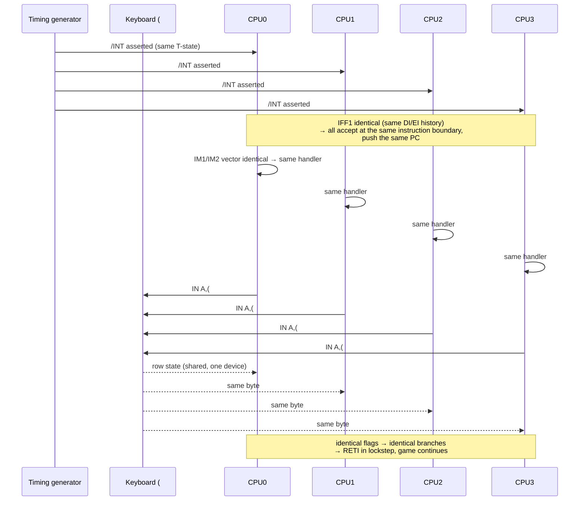
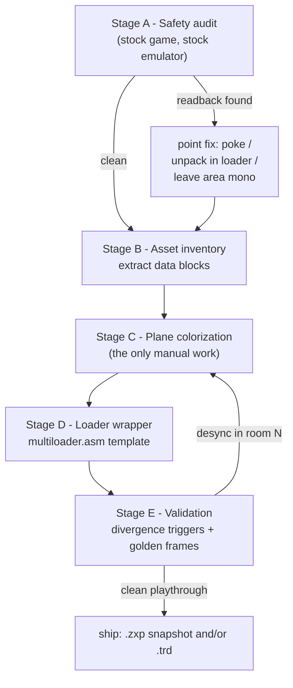

# Adapting a Dizzy-class Game to ZX-Poly: The Algorithm

> A concrete, repeatable procedure for taking a flip-screen tile/stamp engine game
> (the Oliver Twins / Codemasters Dizzy family) from stock ZX Spectrum release to
> a 16-color, clash-free ZX-Poly edition. Written 2026-09-27 as a worked example
> of the general pipeline in [zxpoly-adaptation-pipeline.md](zxpoly-adaptation-pipeline.md);
> porting context in [unreal-ng-port-analysis.md](unreal-ng-port-analysis.md).

## 1. Why the Dizzy engine class is near-ideal

A Dizzy-style engine has exactly the two properties ZX-Poly adaptation needs:

1. **Branch-free masked compositing.** Sprites and room stamps are drawn with
   the canonical sequence, executed identically on all four CPUs:

   ```z80
   LD   A,(HL)        ; read back THIS CPU's VRAM byte
   AND  mask          ; mask is byte-identical on all 4 CPUs
   OR   sprite        ; sprite bits differ per CPU (color planes)
   LD   (HL),A        ; write THIS CPU's VRAM byte
   ```

   The loaded value *diverges* across CPUs once planes are colorized, but no
   conditional branch ever depends on it, so PC never diverges — lockstep
   survives. Each CPU independently composites one bit of the final 4-bit pixel
   color. Overlapping draws and draw order are code, shared by all CPUs, so
   occlusion composites correctly per plane.

2. **Logic that never touches VRAM.** Collision and object interaction run off
   the room map / object lists / coordinate rectangles in ordinary RAM, which
   stays byte-identical across CPUs. Attributes are only ever *written*, and in
   video mode 4 they are ignored by the video controller entirely.

Both properties must be *verified*, not assumed — that is Stage A below. When
they hold, **the game's code is modified zero bytes**; all work is data plus a
loader wrapper.

## 2. Why interrupts and user input cannot desync the machine

The determinism theorem ("same input signal states at the same time") is
satisfied structurally: everything a CPU can observe is either (a) its own
memory — divergent by design, but only ever read as draw-source data; (b) shared
external input — identical for all CPUs by construction; or (c) common control
signals — identical by construction. Interrupts and user input are categories
(b) and (c).

### 2.1 One INT line, one timing generator

There is exactly one video/timing generator and one INT line wired to all four
CPUs' /INT pins. The frame interrupt is asserted into the same T-state window
(32 T on 48K timing, 36 T on 128K and on zxpoly's default Pentagon profile)
for every module simultaneously; in the
reference emulator each module's `intTiStatesCounter` counts down the identical
pulse length.

Acceptance is deterministic per CPU: a Z80 accepts /INT at an instruction
boundary iff IFF1 = 1. IFF1 is part of the synchronized state — `DI`/`EI` are
the same instructions executed at the same moments on all CPUs — so all four
CPUs accept the interrupt at the *same* instruction boundary, push the same PC,
and enter the handler together. (The classic EI-then-one-more-instruction rule
is deterministic in the same way.) From there:

- **IM1**: all four jump to `#0038` in the shared, read-only ROM — trivially
  identical.
- **IM2**: the acknowledge data byte comes from the common bus (`0xFF` on
  Spectrum-class hardware), so every CPU composes the same vector from the same
  `I` register value; the vector table bytes in each CPU's RAM are identical
  (colorization never touches them) → all four jump to the same handler address.
- The handler is shared code. It reads system variables (identical RAM — the
  adaptation never diverges them), the keyboard port (§2.2), maybe the FRAMES
  counter — all identical — executes identically, and returns (`RETI`) at the
  same point on every CPU. Lockstep holds straight through the interrupt.

NMI is likewise a common line (maskable per module via R1 bit 4 for platform
software); games do not use it. The *local* INT/NMI pulses (halt-notification,
IO-window access) are platform-control mechanisms used only in the loader phase,
before the game starts.

There is also a lifecycle nuance: INT distribution is software-gated by the
`#3D00` lock bit. While the platform is *unlocked* (loader phase) slaves are
held (bit 0 WAIT) and receive no common INT. Once the loader executes
`SETPOLYMAIN #93` (lock), the machine becomes a fixed-wired quad Spectrum: one
common frame INT to all four CPUs, one keyboard for all, device writes mastered
by CPU0. Adapted games spend their whole runtime in that locked state. In the
source, the slave INT gate is literally "common INT only while `#3D00` is
locked" (`ZxPolyModule` ~292-302).

### 2.2 Shared input devices answer all four CPUs identically

There is one keyboard, one joystick, one mouse, one tape port. Port **reads**
are routed to the shared devices regardless of which module performs them:

| Port | Device | Behavior across CPUs |
|:--|:--|:--|
| `#xxFE` read | keyboard matrix row, tape in | same row state returned to every CPU in the same frame |
| `#001F` | Kempston joystick | shared answer |
| `#FADF / #FBDF / #FFDF` | Kempston mouse X / Y / buttons | shared answer |
| `#FF` | floating bus (option, off by default) | common answer from module 0 only; Pentagon timing (the default) has none. `#00FF/#10FF/#20FF/#30FF` are R0 status registers, not the floating bus |

This is the physical guarantee that input polling cannot fork the CPUs: the
port value is *external input*, not per-CPU state, so `BIT`/`AND` tests on it
set the same flags on all four CPUs and every input-driven branch is taken
identically everywhere.

In the locked steady state, slave IO **writes** are disabled (REG0 bit 4, set
by the loader's `DISABLE_IO_WR`), so only CPU0's `OUT`s reach the beeper, AY
and the border latch — quadruple device writes are impossible. The one
exception is `#7FFD`: every module's write still lands in its *own* paging
latch, which is correct, because each CPU must page its own memory
identically. Reads remain
enabled on all CPUs, because the shared game code legitimately polls the
keyboard on every CPU.



### 2.3 Contention stays aligned too

The single video controller fetches bytes from **all four** VRAMs on the same
beats (it composes each output pixel from four planes), so the ULA memory
contention pattern experienced by each CPU is generated by the same fetch
schedule (in the reference emulator: per module on the shared frame clock;
the default Pentagon profile has no contention at all). Even an interrupt handler or input loop running in contended memory
(`#4000–#7FFF`) stalls every CPU by the same number of T-states — contention
slows the machine down, it never splits it.

### 2.4 What adaptation must not diverge

The interrupt/input path constrains the colorizer to keep the following bytes
identical across planes — in practice this is automatic, because none of it is
graphics: the IM2 vector table and `I` setup, the interrupt handler code,
system variables (`FRAMES`, keyboard decode tables, debounce state), and the
keyboard polling code itself. Everything the *non-graphics* execution path
touches must remain plane-identical — which is just the general rule of §1
restated for the highest-frequency code path in the machine.


## 3. Plane decomposition rules

The colorizer edits assets as 16-color images; the tooling (or adaptation
scripts) decomposes each pixel into four 1bpp planes, matching the video
controller's index formation `(CPU3<<3)|(CPU0<<2)|(CPU1<<1)|CPU2`:

| Color bit | Plane | Sprite data goes to |
|:--|:--|:--|
| bit 0 | CPU2 | CPU2's copy of the asset |
| bit 1 | CPU1 | CPU1's copy |
| bit 2 | CPU0 | CPU0's copy |
| bit 3 | CPU3 | CPU3's copy |

Invariants that keep compositing correct:

- **Masks are copied verbatim to all four planes.** A mask defines transparency
  (which background pixels survive), not color. If masks diverged, the four
  planes would disagree about *where* the sprite is, and colors would smear.
- A sprite pixel of color 0 (black) inside the bounding box = mask bit 1 (clear),
  plane bit 0 in all four planes.
- A transparent pixel = mask bit 0; plane bits are don't-care (keep 0).
- Where the game derives the mask in code (e.g. `CPL` of the shape byte — pure-OR
  compositing), per-plane derivation stays consistent; no action needed.

## 4. The algorithm



### Stage A — Safety audit (stock game, no colorization)

Goal: prove (or locate violations of) the two engine properties before any art
work is spent.

1. Load the stock game on CPU0-only (plain ZX-128 board mode) and reach normal
   play.
2. Mirror the game to all four CPUs (identical memory) and switch to poly mode 4.
   Expected symptom: fully synchronized machine rendering a black-and-white
   image (all planes equal ⇒ every pixel index is `0000` or `1111`). This is the
   *calibration* state — the game must run indefinitely in it.
3. Arm the emulator divergence triggers:
   - `TRIGGER_DIFF_MODULESTATES` (PC/SP/IM/IFF divergence),
   - `TRIGGER_DIFF_MEM_ADDR` (watch bytes),
   - `TRIGGER_DIFF_EXE_CODE` (opcode stream divergence).
4. Play through all rooms, all interactions. Every hit = a place where the game
   *reads back* graphics state and branches on it. Record address + cause.

Known readback patterns and their treatments:

| Pattern | Example in the wild | Treatment |
|:--|:--|:--|
| Attribute read feeding logic/fill | Flying Shark reads cell 40025 | poke: `LD A,(addr)` → `LD A,const` + `NOP` (3 bytes × 3 sites in FlyShark) |
| Runtime unpacker branching on packed bytes | RLE-style room/sprite decompression | unpack once in the loader (or pre-decompress host-side), distribute raw planes via `COPY2CPU`; alternatively 1–2 pokes to bypass the in-game unpacker |
| Empty-region skip optimization | Official Father Christmas level 3 | not fixable by data — leave that area monochrome |
| Pixel-perfect collision reading bitmap | rare; Dizzy family uses map collision | if present: not adaptable safely |
| Mirrored sprite redrawn from VRAM | Buratino hero | if mirroring is code-over-asset-data it is safe; if it re-reads VRAM it is not |

Exit criteria: a full playthrough with zero trigger hits, or a written list of
readback sites with chosen treatments.

### Stage B — Asset inventory

1. Identify every graphics block the engine draws: room stamps/tiles, Dizzy
   frames (walk + roll sequence), enemies, collectibles, title screen, font
   (optional), status panel.
2. For each block record: address/offset, size, packed or raw, where the code
   reads it (draw-source only, per Stage A).
3. Export blocks via the Sprite Corrector importers (Z80/SNA snapshot, or the
   TRD container file picker), producing one `.sze` session per block.

Typical scale for a Dizzy-class game: 30–50 stamp/tile blocks, 20–40 small
sprite frames, 15–25 item/enemy blocks — order of 15–30 KB of source graphics.

### Stage C — Plane colorization (all manual work lives here)

1. For each block: keep the original bitmap as the shape master; paint the
   16-color pass. The editor writes each color into the four planes per §3 and
   flags edited bits in the mask array.
2. Reuse the original sprite masks verbatim (copy base-to-planes where the
   sprite is untouched).
3. Decide per-element scope: full treatment (every tile, every frame) vs partial
   (hero + items + key tiles; panels and text stay monochrome white). Partial is
   a legitimate v1 — mixed mono/color screens are exactly what video mode 7
   exists for, though mode 4 alone already permits per-block mono areas.
4. Font colorization (optional): edit each CPU's copy of the character set so
   ROM `PRINT` output gains color — the printing routine is shared code, so the
   four planes assemble colored glyphs automatically.

### Stage D — Loader wrapper (new code, not a game patch)

Assemble from the `AsmLoader/zxpoly.i` template (see the multiloader flow in
[zxpoly-adaptation-pipeline.md](zxpoly-adaptation-pipeline.md) §3):

1. Boot on CPU0 with slaves held (bit 0 of `#3D00`).
2. Load plane 0 to a staging buffer; `COPY2CPU` it into CPU3, CPU2, CPU1
   (streams through the IO-mapped window, NMI masked); repeat per block/plane
   — or distribute pre-unpacked room data here if Stage A found a runtime
   unpacker.
3. `SAVEREGS` (preserve the game's expected register state).
4. `DISABLE_IO_WR` for CPU1–3; `SETRESCOMMAND CPU0..CPU3 = JP RUNCODE`.
5. `SETPOLYMAIN #93` — bit 7 lock + video mode 4 + bit 1 local reset + bit 0
   nWAIT = 1 (slaves released). All four CPUs then fetch `JP RUNCODE` from
   their R1–R3 at `#0000` and enter the game in lockstep.
6. `RUNCODE`: restore `#7FFD` paging, `LOADREGS`, `CALL` game entry.

Any Stage A pokes are applied either in the loader before lock or as patched
bytes inside the distributed plane data (code lives in every CPU's memory, so a
patch applied identically to all four planes stays in lockstep).

### Stage E — Validation

1. Re-run the Stage A trigger set over a full playthrough of the *colorized*
   build. A hit now means a colorized byte reaches a branch — locate with
   `findFirstDiffAddrInModuleMemory()`, adjust the asset (or add a poke), repeat.
2. Golden-frame check per room against a reference (for unreal-ng: screenshot
   diff via WebAPI; for the Java emulator: manual comparison).
3. Regression pass on interactions: item pickup/drop, room transitions, Dizzy's
   roll (exercise every drawn frame), death/respawn redraw.

Ship formats: `.zxp` snapshot (4-CPU state, instant test) and/or a TR-DOS image
built by the multiloader for cold-boot authenticity.

## 5. Effort model

| Item | Size | Cost |
|:--|:--|:--|
| Game code changes | ideally 0 bytes; ≤ 3 small pokes per Stage A finding | negligible |
| Loader wrapper | ~150 lines asm, templated | half a day once, then copy |
| Stage A audit | trigger-armed playthrough | 1 evening |
| Partial colorization (hero, items, key tiles) | ~10 blocks | 1–2 evenings |
| Full colorization (all tiles, enemies, title, font) | 15–30 KB of graphics × 4 planes | ~a week of evenings |
| Validation loop | per release | 1 evening |

Calibration point: Alien 8 — a *larger* asset set in an isometric engine — was
fully colorized by the platform author in a single evening.

## 6. What automation changes (unreal-ng angle)

Stages A, B and E are mechanical and are exactly where unreal-ng's automation
stack outperforms the Swing-era workflow once `MM_ZXPOLY` exists:

- **Stage A/E**: arm cross-CPU divergence conditions as WebAPI debugger
  breakpoints (`pc_diff`, `mem_diff`, `opcode_diff` — zxpoly's three triggers);
  scripted walk-throughs via input injection; TTD to rewind any desync to its
  first differing instruction.
- **Stage B**: block discovery via memory-find + label database; export via
  `POST /memory` reads.
- **Stage C** stays human (painting), but plane decomposition, mask cloning and
  ZXP packaging are script APIs.
- The end product becomes **metadata**: base snapshot + plane patch list + poke
  list — the "metadata-driven game mod" artifact of the port analysis §5.

The only irreplaceably manual step is the art. Everything else in this document
is an algorithm.
