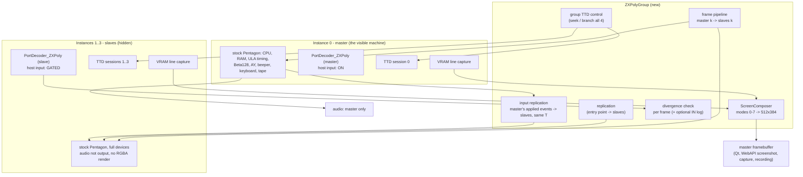
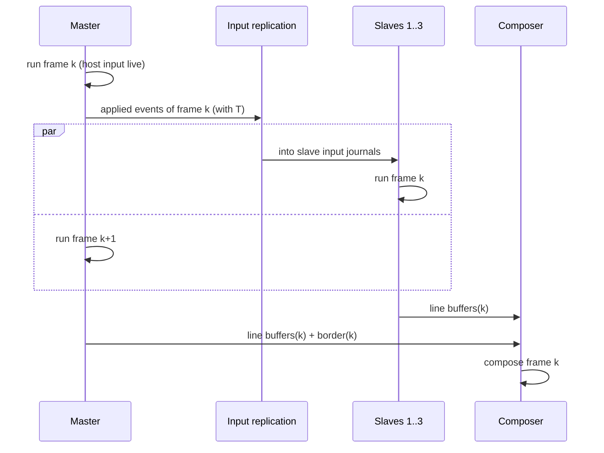

# ZX-Poly as Four Stock Machines: Quad-Instance Architecture

> Design, 2026-09-27. This is the **recommended implementation route** for the
> ZX-Poly port. It replaces Option A/B in
> [unreal-ng-port-analysis.md](unreal-ng-port-analysis.md) §3.
>
> ZX-Poly is built from four ordinary unreal-ng Pentagon instances:
>
> - one **master**, which loads the software, owns all devices and produces
>   the sound;
>   The master is the only instance that receives host input;
> - three **slaves**, full stock machines created as copies of the master.
>   They receive the master's input events at the same T-states;
> - a **screen composer**, which merges the four video memories.
>
> Every zxpoly fact below was checked in the zxpoly source (`Motherboard.java`
> = MB, `ZxPolyModule.java` = ZM, `VideoController.java` = VC). unreal-ng
> paths are relative to the repository root.
>
> Generalized to any machine model (48K, 128K, +3, Pentagon, …) in
> [model-agnostic-sync-layer.md](model-agnostic-sync-layer.md).
>
> Companions: [zxpoly-platform.md](zxpoly-platform.md) ·
> [zxpoly-emulator-internals.md](zxpoly-emulator-internals.md) ·
> [cpu-synchronization-models.md](cpu-synchronization-models.md).

## 1. Summary

The design rests on one fact about the platform:

> **Once `#3D00` is locked, the four ZX-Poly modules no longer interact.**
> The lock stays until a full system reset and freezes every ZX-Poly port.
> After it:
>
> - slave `OUT`s are disabled, except each module's own `#7FFD`;
> - halt notification is off;
> - all four modules receive the same frame INT.
>
> What the four still share is **port input** (keyboard, disk, tape), **the
> picture** and **the sound**.

Every adapted game runs its whole game in this locked state. We build exactly
that state, and never emulate the four modules talking to each other:

1. **Load on the master alone.** Any format works: `.zxp`, SNA/Z80, TAP, TRD
   or an adaptation's own multiloader.
2. **Replicate at the entry point.** Pause, then copy the master's CPU state,
   memory and paging into the three slaves, then put each slave's plane data
   on top (§4).
3. **Run by frames.** Each instance runs whole frames on its own, as a
   complete machine: its `IN` and `OUT` go to its own devices. Host input
   (MessageCenter keyboard/mouse events) is **gated**: only the master
   receives it, and every event the master applies is replicated into the
   slaves at the same T (§5).
4. **Compose the picture** from the four video memories, captured line by
   line (§7).

A slave therefore starts identical to the master, including device state,
executes the same code, sees the same device writes and receives the same
input at the same T. Nothing lets it drift apart except what differs by
design: the plane data. Running the instances in lockstep stops being a
problem. The only thing that can still split the CPUs is the game **reading
back its own graphics** and branching on it. That is a content problem, the
same boundary the real platform has, and the design detects it at the exact
port read or frame where it happens (§6).

## 2. Components

**Reused as-is:**

- the Z80 core and its T-state timing;
- memory paging, ULA timing and INT generation;
- Beta128/TR-DOS, AY, keyboard and tape, in every instance;
- TTD and the debugger, one per instance;
- labels, and the WebAPI/MCP with one ID per instance. Each module *is* an
  instance, so per-module memory and registers are already addressable.

**New:**

- `ZXPolyGroup`: replication (state + input), frame pipeline, group TTD control;
- `PortDecoder_ZXPoly`, one class with a master role and a slave role;
- the line-capture hook and `ScreenComposer`;
- the `.zxp` loader;
- the group plumbing in the model, config and API.

## 3. Instances and configuration

- **Machine model `ZXPOLY`.** Creating it creates one group of four
  instances with one config: Pentagon timing (zxpoly's default profile,
  `AppOptions.java:494-498`), no contention, 71680 T per frame.
  **`intlen=36`**, because zxpoly's Pentagon uses 36 T and unreal-ng's
  `pentagon128k` default is 32.
- **Instance 0 (master)** is the visible machine: it appears in instance
  lists, the Qt window, the video wall, the WebAPI default target and audio
  output.
- **Instances 1–3 (slaves):**
  - flagged as *group members*, hidden from default listings, but
    addressable by ID for the debugger and WebAPI;
  - never `Start()`ed: the group drives them;
  - devices fully present and driven by their own `IN`/`OUT`; only the
    host-facing outputs are off: audio is not sent to the host (the sound
    chips' register state still updates, and sample synthesis can be skipped
    where the device allows it), and there is no RGBA screen rendering (the
    line capture of §7 is the only video work they do). This is where the
    resource saving comes from;
  - host input suppressed through the existing gate (§5.1).
- **Threads.** The group owns one run thread for the master and one worker
  per slave, or runs everything on one thread (§5.3). The instances' own
  `MainLoop` threads stay unused. A slave is driven directly through
  `Emulator::RunFrame`/`ExecuteStep`, which already run INT acceptance, the
  instruction, per-step peripheral work and frame completion
  (`core/src/emulator/emulator.cpp`).
- **Many instances in parallel is proven:** the video wall runs 48–186 at
  once.

## 4. Loading and replication

### 4.1 One rule for every format

Before the entry point, only the master runs, and it runs as a plain Pentagon
with a ZX-Poly port decoder. The slaves hold no state yet. At the entry point:

1. Pause the master at an instruction boundary.
2. For each slave, copy the master's state:
   - the Z80 registers, including IFF/IM, MEMPTR, Q and HALT;
   - frame position `t`, INT-pending state and `frame_counter`;
   - **all** RAM pages. That also makes the power-on `rand()` fill in
     `core/src/emulator/memory/memory.cpp:491` irrelevant, and a 48K SNA
     leaves no random pages behind;
   - the paging state: `#7FFD`, ROM page, TR-DOS ROM active flag;
   - **device state**: AY registers and envelope/noise state, beeper level,
     Beta128/WD1793 state, tape position, keyboard matrix, Kempston state;
   - **media**: each slave mounts the master's disk and tape images as
     **in-memory copies** that are never written back to host files. Only the
     master persists a disk write.

   The copy uses the same field set as a TTD checkpoint: the capture/restore
   helpers in `ttdcheckpoint.h` are pure field copies, and devices take part
   through the `TTDSerializable` peripheral registry. So replication is
   "capture on the master, restore into the slave". The prototype must
   confirm that a checkpoint captured in one instance restores into another,
   since page-store references are per session; otherwise it serializes
   through the existing session/snapshot path.
3. Put the slave's **plane overlay** on top (§4.2). Registers can be
   overridden per module when the format says so.
4. Start the TTD sessions of all four instances at this point (§8), and enter
   the frame pipeline.

### 4.2 Where the plane overlay comes from

| Source | Entry point | Overlay |
|:--|:--|:--|
| `.zxp` | the load itself | the file holds all four modules completely: registers, `#7FFD`, R0–R3 and 8×16K pages each. Load module 0 into the master and modules 1–3 straight into the slaves; nothing is copied. zxpoly forces `#3D00` = 0, resets only the master first, restores registers, ports and pages, then applies `#3D00` from the file, and restores no HALT or INT counters. Follow the same order. Exported files carry `(mode<<2)\|0x80\|1` (locked, slaves running) |
| TRD/TAP adaptation with its own multiloader (Atw2, ZxWord) | the master's `OUT (#3D00)` that sets the lock (`SETPOLYMAIN #93`/`#97`) | the loader's `COPY2CPU` writes (§4.3) |
| a stock game plus adaptation metadata (atlas or patch list, [automated-colorization-pipeline.md](automated-colorization-pipeline.md)) | an address or breakpoint from the metadata, or given by the user | the patch list, applied per module |
| a stock game, calibration only (adaptation Stage A) | the user pauses | none: four identical planes |

### 4.3 The loader path: TRD adaptations without the coupled machine

Before the lock, a multiloader talks to the platform through `#3D00` and the
module registers. On the real platform the slaves sit in WAIT the whole time
(`#3D00` D0 = 0 after reset, MB:310, MB:427), so nothing they do has to be
emulated. The master's decoder handles the loader like this:

- **`#3D00` and module-register writes** update a small platform-state block:
  video mode, mapped CPU, and R0–R3 per module (reset-command bytes,
  IO-write-disable, heap window).
- **IO-window writes** (`#3D00` D5–D6 = n, then `OUT`, which is how
  `COPY2CPU` works) go into **module n's overlay**. The address is resolved
  through module n's own `#7FFD` (page 0 is always RAM0). The overlay is a
  sparse page map.
- **IO-window reads** return overlay bytes. Where nothing was written yet,
  the byte is undefined on real hardware (a parked slave's RAM was never
  initialized); return the master's byte and log a warning.
- **The lock write is the entry point.** If it carries D1 (local reset),
  every module leaves reset through its own R1–R3 command: typically
  `#C3 lo hi` = `JP nn`, the same target on all four. The group sets:
  - the Z80 post-reset register state on all four (IFF = 0, IM 0, I = R = 0;
    the rest as the Z80 core sets on reset), written directly into the
    registers. No `Z80::Reset` call is needed;
  - **PC = that module's JP target**, and the T of the three command fetches
    charged (`JP nn` = 10 T), so all four stand at the first `RUNCODE`
    instruction at the same T;
  - replication as in §4.1: master state, then the overlay on top.

**Why "master state + overlay" is exact for any adaptation that works.** A
real slave's RAM holds only what the loader copied into it; every other byte
is undefined power-on content. A working adaptation therefore never uses a
slave byte the loader did not copy. On every byte the adaptation does use,
our slave matches real hardware. The remaining bytes hold the master's
content instead of noise, and nothing looks at them.

Local INT/NMI pulses from IO-window traffic hit parked CPUs on real hardware,
and `COPY2CPU` masks the NMI flood through R1 b4. With parked slaves they have
no effect, so they are ignored.

### 4.4 Storage: one base plus plane differences, never four copies

The four modules run the same code on the same data. They differ only in
plane graphics, typically a few KB to a few tens of KB per module. A stored
ZX-Poly state is therefore:

- **one base**: an ordinary snapshot or image of the master, in any existing
  format (SNA, Z80, SZX, TRD, TAP);
- **one sparse overlay per slave**: only the byte ranges (or 16K pages) where
  that module differs from the base;
- **the platform state**: video mode and the `#3D00` value.

This is the "metadata mod" of the adaptation docs. Atlas and patch lists are
just a compact way of generating the overlay.

**What differs is only graphics: sprite/tile atlases and the screen bitmap.**
Measured on the whole `.zxp` corpus
([testdata/machines/zxpoly/README.md](../../../testdata/machines/zxpoly/README.md)):

- registers are identical in all four modules;
- attributes never differ;
- each file has 2–22% differing bytes, in a handful of contiguous regions
  per page: the screen bitmap plus 1–4 atlas areas.

The four CPUs run the same instructions on the same addresses. They simply
find different bytes at those addresses.

So the natural package is:

- **Base.** One snapshot holding code, state and the *graphics slots*
  (the atlas regions). Keep module 0's original graphics in the slots rather
  than zeroing them: the base then stays a runnable ordinary Spectrum
  snapshot, which is also plane 0.
- **Atlases.** One per plane, for exactly those slot regions. The group's
  loader writes them into each instance at replication.
- **Screen.** Either replicate at a point where the game redraws the whole
  screen (no screen data needed), or store the per-plane bitmap as one more
  "atlas" region. Attributes are never needed.

A `.zxp` import yields this package automatically: the diff against module 0
*is* the slot map.

- **`.zxp` is import/export only.** zxpoly's format dumps its flat 512K heap,
  four full 128K modules. On import, modules 1–3 are diffed against module 0
  and stored as base + overlay. Export writes a `.zxp` again, only for
  compatibility with the Java emulator.
- **Runtime.** Each instance holds its own RAM because it is a stock machine,
  but that is 4 × 128K, which is negligible.
- **TTD.** Here the duplication would actually cost something: four sessions
  store identical pages four times, because the page store shares pages
  only within one session (refcounted, `ttdcodecpagestore.h`). The fix is a
  page store shared by the group that interns pages by content, so an
  unchanged page is stored once for all four. That is a later optimization
  (PLAN #40 Phase 1 memory regions are the natural place); v1 accepts 4×.

## 5. Runtime IO: full devices everywhere, input from the master only

### 5.1 Input gating and replication

Slaves are complete machines. `IN` and `OUT` go to their own devices, which
started as copies of the master's and receive the same writes from the same
code, so they answer the same values. The only IO that comes from outside the
machine is **host input** (keyboard, mouse, joystick, tape control), and that
is what gets gated:

- **Gate.** Host input arrives through MessageCenter (`MC_KEY_PRESSED` /
  `MC_KEY_RELEASED`). An event with an empty `targetEmulatorId` is a broadcast
  that every instance would apply, each at whatever T its thread happens to
  be at. `Keyboard::OnKeyPressed` already drops events aimed at another
  instance and events arriving while `IsHostInputSuppressed()` is true
  (`core/src/emulator/io/keyboard/keyboard.cpp`, the switch TTD replay uses).
  Slaves run with host input suppressed permanently. The same gate is needed
  on the mouse and joystick paths.
- **Replication.** The master applies live input as usual. Each applied
  event already goes into its TTD input journal with its exact
  `TTDTimePoint` (`RecordInputEvent`, `SubmitLiveInput`). The group copies
  every applied event of frame k into the slaves' input journals, and the
  slaves apply them through the existing playback path (`ServiceInput`,
  which applies each due event with `ApplyInputEvent`) at exactly the same T. That is exactly how TTD
  replay already feeds input deterministically.
- **Tape control** (play, stop, rewind; a TTD external event) is replicated
  the same way: the same command at the same T on every instance.

### 5.2 What else must stay deterministic

With full devices on every instance, every device must produce the same
result from the same state and writes. Checked in the code:

| Source | Status | Handling |
|:--|:--|:--|
| Power-on RAM fill `rand()` (`memory.cpp:491`) | irrelevant | all RAM is copied at replication |
| FDC flaky-sector emulator `rand()` (`io/fdc/flakysectoremulator.h`) | **non-deterministic** | off for group members, or seeded identically and the seed state replicated |
| SMUC RTC reads the host clock (`io/rtc/smucnvram.cpp:226`) | non-deterministic | not on Pentagon; for any model with it, use the existing fixed-time mode |
| Disk writes | would be written 4× to the same file | slaves use in-memory media copies (§4.1) |
| INT, IM2 bus byte, contention | deterministic | identical timing config and `t`; Pentagon has no contention |

A prototype test (§10, T5) is the guard: any source missed here shows up as
a divergence without any plane change.

### 5.3 Optional check: the `IN` log

As a debugging aid, the master's decoder can log every `IN` as
`(tInFrame, port, value)`, and each slave compares its own `IN` against it.
It no longer feeds the slaves; it only checks them. It pinpoints the first
read where a slave's control flow or device state left the master's (§6).
It is off by default and turned on with the debugger's divergence triggers.
Cost: about 8 bytes per `IN`, a few hundred to a few thousand per frame.

### 5.4 Why INT and timing need no replication

- Each instance's ULA generates the frame INT at the same T, because the
  timing config is identical, as is `t` after replication.
- IM2 reads `#FF` from the idle bus, a constant.
- Pentagon has no contention.

### 5.5 The frame pipeline

Slaves must not run ahead of the master: they need its input events for the
frame. So a slave runs frame k only after the master has finished it.

- **Pipelined (default):** the slaves run frame k while the master runs frame
  k+1. The composed picture lags by one frame (20 ms). Throughput equals one
  stock instance, because the three slaves run in parallel with each other
  and with the master.
- **Same-frame:** the master runs frame k, then the slaves run frame k in
  parallel, then the picture is composed. No added latency; throughput is
  roughly half the pipelined mode. Use it when single-stepping in the
  debugger.
- **Sequential single thread:** master, slave 1, 2, 3, compose. Simplest,
  and the reference mode for tests.

All three produce byte-identical results. A test checks this (§10, T8).

Audio comes from the master alone and is not delayed: the master's sound
path is the stock one.

## 6. Divergence: detection and what to do about it

**What can still split the CPUs:** only the game **reading back its plane
data** and branching on it: reading back graphics, skipping "empty" areas,
pixel collision, attribute reads (the Flying Shark case). This is the
content boundary of the real platform, not an emulator artifact
([dizzy-adaptation-algorithm.md](dizzy-adaptation-algorithm.md) Stage A).

**Detection, from finest to coarsest:**

1. **At each slave `IN`** (only while the optional `IN` log of §5.3 is on):
   the port, `tInFrame` and value must equal the master's entry. A different
   port or T means control flow split before this read; a different value
   means device state split.
2. **At frame end:**
   - with the `IN` log on, every entry of the frame must have been consumed;
   - the slave's registers, `t`, IFF, IM and HALT must equal the master's at
     the frame boundary. `machinestatehash` cannot be used whole here, because
     its RAM digest differs across planes by design. Compare its CPU and
     paging part only;
   - optionally (on when the debugger triggers are armed), a rolling hash of
     M1 addresses per frame. This catches a split that rejoins within the
     frame without touching a port.
3. **Finding the exact instruction:** seek the master and the diverged slave
   to the frame start (§8), then step both forward one instruction at a time
   (`StepForwardInstruction`), comparing PC. The first differing PC is the
   instruction that read the plane data. This is zxpoly's
   `TRIGGER_DIFF_MODULESTATES` / `DIFF_EXE_CODE`, done off-line through TTD
   instead of on every step.

**What to do** (per-game setting, from
[cpu-synchronization-models.md](cpu-synchronization-models.md)):

| Policy | Action on divergence | Use |
|:--|:--|:--|
| `strict` (default) | pause the group and report module, frame, T, PC and the log entry | adaptation work, fidelity |
| `recover` (Model 3) | copy the master's CPU state and `t` into the slave, keep the slave's memory, count it | "works, flagged" play of imperfect adaptations |
| `ignore` | log only | debugging |

With `recover`, the slave re-joins at the next frame boundary. Its device
state stays its own; if the divergence reached device state (visible as a
different `IN` value), `recover` also copies the device state.

## 7. The shared screen: capture per line, compose per frame

zxpoly renders **one 256-pixel line at a time**, from the current RAM, when
the frame clock passes the line's start (MainForm:1190-1235). A video-mode
change redraws the whole screen at once.

- **Capture.** A hook in each instance's screen path. When the instance's
  own raster reaches line y of the paper area, it copies that line's 32
  bitmap bytes and 32 attribute bytes, from the instance's own current
  screen page (`#7FFD` D3), into a per-instance buffer of 192 × 64 bytes
  (12 KB). Every instance does this at the same T, so the result does not
  depend on threads or pipelining.

  The hook is a null-checked pointer, so stock models pay one predictable
  branch. `core-benchmarks` confirms that (§10, T10).
- **Border.** The master's stock renderer already records the border per T,
  and the composer uses that timeline.
- **Compose (`ScreenComposer`).** A pure function of: 4 line buffers, the
  master's border, the video mode from the platform state, and the master's
  FLASH phase. Its output is the 512×384 paper area plus border, written into
  the master's framebuffer (`FramebufferDescriptor` supports variable sizes,
  as Profi and ATM already use). The Qt view, WebAPI screenshots, capture
  and recording keep working unchanged. Modes, verified in VC:

  | Mode | Rule |
  |:--|:--|
  | 0–3 | the classic attributed picture of module n, doubled |
  | 4 | per pixel `idx = CPU3·8 \| CPU0·4 \| CPU1·2 \| CPU2·1` into `PALETTE_ZXPOLY` (standard ZX order, `#BE`/`#FF`) |
  | 5 | 2×2 per source pixel: CPU0 top-left, CPU1 top-right, CPU2 bottom-left, CPU3 bottom-right, each with its own attribute and FLASH |
  | 6 | CPU0's attribute, FLASH honoured; `ink == paper` fills the cell with that colour, else mode-4 pixels |
  | 7 | CPU0's FLASH bit is a selector: 0 → 2×2 pixels in CPU0's ink and paper; 1 → mode-6 logic |

- **Mode changes.** The mode is fixed after the lock (the ports are frozen),
  so after the entry point it is constant. Before it, only the master's
  classic picture is visible.
- **Finer beam effects.** Capturing per 8-pixel fetch instead of per line is
  the same hook at a finer grain. It is optional, because the reference
  itself works per line.
- **Golden frames need no emulator:** the composer takes captured buffers,
  so tests can feed it stored buffers directly.

## 8. TTD: four ordinary sessions, group control

v1 uses **four ordinary, separate TTD sessions**, one per instance, and no
new file format and no extra store. That works because each slave's input
is already in its own input journal (§5.1): TTD replays a slave exactly as it
replays any machine.

1. **Aligned sessions.** All four sessions start at the replication point,
   with the same settings: a checkpoint every frame, a key frame every
   `kKeyFrameInterval` = 50 frames
   (`core/src/debugger/ttd/timetravelmanager.h:282`). TTD frame indices count
   from session start (`TTDTimePoint{frame, tInFrame}`), so frame N means the
   same machine frame in all four. The group starts and stops recording on
   all four together. `frame_counter` is copied at replication, so the
   emulator-level frame numbers match too.
2. **Slave input journal.** The events the group replicates (§5.1) are
   recorded in the slave's own journal, like live input on any machine.
   TTD's own replay within a seek (restore a checkpoint, then run forward)
   applies them at the right T with no TTD changes.
3. **Group seek.** A seek from the UI or WebAPI on the group:
   - pause all four;
   - `SeekTo(target)` on each, to the same `TTDTimePoint`;
   - compose the frame at the target.

   Seeking one instance on its own is allowed as a read-only inspection
   view (the debugger on a slave). Resuming always resumes the group from
   one common position.
4. **Branching.** After a group seek to N and new live input on the master,
   the group calls `ResumeRecordingFrom` on all four. Each session truncates
   its own future, including the slaves' journals. New master input is
   replicated from N on.
5. **External events.**
   - **Tape control** is replicated to every instance (§5.1), and each TTD
     records its own marker.
   - **Disk writes** happen in all four, each into its own media copy; only
     the master's copy persists.
   - A **debugger edit** on the master is a group decision: apply it to all
     four (the default for code and data) or to the master only (an
     intentional plane edit). The group records the marker on every instance
     it touched.
   - A **hardware reset** of the master is a ZX-Poly system reset: the group
     ends, and replication starts again at the next entry point.
6. **Cost.** TTD memory is about 4× one instance, because identical pages
   are stored once per session. v1 accepts that; a content-interned page store
   shared by the group removes it (§4.4).
7. **Later (PLAN #40).** A single group file that bundles the four sessions
   and the platform state. That is only a container; nothing inside
   changes.

## 9. Port decoder details (`PortDecoder_ZXPoly`)

It derives from `PortDecoder_Pentagon128`. It is the same class on every
instance and knows its module index. Everything other than the ZX-Poly ports
goes to the stock base class, on the slaves too. It overrides
`DecodePortIn/Out` and decides **before** the base class:

- **`#3D00` must not reach the base class.** Its A0 is 0, so the stock
  decoder treats it as the ULA `#FE` port (border and beeper on `OUT`,
  keyboard on `IN`).
- **`#x0FF` module registers** share their low byte with Beta128's `#FF`
  system port while TR-DOS is active. zxpoly ignores register writes during
  TR-DOS activity (ZM:219-221), and so does this decoder.
- **Why an override:** the self-decoding `PortDevice::tryClaimIn/Out` hook
  only sees ports nobody else claimed, so it cannot pre-empt `#FE`.
- **Module-local reads:** the `#3D00` identity read and the R0 status
  registers `#00FF/#10FF/#20FF/#30FF` answer each instance's own module
  index. That is the only port where the four legitimately read different
  values.
- **After the lock:** writes to `#3D00` and the registers are ignored, as
  the frozen hardware does. Reads still work.
- **Floating bus:** off. Pentagon has none, and zxpoly's version is
  option-gated and computes the wrong address (MB:743-760).

## 10. Test plan (written first, TDD)

Tests follow `core/tests/README.md` and are named after the file they test
(`<sourcefile>_test.cpp`). Pure units stay under 50 ms. Boot-bound
integration tests carry a comment saying why they are slower, and use
`EnableTurboMode()` except where they assert on pixels. Fixtures go to
`testdata/machines/zxpoly/`: zxpoly and unreal-ng are both GPL-3, so only
attribution is needed.

| # | Test | Proves | Needs |
|:--|:--|:--|:--|
| T1 | input replication unit: master events with `TTDTimePoint` into slave journals; host input gated on slaves (keyboard, mouse, joystick) | §5.1 gate + replication | 2 instances |
| T2 | `screencomposer_test`: modes 0–7 from hand-made line buffers; mode 4 bit order; mode 6 flood; mode 7 selector; mode 5 per-module attributes | composer rules | pure |
| T3 | composer golden frames: stored buffers from Alien8/FlyShark `.zxp` against Java-emulator PNGs | parity with the reference | fixtures |
| T4 | replication: SNA 48K and 128K on the master, then replicate; CPU, paging and device state equal in all four, RAM equal page for page | §4.1, including the `rand()` pages and the device copy | 4 instances |
| T5 | lockstep: after T4, run 500 frames with host keypresses sent as **broadcast** MessageCenter events (the gate must stop them on slaves) and replicated from the master; with the `IN` log on, every slave `IN` matches, and registers, `t` and a device-state hash are equal at every barrier; a variant with TR-DOS disk loading and one with tape loading during the run | §5 gating, replication, device determinism | 4 instances |
| T6 | plane divergence: change sprite bytes in slaves 1–3; lockstep holds as in T5, the composed mode-4 frame has colour, and the master's picture is unchanged | the ZX-Poly premise on our engine | 4 instances |
| T7 | detection: a test program that reads a plane byte and branches on it; divergence reported at the exact `IN`, frame end or M1 hash, and the per-instruction bisect finds the PC; `recover` re-joins | §6 | 4 instances |
| T8 | scheduling: pipelined, same-frame and sequential give identical log hashes, registers and composed frames over 500 frames | §5.3 | 4 instances, threads |
| T9 | TTD: record 200 frames with input; group seek to frame 73 at `tInFrame` ≠ 0 (between key frames); slave CPU and device state equal what was seen live; branch with different input, slave journals truncated, lockstep continues | §8 | 4 instances + TTD |
| T10 | isolation: the whole existing `core-tests` suite unchanged; group members hidden from default listings; line-capture hook disabled on stock models, with `core-benchmarks` screen numbers before and after | "nothing else breaks" | suite + benchmarks |
| T11 | `.zxp` loader: all 6 `.zxp` titles in the corpus load, run 1000 frames without divergence, and match T3 golden frames at checkpoints | corpus | fixtures |
| T12 | loader path: `atw2.trd` (mode 4) and `zxword.trd` (mode 5) boot through their multiloaders; the overlay collects the `COPY2CPU` writes and equals the files in `loaders/*/planes/`; the lock write triggers replication; the program runs without divergence | §4.3 | fixture |
| T13 | package derivation: every `.zxp` imported as base + per-module overlays (§4.4) reproduces the matching `.sze` planes byte for byte; attributes never land in an overlay | §4.4 | fixtures |

**Order of work.** T4–T6 come first. They need no new model and no changes
to shared code, only four instances in a test with input replicated by the
test itself, so they are the prototype and the go/no-go gate. After that:
T1–T2 before input replication and the composer, then T7–T9, then T11–T13 as
the acceptance suite. T10 runs at every step. The
project's zero-warnings rule and the full `core-tests` run apply before any
commit.

## 11. Effort (provisional until the T4–T6 prototype has run)

| Piece | Effort |
|:--|:--|
| Prototype T4–T6: four instances in a test, state replication, input replication, determinism check | 2–3 d |
| Group plumbing: `ZXPOLY` model, config (Pentagon, `intlen=36`), hidden members, WebAPI/MCP group view | 3–4 d |
| `ZXPolyGroup`: state replication (incl. devices, media copies), input gating + replication, frame pipeline (3 modes), barrier, divergence policies | 4–5 d |
| `PortDecoder_ZXPoly`: `#3D00` and module registers, module-local reads, pre-lock platform state, `COPY2CPU` overlay, optional `IN` log | 3–4 d |
| Device determinism for group members: FDC flaky-sector off/seeded, audio-output off, in-memory media | 1–2 d |
| Line capture + `ScreenComposer` | 4–5 d |
| `.zxp` loader | 2 d |
| TTD group: aligned sessions, slave journals, group seek, branching, edit policy | 3–4 d |
| Acceptance T11–T13, golden-frame fixtures | 5–7 d |

That makes about **6–7 weeks**, prototype included.

## 12. Decisions and closed questions

| Question | Decision |
|:--|:--|
| One emulator with 4 CPUs, or 4 instances? | 4 stock instances. Four copies of the same core, and every tool works per module |
| Do CPUs need to run in lockstep, instruction by instruction? | No. Instances run whole frames independently; the replicated input is the only thing they receive from outside |
| CPU reset / `Z80::Reset`? | Never called. Snapshots set state directly; the loader's local reset is emulated by writing registers (§4.3) |
| Same-T input delivery to 4 instances? | Host input is gated off on slaves (existing `IsHostInputSuppressed` / target-ID filter); the master's applied events go into the slave journals with their `TTDTimePoint` and are applied by the existing playback path |
| Slave `IN` / `OUT`? | Both go to the slave's own full devices, which are copies of the master's |
| Device determinism? | Device state copied at replication; FDC flaky-sector `rand()` off or seeded; RTC not present on Pentagon; slaves use in-memory media copies. Guarded by T5 |
| Sound? | Heard from the master only; slaves' sound chips keep their register state, and their output is not sent to the host |
| Power-on RAM noise, 48K SNA? | All RAM is copied at replication |
| How are TRD adaptations loaded? | On the master; `COPY2CPU` goes into per-module overlays; the lock write replicates (§4.3) |
| Timing profile? | Pentagon, `intlen=36`. 128K timing is not planned: contention would be identical per instance, but the corpus does not need it |
| TTD? | Four ordinary aligned sessions (slave input lives in their own journals) + group seek/branch; single group file later (PLAN #40) |
| Divergence? | Detected at frame end, or at the first differing `IN` with the optional `IN` log; located by TTD instruction bisect; policy `strict` / `recover` / `ignore` |
| Screen? | Per-line capture in every instance, pure composer into the master's framebuffer |
| Overlapping heap windows (REG0 rewritten to share RAM)? | Unsupported in v1. Neither the corpus nor the `.zxp` exporter uses them (windows are always `i << 1`); `.zxp` files with other windows are rejected with a message |
| Test ROM and MIMD programs (slaves running their own code while unlocked)? | Out of scope. They need the coupled machine of §13, which is kept as a deferred appendix |
| Prefix-byte stepping difference against zxpoly? | Irrelevant here: without an instruction-level interleave there is nothing to differ |

## 13. Deferred: the coupled machine (Test ROM, MIMD)

These are only needed if we ever want the Test ROM's per-CPU tests or
software that runs different code on each CPU while unlocked. They require
the modules to interact within a frame, so instances would have to step one
instruction per round in zxpoly's order: `frameT & 3` → `0,3,2,1` /
`1,2,0,3` / `3,0,1,2` / `2,3,1,0` (MB:444-487). The frame clock would come
from the master alone (MB:527), and the gating would have to be emulated
exactly:

- nWAIT and stop address;
- INT gating: the master takes INT only while `#7FFD` D7 = 0 when unlocked;
  slaves take the common INT only when locked (ZM:292-302);
- live IO-window traffic with INT/NMI pulses;
- halt notification (the halting module's R1: b7 NMI, b6 INT, b3–0 target
  mask; only while unlocked).

The group's instances and port decoder are reusable for this, and only the
scheduler differs. It is not part of v1.

## 14. Reference quirks (decide, do not copy blindly)

Found while checking the zxpoly source:

- A stop-address hit is re-evaluated only on M1, and WAIT is checked before
  RESET, so a stopped module looks permanently stuck. This concerns §13
  only.
- The floating bus `#FF` reads CPU addresses using screen offsets. We keep
  the floating bus off.
- Macro defects in `zxpoly.i`:
  - `SETWAIT13` toggles D1 (reset) instead of D0 (nWAIT);
  - `SETSTOPADDR` references an undefined `addr`;
  - `COPY2CPU` cleanup reads an uninitialized `(IX+0)` and never restores
    the target's R1.

  These matter only if we assemble new loaders from `zxpoly.i`.
- While module k is mapped, *slave* port reads also go through the window
  (ZM:178-181). With slaves parked before the lock this never happens.

Rule: reproduce behaviour that shipped content depends on (none of the above,
as far as the corpus shows). Anything else is implemented as the documented
intent, and each deviation is listed in the T3/T11 test notes.
