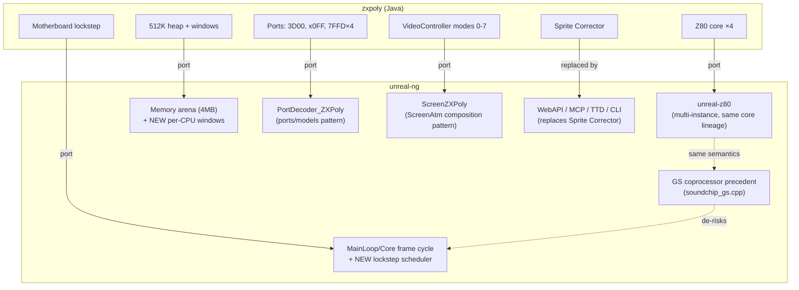
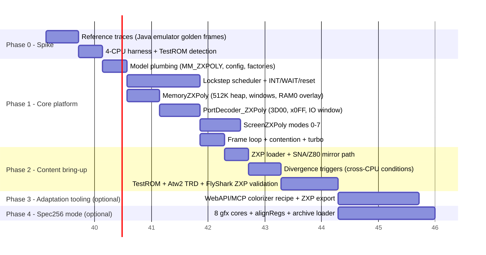

# Bringing ZX-Poly to unreal-ng: Feasibility, Effort, Value

> Decision-support analysis, 2026-09-27. Companions:
> [zxpoly-platform.md](zxpoly-platform.md) ·
> [zxpoly-emulator-internals.md](zxpoly-emulator-internals.md) ·
> [zxpoly-adaptation-pipeline.md](zxpoly-adaptation-pipeline.md).
> unreal-ng references are repository-relative.

## 1. TL;DR

ZX-Poly ports unusually well into unreal-ng's architecture. The two hardest
prerequisites — **a multi-instance, instruction-stepped Z80 core** and **a
working precedent for a second main-bus CPU** — already exist
(`core/src/3rdparty/unreal-z80/` and the General Sound coprocessor in
`core/src/emulator/sound/chips/gs/soundchip_gs.cpp`). The one genuinely new
subsystem is a **multi-CPU lockstep scheduler in the frame loop**; everything
else (model plumbing, port decoder, memory windows, poly renderer, ZXP loader)
follows patterns the codebase already has (ATM Turbo, Profi, Scorpion).

Estimates: **~1 week spike**, **~7–9 weeks** to a credible core release
(Test ROM + adapted games bootable), **+2–3 weeks** each for the two optional
expansions (adaptation tooling on top of WebAPI/MCP; Spec256 mode).

The value is asymmetric: a **content library nobody else can run natively**
(7–8 adapted games exist today), a **differentiating "metadata-driven game
mods" capability** that unreal-ng's automation stack is uniquely positioned to
deliver better than the original Java tooling, and **core dividends** (rigorous
multi-CPU infrastructure that hardens the GS precedent).

## 2. Component mapping

| ZX-Poly concept (Java) | unreal-ng counterpart | Status |
|:--|:--|:--|
| `Z80` core ×4, per-`ctx` bus callbacks (`Z80CPUBus`) | `unreal-z80` lib: `Z80CpuCreate`, `Z80CpuSetMemoryBus/SetPortBus/...`, callback bus with `userData` per instance | **Exists** — designed for exactly this |
| `Motherboard.step` instruction-rotated lockstep | `Core::CPUFrameCycle()` → `Z80::Z80FrameCycle()` (single CPU) | **Missing** — the core new work |
| GS coprocessor precedent (2nd CPU, private banks, frame stepping, TTD blob) | `SoundChip_GeneralSound` (`soundchip_gs.cpp`) | **Exists** as pattern, but lazy-sync; lockstep needs instruction interleaving |
| 512K shared heap + sliding per-CPU windows (`REG0 & 7` × 64K) | `Memory` arena scales to 4 MB / 256 pages, but has a single `_bank_*[4]` window set | **Extend**: per-CPU bank tables (GS pattern) or a `MemoryZXPoly` override of `UpdateModelBanks()` |
| Per-module `#7FFD`, `#3D00`, module regs `#x0FF–#x3FF` | `PortDecoder::GetPortDecoderForModel` factory + `core/src/emulator/ports/models/` | **Exists as pattern** → new `PortDecoder_ZXPoly` |
| `VideoController` modes 0–7, 4-bit plane combining | `VideoController::GetScreenForMode` + `ScreenZX`; hi-res precedent `ScreenAtm` sampling arbitrary `RAMPageAddress()` pages | **Exists as pattern** → new `ScreenZXPoly` (composition like ScreenAtm) |
| TimingProfile (69888/70908/71680 T, contention, even-M1) | `Config::ApplyModelTimingDefaults`, `UlaContention`, per-model intstart/intlen | **Exists** — reuse 128K/Pentagon profiles; contention must apply per-CPU at access T |
| `.zxp` 4-CPU snapshot | `core/src/loaders/snapshot/` (sna/z80 classes, extension dispatch in `Emulator::LoadSnapshot`) | **Exists as pattern** → `LoaderZXP`; GS TTD serializer shows 4× `Z80CpuRegisters` persistence |
| Divergence triggers (`TRIGGER_DIFF_*`) | WebAPI debugger + TTD + port trace + breakpoints | **Superset exists** — needs a "compare across CPUs" condition type |
| Sprite Corrector (Java Swing) | **No GUI editor needed for v1**: WebAPI/MCP memory R/W + screen render + labels cover plane editing scripted | **Superset exists** (this is the unique advantage — see §5) |

## 3. The one hard problem: the lockstep scheduler

Everything single-CPU in the main path is the integration risk:
`EmulatorState` timing, `_z80` pointers in debugger/disassembler/labels, TTD
capture, `Z80::t` bookkeeping. Two routes:

| | Option A — CPU0 stays legacy `Z80` | Option B — all four on `unreal-z80` |
|:--|:--|:--|
| Shape | Legacy `Z80` for module 0; 3 satellites on `unreal-z80` (mirrors the GS wiring) | 4× `unreal-z80`, one promoted as master |
| Pros | Debugger/TTD/automation keep working for the master unmodified; smallest blast radius; direct GS precedent | Uniform code path; per-CPU symmetrical; `Z80CpuAttachRegisterFile` + bulk save/restore ready for 4× snapshotting |
| Cons | Two stepping paths to keep in T-lockstep; satellites get only GS-style surfaces | Everything (debugger, TTD, breakpoints) needs a CPU-selector abstraction — touches the widest surface |
| Semantics risk | None — unreal-z80 is the extracted lineage of the same core, so flag/MEMPTR/timing behavior matches | None |
| **Recommendation** | **Start here** | Migrate later if multi-CPU debugging becomes a feature |

Scheduler design (either route): replace `Core::CPUFrameCycle`'s inner loop for
`MM_ZXPOLY` with a T-state-ordered interleave — maintain four cumulative T
counters, always step the CPU with the smallest, apply the zxpoly rotation
(`tiStates & 3`) as tiebreaker to fairly spread bus-order effects. The shared
frame INT asserts for all four CPUs simultaneously (respecting per-module `#7FFD`
D7 and R0 INT masking); slaves parked via WAIT burn exactly 1 T per step (unreal-z80
and zxpoly's core share this WAIT semantic — verify against `z80cpu.h` semantics
during the spike).

Contention must be applied by the *executing* CPU's bus callback at the access
T-state (the zxpoly notes explicitly record the failure mode of doing otherwise:
slaves delayed, master double-contended).

## 4. Phased plan and effort

**Phase 0 — Spike, ~1 week (decision gate).**
Run the Java emulator, capture golden screens/traces for the Test ROM and 2–3
adapted games. Stand up 4× `unreal-z80` in a test harness with the 512K heap and
window mapping; get the Test ROM to its "ZX-POLY allowed" detection. Exit
criteria: Test ROM memory tests pass on the harness; timing data for the
scheduler; confirmed WAIT/INT semantics match.

**Phase 1 — Core platform, ~4–5 weeks.**
- Model plumbing (3 d): `MEM_MODEL` entry, `Config::mem_model` row,
  `data/configs/zxpoly/unreal.ini`, both factory switches
  (`GetPortDecoderForModel`, `IsModelSupported`).
- Scheduler (9 d): Option-A interleaving, shared INT with per-module gating,
  slave WAIT parking, local-reset broadcast + R1–R3 command injection, halt
  notification.
- Memory (4 d): per-CPU windows over the arena, per-module `#7FFD` with lock,
  RAM0 overlay rules, TR-DOS ROM auto-switch on `#3Dxx` M1.
- Ports (5 d): `PortDecoder_ZXPoly` — `#3D00` (all bits incl. lock), module
  regs with writer-priority rule, IO-mapped window R/W with INT/NMI pulses,
  `#FF` attribute read, floating bus.
- Video (5 d): `ScreenZXPoly` modes 0–7, mode 5 quadrant tiling with per-CPU
  attributes, mode 6/7 masks, palette; border from CPU0's `#FE`.
- Integration (3 d): turbo, per-CPU contention, frame-boundary hooks.

**Phase 2 — Content bring-up, ~2–3 weeks.**
`LoaderZXP` (+ extension dispatch), SNA/Z80 import mirrored to 4 CPUs,
cross-CPU divergence conditions in the WebAPI debugger
(`pc_diff`, `mem_diff`, `opcode_diff` — zxpoly's three triggers), then the
bug-matching grind: Test ROM demos (modes 4+5), After The War 2 TR-DOS boot
(exercises the whole multiloader path: COPY2CPU, reset command, `SETPOLYMAIN
#93`), Flying Shark ZXP (mode 7 + attribute pokes). Golden-frame diffs against
the Java emulator are the acceptance test.

**Phase 3 — Adaptation tooling, ~2 weeks (the actual payoff).**
No GUI editor: a `.recipe/` workflow + small WebAPI additions that turn
unreal-ng into a colorization factory — load original snapshot → mirror to
planes → scripted plane edits (memory R/W + screen verification) → apply pokes
→ export ZXP. A "mod" becomes metadata: base snapshot + plane patches + poke
list, applied on demand. This is precisely the "metadata-driven game mods"
capability, and unreal-ng's automation is already a superset of what the Java
Sprite Corrector offers (plus TTD for desync archaeology).

**Phase 4 — Spec256 mode, ~2–3 weeks (defer).**
8 gfx cores + `zxpAlignRegs` + leveled logicals + archive loader + 256-color
palette. Doubles the interesting surface; only after ZXPoly proper is solid.

**Totals**: core release ≈ **7–9 focused weeks**; with Phase 3 ≈ 9–11; with
Spec256 too ≈ 12–14. Roughly 3.5–5 K new LOC plus ~0.5–1 K modified.

## 5. Value assessment

1. **Exclusive content, day one.** Seven–eight adapted games
   (Atw2, FlyShark, ZxWord, OFC, Summer Santa, Comando Quatro, Alien 8,
   Buratino) plus the Test ROM exist as `.zxp`/`.trd` today. No other modern
   C++ emulator runs them. That is immediate, demonstrable differentiation for
   unreal-ng — and a ready-made regression corpus (golden frames from the Java
   reference).
2. **The framework is the prize, not the emulator.** The ZX-Poly concept turns
   "game mod" into "data-only overlay on lockstep hardware". unreal-ng's
   WebAPI/MCP + TTD + memory/label tooling can deliver a *better* adaptation
   pipeline than the original Swing editor: scripted plane surgery, automated
   divergence detection, golden-frame regression, reverse debugging of desyncs.
   This compounds with the existing `.recipe/` library.
3. **Core dividends.** A rigorous multi-main-CPU path hardens the GS
   precedent, pays down the "everything assumes one CPU" debt in a contained
   way (Option A), and makes future multi-CPU work (native Spec256, other
   poly-clone archaeology) cheap. TTD multi-stream recording gets its first
   real consumer.
4. **Performance headroom.** 4×3.5 MHz is trivial for the C++ core — the Java
   emulator strains where unreal-ng would idle. Turbo + TTD recording of poly
   games become practical.
5. **Preservation and cross-validation.** The platform was never built; the
   Java emulator is the only implementation. A second implementation is the
   only possible cross-check — divergences found become bug reports/fixes in
   either project. Strong archival story for a 1994 Russian platform concept.
6. **Cost of NOT doing it**: nothing degrades — this is purely additive. The
   main opportunity cost is that the adaptation corpus stays locked to a Java
   app that is unlikely to see another decade of maintenance.

## 6. Risks

| Risk | Severity | Mitigation |
|:--|:--|:--|
| Single-CPU assumptions in debugger/TTD/EmulatorState | High | Option A (master stays legacy `Z80`); satellites serialize GS-style; CPU-selector abstraction only where Phase 3 needs it |
| No hardware reference — Java emulator is the spec | Medium | Golden-frame + trace corpus from Phase 0; treat documented quirks (§10 of emulator-internals) as requirements, not bugs |
| Contention/timing subtleties per CPU (even-M1, access-T placement) | Medium | Reuse `UlaContention` per-CPU at the access T; the zxpoly notes document the failure modes already solved there |
| Lockstep desyncs *in content* look like emulator bugs | Medium | Port the three divergence triggers early (Phase 2) — they distinguish emulator faults from asset faults |
| Scope creep via Spec256 | Medium | Explicitly deferred (Phase 4) |
| Licensing | Low | zxpoly code is GPL-3; we reimplement from documented behavior (clean-room), fixtures like the Test ROM/adapted games are data. Verify against the project's fixture-licensing practice before committing any zxpoly assets |
| Interest/demand | Low–Med | Content library + novelty is self-demonstrating; spike first, decide after |

## 7. Recommendation

Approve **Phase 0 (1 week)** now — it is cheap, bounded, and produces the
golden-frame corpus that any later phase needs. Gate the rest on the spike's
Test ROM result. If green: Phases 1–2 as a T2-scale item (~7–9 weeks), with
Phase 3 (adaptation tooling) explicitly in scope rather than an afterthought —
it is where unreal-ng's unique leverage lives. Phase 4 only on demonstrated
demand for the Spec256 catalog.

## 8. Open questions for the spike

1. Does unreal-z80's WAIT semantics preserve prefix state at exactly 1 T/step
   (the property STOP-ADDRESS parking depends on)?
2. Option A interleave: can satellites share `UlaContention` cleanly, or do
   they need a per-CPU instance?
3. Where do the four VRAM pointers live for `ScreenZXPoly` — `Memory` page
   addresses re-derived per frame (per-module `#7FFD` bit 3 can flip
   shadow screens per CPU)?
4. ZXP fixtures: commit golden frames from the Java emulator into
   `core/tests/_data/` — licensing check needed (GPL-3 data in test fixtures).
5. Does the `#3D00` IO-mapped window need to be visible to TTD port tracing
   as ordinary port traffic (zxpoly traces it as ports)?

## 9. Gaps to cover before this is implementation-ready

Not yet analyzed here — should be covered before/alongside the spike, not elaborated now:

- Whether the current WebAPI/MCP surface can address per-module memory/registers
  within one emulator instance, since Phase 3's premise depends on it.
- TTD serialization impact of 4 CPUs (format/version implications), since the
  value section claims TTD as a beneficiary without costing that change.
- Where Test ROM / divergence-trigger tests land in `core/tests/` and how a
  4-CPU boot-to-detection harness meets the project's per-test timing rules.
