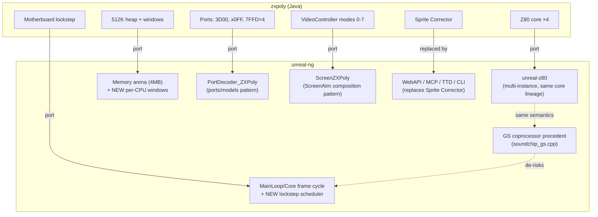
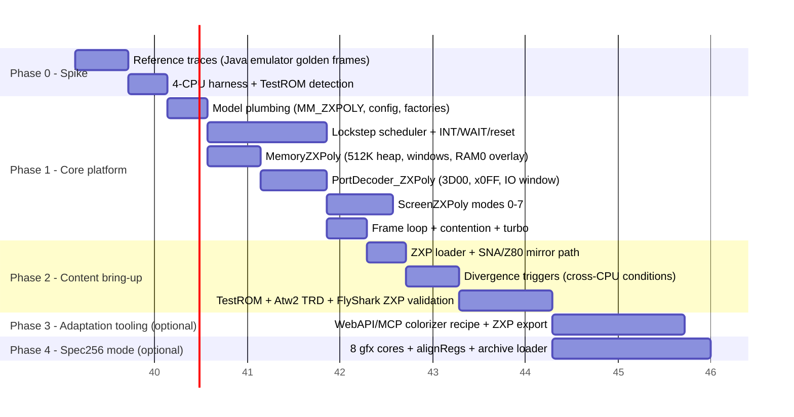

# Bringing ZX-Poly to unreal-ng: Feasibility, Effort, Value

> Decision-support analysis, 2026-09-27. Companions:
> [zxpoly-platform.md](zxpoly-platform.md) ·
> [zxpoly-emulator-internals.md](zxpoly-emulator-internals.md) ·
> [zxpoly-adaptation-pipeline.md](zxpoly-adaptation-pipeline.md) ·
> [quad-instance-architecture.md](quad-instance-architecture.md).
> unreal-ng references are repository-relative.
>
> **Update 2026-09-27 (later the same day):** the recommended route is now
> **four stock Pentagon instances**: master load, replication of the full
> state (devices included), host input gated to the master and replicated
> into the slaves at the same T, and per-line screen composition. See
> [quad-instance-architecture.md](quad-instance-architecture.md). That note
> supersedes:
>
> - §3 (scheduler, Option A/B) and the Phase 0–2 breakdown in §4: replaced by
>   quad-instance §4–§11;
> - §8–§9: all answered in quad-instance §12.
>
> §5 (value) and §6 (risks) still apply. The text below is kept for the
> record.

## 1. TL;DR

ZX-Poly ports unusually well into unreal-ng's architecture. The two hardest
prerequisites — **a multi-instance, instruction-stepped Z80 core** and **a
working precedent for a second main-bus CPU** — already exist
(`core/src/3rdparty/unreal-z80/` and the General Sound coprocessor in
`core/src/emulator/sound/chips/gs/soundchip_gs.cpp`). The one genuinely new
subsystem is a **multi-CPU lockstep scheduler in the frame loop**; everything
else (model plumbing, port decoder, memory windows, poly renderer, ZXP loader)
follows patterns the codebase already has (ATM Turbo, Profi, Scorpion).

Estimates: **~1 week spike**, **~7–9 weeks** to a credible core release
(Test ROM + adapted games bootable), **+2–3 weeks** each for the two optional
expansions (adaptation tooling on top of WebAPI/MCP; Spec256 mode).

The value is asymmetric: a **content library nobody else can run natively**
(8 adapted games exist today), a **differentiating "metadata-driven game
mods" capability** that unreal-ng's automation stack is uniquely positioned to
deliver better than the original Java tooling, and **core dividends** (rigorous
multi-CPU infrastructure that hardens the GS precedent).

## 2. Component mapping

| ZX-Poly concept (Java) | unreal-ng counterpart | Status |
|:--|:--|:--|
| `Z80` core ×4, per-`ctx` bus callbacks (`Z80CPUBus`) | `unreal-z80` lib: `Z80CpuCreate`, `Z80CpuSetMemoryBus/SetPortBus/...`, callback bus with `userData` per instance | **Exists** — designed for exactly this |
| `Motherboard.step` instruction-rotated lockstep | `Core::CPUFrameCycle()` → `Z80::Z80FrameCycle()` (single CPU) | **Missing** — the core new work |
| GS coprocessor precedent (2nd CPU, private banks, frame stepping, TTD blob) | `SoundChip_GeneralSound` (`soundchip_gs.cpp`) | **Exists** as pattern, but lazy-sync; lockstep needs instruction interleaving |
| 512K shared heap + sliding per-CPU windows (`REG0 & 7` × 64K) | `Memory` arena scales to 4 MB / 256 pages, but has a single `_bank_*[4]` window set | **Extend**: per-CPU bank tables (GS pattern) or a `MemoryZXPoly` override of `UpdateModelBanks()` |
| Per-module `#7FFD`, `#3D00`, module regs `#x0FF–#x3FF` | `PortDecoder::GetPortDecoderForModel` factory + `core/src/emulator/ports/models/` | **Exists as pattern** → new `PortDecoder_ZXPoly` |
| `VideoController` modes 0–7, 4-bit plane combining | `VideoController::GetScreenForMode` + `ScreenZX`; hi-res precedent `ScreenAtm` sampling arbitrary `RAMPageAddress()` pages | **Exists as pattern** → new `ScreenZXPoly` (composition like ScreenAtm) |
| TimingProfile (69888/70908/71680 T, contention, even-M1) | `Config::ApplyModelTimingDefaults`, `UlaContention`, per-model intstart/intlen | **Exists** — reuse 128K/Pentagon profiles; contention must apply per-CPU at access T |
| `.zxp` 4-CPU snapshot | `core/src/loaders/snapshot/` (sna/z80 classes, extension dispatch in `Emulator::LoadSnapshot`) | **Exists as pattern** → `LoaderZXP`; GS TTD serializer shows 4× `Z80CpuRegisters` persistence |
| Divergence triggers (`TRIGGER_DIFF_*`) | WebAPI debugger + TTD + port trace + breakpoints | **Superset exists** — needs a "compare across CPUs" condition type |
| Sprite Corrector (Java Swing) | **No GUI editor needed for v1**: WebAPI/MCP memory R/W + screen render + labels cover plane editing scripted | **Superset exists** (this is the unique advantage — see §5) |

## 3. The one hard problem: the lockstep scheduler

Everything single-CPU in the main path is the integration risk:
`EmulatorState` timing, `_z80` pointers in debugger/disassembler/labels, TTD
capture, `Z80::t` bookkeeping. Two routes:

| | Option A — CPU0 stays legacy `Z80` | Option B — all four on `unreal-z80` |
|:--|:--|:--|
| Shape | Legacy `Z80` for module 0; 3 satellites on `unreal-z80` (mirrors the GS wiring) | 4× `unreal-z80`, one promoted as master |
| Pros | Debugger/TTD/automation keep working for the master unmodified; smallest blast radius; direct GS precedent | Uniform code path; per-CPU symmetrical; `Z80CpuAttachRegisterFile` + bulk save/restore ready for 4× snapshotting |
| Cons | Two stepping paths to keep in T-lockstep; satellites get only GS-style surfaces | Everything (debugger, TTD, breakpoints) needs a CPU-selector abstraction — touches the widest surface |
| Semantics risk | **High** — two *different* cores must stay T-state identical: the legacy core applies contention through `UlaContention`, unreal-z80 through a wait-state hook, and unreal-z80 has no WAIT pin. Shared lineage and z80test passes do not prove cycle-for-cycle equality under this machine's bus. Any mismatch is an instant desync | Low (one core), but it is not the core the machine models use |
| **Recommendation** | Superseded by the quad-instance route (four copies of the **same** legacy core) | Fallback only |

Scheduler design: reproduce zxpoly's scheduler rather than inventing a
T-state-ordered interleave. zxpoly steps every CPU exactly once per board
step, in the rotation order chosen by `frameT & 3`. The frame clock advances
**only by module 0's T-states**, and a parked slave burns 1 T per step
without affecting that clock. A "smallest cumulative T first" interleave
would behave differently from the reference whenever modules are parked or
diverged (the loader phase), which breaks golden-frame parity. In the locked
steady state the two schemes agree, and there no per-instruction interleave
is needed at all (quad-instance §1). The shared
frame INT asserts for all four CPUs simultaneously (respecting per-module `#7FFD`
D7 and R0 INT masking); slaves parked via WAIT burn exactly 1 T per step (unreal-z80
and zxpoly's core share this WAIT semantic — verify against `z80cpu.h` semantics
during the spike).

Contention must be applied by the *executing* CPU's bus callback at the access
T-state (the zxpoly notes explicitly record the failure mode of doing otherwise:
slaves delayed, master double-contended).

## 4. Phased plan and effort

**Phase 0 — Spike, ~1 week (decision gate).**
Run the Java emulator, capture golden screens/traces for the Test ROM and 2–3
adapted games. Build the prototype = quad-instance tests T4–T6 (replication,
lockstep with input gated and replicated from the master, plane divergence →
colour). Exit criteria: registers, `t` and device state equal at every
barrier over
hundreds of frames; the composed mode-4 frame shows colour; throughput
measured. The Test ROM is out of v1 scope (quad-instance §13).

**Phase 1 — Core platform, ~4–5 weeks.**
- Model plumbing (3 d): `MEM_MODEL` entry, `Config::mem_model` row,
  `data/configs/zxpoly/unreal.ini`, both factory switches
  (`GetPortDecoderForModel`, `IsModelSupported`).
- Scheduler (9 d): zxpoly-order stepping (quad-instance: coupled/decoupled regimes), shared INT with per-module gating,
  slave WAIT parking, local-reset broadcast + R1–R3 command injection, halt
  notification.
- Memory (4 d): per-CPU windows over the arena, per-module `#7FFD` with lock,
  RAM0 overlay rules, TR-DOS ROM auto-switch on `#3Dxx` M1.
- Ports (5 d): `PortDecoder_ZXPoly` — `#3D00` (all bits incl. lock), module
  regs with writer-priority rule, IO-mapped window R/W with INT/NMI pulses.
  `#3D00` has A0 = 0, so it must be decoded **before** the base `#FE` decode.
  The floating bus stays off (option-gated and buggy in the reference;
  absent on Pentagon).
- Video (5 d): `ScreenZXPoly` modes 0–7, mode 5 quadrant tiling with per-CPU
  attributes, mode 6/7 masks, palette; border from CPU0's `#FE`.
- Integration (3 d): turbo, per-CPU contention, frame-boundary hooks.

**Phase 2 — Content bring-up, ~2–3 weeks.**
`LoaderZXP` (+ extension dispatch), SNA/Z80 import mirrored to 4 CPUs,
cross-CPU divergence conditions in the WebAPI debugger
(`pc_diff`, `mem_diff`, `opcode_diff` — zxpoly's three triggers), then the
bug-matching grind: Test ROM demos (modes 4+5), After The War 2 TR-DOS boot
(exercises the whole multiloader path: COPY2CPU, reset command, `SETPOLYMAIN
#93`), Flying Shark ZXP (mode 7 + attribute pokes). Golden-frame diffs against
the Java emulator are the acceptance test.

**Phase 3 — Adaptation tooling, ~2 weeks (the actual payoff).**
No GUI editor: a `.recipe/` workflow + small WebAPI additions that turn
unreal-ng into a colorization factory — load original snapshot → mirror to
planes → scripted plane edits (memory R/W + screen verification) → apply pokes
→ export ZXP. A "mod" becomes metadata: base snapshot + plane patches + poke
list, applied on demand. This is precisely the "metadata-driven game mods"
capability, and unreal-ng's automation is already a superset of what the Java
Sprite Corrector offers (plus TTD for desync archaeology).

**Phase 4 — Spec256 mode, ~2–3 weeks (defer).**
8 gfx cores + `zxpAlignRegs` + leveled logicals + archive loader + 256-color
palette. Doubles the interesting surface; only after ZXPoly proper is solid.
Superseded in detail by [2026-09-27-spec256](../2026-09-27-spec256/) (PLAN #54),
whose render-only Track A does not depend on this program at all; only its
lockstep-core stage E2 would ride the ZX-Poly scheduler.

**Totals**: core release ≈ **7–9 focused weeks**; with Phase 3 ≈ 9–11; with
Spec256 too ≈ 12–14. Roughly 3.5–5 K new LOC plus ~0.5–1 K modified.

## 5. Value assessment

1. **Exclusive content, day one.** Eight adapted games
   (Atw2, FlyShark, ZxWord, OFC, Summer Santa, Comando Quatro, Alien 8,
   Buratino) plus the Test ROM exist as `.zxp`/`.trd` today. No other modern
   C++ emulator runs them. That is immediate, demonstrable differentiation for
   unreal-ng — and a ready-made regression corpus (golden frames from the Java
   reference).
2. **The framework is the prize, not the emulator.** The ZX-Poly concept turns
   "game mod" into "data-only overlay on lockstep hardware". unreal-ng's
   WebAPI/MCP + TTD + memory/label tooling can deliver a *better* adaptation
   pipeline than the original Swing editor: scripted plane surgery, automated
   divergence detection, golden-frame regression, reverse debugging of desyncs.
   This compounds with the existing `.recipe/` library.
3. **Core dividends.** A rigorous multi-main-CPU path hardens the GS
   precedent, pays down the "everything assumes one CPU" debt in a contained
   way (Option A), and makes future multi-CPU work (native Spec256, other
   poly-clone archaeology) cheap. TTD multi-stream recording gets its first
   real consumer.
4. **Performance headroom.** 4×3.5 MHz is trivial for the C++ core — the Java
   emulator strains where unreal-ng would idle. Turbo + TTD recording of poly
   games become practical.
5. **Preservation and cross-validation.** The platform was never built; the
   Java emulator is the only implementation. A second implementation is the
   only possible cross-check — divergences found become bug reports/fixes in
   either project. Strong archival story for a 1994 Russian platform concept.
6. **Cost of NOT doing it**: nothing degrades — this is purely additive. The
   main opportunity cost is that the adaptation corpus stays locked to a Java
   app that is unlikely to see another decade of maintenance.

## 6. Risks

| Risk | Severity | Mitigation |
|:--|:--|:--|
| Single-CPU assumptions in debugger/TTD/EmulatorState | High → Low with quad-instance | Each module is a full stock instance, so every single-CPU tool works per module unchanged. The only new surface is a group view and a group TTD checkpoint |
| Two different Z80 cores in T-lockstep (Option A only) | High | Avoided by the quad-instance route (four copies of the same core) |
| No hardware reference — Java emulator is the spec | Medium | Golden-frame + trace corpus from Phase 0; treat documented quirks (§10 of emulator-internals) as requirements, not bugs |
| Contention/timing subtleties per CPU (even-M1, access-T placement) | Medium | Reuse `UlaContention` per-CPU at the access T; the zxpoly notes document the failure modes already solved there |
| Lockstep desyncs *in content* look like emulator bugs | Medium | Port the three divergence triggers early (Phase 2) — they distinguish emulator faults from asset faults |
| Scope creep via Spec256 | Medium | Explicitly deferred (Phase 4) |
| Licensing | None | zxpoly is GPL-3 and unreal-ng is GPL-3 (`LICENSE`): code, the Test ROM and adapted-game fixtures can be used directly with attribution in `THIRD_PARTY_NOTICES.md`. No clean-room constraint |
| Interest/demand | Low–Med | Content library + novelty is self-demonstrating; spike first, decide after |

## 7. Recommendation

Approve **Phase 0 (1 week)** now — it is cheap, bounded, and produces the
golden-frame corpus that any later phase needs. Gate the rest on the spike's
Test ROM result. If green: Phases 1–2 as a T2-scale item (~7–9 weeks), with
Phase 3 (adaptation tooling) explicitly in scope rather than an afterthought —
it is where unreal-ng's unique leverage lives. Phase 4 only on demonstrated
demand for the Spec256 catalog.

## 8. Open questions for the spike

Questions 1–3 were Option A/B questions; they are answered or dropped under
the quad-instance route:

1. *WAIT at 1 T/step* — moot. A parked instance is simply not stepped while
   its `t` follows the master, which is what zxpoly's shared clock does.
   unreal-z80 has no WAIT pin anyway. Stop address is not used by the corpus
   or the Test ROM.
2. *Sharing `UlaContention`* — moot. Each instance has its own, and the
   clocks are identical (quad-instance §6). The default Pentagon profile has
   no contention.
3. *VRAM pointers* — each instance captures its own line bytes from its own
   `#7FFD` D3 page when its raster reaches the line (quad-instance §5).
4. ZXP fixtures: commit golden frames from the Java emulator into
   `testdata/machines/zxpoly/` (GPL-3 into a GPL-3 project — attribution only).
5. Does the `#3D00` IO-mapped window need to be visible to TTD port tracing
   as ordinary port traffic (zxpoly traces it as ports)? In the quad design it
   is an ordinary master port access, so tracing it costs nothing.
6. Everything else: quad-instance §12 (decisions table).

## 9. Gaps to cover before this is implementation-ready

Not yet analyzed here — should be covered before/alongside the spike, not elaborated now:

- ~~Whether the WebAPI/MCP surface can address per-module memory and
  registers~~ — resolved by the quad-instance route: each module is an
  instance with its own ID. What is still needed is a *group* view (which
  instances form one ZX-Poly machine).
- ~~TTD serialization impact of 4 CPUs~~ — quad-instance §8: four aligned
  ordinary sessions, a `PortLogStore` and group seek/branch. There is no new
  CPU serializer, and only a future single group file touches PLAN #40.
- ~~Where the tests land and how they meet the timing rules~~ — quad-instance
  §10 (T1–T12, pure units under 50 ms, boot-bound tests justified and in
  turbo mode).
