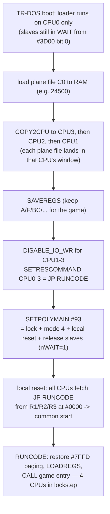
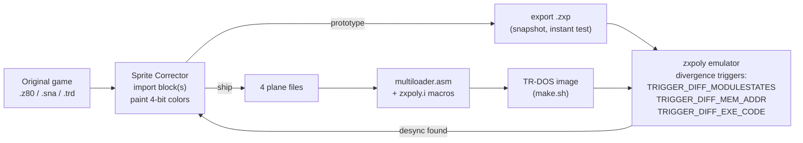

# ZX-Poly: The Game Adaptation Pipeline

> The framework around the platform: how existing ZX Spectrum software is turned
> into ZX-Poly editions without touching program code. Companion to
> [zxpoly-platform.md](zxpoly-platform.md). Paths relative to the zxpoly repo root.

## 1. The core insight

A Spectrum game is (mostly) *code* + *graphics data*. The code computes, the data
is blitted to VRAM. On ZX-Poly:

- All four CPUs execute the same code in lockstep (same memory ⇒ same behavior).
- Each CPU has **its own VRAM copy**. The game writes identical bytes to all four
  — unless the *data it writes from* differs.
- Therefore: **recolor the game's graphics assets per-plane** (keep CPU0's bitmap
  as the luminance base, put color bits into CPU1/2/3's copies of the same
  assets), and the game renders 16-color pictures while believing it is an
  ordinary Spectrum.

The failure boundary is exactly "does the program *read back* what it draws?"
Anything that checksums, compares, or branches on VRAM/graphics content (collision
optimizations, compression that inspects its output, self-modifying sprite data)
desynchronizes the CPUs. Adaptation is the art of editing data up to that boundary.

## 2. The Sprite Corrector (`zxpoly-sprite-corrector/`)

A Swing editor whose unit of work is a **data block**: a byte range extracted
from a snapshot or disk container.

**Data model** (`components/ZXPolyData.java`):

```
basedata[]   — original bytes as imported (never modified)
mask[]       — per-bit "edited" flag
zxpoly[4][]  — the four planes ZXPOLY_0..3 (start as copies of basedata)
Info         — origin plugin id, block type, start address, length, page size 0x4000
```

Session files (`.sze`, magic `0xABBAFAFABABE0123`) serialize all of the above.

**Import**: Z80 v1/v2/v3 and SNA snapshots (JBBP grammars); TRD/SCL/HOBETA/TAP
*containers* (pick one file inside the disk as the block); `.scr`; Spec256 `.sze`
and ZIPs; or a fresh blank block (default 6912 bytes = one screen).

**Editing** (`components/EditorComponent.java`): the canvas shows the block in
ZX screen order (linear→ZX interleave via `VideoMode.LINEAR_TO_ZX_Y`). The
author paints with a 4-bit **ZX palette color**; `setPoint()` decomposes it into
plane bits — color bit 0 → plane 2, bit 1 → plane 1, bit 2 → plane 0, bit 3 →
plane 3 (matching the video controller's index formation) — and sets the mask.
In 512×384 mode the canvas maps pixels chess-order to planes (CPU0 even/even,
CPU1 odd/even, CPU2 even/odd, CPU3 odd/odd). Tools: pencil, eraser, colorizer
(nearest-color flood), pen width, "copy base to planes" reset.

**Export** (`Z80InZXPOutPlugin.writeTo`): writes a `.zxp` snapshot — all four
CPUs get identical registers; `port3D00 = (videoMode << 2) | 0x80 | 1` (locked,
nWAIT = 1 → slaves **running**, no reset); module 0 ports `(7ffd,0,0,0)`, modules 1–3 `reg0 = 0x10 | (i<<1)`
(their IO writes disabled + their heap windows); per-CPU pages built from
`data.getDataForCPU(cpu)`. Optionally override CPU registers at start.

A CLI companion exists: `zxsc.jar sliceImage` slices a PNG into four `.c0…c3`
plane files — the bridge used by the Test ROM build.

## 3. The loader path: from snapshot to bootable disk

Snapshots are the demo/prototyping path. The *shippable* path builds a TR-DOS
disk with a multiloader, using the assembly API in `AsmLoader/zxpoly.i`
(v1.02, SjasmPlus macros):

(`zxpoly.i` has known defects: `SETWAIT13` toggles the reset bit instead of
nWAIT, `SETSTOPADDR` references an undefined symbol, and `COPY2CPU` cleanup
does not restore the target's R1. See
[zxpoly-emulator-internals.md](zxpoly-emulator-internals.md) §10.)

| Macro / constant | Effect |
|:--|:--|
| `SETVIDEOMODE m` | `#3D00` D2–D4 |
| `SETSTOPADDR cpu,addr` | R2/R3 rendezvous |
| `SETRESCOMMAND cpu,$C3,lo,hi` | post-reset `JP nn` injection |
| `SETIOCPU n` | `#3D00` D5–D6 mapped-CPU |
| `COPY2CPU cpu,addr,len` | stream RAM block through the IO window into another CPU (sets R1 b4 on the target to mask the NMI flood, R1 b5 to route `#7FFD` through the window) |
| `SOFTRESET_CPU`, `LOCKPOLY`, `DISABLE_IO_WR`, `SETPOLYMAIN flags` | orchestration |

The canonical boot sequence (from `adapted/Atw2/multiloader.asm`,
`AsmLoader/diskload.asm`, `tapload.asm`):



`#93` = `1001_0011b`: bit 7 lock, bits 2–4 = `100` = mode 4, bit 1 local
reset, bit 0 nWAIT = 1 (release the slaves). ZxWord (512×384) uses `#97`
(mode 5) instead.

## 4. The Test ROM (`TestROM/`)

`zxpolytest.asm` (v1.02) — the platform's self-test and demo, shipped inside the
emulator as the default boot image (`zxpolytest.prom`):

1. ZX-128 paging and full 128K RAM tests (classic).
2. **"ZX-POLY allowed" check** — reads `#3D00`; if not ZX-Poly, falls back to
   plain Spectrum tests.
3. Per-CPU detection: module *n* writes `181`/`213` (OK/BAD) to `CPUTESTRSLT`
   at `#8000`; slaves run the same code but only their own port identity makes
   the check pass.
4. Video demos: mode 4 decompresses four ZX0-packed plane images
   (`TSTIMGR/Y/B/G`) into each CPU's `#4000` via `SET_IOCPU`; mode 5 likewise
   with 512×384 plane sets (`IMG512C0..C3`).

Platform features it exercises:

- module index read from `#3D00`;
- local reset with `JP` command injection (CPU1–3 via R0 = `$22/$24/$26`,
  which are also their default heap windows);
- IO-window writes and reads;
- RAM0 at `#0000`;
- halt detection by *polling* R0 bit 0.

It does **not** use stop addresses or halt-notification INT/NMI.

Build pipeline (`TestROM/build`): PNG → `zxsc.jar sliceImage` → four plane
files → `zx0` compress each → `zasm` assemble → `.prom` resource. This is the
minimal reference for "authoring poly content from scratch".

## 5. Case studies (`adapted/`)

| Game (year) | Mode | Path | Lesson |
|:--|:--|:--|:--|
| **After The War 2** | 4 | sprite-corrector session `.sze` → 4 HOBETA plane files (`a1C0..C3.$C`) + `multiloader.asm` → `make.sh` builds `atw2.trd` (sjasmplus + DOSBox `ZCOP.EXE` TRD copier) | The canonical TRD pipeline; "partly adapted" — sprites only |
| **ZxWord** | 5 | same shape; plane files `tzxunC0..C3` (16,401 B each), `SETPOLYMAIN #97` | 512×384 works best for *fonts/UI apps* — improved font beats the attribute limits without diverging gameplay pixels |
| **Flying Shark** | 7 | snapshot path only: `flyshark.sze` → `flyshark.zxp` + `poke.txt` | Mode 7's dual personality: FLASH-on cells = colorized field, FLASH-off = classic panels. `poke.txt` documents three code patches `LD A,(40025)` → `LD A,134 / NOP` — the game *reads* an attribute byte to fill screen attrs, so the attribute source had to be forced constant |
| **Official Father Christmas** | 6 | `OFCZXPOLY.zxp` | Level-3 elements **could not be colorized**: coloring them desynchronized the CPUs — the level contains graphics-processing optimizations that check for empty areas, i.e. it reads back VRAM state. The canonical lockstep-boundary failure |
| **Summer Santa 2022** | 4 | `SummerSanta2022.zxp` | Modern homebrew adapts cleanly |
| **Buratino** | 5 | `buratino_adventures.zxp` | Mirrored sprites (one sprite serves left+right walk via flip) can't take two colors — inherent limitation for symmetrical art |
| **Comando Quatro** | 4 | `ComandoQuatro.zxp` | Colorized by the game's *original author* 35 years later; "no more colour clash" |
| **Alien 8** | 4 | `Alien8.zxp` | One-evening adaptation |
| **After The War (1)** | (4) | `zxpolyeditions/atw1.sze` only | A Sprite Corrector project never exported to `.zxp` or TRD; exporting it gives a ninth title |

All of the above, plus the loader sources and Sprite Corrector projects, are
collected with measurements in
[testdata/machines/zxpoly/](../../../testdata/machines/zxpoly/README.md).

## 6. The workflow, condensed



The emulator's divergence triggers close the loop: when a colorized element
breaks lockstep, `findFirstDiffAddrInModuleMemory()` points at the offending
byte and the editor iteration continues.
