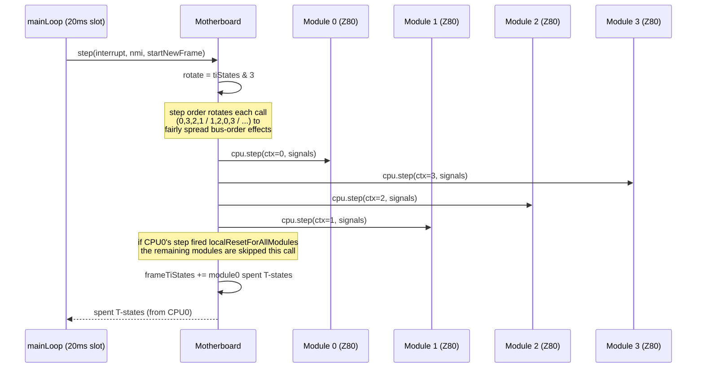
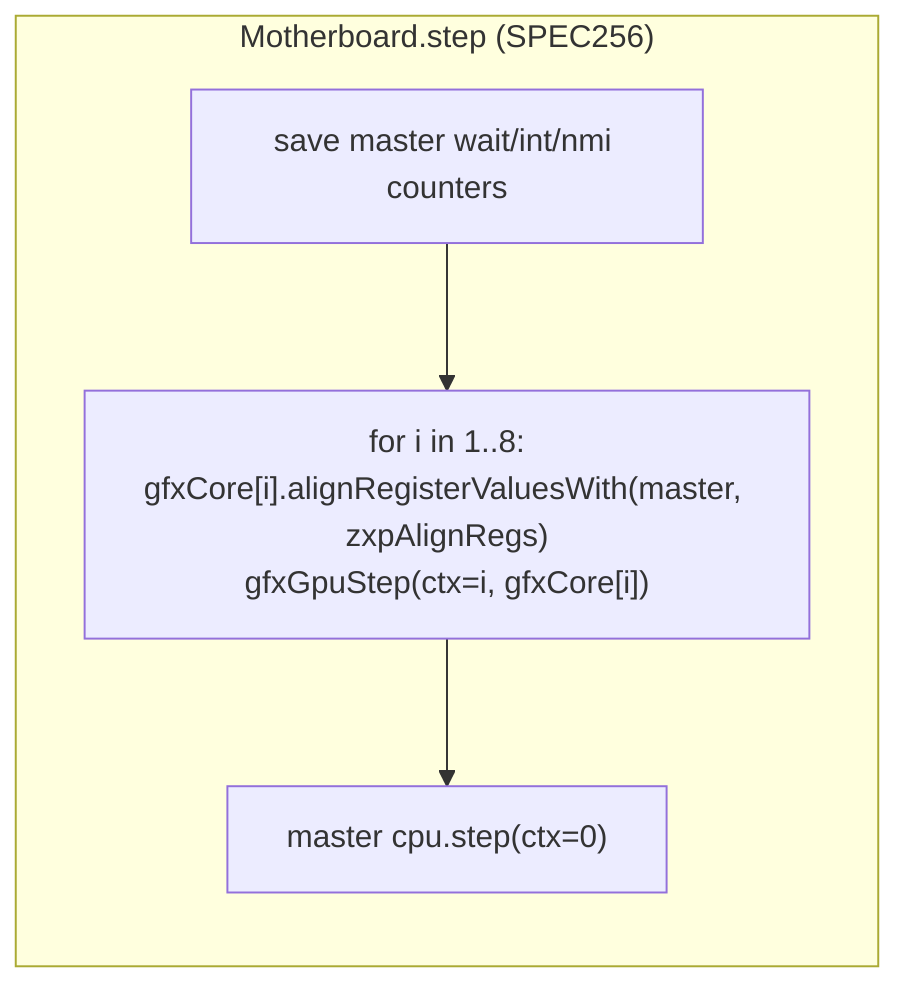

# ZX-Poly: Emulator Internals

> How the Java reference emulator implements the platform. Companion to
> [zxpoly-platform.md](zxpoly-platform.md). All paths relative to the zxpoly repo root.
> Key sources: `zxpoly-emul/src/main/java/com/igormaznitsa/zxpoly/` (below: `…/`),
> `zxpoly-z80/src/main/java/com/igormaznitsa/z80/`.

The project is a multi-module Maven build (Java 22+):

| Module | Role |
|:--|:--|
| `zxpoly-z80` | Clean-room Z80 core (tables adapted from `anotherlin/z80emu`, decode per z80.info); FUSE conformance suite |
| `zxpoly-emul` | Swing emulator: motherboard, modules, video, formats, sound, tape, beta-disk, tracer |
| `zxpoly-sprite-corrector` | Adaptation editor (see [zxpoly-adaptation-pipeline.md](zxpoly-adaptation-pipeline.md)) |
| `zxpoly-emul-win-launcher` | Go launcher for Windows |

## 1. CPU core: one object per CPU, context-routed bus

`Z80` (`zxpoly-z80/.../Z80.java`, ~5200 lines) is an instruction-level core:
one `step(ctx, incomingSignals)` = one instruction (or one chunk of a block op).
Signals: `nINT`, `nNMI`, `nRESET`, `nWAIT`. **WAIT with a live prefix preserves
prefix state and burns exactly 1 T-state** — this single property is what makes
STOP-ADDRESS parking and slave-WAIT cheap and exact.

The poly trick is architectural, not register-array SIMD:

- Four independent `Z80` instances exist (one per `ZxPolyModule`), each with
  scalar `int` registers (migrated from `byte[8]` for speed).
- Every bus callback in `Z80CPUBus` carries `(Z80 cpu, int ctx, …)` where `ctx`
  is the module index: `readMemory`, `writeMemory`, `readPtr`,
  `readSpecRegValue`, `readRegPortAddr`, `postProcessXor/And/Or`, `readPort`,
  `writePort`, `onRETI`, `onInterrupt`…
- Because the bus answers **per-CPU**, the four cores execute the "same"
  instruction but may load different operands → registers, flags and even PC
  legitimately diverge. Nothing reconciles them; divergence is only *detected*
  (§6).

State plumbing needed by the platform: `alignRegisterValuesWith(src, packed)`
(selective register copy — Spec256 sync), `fillByState` (full clone), the
MEMPTR/WZ latch, the SCF/CCF **Q latch**, and `getLastM1InstructionByte()` for
divergence triggers.

## 2. Motherboard: instruction-granularity lockstep

`…/components/Motherboard.java` owns everything. The frame loop
(`MainForm.mainLoop()`, `…/MainForm.java`) runs on one thread paced by a 20 ms
nano-time timer, stepping the board until `TimingProfile.tstatesFrame` is spent,
then issuing the frame INT.

`Motherboard.step()` in `BoardMode.ZXPOLY`:



- **All four CPUs execute exactly one instruction per board step** — lockstep by
  construction, at instruction granularity (not cycle interleaving).
- Consumed T-states are taken from module 0 after each step; per-module INT/NMI
  pulse *lengths* are counted down independently (`intTiStatesCounter`,
  `nmiTiStatesCounter`).
- Sound, border painting, and raster-blink rendering hook into this loop at
  T-state granularity (beeper level sampled per step; border pixel written at
  the raster phase of the current T).

## 3. Memory: one 512K heap, four sliding windows

Not four separate 64K spaces — a single `byte[512 * 1024]` heap, randomized at
power-on. Each module maps its 64K Z80 space into a **128K window** inside it:

```
heapOffset(module) = (REG0 & 7) * 0x10000          // REG0 bits 0–2 slide by 64K
within the window (standard ZX128 mapping):
  #0000–#3FFF → window + 0x0000   (RAM0 or ROM)
  #4000–#7FFF → window + 0x14000  (RAM5 — the VRAM page)
  #8000–#BFFF → window + 0x8000   (RAM2)
  #C000–#FFFF → window + 0x4000 * (#7FFD & 7)      (banked page, per-module 7FFD!)
```

At system reset, module *i* gets `REG0 = i << 1`, i.e. windows at heap offsets
0, 128K, 256K, 384K — **four disjoint ZX128 machines**. Overlap (memory sharing)
is opt-in by rewriting REG0. There is no write broadcasting: a CPU writes only
its own window unless re-pointed.

Other memory rules: RAM0 overlay under ROM requires `#7FFD` bit 6 *and*
unlocked `#3D00`; TR-DOS ROM auto-activates on an M1 fetch in page `#3Dxx`;
memory writes can be globally disabled per module (REG0 bit 3). The `#7FFD`
latch (including its lock bit) is per-module.

## 4. Sync primitives in code

- **STOP-ADDRESS**: `ZxPolyModule.readMemory` computes `R2 | (R3 << 8)` on M1
  fetches; on match it latches `stopAddressWait`, which asserts WAIT for that
  module → 1 T per step at the stop address. Visible in REG0 read (WAIT bit).
- **Reset command injection**: after local reset a counter=3 makes the three
  M1 fetches at `#0000` return R1, R2, R3 (then clears them) — the hardware
  boot-block readout emulated exactly.
- **HALT notification**: falling edge of nHALT per module → motherboard reads
  that module's R1 → sends INT/NMI to the modules selected by R1 bits 0–3.
- **INT gating**: frame INT reaches CPU0 only if `#7FFD` bit 7 is clear (when
  both `#3D00`/`#7FFD` are unlocked); slaves take INT only via local INT or
  when `#3D00` is unlocked. NMI maskable per module (R1 bit 4).
- **IO-mapped window**: with `#3D00` D5–D6 = *n* ≠ 0, CPU0's generic port reads
  address module *n*'s memory at the port address (and pulse INT); writes go
  there too (and pulse NMI). `COPY2CPU` is a loop of `OUT (n),A` over this window.

## 5. Video implementation

`…/components/video/VideoController.java` renders into a 512×384 INT-RGB buffer
(256×192 pixel space, doubled). Per mode:

- **Modes 0–3**: classic ZX render of one module; ULA+ and FLASH supported.
- **Mode 4** (`fillDataBufferForZxPolyVideoMode`): per pixel
  `index = (cpu3 << 3) | (cpu0 << 2) | (cpu1 << 1) | cpu2` from bit 7 of each
  module's bitmap byte → `PALETTE_ZXPOLY[16]`.
- **Mode 6**: attribute from module 0; `ink == paper` floods the cell, else
  mode-4 pixel.
- **Mode 7**: FLASH clear → each module's pixel drawn with module-0 ink/paper
  into a 2×2 quadrant block (identical planes ⇒ looks like classic 2× ZX);
  FLASH set → mode-6 logic.
- **Mode 5**: 2×2 quadrants per pixel, each quadrant using **its own module's**
  attribute (true four-screen tiling).

Rendering is beam-chased: the main loop tracks `blinkLineY` and re-renders line
ranges (`syncUpdateBuffer`, EVEN/ODD interlace) as the raster passes, then
`copyWorkScreenToOutputScreen` doubles into the output image. Border is painted
incrementally per CPU step through a T-state → raster coordinate table. FLASH
toggles every 25 frame-INTs (wall-clock flavored).

## 6. Divergence detection (the debugging story)

Since divergence is legal but usually fatal, the board has user-armed triggers
evaluated each step (`TRIGGER_*` in `Motherboard.step`):

| Trigger | Compares |
|:--|:--|
| `DIFF_MODULESTATES` | PC, SP, IM, IFF1/IFF2 across the four CPUs |
| `DIFF_MEM_ADDR` | byte at a watch address across modules |
| `DIFF_EXE_CODE` | last M1 opcode byte across modules |

Plus `findFirstDiffAddrInModuleMemory()` — scans the 128K windows for the first
differing byte. These feed the UI tracer and are the primary adaptation
debugging tool ("which byte did the colorizer change that the game reads back?").

## 7. Spec256 compatibility mode

`BoardMode.SPEC256` reuses the same motherboard with a different step function:
module 0's CPU is the "main" CPU and **8 additional gfx cores** (cloned `Z80`s)
run one instruction each *before* the main CPU, all sharing module 0's bus:



- Memory is routed **by ctx**: `ctx==0` or prefix/command fetch → ordinary RAM;
  otherwise the 8-plane-expanded `gfxRam`/`gfxRom` (1 MB / 256 KB), addressed
  `page*0x4000*8 + (offsetInPage << 3) + coreIndex` — each gfx core is one
  bitplane of the virtual 64-bit Z80.
- `zxpAlignRegs` (CFG file, default `"1PSsT"`) selects which registers are
  re-copied from the master every instruction (`1`=F w/o carry, `P`=PC,
  `S/s`=SP hi/lo, `T`=take SP/IX/IY/BC/DE/HL and port addressing from master).
  This is the tolerance knob that makes real Spec256 games boot.
- Optional **leveled logical ops**: leveled XOR returns 0 if either operand is
  0 else max(a,b); AND→min, OR→max — keeps plane arithmetic predictable.
- Video: 8 planes → 256-color `PALETTE_SPEC256`, plus per-game background
  overlays and ink/paper mixing thresholds read from the Spec256 CFG.

## 8. Formats

| Format | Handling |
|:--|:--|
| `.zxp` | Full 4-CPU state: 4× (ports 7FFD+R0–R3, all register pairs, PC/SP) + 8×16K heap pages *per CPU* (512K). Parsed via JBBP grammar `src/jbbp/snapshots/zxp/*.jbbp` |
| `.sna`/`.z80`/`.szx` | Loaded into **module 0 only**, board switched to ZX128/ZX48 mode — plain Spectrum behavior (adaptation starts from here) |
| Spec256 archive | ZIP with `.sna`, `.gfx/.gf0..7/.gfa/.gfb` planes, `.cfg`, `.pal`, `.bNN` backgrounds; planes bit-transposed into `gfxRam` |
| `.prom` | ZX-Poly ROM image (the Test ROM ships as `zxpolytest.prom` inside the emulator resources) |
| `.trd`/`.scl`, `.tap`/`.tzx`/`.wav` | Standard media, loadable in any board mode |

## 9. Timing profiles

`…/video/timings/TimingProfile.java` — per-model T-state math:
SPECTRUM48 (69888 T/frame, INT 32 T), SPECTRUM128 (70908, INT 36, plus the
even-M1 rule: one extra T before any M1 starting on an odd T), PENTAGON128
(71680, no contention). Contention delays `{6,5,4,3,2,1,0,0}` applied at the
*access* T-state by the executing module's bus callbacks (this placement
matters: putting them in the module's IO layer instead delayed slaves and
double-contended the master — a real bug from the notes file).

## 10. Known fidelity gaps (per author's notes)

- 5 FUSE block-op tests skipped (Ped7g extra-cycle flag disagreements).
- No `contend_read_no_mreq` waits on internal cycles → slightly *faster* than
  Fuse in contended RAM.
- Sound LPF advances per CPU step, not per T-state.
- Default timing profile is PENTAGON128; 48K games need explicit SPECTRUM48.

These quirks define "reference behavior" for any reimplementation chasing
bug-for-bug compatibility (see [unreal-ng-port-analysis.md](unreal-ng-port-analysis.md) §Risks).
