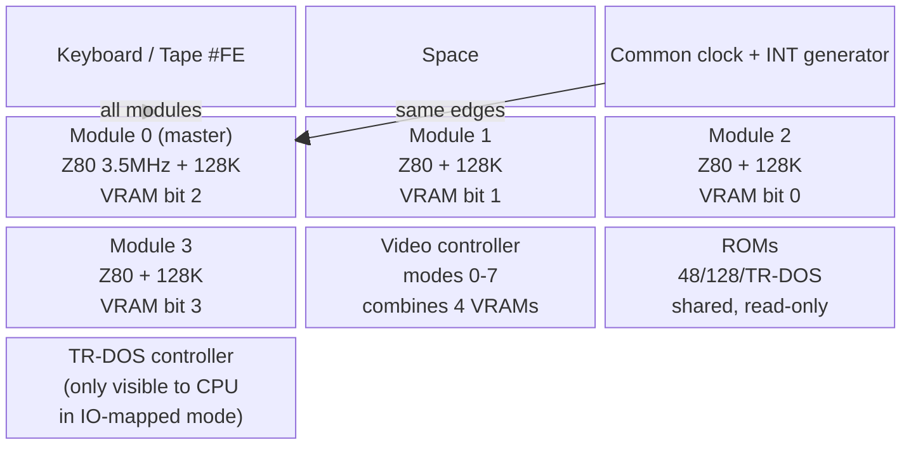
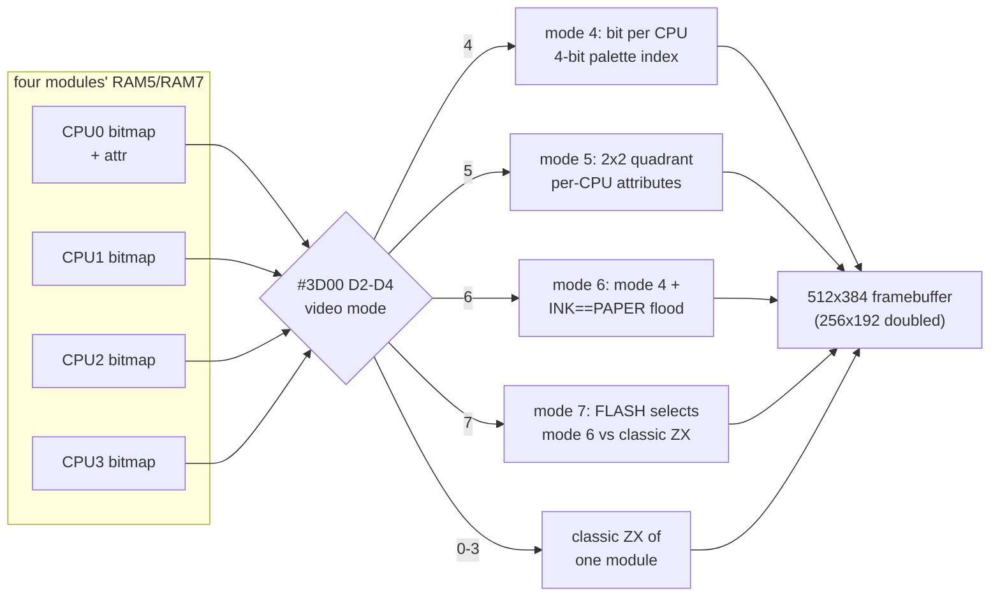

# ZX-Poly: The Platform

> Analysis of [raydac/zxpoly](https://github.com/raydac/zxpoly) (GPL-3, Igor Maznitsa), performed 2026-09-27.
> All zxpoly source references in this folder are relative to the zxpoly repo root.

## 1. Origin and motivation

ZX-Poly is a 1994 platform concept by Igor Maznitsa aimed at the ZX Spectrum's
most infamous defect: [attribute clash](https://en.wikipedia.org/wiki/Attribute_clash).
The stock machine stores one ink/paper pair per 8×8 cell, so any two colors meeting
inside a cell bleed into ugly blocks. The idea: keep everything else about the
ZX Spectrum 128 identical, but run **four synchronously locked Z80 CPUs**, each
owning one bitplane of the final pixel color. Each CPU contributes one bit of a
4-bit index into the standard 16-color Spectrum palette — attribute clash disappears
because every pixel carries its own color.

The inspiration was the Pixar Image Computer (as described in the Time-Life
"Computer Images" book), which processed each color component on a dedicated
processor. ZX-Poly applies the same decomposition to a home computer: CPU0 holds
bit 2, CPU1 bit 1, CPU2 bit 0, CPU3 bit 3 of the pixel's palette index.

Crucially, the platform was **never manufactured**. Negotiations with Russian
clone manufacturers in the mid-90s concluded it was too late for the market.
The Java emulator in this repository is therefore the *only existing
implementation* — it is the reference hardware, quirks included.

**History** (from [SpeccyWiki: ZX-Poly](https://speccy.info/ZX-Poly), whose
text was read in a browser because the site blocks automated fetching, and
from the zxpoly repository):

| Year | Event |
|:--|:--|
| 1994 | Idea by Igor Maznitsa (Raydac), under the original name **ZM-Polyhedron**: four Z80s running the same program in sync, with their 1-bit screen planes combined into 4-bit colour; programs unmodified, only graphics data changed |
| 1999 | First emulator written to test the idea, and a trial colorization of a fragment of *After The War*. The corpus still has an After The War 1 Sprite Corrector project, `atw1.sze` (never exported), most likely from this line of work |
| 2007 | New emulator written in Java; the project takes the name **ZX-Poly**. Emulated platform: standard video mode, 16-colours-per-pixel mode, 512×384 mode with 8×8 attributes, four Z80s at 3.5 MHz, 512 KB RAM, 32 KB ROM |
| 2017–2024 | Adapted games published in the repository: OFC (2017), Buratino (2018), Flying Shark (2019), Alien 8 (2021), Comando Quatro (2024, by its original programmer), Summer Santa 2022 (2024); After The War 2 and ZX-Word as TRD builds |

The complete public corpus (snapshots, TRDs, loader sources, Sprite Corrector
projects, Test ROM) is in
[testdata/machines/zxpoly/](../../../testdata/machines/zxpoly/README.md).

## 2. The enabling theory: deterministic lockstep

The whole platform rests on one theorem the author states as:

> Stable synchronous systems (without internal random processes), built on the same
> component base, started synchronously from the same state, remain in the same
> state at any point in time — provided all components receive the same input
> signal states at the same time.

Consequences:

- All four CPUs share **one clock, one RESET, one INT generator**. There is no bus
  arbitration and no cache; every CPU fetches the same instruction stream.
- Code **never needs modification**. Load the same program into all four address
  spaces and it executes identically on each CPU — a SIMD machine by construction.
- The only thing that may diverge is **data**: memory contents that the program
  *writes* (graphics) rather than *reads* (logic). Adaptation means changing data
  in three slave planes while the master plane keeps the original bitmap.
- Anything the program *reads back* from divergent memory breaks the lockstep and
  desynchronizes the machine. This is the fundamental constraint of every game
  adaptation (see [zxpoly-adaptation-pipeline.md](zxpoly-adaptation-pipeline.md)).

The platform can also run MIMD (all CPUs independent) — with the sync primitives
of §5 used to re-align them — but all adapted content runs SIMD.

## 3. Hardware structure

Each **module** is a complete ZX Spectrum 128 minus keyboard/Video: one Z80 at
3.5 MHz, its own 128K RAM, its own `#7FFD` paging latch, and four platform
registers R0–R3 exposed on dedicated ports. Modules are peers electrically;
"CPU0 is master" is a software convention (the boot ROM starts only CPU0 and
parks the other three in WAIT/HALT).

## 4. Programming model: ports

ZX-Poly is driven entirely through I/O ports — no custom opcodes, no ROM changes.
It boots as a plain ZX Spectrum 128: standard 128 OS + TR-DOS ROMs, `#7FFD`
paging with the usual bit layout (per module!), `#FE` keyboard/beeper/tape.

### 4.1 The platform port `#3D00`

Master-only; fully lockable (bit 7) so adapted games end their loader by
"closing the door" and running as a normal Spectrum.

| Bits | Name | Meaning |
|:--|:--|:--|
| D0 | `nWAIT` | active low: 0 → slave CPUs 1–3 held in WAIT (parked, 1 T per step); 1 → slaves run. Reset value of the whole port is 0, so slaves start parked |
| D1 | local reset | 1 → `/RESET` to all CPU modules only (no other device resets) |
| D2–D4 | video mode | 0–7, latched by the video controller |
| D5–D6 | mapped CPU | index of the module whose memory CPU0 sees through its bus window |
| D7 | lock | freezes all ZX-Poly ports for writing until system RESET. Also switches INT routing: slaves receive the common frame INT **only while locked**, and halt notification works **only while unlocked** |

Reading `#3D00` returns the *executing* module's identity and state:
`moduleIndex | ((REG0 & 7) << 5) | 0x10 if this module is the IO-mapped one |
0x08 if its memory writes are disabled | 0x04 if its IO writes are disabled`.
This is how the Test ROM discovers it runs on module 1/2/3.

### 4.2 Module registers `#x0FF…#x3FF`

Each module exposes four 8-bit registers at ports
`(moduleIndex << 12) | (registerIndex << 8) | 0xFF`:

| Port (module 0) | Register | Write bits | Read bits |
|:--|:--|:--|:--|
| `#00FF` | R0 | D0–2 RAM window base (see §6 of emulator doc), D3 disable memory writes, D4 disable IO writes, D5 local reset, D6 NMI, D7 INT | D0 in HALT, D1 in WAIT, D2–7 packed last-M1 address |
| `#01FF` | R1 | reset-command byte 1; halt-notification config (b7 NMI, b6 INT, b5 `#7FFD` via window, b4 local NMI off, b3–0 target mask) | — |
| `#02FF` | R2 | stop-address low / reset-command byte 2 | — |
| `#03FF` | R3 | stop-address high / reset-command byte 3 | — |

Writes are honored only while `#3D00` is unlocked, only from a module with
index ≤ target, and never during TR-DOS activity.

## 5. Synchronization primitives

Four mechanisms turn "four computers" into "one poly-computer":

1. **STOP-ADDRESS (R2/R3).** A module whose M1 fetch address equals its R2/R3
   value latches WAIT and burns 1 T-state per step at that address. CPU0 uses
   this to freeze slaves at a known rendezvous, then releases them so all four
   enter a code block on the same instruction.
2. **Local reset + command injection.** A local reset puts modules into a
   special mode where the first three opcode fetches at address `#0000` are
   *replaced by R1, R2, R3*. The standard pattern writes `#C3, lo, hi` there —
   after reset the CPU executes `JP nn` with `nn` chosen per module. This is how
   slaves are aimed at plane-specific code without any ROM support.
3. **HALT notification.** When a module *enters* HALT, the **halting
   module's** R1 decides what happens: b7 sends NMI, b6 sends INT, b3–b0 pick
   the target CPUs (CPU3..CPU0), b4 disables local NMI for this module, b5
   routes the master's `#7FFD` writes through the IO window. It works only
   while `#3D00` is unlocked; `#3D00` itself has no halt bits. R1 is also
   reset-command byte 1 and is cleared after a local reset, so the halt
   configuration does not survive one. Intended to emulate periphery in slave
   CPUs (a slave parks in HALT and interrupts CPU0), but neither the Test ROM
   nor the adapted corpus uses it.
4. **IO-mapped memory window.** `#3D00` D5–D6 point CPU0's bus at another
   module's RAM: plain port reads/writes then address that module's memory,
   pulsing INT (read) or NMI (write) on the target. This is the data channel
   for `COPY2CPU` — streaming a plane image from CPU0's RAM into a slave.

## 6. Video modes

The video controller combines the four VRAMs (each module's RAM5/RAM7 selected
by its own `#7FFD` bit 3) into one framebuffer:

| Mode | Name | Behavior |
|:--|:--|:--|
| 0–3 | ZX 256×192 CPU*n* | Classic attributed Spectrum view of module *n* alone |
| 4 | **ZX-Poly 256×192** | Per pixel: 4-bit index = `(cpu3 << 3) \| (cpu0 << 2) \| (cpu1 << 1) \| cpu2` → 16-color palette |
| 5 | **ZX-Poly 512×384** | Each source pixel → 2×2 block; CPU0 top-left, CPU1 top-right, CPU2 bottom-left, CPU3 bottom-right, each with *its own* attribute colors. Four tiled 256×192 attributed screens. With identical planes it degenerates to a 2× scaled normal picture; diverged planes give chess-order pixels |
| 6 | Poly + INK/PAPER mask | Mode 4, but if module-0 attribute has INK == PAPER the whole 8×8 cell floods with that color — compatibility with games that "hide" elements via matching ink/paper |
| 7 | Poly + FLASH mask | Per attribute cell: FLASH bit set → mode-6 behavior (16-color or flood); FLASH clear → standard ZX mode rendered from 4 identical quadrant copies (2×2). Blends colorized game field (FLASH=1) with classic panels (FLASH=0) |

The **Y channel** interpretation (CPU3 = intensity, per the Pixar RGB+Y analogy)
is nominal — electrically CPU3 is just the fourth bitplane.

## 7. Spec256 relationship

[Spec256](http://www.emulatronia.com/emusdaqui/spec256/index-eng.htm) is the
Spanish sibling concept: *one* Z80 extended with 64-bit virtual registers, where
each byte lane is one color plane (8 planes → 256 colors). Both machines are
SIMD colorizers, but:

- ZX-Poly is real 4-CPU hardware semantics (per-CPU memory can diverge freely);
  Spec256 is a virtual register extension where plane data moves through the
  registers of one CPU.
- Spec256 tolerates "damaged" adapted code (the original program keeps running;
  only plane data flows through wide registers); ZX-Poly requires strict
  lockstep, so adaptation must not change control flow.

The zxpoly emulator implements a Spec256 *compatibility mode* internally
(see [zxpoly-emulator-internals.md](zxpoly-emulator-internals.md) §7) and can
run a useful subset of the Spec256 game archive.

## 8. Where to look in the zxpoly repo

| Path | Contents |
|:--|:--|
| `docs/zxpolystruct.mmd`, `docs/zxpoly.mmd` | The author's own structure/port mind maps (authoritative) |
| `docs/old_articles/` | 1997 Fido/Nicron threads discussing the platform |
| `zxpoly-z80/` | Clean-room Z80 core with FUSE test suite |
| `zxpoly-emul/` | The emulator (see next document) |
| `zxpoly-sprite-corrector/` | The graphics adaptation editor |
| `AsmLoader/` | `zxpoly.i` macro API + reference disk/tape loaders |
| `TestROM/` | Platform test ROM in SjasmPlus source |
| `adapted/` | Eight adapted games (Alien8, Atw2, BuratinoAdventures, ComandoQuatro, FlyShark, OfficialFatherChristmas, SummerSanta2022, ZxWord); Atw2 and ZxWord are full source projects, the rest ship as `.zxp`/`.sze` |
