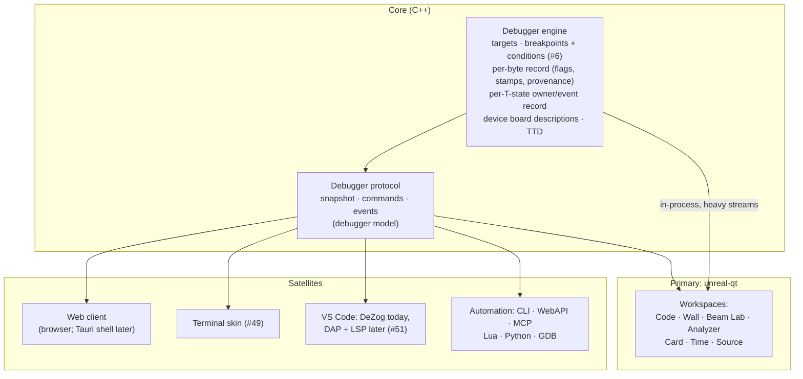

# Proposition: the unreal-ng debugger family

- **Date:** 2026-09-28
- **Status:** proposal for review. Third of four documents
  ([use-cases](use-cases.md) · [comparative-analysis](comparative-analysis.md) ·
  this · [roadmap](roadmap.md)).
- **Builds on:** the debugger model
  ([2026-09-28-debugger-model](../2026-09-28-debugger-model/README.md)): one
  widget catalog, one set of rules, one protocol, any number of skins. This
  document does not redesign that model. It decides **which products** we put
  on top of it, **how they are delivered**, and **what comes first**.

> **In one line.** One debugger engine and protocol in the core; one native
> workbench application (between an IDE and a video editor) with task
> workspaces; a second tier of Tauri and SDL front-ends; native mobile and
> tablet companions; IDE integration and automation as satellites. Three
> flagships lead: the peripheral wall, the beam lab and memory intelligence.

> **Decisions taken (2026-09-28).**
> - **Primary:** native — Qt, SDL or ImGui (toolkit comparison and
>   recommendation: [workbench-framework.md §9](workbench-framework.md#9-toolkit-choice-qt-sdl--imgui-or-both)).
> - **Second tier:** Tauri; SDL terminal emulation.
> - **Companions:** native iOS, Android, Windows tablet.
> - **MVP:** the whole MVP, delivered as modules; the framework must make the
>   minimum look complete and take any hardcore widget and any number of
>   windows on several monitors ([workbench-framework.md](workbench-framework.md)).
> - **Concept:** between VS Code / Visual Studio and Adobe Premiere — video
>   and audio monitoring are first-class (streamers, composers, demo makers);
>   Lua / Python plug-ins for timing and animation effects and rebuild
>   automation.
> - **Knowledge bases:** a separate project, ZX-meta-db
>   ([2026-09-28-zx-meta-db](../2026-09-28-zx-meta-db/concept.md)).

## Contents

- [1. What we are deciding](#1-what-we-are-deciding)
- [2. Constraints and assets](#2-constraints-and-assets)
- [3. The options](#3-the-options)
- [4. Pros and cons](#4-pros-and-cons)
- [5. Recommendation: one engine, one app with workspaces, satellites](#5-recommendation-one-engine-one-app-with-workspaces-satellites)
- [6. The family](#6-the-family)
- [7. Data paths: how much can go where](#7-data-paths-how-much-can-go-where)
- [8. Look and feel: skins](#8-look-and-feel-skins)
- [9. MVP](#9-mvp)
- [10. North star](#10-north-star)
- [11. Risks](#11-risks)
- [12. Decisions requested](#12-decisions-requested)

---

## 1. What we are deciding

The core can drive any front-end: it already serves WebAPI, MCP, CLI, Lua,
Python, GDB, DeZog and ZEsarUX from one engine, and the debugger model adds one
snapshot/command/event protocol. So the question is not "can we", but:

1. **Shape:** one application with many modes, or many specialized tools?
2. **Delivery:** native Qt, a web stack (browser, or a Tauri desktop shell),
   terminal, IDE plug-ins, or a mix?
3. **Look:** one modern look, or skins (classic Unreal, ZX font, retro
   themes)?
4. **Order:** what is the smallest product that wins people over (MVP), and
   where do we end up (north star)?

## 2. Constraints and assets

**Assets we already have** (from the [use-cases inventory](use-cases.md) and
the [scoreboard](comparative-analysis.md#18-scoreboard)):

- TTD, the strongest time-travel implementation among the surveyed tools;
- automation on seven surfaces with project-wide parity rules;
- `DeviceState` reports for most devices;
- fast/debug memory interfaces (the idle debugger already costs nothing);
- the debugger model: widget catalog, rules, protocol, GUI brief, card delta;
- a TUI proof of concept of the Unreal monitor (#49);
- the embed layer on a branch (`ios-client`, #47) and a Unreal Engine vision
  (#50).

**Constraints:**

- **Data volume.** A per-T-state record is ~70 000 entries per frame at 50
  frames per second. Live beam and contention views need that data, so they
  must run where the data is, or receive it pre-reduced.
- **Cross-platform, zero warnings** (Windows, macOS, Linux; gcc, clang, MSVC,
  MinGW).
- **Automation parity**: every feature on CLI, WebAPI + OpenAPI, MCP, Lua,
  Python, and the GUI, with docs.
- **Team size:** a few people plus agents. Every separate application is a
  separate thing to maintain, package and test.

## 3. The options

| # | Option | Description |
|---|---|---|
| **A** | **One reconfigurable Qt debugger** | the Qt app hosts every widget; workspaces (layouts + tool sets) per task; the current debugger window is replaced |
| **B** | **Many native specialized tools** | separate applications or windows: a monitor wall, a GS debugger, an RE workbench, a beam lab, each with its own UI |
| **C** | **Web client** | a browser UI over WebAPI + WebSocket; optionally packaged as a desktop app with Tauri (system webview + a small Rust shell) |
| **D** | **Terminal** | the Unreal-monitor text UI (FTXUI), local or over SSH |
| **E** | **IDE integration** | VS Code through DeZog today, later a Debug Adapter Protocol (DAP) server and a language server (#51) |
| **F** | **Embedded** | the debugger inside other hosts: iOS client (#47), Unreal Engine (#50), HUD overlay on the emulator screen |

These are not exclusive. The real question is **which is primary** and which
are satellites.

## 4. Pros and cons

| | A: one Qt app | B: many native tools | C: web / Tauri | D: terminal | E: IDE | F: embedded |
|---|---|---|---|---|---|---|
| **Heavy live data** (per-T-state, heat, provenance) | **in-process, zero copy** | in-process each, duplicated effort | must be reduced before sending; binary WebSocket; latency | text only; no pictures | none | depends on host |
| **Build cost** | M-L, one codebase | **XL**: N apps, N packagings | L: a new stack (TS/JS + Rust shell) and a second widget set | S-M (POC exists) | M (DAP) | M each |
| **Reach** | desktop only | desktop only | **any device**, remote, headless farms, tablets, streams | SSH, CI logs | where coders already work | host-specific |
| **Look customization** | QSS + custom painting; skins possible | per app | **easiest** (CSS, community themes) | fixed grid | host look | host look |
| **Consistency across tasks** | **one app, one state** | drifts apart | good if one app | one app | partial | partial |
| **Remote and multi-instance** | local | local | **native** (one browser, many emulators) | SSH | local | host |
| **Community contribution** | C++/Qt (fewer people) | same | **web skills** (many people) | C++ | TS | varies |
| **Offline / low-end** | yes | yes | Tauri: yes; browser: needs the WebAPI running | yes | yes | yes |
| **Risk** | known stack | fragmentation | two UI stacks to keep in parity; performance of live views | niche | depends on DAP | platform churn |

**Reading the table.**

- **A** wins on the heaviest, most distinctive features (beam lab,
  contention, provenance, live heat) because it sits next to the data.
- **C** wins on reach, remote, look and community, and is the natural home of
  the **peripheral wall** as a showcase (streams, exhibitions, a second
  screen, a tablet next to the keyboard).
- **B** loses: separate apps multiply packaging and drift, and each task
  really wants the others' widgets (a demo coder needs registers too).
  Specialization belongs in **workspaces**, not in separate programs.
- **D** and **E** are cheap satellites that serve people where they already
  are (SSH, CI, VS Code).
- **F** follows the embed layer; not a starting point.

## 5. Recommendation: one engine, one app with workspaces, satellites

1. **The engine and the protocol are the product.** Everything below is a
   client. A feature exists when it is in the engine and on the protocol;
   skins only present it. This is the debugger model's rule, adopted as is.
2. **Primary: unreal-qt, one application, many workspaces** (option A). It
   gets the heavy views first because it can read the recorders in process.
3. **Satellites, in order of value:**
   1. **Web client** (C) for the peripheral wall and remote/multi-instance use;
      it starts as a page served by the WebAPI, and gets a Tauri shell only if
      people want a desktop web app.
   2. **Terminal skin** (D, #49) on the same protocol.
   3. **VS Code** (E): DeZog stays; our core-side conditions make it faster;
      DAP and the language server come with the devtools program (#51).
   4. **Embedded** (F) when the embed layer lands (#47).
4. **No separate native tools.** Specialization is a workspace: a saved layout
   plus a tool set plus defaults. A workspace can be popped out to its own
   window or second monitor.

## 6. The family

Eight workspaces in one application (the shell, timeline, monitors and plug-ins
they share: [workbench-framework.md](workbench-framework.md)). Each has a clear audience, a hero widget
and a success moment.

| Workspace | For | Hero widget | Other widgets | The moment it wins |
|---|---|---|---|---|
| **Code** | everyone | disassembly with code/data from execution, branch arrows, T-state column, in-place edit | registers with flag boxes and IFF/IM, stack with writer, call stack, breakpoints, watches, navigation (back/forward, marks) | "I patched it right there and it worked" |
| **Wall** | spectators, HW, MU, everyone's first launch | every device board live: ULA/beam, pages and heat, AY/TS/TSFM scopes, GS/NeoGS, FDC head, tape signal, SD/IDE commands, TSConf registers, DMA, RTC | frame counter, activity lights | "look at it all move" — the screenshot people share |
| **Beam Lab** | DM, GD, HW | screen drawn up to the beam with the beam marked | event viewer over the frame (ports, border, AY, INT, marks); contention and bus strip per line; one-line logic analyzer; raster stepping (to line, to T-state, to pixel) | "I see exactly which T-state my border split lands on, and where contention hit" |
| **Analyzer** | RE, GD | memory map colored by role, with heat and provenance | "who wrote this" on any byte or pixel; code/data map; RAM search with undo; graphics browser with **automatic layout**; signature matches (players, loaders, compressors, engines) as labels | "it found the sprites and named the music player by itself" |
| **Studio** | streamers, composers, demo makers | program and source monitors, timeline with video / audio / event tracks | video and audio scopes, per-channel meters with mute / solo, loudness, overlays and captions from plug-ins, export presets (video with overlays, stems, register dumps) | "my stream shows the machine and the music working, and I exported the stems" |
| **Card** | MU, OS (firmware) | the card CPU next to the main CPU, one clock | mailbox, card memory, card devices (DAC, DMA, SD, MP3), command log | "I stepped the GS firmware while the Spectrum waited" |
| **Time** | everyone debugging a bug | the TTD timeline with bookmarks, coverage and events | branches, diff of two runs (first divergence), find-last | "it showed me the first instruction where the good and the bad run differ" |
| **Source** | GD, AP, OS | source view from SLD (pages, modules), line stepping | hot reload status, build output, symbol browser, relocation map (NedoOS) | "save, and the running game changes in a second" |

**Shared by all workspaces:** the session (which CPU, paused or running, one
clock), the command palette, the protocol, persisted layouts, the skin.

## 7. Data paths: how much can go where

| Stream | Size per frame | Qt (in-process) | Web / TUI / IDE |
|---|---|---|---|
| Snapshot (registers, pages, device boards) | a few KB | direct read | JSON snapshot on pause; board deltas pushed at frame rate |
| Device boards live | 1-10 KB | direct read | pushed, coalesced to ≤ 25 Hz, only subscribed boards |
| Per-T-state owner/event record | ~70 000 entries | direct read of the ring | **reduced in the core**: per-line summaries, event lists, or a rendered overlay image |
| Heat / stamps / provenance | per-byte arrays | direct read | tiles on request; changed tiles pushed |
| Trace | unbounded | ring read | pages on request, binary |
| Screen up to the beam | one frame | render | image frames on request |

Rule: **the core reduces, the client presents.** Every heavy view has a
reduced form defined on the protocol, so the web and automation surfaces get
the same answers, just cheaper.

## 8. Look and feel: skins

Skins change look and input style, never content (debugger model rule).

| Skin | Where | Why |
|---|---|---|
| **Modern** (light and dark, HUD-consistent tokens) | Qt, web | default; the design brief exists (gui-main-debugger §10) |
| **Classic Unreal** (8×16 font, Unreal palette and attributes) | Qt, terminal | the community's muscle memory |
| **ZX** (Spectrum ROM font, ZX palette) | Qt, web | charm; Kozynax proves people like it |
| **Retro themes** (AmberCRT, EmeraldCRT, Cyberpunk, RetroZX) | token remaps | streams and showcases |
| **Community skins** | web first (CSS) | cheap to share |

## 9. MVP

The MVP ships **whole but modular**: each item below is a module of the
workbench ([workbench-framework §7](workbench-framework.md#7-modularity-how-the-mvp-ships-in-pieces-without-looking-thin)),
released when ready, enabled per workspace. It is the smallest set that (a) makes people switch to unreal-ng for
debugging, and (b) makes people who only watch say "wow". It deliberately
takes one hero feature per flagship, plus the defects that cost trust.

| # | MVP item | Serves | Rides on | Size |
|---|---|---|---|---|
| M0 | **Workbench shell**: panels, documents, workspaces, command palette, transport bar, timeline strip, several windows and monitors, plug-in host (Lua / Python), canvas abstraction ([workbench-framework.md](workbench-framework.md)) | everyone | protocol v1 | M-L |
| M1 | **Trust fixes**: sjasmplus `.sym` loads (or fails loudly), docs stop promising SLD/`.lbl`/Pasmo `.map`, `/assemble write` journaled like every write, bank-aware label lookup | GD, RE, AP | label manager | S |
| M2 | **Protocol v1**: snapshot, commands, pushed events (paused, step done, board deltas) | all skins, QA/AI | debugger model phase 3 | M |
| M3 | **Code workspace v1**: editing memory, registers and code in place; back/forward and marks (#46 Phase 1); flag boxes, IFF/IM, 9-entry stack with writer | everyone | Qt | M |
| M4 | **Conditions v1**: the #6 language, first slice (registers, memory, ports, pages, beam, hit count; log and count actions), evaluated in the core; DeZog and MCP use it | everyone, QA/AI | #6 | L |
| M5 | **Wall v1**: live boards for the ULA/beam, pages + heat, AY/TS/TSFM with scopes, FDC, tape; generated from DeviceState descriptions; also served as a web page | spectators, HW, MU | DeviceState, M2 | M |
| M6 | **Beam Lab v1**: screen up to the beam on every step, beam marker; event viewer from port writes and interrupts over the frame; raster stepping | DM, GD | port trace, beam, TTD render | M |
| M7 | **Analyzer v1**: per-byte flags + stamps + last writer on physical pages; code/data map feeding the disassembly; "who wrote this" on bytes and pixels; RAM search with undo | RE, GD | memory access tracker | M-L |
| M8 | **Source v1**: SLD loader (pages, multi-file), source view in Qt, hot reload of a build folder (image + symbols + listing, journaled in TTD instead of wiping it) | GD, AP | label manager, TTD | M-L |

**MVP exit criteria:** a game developer loads a sjasmplus project, edits a
line and sees it in the running game; a reverse engineer finds a lives counter,
sees who writes it and patches it from the GUI; a demo coder steps a border
effect and sees the event dots and the beam; a viewer opens the Wall and sees
every chip move — on Windows, macOS and Linux, with every action also on
the protocol.

## 10. North star

Where the family ends up; each item is a differentiator nobody in the survey
has in full.

1. **Contention recorder and bus view** for every model: the owner of every
   T-state, recorded by the contention code itself (vAmiga principle), drawn
   as overlays, strips and a logic analyzer; TSConf and ZX-Evo bus clients
   included.
2. **Memory intelligence with knowledge bases**:
   - automatic graphics layout from recorded read/write strides (sprites,
     masks, fonts, tiles) with manual override only as a fallback;
   - pattern analysis (tables, pointer tables, strings, compressed blocks,
     screen-like blocks);
   - signature bases of ROM routines, players, loaders and protections,
     compressors, engines and demo kernels, with typical memory layouts per
     engine; shared and versioned as community data;
   - behavior profiling that names routines from what they do.
3. **Two-CPU and many-CPU debugging**: GS/NeoGS with one clock; the same rules
   for ZX-Poly (four Z80s) and any card with a CPU.
4. **The code-change loop closed**: patch → reassemble a routine → hot reload a
   build → edit-and-replay with the first divergence mapped to a source line →
   what-if branches kept side by side; relocation-aware symbols for NedoOS.
5. **OS awareness**: NedoOS processes, pages per process, call streams,
   structs decoded from a description language; TR-DOS and CP/M views.
6. **Everything remote**: the Wall and the Beam Lab in a browser, multiple
   emulators in one page (a debugging farm), a tablet as a second screen.
7. **AI pair**: MCP agents that use the same protocol, conditions and
   knowledge bases, and explain what they found in the Analyzer.
8. **IDE-grade source debugging**: DAP, language server, source triggers
   (`@break`, `@log`, `@budget`), unit tests for Z80 routines in CI.

## 11. Risks

| Risk | Mitigation |
|---|---|
| Two UI stacks (Qt and web) drift | content lives in the model and the protocol; the web client starts with the Wall only; a surface-parity test (debugger model) |
| Heavy recorders slow the emulator | reference-counted recorders (on only while a view needs them); zero-cost-when-off benchmarks as gates; naive first, then measure |
| Knowledge bases become stale or wrong | signatures carry evidence and confidence; versioned data files; tests on a corpus |
| Scope explosion | the MVP table is the contract; everything else is north star |
| The current Qt debugger keeps growing | freeze it except for bug fixes; new work goes into workspaces on the protocol |

## 12. Decisions

Taken on 2026-09-28 (see the box at the top): native primary; Tauri and SDL
terminal emulation as the second tier; native mobile / tablet companions; the
whole MVP, modular; the IDE-meets-video-editor concept with Lua / Python
plug-ins; ZX-meta-db as a separate project.

Still open: the tier-1 toolkit, the docking library and the plug-in UI forms
([workbench-framework.md §13](workbench-framework.md#13-decisions-requested)).
