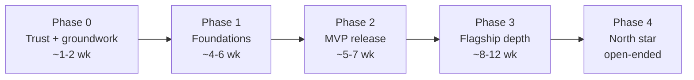

# Roadmap: debugger family priorities, phases and deliverables

- **Date:** 2026-09-28
- **Status:** proposal for review. Fourth of four documents
  ([use-cases](use-cases.md) · [comparative-analysis](comparative-analysis.md) ·
  [proposition](proposition.md) · this).
- **Plan integration:** the phases reference existing [PLAN.md](../PLAN.md)
  rows and propose new ones ([§8](#8-proposed-planmd-changes)). Nothing in
  PLAN.md is changed until the proposal is approved.

> **In one line.** Fix what costs trust (1-2 weeks), lay the protocol and
> recorder foundations (1-1.5 months), ship the MVP with one hero feature per
> flagship (1.5 months), then deepen the flagships toward the north star.

## Contents

- [1. Prioritization rules](#1-prioritization-rules)
- [2. The phases at a glance](#2-the-phases-at-a-glance)
- [3. Phase 0: trust and groundwork](#3-phase-0-trust-and-groundwork)
- [4. Phase 1: foundations](#4-phase-1-foundations)
- [5. Phase 2: the MVP release](#5-phase-2-the-mvp-release)
- [6. Phase 3: flagship depth](#6-phase-3-flagship-depth)
- [7. Phase 4: north star](#7-phase-4-north-star)
- [8. Proposed PLAN.md changes](#8-proposed-planmd-changes)
- [9. What we get at the end of each phase](#9-what-we-get-at-the-end-of-each-phase)
- [10. Open decisions](#10-open-decisions)

---

## 1. Prioritization rules

The same rules as PLAN.md's sequencing rationale, applied to the debugger:

1. **Defects that cost trust first.** A tool that says "loaded" and loaded
   nothing loses users faster than a missing feature.
2. **Foundations before features.** The protocol, the condition language and
   the per-byte / per-T-state records are shared by every flagship. Build them
   once, before the widgets that consume them.
3. **One hero feature per flagship in the MVP.** The Wall, the Beam Lab and the
   Analyzer each get one striking, useful slice early; depth comes later.
4. **Cheap wow early.** The Wall reuses `DeviceState`, which exists; it is the
   cheapest large effect.
5. **Heavy data stays in process.** Qt gets heavy views first; the web client
   gets reduced forms through the protocol.
6. **Measure before optimizing.** Every recorder ships naive, with a
   zero-cost-when-off benchmark as its gate.
7. **Parity by construction.** A feature is done when it is in the engine and
   on the protocol, with CLI, WebAPI + OpenAPI, MCP, Lua and Python bindings
   and docs.

## 2. The phases at a glance

| Phase | Focus | Main PLAN rows touched | Effort |
|---|---|---|---|
| 0 | trust fixes, freeze the old Qt debugger, benchmark gates | new bug row, #46 | S |
| 1 | protocol v1 with pushed events, conditions v1, per-byte record v1, device board descriptions | debugger model phase 3, #23, #6, #9 | L |
| 2 | Code, Wall, Beam Lab, Analyzer, Source workspaces v1 (the MVP) | #46, #42 (partial), new rows | L |
| 3 | contention recorder and bus views, Card workspace, Time workspace, graphics auto-layout, TUI and classic skins | #45, #49, #40, #38 | XL |
| 4 | knowledge bases, OS awareness, edit-and-replay, DAP/LSP, web Beam Lab, many CPUs | #51, #43, #56 | XL |

Estimates assume one core developer plus agents, and are for planning only.

## 3. Phase 0: trust and groundwork

| # | Item | Size | Output |
|---|---|---|---|
| 0.1 | sjasmplus `.sym` loads (content sniffing of `label: EQU`), and every loader reports what it read and what it skipped | S | a real sjasmplus project loads its labels |
| 0.2 | remove the SLD / `.lbl` / Pasmo `.map` / "save as SLD" promises from WebAPI comments, the MCP description and `command-interface.md` until they exist | S | docs match code |
| 0.3 | `/assemble write:true` goes through the same edit path as every memory write (TTD journal, bank target) | S | one write path |
| 0.4 | bank-aware label lookup (the stored bank is used when resolving) | S-M | labels correct on 128K and larger |
| 0.5 | freeze the current Qt debugger (bug fixes only); new work goes to workspaces | — | no more drift |
| 0.6 | benchmark gates: "debugger idle" and "recorder off" frame cost per model | S | every later recorder has a gate |

**Exit:** a sjasmplus project with symbols works end to end; no document
promises a missing format.

## 4. Phase 1: foundations

| # | Item | Size | Rides on | Output |
|---|---|---|---|---|
| 1.1 | **Protocol v1**: snapshot, commands, pushed events (paused, step done, breakpoint hit, board deltas at ≤ 25 Hz), subscriptions | M | debugger model protocol; pulls **#23** (WebSocket push) forward from T4 | every skin and agent is event-driven |
| 1.2 | **Conditions v1**: the #6 language, first slice: registers incl. shadow, memory by CPU address and by page, last access (`RD`/`WR`/`VAL`), ports (`IN`/`OUT`), paging, beam (line, T-state), frame, hit count; actions log / count / mark; fail-open with validation; evaluated in the core | L | **#6** | conditions on every surface; DeZog and MCP stop round-tripping |
| 1.3 | **Per-byte record v1** on physical pages: flags (exec, read, write, operand, jump target), last-access stamp, last writer PC; reference-counted (on only while needed) | M | memory access tracker | the data for CDL, heat and "who wrote this" |
| 1.4 | **Device board descriptions**: every device publishes its fields (groups, bit ranges, symbolic values, units) from `DeviceState` | M | DeviceState | the Wall and the automation get the same boards |
| 1.5 | **Capabilities endpoint**: what this machine and this build can do | S | **#9** | agents and skins adapt; unsupported widgets grey out |
| 1.6 | **Workbench shell** (M0): panels, documents, workspaces, command palette, transport, timeline strip, windows on several monitors, canvas abstraction, plug-in host (Lua / Python) | M-L | 1.1 | the frame every module plugs into |

**Exit:** an agent sets a conditional breakpoint through MCP, gets a pushed
pause event and reads a snapshot, with no polling; a board description exists
for every device on every creatable model.

## 5. Phase 2: the MVP release

The MVP of [proposition §9](proposition.md#9-mvp), as workspaces in unreal-qt.

| # | Workspace v1 | Size | Hero result |
|---|---|---|---|
| 2.1 | **Code**: in-place edit of memory, registers and code; back/forward and persisted marks (#46 Phase 1 with its open questions settled); flag boxes, IFF/IM; 9-entry stack with writer; code/data from 1.3 in the disassembly; T-state column | M | patch from the GUI |
| 2.2 | **Wall**: all device boards live; AY/TS/TSFM scopes; pages with heat; beam position; the same page served by the WebAPI for a browser | M | the screenshot people share |
| 2.3 | **Beam Lab**: screen drawn up to the beam on every step, beam marker; event viewer over the frame (port writes, border, AY, INT, mark-only breakpoints) with the previous frame ghosted; raster stepping (to line end, T-state, pixel); beam stamp on every log line | M | the border split and its T-state on one picture |
| 2.4 | **Analyzer**: "who wrote this" on any byte or screen pixel; code/data map; heat with decay; RAM search with previous-value modes and undo | M-L | lives counter found and patched without leaving the GUI |
| 2.5 | **Source**: SLD loader (pages, modules, multi-file), source view, line stepping; hot reload of a build folder (image + symbols + listing, applied at a safe point, journaled in TTD) | M-L | save the file, the running game changes |
| 2.6 | **Studio**: program / source monitors, timeline tracks for video, border, every sound channel, CPU load and events; audio meters with loudness; export presets (video with overlays, stems, PSG / YM / VGM) | M | the streamer's and composer's workspace |

**Exit (the MVP criteria):** see [proposition §9](proposition.md#9-mvp). The
release note leads with the Wall and the Beam Lab.

## 6. Phase 3: flagship depth

| # | Item | Size | Rides on |
|---|---|---|---|
| 3.1 | **Contention recorder**: the owner of every T-state (ULA fetch, CPU contended, CPU free, I/O, floating bus) recorded by the contention code itself; contention and bus strip per line; one-line logic analyzer; TSConf / ZX-Evo bus clients | L | #38 (gating), #42 (video mappers) |
| 3.2 | **Beam traps** as scheduled events; beam-position breakpoints; screen-region write breakpoints; media triggers (tape block, disk sector) | M | 1.2 |
| 3.3 | **Card workspace**: GS then NeoGS, one clock, mailbox, card devices | L | **#45**, debugger model card delta |
| 3.4 | **Time workspace**: TTD timeline widget, branches (keep the old future; created on divergence, lanes, distance to branch end), reverse playback at speed, history across snapshot / media loads, diff of two runs with the first divergence, desync fingerprint for determinism tests; model what-if forks and continue-on-fork ([design](../2026-09-29-model-what-if/design.md), phases W1-W4) | L | **#40** (TTD v2), #7, **#76** |
| 3.5 | **Graphics auto-layout v1**: derive stride, width, height, mask interleave and frame count of sprites and fonts from recorded read/write patterns of the drawing routine; graphics browser with manual override | L | 1.3 + provenance |
| 3.6 | **Provenance v2**: bounded reader/writer PC lists per byte, port-read provenance, indirect-jump targets, runtime call graph, SMC detection; exports to sjasmplus / SkoolKit / Ghidra | L | 1.3 |
| 3.7 | **Skins**: terminal skin on the protocol (**#49**), classic Unreal skin, ZX-font skin | M | 1.1 |
| 3.8 | **Symbols long tail**: real z88dk `.map`, Pasmo, rasm, zmac, SkoolKit, Unreal `user.l`, XAS/ALASM import, MAME-style CRC-bound comments; a test corpus per format | M | Phase 0 |

**What we get:** the Beam Lab and the Analyzer become best in class; the card
debugger ships; history gains branches and run comparison.

## 7. Phase 4: north star

| # | Item | Rides on |
|---|---|---|
| 4.1 | **ZX-meta-db integration**: identification by hash, signature matches as labels, memory-layout overlays, known graphics sets, cheats — from the separate [ZX-meta-db](../2026-09-28-zx-meta-db/concept.md) project (its own phases D0-D4 run in parallel from Phase 2) | 3.5, 3.6 |
| 4.2 | **Behavior profiling** that names routines from what they do; pattern analysis (tables, pointer tables, strings, compressed and screen-like blocks) | 3.6 |
| 4.3 | **OS awareness**: NedoOS processes, pages per process, call streams, relocation-aware symbols, structs from a description language; TR-DOS and CP/M views | **#51**, NedoOS docs |
| 4.4 | **Edit-and-replay** with the first divergence mapped to a source line; asset hot-swap | #51, 3.4 |
| 4.5 | **DAP and language server**, source triggers (`@break`, `@log`, `@budget`), Z80 unit tests in CI | **#51** |
| 4.6 | **Web Beam Lab and farms**: reduced beam and contention streams to the browser; many emulators in one page | 1.1, 3.1 |
| 4.7 | **Many CPUs**: ZX-Poly (four Z80s) on the card-debugger rules | **#43** |
| 4.8 | **Second tier**: Tauri client; SDL3 terminal emulation (classic Unreal grid, ZX-font UI) | 1.1, canvas abstraction |
| 4.9 | **Companions**: native iOS (from the #47 embed layer), Android, Windows tablet — wall, transport and timeline, mixer, watches, notifications, touch input | 1.1 |

## 8. Proposed PLAN.md changes

To be applied only after approval. Row numbers are the next free ones.

| Row | Tier | Title | Content |
|---|---|---|---|
| **#62** | T1 | Debugger trust fixes | Phase 0 items 0.1-0.4 (sjasmplus `.sym`, doc promises, `/assemble write` path, bank-aware lookup) |
| **#63** | T2 | Debugger family program (umbrella) | this folder; phases 1-4; links #6, #23, #9, #45, #46, #49, #42, #40, #51 |
| **#64** | T2 | Debugger protocol v1 + pushed events | Phase 1.1; absorbs **#23** (moved up from T4) |
| **#65** | T2 | Per-byte memory record + device board descriptions | Phase 1.3 + 1.4 |
| **#66** | T2 | MVP workspaces (Code, Wall, Beam Lab, Analyzer, Source) | Phase 2; **#46** becomes the Code workspace's navigation part |
| **#67** | T3 | Contention recorder and bus views | Phase 3.1-3.2 |
| **#68** | T3 | Graphics auto-layout and provenance v2 | Phase 3.5-3.6 |
| **#69** | T4 | ZX-meta-db integration and behavior profiling | Phase 4.1-4.2 |
| **#70** | T3 | ZX-meta-db (separate project) | [2026-09-28-zx-meta-db](../2026-09-28-zx-meta-db/TODO.md); phases D0-D4 |
| **#71** | T3 | Workbench second tier and companions | Phase 4.8-4.9 |

Re-tiering: **#6** stays T2 but becomes the first item of Phase 1; **#23**
moves from T4 into #64; **#9** is pulled into Phase 1.

## 9. What we get at the end of each phase

| After | A game developer | A demo coder | A reverse engineer | A spectator | An agent |
|---|---|---|---|---|---|
| Phase 0 | symbols from sjasmplus work | — | labels correct on 128K | — | honest docs |
| Phase 1 | conditions everywhere | beam in conditions | "break when this byte gets 0" | — | pushed events, capabilities, conditions |
| Phase 2 (MVP) | source view, hot reload, patch from the GUI | screen up to the beam, event viewer, raster stepping | who wrote this, code/data map, RAM search | **the Wall** | the same boards and data on the protocol |
| Phase 3 | branches, run diff | **contention and bus view** | auto sprite layout, provenance, exports | Beam Lab overlays | run diffs, determinism checks |
| Phase 4 | edit-and-replay, IDE, unit tests | web Beam Lab | engines and players recognized | web wall farms | knowledge-base answers |

## 10. Open decisions

1. The toolkit decisions in [workbench-framework §13](workbench-framework.md#13-decisions-requested)
   (the proposition's delivery, MVP and knowledge-base decisions were taken
   on 2026-09-28).
2. Approve the PLAN.md rows of [§8](#8-proposed-planmd-changes), or adjust
   tiers.
3. Phase 1 order: protocol first (unblocks skins and agents) or conditions
   first (unblocks users). Recommendation: protocol and conditions in
   parallel; the per-byte record after them.
