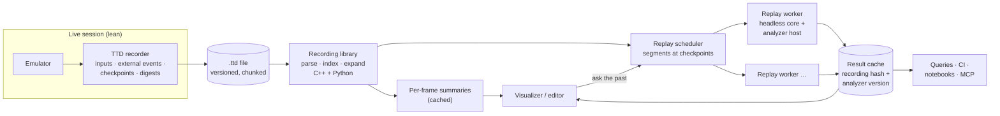
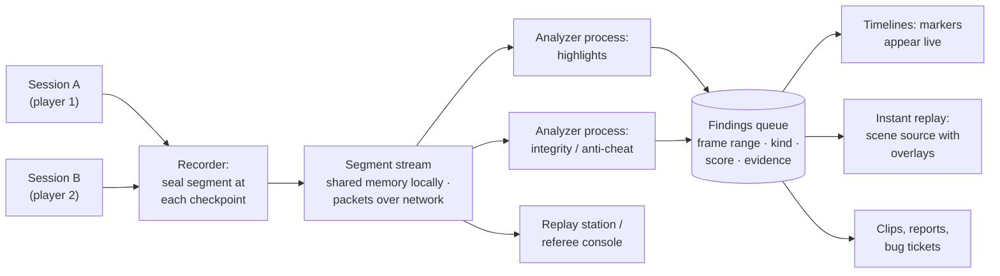
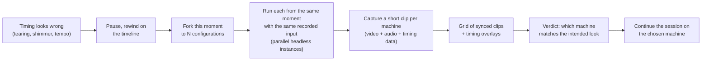

# TTD offline analysis: record cheap, analyze without limits

- **Date:** 2026-09-29
- **Status:** proposal with tracking. No code for the offline part yet.
- **Where the ideas come from:** the TTD recording editor, visualizer and
  analyses in [use-cases-extended §5](use-cases-extended.md#5-ttd-recording-editor-and-visualizer)
  (IDs TE-, TV-, TA-); the principle in §5.5 there.
- **Depends on:** the TTD v1 → v2 migration
  ([2026-09-25-ttd-v2-migration](../2026-09-25-ttd-v2-migration/TODO.md), PLAN
  #40), the media manager ([2026-09-28-storage-manager](../2026-09-28-storage-manager/TODO.md),
  PLAN #58), the condition language (PLAN #6).

> **In one line.** At run time, record only what determinism needs; after the
> run, replay any stretch with any number of heavy analyzers, as often as
> wanted, on any machine, in parallel. The live debugger stays lean and hands
> expensive questions to an offline replay.

## Contents

- [1. The idea](#1-the-idea)
- [2. What exists today](#2-what-exists-today)
- [3. What it enables](#3-what-it-enables)
- [4. Requirements](#4-requirements)
- [5. Constraints and limitations](#5-constraints-and-limitations)
- [6. Proposal: architecture](#6-proposal-architecture)
- [6a. Live segment streaming: from offline to near-live](#6a-live-segment-streaming-from-offline-to-near-live)
- [6b. TTD and RZX](#6b-ttd-and-rzx)
- [6c. Model what-if: open this moment on other machines](#6c-model-what-if-open-this-moment-on-other-machines)
- [7. Tracking and priorities](#7-tracking-and-priorities)
- [8. Proposed PLAN.md changes](#8-proposed-planmd-changes)
- [9. Open decisions](#9-open-decisions)

---

## 1. The idea

Live analysis is bounded by the frame budget: every recorder costs emulation
time, so only a few cheap recorders can run live, and their questions must be
chosen before the run. A **deterministic recording** removes both limits:

- The recording needs to contain only what makes replay exact: the start
  state, the inputs, the external events, and checkpoints to start replays
  from.
- **Any detail can be regenerated** by replaying the needed stretch from the
  nearest checkpoint with the heavy analyzers switched on: every read and
  write, register data flow, per-T-state bus owners, provenance, paint
  attribution.
- Questions are asked **after** the run, again and again, including by
  analyzers written later.
- Replays run **anywhere** (another desktop, CI workers, a cloud service) and
  **in parallel**: a recording is cut into segments at checkpoints, each
  replayed by its own worker, and the results are merged.

This is how record-and-replay debuggers work on PCs (rr, Pernosco). The
Spectrum is a far easier target: the whole machine is emulated, so every
source of non-determinism is known.

## 2. What exists today

Checked in code on 2026-09-29 (`core/src/debugger/ttd/`,
`TimeTravelManager::SerializeSession`).

| Item | State |
|---|---|
| Recording, seek, reverse step / continue, find-last, coverage, bookmarks | **works** (live session) |
| Phase 0, Step 1 "make v1 honest" | **done** 2026-09-28 (TTD v2 TODO) |
| Saved in the `.ttd` file | checkpoints (CPU and chipset state, references to 4 KB memory pieces stored Full / XOR-against-previous / Zero, CRC per piece), device state blobs from the registry, the write journal (with a "complete" flag when no records were evicted), the coverage index, bookmarks; times counted at the model's top CPU clock |
| **Not saved in the file** | **input events** (keyboard, mouse, GS stimuli) and **external events** (tape and disk barriers, debugger edits): they exist only in the live session. A loaded file can show checkpoints, but replay between them with input does not reproduce the recorded run. |
| Host time read by the machine | **solved for recording sessions** by `04383910` (2026-09-29): one shared `Ds12887` RTC for ATM3 / ZX-Evo, Profi and Scorpion SMUC; while TTD records, its time is emulated (host time at recording start plus emulated time since), and its state is a TTD device blob. Outside recording it still follows host time |
| Media | TTD v1 is media-agnostic: it records port-level behavior, not media identity |
| Device RAM | GS card RAM is copied whole into every checkpoint blob; MoonSound wave SRAM is not captured (Tier A only); memory regions are TTD v2 Phase 1 |
| Write journal | a 64 MB ring; records can be evicted in long sessions |

## 3. What it enables

The capabilities listed in [use-cases-extended §5](use-cases-extended.md#5-ttd-recording-editor-and-visualizer),
grouped by what they need:

| Group | IDs | Needs |
|---|---|---|
| **Trim and export** | TE-1 … TE-9 | complete file contents, a baseline materialized at any point |
| **Visualizer tracks and inspection** | TV-1 … TV-8 | per-frame summaries, state at any point |
| **Questions of the past** | TA-1 retroactive breakpoints, TA-2 queries, TA-3 content search, TA-4 time-series export | replay with observers; the condition language |
| **Cause and effect** | TA-5 data origin, TA-6 influence, TA-7 input latency, TA-8 paint attribution | per-access and register data flow during replay |
| **Structure** | TA-9 chapters, TA-10 periods, TA-11 anomalies, TA-12 stack and buffer life | per-frame summaries plus light replay |
| **Taking things out** | TA-13 asset harvest, TA-14 unpacked image, TA-15 offline profiling, TA-16 media renders | replay with recorders |
| **Across recordings** | TA-17 aligned comparison, TA-18 accumulated coverage, TA-19 library, TA-20 conversions, TA-21 tamper evidence, TA-22 digests | stable formats and results |

## 4. Requirements

Each requirement is tagged **MUST** (the principle fails without it) or
**SHOULD**.

**Determinism and completeness**

| ID | Requirement | Level |
|---|---|---|
| OR-1 | Every input event (keyboard, joystick, mouse, card stimuli, typed text) is saved in the file with its exact time | MUST |
| OR-2 | Every external event (tape and disk barriers, media insert / eject, debugger edits, settings changes that affect emulation) is saved with its exact time | MUST |
| OR-3 | No host time reaches the emulated machine: RTC / CMOS chips run on an emulated clock seeded at session start, the seed saved in the file | MUST |
| OR-4 | Media identity and positions are recorded (which image in which slot, its content hash, tape position, head position), and media writes are journaled, so a replay sees the same media | MUST |
| OR-5 | Every checkpoint holds the full machine state: all devices (device table, Phase 2) and all memory regions including device RAM (Phase 1) | MUST |
| OR-6 | Model, ROMs (by hash), configuration and the emulator version are recorded in the file | MUST |
| OR-7 | Frame digests (a hash of the machine state or a cheap proxy) are stored per frame or per checkpoint interval, so a replay can prove it matches | MUST |
| OR-8 | Speculative contexts (run-ahead, look-ahead) never write into the recording | MUST |
| OR-9 | Several CPUs (main + GS / NeoGS) replay in the same order and with the same clock as recorded | MUST |

**Replay and analysis**

| ID | Requirement | Level |
|---|---|---|
| OR-10 | A replay can start at any checkpoint in a fresh, headless emulator instance, independent of other segments | MUST |
| OR-11 | A replay that diverges from the recorded digests stops and reports the first mismatching frame | MUST |
| OR-12 | Analyzers observe a replay through hooks (instruction, memory access, port access, interrupt, frame, bus T-state) and never change machine state | MUST |
| OR-13 | A read-only **recording library** parses, indexes and expands any frame or range without a running GUI; C++ with Python bindings; the same operations on CLI, WebAPI and MCP | MUST |
| OR-14 | Per-frame summaries (activity per page, ports, audio levels, CPU use, events) are computed once and cached, for smooth visualization | SHOULD |
| OR-15 | Analysis results are cached next to the recording, keyed by the recording hash and the analyzer version, with a stable schema | SHOULD |
| OR-16 | Segment replays can be distributed: local threads, several local instances, CI workers, a remote service; results are merged in order | SHOULD |
| OR-17 | Queries use the core condition language (#6), so a live breakpoint condition and an offline query are the same expression | SHOULD |
| OR-18 | The live debugger can hand a question to an offline replay transparently ("ask the past") and show the answer when it arrives | SHOULD |

**Format and trust**

| ID | Requirement | Level |
|---|---|---|
| OR-19 | The file format is versioned and chunked (Phase 5); readers accept older minor versions | MUST |
| OR-20 | Integrity: per-piece CRCs today; a file-level checksum; optionally a hash chain over frames for tamper evidence (TA-21) | SHOULD |
| OR-21 | Trimmed exports re-compute the start state and re-pack deltas, then verify by replay (TE-3, TE-7) | MUST for the editor |

## 5. Constraints and limitations

| Constraint | Consequence | Mitigation |
|---|---|---|
| **Replay speed** is bounded by emulation speed; heavy analyzers slow it further | a full-detail analysis of an hour-long recording takes time | parallel segments at checkpoints; cheap per-frame summaries first, heavy replay only on the ranges asked about |
| **Version lock**: bit-exact replay across emulator builds is not guaranteed (timing fixes change behavior) | an old recording may diverge on a new build | record the emulator version; replay with a matching engine (kept builds, containers) or accept divergence detection (OR-11); a compatibility note per release |
| **Non-recordable sources**: live hardware bridges (Greaseweazle and similar, PLAN #12), network devices, audio line-in as a tape source, host folders not versioned by the media manager | such sessions cannot replay exactly | record their data as external events where possible (the bytes that reached the machine); otherwise mark the recording "not replayable past frame N" |
| **Host time** (RTC / CMOS) | met while recording since `04383910`; a file-level check of the time anchor is still open | keep every future clock device on the same emulated-time switch |
| **Write-journal eviction** in long sessions | reverse queries fall back to replay | acceptable: replay regenerates everything; the "complete" flag already tells which case applies |
| **Storage size** of long sessions with device RAM | large files | memory regions and per-piece chain caps (Phase 1), memory budget and disk mode (Phases 4, 5), trimming (TE) |
| **Reads and register flow are not recorded** | TA-5, TA-6, TA-8 need replay with observers | by design: that is the principle |
| **Content ownership**: recordings contain the software that ran | sending recordings to a remote service may not be acceptable | local-first; remote analysis opt-in; digests and results can be shared without the recording |
| **Plug-in analyzers** may be buggy or slow | a bad analyzer must not corrupt results or the recording | analyzers run in the replay instance only, read-only (OR-12), with time limits |
| **Lockstep groups** (X-19 multi-model runs) produce several recordings | comparisons need a shared timeline | record the group's alignment points with each recording |

## 6. Proposal: architecture

| Component | Role |
|---|---|
| **TTD recorder** | unchanged in spirit; adds OR-1 … OR-9 (inputs, external events, clock seed, media, digests) |
| **Recording library** | read-only access: header, metadata, checkpoints, journals, summaries; expand a frame to a full state; trim and export (TE) |
| **Replay worker** | a headless core instance started from a checkpoint, fed the recorded inputs and events, checking digests (OR-10, OR-11) |
| **Analyzer host** | the observer hooks (OR-12); analyzers in C++ (built in) or Python / Lua (plug-ins); each declares what it observes, so unused hooks cost nothing |
| **Replay scheduler** | splits a request into segments, runs them locally or remotely, merges results in time order (OR-16) |
| **Result cache** | results keyed by recording hash and analyzer version (OR-15); also the per-frame summaries (OR-14) |
| **Query front end** | the #6 condition language over the replay (OR-17); results as markers, tables or tracks |
| **Consumers** | the visualizer and editor (workbench), CI (failure artifacts, accumulated coverage), notebooks, MCP agents |

**First analyzers to ship** (cheap to build on the host, high value):
retroactive breakpoints (TA-1), content search (TA-3), chapters (TA-9),
offline profiling (TA-15), asset harvest (TA-13), automatic unpacked image
(TA-14).

## 6a. Live segment streaming: from offline to near-live

If recorded segments can be **sealed and handed to other processes quickly**,
offline analysis stops being "after the session" and becomes **near-live**:
heavy analyzers run beside the session with a delay of seconds, and their
findings feed back into it while it is still running.

### 6a.1 How it works

- **Sealing.** When the recorder writes a checkpoint, the segment that ends
  there (previous checkpoint → this one: its inputs, external events, write
  journal slice, digests, and the memory pieces it references) is **sealed**:
  immutable from now on.
- **Hand-off without copying.** The page store is already reference counted;
  a sealed segment can be shared with other local processes through shared
  memory (references, not copies), or **re-packed** into a self-contained
  **segment packet** (a keyframe or a delta against the previous packet, plus
  inputs, events and digests) for another machine.
- **Subscribers.** Analyzer processes, replay stations, CI, a referee's
  console or an agent subscribe to the segment stream of one or several
  sessions. Each replays packets in order in its own headless instance with
  its own analyzers (OR-10, OR-12).
- **Findings flow back.** Subscribers publish findings (a frame range, a
  kind, a score, evidence) to a shared **findings queue**. The session's
  timeline shows them as markers as they arrive; scene systems can pick them
  up (instant replay); new segments keep extending the list.
- **Rolling buffer.** A session can keep only the last N minutes of segments
  (a black box); on a trigger (crash, hotkey, a finding) the buffer is frozen
  and exported as a clip (TE).

### 6a.2 What it enables

| Use | What happens | Roles |
|---|---|---|
| **Esports auto-replay** | highlight detectors (deaths, near misses, boss kills, level completions, score spikes, record splits) queue moments; the replay station plays them as instant replays with slow motion, input display and RAM watch overlays, while the match goes on | X-20, X-1 |
| **Suspicious-moment queue (integrity)** | detectors flag memory changes not caused by the game's own code, input patterns faster or more regular than a human can produce, emulation-speed changes, state discontinuities (a restored save state), writes by the debugger; each flag is a replayable clip with evidence | X-20, X-3 |
| **Race replays** | several players' sessions aligned at splits and replayed side by side from the same moment | X-20, X-3 |
| **"Clip that"** | a streamer's hotkey or a finding turns the last N seconds into a trimmed clip (TE) with overlays, ready to post | X-1 |
| **Black-box recorder** | a rolling buffer of the last minutes; on a crash, a hang or a bug hotkey the buffer becomes a clip plus the offline analysis (anomalies, crash dossier), attached to a bug report automatically | X-19, GD, OS, AP |
| **Near-live anomaly markers for developers** | while a developer plays their game, an analyzer process marks overruns, late screen writes, stack overflows and new code regions on the timeline within seconds | GD, DM, X-18 |
| **Playtest analytics** | segments from many testers' sessions feed aggregations: where players die, where they get stuck, time per level, which code never runs | GD, X-7, X-19 |
| **Live agents** | an MCP agent subscribes to the findings queue and the segment stream, investigates flagged moments by replaying them, and reports while the session continues | AI |
| **Teaching** | a teacher's console subscribes to students' sessions; findings (crash, infinite loop, a solved step) appear per student | ED |

### 6a.3 Additional requirements

| ID | Requirement | Level |
|---|---|---|
| OR-22 | Segments are sealed at checkpoints and never change afterwards | MUST |
| OR-23 | A sealed segment can be shared with local processes without copying memory pieces (reference-counted shared store), and re-packed into a self-contained packet for remote subscribers | MUST |
| OR-24 | A documented **segment stream protocol**: packet format (keyframe or delta, inputs, events, digests, metadata), ordering, subscription, back-pressure (a slow subscriber drops to keyframes or lags; it never slows the session) | MUST |
| OR-25 | A **findings queue** with a stable schema (session, frame range, kind, score, evidence, producer and version), readable and writable through the protocol | MUST |
| OR-26 | End-to-end latency target: a finding for a segment is visible a few seconds after the segment is sealed (checkpoint interval + analysis time) | SHOULD |
| OR-27 | **Rolling buffer mode** with a configurable length, frozen and exported on triggers | SHOULD |
| OR-28 | **Trust for competitive use**: segments are signed by the emulator build, chained by hashes (TA-21), and carry the build identity; a referee can verify that a session was not altered and that no debugger edits or state loads occurred (or where they did) | MUST for esports |
| OR-29 | Several sessions can stream to one set of subscribers, each with its own id and clock; alignment points (splits, level starts) are part of the stream | SHOULD |

### 6a.4 Additional constraints

| Constraint | Consequence | Mitigation |
|---|---|---|
| Checkpoint interval sets the minimum latency | findings cannot arrive faster than one interval | shorter intervals for live-streaming sessions; lightweight in-process pre-filters for the most urgent detectors |
| Analyzer processes compete for CPU with the session | the session must never be slowed | analyzers run at lower priority or on other machines; back-pressure drops them, not the session (OR-24) |
| Anti-cheat needs a trusted emulator | a modified build could produce clean-looking segments | signed builds and segments (OR-28); for serious events, the organizer provides the machines |
| Integrity detectors raise false positives | a flag is not a verdict | every flag carries its evidence and a replayable clip; a human decides |
| Network streaming of many sessions | bandwidth | delta packets; keyframes only on subscribe and periodically |

## 6b. TTD and RZX

RZX is the community's input-recording format (Ramsoft): the replay format of
the RZX Archive of game completions, of tournaments, and of emulators such as
Spectaculator, ZXSpin, Zero and Fuse. The full research, with the verified
format, semantics, implementations and references, is the article
[rzx-ttd.md](rzx-ttd.md); this section is its summary.

### 6b.1 Side by side

| | RZX | TTD (unreal-ng) |
|---|---|---|
| Start state | an embedded snapshot (SNA, Z80, SZX …), optionally compressed; several snapshots per file possible | a full checkpoint (CPU, chipset, all memory pieces, device blobs) |
| What is recorded | per frame: the **fetch counter** (R-register increments: every opcode and prefix fetch, block-instruction repeats and `HALT` cycles; the interrupt acknowledge excluded) and **every value returned by `IN`** in that frame; "same as last frame" shortcut (IN count 65535) | host inputs (keys, mouse, card stimuli) with exact time; external events; checkpoints; the write journal; coverage; bookmarks |
| Unit of time | the frame between frame-interrupt points (written even when interrupts are disabled; retriggered interrupts add frames), measured in fetches; independent of T-states | T-states at the model's top clock; frames |
| Random access | none: seeking means replaying from a snapshot | checkpoints: seek anywhere quickly |
| Device independence | high: every external input reaches the CPU as an `IN` value (keyboard, joystick, tape EAR bit, FDC data, RTC, floating bus), so the replaying emulator does not need the tape, the disk, or the same device models | low: replay needs the same device models, media and emulator version |
| What it guarantees | the same **CPU path** (instructions, memory contents) | the same **whole machine** (CPU, video, sound, devices) |
| What it cannot express | memory-mapped input and DMA (data that reaches memory without `IN`), a second CPU (GS / NeoGS internals), exact T-state timing of the picture and sound | — (by design it keeps everything, emulator-specific) |
| Trust | security blocks with signatures (used by tournaments and the archive) | proposed: signed segments and hash chains (OR-28) |
| Ecosystem | thousands of recorded completions; other emulators | ours only |

### 6b.2 TTD → RZX export

The offline-analysis pattern exactly: replay the TTD range with an analyzer.

1. **Start snapshot**: the machine state at the in-point written as a
   snapshot the RZX will embed (Z80 v3 or SNA today; SZX is not written yet
   and would carry more machine state).
2. **Frames**: replay the range with an analyzer that counts fetches as R
   does (prefixes, block repeats, `HALT` cycles; not the interrupt
   acknowledge; unaffected by `LD R,A`), closes a frame at every
   frame-interrupt point whether or not the interrupt is accepted (plus one per
   retriggered interrupt), and records every `IN` result; the short-frame
   convention after `EI` is applied ([rzx-ttd §4, §11](rzx-ttd.md#11-ttd-to-rzx-export)).
3. **Input blocks**: frames written as RZX input recording blocks (with the
   repeat shortcut and compression).
4. **Verification**: replay the RZX through the RZX player (6b.3) and compare
   CPU state per frame with the TTD replay.

**Limits.** Export is exact only for machines whose every external input goes
through `IN`: 48K, 128K, +2 / +2A / +3, Pentagon, Scorpion with the usual
peripherals. Sessions with DMA into memory (TSConf), a card CPU whose
internals matter (GS / NeoGS), or memory-mapped devices export with a warning
or not at all. Signatures of the RZX Archive or of a tournament are theirs to
issue; we can sign with our own key.

### 6b.3 RZX → TTD import

1. **An RZX player mode** in the core: load the embedded snapshot; while it
   runs, `IN` returns the recorded values instead of the emulated devices, and
   the interrupt is delivered after the recorded number of fetches.
2. **Record TTD while playing**: the result is a full TTD recording (with
   checkpoints, video, sound) of the archived session.
3. **Divergence check**: if the CPU reaches the interrupt with a different
   fetch count or reads more or fewer `IN` values than recorded, the replay
   has diverged (a CPU emulation difference); the frame is reported.

**Why it matters.** Every RZX in the archive becomes a TTD recording, and
every offline analyzer applies: chapters, asset harvest, automatic unpacked
images, memory layouts per phase, graphics and music extraction. The RZX
Archive of completions is a ready corpus for ZX-meta-db (levels, endings, all
game phases reached by real players), and a regression corpus for our CPU
core (a fetch-count mismatch is a CPU bug or an RZX quirk).

### 6b.4 What TTD should borrow from RZX

- **An `IN`-value journal** in TTD recordings, next to host inputs. It makes
  the CPU path replayable without the tape, the disk, the RTC or the host
  clock, and it softens the version lock (constraint in §5): a newer build
  with changed device models can still replay the CPU path of an old
  recording and report where devices would have answered differently.
  Cost: one byte per `IN` (typically a few hundred per frame; loaders and
  keyboard scans more).
- **Fetch counts per frame** as a cheap per-frame digest of the CPU path
  (OR-7): a mismatch pinpoints the frame where replay diverged.
- **Live RZX recording** as a parallel output of the same input taps, for
  tournaments and archives that expect RZX.

### 6b.5 Tracking

Added to §7: O-29 … O-32.

## 6c. Model what-if: open this moment on other machines

> **Design (2026-09-29):** [2026-09-29-model-what-if/design.md](../2026-09-29-model-what-if/design.md) — forks as
> new sessions with a parent link, branches inside a session, both inside TTD
> v2's rules. The state transplant of §6c.2 is implemented as
> `MachineStateTransfer` (O-33).

**The scene.** A demo plays; the border split tears, a multicolor effect
shimmers, the music runs a little fast. Maybe the demo was made for another
machine. Pause, rewind a few seconds on the timeline, and ask: **"open from
here on 48K, 128K, +3, Pentagon, Scorpion"** — or let the emulator do it
automatically. A few seconds later a grid of short clips plays side by side,
in sync, each on its own machine, with timing overlays; one of them is
clean, and the panel says which and why.

### 6c.1 The flow

1. **Pick the moment:** the playhead (or a range: the effect's start and end).
2. **Pick the configurations:** a preset ("128K family", "Pentagons", "all
   creatable models") or a hand list; each is a model plus options (timing
   variant, turbo off, AY / TS, Beta 128).
3. **Fork:** for each configuration, a new headless instance receives the
   machine state of that moment (§6c.2) and starts at the next frame boundary
   with that model's own timing.
4. **Run the range** with the same **input events** from the recording
   (keyboard, joystick, mouse), delivered at the same frame numbers. Not the
   recorded port values: those would force every machine onto the original
   machine's path and hide exactly the differences we want to see.
5. **Capture** from every instance: a short clip (video with audio), frame
   digests, and timing data (interrupt position, T-states used per frame,
   border and port-write events per line, contention per line).
6. **Present:** a synchronized grid in the workbench (Studio or Beam Lab
   workspace): all clips play with one playhead; wipe / side-by-side /
   difference against the original; per-clip overlays (the beam, border
   split positions, the event plot, late screen writes).
7. **Verdict:** each candidate is scored against the intended look —
   stability of the picture across frames (no tearing or shimmer: low
   frame-to-frame difference in effect areas), late screen writes and frame
   overruns (none), the interrupt handler's timing, the music tempo — and,
   when known, against metadata (ZX-meta-db: the machine the release targets).
8. **Act:** switch the live session to the chosen machine at that moment
   (a TTD branch on the new model), save the clips, or attach the grid to a
   report ("this demo needs a Pentagon").

The same flow runs **fully automatically** in CI or in the compo check
(X-10): a list of entries × a list of machines → a clip grid and verdict per
entry.

### 6c.2 Moving a machine state to another model

A TTD checkpoint belongs to its model. Moving a moment to another model is a
**state transplant**, not a seek:

| Part of the state | Transplant rule |
|---|---|
| CPU | copied as is (registers, IFF, IM, MEMPTR, Q); the interrupt shadow and `HALT` kept |
| Frame position | the transplant happens **at a frame boundary** (the next interrupt), so each machine starts its own frame with its own interrupt position and contention; mid-frame positions do not map between models |
| RAM | pages copied by page number; a page the target does not have (Pentagon 512 / 1024 pages above 7, Scorpion pages above 7) → the transplant is refused for that target, with the reason |
| Paging | #7FFD replayed through the target's port decoder; #1FFD / #EFF7 only where the target has them; a value the target cannot express → refused |
| ROM | the target's own ROM set; if the moment is inside ROM code that differs between machines (e.g. 48K vs 128K editor), the report warns |
| AY / TurboSound / GS / Covox | registers copied when the target has the device; otherwise dropped with a note |
| Disk and tape | the same media, attached to each instance through the media manager with a **per-instance session layer** (writes never reach the original image or each other); positions copied where the controller exists (Beta 128 on Pentagon / Scorpion / 128K + Beta) |
| Input | the recording's input events from the moment on, delivered by frame number |

A model-neutral state record (the same content an SZX file carries, see the
SZX design `docs/inprogress/2026-09-29-szx-snapshots/design.md`) is the
natural carrier; SZX itself is the portable export of a fork.

### 6c.3 Requirements

| ID | Requirement | Level |
|---|---|---|
| OR-30 | Fork a TTD moment (or range) into N target configurations as new instances; the transplant follows the rules above and reports, per target, what was copied, dropped or refused | MUST |
| OR-31 | Run the forks in parallel, headless, fed with the recording's input events by frame number; optionally in lockstep (X-19 lockstep groups) | MUST |
| OR-32 | Capture per fork: a short video clip with audio, frame digests, and timing data (interrupt position, T-states per frame, events per line, late screen writes) | MUST |
| OR-33 | Present the clips in one synchronized grid with wipe / side-by-side / difference views and timing overlays | MUST |
| OR-34 | Score each fork against the intended look (picture stability, late writes, overruns, tempo) and, when available, target-machine metadata; explain the score | SHOULD |
| OR-35 | Continue the live session on a chosen fork (a TTD branch on the new model) | SHOULD |
| OR-36 | Batch mode: entries × machines → grid and verdict per entry, headless, for CI and compo checks | SHOULD |
| OR-37 | Media isolation: every fork works on a private session layer of the media | MUST |

### 6c.4 Constraints

| Constraint | Consequence | Mitigation |
|---|---|---|
| Machines differ in RAM and paging | some moments cannot be moved to some models | refuse per target with the reason; offer the nearest compatible model |
| The moment may be mid-loader or mid-ROM routine that differs between models | the fork may run different code from the first instruction | the report warns; the user can pick an earlier moment (e.g. the last part start) |
| Input timing is by frame, and frames differ in length | a key held for N frames stays N frames; per-T-state input timing is not preserved | sufficient for demos and most games; stated in the report |
| Many parallel instances | CPU cost | short ranges (seconds), low priority, or remote workers (§6a) |

## 7. Tracking and priorities

Priorities: **P0** blocks the principle · **P1** makes it usable · **P2** the
first user-visible wins · **P3** depth.

| ID | Item | Priority | Depends on | Status (2026-09-29) | Tracked in |
|---|---|---|---|---|---|
| O-1 | Save input events and external events in the file (OR-1, OR-2) | **P0** | — | **not done** (verified in `SerializeSession`) | #40 Phase 3 |
| O-2 | Emulated RTC / CMOS clock with the seed in the file (OR-3) | **P0** | MC146818 unification | **done** for recording sessions (`04383910`, PLAN #60(c)); left: confirm the time anchor survives save / load of a `.ttd` file, and cover future RTC chips (Sprinter) the same way | PLAN #60 |
| O-3 | Full state in every checkpoint: device table and memory regions incl. device RAM (OR-5) | **P0** | — | Phases 1, 2 open | #40 Phases 1, 2 |
| O-4 | Per-frame or per-interval digests; replay divergence check (OR-7, OR-11) | **P0** | O-1 | partial (CRC compare of pieces) | #40 Phase 3 |
| O-5 | Model, ROM hashes, configuration and emulator version in the file (OR-6) | **P0** | — | partial | #40 Phase 5 |
| O-6 | Media identity, positions and journaled media writes (OR-4) | **P1** | media manager M7 | designed | #58, #40 media item |
| O-7 | Versioned chunked container and integrity decision (OR-19, OR-20) | **P1** | O-1 … O-5 | open (integrity decision due before Phase 4) | #40 Phase 5 |
| O-8 | Recording library, C++ + Python, read-only (OR-13) | **P1** | O-7 (can start on v1 for reading) | none | new row |
| O-9 | Headless replay from a checkpoint segment (OR-10) | **P1** | O-1, O-3, O-4 | partial (live seek re-executes from checkpoints) | new row |
| O-10 | Analyzer host with observer hooks (OR-12) | **P1** | O-9 | none | new row |
| O-11 | Per-frame summaries cache (OR-14, TV-8) | **P1** | O-8 | none | new row |
| O-12 | TTD editor: trim, clips, export with re-computed baseline, verify (TE-1 … TE-9, OR-21) | **P2** | O-1, O-3, O-8 | none | new row |
| O-13 | Visualizer tracks, markers, inspection, comparison (TV-1 … TV-7) | **P2** | O-11, workbench shell | none | debugger family roadmap |
| O-14 | First analyzers: TA-1, TA-3, TA-9, TA-13, TA-14, TA-15 | **P2** | O-10 | none | new row |
| O-15 | Queries in the #6 condition language (OR-17, TA-2) | **P2** | #6, O-10 | none | #6 |
| O-16 | Scheduler and parallel workers; CI integration (OR-16) | **P2** | O-9 | none | X-19 (use-cases-extended) |
| O-17 | Result cache with stable schemas (OR-15) | **P2** | O-10 | none | new row |
| O-18 | "Ask the past" from the live debugger (OR-18) | **P3** | O-16, workbench | none | debugger family roadmap |
| O-19 | Data origin and influence, paint attribution (TA-5, TA-6, TA-8) | **P3** | O-10 | none | new row |
| O-20 | Aligned comparison, accumulated coverage, recording library (TA-17 … TA-19) | **P3** | O-16, O-17 | none | new row |
| O-21 | Conversions, tamper evidence, digests for agents (TA-20 … TA-22) | **P3** | O-7 | none | new row |
| O-22 | Segment sealing at checkpoints; zero-copy local sharing; re-packing into packets (OR-22, OR-23) | **P2** | O-3, O-4, O-7 | none | new row |
| O-23 | Segment stream protocol with subscriptions and back-pressure (OR-24) | **P2** | O-22 | none | new row |
| O-24 | Findings queue with schema, markers in timelines (OR-25) | **P2** | O-23 | none | new row |
| O-25 | Rolling buffer (black box) with triggers and clip export (OR-27) | **P2** | O-12, O-22 | none | new row |
| O-26 | Highlight and integrity detectors; instant-replay source for scenes | **P3** | O-24, workbench scenes | none | new row |
| O-27 | Signed builds and segments, hash chains, referee verification (OR-28) | **P3** | O-7, TA-21 | none | new row |
| O-28 | Multi-session streams with alignment points; race replays; playtest aggregation (OR-29) | **P3** | O-23 | none | new row |
| O-29 | `IN`-value journal and per-frame fetch counts in TTD recordings (§6b.4) | **P1** | O-1 | none | #40 Phase 3 |
| O-30 | RZX player mode in the core (snapshot + recorded `IN` values + fetch-count interrupts), with divergence report; RZX → TTD import (§6b.3) | **P2** | O-29 (shares the taps) | none | #27 |
| O-31 | TTD → RZX export via replay, with verification (§6b.2); SZX writer for fuller start states | **P2** | O-9, O-10, O-30 | none (Z80 / SNA writers exist) | #27 |
| O-33 | Model-neutral state transplant at a frame boundary, with per-target report (OR-30, §6c.2) | **P2** | O-3, SZX #64 state model | **done** in memory: `MachineStateTransfer` (`6f5759f3`, `570ca3ce`, `7ddbef11`; floppies and tape copied, SD / HDD / CD not moved) | #76 W0 |
| O-34 | Fork runner: parallel instances fed by input events; clip, digest and timing capture (OR-31, OR-32, OR-37) | **P2** | O-33, O-1, W1 branches | designed | #76 W3 |
| O-35 | Synced clip grid with overlays; scoring and verdict; continue on a fork; batch mode (OR-33 … OR-36) | **P2** | O-34, workbench | designed (outline) | #76 W4 |
| O-32 | RZX Archive import pipeline for ZX-meta-db and as a CPU regression corpus | **P3** | O-30 | none | ZX-meta-db |

**Near-live track.** After the analyzer host (O-10), sealing and the stream
(O-22, O-23) turn every offline analyzer into a near-live one; the black box
(O-25) is the first cheap win for developers and testers, the findings queue
(O-24) the base for esports and streaming.

**Order of work.** O-1 first (O-2 is done; small, and every recording made
before O-1 is not fully replayable), then O-3 … O-5 with TTD v2 Phases 1–3, then the
library and the replay worker (O-8, O-9), then the analyzer host and the first
analyzers (O-10, O-14) — the first visible payoff.

## 8. Proposed PLAN.md changes

To be applied only after approval.

| Change | Content |
|---|---|
| **Re-prioritize #40** | TTD v2 Phases 1, 2, 3 and 5 become the foundation of offline analysis, not only "better time travel"; Phase 3's first slice (O-1: inputs and external events in the file) is pulled forward as a small T1 item |
| ~~New row: RTC unification with an emulated clock~~ | done as PLAN #60(c), `04383910` (2026-09-29) |
| **New row: TTD offline analysis program** | this document: O-8 … O-21 |
| **New row: TTD live segment streaming** | this document §6a: O-22 … O-28 (black box, findings queue, instant replay, integrity) |
| **Re-tier #27** (RZX record / playback, now T4) | to T2 as part of this program: RZX import turns the RZX Archive into analyzable TTD recordings and a CPU regression corpus; the `IN`-value journal it needs also strengthens TTD itself |
| **Link** | the debugger family roadmap references this program for the Time workspace, the visualizer and the Analyzer's heavy queries |

## 9. Open decisions

1. **Version policy:** keep old engine builds to replay old recordings, or
   declare recordings valid only within a release line?
2. **Remote analysis:** a service of our own, CI only, or local only for now?
3. **Plug-in analyzers:** Python and Lua both, or Python first (notebooks,
   data tools)?
4. **Checkpoint interval for streaming sessions** (latency vs overhead), and
   whether segment signing is always on or only in competition mode.
5. **Digests:** full state hash per checkpoint interval only, or a cheap proxy
   (screen + CPU + touched pages) every frame?
