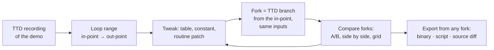

# Extended use cases: roles beyond debugging

- **Date:** 2026-09-29
- **Status:** draft for review. Companion to [use-cases.md](use-cases.md), which
  covers the core debugging roles (game, demo, reverse engineering, system,
  application, music, hardware, learning, QA / AI).
- **What this adds:** roles that debuggers usually ignore, and for each of
  them the **essential** capabilities: what they cannot work without, not
  exotic extras. Several of these roles bring new people to the project.
- **Serves:** the workbench ([workbench-framework.md](workbench-framework.md):
  timeline, monitors, scopes, presentation windows, plug-ins) and the
  knowledge base ([ZX-meta-db](../2026-09-28-zx-meta-db/concept.md)).

> **In one line.** Streamers, musicians, speedrunners, archivists,
> translators, modders, party organizers, museums and others need the same
> engine, but they judge it on output quality: A/V sync, picture fidelity on
> real displays, clean feeds, exports, reproducibility and unattended
> operation.

## Contents

- [1. How to read this document](#1-how-to-read-this-document)
- [2. The roles at a glance](#2-the-roles-at-a-glance)
- [3. Roles in detail](#3-roles-in-detail)
  - [3.1 Demo party organizer and compo operator (X-10)](#31-demo-party-organizer-and-compo-operator-x-10)
  - [3.2 Streamer and video maker (X-1)](#32-streamer-and-video-maker-x-1)
  - [3.3 Composer and chiptune musician (X-2)](#33-composer-and-chiptune-musician-x-2)
  - [3.4 Speedrunner and TAS author (X-3)](#34-speedrunner-and-tas-author-x-3)
  - [3.5 Preservationist and archivist (X-4)](#35-preservationist-and-archivist-x-4)
  - [3.6 Translator and localizer (X-5)](#36-translator-and-localizer-x-5)
  - [3.7 Modder, colorist, adapter and remaster author (X-6)](#37-modder-colorist-adapter-and-remaster-author-x-6)
  - [3.8 Level and game-design analyst (X-7)](#38-level-and-game-design-analyst-x-7)
  - [3.9 Hardware and FPGA designer, hardware student (X-8)](#39-hardware-and-fpga-designer-hardware-student-x-8)
  - [3.10 Other emulator authors (X-9)](#310-other-emulator-authors-x-9)
  - [3.11 Museum and exhibition (X-11)](#311-museum-and-exhibition-x-11)
  - [3.12 Accessibility user (X-12)](#312-accessibility-user-x-12)
  - [3.13 CTF and puzzle author (X-13)](#313-ctf-and-puzzle-author-x-13)
  - [3.14 Collaborators (X-14)](#314-collaborators-x-14)
  - [3.15 Dataset and AI builders (X-15)](#315-dataset-and-ai-builders-x-15)
  - [3.16 Conversion, unpacking and decompilation (X-16)](#316-conversion-unpacking-and-decompilation-x-16)
  - [3.17 Gamer (X-17)](#317-gamer-x-17)
  - [3.18 Animator and demo effect maker (X-18)](#318-animator-and-demo-effect-maker-x-18)
  - [3.19 Tester and CI engineer (X-19)](#319-tester-and-ci-engineer-x-19)
  - [3.20 Esports organizer, referee and caster (X-20)](#320-esports-organizer-referee-and-caster-x-20)
- [4. Scenes, transitions and control surfaces](#4-scenes-transitions-and-control-surfaces)
- [5. TTD recording editor and visualizer](#5-ttd-recording-editor-and-visualizer)
- [6. Shared capabilities these roles add](#6-shared-capabilities-these-roles-add)
- [7. Summary: essentials by capability](#7-summary-essentials-by-capability)

---

## 1. How to read this document

Each role has a short context and a table of **essentials**:

- **Need:** what the person must be able to do.
- **Why:** what goes wrong without it.
- **Today:** what unreal-ng has now (**works**, **partial**, **branch** =
  exists on an unmerged branch, **none**).
- IDs (`X10-3`) are for later requirement lists.

"Essential" means: without it the role cannot do its job with unreal-ng, or
does it visibly worse than with the tools they use now.

## 2. The roles at a glance

| ID | Role | Their measure of success | Class |
|---|---|---|---|
| X-10 | Demo party organizer, compo operator | every entry starts on time, looks and sounds right on the projector and PA, and is recorded | **Need** |
| X-1 | Streamer, video maker | a clean, synced, good-looking feed; annotated recordings | **Need** (popularity) |
| X-2 | Composer, chiptune musician | hear and export each channel exactly | **Need** |
| X-4 | Preservationist, archivist | a verified, documented, reproducible dump | **Need** |
| X-3 | Speedrunner, TAS author | deterministic input, frame-exact tools | Nice |
| X-5 | Translator, localizer | find, edit and repack all text | Nice |
| X-8 | Hardware / FPGA designer, hardware student | bus-level comparison with the real board | Nice |
| X-9 | Other emulator authors | reference traces and tests | Nice |
| X-11 | Museum, exhibition | unattended, robust attract mode | Nice |
| X-6 | Modder, colorist, adapter, remaster author | replace graphics reliably | Future |
| X-7 | Level and game-design analyst | extract levels and game state | Future |
| X-12 | Accessibility user | read and control without seeing the screen | Future |
| X-13 | CTF and puzzle author | scored, deterministic challenges | Future |
| X-14 | Collaborators | share a session and a moment | Future |
| X-15 | Dataset and AI builders | large, labeled, reproducible runs | Future |
| X-17 | Gamer | the game feels right: low input lag, the controller just works, the game's own flaws do not get in the way | **Need** (largest audience) |
| X-18 | Animator, demo effect maker | smooth, in-sync motion within the frame budget and interrupt-handler budget, no late screen writes | **Need** |
| X-19 | Tester, CI engineer | every change checked on every model automatically, with a diagnosable report | **Need** |
| X-20 | Esports organizer, referee, caster | a fair match with a good show and evidence behind every decision | Nice (a growth area) |
| X-16 | Conversion, unpacking, decompilation | programs moved between media and forms; others' analysis reused | Nice |

---

## 3. Roles in detail

### 3.1 Demo party organizer and compo operator (X-10)

**Context.** A compo runs entries one after another on a big projector and a
PA system, often also streamed. Each entry targets a specific machine
(48K, 128K, Pentagon, Scorpion, ZX-Evo / TSConf, with or without GS / TS /
TSFM). The operator has minutes to set up, the audience sees every glitch,
and the organizers need a recording of every run. Projectors add their own
video delay, cut the edges of the picture, and render colors and black levels
differently from a monitor.

**Audio and video timing**

| ID | Need | Why | Today |
|---|---|---|---|
| X10-1 | **A/V offset calibration in milliseconds**, both directions (delay audio or delay video), fine steps (1 ms), per output device | projectors add 30-150 ms of video delay; the PA adds its own; a demo synced to the beat looks broken if they disagree | **partial**: `AVSyncDelayFrames` delays video by whole frames only (≈20 ms steps); no audio delay; no per-device profile |
| X10-2 | **Calibration test signal**: a flash on screen with a click on audio at the same instant, repeating; the operator adjusts until they coincide (by eye and ear, or with a phone camera / microphone) | the only reliable way to measure the chain in the hall | **none** |
| X10-3 | **Latency readout**: the current total audio latency and video delay shown in ms | the operator must know what is applied | **partial**: audio latency is reported in the audio settings panel |
| X10-4 | **Stable 50 Hz presentation** on the hall's display: exact 50 Hz output when the display supports it, otherwise a documented, even frame cadence (no random judder) at 60 Hz; tearing off | scrollers and rasters judder visibly on a big screen | **partial**: frame clock pacing exists; no output-mode control |

**Picture on the projector**

| ID | Need | Why | Today |
|---|---|---|---|
| X10-5 | **Scaling mode**: integer scale, fit with correct 4:3 pixel aspect, stretch; choose per output | wrong aspect distorts circles and fonts; integer scaling keeps pixels sharp | **partial** (window scaling); no per-output choice |
| X10-6 | **Border and overscan presets**: none, TV-like, full (Pentagon overscan exists); plus **position and size trim** for projectors that cut edges | borders carry effects; projectors crop them | **partial**: Pentagon overscan feature; no trim |
| X10-7 | **Picture adjustments per output**: brightness, contrast, gamma, saturation, color temperature, black level (full / limited range) | projectors crush blacks and wash out colors; ZX bright/non-bright pairs become indistinguishable | **none** |
| X10-8 | **Palette choice**: measured palettes per machine (48K, Pentagon, Scorpion, ZX-Evo), and the ability to load one | the entry was made on a specific machine's colors | **partial** (palettes per model in core); no user choice |
| X10-9 | **CRT look on / off** per output | some entries are made for a CRT look; organizers decide per compo | **branch** (`crt-effects`) |
| X10-10 | **Test patterns**: geometry grid, border edges, color bars with the ZX palette, a gray ramp | setting up the projector before the compo | **none** |

**Sound on the PA**

| ID | Need | Why | Today |
|---|---|---|---|
| X10-11 | **Output device selection** and a fixed sample rate | the PA is on a specific interface | **works** (device selection, reroute handling) |
| X10-12 | **Level control with a limiter and a loudness meter**; optional normalization between entries | entries differ a lot in level; clipping on a PA is painful | **partial**: master limiter exists; no meter, no per-entry normalization |
| X10-13 | **Stereo layout per entry**: ABC, ACB, mono; GS / TS / TSFM routing | entries target a specific layout | **partial** (settings exist); not per entry |
| X10-14 | **Audio identification tones**: left, right, both | checking the PA wiring | **none** |

**Running the compo**

| ID | Need | Why | Today |
|---|---|---|---|
| X10-15 | **Compo playlist**: entries in order, each with its machine profile (model, ROM, DOS, GS / TS / TSFM, turbo, memory) and its file | switching machines by hand between entries causes mistakes | **none** |
| X10-16 | **Prepared start**: load and boot an entry to its start point in advance (autostart exists), hold on a black screen, start on one key; or start from a verified snapshot | loading a tape on stage wastes time; timing of the start matters | **partial**: autostart for TR-DOS / tape; no hold / prepared start |
| X10-17 | **Operator and audience outputs**: the projector window shows only the machine (no UI, no cursor, no notifications); the operator sees controls, meters and the next entry on the laptop screen | the audience must never see the UI | **none** (presentation window is designed in the workbench) |
| X10-18 | **Stream / capture output**: a clean feed at a fixed resolution for the streaming software | most parties stream | **partial** (window capture works; no fixed-size clean feed) |
| X10-19 | **Record every run** (video + audio, lossless or high quality), named by entry | the archive and the results | **branch** (`recording-quicksync`) |
| X10-20 | **One-key controls**: start, stop, restart entry, next entry, emergency black screen, mute | stress on stage | **none** |
| X10-21 | **Entry verification**: checksum of each file against the submitted one; a log of what ran with which settings | disputes after the compo | **none** |
| X10-22 | **Robustness**: auto-restart of the emulator on a crash with the same entry and settings; no dialogs ever on the audience output | a crash on stage | **none** |
| X10-23 | **Remote control from a phone or tablet** (companion): next / start / mute | the operator is not always at the laptop | **none** (companions designed) |
| X10-24 | **Scenes and transitions**: each entry, intro, break and results screen is a scene; switching between them is a smooth transition (see [§4](#4-scenes-transitions-and-control-surfaces)) | cuts between machines, black flashes and visible setup kill the show | **none** |
| X10-25 | **Control surfaces**: an on-screen deck on the operator monitor, a Stream Deck, and a phone / tablet companion (see [§4.4](#44-control-surfaces)) | the operator runs the show without a mouse | **none** |
| X10-26 | **Model check for an entry**: fork the entry at any moment to the candidate machines and compare clips and verdicts (TA-23); in batch for all entries before the compo | an entry made for Pentagon shown on the wrong machine is a disaster on the big screen | **none** |

### 3.2 Streamer and video maker (X-1)

**Context.** Streams games, demos or development; makes "how it works"
videos. Uses streaming software that captures windows or sources.

| ID | Need | Why | Today |
|---|---|---|---|
| X1-1 | **Clean feed window** at a fixed resolution (no UI, no cursor, no notifications) | window capture must not show the app chrome | **none** |
| X1-2 | **A/V offset** in ms for the capture path (same mechanism as X10-1) | capture adds its own delay | **partial** |
| X1-3 | **Presentation layouts**: the Wall, the program monitor with overlays, scopes, each in its own capturable window | the "look at it move" content | **none** (designed) |
| X1-4 | **Overlays with safe areas**: captions, highlights, callouts synced to events, placed inside a safe area | readable on every player | **partial** (HUD layer for notifications) |
| X1-5 | **Loudness meter and limiter** on the emulator's audio | streaming platforms normalize; clipping ruins the stream | **partial** (limiter only) |
| X1-6 | **Recording with and without overlays**, in parallel with the live feed | edit later | **branch** |
| X1-7 | **Scene / action hotkeys** and remote control (companion) | control while talking | **none** |
| X1-8 | **Pause without breaking the stream** (freeze frame or a "paused" card instead of a black window) | pauses happen | **partial** |
| X1-9 | **Scenes and transitions** between machines, layouts, looks and scripted segments ([§4](#4-scenes-transitions-and-control-surfaces)) | a stream is a sequence of scenes | **none** |
| X1-10 | **Streaming-software integration**: control from and to OBS (its WebSocket API), scene changes mirrored both ways | streamers already run OBS | **none** |
| X1-11 | **"Clip that"**: a hotkey (or a highlight detector) turns the last N seconds into a trimmed clip with overlays, ready to post | the moment happened; the stream moves on | **none** (live segment streaming, black box) |

### 3.3 Composer and chiptune musician (X-2)

**Context.** Writes AY / TS / TSFM / GS music, tests players, makes covers.

| ID | Need | Why | Today |
|---|---|---|---|
| X2-1 | **Mute and solo per channel** (AY A/B/C, noise, envelope; TS chip 2; FM; GS channels; beeper; Covox) | hearing one voice | **partial** (per-device settings; no live mute/solo per channel) |
| X2-2 | **Per-channel scopes and meters** | seeing what each voice does | **designed** (#48 oscilloscope) |
| X2-3 | **Stems export**: one WAV per channel, sample-aligned | mixing and covers | **none** |
| X2-4 | **Register dump export** (PSG, YM, VGM) | the standard formats of the chiptune world | **partial** (AY log analyzer) |
| X2-5 | **Offline render**: faster than real time, deterministic, no rate-control pitch drift | exact, repeatable exports | **none** (live path uses DRC resampling) |
| X2-6 | **Chip and clock choice**: AY vs YM, clock (1.75 / 1.7734 MHz), stereo layout | the track was written for a specific chip | **works** (settings) |
| X2-7 | **Loop a range** and **position readout** (frame, pattern, row when the player is known) | working on one section | **none** |
| X2-8 | **Capture music traffic on any combination of chips** (AY, second AY / TS, TSFM, GS / NeoGS, MoonSound OPL4, Covox / SounDrive, beeper) on one time axis (the machine clock), with the CPU writes that caused it | multi-chip music is the norm on Pentagon / ZX-Evo; correlation across chips needs one clock | **partial**: AY log analyzer, GS port trace; no multi-chip capture |
| X2-9 | **Module finder and extractor**: locate the tune data and the player in memory (PT2 / PT3 / STC / ASC / SQT / PSC and others; GS MOD with samples; MoonSound sample banks) and save the module in its native format | getting the original, editable song instead of a recording | **none** (signatures from ZX-meta-db) |
| X2-10 | **Chip-aware analysis**: PSG — tone periods to notes, envelope and noise usage, per-channel activity; FM — operators and algorithms to instrument patches; PCM — sample extraction, loop points, rates; GS — MOD commands from the mailbox, channel and sample usage | understanding and re-using a track | **none** |
| X2-11 | **Exports in the standard formats**: PSG, YM (5 / 6), AY (AYEmul), VGM (multi-chip), the native tracker file when the module is found, MOD for GS, WAV stems, MIDI transcription, and a **Furnace** project with the chips and instruments set up | continuing work in today's tools | **none** (PSG-style dumps partly via the AY log) |

### 3.4 Speedrunner and TAS author (X-3)

| ID | Need | Why | Today |
|---|---|---|---|
| X3-1 | **Frame advance** with input held per frame | frame-perfect inputs | **works** (run frames, input injection) |
| X3-2 | **Deterministic input recording and playback** (RZX import/export, TTD input journal) | reproducible runs; verification | **partial** (TTD journal; RZX interop is #27) |
| X3-3 | **Input display** on screen | viewers and verification | **none** |
| X3-4 | **RAM watch** of game values (lives, level, timer) | routing and splits | **none** in GUI |
| X3-5 | **Save states and branches** | trying alternatives | **works** (snapshots, TTD); branches designed |
| X3-6 | **Split timer driven by memory conditions** (level changed, boss byte = 0) | automatic, fair splits | **none** (a plug-in over conditions) |
| X3-7 | **Low input latency** (run-ahead) | fair real-time runs | **designed** (Look-Ahead, #56) |
| X3-8 | **Run-ahead combined with TTD**: run-ahead for latency while TTD records the real (non-speculative) timeline | low latency must not break verification | **designed** separately (#56 Look-Ahead, TTD); combination not designed |
| X3-9 | **Autosplitter integration** (LiveSplit through its server protocol; split definitions as conditions on memory) | the community standard | **none** |
| X3-10 | **Practice mode**: save points at segment starts, instant retry, TTD branches per attempt, comparison with the best attempt | practice is most of a runner's time | **partial** (snapshots, TTD) |
| X3-11 | **Lag-frame and RNG watch**: frames where the game skipped input; the RNG state (often the R register or a seed in RAM) on a timeline track | routing and luck manipulation | **none** |
| X3-12 | **Verified run package**: recording + input journal + model / settings + a hash, re-playable by a verifier | leaderboards need proof | **partial** (TTD files) |
| X3-13 | **Live verification**: a run streams signed segments to a verifier while it happens; integrity flags (state loads, speed changes, external memory changes) are raised live | leaderboards and races without after-the-fact disputes | **none** (O-27) |

### 3.5 Preservationist and archivist (X-4)

| ID | Need | Why | Today |
|---|---|---|---|
| X4-1 | **Identify a dump** by hash against known releases | is this a known good copy? | **none** (ZX-meta-db) |
| X4-2 | **Tape signal inspection**: block list, timings, errors, weak or damaged areas | verifying a tape capture | **partial** (tape analyzers, tape manager) |
| X4-3 | **Disk surface view**: sectors, CRC errors, weak bits, protection marks | verifying a disk capture | **partial** (UDI weak bits, FDC analyzers) |
| X4-4 | **Protection identification** (known schemes) | documentation | **none** (ZX-meta-db) |
| X4-5 | **Lossless export** (TZX with exact timings, CSW, UDI) | archives must not lose information | **partial** (CSW open, #18) |
| X4-6 | **Batch verification headless**: load, run to a known state, record a digest, report | thousands of files | **works** (automation), no packaged runner |
| X4-7 | **Provenance notes** attached to a recording (source, capture hardware, who) | archival standard | **none** |
| X4-8 | **Signature cataloging of everything** with ZX-meta-db: files, routines, loaders, compressors, graphics, music, texts | an archive is only useful when it is indexed | **none** |
| X4-9 | **Melody recognition** ("Shazam" for AY / GS music): fingerprints of register streams and of audio, matched against the database | identifying the tune, its author and its reuse | **none** |
| X4-10 | **Screenshot recognition**: loading screens and in-game frames matched by perceptual hash | identifying a title from a picture or a video | **none** |
| X4-11 | **Fuzzy search by description** ("a platform game with a penguin on ice, 1987, green loading screen") | people remember games vaguely | **none** |
| X4-12 | **Similarity, lineage and recommendation graphs**: shared code, engines, music, graphics; conversions, clones, sequels, remakes | research, and later links to modern game catalogs and stores | **none** |

### 3.6 Translator and localizer (X-5)

| ID | Need | Why | Today |
|---|---|---|---|
| X5-1 | **Text search in any encoding**, including unknown ones (delta search) | games use custom character sets | **none** |
| X5-2 | **Font finder and viewer** with automatic layout | the font must be edited or extended (Cyrillic) | **none** |
| X5-3 | **Character map editor**: define the game's encoding, then view memory as text | reading and writing strings | **none** |
| X5-4 | **String table view**: all strings with addresses, lengths, pointers to them | planning the translation | **none** |
| X5-5 | **In-place edit with length and pointer checks** | a longer string breaks the game | **none** |
| X5-6 | **Patch export** (a patched file: TAP / TZX / TRD rebuilt, or a patch format) | distributing the translation | **none** |
| X5-7 | **Export / import strings** (CSV) | working in a translation tool | **none** |
| X5-8 | **Shared translation projects** in the community script base (§3.7 X6-7): per-title string tables, reviews, approvals, cloud-tested patches | many people translate the same titles | **none** |

### 3.7 Modder, colorist, adapter and remaster author (X-6)

| ID | Need | Why | Today |
|---|---|---|---|
| X6-1 | **Graphics finder with automatic layout** | locating sprites, tiles, fonts | **none** (Analyzer) |
| X6-2 | **Export / import graphics as images** (PNG) with round-trip back into memory | editing in normal tools | **none** |
| X6-3 | **Replacement packs** applied at render time, identified by title hash, versioned | HD / colorized versions without changing the program | **designed** (Metadata Manager packs, #56) |
| X6-4 | **Live preview** of a replacement while the game runs | iteration | **none** |
| X6-5 | **Specialized analyzers**: attribute-clash map and colorization candidates, sprite mask detection, font and tile set detection, text and pointer tables, level data, music data | every conversion job starts with finding the data | **none** (Analyzer, ZX-meta-db) |
| X6-6 | **Adaptation checks**: does the patched program still run on each model, with each DOS, with fast loading on and off | adaptations for Pentagon, TR-DOS, GS and other machines | **partial** (automation, matrix runs) |
| X6-7 | **Community script base**: translation, colorization, adaptation and analysis scripts (Lua / Python) in a GitHub repository, with a manager in the app (browse, install, update), **voting, reviews and approvals**, and **cloud testing** (CI runs each script headless against the titles it claims to support) | quality and trust at scale | **none** |

### 3.8 Level and game-design analyst (X-7)

| ID | Need | Why | Today |
|---|---|---|---|
| X7-1 | **Level / map export** as images, for engines with known layouts | studying and documenting games | **none** (ZX-meta-db layouts + plug-ins) |
| X7-2 | **Game-state tracks** on the timeline (score, lives, level, position) | analyzing balance and pacing | **none** (plug-in tracks) |
| X7-3 | **Struct overlays** for game data (enemy tables, level records) | reading data without hex | **designed** (struct DSL, NedoOS docs) |

### 3.9 Hardware and FPGA designer, hardware student (X-8)

| ID | Need | Why | Today |
|---|---|---|---|
| X8-1 | **Bus-level trace export as VCD** (address, data, MREQ, IORQ, RD, WR, M1, INT, WAIT) | comparison in logic-analyzer tools (PulseView, GTKWave) and against HDL simulation | **none** |
| X8-2 | **Deterministic power-on state** matching the board (memory fill pattern, register reset values) | first-divergence comparisons start equal | **partial** |
| X8-3 | **Per-T-state comparison** against a captured trace, reporting the first mismatch | finding the timing bug | **none** |
| X8-4 | **Port decode view**: which device answered which port, with the decode rule | clone bring-up | **partial** (port trace, port diag recorder) |
| X8-5 | **Configurable timing parameters** (contention pattern, INT position and length) for experiments | matching a board revision | **partial** (model configs) |
| X8-6 | **Waveform view** inside the workbench: bus signals, INT, WAIT, ULA / video timing, port strobes, over a T-state axis with zoom (the logic-analyzer view) | learning and debugging timing without external tools | **none** |
| X8-7 | **Bus-activity triggers**, logic-analyzer style: pattern (address / data / control masks), edge, sequence (A then B within N T-states), count; pre- and post-trigger capture | catching one bad cycle among millions | **none** (breakpoints are instruction-level) |
| X8-8 | **Protocol decoders** on emulated buses: SPI (SD card), I2C (RTC, EEPROM), PS/2, UART, the GS mailbox | reading device conversations | **partial** (device reports) |
| X8-9 | **Virtual instruments**: an oscilloscope on analog-like signals (EAR / MIC tape levels, beeper, AY outputs, DAC outputs, composite-like video line), a frequency counter, a spectrum analyzer | the hardware student's bench, without the hardware | **partial** (sound oscilloscope designed, #48) |
| X8-10 | **Hardware-behavior analyzers**: contention per access, floating bus reads, INT length and acknowledge, port decode conflicts, shown with the rule that produced them | learning why the machine behaves as it does | **none** |

### 3.10 Other emulator authors (X-9)

| ID | Need | Why | Today |
|---|---|---|---|
| X9-1 | **Reference traces in a documented format** (and in other emulators' formats) | differential testing of their emulator | **none** |
| X9-2 | **Test corpus with expected digests** per model | regression suites | **partial** (in our test tree) |
| X9-3 | **Documented model decisions** (timings, contention, quirks) with evidence | knowing what "correct" means | **partial** (design docs) |

### 3.11 Museum and exhibition (X-11)

| ID | Need | Why | Today |
|---|---|---|---|
| X11-1 | **Kiosk mode**: fullscreen, no UI, locked settings, no dialogs | visitors must not break it | **none** |
| X11-2 | **Attract loop**: playlist of games / demos / recordings, with the Wall and scopes between them | an exhibit runs all day | **none** |
| X11-3 | **Unattended robustness**: restart on crash or hang, return to attract after idle | nobody is watching | **none** |
| X11-4 | **Simple controls**: joystick or touch, a big "back" action | visitors of all ages | **partial** (joystick input) |
| X11-5 | **Captions**: what is shown, what the hardware does | the educational point of the exhibit | **none** (overlays) |

### 3.12 Accessibility user (X-12)

| ID | Need | Why | Today |
|---|---|---|---|
| X12-1 | **Screen text as text**: the emulated screen read out through the OS screen reader (OCR of the ZX screen) | playing text games and using BASIC without seeing | **partial** (screen OCR analyzer on automation) |
| X12-2 | **The debugger itself accessible**: keyboard-complete, screen-reader labels, scalable fonts, high contrast | blind and low-vision developers | **partial** (Qt accessibility; not reviewed) |
| X12-3 | **Audio cues** for events (breakpoint hit, load finished) | non-visual feedback | **none** |

### 3.13 CTF and puzzle author (X-13)

| ID | Need | Why | Today |
|---|---|---|---|
| X13-1 | **Headless challenge runner**: load, feed input, check a condition, return pass / fail | scoring | **partial** (automation; no packaged runner) |
| X13-2 | **Determinism and time limits** | fair scoring | **partial** |
| X13-3 | **Participant view without the answer**: restricted debugger features per challenge | the challenge design | **none** |

### 3.14 Collaborators (X-14)

| ID | Need | Why | Today |
|---|---|---|---|
| X14-1 | **Shared session**: one drives, others watch (read-only) through the protocol | pair debugging, teaching | **none** |
| X14-2 | **Moment links**: a recording plus a frame or bookmark, opened directly | "look at this" in a bug report | **partial** (TTD files and bookmarks) |
| X14-3 | **Annotations** exported with the recording | context for the next person | **none** |

### 3.15 Dataset and AI builders (X-15)

| ID | Need | Why | Today |
|---|---|---|---|
| X15-1 | **Headless batch runs** at high throughput, several instances | large corpora | **works** (multi-instance automation) |
| X15-2 | **Stable schemas** for traces, digests and events | datasets outlive versions | **partial** |
| X15-3 | **Provenance** of every record (emulator version, model, settings) | reproducibility | **partial** |

### 3.16 Conversion, unpacking and decompilation (X-16)

**Context.** Archivists, reverse engineers, adapters and translators all need
to move programs between media and forms, and to start from someone else's
analysis instead of from zero.

| ID | Need | Why | Today |
|---|---|---|---|
| X16-1 | **Conversion recipes**: tape → disk (TR-DOS, +3), disk → tape, tape / disk → snapshot at a chosen point, snapshot → tape / disk loader, TZX ↔ CSW / TAP where lossless, with a verification run after each | adapting software to machines and media | **partial** (loaders and savers; recipes in `.recipe/` for loading only) |
| X16-2 | **Unpackers**: detect the compressor, run or emulate its unpacker, save the unpacked block with its load address | most software is packed | **none** (signatures from ZX-meta-db) |
| X16-3 | **Decompilers**: BASIC detokenizer (exists), compiled-BASIC recognizers (the common BASIC compilers), data-structure recovery, and Z80 to annotated source | reading programs at the level they were written | **partial** (BASIC extractor) |
| X16-4 | **Library of annotated reverse-engineering projects**: disassemblies with labels, comments and data maps (SkoolKit-style and our own `docs/disasm/`), loadable into the Analyzer and linked from ZX-meta-db | standing on others' work | **partial** (our own disassemblies in the tree) |

### 3.17 Gamer (X-17)

**Context.** The largest audience: people who play. They judge an emulator by
how the game *feels*: response to the controls, the controller in their
hands, and whether the game's own old flaws get in the way. The latency study
([input latency and Game Mode](../2026-09-24-core-performance/unreal-ng-input-latency-and-game-mode.md))
measured about 63 ms end to end and proposes instrumentation, a test program,
Game Mode and run-ahead.

**Input lag: measure it, show it, reduce it**

| ID | Need | Why | Today |
|---|---|---|---|
| X17-1 | **Built-in input-lag measurement**: host key or button event → the emulated machine reads it → the first frame that shows the reaction → presented on the display; per-stage timestamps and a total, shown in ms | players and reviewers compare emulators by this number | **designed** (latency study §3: stage timestamps and a test program) |
| X17-2 | **External measurement mode**: a test program flashes the screen and clicks on a key press, for a phone slow-motion camera or a light sensor; the app records its own timestamps for comparison | the display and the controller add latency the app cannot see | **designed** (test program in the latency study) |
| X17-3 | **Latency HUD**: the current input-to-photon estimate and the frame-time graph, on demand | tuning settings with feedback | **none** |
| X17-4 | **Game Mode**: lower audio buffer, pacing tuned for latency, presentation without extra queued frames | the biggest reductions come from the output path | **designed** (latency study §5-§6) |
| X17-5 | **Run-ahead** (1-2 frames), per game | removes the game's own frame of lag | **designed** (latency study §7, Look-Ahead #56) |

**Controllers and mapping**

| ID | Need | Why | Today |
|---|---|---|---|
| X17-6 | **Host gamepad support**: standard controllers recognized with a controller database, hot-plug, several players | most players use a gamepad | **none** (the emulated Kempston port exists; no host gamepad input) |
| X17-7 | **Mapping to every Spectrum interface**: Kempston, Sinclair 1 / 2 (keys 6-0 and 1-5), Cursor / Protek / AGF, Fuller; and to **any keys** (games with fixed keys) | each game supports different joysticks | **partial** (Kempston joystick port; keyboard only for the rest) |
| X17-8 | **Per-game profiles**, chosen automatically when the title is identified (ZX-meta-db), editable and shareable | nobody wants to remap every game | **none** |
| X17-9 | **Redefine-keys helper**: when a game asks "press key for LEFT", the helper presses the mapped key for each prompt in turn | many games only work with their own redefine menu | **none** (the command typer can press keys; prompt detection is new) |
| X17-10 | **Extra buttons**: several Spectrum keys on one button (fire + space), autofire with a rate, a button for pause / menu / rewind | one-button joysticks and keyboard-heavy games | **none** |

**Intelligent compensation: controllers**

| ID | Need | Why | Today |
|---|---|---|---|
| X17-11 | **Analog stick to digital** with a configurable dead zone and **diagonal tolerance** (8-way with wider diagonals, or 4-way for games that break on diagonals) | modern sticks are analog and noisy | **none** |
| X17-12 | **Debounce and noise filtering** for worn or cheap controllers and for real Kempston interfaces over USB adapters | double inputs and jitter | **none** |
| X17-13 | **Hold until read**: a short press is held until the game has actually polled the key or port at least once | games that poll once per frame (or less) miss short taps; the classic "the emulator ate my input" | **none** (TTD input journal applies input at instruction boundaries; the polling watch is new) |
| X17-14 | **Opposite-direction rule** (left + right, up + down): last wins, first wins, or neutral | some games break when both are pressed | **none** |

**Intelligent compensation: the games' own flaws**

| ID | Need | Why | Today |
|---|---|---|---|
| X17-15 | **Flicker reduction** for games that multiplex sprites | flicker is tiring on modern displays | **designed** (ZX DLSS de-flicker, #56) |
| X17-16 | **Slowdown removal** (optional): run the CPU faster only while the game is behind its frame | busy scenes crawl on the real machine | **partial** (turbo exists; adaptive turbo is new) |
| X17-17 | **Save anywhere, rewind, pause** for games that have none; rewind a few seconds after a mistake | quality of life expected from any emulator | **works** (snapshots, TTD); rewind button UX is new |
| X17-18 | **Colorization and attribute-clash reduction** as opt-in visual packs | modern taste; accessibility | **designed** (metadata packs, #56) |
| X17-19 | **Loading without waiting**: instant or fast loading, with the loading screen kept on screen for a moment | modern players will not wait five minutes | **works** (fast tape / disk loading) |
| X17-20 | **Known-issue fixes per title** from ZX-meta-db: the right model, required peripherals, POKEs that fix bugs, recommended settings | many titles need a specific setup to run correctly | **none** |

### 3.18 Animator and demo effect maker (X-18)

**Context.** The effect side of demo making, deeper than the demo coder of
[use-cases.md](use-cases.md#32-demo-coder-dm): tuning timings until motion
is smooth and in sync with the music, shaping the tables that drive motion
and color, profiling where each frame's T-states go, and balancing the
routines that push data to the screen against the beam. The work is
iterative: change a number, look, change again.

**Timing and sync**

| ID | Need | Why | Today |
|---|---|---|---|
| X18-1 | **Music-synced timeline**: pattern / row positions of the known player (or beat marks set by hand) as a track, next to part changes and effect events | effects are cut to the music | **none** (timeline designed; player recognition from ZX-meta-db) |
| X18-2 | **Live tweak of constants**: bind a memory byte or word (a delay, a speed, a phase) to a slider or a dial (on screen or on a Stream Deck +); the running demo changes at once; write the final value back to the source | the fastest tuning loop there is | **partial** (memory writes on automation; no slider binding, no write-back) |
| X18-3 | **Per-part frame budgets**: how many frames each part takes, where the part boundaries are, the total against the music length | demos must end with the music | **none** |
| X18-4 | **Multi-model timing check**: the same part on 48K, 128K and Pentagon frame lengths, with differences highlighted | an effect tuned for Pentagon drifts on 128K | **partial** (instances; no comparison view) |

**Tables that drive motion and color**

| ID | Need | Why | Today |
|---|---|---|---|
| X18-5 | **Table views as curves**: a memory range shown as a graph (bytes, words, signed or unsigned), several tables overlaid; color tables shown as color ramps | a sine or easing table is judged by its shape, not its hex | **none** |
| X18-6 | **Edit tables by drawing** or by a **formula** (Lua / Python: sine, easing, noise, palette ramps), applied live | fixing a bump in a curve or regenerating it with other parameters | **none** |
| X18-7 | **Export tables** as `DB` / `DW` source lines (sjasmplus and other assemblers) or binary | the fix must end up in the source | **none** |
| X18-8 | **Find the tables**: which memory ranges the effect reads as tables (read-only data indexed by a counter) | old or someone else's effects | **none** (provenance and code/data map in the Analyzer) |

**Profiling and optimization**

| ID | Need | Why | Today |
|---|---|---|---|
| X18-9 | **Per-frame flame chart**: routines by T-states inside each frame, with the beam line where each started and ended | seeing what eats the frame | **partial** (call trace, opcode profiler on automation) |
| X18-10 | **Wasted time**: T-states spent in HALT, idle waits and busy loops per frame; contention cost per routine | the budget that can be reclaimed | **none** |
| X18-11 | **Cycle-exact view of a routine**: T-states per instruction including contention on this model, totals for a selection, taken / not-taken paths | micro-optimization | **partial** (static T-states in the disassembler) |
| X18-12 | **A/B comparison**: two versions of a routine run on the same input (TTD branches), with T-states per frame and screen digests compared | proof that the faster version is also correct | **none** (branches designed) |
| X18-13 | **Optimization hints**: known faster equivalents (for example `LDI` chains, `PUSH`-based fills, unrolled loops), unroll-vs-loop cost for the actual counts, contention-aware reordering | common tricks, applied with numbers | **none** |

**Budget indicators: frame and interrupt handler**

| ID | Need | Why | Today |
|---|---|---|---|
| X18-21 | **Frame budget meter**, always visible (status bar, HUD, a timeline track): T-states used of the frame (69 888 on 48K, 70 908 on 128K, 71 680 on Pentagon), headroom, and the split main loop / interrupt handler / waiting | the demo coder's fuel gauge | **none** |
| X18-22 | **Overrun warning**: a frame whose work did not finish before the next interrupt (a dropped or doubled frame), marked on the timeline with the routine that was running | overruns cause stutter that is hard to catch by eye | **none** |
| X18-23 | **Interrupt handler duration** per frame: T-states from interrupt acceptance to the return (`RETI` / `RET` / `EI` + `RET`), with minimum, maximum, average and a per-frame history | music players and effect drivers live in the handler; its length decides what is left for the main loop | **none** (call trace and T-state counters exist; no handler measurement) |
| X18-24 | **Interrupt timing detail**: acceptance latency (the instruction in progress delays it; a `HALT` makes it exact), jitter of the entry point in T-states, where in the frame (beam line) the handler runs, whether it overlapped the next interrupt or an interrupt was missed (interrupts disabled across the pulse) | effects synchronized to the interrupt depend on exact entry timing | **partial** (interrupt position and length are configured per model; no per-frame measurement) |
| X18-25 | **Budgets per part and per routine**, set by the author (for example "music ≤ 4 000 T", "scroller ≤ 20 000 T") and checked every frame, with the worst frame recorded | keeping a demo within limits as it grows | **designed** in spirit (`@budget` annotations, devtools §13.5) |

**Balancing screen output against the beam**

| ID | Need | Why | Today |
|---|---|---|---|
| X18-14 | **Race-the-beam plot**: every screen write placed at (screen line written, beam line at that moment); writes that land after the beam has passed that line are marked as **late** (visible tearing) | the central question of every screen-push routine | **none** (screen writes and beam position exist separately) |
| X18-15 | **Safe window per line**: for each screen line, the T-state window in which a write shows this frame vs next frame, drawn under the plot | planning the order of pushes | **none** |
| X18-16 | **Double-buffer timing**: when the shadow screen is switched (#7FFD on 128K and clones) relative to the frame, and how much was drawn into each buffer | smooth animation without tearing | **none** |
| X18-17 | **Work spreading**: bytes pushed per frame, per part, and the split of a big update across several frames; the frame where the budget overflows | balancing load between frames | **none** |
| X18-18 | **Multicolor and attribute deadlines**: per line, when attributes must be written for the effect to show, and whether the routine met them | multicolor effects break by one T-state | **partial** (beam tools; no deadline check) |

**Effect looper: loop, fork, export**

The tuning loop above, made repeatable. A time range of the recorded session
plays in a loop; every change creates a fork (a TTD branch that starts at the
loop's in-point with the same inputs); forks are compared and the chosen
result goes back to the source.

| ID | Need | Why | Today |
|---|---|---|---|
| X18-26 | **Loop a range by time marks**: set in / out points on the timeline (frames, or music rows); playback returns to the in-point through TTD at the out-point, seamlessly, with sound | watching the same few seconds a hundred times while tuning | **partial** (TTD seek; no loop playback) |
| X18-27 | **Changes apply from the in-point**: a tweak made while looping is applied to the machine state at the in-point and replayed with the recorded input, so every pass shows the effect of the change from the start of the range | a change applied mid-loop mixes old and new behavior | **partial** (edits are journaled; replay from a checkpoint exists; the loop orchestration is new) |
| X18-28 | **Fork on change**: each set of changes becomes a named fork (a TTD branch from the in-point); forks are kept, tagged, renamed, deleted; the original is never lost | trying several versions without losing the good one | **designed** (TTD branches, what-if timelines) |
| X18-29 | **Compare forks**: toggle A/B at the same frame, side by side in two monitors, a grid of several forks playing in sync, with frame-budget and screen-digest differences listed | choosing the best version by eye and by numbers | **none** |
| X18-30 | **What a fork contains, as a list**: every changed byte range (tables, constants, patched instructions) against the original, with its source location when symbols / SLD are loaded | knowing exactly what to take back | **none** |
| X18-31 | **Export from any fork**: (a) changed ranges or whole tables as **binary** files; (b) through an **exporter script** (Lua / Python: generate `DB` / `DW` lines, compressed data, a formula's parameters); (c) as a **source diff** — a patch against the assembler source (changed `DB` / `DW` lines, `EQU` constants, patched instructions), mapped through SLD, ready to apply | the tuning result must end up in the project, in the form the project keeps it | **none** |
| X18-32 | **Promote a fork**: make a fork the new main line of the session (and optionally apply its source diff and rebuild with hot reload) | closing the loop | **none** (hot reload and branches designed) |
| X18-33 | **Model what-if from the timeline**: when timings look wrong, pause, rewind, open the moment on other machines and compare clips with timing overlays (TA-23) | multi-model effects are tuned by comparison, not by memory | **none** |

**Animation**

| ID | Need | Why | Today |
|---|---|---|---|
| X18-19 | **Frame-by-frame review** with onion skin (previous frames faint), speed control, loop a range | judging motion | **partial** (TTD frame stepping) |
| X18-20 | **Sprite / frame sequence viewer**: animation frames found in memory played as a loop at the game's rate | checking an animation without running the whole part | **none** (graphics browser with automatic layout) |

### 3.19 Tester and CI engineer (X-19)

**Context.** Game developers who want regression safety, and testers who
check software (games, demos, OS builds, the emulator itself) automatically,
on every model, on every change. Builds on GD-6, GD-7 and QA-1 of
[use-cases.md](use-cases.md#39-tester-ci-ai-agent-qa--ai), which name the
needs; this section lists the essentials to deliver them.

**Parallel runs on several models, synchronized by frame**

| ID | Need | Why | Today |
|---|---|---|---|
| X19-1 | **Run one program on several models at once** (48K, 128K, +2A/+3, Pentagon, Scorpion, ATM, ZX-Evo …) as parallel instances from one command | the same build must work everywhere | **partial**: several instances through automation; no group run |
| X19-2 | **Forced frame synchronization**: the instances advance in lockstep, one frame at a time (frames differ in length between models; the unit is the frame, or an interrupt count, or a game event such as "level started"); the same input journal is applied to every instance at the same frame | differences must come from the machine, not from timing drift of the test | **none** (per-instance frame stepping exists) |
| X19-3 | **Alignment points**: resynchronize the group on a condition (screen matches, memory value, a port write) so that a loader that is longer on one model does not shift the whole comparison | loading and boot differ in length by design | **none** |
| X19-4 | **Diffs between instances**: screen (per pixel, per attribute cell, perceptual threshold), memory (ranges, pages), registers and device state, audio (per channel), with the **first diverging frame** reported and a side-by-side view | "where does the Scorpion version break" in one answer | **none** (screen digests exist; no diff) |
| X19-5 | **Diffs against a golden reference**: recorded screens, digests or TTD recordings from a known-good run | regression testing across builds | **partial** (digests; no managed golden store) |

**Automation wrappers for tests**

| ID | Need | Why | Today |
|---|---|---|---|
| X19-6 | **A Python test library** (and a pytest plug-in): start instances, load media, type, press keys, wait for a condition, read memory, assert screen text (OCR) or screen regions, capture artifacts; clean teardown | tests must be short and readable | **partial**: Python bindings and WebAPI exist; no test library |
| X19-7 | **Wait primitives with timeouts** in emulated time: wait for frames, for a screen state, for a memory condition, for a port write, for the ROM editor to be idle | the most common cause of flaky tests is waiting on wall-clock time | **partial** (run frames, command typer outcomes) |
| X19-8 | **Fixtures**: prepared machine states (snapshots, TTD checkpoints) to start tests from, identified by name and hash | fast tests that skip the boot | **partial** (snapshots) |
| X19-9 | **The same tests from Lua and the CLI** for people who do not use Python | parity rule | **partial** |

**Unit and integration test harness**

| ID | Need | Why | Today |
|---|---|---|---|
| X19-10 | **Unit tests for Z80 routines**: set registers and memory, call a routine (by label from the symbols), stop at its return, assert registers, memory, flags, **T-state budget** and "did not touch memory outside X" | testing assembler code like any other code | **none** (DeZog has this idea; devtools §13.4 designs it) |
| X19-11 | **Test annotations in source**: assertions and budgets written next to the code (like DeZog's `ASSERTION`) and checked by the harness | tests that live with the code | **designed** (source triggers, devtools #51) |
| X19-12 | **Integration tests**: boot a program, play a scripted input, reach a state, assert; run on a model matrix | the whole program, not only routines | **partial** (automation can do it by hand) |
| X19-13 | **Coverage** of the tested code (executed / not executed, by source line with SLD) | knowing what the tests miss | **partial** (coverage exists by address) |
| X19-14 | **Deterministic mode**: same inputs, same results, bit for bit, on every host | tests must not flake | **partial** (TTD determinism work, #40 Phase 3) |

**CI / CD**

| ID | Need | Why | Today |
|---|---|---|---|
| X19-15 | **Headless runner binary** with exit codes, no GUI dependency, runnable in containers | CI machines have no display | **partial** (headless automation; no dedicated runner) |
| X19-16 | **Container images** (Linux; Windows cross-build images exist for building) | reproducible CI environments | **partial** (`docker/windows` build images, untracked) |
| X19-17 | **CI integration**: a ready GitHub Actions action (and a documented recipe for other CI systems) | adoption by game projects | **none** |
| X19-18 | **Reports**: JUnit XML and TAP, a summary with the model matrix | CI systems read these formats | **none** |
| X19-19 | **Artifacts on failure**: screenshots, the diff images, the TTD recording of the failing run (openable in the workbench at the failing frame), logs | a red test must be diagnosable without re-running | **none** |
| X19-20 | **Parallelism and sharding** across instances and machines; **flake detection** (automatic re-run, flaky tests reported separately) | large suites in minutes | **none** for user tests (the emulator's own test suite is sharded) |
| X19-21 | **Release gates**: a build is published only when the matrix passes; build artifacts (TAP, TZX, TRD, SNA) produced and verified by the pipeline | CD for Spectrum software | **none** |
| X19-21a | **Black-box recorder**: a rolling buffer of the last minutes during manual testing; on a crash, hang or bug hotkey it becomes a clip plus offline analysis (anomalies, crash dossier) attached to a bug report | the bug that cannot be reproduced is already recorded | **none** ([ttd-offline-analysis](ttd-offline-analysis.md) O-25) |
| X19-21b | **Playtest analytics**: many testers' sessions stream segments into aggregations (where players die or get stuck, time per level, code never reached) | tuning difficulty and finding dead code with real players | **none** (O-28) |

**OS CI: NedoOS kernel changes**

System programmers change the kernel, drivers and shell; every change can
break any application on any machine. OS awareness (processes, pages per
process, system calls; devtools #51, NedoOS documents) and the media manager
(#58: SD, IDE and host folders as volumes) are the foundations.

| ID | Need | Why | Today |
|---|---|---|---|
| X19-22 | **Boot matrix**: the new kernel build booted on every machine the OS supports (ZX-Evo BaseConf and TSConf, ATM Turbo, Pentagon and other clones as supported), with every storage variant (SD image, IDE image, host folder), to the shell prompt, with boot time recorded | a kernel change breaks one machine or one driver first | **partial** (models and SD exist; IDE and host folders are #13a / #58) |
| X19-23 | **Kernel test suite**: system-call tests run inside the emulated OS (a test application that exercises calls and prints results), collected through the protocol | testing the API the applications depend on | **none** |
| X19-24 | **Stress and soak runs**: many processes, memory pressure, file-system load, long runs in fast-forwarded emulated time; scheduler fairness and memory-map consistency checked by the OS-aware views | bugs that show after hours | **none** |
| X19-25 | **Application compatibility suite**: a set of known applications started, driven and checked after each kernel change | the kernel is judged by the applications | **none** |
| X19-26 | **Crash capture**: a kernel crash or hang stops the run and saves a crash dossier (last system calls, process, page map, last writes to the crashed code) plus the TTD recording | diagnosing without reproducing | **designed** (crash dossier, devtools §13.6) |
| X19-27 | **Automatic bisection**: find the first commit that broke a test by building and running the history | the fastest way from red to cause | **none** |

**Application CI: certification, fuzzing, memory checks, profiling**

For application developers (NedoOS, TR-DOS, CP/M programs). These checks run
the application inside the emulator with OS awareness, so they see what the
application does to the system, not only what it shows.

| ID | Need | Why | Today |
|---|---|---|---|
| X19-28 | **Certification run**: an automated checklist producing a report (and a badge for a catalog): runs on every supported model and configuration; uses only documented system calls; stays inside its own pages; returns memory and handles on exit; restores paging and interrupt state; works without optional peripherals; start-up and exit time within limits | users and catalogs need to know an application is well behaved | **none** |
| X19-29 | **Input fuzzing**: random and structured keyboard / mouse input, from saved states, many instances in parallel, crashes and hangs saved with their TTD recording and the minimal input that reproduces them | finding crashes nobody thought of | **none** |
| X19-30 | **File fuzzing**: mutated versions of the files the application opens (documents, images, modules) fed through the file system | parsers of old formats crash on bad files | **none** (host folders #58 make it easy) |
| X19-31 | **Fault injection**: system calls that return errors on demand (disk full, read error, file missing, out of memory), device absent or slow | error paths are never tested by hand | **none** |
| X19-32 | **Coverage-guided fuzzing**: coverage from the emulator (executed addresses, per source line with SLD) steers the fuzzer to new code | fuzzing that reaches deep code | **partial** (coverage exists) |
| X19-33 | **Memory checker ("valgrind style")**: reads of memory never written (from access stamps), writes outside the application's pages or its allocated blocks, stack overflow and underflow, use after free (allocator-aware), execution of data or of overwritten code, ports used behind the OS's back, interrupts left disabled; each report with the instruction, the call stack and the TTD moment | memory bugs are the main bug class in assembler | **none** (access tracking exists; the checker rules and OS allocator awareness are new) |
| X19-34 | **Leak check at exit**: memory blocks, file handles, pages and interrupt handlers still owned when the application ends | leaks break the next application | **none** |
| X19-35 | **Profiling**: time per routine and per source line, time in system calls and I/O waits, the application's CPU share under the scheduler; **performance regression thresholds** in CI | slow applications on a multitasking OS | **partial** (profilers exist; OS-aware attribution is new) |

### 3.20 Esports organizer, referee and caster (X-20)

**Context.** Competitions on Spectrum games: speedrun races, high-score
tournaments, online leagues, events at demo parties. Organizers need fair
play and a good show; referees need evidence; casters need replays while the
match goes on. The technical base is live segment streaming
([ttd-offline-analysis §6a](ttd-offline-analysis.md#6a-live-segment-streaming-from-offline-to-near-live)).

| ID | Need | Why | Today |
|---|---|---|---|
| X20-1 | **Auto-replay of highlights**: detectors (deaths, near misses, boss kills, level completions, score spikes, record splits) queue moments while the match runs; the caster plays them as instant replays | the show | **none** |
| X20-2 | **Instant replay output**: a scene source that plays a queued moment with slow motion, freeze, input display, RAM watch and other overlays, then returns to live | casting | **none** (scenes designed) |
| X20-3 | **Suspicious-moment queue**: flagged moments (memory changes not caused by the game, superhuman input patterns, speed changes, state discontinuities, debugger edits) with evidence and a replayable clip | fair play | **none** |
| X20-4 | **Referee console**: all players' sessions, their integrity status, the flag queue, verification of a session's hash chain and build signature | decisions with evidence | **none** |
| X20-5 | **Race replays**: players' sessions aligned at splits, replayed side by side from the same moment | the most watched kind of replay | **none** |
| X20-6 | **Controlled environment**: locked settings (model, ROM, speed, input devices), debugger disabled or every use recorded, signed builds | rules must be enforceable | **partial** (TTD locks accelerations while recording) |
| X20-7 | **Results and archive**: final times and scores taken from memory conditions, every session archived with its recording | results people can check later | **none** |

---

## 4. Scenes, transitions and control surfaces

Streamers (X-1), party organizers (X-10) and museums (X-11) run **shows**: a
sequence of looks, machines and segments. The workbench borrows the vision
mixer's model: a **preview** scene is prepared while the **program** scene is
on air; a transition moves one into the other.

### 4.1 What a scene can contain

| Layer | Examples |
|---|---|
| **Sources** | one or several emulator instances of different models (a 48K and a ZX-Evo side by side); TTD recordings played back; still images; the Wall; scopes |
| **Viewport** | crop, zoom and pan per source; border mode; aspect; integer / fitted scaling; position on the output |
| **Look** | CRT effect preset; palette; gamma, brightness, contrast, saturation, color temperature, black level; scaling filters (nearest, polyphase / Lanczos, sharp-bilinear, scanline filters) |
| **Audio** | per-source mix, per-chip channel mutes, stereo layout, level, limiter; ducking under a voice or music bed |
| **Overlays** | captions, lower thirds, entry info (title, author, platform), countdowns, logos, beam / event overlays |
| **Script** | a Lua / Python timeline: timed actions (load, start, type, wait for a condition), animated overlays, camera moves over the viewport, triggers on machine events (the demo reached its end part) |
| **Machine setup** | model, ROM, DOS, peripherals, the entry to load and how far to run before going on air (the prepared start) |

### 4.2 Transitions

| Kind | Notes |
|---|---|
| Cut, crossfade, dip to black / white | the basics |
| Wipes and pushes | directional, with a soft edge |
| Zoom / pan | move the viewport into the next scene |
| CRT power-off / power-on, channel switch, glitch | period-style transitions |
| **Audio crossfade** | always paired with the picture, with its own curve and length |

Every transition has a duration and a curve, runs at the output frame rate,
and never stalls emulation of the sources (sources keep running; only the
compositor blends).

### 4.3 Scene control

- **Preview / program** with a take button and a T-bar (manual transition).
- **Scene lists** (a compo, a stream rundown, a museum loop) with auto-advance
  on time, on a machine event, or on the operator's key.
- **Presets** are files: shareable, versioned, loadable from the command line.
- Scene changes are also commands on the protocol (automation, companion,
  OBS).

### 4.4 Control surfaces

| Surface | What it offers | Transport |
|---|---|---|
| **On-screen deck** | a toolbar window on a second monitor in the style of a Stream Deck: a grid of large buttons with live thumbnails and state (on air, armed, next), pages per show, dials drawn on screen | local |
| **Elgato Stream Deck** family | buttons with images and state; **the models with dials and a touch strip** (Stream Deck +) for levels, transition time, T-bar, scrubbing; pedals for hands-free take | USB (through its SDK / plug-in) |
| **Phone and tablet companions** (iOS, iPadOS, Android; Windows tablet) | the same deck, plus meters, preview thumbnails, a T-bar, a jog wheel for the timeline | Wi-Fi (discovery on the local network), Bluetooth, USB |
| **Streaming software** | OBS scene changes both ways | OBS WebSocket API |
| **Keyboard and MIDI controllers** | hotkeys; a generic MIDI mapping for faders and pads (many operators own one) | local |

All surfaces drive the same scene commands; a surface only maps buttons and
dials to commands, so a new surface is a small adapter.

---

## 5. TTD recording editor and visualizer

A TTD recording is the raw material of many roles: a bug report, a CI failure
artifact (X19-19), the effect looper's source (X18-26), a verified run
(X3-12), an archivist's evidence (X-4), a streamer's clip (X-1), a moment link
(X-14). Recordings are long and large; people need to cut them to the part
that matters and hand that part on as a self-contained file.

### 5.1 What the editor does

| ID | Need | Why | Today |
|---|---|---|---|
| TE-1 | **Timecodes** shown and typed in several forms: frame number; frame + scanline + T-state; hh:mm:ss:ff at the model's real frame rate (50.08 Hz on 48K, 48.83 Hz on Pentagon, …) | people refer to moments differently; a video editor thinks in hh:mm:ss:ff, a coder in frames and T-states | **partial** (frame and T-state positions exist) |
| TE-2 | **Trim in / out points** set by typing a timecode or **visually** on the timeline (thumbnails, audio waveform, event marks), snapping to frames, bookmarks, breakpoint hits, loads and part changes | finding the cut by eye is faster than by number | **none** |
| TE-3 | **Export the trimmed range as a new, self-contained recording** ([§5.2](#52-what-export-must-do-to-the-data)) | the receiver must be able to open it without the original | **none** |
| TE-4 | **Several clips from one recording** (a list of ranges, each exported as its own file) | a long session contains several findings | **none** |
| TE-5 | **Keep and edit annotations**: bookmarks and markers inside the range move with it; notes, a title and a description are added to the file's metadata | a clip needs context | **partial** (bookmarks saved) |
| TE-6 | **Size controls**: checkpoint density (smaller file vs faster seeking), optional streams dropped (coverage index, write journal beyond what replay needs), recompression level; the resulting size shown before export | clips are sent by mail, attached to issues, kept in CI | **none** |
| TE-7 | **Verification after export**: the exported file is replayed and its frame digests are compared with the same range of the original; a mismatch blocks the export | a trimmed recording that does not replay identically is worse than none | **none** (digests and determinism checks exist) |
| TE-8 | **Provenance**: the exported file records the original's id, its time range, the emulator version, the model and the settings | evidence chains (X-4, X3-12) | **none** |
| TE-9 | **The same operations headless** (CLI, WebAPI, MCP, Python): trim by timecodes, export, verify | CI keeps only the failing seconds of a run | **none** |

Deleting a range from the middle and joining the rest is **not** offered: the
machine state on both sides of the cut would not match, so the result could
not replay. Several clips are offered instead.

### 5.2 What export must do to the data

Based on the recording structure described in
[TTD v2 current state](../2026-09-25-ttd-v2-migration/current-state.md)
(checkpoints with CPU and chipset state and references to 4 KB memory pieces;
pieces stored full, as XOR against the previous version, or as zero, reference
counted, with a CRC per piece; device state blobs from the registry; a write
journal; a coverage index; bookmarks; input and external events).

| Step | What happens |
|---|---|
| **1. Materialize the start state** | Restore the machine at the in-point (the nearest checkpoint, then replay to the exact frame or T-state) and capture a **full baseline**: CPU, chipset, every memory piece in full, every device state blob, media positions (tape position, disk head, SD state) and the input state. The in-point may fall between checkpoints; the baseline is taken at the exact point. |
| **2. Re-base the memory pieces** | Pieces inside the range that are stored as XOR against a version from before the in-point are rewritten against the new baseline (or stored in full). Pieces referenced only by checkpoints outside the range are dropped; reference counts are rebuilt. |
| **3. Re-pack the deltas** | Checkpoints inside the range are re-emitted in order, with delta chains re-started at the baseline and capped as configured (TE-6). |
| **4. Cut the journals** | Write-journal records, input events and external events (tape and disk barriers, debugger edits, card stimuli) outside the range are removed; those inside are kept with re-based times. Input events are required for replay: a recording format that does not store them cannot be trimmed faithfully, so the editor depends on input and external events being saved in the file (a TTD v2 item). |
| **5. Re-base time** | Frame numbers and T-state positions start at zero in the new file; the original start time is kept in metadata, so a timecode in the clip can be mapped back to the original. |
| **6. Rebuild indexes** | The coverage index and any per-frame summaries are rebuilt for the range (or dropped, TE-6); bookmarks are moved. |
| **7. Recompute integrity** | Per-piece CRCs and any file-level checksum are recomputed; the file version is the current one. |
| **8. Verify** | TE-7: replay the new file and compare digests with the original range. |

**Dependencies.** Steps 1-4 need every piece of state in the recording
(device blobs, media positions, input and external events) — the TTD v2
work (#40: device table, determinism inputs in the file, the versioned
container). Until then, the editor can only offer trims whose verification
(TE-7) passes, and must say why when it does not.

### 5.3 TTD visualizer: tracks, markers, inspection and comparison

The editor's timeline is also the main way to **read** a recording. Every
track is a per-frame summary drawn next to the timeline, and every point can
be opened as a full machine state.

**Track catalog** (each track is a provider; plug-ins can add more)

| Track | Shows per frame (zoomable to lines and T-states) | Source |
|---|---|---|
| Screen thumbnails, border | picture and border color changes | frame render, TTD |
| Memory reads / writes | heat per page or per region (screen, code, data, stack), bytes written | write journal, coverage index, access stamps |
| New code | first execution of a code region; self-modifying code | coverage index |
| Paging | page switches per window (#7FFD, #1FFD, ATM / TSConf mapping) | port writes |
| Disk | head track, sector reads / writes, motor, index pulses, controller commands | FDC state (WD1793, uPD765), media manager |
| Tape | signal, block boundaries, loader listening / parked | tape state |
| Storage | SD / IDE commands and sectors | device reports |
| Audio | waveform or level per channel (AY A/B/C, TS, FM, GS, Covox, beeper) | sound devices, recording tap |
| Ports | writes per port or port group, values | port trace |
| Interrupts and CPU | INT position, handler length, T-states used, frame budget | ISR measurement, profiler |
| Events | breakpoint hits, loads, debugger edits, input events, external events | journals |
| Conditions | a user expression sampled per frame (lives, score, a flag) as a line or a band | condition engine |
| Plug-in tracks | anything a script computes per frame | plug-in API |

| ID | Need | Why | Today |
|---|---|---|---|
| TV-1 | **Configurable tracks**: show / hide, reorder by dragging, group and collapse, set height, **color labels** per track and per value range; presets per role (demo, RE, OS, music), saved with the workspace and with the recording | each job needs different tracks; the screen is finite | **none** |
| TV-2 | **Automatic markers**: loads start / end, part and screen changes (screen-difference jumps), music pattern changes (known player), first execution of new code regions, disk operations, paging switches, errors and crashes | a long recording must be navigable without watching it | **partial** (external events and bookmarks) |
| TV-3 | **Manual markers and annotations**: at a frame or a range, with text, color and category; editable; exported with the recording (TE-5) | findings must be recorded where they happen | **partial** (bookmarks) |
| TV-4 | **Inspect any point**: hovering shows a summary; clicking opens the full state at that frame or T-state — registers, memory dump (any page), device boards, screen, stack — without changing the live session | "what was in memory at frame 1234" | **partial** (seek changes the session position; no side inspection) |
| TV-5 | **Compare two points** (A and B cursors, or two recordings / branches): registers, memory (a map of changed bytes plus a hex diff with old → new), device states, screens (wipe, side by side, difference image) | the difference between "works" and "broken" | **none** |
| TV-6 | **Frame-to-frame deltas**, in numbers and in data: counts (bytes written per page, port writes, T-states used, new code bytes) and the data itself (which bytes changed, old → new, grouped into ranges) | seeing what one frame did | **partial** (write journal holds the data; no view) |
| TV-7 | **Range statistics** between two cursors: totals and maxima per track, the most written regions, the most active ports, the longest handler | summarizing a phase | **none** |
| TV-8 | **Levels of detail**: summaries precomputed per frame when the recording is saved (or on first open) so that a long recording scrolls smoothly; details loaded on zoom | an hour of recording is 180 000 frames | **none** |

### 5.4 Analyses on top of the recording parser

A parser that can expand any frame or period of a recording (states, journals,
indexes) is a data source in its own right. It should exist as a **library**
(C++ core with Python bindings, and the same queries on CLI / WebAPI / MCP),
so that the visualizer, CI, notebooks and agents all use it. On top of it:

**Asking questions of the past**

| ID | Analysis | Value | Roles |
|---|---|---|---|
| TA-1 | **Retroactive breakpoints and watches**: set a breakpoint or a condition after the fact and list every hit in the recording, with frames and states | no re-run needed; the bug already happened in the recording | RE, GD, QA, OS |
| TA-2 | **A query language over recordings**: "frames where port #FE bit 4 toggled more than N times", "who wrote #5B00 between frames 100 and 900", "frames where SP went below #6000"; results as markers or tables | one question instead of an afternoon of stepping | RE, DM, QA, AI |
| TA-3 | **Search in time by content**: the frame where the screen looks like a given image (perceptual), where text appears (OCR, "GAME OVER"), where a value appears in memory | finding the moment without scrubbing | everyone |
| TA-4 | **Export as time series** (CSV, Parquet) for notebooks: per-frame tracks, events, selected memory values | analysis in standard data tools | RE, X-7, X-15, HW |

**Cause and effect**

| ID | Analysis | Value | Roles |
|---|---|---|---|
| TA-5 | **Data origin (backward data flow)**: for a byte at a point, the chain of instructions and copies that produced it, back to its source — a tape block and offset, a disk sector, a decompressor, a key press | "where did this value come from" answered automatically | RE, X-5, X-6 |
| TA-6 | **Influence (forward data flow)**: what an input event or a byte later affected (registers, memory, screen, sound) | understanding game logic and input handling | RE, X-3, X-17 |
| TA-7 | **Input-to-reaction latency from recordings**: for each input event, the first frame where the program read it and the first frame where the screen or sound reacted | input lag per game, measured offline (X17-1) | X-17, X-3 |
| TA-8 | **Paint attribution over time**: for every screen region and frame, which routine drew it, in which order, and when relative to the beam | draw order, flicker causes, late writes (X18-14) | DM, X-18, RE |

**Structure found automatically**

| ID | Analysis | Value | Roles |
|---|---|---|---|
| TA-9 | **Chapters**: the recording split into phases (loader, depacker, menu, levels, demo parts) from screen changes, code-region changes and loads; chapters as markers and a table of contents | navigating long recordings | everyone |
| TA-10 | **Period detection**: the game loop's frame period, the music pattern period, repeating demo sections; offered as loop points for the effect looper (X18-26) | finding the loop to tune or to study | DM, X-18, X-2 |
| TA-11 | **Anomaly markers**: frames that deviate from the recording's norm (budget spikes, unusual ports, writes into ROM space, stack overflow, interrupts left disabled, execution of just-written code) | bugs and tricks stand out by themselves | QA, RE, OS |
| TA-12 | **Stack and buffer life**: stack depth over time with its high-water mark; live ranges of buffers (written, read, abandoned) | sizing the stack and memory; spotting leaks | GD, OS, AP |

**Taking things out**

| ID | Analysis | Value | Roles |
|---|---|---|---|
| TA-13 | **Asset harvest from any frame or range**: screens (SCR, PNG), sprites found by layout, music register streams of the range (PSG / YM / VGM), sectors and blocks that were read | assets exactly as the program had them at that moment | X-2, X-6, X-5, X-4 |
| TA-14 | **Automatic unpacked image**: the frame where code first runs from a freshly written region (after decompression or decryption); the memory image at that frame, saved with its entry point | the classic "unpack the game" step done by the recording | RE, X-16, ZX-meta-db |
| TA-15 | **Offline profiling**: flame charts, per-routine T-states and contention computed from the recording after capture, with no profiling overhead during the run | exact profiles of real sessions | DM, GD, X-18 |
| TA-16 | **Media renders**: video of any range with chosen overlays (heat, beam, paint attribution), audio stems of any range | clips for videos, docs and reports | X-1, X-18, X-2 |

**Across recordings**

| ID | Analysis | Value | Roles |
|---|---|---|---|
| TA-17 | **Aligned comparison of two recordings** even when timing differs (another model, a longer loader): alignment by events and screen content, then the first real divergence | "same game, different machine: where does it go wrong" | X-19, QA, HW |
| TA-18 | **Coverage accumulated over many recordings** (a test suite, a set of play sessions): code never executed, by address and by source line | what the tests and players never reached | X-19, GD, RE |
| TA-19 | **A searchable library of recordings** with chapters, markers and metadata indexed; search across all of them | a team's or an archive's memory | X-4, X-14, QA |
| TA-20 | **Conversions**: a recording to RZX (fetch counts and `IN` values per frame, generated by replay), to video, to another emulator's trace format; and **RZX to TTD** (play the RZX with recorded `IN` values while recording TTD), which makes every archived RZX analyzable ([ttd-offline-analysis §6b](ttd-offline-analysis.md#6b-ttd-and-rzx); article: [rzx-ttd.md](rzx-ttd.md)) | interoperability; the RZX Archive as a corpus | X-3, X-9, X-1, X-4 |
| TA-21 | **Tamper evidence**: a hash chain over the recording's frames so that a verified run or evidence can be checked | leaderboards and archives | X-3, X-4 |
| TA-23 | **Model what-if**: fork a moment of the recording to other machine configurations, run them in parallel with the same input, and compare short clips side by side with timing overlays and a verdict ("this demo needs a Pentagon") — [ttd-offline-analysis §6c](ttd-offline-analysis.md#6c-model-what-if-open-this-moment-on-other-machines) | the question "is it the emulator, the model, or the program?" answered in seconds | DM, X-10, X-18, X-9, GD, HW |
| TA-22 | **A human- and agent-readable digest**: chapters, key events, anomalies and statistics as structured data and text | an agent or a colleague understands a recording without replaying it | AI, X-14, QA |

**Dependencies.** The library needs the complete recording contents (TTD v2,
#40) and the per-frame summaries of TV-8. Data flow (TA-5, TA-6) and paint
attribution (TA-8) need per-instruction access data (the write journal already
has writes; reads and register flow are new).

### 5.5 The principle: record cheap, analyze without limits

Live analysis is limited by the frame budget: every recorder costs emulation
time, so the live debugger can afford only a few cheap ones. A deterministic
recording removes that limit. The recording does not have to contain every
detail; **any detail can be regenerated** by replaying the needed stretch from
its nearest checkpoint with the heavy analyzers switched on. The same idea
powers record-and-replay debuggers on PCs (rr, Pernosco).

| | Live (runtime) | Offline (from the recording) |
|---|---|---|
| Cost | paid by the running machine, every frame | paid by the analysis machine, once or as often as needed |
| Instrumentation | a few cheap recorders | every analyzer at full detail: per-access reads and writes, register data flow, per-T-state bus owners, provenance, paint attribution |
| Questions | decided before the run | asked after the fact, again and again, with new analyzers written later |
| Where | on the user's machine | anywhere: another desktop, CI workers, a cloud service |
| Scale | one run at a time | a recording cut into segments at checkpoints; each segment replayed on its own worker in parallel |

**What the principle requires** (each is a hard requirement, not a nicety):

1. **Complete determinism inputs in the file**: input events, external events
   (tape and disk barriers, debugger edits, card stimuli), media identity and
   positions, and every non-emulated source of time. Host wall-clock time
   read by the machine (RTC / CMOS chips serve host time today) must become
   an emulated clock recorded in the session.
2. **A full state at every checkpoint** (all devices, all memory regions,
   device RAM), so any segment can start on its own.
3. **Analyzers without side effects** on machine state: they observe a replay,
   they never change it.
4. **Bit-exact replay across hosts and builds** of the same emulator version,
   with the version recorded in the file; a replay that diverges from the
   recorded frame digests stops and says so.
5. **Stable analyzer outputs** (schemas, versions), so results can be cached
   next to the recording and shared.

Requirements, constraints, architecture and tracking:
[ttd-offline-analysis.md](ttd-offline-analysis.md).

**Consequences for the plan.** TTD v2 (#40), especially V2 (device table),
V3 (determinism inputs in the file) and V5 (the versioned container), moves
from "better time travel" to **the foundation of the whole offline analysis
family**. The unified RTC with an emulated clock (the MC146818 unification
analysis) is one of its prerequisites. The runtime side stays lean: the live
debugger shows cheap views and hands anything expensive to an offline replay,
locally or remotely, transparently.

---

## 6. Shared capabilities these roles add

Most essentials above collapse into a few capabilities that the core and the
workbench provide once:

| Capability | Roles | Content |
|---|---|---|
| **Output pipeline control** | X-10, X-1, X-11 | per-output scaling, aspect, border trim, picture adjustments, palette, CRT look, 50 Hz cadence; A/V offset in ms (audio or video delay) with a calibration signal; test patterns |
| **Presentation and operator split** | X-10, X-1, X-11 | audience / clean-feed windows with no UI; an operator view with controls and meters; remote control from a companion |
| **Playlists and profiles** | X-10, X-11 | entries with machine profiles, prepared starts, one-key control, logs, verification |
| **Media export** | X-1, X-2, X-10 | video with / without overlays, stems, register dumps, offline deterministic render |
| **Audio mixer** | X-2, X-1, X-10 | per-channel mute / solo, meters, loudness, limiter, identification tones |
| **Robust unattended mode** | X-10, X-11 | crash restart with the same entry, idle return, no dialogs on audience outputs |
| **Text and graphics round-trip** | X-5, X-6, X-7 | encodings, fonts, string tables, image export / import, patch export |
| **Evidence and provenance** | X-4, X-9, X-15, X-14 | hashes, digests, recordings with notes, documented formats |
| **Bus-level export** | X-8, X-9 | VCD, reference traces, first-mismatch comparison |
| **Scenes, transitions, control surfaces** | X-10, X-1, X-11 | scene presets over sources, viewport, look, audio, overlays and scripts; transitions; preview / program; on-screen deck, Stream Deck (incl. dials and touch), companions over Wi-Fi / Bluetooth / USB, OBS |
| **Music capture and export** | X-2 | multi-chip capture on one clock, module finder, chip-aware analysis, native formats, VGM, Furnace |
| **Recognition and search** | X-4, X-6, X-7 | signature cataloging, melody and screenshot recognition, fuzzy search, similarity and lineage graphs (ZX-meta-db) |
| **Community script base** | X-5, X-6, X-16 | scripts with management, voting, approvals and cloud testing through a GitHub repository |
| **Conversion and decompilation** | X-16, X-4, X-6 | media conversion recipes, unpackers, decompilers, annotated RE library |
| **Input quality** | X-17, X-3, X-11 | input-lag measurement and HUD, Game Mode, run-ahead, host gamepads, mapping to every interface, per-game profiles, redefine-keys helper, dead zones, debounce, hold-until-read, game-flaw compensation |
| **Effect tuning** | X-18, DM, X-2 | effect looper (loop by time marks through TTD, forks from the in-point, fork comparison, export as binary / script / source diff, promote), frame budget meter and overrun warnings, interrupt handler duration and timing, per-routine budgets, music-synced timeline, live constant tweaking with write-back, table curves with drawing and formulas, flame charts per frame, A/B runs, race-the-beam plot, safe windows, deadlines, double-buffer timing |
| **Test automation and CI** | X-19, GD, QA, OS, AP, X-9, X-10 | OS kernel CI (boot matrix, kernel tests, stress / soak, application compatibility, crash dossiers, bisection); application CI (certification, input / file fuzzing, fault injection, coverage-guided fuzzing, memory checker, leak check, profiling with thresholds); parallel model runs in frame lockstep with alignment points and diffs, golden references, Python / pytest library, wait primitives, fixtures, Z80 unit tests with T-state budgets, coverage, deterministic mode, headless runner, containers, GitHub Actions, JUnit / TAP reports, failure artifacts with TTD recordings, sharding, flake detection, release gates |
| **Live segment streaming** | X-20, X-1, X-19, X-3, GD, AI, ED | sealed segments shared with other processes, findings queue, instant replay, highlight and integrity detectors, black box, race replays, playtest analytics |
| **TTD recording editor and visualizer** | X-14, X-19, X-18, X-3, X-4, X-1, RE, OS | a recording parser library with retroactive breakpoints, queries, content search, data origin and influence, chapters, period and anomaly detection, asset harvest, automatic unpacked images, offline profiling, aligned comparison, accumulated coverage, digests; configurable tracks (memory, disk, tape, audio, ports, CPU, conditions, plug-ins) with order, colors and presets; automatic and manual markers; inspection of any point; comparison of two points; frame-to-frame deltas in numbers and data; range statistics; timecodes, visual trim on the timeline, several clips, annotations, size controls, export with a re-computed start state and re-packed deltas, verification by replay, provenance, headless operation |
| **Virtual instruments** | X-8 | waveforms, bus triggers, protocol decoders, oscilloscope, hardware-behavior analyzers |

## 7. Summary: essentials by capability

Ordered by how many roles depend on them and how far we are:

| Priority | Capability | Roles | Distance |
|---|---|---|---|
| 1 | Output pipeline control with A/V calibration | X-10, X-1, X-11 | medium: frame-level A/V delay and pacing exist; ms offsets, per-output picture controls and test patterns are new |
| 1 | Presentation / operator split | X-10, X-1, X-11 | medium: designed in the workbench |
| 1 | Input quality (lag, gamepads, mapping, compensation) | X-17, X-3, X-11 | medium: latency study and Game Mode designed; host gamepads and profiles are new |
| 1 | Test automation and CI | X-19, GD, QA | medium: headless automation, multi-instance, digests and TTD exist; lockstep groups, diffs, the test library and CI packaging are new |
| 1 | Scenes, transitions and control surfaces | X-10, X-1, X-11 | new: compositor with transitions, scene files, deck, Stream Deck and companion adapters |
| 2 | Audio mixer and media export | X-2, X-1, X-10 | medium: device-level settings and a limiter exist; recording is on a branch |
| 2 | Playlists, profiles, unattended mode | X-10, X-11 | new, small-medium |
| 3 | Live segment streaming (esports, black box, clip that) | X-20, X-1, X-19, X-3 | follows the offline analysis program; the black box is the first cheap win |
| 2 | TTD recording editor and visualizer | X-14, X-19, X-18, X-3, X-4, X-1 | medium: seeking, checkpoints and digests exist; trimming needs every state item in the file (TTD v2, #40) |
| 3 | Evidence and provenance | X-4, X-9, X-15 | small on top of TTD and digests |
| 3 | Text and graphics round-trip | X-5, X-6, X-7 | depends on the Analyzer (memory intelligence) |
| 2 | Effect tuning | X-18, DM | medium: beam, profiler and TTD pieces exist; the plots, curves and live tweaking are new |
| 2 | Music capture and export | X-2 | medium: chip logs exist per device; one clock and exporters are new |
| 3 | Community script base | X-5, X-6, X-16 | new: repository, manager, CI |
| 3 | Conversion and decompilation | X-16, X-4 | medium: loaders / savers exist |
| 3 | Recognition and search | X-4, X-6, X-7 | depends on ZX-meta-db |
| 4 | Bus-level export and virtual instruments | X-8, X-9 | depends on the contention / bus recorder |
