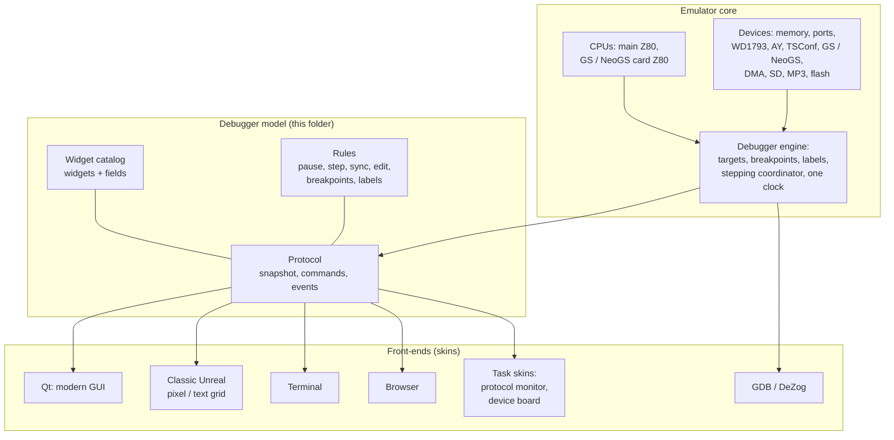

# The unreal-ng debugger: one model, many front-ends

- **Date:** 2026-09-28
- **Status:** draft for review. Requirements and model only; no code yet.
- **Scope:** the debugger for the main CPU, and its pair, the debugger for
  the sound card's CPU (General Sound and NeoGS). Both are one design.

## The idea

> **One protocol. One set of fields. One set of rules. Any number of looks.**

The emulator core is the only place that knows the machine. It exposes one
**debugger model**: which widgets exist, which fields each widget has, what
every action does, and one **protocol** that carries the fields and the
actions. A front-end is a **skin** over that model. Any number of skins can
exist, and several can run at once:

- a **pixel-faithful Unreal Speccy** skin, a text grid with the classic look
  (the TUI POC already renders it);
- a **modern GUI** skin (Qt), the main target of the design work;
- a **terminal** skin (FTXUI and similar);
- a **browser** skin, over the WebAPI and live events;
- task-specific skins: a protocol monitor for the sound card, a register
  board for one device.

They all show the same fields, with the same names and meanings. Every action
runs through the same rules. Only layout, color, density and input style
differ.

## Why a model, not a window

- **The Qt debugger today** is one window hard-wired to the main Z80: its
  widgets read the core directly. A second CPU, a second window or a browser
  cannot reuse any of it. It is **not** the reference for this work.
- **The Unreal Speccy monitor**, specified exactly in the TUI POC
  ([TDD-DBG-01](../2026-09-24-tui-debugger/TDD-DBG-01_unreal-speccy-debugger-tui.md),
  [TDD-DBG-02](../2026-09-24-tui-debugger/TDD-DBG-02_unreal-tsconf-debugger-tui.md)),
  has the right **content**. It shows which widgets a Spectrum programmer
  needs, which fields each has, and which actions and keys, refined over
  twenty years. Its limits are the 80×30 text grid and a single machine
  instance. It is the **source of the widget and field set**. The GUI
  requirements are derived from it, and extended.
- **The sound-card debugger** ([2026-09-27-gs-debugger](../2026-09-27-gs-debugger/))
  adds a second CPU with its own clock. It needs rules the Unreal monitor
  never had: one pause, one clock, stepping one CPU while the other keeps
  relative time. Those rules go into the model, so every skin gets them.

## Documents

| Document | What it fixes | Audience |
|---|---|---|
| [widget-catalog.md](widget-catalog.md) | Every widget and every field: name, meaning, type, format, editability, which actions it offers. Derived from the Unreal monitor, extended for GUI, multiple CPUs and devices. | everyone |
| [rules.md](rules.md) | Behavior: session and focus, run control and stepping, the one-clock rules for several CPUs, breakpoints and the condition language, labels, editing, change marks, refresh, errors. | everyone |
| [protocol.md](protocol.md) | The one protocol: data model, commands, events, and how each surface (WebAPI + WebSocket, CLI, MCP, Lua, Python, GDB, DeZog) carries it. Every field is mapped to its source in the core. | developers, tool builders |
| [gui-main-debugger.md](gui-main-debugger.md) | The GUI skin of the **main debugger**: requirements, workspaces and layouts, widget presentation, extension slots for other CPUs, visual language and skins, keyboard, example data, the mockup list and acceptance checklist. The brief for the design agent. | designers, design agents, Qt developers |
| [gui-card-debugger.md](gui-card-debugger.md) | **Delta only:** Part A, what the General Sound debugger adds to, removes from or changes in the main debugger; Part B, what NeoGS changes against GS. | designers, design agents, Qt developers |
| [debug-plugins.md](debug-plugins.md) | **Device debug plugins**: how every peripheral (sound chips, disk controllers, tape, IDE, SD, clocks, paging, video, input, analyzers) publishes boards, memory spaces, events, operands, traces, statistics and actions as data; the plugin catalog. | everyone |

**Related documents (engine and history):**

| Document | Relation |
|---|---|
| [2026-09-27-gs-debugger/requirements.md](../2026-09-27-gs-debugger/requirements.md) | The card debugger requirements: targets, one clock, card breakpoints, firmware knowledge. Their IDs (S1-S9, F1-F7, N1-N8, ...) are used here. |
| [2026-09-27-gs-debugger/design.md](../2026-09-27-gs-debugger/design.md) | The engine: debug targets, card hooks, the stepping coordinator, the command log, firmware profiles. |
| [2026-09-19-general-sound/neogs-automation-design.md](../2026-09-19-general-sound/neogs-automation-design.md) | Card statistics and counters (the Stats widget). |
| [2026-09-19-general-sound/neogs-zxdma-design.md](../2026-09-19-general-sound/neogs-zxdma-design.md) §6 | ZX-DMA in the debugger. |
| [2026-09-24-tui-debugger/](../2026-09-24-tui-debugger/) | The Unreal monitor, specified cell by cell; the classic skin. |
| [2026-09-28-emulator-debugger-survey/](../2026-09-28-emulator-debugger-survey/) | A survey of the debuggers of other emulators (MAME, Mesen2, WinUAE, vAmiga, FCEUX, BizHawk, DeZog, the Spectrum emulators, Spectaculator, ZXSpin): the ideas this model borrows. |
| [2026-09-17-nedoos-future-support/](../2026-09-17-nedoos-future-support/) | Metadata-driven debugging (struct DSL, universal struct inspector, trap timelines), which the firmware profiles and the plugins reuse. |
| [docs/emulator/design/debugger/time-travel-debug/](../../emulator/design/debugger/time-travel-debug/) | TTD, used by the history widgets. |

## Reading order

1. This page.
2. [rules.md](rules.md) §1-§3: what a debugger session is, and the one
   clock.
3. [widget-catalog.md](widget-catalog.md): the widgets.
4. Then, for the design, [gui-main-debugger.md](gui-main-debugger.md),
   followed by its delta for the sound card,
   [gui-card-debugger.md](gui-card-debugger.md), and
   [debug-plugins.md](debug-plugins.md). For implementation and automation,
   read [protocol.md](protocol.md) and [debug-plugins.md](debug-plugins.md).

## Terms used in all four documents

| Term | Meaning |
|---|---|
| **CPU** (debug target) | A processor the debugger controls: `main` (the Spectrum's Z80), `gs` (the classic General Sound's Z80), `neogs` (the NeoGS card's Z80). `card` is an alias for whichever card CPU is fitted. |
| **Widget** | A unit of content with a fixed field set: registers, disassembly, memory, a device board. A skin decides where it goes and how it looks, never what it contains. |
| **Field** | One named value of a widget, with a type and a format (for example `regs.pc`, 16-bit, hex). Field names are the protocol's names. |
| **Action** | A named command a widget or the session offers (for example `run.step`, `mem.goto`), with default key bindings per skin profile. |
| **Device board** | A widget that shows one device's registers and state from a board description the device publishes: TSConf registers, WD1793, AY, NeoGS configuration, DMA, SD, MP3, flash. |
| **Skin** | A front-end: layout, look and input style over the model. |
| **Snapshot** | Everything a skin needs to draw the widgets of one CPU at one moment. |
| **One clock** | Machine time shared by all CPUs. While paused, all CPUs are shown at the same moment ([rules.md](rules.md) §3). |
| **Classic** / **improved** | Classic = faithful to the Unreal monitor, quirks included. Improved = the same content with the quirks fixed and the GUI extensions. Each skin chooses; the model supports both. |
