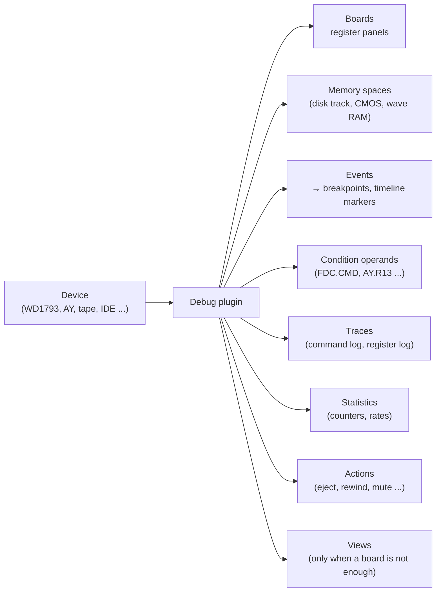
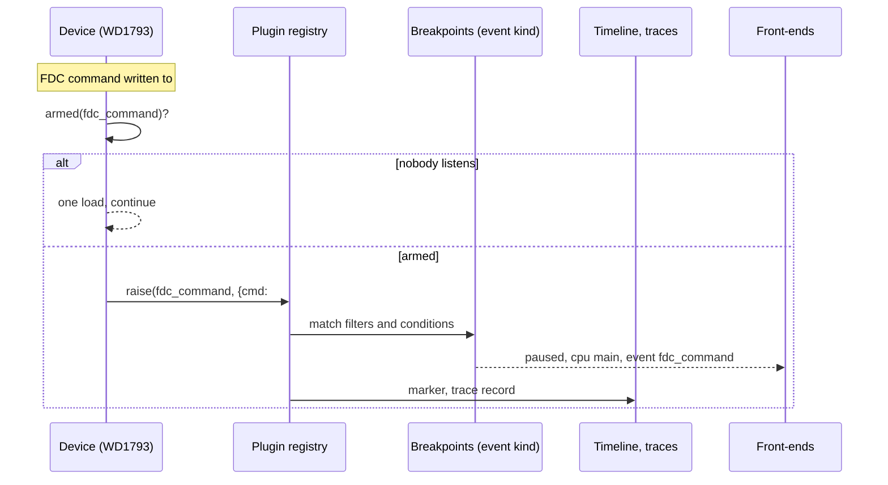
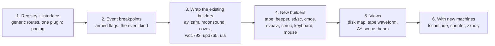

# Device debug plugins

- **Date:** 2026-09-28
- **Status:** draft for review.
- **Part of:** [the debugger model](README.md).
- **What this is:** how every peripheral of the emulator plugs into the
  debugger, and a catalog of the plugins: sound chips, disk controllers,
  tape, IDE, SD, clocks and NVRAM, paging, video, input.
- **Not covered here:** the sound cards with their own CPU. General Sound and
  NeoGS are a whole second debugger, and have their own documents:
  [gui-card-debugger.md](gui-card-debugger.md) and
  [gs-debugger](../2026-09-27-gs-debugger/).
- **Reads with:**
  - fields: [widget-catalog.md](widget-catalog.md) §4, the device board;
  - behavior: [rules.md](rules.md);
  - transport: [protocol.md](protocol.md) §3.10, §6.4;
  - where plugins appear in the UI: [gui-main-debugger.md](gui-main-debugger.md).

> **In one line.** A device describes itself to the debugger as data (boards,
> memory spaces, events, traces, statistics), and every front-end and every
> automation surface shows it with no device-specific code.

## Contents

- [1. Why plugins](#1-why-plugins)
- [2. What a plugin can contribute](#2-what-a-plugin-can-contribute)
- [3. The plugin interface](#3-the-plugin-interface)
- [4. Lifecycle, cost and TTD](#4-lifecycle-cost-and-ttd)
- [5. Protocol: generic routes, no per-device code](#5-protocol-generic-routes-no-per-device-code)
- [6. Where plugins appear in the GUI](#6-where-plugins-appear-in-the-gui)
- [7. Plugin catalog](#7-plugin-catalog)
- [8. Gaps in the core the plugins need](#8-gaps-in-the-core-the-plugins-need)
- [9. Phasing](#9-phasing)
- [10. Mockups](#10-mockups)
- [11. Checklist for a new plugin](#11-checklist-for-a-new-plugin)

## 1. Why plugins

**What unreal-ng has today:**
- about twenty peripherals, and more on the way (TSConf, IDE / ATAPI,
  Sprinter, ZX-Poly);
- rich state for most of them;
- a shared report builder for some: `DeviceState::Ay`, `Fm`, `Fdc`, `Covox`,
  `MoonSound`, `Screen` and `Contention` (`emulator/state/devicestate.h`),
  rendered by WebAPI, CLI, MCP, Lua and Python;
- per-device Qt widgets for a few (the FDC status, the floppy disk view, the
  ULA beam, border timing).

**The problems:**
- Each new device needs code in every surface, or it stays invisible.
- The only breakpoint kinds are memory, port and keyboard. No device event
  (a WD1793 command, a tape block, an AY envelope retrigger) can stop the
  machine.

**The Unreal monitor points the way.** It shows three devices as fixed
panels: beta128, AY and the TSConf register board. The TSConf fork builds its
board from a declarative layout (`dbg_canvas` / `dbg_column` /
`dbg_control`, TDD-DBG-02 §5.1). The model turns that into the rule for
every device: **a device publishes its debug view as data**.

## 2. What a plugin can contribute



| Contribution | What it is | Example | Widget |
|---|---|---|---|
| **Board** | a panel of controls, described as columns → groups → controls (catalog §4) | WD1793: CMD, TRK, SEC, DATA, STATUS, drive, side, motor | `W.board.<id>` |
| **Memory space** | a byte space the memory editor can open | disk track (physical / logical), CMOS, NVRAM, MoonSound wave RAM, SD blocks | `W.mem` space list |
| **Event kinds** | things that can happen, each with fields; they become breakpoints and timeline markers | FDC command start `{cmd, track, sector}`, tape block start `{index, kind}` | `W.bp` (kind `event`), `W.timeline` |
| **Condition operands** | named values usable in breakpoint conditions and watches | `FDC.CMD`, `FDC.TRK`, `AY.R13`, `TAPE.BLOCK`, `BEAM.LINE` | rules §5.3 |
| **Traces** | a ring of records, with capture controls | the WD1793 command collector, the AY register log | `W.porttrace`-style panel |
| **Statistics** | counters and rates, published on read | FDC sectors read / written, contention wait T per kind | a Stats tab |
| **Actions** | commands the device offers | insert / eject, rewind, mute a channel, reset | context menu, board buttons |
| **View** | a custom visualization, only when a board cannot express it | the disk surface map, the tape waveform, the AY scope, the ULA beam | a dedicated panel |
| **Breakpoint presets** | ready-made breakpoints the device offers (Spectaculator's menu of ULA `#FE` read / write, `#7FFD` / `#1FFD` writes, keyboard half-rows, any key, Kempston) | `ula`: "border write"; `keyboard`: "any key"; `tape`: "tape stops" | the breakpoint editor's Presets menu |
| **Report** | a plain-text hardware report (ZXSpin Hardware Info): T per frame and line, contention model, the paged ROM, the page in each slot, the active screen | `ula`, `paging` | View ▸ Hardware report; `GET /debug/report` |
| **Tools** | small device tools (ZXSpin "Lock Paging", "Output Byte to Port") | `paging`: lock paging, out to a port | board header buttons |

**Menu slots.** A plugin may add commands at fixed anchors of the
debugger's menus (Devices, Breakpoints ▸ Presets, Run ▸ Until), within a
reserved range, as Spectaculator's plugins do. The skins render them;
automation lists them as actions.

**Rule.** A plugin uses the generic contributions first. A custom view is
allowed only for pictures (waveforms, maps, beams). A custom view is still
fed by data from the protocol, so a browser skin can draw it too.

## 3. The plugin interface

```cpp
// core/src/debugger/plugins/idebugplugin.h (new)
struct DebugEventKind   { std::string id; std::string title; std::vector<FieldDesc> fields; };
struct DebugOperand     { std::string name; std::string title; ValueType type; };
struct DebugSpaceDesc   { std::string id; std::string title; uint64_t size; bool writable; std::vector<std::string> selectors; };
struct DebugTraceDesc   { std::string id; std::string title; std::vector<FieldDesc> fields; uint32_t capacity; };
struct DebugActionDesc  { std::string id; std::string title; std::vector<FieldDesc> params; bool mutating; };

class IDebugPlugin
{
public:
    virtual ~IDebugPlugin() = default;

    // Identity
    virtual const char* id() const = 0;              // "wd1793", "ay", "tape", "ide0" ...
    virtual const char* title() const = 0;           // "Beta 128 (WD1793)"
    virtual DebugCpuId  cpu() const { return DebugCpuId::Main; }  // whose port space it lives in
    virtual bool available() const = 0;              // fitted and enabled now

    // Descriptions: stable while the device exists
    virtual void boards(std::vector<BoardDesc>&) const {}
    virtual void spaces(std::vector<DebugSpaceDesc>&) const {}
    virtual void events(std::vector<DebugEventKind>&) const {}
    virtual void operands(std::vector<DebugOperand>&) const {}
    virtual void traces(std::vector<DebugTraceDesc>&) const {}
    virtual void actions(std::vector<DebugActionDesc>&) const {}

    // Values: side-effect free; while running, called on the emulation thread only
    virtual void boardValues(const std::string& board, BoardValues&) const {}
    virtual bool readSpace(const std::string& space, const SpaceSelector&, uint64_t addr, uint8_t* out, size_t n) const { return false; }
    virtual bool writeSpace(const std::string& space, const SpaceSelector&, uint64_t addr, const uint8_t* in, size_t n) { return false; }
    virtual bool operand(const std::string& name, uint32_t& value) const { return false; }
    virtual void stats(StatsBlock&) const {}
    virtual size_t readTrace(const std::string& trace, uint64_t since, size_t max, TraceRecords&) const { return 0; }
    virtual DebugResult runAction(const std::string& action, const ActionParams&) { return DebugResult::NotSupported(); }

    // Events: the plugin raises them; the registry decides whether anyone listens
    void setSink(IDebugEventSink* sink) { _sink = sink; }
protected:
    bool armed(uint16_t kindIndex) const { return _sink && _sink->armed(this, kindIndex); }   // one load + test
    void raise(uint16_t kindIndex, const EventFields& f) { _sink->raise(this, kindIndex, f); }
    IDebugEventSink* _sink = nullptr;
};
```

- **The registry** (`DebugPluginRegistry`, owned by `DebugService`) holds
  the plugins of one emulator.
  - Devices register their plugin when they are created, and unregister in
    their destructor. This is the same pattern as the media slots:
    `MediaManager::RegisterSlot` / `UnregisterSlot`.
  - A card switch, a model switch or a device turned off in the config
    therefore adds and removes plugins at run time. Every front-end gets a
    `plugins_changed` event.
- **Reuse `DeviceState`.** Where a `DeviceState::X` builder exists, the
  plugin's board is generated from it (`StateNode` → `BoardValues`). The data
  model is not written twice.
- **Event flow.**



## 4. Lifecycle, cost and TTD

- **Zero cost when nobody looks.**
  - A disarmed event costs one load and a test at the point where the device
    already does its work. The flag is set only while a breakpoint, a trace
    or a timeline subscribes to that event kind.
  - Boards and statistics are computed only on read. While running they are
    read at the frame end, and only if a front-end asked in the last two
    seconds; this is the publish-on-read rule of
    [neogs-automation-design.md](../2026-09-19-general-sound/neogs-automation-design.md)
    §5.2, generalized.
- **Reads have no side effects** (rules §4). A board never reads a device
  register in a way that changes it. It shows the device model's fields; for
  example the WD1793 status as the CPU would read it, computed without
  clearing INTRQ.
- **Writes are real** (rules §7).
  - A board control or a space write goes through the device's own write
    path (an OUT, a register store), with its side effects.
  - It is allowed only while paused, and refused while TTD records (the same
    rule as media and state edits).
- **TTD.** Plugins are observers.
  - Boards and statistics are not in TTD blobs.
  - Traces are cut at a seek, and regenerate during replay, as the card
    command log does.
  - Event breakpoints take part in reverse search, because the events fire
    during replay.

## 5. Protocol: generic routes, no per-device code

Every plugin is reached through the same routes and commands. Adding a device
adds no automation code: the WebAPI, the CLI, MCP, Lua and Python list and
read plugins generically.

| Read / command | WebAPI | CLI | MCP | Lua / Python |
|---|---|---|---|---|
| list plugins | `GET /debug/plugins` → `[{id, title, cpu, available, boards[], spaces[], events[], operands[], traces[], actions[]}]` | `plugin list` | `inspect_state` aspect `plugins` | `plugins()` |
| one board | `GET /debug/boards/{plugin}.{board}` | `board <plugin>.<board>` | aspect `board.<plugin>.<board>` | `board(id)` |
| write a control | `PUT /debug/boards/{plugin}.{board}/{control}` | `board <id> set <c> <v>` | `control_execution` `board_set` | `board_set(id,c,v)` |
| read a space | `GET /memory/{addr}?space={plugin}.{space}&sel=…` | `mem read <addr> --space <plugin>.<space> [--sel drive=A,track=3]` | aspect `memory` + `space` | `space_read(id, sel, addr, n)` |
| event breakpoint | `POST /breakpoints` `{kind: "event", event: "{plugin}.{event}", filter: {cmd: "#80"}, condition}` | `bpevent <plugin>.<event> [--filter k=v] [--if expr]` | `bp_add` kind `event` | `bp_add{kind="event", …}` |
| trace | `GET /debug/traces/{plugin}.{trace}?since=&limit=`, `POST …/{start\|stop\|clear}` | `trace <id> [start\|stop\|clear\|show n]` | aspect `trace.<id>` | `trace(id, since, n)` |
| statistics | `GET /debug/stats/{plugin}` | `stats <plugin>` | aspect `stats.<plugin>` | `stats(id)` |
| action | `POST /debug/actions/{plugin}.{action}` `{params}` | `plugin <id> <action> [params]` | `control_execution` `plugin_action` | `plugin_action(id, a, …)` |
| events (live) | WebSocket topic `plugins`, events `plugin_event {plugin, event, fields, time}` (only for subscribed kinds), `plugins_changed` | – | – | – |

**The existing device routes stay** as they are: `/state/audio/ay`,
`/state/fdc`, `/tape`, `/state/screen`, `/state/contention`, `/ay/log`,
`/analyzer/*`, and the others. They become thin aliases over the same plugin
data where a builder is shared.

## 6. Where plugins appear in the GUI

These are the main debugger's places for plugins
([gui-main-debugger.md](gui-main-debugger.md)):

| Contribution | Place |
|---|---|
| Boards | The **Hardware** workspace shows every available board. Small boards (Ports, Beta 128, AY) also sit in the Code workspace. Any board can be docked anywhere, or floated. A board header shows the plugin's title and its `available` state. |
| Memory spaces | the space selector of `W.mem`, grouped by plugin: `Beta 128 ▸ disk A physical / logical`, `ZX-Evo AVR ▸ CMOS / NVRAM / EEPROM`, `MoonSound ▸ wave RAM` |
| Event kinds | the breakpoint editor's kind list, grouped by plugin, with the event's fields as filters |
| Operands | the condition editor's autocomplete, grouped by plugin |
| Traces | a Trace panel with a source selector (the plugin traces); timeline markers for armed events |
| Statistics | a Stats tab per plugin in the Hardware workspace |
| Actions | buttons in the board header, and context-menu entries |
| Views | their own panels, listed under View ▸ Devices |

**Presentation rules:**

- A board renders by the control types of the catalog (§4): hex, bits as
  named toggle cells, enum chip, counter, rate with a sparkline, bar, LED,
  text.
- An absent device's board is **hidden** by default. The Hardware workspace
  may show absent devices greyed out, with the reason: "TR-DOS is not
  configured on this machine".
- Values changed since the previous pause are highlighted, as registers are.

## 7. Plugin catalog

Legend for the **Data** column:
- ✓: the core has the state and a getter;
- ~: the state exists, but a getter or a builder is missing;
- new: the state or the device is still to come.

Existing exposure is noted, so the plugin replaces or wraps it rather than
duplicating it.

### 7.1 Sound

| Plugin | Boards (controls) | Spaces | Events | Operands | Traces / stats / views | Data |
|---|---|---|---|---|---|---|
| **`ay`**: AY-3-8910 / YM2149 (`SoundChip_AY8910`) | **Registers:** R0-R15 with names (tone A/B/C period, noise, mixer, volumes, envelope period and shape), the selected register (`getCurrentRegister`). **Generators:** tone A/B/C `period`, `counter`, `volume`, envelope / tone / noise enables, output bit; noise `period`, LFSR; envelope `shape`, `period`, `counter`, `segment`, `out`. **Mix:** channel levels L/R, mixed output. **Config:** model (AY / YM), stereo mode, mutes, channel volumes. | – | `register_write {reg, value}` (with a register filter: "R13 written" = envelope retrigger), `register_select`, `mixer_change` | `AY.R0`-`AY.R15`, `AY.REG` (selected) | **Trace:** the AY register log (`AYLogRecord {frame, tacts, pc, port, chip, reg, value}`, existing `aylog` analyzer); export as a register dump. **View:** a per-channel scope and piano roll. **Actions:** mute / solo a channel. | ✓ (`DeviceState::Ay`, `/state/audio/ay`, `/ay/log`) |
| **`turbosound`**: 2 × AY | the two `ay` boards plus the **active chip** | – | `chip_select {chip}` | `TS.CHIP` | the log per chip | ~ (`_currentChip` has no getter) |
| **`tsfm`**: TurboSound FM (2 × YM2203) | **Board:** the board control word (chip, status read, FM enabled). **Per chip:** the SSG part as `ay`; **FM:** the address latch, operators per channel (from `DeviceState::FmChip`), key-on per channel, timers A/B (`intf._timer[2]`), busy, the prescaler | – | `fm_write {chip, addr, value}`, `key_on {chip, ch}`, `timer_overflow {chip, timer}`, `prescaler_change` | `FM.ADDR`, `FM.KEYON` | the FM register log; per-channel activity; FM trim | ✓ (`DeviceState::Fm`, `/state/audio/fm`) |
| **`moonsound`**: OPL4 | **FM:** address latches per bank, the selected bank, 18 channels × operators, timers (`PeekFm`). **PCM:** registers 0-255, memory address, 24 slots (`PeekPcm`); the NEW / NEW2 bits. **Wave memory:** ROM loaded, its hash. | **`wave`**: the wave RAM / ROM (`waveMemory()`) | `fm_key_on`, `pcm_key_on {slot}`, `new_mode_change`, `wave_access`, `timer_irq` | `OPL4.FMADDR`, `OPL4.PCMADDR` | channel peaks; mutes; debug counters (`DebugFmTicks`, `DebugOutSteps`) | ✓ (`DeviceState::MoonSound*`, `/state/audio/moonsound`) |
| **`covox`**: Covox / SoundDrive | fitment (mono #FB / quad), the DAC latches LA/LB/RA/RB, the last amplitudes, mutes, DC removal, written-this-frame per channel, stale-frame counters | – | `dac_write {channel, value}`, `mode_switch` (mode 1 ↔ mode 2 ports) | `COVOX.LA`… | per-channel activity | ~ (`_writtenThisFrame`, `_staleFrameCount` have no getters) |
| **`beeper`** | the last #FE value (EAR / MIC bits, border), the last amplitude, the tape amplitude, activity | – | `ear_edge`, `mic_edge` | `FE` (exists as `FD`-style operand) | a waveform view (the #FE bit timeline) | ~ (no getter; the WebAPI route is a stub) |

### 7.2 Storage

| Plugin | Boards (controls) | Spaces | Events | Operands | Traces / stats / views | Data |
|---|---|---|---|---|---|---|
| **`wd1793`**: Beta 128 | **Registers:** command (decoded name, `getLastDecodedCommand`), track, sector, data, status (bits named per command type), Beta system register (drive, side, density, reset, HLT), request status (INTRQ, DRQ). **State machine:** FSM state, delay, bytes left, sector size, density, current sector, CRC accumulator. **Head:** step direction, head loaded. **Index:** index, pulse counter. **Errors:** lost data, CRC, RNF, write fault, write protect, seek error. **Drives A-D:** motor, physical track, side, ready, write protect, disk inserted, image path, dirty. | **`disk_phys`** (drive, track: the raw track), **`disk_log`** (drive, track, sector: sector data; a write recomputes the CRC) | `command {cmd, track, sector}` (with a command filter: read sector, write sector, seek, …), `command_complete {status}`, `drq`, `lost_data`, `crc_error`, `rnf`, `index_pulse`, `step {dir, track}`, `system_write {value}` | `FDC.CMD`, `FDC.TRK`, `FDC.SEC`, `FDC.STAT`, `FDC.DRIVE` | **Trace:** the command collector (`WD1793Collector::CommandRecord`: time, port, command, registers, PC, bank, stack, index). **Stats:** commands, sectors read / written, errors. **View:** a disk surface map (tracks × sectors, colored by read / written / error / weak). **Actions:** insert, eject, save (the media manager). **Analyzer:** `trdos` semantic events, shown as a board tab. | ✓ (`DeviceState::Fdc`, `/state/fdc`, `/disk/*`, Qt FDC widgets) |
| **`upd765`**: +3 FDC | the snapshot: phase, state, main status, command bytes (decoded name, `commandName`), result bytes, ST0-ST2, step rate, head load, motor; per unit: PCN, NCN, ST0, seeking, interrupt pending | `disk_phys`, `disk_log` as `wd1793` | `command {name}`, `execution_end`, `result_phase`, `seek_end {unit}`, `overrun`, `motor {on}` | `UPD.PHASE`, `UPD.CMD`, `UPD.ST0` | command log; stats | ✓ (`getSnapshot`, `DeviceState::Fdc`) |
| **`tape`** | playback state, position (block index, pulse index, offset, seconds into block / total), the EAR level, mute, the block catalog (kind, name, header type, checksum, baud estimate), the read classifier (EAR / key / other, PC), fast load (armed), auto turbo | **`tape_block`** (block index: the block's data bytes) | `block_start {index, kind}`, `block_end`, `phase {pilot \| sync \| data}`, `ear_edge`, `fastload_trap`, `auto_pause`, `end_of_tape` | `TAPE.BLOCK`, `TAPE.PULSE`, `TAPE.EAR` | **View:** the tape waveform with block boundaries and the cursor. **Actions:** play, stop, rewind, seek to a block, insert, eject. | ✓ (getters; `/tape/*`; the Qt tape manager); no `DeviceState` builder |
| **`ide0`**, **`ide1`**: IDE / ATA / ATAPI | per channel and drive: the task file (data, error / features, count, sector, cylinder, device / head, status / command, alt status / control), INTRQ, read-only, the state (idle, read sectors, write sectors, packet), the transfer pointer and count, the high-byte latches; ATAPI: the packet bytes and sense | **`ide_sectors`** (drive, LBA) | `command {cmd, lba, count}`, `command_complete {status}`, `intrq`, `packet {cdb}`, `error` | `IDE.CMD`, `IDE.LBA`, `IDE.STATUS` | the command log; stats; insert / eject (media slots `ide0.master` …) | new (the legacy `HDD` has no getters; the planned `AtaChannel`) |
| **`zcontroller`**: Z-Controller SD (ZX-Evo) | SPI: chip select, rx latch; the card: present, SDHC, size, initialized, state, mode, last command and argument, app command, CRC on, write mode, the next read block, the write block; blocks read / written | **`sd_block`** | `sd_command {cmd, arg}` (with a command filter: CMD17, CMD24 …), `cs_toggle` | `SD.CMD`, `SD.ARG` | command counts; insert / eject (slot `sd.zc`) | ~ (getters; no builder) |
| **`media`**: the media manager | one row per slot: id, label, present, pending, source, format, access, dirty, changed units, write protect | – | `inserted`, `ejected`, `dirty` (from `NC_MEDIA_*`) | – | links to the media panel | ✓ (`/media`) |

### 7.3 System, memory and clocks

| Plugin | Boards (controls) | Spaces | Events | Operands | Notes | Data |
|---|---|---|---|---|---|---|
| **`paging`**: the model's port decoder | every paging latch of the model, decoded (`DecodePagingLatch`: 7FFD, 1FFD, DFFD, FDFD, 7EFD, EFF7, FF77, FFF7 windows, FE, FB), the lock state, the DOS / TR-DOS flags, shadow mode, cache on; the port map (`getPortMapEntries`: port, mask, device, gate, tags) | **`cache`** (the cache RAM, where present) | `latch_write {latch, value}` (with a latch filter), `lock_set`, `dos_enter`, `dos_leave`, `shadow_enter` | `FD` (exists), `P1FFD`, `PDFFD`, `PEFF7`, `PFF77`, `DOS` | this plugin **is** the `W.ports` widget, generalized | ✓ (`/state/paging`, `/ports`) |
| **`cmos`**: the RTC and CMOS (ATM, ZX-Evo: `CMOS`; Profi: `ProfiCMOS`) | the address register, the RTC time and the registers (DS12885 map), the type | **`cmos`** (256), **`nvram`** (2 KB) | `cmos_write {addr, value}` | `CMOS.ADDR` | – | ~ (no builder) |
| **`evoavr`**: ZX-Evo AVR | the extension type, the EEPROM page / mode, the caps LED, the tape-out mode, the SD present / WP switches, the PS/2 modifiers and buffer, the volatile state | **`eeprom`** (4 KB), plus `cmos` / `nvram` | `ps2_byte`, `eeprom_write`, `config_write` | – | the PS/2 keyboard is deferred (#55 E2b) | ~ |
| **`smuc`**: Scorpion SMUC | enabled, the IDE registers (8), the NVRAM I2C state (mode, SDA, SCL, address, buffer) | **`nvram`** (2 KB) | `i2c_byte`, `ide_access` | – | – | ~ |
| **`scorpion`**: Scorpion memory | the ProfROM active state, the DOS trigger, the ROM window quadrant mask | – | `profrom_switch` | – | – | ✓ |

### 7.4 Video

| Plugin | Boards (controls) | Spaces | Events | Operands | Traces / stats / views | Data |
|---|---|---|---|---|---|---|
| **`ula`**: screen and contention | **Screen:** the video mode, the active screen, the border color, shadow, flash phase, the displayed pages. **Raster:** the area starts and ends, T per line, the fetch type. **Beam:** line, T in line, x, zones, in paper, paper x / y (`DescribeBeam`). **Contention:** the rule (none / 48 / 128 / gate array), the contended slots, the floating bus (latched byte, attribute). | – | `scanline {line}` (from `NC_SCANLINE_BOUNDARY`), `border_write {color}`, `mode_change`, `screen_page`, `beam_at {line, t}` (a one-shot run-to), `flash_toggle` | `BEAM.LINE`, `BEAM.T`, `BORDER` | **Stats:** contention accesses and wait T per kind (fetch, read, write, io, idle), per frame and in total. **Views:** the ULA beam, border timing (the existing Qt widgets, re-hosted as protocol-fed views). | ✓ (`DeviceState::Screen`, `Contention`, `/video/beam`) |
| **`atm_video`**, **`profi_video`**, **`alco_video`** | the mode registers (EFF7, FF77, DFFD bits), the palettes (ATM 16, Profi 16, ULA+) | **`palette`** | `palette_write`, `mode_change` | – | a palette view | ✓ (the state is in `EmulatorState`) |
| **`tsconf`** | the full TSConf register board (TDD-DBG-02 §5.2: VConfig, TSConfig, SysConfig, CacheConfig, MemConfig, Bitmap, Tiles0/1, PalSel, Misc, FMAddr, MemPages, Sprites, DMA, Interrupt, IntMask) | **`cram`** (palette), **`sfile`** (the sprite file) | `ts_dma_start`, `ts_dma_end`, `ts_int {source}`, `vconfig_write` | `PG0`-`PG3` (exist), `TS.VCONF`, `TS.DMA` | **Views:** the TSU layers, sprites and tiles; the DRAM budget per line | new (with #41) |

### 7.5 Input

| Plugin | Boards (controls) | Events | Operands | Data |
|---|---|---|---|---|
| **`keyboard`** | the 8 × 5 matrix, with the keys drawn; the pressed keys; host input suppressed | `key_press {key}`, `key_release` (the existing keyboard breakpoints, re-expressed as events), `port_read {half_row}` | `KEY.ROW0`-`KEY.ROW7` | ✓ (`BRK_KEYBOARD`, `/keyboard/status`) |
| **`kempston_mouse`** | X, Y, buttons, wheel, present, wheel enabled, the routing (`GetMouseRoutingState`) | `mouse_read {port}` | `MOUSE.X`, `MOUSE.Y`, `MOUSE.B` | ✓ (`/mouse/status`) |
| **`joystick`** | Kempston #1F: the bits | `joy_read` | `JOY` | new (no device class today) |

### 7.6 Analyzers as plugins

The analyzers (`core/src/debugger/analyzers`) already observe devices. Each
becomes a plugin with a trace and a board:

| Analyzer | Plugin contribution |
|---|---|
| `trdos` | events `trdos.command_start`, `file_found`, `module_load`, `module_save`, `loader_detected`, `protection_detected`, `error {kind}`; a trace of the semantic events; a board of the current session |
| `coverage` | a board (executed bytes, percentage); an event "first execution of an address" |
| `aylog` | the AY trace (above) |
| `audiocapture` | a board (capturing, frames, samples); actions start and stop |
| `editor-monitor` | events for the ROM editor's control points (key wait, char inserted, syntax error, command start, report) |

### 7.7 Coming with new machines

| Machine / device | Plugins it adds | Where designed |
|---|---|---|
| TSConf (#41) | `tsconf` (above), TS DMA, the 4-source interrupt controller, the cache, the FM window | [2026-09-27-tsconf](../2026-09-27-tsconf/) |
| IDE / ATAPI (#13a, #58 M6) | `ide0`, `ide1`, ATAPI packets | [storage-manager/integration-ide-cd.md](../2026-09-28-storage-manager/integration-ide-cd.md) |
| Sprinter | the configuration state (map number, PORT_Y, RGMOD, HOLD, ALL_MODE, clock ratio, accelerator mode), the Covox-Blaster, the Z84C15 SIO / CTC / PIO, CMOS, the programmable port table | [2026-09-28-sprinter](../2026-09-28-sprinter/) |
| ZX-Poly | per-module 7FFD and 3D00 (lock), module registers, video modes 0-7; a **cross-CPU divergence** event (four CPUs in lockstep), which is also a multi-CPU concern for the timeline | [2026-09-27-zxpoly](../2026-09-27-zxpoly/) |

## 8. Gaps in the core the plugins need

These come from the device inventory (2026-09-28). Each is small, and each
is a prerequisite of the plugin that needs it.

| Gap | Plugin |
|---|---|
| `Beeper::_portFEState` and the last amplitude have no getter; `/state/audio/beeper` is a stub | `beeper` |
| `SoundChip_TurboSound::_currentChip` has no getter | `turbosound` |
| `Covox` written-this-frame and stale counters have no getters | `covox` |
| `IWD1793Observer::onFDCPortAccess` is declared, and implemented by the TR-DOS analyzer, but never called by the WD1793 | `wd1793` (port-level events), `trdos` |
| No `DeviceState` builders for tape, the beeper, the keyboard, the mouse, SD / Z-Controller, CMOS / EvoAvr / SMUC, HDD, paging, TSConf | the respective boards (or the plugins build their boards directly) |
| The legacy `HDD` has no getters | `ide*` (the planned `AtaChannel` replaces it) |
| Breakpoints have only memory, port and keyboard kinds | every event (the `event` kind, shared with the card debugger's `BRK_EVENT`) |

## 9. Phasing



This runs in parallel with the card debugger's phases. It shares the
`event` breakpoint kind and the board renderer.

## 10. Mockups

For the design agent, in addition to the main debugger's mockups:

| # | Frame | Must show |
|---|---|---|
| P01 | Hardware workspace, Pentagon 128 with TR-DOS and TurboSound FM | the boards of `paging`, `wd1793`, `turbosound` + `tsfm`, `ula`; one changed value highlighted |
| P02 | The `wd1793` board with the disk surface map view | registers, FSM, errors, drives; the map colored by read / written / error |
| P03 | The `ay` board with the scope and piano-roll view | registers named, generators, a muted channel |
| P04 | The `tape` board with the waveform view | the block catalog, the cursor, pilot / sync / data phases |
| P05 | The breakpoint editor, event kinds grouped by plugin | `Beta 128 ▸ command (read sector)`, a filter, a condition `FDC.TRK == 3` |
| P06 | The memory editor space selector, grouped by plugin | disk A physical, CMOS, NVRAM, wave RAM |
| P07 | The Trace panel with the source selector | the WD1793 command trace and the AY register log |
| P08 | A board of an absent device, greyed, and a disarmed / armed event marker on the timeline | the absent state and the reason |

## 11. Checklist for a new plugin

1. Implement `IDebugPlugin` next to the device. Register it in the device's
   constructor, and unregister it in the destructor.
2. Describe the boards by reusing the `DeviceState` builder when there is
   one. Name every control, and give it a type and a format.
3. Add events at the points where the device already does the work. Guard
   each with `armed()`, and give each its fields.
4. Add the condition operands users will want (register-level names).
5. Add spaces for any byte storage the device has.
6. Keep every read side-effect free, and route every write through the
   device's write path.
7. Tests:
   - `<device>_debugplugin_test.cpp`: every board field against the device
     state;
   - every event fires once per occurrence and not when disarmed;
   - the spaces read and write;
   - the benchmark of the device's hot path is unchanged with every event
     disarmed.
8. Docs: add the plugin to §7. The automation docs need nothing: the routes
   are generic. The WebAPI's `/debug/plugins` lists the new device by
   itself.
