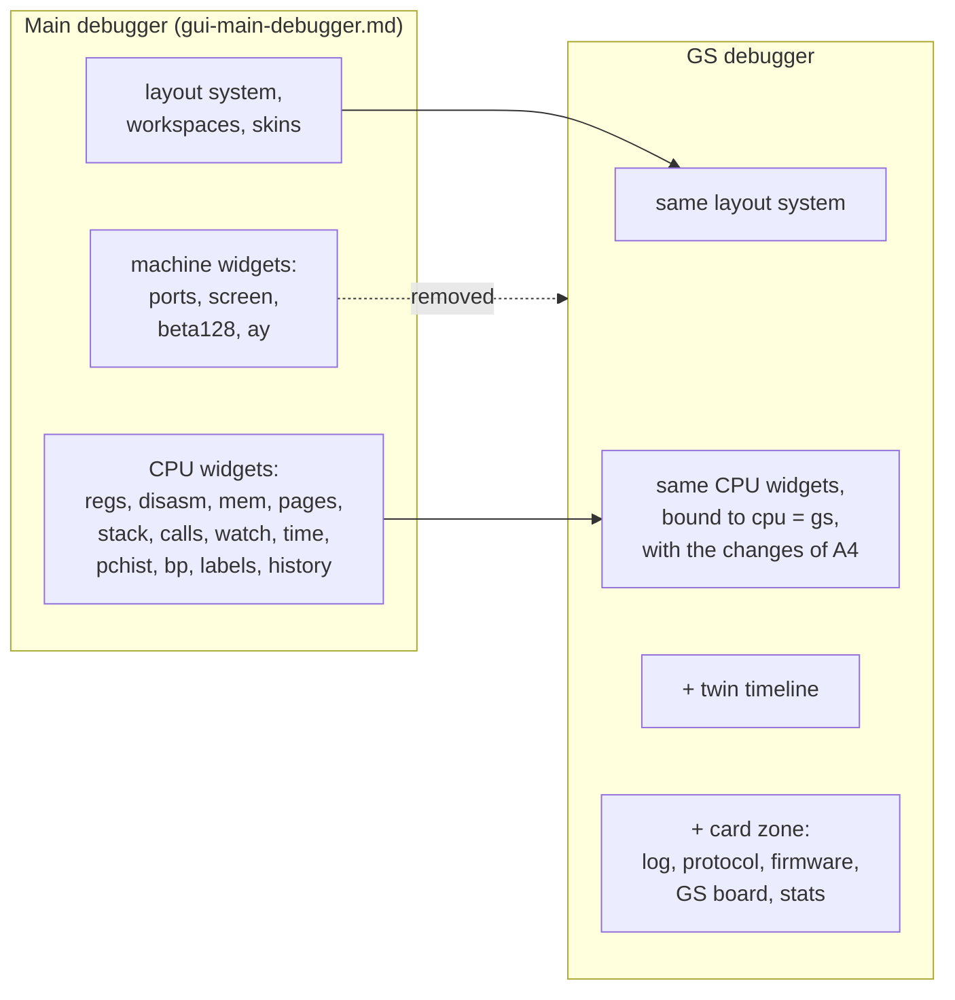
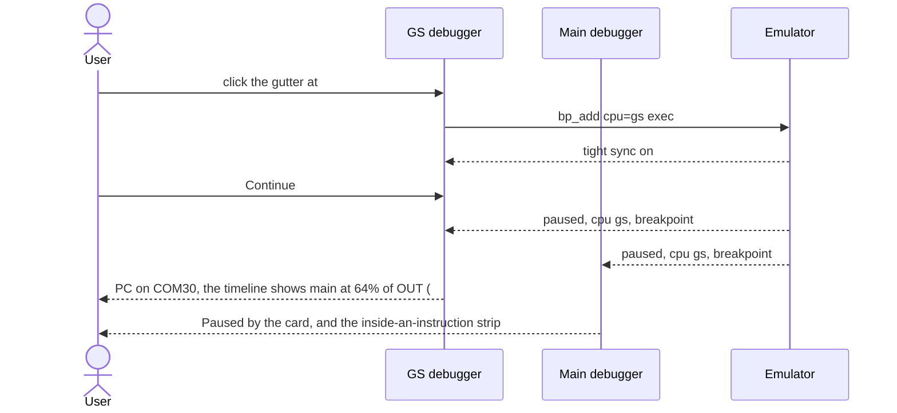

# GUI delta: the sound-card debugger (GS, then NeoGS)

- **Date:** 2026-09-28
- **Status:** draft for review.
- **What this is:** a **delta**. It lists only what the card debugger adds to,
  removes from, or changes in [gui-main-debugger.md](gui-main-debugger.md).
  Everything not mentioned here is exactly as in that document: layout
  system, workspaces, widget presentation, tokens, skins, keyboard, states,
  quality requirements.
- **Order:** Part A covers the **General Sound** debugger, as a delta against
  the main debugger. Part B covers **NeoGS**, as a delta against the GS
  debugger.
- **Content and rules:**
  - fields: [widget-catalog.md](widget-catalog.md);
  - behavior: [rules.md](rules.md) (§3 is the two-CPU clock);
  - data: [protocol.md](protocol.md);
  - requirement IDs (S1, F1, N6, …):
    [gs-debugger/requirements.md](../2026-09-27-gs-debugger/requirements.md).

## Contents

- [Part A. GS debugger: the delta against the main debugger](#part-a-gs-debugger-the-delta-against-the-main-debugger)
  - [A1. The idea in one picture](#a1-the-idea-in-one-picture)
  - [A2. Same as the main debugger](#a2-same-as-the-main-debugger)
  - [A3. Removed](#a3-removed)
  - [A4. Changed](#a4-changed)
  - [A5. Added](#a5-added)
  - [A6. Changes in the main debugger while a card is fitted](#a6-changes-in-the-main-debugger-while-a-card-is-fitted)
  - [A7. The Card workspace (GS)](#a7-the-card-workspace-gs)
  - [A8. Extra states](#a8-extra-states)
  - [A9. Key flows](#a9-key-flows)
  - [A10. The LW player on the same slot](#a10-the-lw-player-on-the-same-slot)
  - [A11. Example data, mockups, checklist (GS)](#a11-example-data-mockups-checklist-gs)
- [Part B. NeoGS debugger: the delta against the GS debugger](#part-b-neogs-debugger-the-delta-against-the-gs-debugger)
  - [B1. What makes NeoGS different](#b1-what-makes-neogs-different)
  - [B2. Changed](#b2-changed)
  - [B3. Added](#b3-added)
  - [B4. Removed or replaced](#b4-removed-or-replaced)
  - [B5. Changes in the main debugger while NeoGS is fitted](#b5-changes-in-the-main-debugger-while-neogs-is-fitted)
  - [B6. The Card workspace (NeoGS)](#b6-the-card-workspace-neogs)
  - [B7. Example data, mockups, checklist (NeoGS)](#b7-example-data-mockups-checklist-neogs)

---

# Part A. GS debugger: the delta against the main debugger

## A1. The idea in one picture

The card debugger is **the main debugger's window, bound to the card's
CPU**, with three things on top: the twin timeline, the card zone, and the
card's toolbar items.



**What "one clock" means for the design.** The card CPU (12 MHz) is faster
than the Spectrum's (3.5 MHz). When the card stops on its own instruction
boundary, the Spectrum is usually **inside** one of its instructions. The
card debugger shows how far in, and which bus cycle is under way
(rules §3).

## A2. Same as the main debugger

Everything in gui-main-debugger.md applies unchanged, bound to `cpu = gs`:

- G1-G19 and G30-G36;
- the layout system and saved workspaces;
- the widget presentation of `W.regs`, `W.disasm`, `W.mem`, `W.pages`,
  `W.stack`, `W.calls`, `W.watch`, `W.time`, `W.pchist`, `W.bp`, `W.labels`
  and `W.history`;
- the tokens, the type, the skins and the keyboard profile.

The same widget looks the same in both windows.

## A3. Removed

These main-debugger items do not exist in the GS debugger: the card has no
such hardware.

| Removed | Why |
|---|---|
| `W.ports` (FE, 7FFD, extended port, EFF7) | Spectrum ports; the card's own ports are on the GS board (A5) |
| `W.screen` and the beam (line / pixel) in `W.time` and the status bar | the card has no video |
| `W.board.beta128`, `W.board.ay` | main-machine devices |
| Memory spaces `disk_phys`, `disk_log`, `cmos`, `nvram`, `comp_pal` | main-machine devices |
| Keyboard breakpoints | the card has no keyboard |
| Classic page names (`BASIC`, `TRDOS`, `B128K`, `SVM`) | Spectrum ROM names |
| The Hardware and Timing workspaces (in their main-machine form) | replaced by the Card workspace (A7) |
| The main machine's cheat search and ripper | main-machine tools |

## A4. Changed

| Item | In the main debugger | In the GS debugger | Req |
|---|---|---|---|
| CPU badge and accent | `MAIN Z80 3.5 MHz`, `cpu/main` color | `GS Z80 12 MHz`, `cpu/gs` color (amber) | T1 |
| `W.regs` `t` and Δ | T-states since the frame start, `Δ 13 T` | card cycles since the frame start, `c 119,985 · Δ 12 c` | S2 |
| `W.regs` | – | the classic GS state has no special badge; the full register file incl. WZ, Q, the boundary state | V1 |
| `W.pages` | 4 Spectrum windows, names like `BASIC` | GS map: `0 ROM 0` fixed · `1 RAM 1` fixed (upper half of MPAG 1) · `2`/`3` from MPAG: `ROM 0/1` when MPAG = 0, else `RAM 2n/2n+1`; source `MPAG #03` | T3 |
| `W.mem` spaces | cpu, page (ROM / RAM), disk, CMOS, NVRAM, palette | cpu, page (`ROM 0-1`, `RAM 0-31`) | V3 |
| `W.mem` note | – | the DAC window `#6000-#7FFF`: "reads here are DAC fetches on the card; this view reads without side effects" | V3 |
| `W.disasm` labels | the user's labels, XAS / ALASM imports | **firmware symbols load by themselves** (by the ROM's SHA-256), plus user labels kept per firmware | L3, L4, L5 |
| `W.labels` header | – | the profile card: `GS firmware v1.05a · SHA-256 3fa1… · 214 symbols · symbols/gs/gs105a.map`; or `Unknown firmware` with Import… | L4 |
| `W.bp` kinds | exec, read, write, port, condition, keyboard | exec, read, write, port (card ports `#00-#0B`), condition, **event** (INT, NMI, card reset, page switch), **protocol, card side** (the firmware takes a command, takes data, writes a reply) | B1-B3 |
| `W.bp` stop point for memory / port hits | inside the instruction | after the instruction, reported as "write `#4100` ← `#12` by the instruction at `#0C30`" (rules §1) | B1 |
| Condition operands | Spectrum operands (`FD`, `DOS`) | card operands: `MPAG`, and the mailbox `CMD`, `DATA`, `STATUS`; `main.X` reads a main-CPU value | B4 |
| Toolbar | Continue, Pause, Step, Over, Out, Run to cursor, frame, Run to ▾, TTD | the same, plus **Step main** (⤓, steps the other CPU); Run to ▾ gains "card cycle…", "main T…", "next card interrupt", "next host command" | S5, S7 |
| Paused-by pill | `Paused by: breakpoint #7` | may name either CPU: `Paused by: card breakpoint #3` / `Paused by: main breakpoint #7` | S1, T5 |
| New pills | – | `Tight sync` (while the card follows the Spectrum at every bus access) and `Symbols: GS v1.05a · 214` | S4, L4 |
| Status bar | frame, T, beam, contended, breakpoints, TTD, fps | `GS · RAM 512 KB · MPAG #03 · log ● 1,248 · errors 0` | – |
| Menu / shortcut | Debugger, Ctrl+1 | Card CPU, Ctrl+2 | – |

## A5. Added

### A5.1 The twin timeline (full width, under the toolbar)

The signature element. It shows both CPUs on one clock.

```text
 lane         blocks: width = duration in machine time                     readout
 MAIN   │LD A,(HL)│ OUT (#B3),A  [OCF 4][OD 3][IO 4] │ ...   6.6 / 11 T · 60% · port write next
 NOW ─────────────────────────────┃──────────────────   T 34,995.6 · frame 412 · gap 0.4 T
 CARD   │..│LD A,(IX+2)│OUT (#03),A│ JR NZ (next) │      cycle 119,985 · 12 MHz
                              ● breakpoint     ⇄ host port access
```

| Element | Shows | Catalog field |
|---|---|---|
| Lanes | main on top, the card below (the same order as in the main debugger's strip) | `lanes[]` |
| Blocks | recent instructions; width ∝ duration; the current main instruction split into bus-cycle segments | `recent[]`, `bus_cycles[]` |
| Progress | `6.6 / 11 T · 60% · port write next`; conditional `5 / 7 or 12 T`; `contended` | `position.*` |
| NOW line | the shared moment | `now` |
| Gap | only when not zero | `position.gap_*` |
| Next instruction | outlined | `next` |
| Markers | breakpoint ●, host port access ⇄ (hover `OUT #B3 ← #01`), INT / NMI | `markers[]` |

**Interaction:**
- The wheel zooms (default ± 60 T around NOW; zoomed out, the blocks merge
  into a density bar); a drag pans; a double-click recenters.
- Clicking a block opens that CPU's disassembly.

**While running** it shows a density bar at 10 Hz.

### A5.2 The card zone (right column, tabs)

| Tab | Widget | Presentation |
|---|---|---|
| **Log** | `W.cmdlog` | A virtualized table: frame · main T · card cycle · direction icon (→ ← ⇉ ⚠ ✓) · what (decoded by the firmware profile) · reply · main PC + label · card PC + label. Block rows collapsed (`⇉ 38,400 B → RAM 2-3`) and expandable. Anomaly rows in the error style. Header: REC toggle, counts, filters, export. New rows append live; a "▼ 12 new" chip when scrolled up. |
| **Protocol** | `W.proto` | A 5-line card: command · parameters · transfer bar · flags · last problem; a Send… button. |
| **Firmware** | `W.fwobj` | Objects (slot, module / sample, size, page, address), a playback strip (playing, position, row, speed), volume bars. An empty state for an unknown firmware. |
| **Hardware** | `W.board.gs` | MPAG with its pages; 4 DAC channels (sample, volume bars); the interrupt position `212 / 320`; pending INT / NMI; the mailbox latches and flags; firmware ready. |
| **Stats** | `W.stats` | Tiles with sparklines: commands, data, interrupts, DAC fetches, card clock, errors. The mailbox line `host_commands · card_command_acks · command_overwrites`. Baseline and freshness. |

### A5.2a Analysis and audio tabs (requirements §4.13-§4.15)

The card zone also gets these tabs (hidden until opened from View ▸ Card).

| Tab | Widget | Presentation |
|---|---|---|
| **Events** | `W.events` (card) | One frame on a canvas: rows = the ~750 interrupt periods, columns = the 320 cycles of a period. Dots: host `#B3` / `#BB` accesses in card time, INT accept, **the ISR as a bar from accept to exit**, DAC fetches colored by channel, page and volume writes, probe marks. At a glance: how much of each period the ISR uses. |
| **Trace** | `W.trace` | The merged trace of both CPUs, ordered by machine time; the card's wait loop condensed to one line per burst; a filter "while command `#30`". |
| **Profiler** | `W.profiler` | The **ISR budget gauge** (`212 / 320 avg · 301 max · 34% headroom`), the routine table with firmware names, the cost of each command handler. |
| **Coverage** | `W.cdl` | Code / data per page space (ROM, RAM pages); the list of command handlers executed; "break on the first new code". |
| **Heat map** | `W.heatmap` | Card RAM as a glowing grid; channels: fetch, read, write, **DAC fetch** (the playing samples glow), uploads as a write sweep. |
| **Writers** | `W.regwriters` | The card ports and the host `#B3` / `#BB` / `#33`: value, writer PC + label, frame. |
| **Audio** | `W.audio` + `W.samples` | Per channel: mute, solo, a scope (with the NOW cursor when paused); the mixed output; below it the sample and module browser with **audition on the host**, play on the card (logged), save `.pcm` / `.wav`, save the module. |
| **Objects** | `W.structs` | The firmware's structs as tables, from the profile: channels, samples, module slots. It replaces the fixed Firmware tab when the profile declares structs. |
| **Dispatch** | `W.dispatch` | The command table with the handler labels; patched entries highlighted with the upload that patched them; the active profile stack (`GS v1.05a ▸ gscode.bin`). |
| **Pages** | `W.pagemap` | The card RAM pages colored by owner: firmware, module slots, samples, uploaded code, stream ring, free. |
| **Unknown** | `W.unknown` | The commands the card did not know, with counts and a Clear button. |
| **Validators** | – | The hardware-misuse log (page beyond the fitted RAM, undecoded port …), each entry with its PC. |

**The breakpoint editor**, on a card CPU, offers the actions `stop / log /
mark / count`, a forbid range, "before the access", and a **bus master**
filter (on GS: `cpu`, `dac`).

### A5.3 New dialogs and windows

| Item | What |
|---|---|
| **Send console** (`D.send`, Ctrl+Shift+S) | A command picker with names from the profile, typed parameters, [Send], and the reply decoded. Logged as `sent from debugger`. |
| **Protocol monitor** | A compact floating window (about 520 × 360): the log, the protocol strip and the error tile; Pause only. It sits next to the game while you play (U1c). |

### A5.4 Command-log actions (context menu on a log row)

- Break when the game sends this command (a host-side protocol breakpoint,
  on `main`).
- Break when the firmware takes this command (card side).
- Break on data byte N of this upload (host side, with a hit target).
- Go to this moment (through TTD when it records).
- Copy.

## A6. Changes in the main debugger while a card is fitted

These fill the main debugger's extension slots (gui-main-debugger §7).
Without a card, the slots stay hidden.

| Slot | Filled with | Example |
|---|---|---|
| S1 | the one-line **card strip**; a click opens the card debugger | `MAIN ▶ in OUT (#B3),A · 60% · CARD cycle 119,985 (GS 12 MHz) ▸` |
| S2 | the paused-by pill can name the card | `Paused by the card: breakpoint #3 at #0C32 COMLOOP ▸ Show card` |
| S3 | the **inside-an-instruction strip** on top of the main registers | `in OUT (#B3),A · 6.6/11 T · port write next` |
| S5 | the **CPU column** and CPU filter in the breakpoints; **host-side protocol kinds** in the editor: the host sends a command (any / `#NN`), the host sends data (byte N), the host reads the reply | `✉ host sends #30` |
| S6 | the Debug menu gets `Card CPU…` (Ctrl+2), and the toolbar gets "Step other" (Alt+F11) | – |

## A7. The Card workspace (GS)

```text
┌──────────────────────────────────────────────────────────────────────────────────────────────────┐
│ ● GS Z80 12 MHz │ ▶ ❚❚ │ ↓ ↷ ↑ ⇥ │ ⤓ Step main │ Run to ▾ │ Paused by: card breakpoint #3 │ Tight sync │
│ ◀ ▶ │ ⌕ │ Workspace: Card ▾ │ Symbols: GS v1.05a · 214 ▸ │ Skin: Modern ▾                  ⚙      │
├──────────────────────────────────────────────────────────────────────────────────────────────────┤
│ MAIN  ─┤ LD A,(HL) ├┤██████ OUT (#B3),A ██████░░░░░┤ 6.6/11 T 60% · port write next            │
│ NOW ───────────────────────────┃──── T 34,995.6 · frame 412 · gap 0.4 T ─────────────────────── │
│ CARD  ┤..┤ LD A,(IX+2) ┤ OUT (#03),A ┤▶ JR NZ   │ cycle 119,985 · 12 MHz                        │
├──────────────────┬──────────────────────────────────────────┬────────────────────────────────────┤
│ REGISTERS        │ DISASSEMBLY                              │ [Log][Protocol][Firmware]          │
│ AF 1A43 AF' 0000 │   0C2E 3A 00 40  ld a,(#4000)            │ [Hardware][Stats]                  │
│ BC 0010 BC' 0000 │ ● 0C31 FE 30     cp 30                   │ ● REC 1,248 · 0 dropped  ⌕ filter  │
│ DE 8000 DE' 0000 │ ▶ 0C32 20 F9     jr nz,COMLOOP   ; taken │ 412 34,996 → #30 load module       │
│ HL 4100 HL' 0000 │   0C34 CD 80 12  call COM30              │        ← #01 slot 1  #8123 PLAYMUS │
│ IX 6000 IY 5C3A  │ COM30:                                   │ 412-431 ⇉ 38,400 B → RAM 2-3       │
│ SP 7FF0 PC 0C32  │   1280 F3        di                      │ 431 ⚠ data #12 overwritten         │
│ I 3F R 12 IM 1   │                                          │ 431 → #31 start playback slot 1    │
│ IFF 1 1 WZ 0C33  ├──────────────────────────────────────────┤                                    │
│ sZ.h.Pnc         │ MEMORY [page ▾ RAM 5]                    │                                    │
│ c 119,985 · Δ 12c│ 0000 1A 43 00 12 ...                     ├────────────────────────────────────┤
├──────────────────┤                                          │ PROTOCOL                           │
│ PAGES            │                                          │ #30 load module · params 1/1       │
│ 0 ROM 0    ro    │                                          │ upload 12,288 / 38,400 ▓▓▓░░░ 32%  │
│ 1 RAM 1    rw    │                                          │ cmd ○ taken · data ● waiting       │
│ 2 RAM 4    rw    │                                          │                                    │
│ 3 RAM 5    rw    │                                          │                                    │
└──────────────────┴──────────────────────────────────────────┴────────────────────────────────────┘
 GS · RAM 512 KB · MPAG #03 · log ● 1,248 · errors 0
```

The other card workspaces (users may save their own) are:
- **Card: memory**: two memory panels, ROM and a RAM page;
- **Card: protocol**: a large log, protocol and stats;
- **Card: firmware**: disassembly, labels, firmware objects.

## A8. Extra states

In addition to gui-main-debugger §8:

| State | Card debugger | Main debugger |
|---|---|---|
| **No card fitted** | the window is disabled: `No sound card is fitted: Audio settings ▸ General Sound slot` | the slots are hidden |
| **LW player fitted** | turns into the LW inspector (A10) | the strip reads `CARD: lightweight player (no CPU)` |
| **Card switch pending** | everything frozen: `The card is being switched at the next frame` | the strip shows the same text |
| **Paused by the other CPU** | the paused-by pill names `main`; the card is on its nearest boundary with the gap shown | the inside-an-instruction strip when the card stopped |
| **Tight sync on** | the pill, with the tooltip "The card follows the Spectrum at every bus access while you debug it. It costs speed and turns off when no card breakpoint or step is active." | – |
| **Card breakpoints while the card is absent** | – | in the breakpoint list, greyed out: `card not fitted` |

## A9. Key flows

### A9.1 A card breakpoint stops the machine



### A9.2 Step the card, then the Spectrum

1. The card is paused at `JR NZ` (12 cycles); the main CPU is at 60% of
   `OUT (#B3),A`.
2. **Step:** the card runs `JR NZ`. The main progress becomes `10.1 / 11 T ·
   92% · port write under way`.
3. **Step main:** the main CPU finishes `OUT`, then runs its next
   instruction. The card runs about 37.7 cycles and ends on a boundary; its
   lane shows the group of instructions it ran.

### A9.3 From the log to the bug

1. The anomaly row: `data byte #12 overwritten before the card read it`.
2. Right-click → "Break on data byte 1,025 of this upload". This adds a
   host-side protocol breakpoint on `main` with a hit target.
3. Continue: the main debugger stops at the game's `OUT (#B3),A`. Its strip
   shows that the card has not taken the previous byte.

## A10. The LW player on the same slot

The lightweight player has no CPU. With it fitted, the GS debugger becomes a
**read-only inspector** (W1-W5):

| Instead of | Shows |
|---|---|
| Registers, Disassembly, Memory, Pages, Stack | a **live state diagram** of the interpreter (Idle → Command → Params → Upload / Reply → Idle), with the current state lit, the command and the byte counts; the queues (params and replies, of 16) |
| Firmware | the **Player**: song position, row, tick, speed, BPM, playing, and the four channels (sample, volume, period); a Samples table |
| Twin timeline, toolbar | a Pause button only; no breakpoints, stepping or editing |
| Log, Protocol, Stats | unchanged, read-only |

## A11. Example data, mockups, checklist (GS)

**Example data:**
- **Registers:** AF `1A43`, BC `0010`, DE `8000`, HL `4100`, IX `6000`,
  IY `5C3A`, SP `7FF0`, PC `0C32`, WZ `0C33`, I `3F`, R `12`, IM 1, IFF 1 1,
  flags `sZ.h.Pnc`, `c 119,985`, `Δ 12 c`.
- **Disassembly:** `0C2E ld a,(#4000)`, `● 0C31 cp 30`,
  `▶ 0C32 jr nz,COMLOOP ; taken`, `0C34 call COM30`, `COM30: 1280 di`.
- **Pages:** `ROM 0 ro`, `RAM 1`, `RAM 4`, `RAM 5` (MPAG `#03`).
- **Timeline:** main in `OUT (#B3),A`, 6.6 / 11 T, 60%, port write next;
  NOW T `34,995.6`, frame `412`, gap `0.4 T`; card cycle `119,985`.
- **Log:**
  - `412 · 34,996 · 119,986 · → #30 load module · ← #01 slot 1 · #8123
    PLAYMUS+12 · #1280 COM30`;
  - `412-431 · ⇉ upload for #30: 38,400 B → RAM 2-3 #8000-#95FF`;
  - `431 · ⚠ data byte #12 overwritten before the card read it · #8123`;
  - `431 · → #31 start playback slot 1 · #8140 PLAYMUS+2D · #12F0 COM31`.
- **Protocol:** `#30 load module · params 1 of 1 · upload 12,288 / 38,400 B
  (32%) · command ○ taken · data ● waiting`.
- **Hardware:** MPAG `#03 → RAM 4-5 at #8000`; channels `#80 · 3F` × 4;
  interrupt position `212 / 320`; INT ● NMI ○.
- **Stats:** commands `4 /s`, data `12 B/s`, interrupts `37,500 /s`, DAC
  fetches `150,000 /s`, card `12.0 MHz`, errors `0`.
- **Symbols:** `GS v1.05a · 214`.

**Mockups:**

| # | Frame | Must show |
|---|---|---|
| C01 | GS Card workspace, paused by card bp #3 | every panel of A7, tight sync, symbols |
| C02 | GS Card workspace, paused by a main bp | the gap on the timeline, the paused-by pill naming `main` |
| C03 | Twin timeline, detail: paused (60%), after Step (92%), running (density) | segments, NOW, markers, readouts |
| C04 | Command log, live, with a block and an anomaly | filters, the context menu on the anomaly, "▼ 12 new" |
| C05 | Protocol, Firmware, Hardware (GS) and Stats tabs | the four tabs with the example data |
| C06 | Main debugger with a GS card fitted | slots S1, S2, S3, S5 filled |
| C07 | Breakpoint editor, a protocol breakpoint | CPU, kind, command filter, byte, hit target |
| C08 | LW inspector during an upload | the live state diagram, the player |
| C09 | No card; card switch pending | banners |
| C10 | Protocol monitor, floating | the compact layout |
| C11 | Send console | the reply decoded |
| C12 | Events tab, a module playing | the ISR bars, the DAC dots by channel, a host upload column |
| C13 | Profiler tab | the ISR budget gauge, the handler costs |
| C14 | Audio tab | 4 scopes with mute / solo, the NOW cursor, the sample browser with audition |
| C15 | Dispatch and Objects tabs, GP's MP3 player uploaded | the profile stack `GS v1.05a ▸ gscode.bin`, the uploaded code's commands, the stream ring from registers |

**Checklist (in addition to gui-main-debugger §15):**
- [ ] **Two CPUs, one clock:** from C03 alone, a newcomer can say where both
  CPUs are and why the Spectrum is "inside" an instruction.
- [ ] **Same widget, same look:** C01 and the main debugger's M01 use the
  same widgets, differing only as A3-A5 say.
- [ ] **Identity colors:** `cpu/gs` appears only on CPU identity.
- [ ] **Whose pause** is readable in both windows.

**Token added by Part A:** `cpu/gs` = `#B45309` (light) / `#F59E0B` (dark).

---

# Part B. NeoGS debugger: the delta against the GS debugger

Everything in Part A applies to NeoGS, except what this part changes. NeoGS
runs the GS-compatible firmware on richer hardware; the debugger grows with
the hardware.

## B1. What makes NeoGS different

| Hardware | GS | NeoGS |
|---|---|---|
| CPU clock | 12 MHz, fixed | 10 / 12 / 20 / 24 MHz, **switched by the program while it runs** |
| Memory | 32 KB ROM, 128-512 KB RAM | 512 KB **flash**, 2-4 MB RAM (up to 256 pages) |
| Paging | windows 0-1 fixed, 2-3 by MPAG | **all four windows switchable** (PG0-PG3), MPAG / MPAGEX, ROM or RAM mode (GSCFG0) |
| Sound | 4 channels | 8 channels, 4ch / 8ch / pan4ch modes |
| Devices | – | **DMA** (SD, MP3, and **ZX-DMA** to the Spectrum), **SD card** (slot `sd.ngs`), **MP3 decoder** (VS1001 / VS1011), **flash chip** |
| Use | music | music, MP3, and a **coprocessor** (The Link renders graphics on it, moving 7 KB a frame over ZX-DMA) |

## B2. Changed

| Item | GS debugger | NeoGS debugger | Req |
|---|---|---|---|
| CPU badge and accent | `GS Z80 12 MHz`, amber | `NeoGS Z80 24 MHz`, **violet** (`cpu/neogs`); the clock updates live when the program switches it | N2 |
| Twin timeline card lane | a fixed 12 MHz | the readout shows the current clock; a **◆ clock-change marker** (`12→24 MHz at cycle 118,400`); block widths stay exact across the change | S9, N2 |
| `W.regs` `t`, Δ | cycles at 12 MHz | cycles at the current clock; the tooltip shows base ticks (120 MHz) | N2 |
| `W.pages` | 2 fixed windows; `ROM` / `RAM` | 4 switchable windows; kinds `FL` (flash, teal), `RAM`; pages 0-255; source `PG0 #00`, `MPAG #02`, `MPAGEX #05`; a `ROM mode` / `RAM mode` note from GSCFG0; `wp` for RAMRO-protected pages | N3 |
| `W.mem` spaces | cpu, page (`ROM 0-1`, `RAM 0-31`) | cpu, page (`FL 0-31`, `RAM 0-255`), **`card_flash`** (the whole 512 KB chip), **`sd_block`** (the SD medium by block) | N3, N4 |
| `W.mem` page picker | 34 pages | up to 288: a searchable picker grouped by kind (**Decide**: a grid or a list) | N3 |
| Flash edits | – | allowed while paused, with the warning "writes the chip's array directly, not through the program command" | rules §7 |
| Hardware tab | `W.board.gs` | `W.board.neogs` (B3.1) | N4 |
| `W.bp` event kinds | INT, NMI, card reset, page switch | the same, plus **clock switch**, **ZX-DMA start / stop**, **DMA done** (SD / MP3), **DMA error**, **ZX-DMA byte dropped**, **host wait > N T** | N6 |
| Condition operands | `MPAG` | also `GSCFG0`, `PG0`-`PG3` | – |
| `W.labels` profile | `GS v1.05a` | `NeoGS 1.09 · 1,204 symbols` (NeoGS firmware sources, N5); the loader and the main ROM as separate symbol groups | N5 |
| Stats tiles | commands, data, interrupts, DAC fetches, clock, errors | the same, plus **ZX-DMA**, **SD DMA**, **MP3 DMA**, **SD**, **MP3**; the error list gains the NeoGS counters | N7 |
| Status bar | `GS · RAM 512 KB · MPAG #03 …` | `NeoGS · RAM 4 MB · GSCFG0 #23 (RAM mode, 8 ch, 24 MHz) · log ● 1,248 · errors 0 · ZX-DMA divert` | – |

## B3. Added

### B3.1 The NeoGS board (the Hardware tab, replacing the GS board)

| Group | Controls |
|---|---|
| Config | GSCFG0 `#23`, decoded as chips: `RAM mode`, `8 ch`, `24 MHz`, and `RAMRO`, `EXPAG`, `PAN4CH`, `INV7B` when set |
| Paging | PG0-PG3 `00 03 04 05`, window-flash flags, MPAG `#02`, MPAGEX |
| Clock | `24 MHz`, with the switch count |
| DAC | 8 channels (sample, volume bars), the mode (4ch / 8ch / pan4ch) |
| Output | DAC level L / R meters; the listening stereo mode (separated / GS / mono) as a note |
| Interrupts | INTENA (timer, SD DMA, MP3 DMA as LEDs), INTREQ, TIM_FREQ `0 (37.5 kHz)` |
| SPI / status | SCTRL decoded (SD nCS, MC nCS, XRESET, speeds), SSTAT (MCRDY, SD WP, SD detect, DREQ) |
| LED, firmware | the card LED; ready; the flash title and `modified` |
| Mailbox | as on the GS board |

### B3.2 A DMA tab (`W.board.neogs_dma`)

```text
 Module   Sel  Run  Address          Page    Starts  Done   Bytes      Errors  Last transaction
 ZX       ●    ●    #01 2345         RAM 4   12      11     82,956     0       #012000 · 6,913 B · 41,478 clk · fr 431
 SD            ○    #00 8000         RAM 2   4       4      2,048      0       #008000 · 512 B · 9,216 clk · fr 18
 MP3           ○    #10 0000         RAM 64  0       0      0          0       –
 ─ ZX-DMA ────────────────────────────────────────────────────────────────────────────
 Mode   Divert (the Spectrum's reads at #0000-#3FFF come from card RAM)    Watch  selected · 5 frames · 3 left
 Latch  #A7   Pending  read #012346 (done in 4 clk)      Waits  0 T   Late starts 0
 Read 82,956 B · Written 0 B · Dropped 0 B                                        [Trace ▸]
```

The **ZX-DMA trace** (Trace ▸) is a table: host time · card time ·
direction · card address · value · wait · host PC. It is the card port trace
filtered to ZX-DMA events.

### B3.3 An SD · MP3 · Flash tab

Three cards, side by side, stacked when narrow:

| Card | Shows | Actions |
|---|---|---|
| **SD** (slot `sd.ngs`, owned by the media manager) | medium (`music.img · SDHC · 1.9 GB`, or `folder ~/mp3 (FAT16)`), state (`initialized · idle` / `reading block 1,024`), access and write protection, blocks read / written, command counts, errors | Insert… (image or folder), Eject, Open media panel (N8) |
| **MP3** | chip, running, DREQ, `44,100 Hz · stereo · 128 kbit/s · 01:23`, input `1,536 / 2,048`, PCM queued, frames, dropped, underruns; the SCI registers, expandable | – |
| **Flash** | title (`modified`), mode (read / programming / erasing sector 3), vendor, write mode and the saved copy's path, bytes programmed, erases, failures | Save flash |

### B3.4 Timeline additions

- **ZX-DMA ticks** on the main lane: fine marks where the Spectrum's reads
  were answered from card RAM.
- **`wait` in the main progress readout**, when ZX-DMA held the Spectrum:
  `6/11 T + 3 T wait`.

### B3.4a Analysis differences on NeoGS

| Item | GS | NeoGS |
|---|---|---|
| Bus-master filter and heat-map channels | `cpu`, `dac` | also `sd_dma`, `mp3_dma`, `zx_dma` |
| Heat map size | up to 512 KB (32 pages) | up to 4 MB (256 pages), 64 bytes a cell; flash as its own space |
| Event viewer columns | 320 cycles | scaled by the clock and `tim_freq`; the clock-change rows marked |
| Profiler | one clock | tabs per clock (10 / 12 / 20 / 24 MHz), so the gain of 24 MHz is visible |
| Register writers | GS ports | also GSCFG0, PG0-PG3, the DMA registers (programmed vs live, the starting PC) |
| Validators | page beyond RAM, undecoded port | also DMA address beyond RAM, clock or paging change while DMA runs, SD command in the wrong state, flash write in RAM mode |
| Command-log kinds | commands | also **SD transactions** (M12): sub-command, LBA, count, status `#77` / `#88` / `#99` / `#EE` |
| Dispatch | the ROM table | the RAM table, with patches (e.g. the NedoOS kernel's `#1E → #1D00` SD driver) and replacement firmware (the NeoTracker BIOS uploaded to `#0000`) |

### B3.5 A Coprocessor workspace (new preset)

For demos like The Link. It combines the card disassembly, the DMA tab with
the ZX-DMA trace, the Stats tiles, and the twin timeline zoomed to one frame.

## B4. Removed or replaced

| GS item | NeoGS |
|---|---|
| `W.board.gs` | replaced by `W.board.neogs` |
| the interrupt position `212 / 320 cycles` | replaced by INTENA / INTREQ / TIM_FREQ (the NeoGS timer is programmable) |
| the 4-channel DAC view | 8 channels with the mode |
| fixed windows 0-1 in `W.pages` | all four are switchable |
| the `ROM 0-1` page space | `FL 0-31` (flash) |

## B5. Changes in the main debugger while NeoGS is fitted

In addition to A6:

| Slot | Filled with | Example |
|---|---|---|
| S1 | the card strip names NeoGS and its live clock | `CARD cycle 119,985 (NeoGS 24 MHz) ▸` |
| S3 | the inside-an-instruction strip includes ZX-DMA waits | `in LD A,(HL) · 6/7 T + 3 T wait` |
| S4 | the **ZX-DMA banner** on the main memory view and disassembly while Divert is on | `ZX-DMA active: reads at #0000-#3FFF return card RAM @#012345; next byte #A7` |
| S4 | the main disassembly marks `#0000-#3FFF` as "bytes come from the card at run time" | – |
| S5 | the breakpoint editor offers the NeoGS event kinds with the CPU `neogs` | `◆ ZX-DMA start` |

## B6. The Card workspace (NeoGS)

The GS layout of A7 with these differences:
- the badge is `NeoGS Z80 24 MHz`, violet;
- the timeline has the ◆ clock marker and ZX-DMA ticks;
- Pages lists four switchable windows (`FL 0 ro`, `RAM 3`, `RAM 4`, `RAM 5`);
- the right-hand tabs are Log, Protocol, Firmware, Hardware, **DMA**,
  **SD · MP3 · Flash**, Stats;
- the status bar reads `NeoGS · RAM 4 MB · GSCFG0 #23 (RAM mode, 8 ch,
  24 MHz) · log ● 1,248 · errors 0 · ZX-DMA divert`.

## B7. Example data, mockups, checklist (NeoGS)

**Example data** (it replaces the GS values where they differ):
- **Badge:** `NeoGS Z80 24 MHz`; a clock change 12 → 24 MHz at cycle
  `118,400`.
- **Pages:** `FL 0 ro`, `RAM 3`, `RAM 4`, `RAM 5`; PG `00 03 04 05`; MPAG
  `#02`; RAM mode.
- **Hardware:** GSCFG0 `#23`; INTENA timer on; SCTRL SD nCS 0; LED on;
  8 channels.
- **DMA:**
  - ZX: selected, running, `#012345` (RAM 4), 12 starts, 11 done,
    82,956 B, last `#012000 · 6,913 B · frame 431`, Divert, latch `#A7`,
    pending read `#012346`, waits 0 T;
  - SD: `#008000`, 4 blocks, 2,048 B.
- **SD:** `music.img · SDHC · 1.9 GB · initialized · session · WP off ·
  blocks R 2,048 W 0`.
- **MP3:** `VS1001 · running · DREQ ● · 44,100 Hz stereo · 128 kbit/s ·
  01:23 · input 1,536 / 2,048`.
- **Flash:** `NeoGS 1.09 · read · ST · session · programmed 0 B`.
- **Stats (The Link):** commands `100 /s`, data `0 B/s`, interrupts `0 /s`,
  ZX-DMA `345 KB/s`, card `24.0 MHz`, errors `0`; mailbox `host_commands
  203 · card_command_acks 3 · command_overwrites 200 ⚠`.
- **Symbols:** `NeoGS 1.09 · 1,204`.

**Mockups:**

| # | Frame | Must show |
|---|---|---|
| N01 | NeoGS Card workspace, paused by card bp #3 | the violet identity, the clock marker, four switchable windows, the extra tabs |
| N02 | NeoGS Hardware tab | every B3.1 group |
| N03 | DMA tab with the ZX-DMA trace open (The Link, Divert) | the three modules, the ZX detail, the trace |
| N04 | SD · MP3 · Flash tab, MP3 playing from an SD folder | the three cards |
| N05 | Stats: NeoGS (The Link) next to GS (a module) | the extra tiles, the error list, the overwrites warning |
| N06 | Coprocessor workspace | the timeline at one-frame zoom, the DMA, the stats |
| N07 | Main debugger with NeoGS in Divert | the ZX-DMA banner (S4), wait in the S3 strip, the ZX-DMA ticks in the card strip |
| N08 | Memory page picker, RAM 200 of 256 | the grouped picker |
| N09 | Heat map, 4 MB, with SD-DMA and DAC channels | an MP3 playing from SD: the DMA writes and the ring |
| N10 | Dispatch tab after the NedoOS SD driver install | `#1E` patched; SD transactions in the log |

**Checklist (in addition to Part A):**
- [ ] The **clock change** reads at a glance on the timeline (N01), and
  durations before and after it are consistent.
- [ ] **Flash and RAM** are distinguishable everywhere: pages, memory,
  breakpoint pages.
- [ ] **ZX-DMA** is visible from both windows: the DMA tab in the card
  debugger, the banner and the ticks in the main debugger.
- [ ] The **SD card** reads as a media slot (image or folder), with the same
  words as the media panel.

**Token added by Part B:** `cpu/neogs` = `#7C3AED` (light) / `#A78BFA`
(dark); `mem/flash` = `#0F766E` / `#2DD4BF`; `dma/active` = `#059669` /
`#34D399`.
