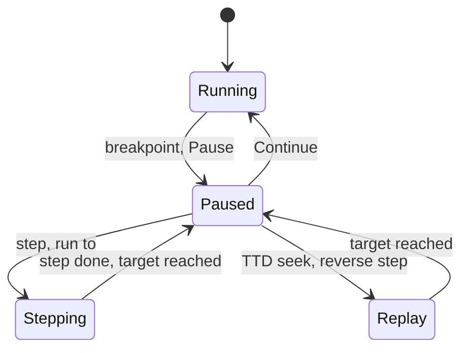
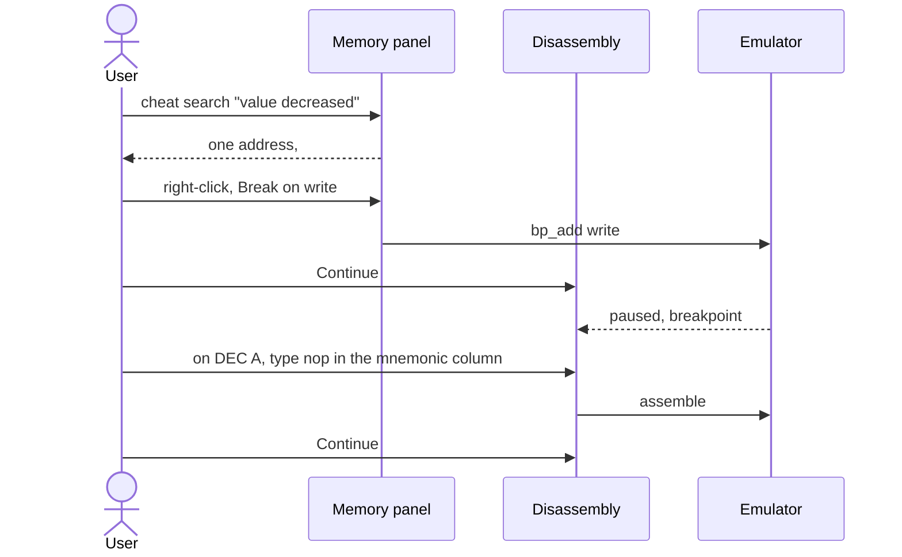

# GUI requirements and design brief: the main debugger

- **Date:** 2026-09-28
- **Status:** draft for review. Ready to hand to a design agent for mockups
  and a visual design.
- **Part of:** [the debugger model](README.md). This is the **GUI skin of the
  main-CPU debugger**. The card debugger (GS, then NeoGS) is a delta on top
  of this document: [gui-card-debugger.md](gui-card-debugger.md).
- **Fixed elsewhere:**
  - what each widget contains: [widget-catalog.md](widget-catalog.md);
  - how things behave: [rules.md](rules.md);
  - the data: [protocol.md](protocol.md).
- **Not a reference:** the current Qt debugger. It is replaced, not restyled.
- **The content reference:** the Unreal Speccy monitor
  ([TDD-DBG-01](../2026-09-24-tui-debugger/TDD-DBG-01_unreal-speccy-debugger-tui.md),
  [TDD-DBG-02](../2026-09-24-tui-debugger/TDD-DBG-02_unreal-tsconf-debugger-tui.md)).
  Every one of its widgets and fields is kept. The 80×30 grid is not.

> **In one line.** A pro-grade Spectrum debugger that keeps everything the
> Unreal monitor shows, drops the text-grid limits, and is ready to pair with
> the card debugger.

## Contents

- [0. For the design agent](#0-for-the-design-agent)
- [1. The product](#1-the-product)
- [2. People and jobs](#2-people-and-jobs)
- [3. The mental model](#3-the-mental-model)
- [4. Requirements](#4-requirements)
- [5. Layout and workspaces](#5-layout-and-workspaces)
- [6. Widget presentation](#6-widget-presentation)
- [7. Extension slots for other CPUs](#7-extension-slots-for-other-cpus)
- [8. States](#8-states)
- [9. Key flows](#9-key-flows)
- [10. Visual language and skins](#10-visual-language-and-skins)
- [11. Keyboard and mouse](#11-keyboard-and-mouse)
- [12. Browser and other front-ends](#12-browser-and-other-front-ends)
- [13. Example data for the mockups](#13-example-data-for-the-mockups)
- [14. Mockups to produce](#14-mockups-to-produce)
- [15. Acceptance checklist](#15-acceptance-checklist)

## 0. For the design agent

1. **Read §1-§3.** The debugger is **widgets with fixed fields, skinned
   freely**, arranged in workspaces.
2. **The catalog is the content contract.**
   [widget-catalog.md](widget-catalog.md) lists every field of every widget.
   Each mockup of a widget shows all its fields, with the example values of
   §13, unless this document marks a field optional.
3. **§4 are the requirements** (IDs `G1`…). Your design is checked against
   them and against §15.
4. **§5-§6 give the layout as ASCII wireframes.** They fix **what goes
   where** and the proportions; the look is yours. You may improve the
   layout; say what you changed and why.
5. **§7 reserves places for a second CPU.** Design them as empty or hidden
   slots here; the card document fills them.
6. **§10 gives the tokens and the skin rules.** Deliver the **Modern** skin
   in light and dark. The **Classic Unreal** skin is a smaller, separate
   deliverable.
7. Where the text says **Decide**, give one recommendation with its reason.

## 1. The product

**Five promises:**

1. **Nothing is lost.** Every field the Unreal monitor shows is here, in a
   form that reads better.
2. **Everything is where you look.** Click a register to see its address in
   memory, a stack entry to see its caller, a page chip to open that page.
3. **Fast to read, fast to act.** Dense, calm and instant: a step redraws
   everything within one display frame.
4. **Beyond Unreal:**
   - call stack;
   - expression watches;
   - device boards;
   - time-travel history;
   - page-aware breakpoints and labels;
   - navigation history;
   - a command palette.
5. **Any look, same truth.** Modern, Classic Unreal, terminal or browser: the
   same fields, the same rules.

**What changes against the Unreal monitor:**

| Unreal | Here | Why |
|---|---|---|
| an 80×30 grid of fixed rectangles | dockable panels in workspaces | G1, G2 |
| modal: emulation stops and the screen is replaced | not modal; the emulator window stays live | rules §1 |
| watches: 3 addresses | expression watches with types | catalog §2.7 |
| the screen preview replaces the watches | its own panel | G1 |
| memory editor sources cycled with Ctrl+D | a space selector on the panel | catalog §2.3 |
| a native Breakpoints Manager dialog | a panel: kind, page, condition, hits, groups | catalog §7.1 |
| no call stack, history, statistics | panels | catalog §2.6, §7.3 |
| the TSConf register board at x = 88 | the generic device-board panel | catalog §4 |
| labels replace the bytes column | labels get their own column | §6 |

## 2. People and jobs

| Persona | Who | Top needs |
|---|---|---|
| **Game hacker** | cracks, trains and patches games | cheat search, break on write, disassemble, patch, save a block |
| **Demo coder** | tight effects | T-exact timing, the beam position, contention, frame stepping |
| **Reverse engineer** | documents old software | labels, XAS / ALASM import, "who wrote this", call stacks, disassembly export |
| **Emulator developer** | checks accuracy | device boards, ports, the history, scripting |
| **Tool builder / AI agent** | drives it by script | every widget through the protocol, live events |

**Jobs** (the acceptance stories for the mockups):

| # | Job | Widgets |
|---|---|---|
| J1 | **Break on a write and patch.** Search memory for the lives counter, set a write breakpoint, run, stop, disassemble, patch to `NOP`, continue. | `W.mem`, `W.bp`, `W.disasm` |
| J2 | **Time an effect.** Step a raster loop; watch the time delta, the beam line and pixel, and the contention; frame-step. | `W.time`, `W.screen`, `W.regs` |
| J3 | **Understand a subroutine.** Step over and into, the call stack, labels, back and forward, position slots. | `W.disasm`, `W.calls`, `W.labels` |
| J4 | **Who wrote this byte?** On a memory byte, right-click → who wrote; the history lists the writers with PC and label. | `W.mem`, `W.history` |
| J5 | **Inspect the disk interface.** Break when TR-DOS issues a read; see the WD1793 registers, the track and the sector in the disk editor. | `W.board.beta128`, `W.mem` (disk spaces) |
| J6 | **Script it.** An agent sets a condition breakpoint through MCP, waits for the pause event, reads a snapshot. | the protocol |

## 3. The mental model

- **Widgets, not windows.** The model has about 30 widgets (the catalog). A
  window is a **workspace**: a layout of widgets for one CPU. The same widget
  looks the same in every workspace.
- **A snapshot per pause.** While paused, nothing changes by itself. The UI
  shows the snapshot, marks what changed since the previous one, and
  refreshes after each step or edit (rules §4, §8).
- **Running is calm.** Live values update at most 10 times a second, are
  dimmed, and carry no change marks.
- **One CPU in this window.** The main debugger shows the main Z80. Other
  CPUs (a sound card) get their own window, which reuses this design
  ([gui-card-debugger.md](gui-card-debugger.md)).

## 4. Requirements

Priorities: **P0** is the first usable version, **P1** is complete, and
**P2** is later.

### 4.1 Workspaces and layout

| ID | Pri | Requirement |
|---|---|---|
| G1 | P0 | **Every widget is a dockable panel.** Panels can be moved, tabbed, split, collapsed, floated and closed. A closed panel returns through the View menu. |
| G2 | P0 | **Workspaces.** A named layout. Ship the presets Code (the default), Memory, Hardware, Timing and Time travel (§5). Users save their own. Layouts persist per workspace. |
| G3 | P0 | **One window per CPU.** This window shows `main`. The layout system and widget look are shared with the card debugger. |
| G5 | P1 | **Compact and wide.** The layouts work from 1280 × 720 to 3840 × 2160. Below 1280 px wide, the side panels collapse to icon rails. |
| G6 | P1 | **Detachable widgets** can live on another monitor: a memory view, a device board, the screen preview. |

### 4.2 Content and interaction

| ID | Pri | Requirement |
|---|---|---|
| G10 | P0 | **Full Unreal content.** Every field of the Unreal monitor's widgets is shown (the catalog marks their origin, U / T). |
| G11 | P0 | **Clickable meaning.** 16-bit values → the disassembly or memory; labels → their definition; stack entries → the caller; breakpoint rows → their location; page chips → the memory view of that page. |
| G12 | P0 | **Context menus on every widget**, with the widget's actions (catalog §8) and their keys. |
| G13 | P0 | **Edit in place** (rules §7): registers, flags, memory (hex and text), disassembly (address, bytes, assembly), watches, breakpoint rows. Invalid input says why, in place. |
| G14 | P0 | **Change marks:** registers, flags and memory bytes changed since the previous snapshot are highlighted (rules §8). |
| G15 | P0 | **Hover detail:** a value shows its other forms (hex, decimal, binary, characters, label); an instruction shows its timing and the flags it affects. |
| G16 | P0 | **Navigation history:** back and forward over disassembly and memory jumps (the Unreal jump stack), plus 8 position slots. |
| G17 | P1 | **Command palette** (Ctrl+Shift+P): every action by name, with its key. |
| G18 | P1 | **Search everywhere** (Ctrl+T): labels, addresses, breakpoints, actions. |
| G19 | P1 | **Copy anything as text:** a register set, a disassembly range (as source with labels), memory as hex or `DB` lines. |
| G21 | P1 | **Quick peek:** hovering any address anywhere (a register, an operand, a stack word, a log entry) shows a small panel with a few lines of disassembly, 16 bytes and their text, and the label (Spectaculator Quick Peek). |
| G22 | P1 | **Find by instruction text:** typing `ld a,(#5C3A)` assembles it and searches for the opcodes; finding an address can include relative jumps that reach it (Spectaculator, ZXSpin). |
| G23 | P1 | **Watches show what they point at:** next to a value, the bytes it points to. One-click watches for the system variables and the IM 2 vector (Spectaculator). |
| G24 | P1 | **Mark memory ranges** as code, byte, word or text, with line-break rules. The disassembly and memory views follow the marks (ZXSpin). The marks are saved in the debug project. |
| G25 | P1 | **Undo / redo** of memory and register edits, and a **patch maker** that turns edits into named patches (rules §7a). |
| G26 | P1 | **Debug project file:** breakpoints, probes, watches, marks, labels, comments and layout in one file next to the snapshot or disk, found automatically (Spectaculator `.dzx`). It includes the card CPU's state. |
| G27 | P2 | **Screen inspector:** the normal or the shadow screen, pixels only, a grid, flash off; right-click a pixel or an attribute to set a read / write breakpoint on its byte (Spectaculator). |
| G28 | P2 | **Graphics inspector:** view memory as tiles or sprites (width, height, pad bytes, masks); the address field takes an expression such as `IX` (Spectaculator). |
| G20 | P0 | **Whose CPU and whose pause.** The window shows its CPU (the identity color and the name) and the pause reason, as a pill that jumps to the cause. |

### 4.3 Quality

| ID | Pri | Requirement |
|---|---|---|
| G30 | P0 | **Instant.** A step redraws every visible widget within 16 ms on the reference machine. Scrolling the disassembly or memory never stutters. |
| G31 | P0 | **Calm while running.** Live widgets update at most 10 times a second, never flicker, and are marked `live`. |
| G32 | P0 | **Themes:** light and dark, both first-class (§10). |
| G33 | P0 | **Readable data:** monospace with tabular figures for every number; hex upper case; thousands separators in counts. |
| G34 | P1 | **Accessibility:** text contrast ≥ 4.5:1; state never shown by color alone; full keyboard operation; screen-reader names. |
| G35 | P1 | **Keyboard profiles:** Modern (default) and Classic Unreal (catalog §8), switchable; every key rebindable. |
| G36 | P1 | **Skins:** Modern (default) and Classic Unreal (§10.4), switchable at run time without losing state. |

## 5. Layout and workspaces

### 5.1 Code workspace (default)

```text
┌──────────────────────────────────────────────────────────────────────────────────────────────────┐
│ ● MAIN Z80 3.5 MHz │ ▶ ❚❚ │ ↓ ↷ ↑ ⇥ │ ⏭ frame │ Run to ▾ │ ⟲ TTD ◀ ▶ │  Paused by: breakpoint #7 · W #5C3A ▸ │
│ ◀ back ▶ fwd │ ⌕ search │ Workspace: Code ▾ │ Skin: Modern ▾                          ⚙         │
├──────────────────────────────────────────────────────────────────────────────────────────────────┤
│ [ slot S1: other-CPU strip, hidden when the machine has one CPU — see §7 ]                       │
├──────────────────┬────────────────────────────────────────────────┬──────────────────────────────┤
│ REGISTERS        │ DISASSEMBLY                  [labels ✓][bytes] │ WATCHES                      │
│ AF 1A43 AF' 0000 │   8120 3A 3A 5C  ld a,(LIVES)                  │  PC: 32 3A 5C C8 C3 ..  2:\ │
│ BC 0010 BC' 1721 │ ● 8123 3D        dec a          ; A=#03 → #02  │  SP: 03 81 00 00 ..         │
│ DE 8000 DE' 369B │ ▶ 8124 32 3A 5C  ld (LIVES),a   ; ← W bp #7    │  HL: 02 00 ..               │
│ HL 5C3A HL' 2758 │   8127 C8        ret z          ↓              │  LIVES = 2 (byte, dec)       │
│ IX 5C3A IY 5C3A  │   8128 C3 00 81  jp  GAMELOOP                  │  M(#5C3B) = #00              │
│ SP FF4A PC 8124  │ GAMELOOP:                                      ├──────────────────────────────┤
│ I 3F  R 12 IM 1  │   8100 76        halt                          │ STACK            CALLS       │
│ IFF 1 1  WZ 8124 │   ...                                          │ -2 0000          ▸ HIT+4     │
│ sZ5h3PNc         │                                                │ SP 8103 GAMELOOP  GAMELOOP  │
│ T 34,996 · Δ 13 T│                                                │ +2 1303          MAIN        │
├──────────────────┼────────────────────────────────────────────────┼──────────────────────────────┤
│ PAGES            │ MEMORY  [cpu ▾] #5C30                    [hex] │ PORTS          BETA 128      │
│ 0 ROM 1  BASIC ro│ 5C30  00 00 00 00 00 00 00 00 03 00 ... ....   │ FE:07 7FFD:10  CD:0000       │
│ 1 RAM 5       rw │ 5C3A  02 ◀changed                              │ 1FFD:–  EFF7:00 STAT:00      │
│ 2 RAM 2       rw │                                                │ cmos:0D       T:00/00 S:3C/80│
│ 3 RAM 0       rw │                                                │ AY  0 1C 1 01 … latched 7    │
└──────────────────┴────────────────────────────────────────────────┴──────────────────────────────┘
 frame 1,204 · T 34,996 · line 49 px 36 · contended · breakpoints 3 · TTD ● rec 0-1,204 · 50.00 fps
```

**Layout rules:**

- **Top bar:**
  - the CPU badge;
  - run control (Continue, Pause, Step, Step over, Step out, Run to cursor);
  - frame step;
  - Run to ▾ (T-states, scanline, pixel, next interrupt, next frame);
  - TTD back and forward;
  - the paused-by pill;
  - back / forward, search, the workspace and skin selectors, settings.
- **Slot S1** is reserved for another CPU (§7). With one CPU it takes no
  space.
- **Left column:** Registers (with `t`, Δ and flags inside), then Pages.
- **Center:** Disassembly on top, Memory below.
- **Right column:**
  - Watches;
  - Stack and Call stack side by side;
  - Ports, Beta 128 and AY as small device boards.
- **Status bar:**
  - frame, T, beam line and pixel;
  - contended or not;
  - the breakpoint count;
  - the TTD state;
  - the emulation speed.

### 5.2 Other presets

| Workspace | Emphasis | Panels |
|---|---|---|
| **Memory** | editing and ripping | a large Memory (16 bytes a row), a second Memory side by side (e.g. `cpu` and `page RAM7`), Watches, find results, the ripper state, Labels |
| **Hardware** | devices | every device board of the model (Beta 128, AY, TSConf …), Ports (full list), Screen preview |
| **Timing** | effects | Screen preview (ray mode) with the beam crosshair, Registers, Disassembly with cycle counts, Time (Δ, line, pixel), PC history |
| **Time travel** | history | the history scrubber, "who wrote / read / executed" results, Disassembly, Memory, Call stack |
| **Analysis** | what the code does over time | Trace (merged, loop-condensed), Event viewer (the ULA frame: port accesses, contention, border writes, probe marks), Profiler, Code / data log with coverage, Heat map, Register writers, Memory search |

## 6. Widget presentation

How each catalog widget looks in the Modern skin. The fields are in the
catalog; only the presentation is given here.

| Widget | Presentation |
|---|---|
| `W.regs` | A 4-column grid: main set · alternate set · pointers · I, R, IM, IFF, WZ. The flags as 8 toggle cells (letter lit when set). `t` and Δ in the panel footer. Badges: HALT, `HALT, interrupts off`, `after EI`, `DD prefix`. Changed values highlighted. Reserved: slot S3, the "inside an instruction" strip (§7). |
| `W.disasm` | Columns: gutter (breakpoint, PC, branch arrows) · address · page chip · bytes · label · mnemonic · cycles · hint. The branch at PC is an arrow drawn to the target line. The current line is highlighted, the cursor line outlined. A 3-way column cursor (address / bytes / mnemonic) for in-place editing, as Unreal. Divert banner: slot S4 (§7). |
| `W.mem` | Header: space selector (cpu, page, disk physical, disk logical, CMOS, NVRAM, palette), page picker, go-to, 8/16 bytes a row, hex / text dump, follow-register. Rows: address · bytes · text. Marks for PC, SP, watches and breakpoints; changed bytes highlighted. A split cursor (hex / text). The status line shows the cursor address in every form, and its label. The disk spaces show drive, track, sector and offset in the header; `track not found` as an empty state. |
| `W.pages` | 4 rows: window, address, a kind chip (ROM grey, RAM neutral, cache), page, the classic name (`BASIC`, `TRDOS`, `B128K`), `ro`, source (`7FFD #10`). A click opens that page in memory. |
| `W.stack` / `W.calls` | Side by side, or tabs. Stack rows: offset · address · value · label, with return addresses marked. Calls: `HIT+4 ← GAMELOOP ← MAIN`, with `via` icons (call, rst, int, nmi). |
| `W.watch` | Rows: name or expression · value in its type · 8 bytes. The fixed register lines (PC, SP, BC, DE, HL, IX, IY, BC', DE', HL'), then the user watches. Add, edit, remove inline. The `DOS` indicator in the title. |
| `W.time` | A compact strip: `Δ 13 T · T 34,996 · frame 1,204 · line 49 px 36`. |
| `W.pchist` | A list, newest first: `page:address label`. Click to go there. |
| `W.ports` | The classic block (FE, 7FFD, extended, EFF7) with the 48K-lock state, expandable to the full port list. |
| `W.screen` | The picture at integer scale, a mode switch (screen / ray / alt screen), and a beam crosshair in ray mode. |
| `W.board.*` | The generic board renderer: columns → groups (a title and the raw value) → controls. A control renders by type: hex, bits as named toggle cells, enum as a chip, counter with separators, rate with a sparkline, bar, LED. |
| `W.bp` | A table: ID · CPU chip · kind icon · where (address / range / port / condition) · page · condition · hits · group · note · enabled. Filter chips by kind (and by CPU, slot S5). The editor is a side sheet with every field. |
| `W.labels` | A table: name · address · page · type · source chip · comment, with an incremental filter (Jump to Label). Import (XAS, ALASM), load, save. |
| `W.history` | A scrubber over the recorded frames, with markers and bookmarks; "who wrote / read / executed" results as a list. |
| `W.trace` | A virtualized list, one line per instruction, in the user's format: `[f1204 T34996] 8124 GAME+4 ld (LIVES),a A=02`. Condensed loops are one line with a count, expandable. A filter bar (CPU, ISR only, condition). A click jumps to the moment (TTD) or the address. |
| `W.events` | The ULA frame as a canvas: 312 lines × 224 T (Pentagon: 320 × 224), dots by category (port reads and writes, contention waits, border writes, interrupts, probe marks), the current beam position, and ghosted dots from the previous frame. A category legend with toggles; hovering a dot gives its details; a click goes there. |
| `W.profiler` | A sortable table: routine · calls · inclusive cycles · exclusive cycles · min · max · average; the hottest rows highlighted. |
| `W.cdl` | Per page space: code / data / untouched as stacked bars and percentages; a strip map per page (one cell per 256 bytes). |
| `W.heatmap` | A glowing grid over a page space, one color per bus master, with decay; a list of the touched ranges. |
| `W.regwriters` | A table: port · name · value · writer PC + label · frame · master. |
| `W.search` | The classic cheat search: snapshot, filter (==, !=, <, >, delta), results with add watch / add label. |

## 7. Extension slots for other CPUs

The main debugger reserves these places. With a single CPU they are hidden
and take no space. [gui-card-debugger.md](gui-card-debugger.md) defines what
fills them.

| Slot | Where | Purpose |
|---|---|---|
| S1 | under the top bar, full width | a one-line strip for another CPU |
| S2 | the paused-by pill | the pause may come from another CPU; the pill names it and jumps there |
| S3 | the top of `W.regs` | the "inside an instruction" strip, when this CPU was stopped by another |
| S4 | the tops of `W.mem` and `W.disasm` | a banner when a device changes what this CPU reads (e.g. DMA diverting reads) |
| S5 | `W.bp` | a CPU column and filter; more breakpoint kinds coming from other CPUs' devices |
| S6 | the Debug menu and the toolbar | an entry to open another CPU's debugger, and "Step other" |

## 8. States



| State | Toolbar | Values | Banner |
|---|---|---|---|
| **Running** | Pause only | last values, dimmed, the `live` chip | – |
| **Paused** | all | editable, change marks | the paused-by pill |
| **Stepping** (a long run-to) | Pause | dimmed | `Running to #8000…` |
| **Replay** (TTD) | the TTD controls | read-only | `TTD replay` |
| **Run control held** (GDB) | disabled | as the state | `Run control is held by gdb` |
| **TTD recording** | normal | edits refused, with the reason | the REC chip |
| **Ripper armed** | normal | normal | the `RIP` badge |

## 9. Key flows

### 9.1 Break on write and patch (J1)



### 9.2 Understand a subroutine (J3)

1. Step over the `CALL`; the call stack stays one frame deep.
2. Step into the next `CALL`: the call stack grows. The disassembly jumps
   there, and the back button returns.
3. Add a label on the routine (right-click → add label). It appears at every
   call site.

## 10. Visual language and skins

### 10.1 Principles

- **Dense but calm.** A pro tool: monospace data, tight rows, hierarchy by
  weight and color, no decoration.
- **Identity colors** are used only for CPU identity: the badge, the window
  accent, CPU chips.
- **State over chrome.** The pause reason, changes and errors are pills,
  badges and highlights.
- **Light and dark, both first-class.** The dark palette follows the HUD's
  default theme (DarkGlass), so the debugger and the HUD look like one
  product.

### 10.2 Tokens (Modern skin)

| Token | Light | Dark | Use |
|---|---|---|---|
| `bg/window` | `#F7F8FA` | `#10141C` | window |
| `bg/panel` | `#FFFFFF` | `#161B26` | panels |
| `bg/row-alt` | `#F2F4F7` | `#1B2130` | zebra rows |
| `text/primary` | `#1F2937` | `#E2E8F0` | values |
| `text/secondary` | `#6B7280` | `#94A3B8` | labels, units |
| `cpu/main` | `#0284C7` | `#38BDF8` | the main CPU identity (other CPUs' colors: the card document) |
| `code/address` | `#6B7280` | `#94A3B8` | addresses |
| `code/bytes` | `#9CA3AF` | `#64748B` | opcode bytes |
| `code/label` | `#7C3AED` | `#C4B5FD` | labels |
| `code/mnemonic` | `#111827` | `#F1F5F9` | mnemonics |
| `code/number` | `#B45309` | `#FBBF24` | numbers in operands |
| `code/comment` | `#16A34A` | `#86EFAC` | hints, comments |
| `state/pc` | `#FEF08A` | `#FACC15` at 25% | the PC line |
| `state/cursor` | `#BFDBFE` | `#1E3A8A` | the cursor |
| `state/breakpoint` | `#DC2626` | `#F87171` | breakpoint marks |
| `state/changed` | `#FDE68A` | `#854D0E` | changed values |
| `state/error` | `#DC2626` on `#FEE2E2` | `#FCA5A5` on `#450A0A` | errors, the 48K lock |
| `state/ok` | `#16A34A` | `#4ADE80` | OK, running |
| `mem/rom` · `mem/ram` · `mem/cache` | `#6B7280` · `#374151` · `#9333EA` | `#9CA3AF` · `#CBD5E1` · `#C084FC` | page chips |

### 10.3 Type and spacing

- **Data:** Consolas (bundled), 13 px in panels, 14 px for registers.
  Tabular figures.
- **UI text:** the system UI font, 12-13 px.
- **Spacing:** a 4 px grid; rows 20 px in dense tables, 24 px in forms.
- **Changed values** stay highlighted until the next step.

### 10.4 Skins

| Skin | Deliverable | Rules |
|---|---|---|
| **Modern** | every mockup, light and dark | the tokens above |
| **Classic Unreal** | M11: the Code workspace | The same panels and layout system. The look of the Unreal monitor: the 8×16 font and the palette of TDD-DBG-01 §1.3-§1.6; the named attributes (`W_SEL` blue focus, `W_TRACEPOS` PC line, `W_CURS` cursor, bright ink for changes); the green info panels; the ▒ background. A theme of the same widgets, not the 80×30 grid (the grid is the terminal skin). |
| **HUD themes** (optional) | a token remap | RetroZX, AmberCRT, EmeraldCRT, Cyberpunk from the HUD theme set, as color tokens only |

## 11. Keyboard and mouse

- **Profiles:** Modern (default) and Classic Unreal. The full table is
  catalog §8. The most-used Modern keys:

| Action | Key |
|---|---|
| Continue / Pause | F5 / F6 |
| Step into / over / out | F11 / F10 / Shift+F11 |
| Run to cursor | Ctrl+F10 |
| Frame step | F9 |
| Toggle breakpoint | F2 or Ctrl+B |
| Go to | Ctrl+G |
| Back / forward | Alt+← / Alt+→ |
| Command palette / search everywhere | Ctrl+Shift+P / Ctrl+T |
| Main debugger | Ctrl+1 |

- **Mouse:**
  - a click focuses and places the cursor;
  - a double-click edits;
  - a right-click opens the context menu;
  - the wheel scrolls;
  - drag a value onto memory or the disassembly to jump there.
- **Every toolbar button shows its key** in the tooltip.

## 12. Browser and other front-ends

The same model reaches a browser through the WebAPI and the WebSocket event
stream ([protocol.md](protocol.md) §5). The design delivers an optional
browser layout (M12): Registers, Disassembly and Memory at 1280 px, driven
by the `paused` / `step_done` events and `GET /debug/snapshot`.

## 13. Example data for the mockups

The main CPU, paused by write breakpoint #7:

- **Registers:** AF `1A43`, BC `0010`, DE `8000`, HL `5C3A`; AF' `0000`,
  BC' `1721`, DE' `369B`, HL' `2758`; IX `5C3A`, IY `5C3A`, SP `FF4A`,
  PC `8124`; I `3F`, R `12`, IM 1, IFF 1 1, WZ `8124`; flags `sZ5h3PNc`;
  T `34,996`, Δ `13 T`.
- **Disassembly:**
  - `8120 3A 3A 5C ld a,(LIVES)`;
  - `● 8123 3D dec a ; A=#03 → #02`;
  - `▶ 8124 32 3A 5C ld (LIVES),a`;
  - `8127 C8 ret z`;
  - `8128 C3 00 81 jp GAMELOOP`;
  - `GAMELOOP: 8100 76 halt`.
- **Pages:** `ROM 1 (BASIC) ro`, `RAM 5`, `RAM 2`, `RAM 0` (7FFD `#10`).
- **Stack:** `-2 0000`, `SP 8103 GAMELOOP+3`, `+2 1303`.
- **Calls:** `HIT+4 ← GAMELOOP ← MAIN`.
- **Watches:** `LIVES = 2`, `M(#5C3B) = #00`.
- **Ports:** FE `07`, 7FFD `10`, EFF7 `00`, cmos `0D`.
- **Beta 128:** CD `0000`, STAT `00`, SECT `01`, T `00/00`, S `3C/80`.
- **AY:** registers `1C 01 20 03 00 00 1F F8 0F 0F 00 00 00 00 FF BF`,
  latched 7.
- **Machine:** frame `1,204`, line `49`, pixel `36`, contended, TTD
  recording frames 0-1,204.

## 14. Mockups to produce

Each frame in the Modern skin, light and dark, unless it says otherwise.

| # | Frame | State | Must show |
|---|---|---|---|
| M01 | Code workspace | paused by write bp #7 | every panel of §5.1, the paused-by pill, change marks; slot S1 hidden |
| M02 | Memory workspace | paused | two memory panels, cheat search results, the context menu on a byte |
| M03 | Hardware workspace | paused | Beta 128, AY and ports boards; the screen preview in ray mode with the beam |
| M04 | Timing workspace | stepping | the cycles column, Δ, the beam, PC history |
| M05 | Time travel workspace | TTD replay | the scrubber, "who wrote" results |
| M06 | Breakpoints panel and editor | several kinds | kinds (exec, write, port, condition), page, hits, groups; the editor side sheet |
| M07 | Labels panel | – | sources, the filter, import |
| M08 | Registers, detail | after a step | changed values; badges HALT and after EI |
| M09 | Disassembly, detail | at a taken branch | arrows, page chips, labels column, cycles, hint, in-place assembly edit |
| M10 | Running and held states | running; run control held | dimmed live values, banners |
| M11 | Classic Unreal skin | Code workspace | the Unreal look on the new panels |
| M12 | (optional) Browser skin | paused | Registers, Disassembly, Memory at 1280 px |
| M13 | Component sheet | – | pills, badges, CPU chip, page chips, breakpoint icons (● stop, ✎ log, ◆ mark, # count), board controls by type, in both themes |
| M14 | Analysis workspace | paused after a run | Trace with a condensed loop, Profiler, Code / data log |
| M15 | Event viewer (ULA frame) | paused mid-frame | categories, the beam, ghosted dots, a hovered dot |
| M16 | Heat map and register writers | running | the glow by master, the writers table |
| M17 | Breakpoint editor, a probe | – | action `log` with a format, a forbid range, "before the access", the four hit-count rules, the error state of a condition |
| M18 | Quick peek and find by instruction | – | the hover panel over an operand; the find dialog with instruction text |
| M19 | Screen and graphics inspectors | paused | the pixel context menu (break on write), a tile view at `IX` |
| M20 | Memory marks, undo, patches | after edits | a range marked as text, the undo list, "save as patch" |

## 15. Acceptance checklist

- [ ] **Unreal parity:** every Unreal field (catalog, origin U / T) is on at
  least one mockup.
- [ ] **Whose pause** is visible in every paused frame.
- [ ] **Extension slots** S1-S6 are placed and hidden in the single-CPU
  frames, and it is clear where they appear.
- [ ] **States:** every row of §8 appears at least once.
- [ ] **Themes:** light and dark legible; contrast ≥ 4.5:1 for text and
  3:1 for marks.
- [ ] **Sizes:** at 1280 × 720 nothing essential is cut.
- [ ] **Keyboard:** every toolbar action shows its key.
- [ ] **Plain words:** "Paused by: breakpoint #7 (write #5C3A)", never
  internal names.
- [ ] **Skins:** M11 uses the same panels as M01, with only the look
  changed.
