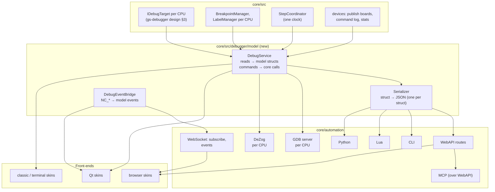

# Protocol

- **Date:** 2026-09-28
- **Status:** draft for review. Built for the main CPU (2026-10-03): the step's `PauseEvent` fields
  in the `/step` / `/steps` replies (`stop`), and §5's WebSocket channel with the `debug` topic
  (`paused`, `resumed`, `step_done`, `breakpoints_changed` with `{cpu, ids[]}`; `seq` per emulator).
  §7's `/registers` additions (`memptr`, `q`, `halted`, `boundary`, `t`) and the `Breakpoint` `page` as
  `{kind, page}` (CLI `--page ram5`) are on every surface. The `Breakpoint` fields `address_end`, `page`
  (physical: any slot that shows the page; `slot_only` for one slot), `port_mask`, `hit_count` and the hit
  policy (`hit_target` + `hit_mode` = always / equal / at_least / multiple) are built (2026-10-04,
  [hotpath-matching-design.md](../2026-08-17-conditional-breakpoints/hotpath-matching-design.md)). Not yet: `cpu` other than main, `positions`, `edited`, `targets_changed`,
  `run_control`, the other topics.
- **Part of:** [the debugger model](README.md). It carries the fields of
  [widget-catalog.md](widget-catalog.md) under the rules of
  [rules.md](rules.md).

One data model and one command set for every front-end and every automation
surface. This document fixes:

- the JSON names;
- where every field comes from in the core;
- how each surface carries each read and command (WebAPI, WebSocket, CLI,
  MCP, Lua, Python, GDB, DeZog).

A field added to the model is added here, once, and every surface gets it.

## Contents

- [0. Principles](#0-principles)
- [1. Architecture](#1-architecture)
- [2. Addressing](#2-addressing)
- [3. Data model and field sources](#3-data-model-and-field-sources)
- [4. Commands](#4-commands)
- [5. Events](#5-events)
- [6. Surface bindings](#6-surface-bindings)
- [7. Compatibility](#7-compatibility)
- [8. Cost](#8-cost)
- [9. Documentation to update](#9-documentation-to-update)
- [10. Tests](#10-tests)

## 0. Principles

1. **One name per field, everywhere.**
   - JSON field names are the names in the widget catalog.
   - C++ structs use the same names in camelCase.
   - The CLI prints the same names.
   - Lua tables and Python dicts use the same keys.
2. **One serializer.** Every surface reads the same C++ structs, turned into
   JSON by one function per struct. The CLI, Lua and Python use that JSON (or
   the structs) instead of formatting fields on their own. Divergence between
   surfaces then cannot happen.
3. **`cpu` selects the CPU.** Every CPU-related read and command takes `cpu`:
   `main` (the default), `gs`, `neogs`, or `card` (whichever card CPU is
   fitted). The name `target` is not used: MCP already uses it for the
   emulator instance.
4. **Additive.** Existing routes, commands and fields keep their meaning.
   Without `cpu` they act on the main CPU, as today.
5. **Push, never poll while paused.** Pauses, steps and edits are events
   (§5). A client refreshes on events.

## 1. Architecture

**Today** (the automation inventory, 2026-09-28):
- every surface calls the core directly, and each formats its own output;
- MCP calls the WebAPI;
- the WebAPI WebSocket is a stub: it publishes nothing, and it has no
  subscription protocol;
- the breakpoint notification payload has no CPU field;
- the step notification has no payload at all.

**Target:**



- **`DebugService`** (new, `core/src/debugger/model/debugservice.{h,cpp}`) is
  the one place where the protocol meets the core.
  - It has one method per read (`GetSnapshot`, `GetRegisters`, `Disassemble`,
    `ReadMemory`, `GetBoards`, …) and one per command (`Step`, `AddBreakpoint`,
    …).
  - Each takes a `cpu` and returns a model struct or a `DebugError`.
  - It runs reads under the pause (§4.3). It hands commands that must run on
    the emulation thread to the coordinator.
- **Qt skins** call `DebugService` in-process and subscribe to the event
  bridge. They never reach into `Emulator`, `Memory` or `Z80`.
- **The serializer** (`debugjson.{h,cpp}`) is the only JSON writer for these
  structs.

## 2. Addressing

| Thing | Form | Examples |
|---|---|---|
| Emulator | the id or `active` (WebAPI path), `target` (MCP), the selected instance (CLI, Lua, Python) | `/api/v1/emulator/a1/…` |
| CPU | `cpu=main\|gs\|neogs\|card` | `?cpu=card` |
| CPU address | hex with `#`, `$`, `0x`, or a plain number where hex is implied | `#8000`, `$8000`, `0x8000` |
| Physical address | `<KIND><page>:<offset>`, where KIND is `ROM`, `RAM`, `FL` (flash) or `CACHE` | `ROM0:0038`, `RAM5:0100`, `FL3:1000` |
| Label | a name, optionally `name+offset` | `COM30`, `PLAYMUS+12` |
| Memory space | `cpu`, `page`, `disk_phys`, `disk_log`, `cmos`, `nvram`, `comp_pal`, `card_flash`, `sd_block` | `space=page&page=RAM5` |
| Board | `board=<id>` | `board=neogs_dma` |

The **`card` alias** resolves when the request arrives. It resolves to `gs`
or `neogs` by the fitted card. With an LW card or no card it fails, with the
error `cpu_unavailable` and a reason.

## 3. Data model and field sources

The **Source** column names where the value comes from in the core. The
**St.** column says whether that source exists today (`✓`), exists in part
(`~`) or is new (`new`, with the design section that adds it). "gsd" is
[gs-debugger/design.md](../2026-09-27-gs-debugger/design.md); "nad" is
[neogs-automation-design.md](../2026-09-19-general-sound/neogs-automation-design.md).

### 3.1 `DebugTarget`

| Field | Type | Source (main) | Source (gs / neogs) | St. |
|---|---|---|---|---|
| `cpu` | enum | – | – | – |
| `name` | string | `"Main Z80"` | `"GS Z80"`, `"NeoGS Z80"` | new |
| `available` | bool | always | `GeneralSoundCard::hasCoprocessor()` and the implementation | ✓ |
| `clock_hz` | u32 | the main CPU clock including turbo (the `Core` clock) | GS: `GSClassicTiming::CLOCK_HZ` (12 MHz); NeoGS: `SoundChip_NeoGS::cardClockHz()` | ✓ |
| `unit` | enum{t, cycle} | `t` | `cycle` | – |
| `time_unit_hz` | u64 | 3.5 MHz × turbo | GS 12e6; NeoGS 120e6 base ticks (`TICKS_PER_SECOND`) | ✓ |
| `state` | enum{running, paused, stepping, unavailable} | the emulator state | the same, and `unavailable` | ~ |
| `firmware` | `FirmwareProfile` or null | – | §3.13 | new |
| `capabilities[]` | list | `["regs","disasm","mem","pages","stack","ports","screen"]` | `["regs","disasm","mem","pages","stack","cmdlog",…]` | new |

### 3.2 `Registers` (`W.regs`)

| Field | Type | Source: main (`Z80Registers`, `emulator/cpu/z80.h`) | Source: card (`Z80CpuRegisters`, `3rdparty/unreal-z80/z80cpu.h:219`) | St. |
|---|---|---|---|---|
| `a`, `f` | u8 | `a`, `f` | from `af` | ✓ |
| `bc`, `de`, `hl`, `ix`, `iy`, `sp`, `pc` | u16 | the same names | the same names | ✓ |
| `af_alt`, `bc_alt`, `de_alt`, `hl_alt` | u16 | `alt.af`, `alt.bc`, `alt.de`, `alt.hl` | `afAlt`, `bcAlt`, `deAlt`, `hlAlt` | ✓ |
| `i` | u8 | `i` | `i` | ✓ |
| `r` | u8 | `(r_low & 7F) \| (r_hi & 80)` | `r` (full) | ✓ |
| `im` | u8 | `Z80::im` | `im` | ✓ |
| `iff1`, `iff2` | bool | `iff1`, `iff2` | `iff1`, `iff2` | ✓ |
| `halted` | bool | `halted` | `halted` | ✓ |
| `dihalt` | bool | `halted && !iff1` | `halted && !iff1` | – |
| `memptr` | u16 | `memptr` | `memptr` | ✓ |
| `q` | u8 | `q` | `q` | ✓ |
| `boundary` | enum | from the main core's instruction-boundary state (EI shadow, prefix) | `boundary` (`Z80CpuBoundary`: None, PrefixDd, PrefixFd, IntShadow, LdAIr, NmiAck) | ~ |
| `t` | u32 | `t` (T since the frame start) | GS: `totalGsCycles() − _frameStartGsCycles`; NeoGS: `(cardTicks() − _frameStartTicks) / _ticksPerCycle` | ✓ |
| `last_branch` | u16 | `Z80::last_branch` | the card runner records it in `onStep` | new (card) |
| `clock_hz` | u32 | as `DebugTarget` | as `DebugTarget` | ✓ |

**Card access:** through the new `GSDebugAccess::cpuRegisters()` (gsd §3.1),
which wraps `Z80CpuGetRegisters(_cpu)`. Today only `getCPUReg(GSCpuRegister)`
exists; it lacks Q, halted, boundary and NMI-in-progress.

### 3.3 `DisasmRequest` / `DisasmLine` (`W.disasm`)

Request: `{cpu, address | label, count, labels: bool, hints: bool}`.

| Field | Type | Source | St. |
|---|---|---|---|
| `address`, `length`, `bytes[]`, `mnemonic` | – | `Z80Disassembler::disassembleSingleCommand` on bytes read through the target's `peek` | ✓ (main) / new (card: the disassembler takes an `IDebugTarget`, gsd §3.3) |
| `page` | `{kind, page}` | `IDebugTarget::mapAddress(address)` | new |
| `label`, `target_label` | string | the CPU's `LabelManager`, page-aware lookup (gsd §3.3) | ~ |
| `cycles.t`, `cycles.t_alt` | u8 | the opcode record's `t`, `met_t`, `notmet_t` (`z80disasm.h:21-28`); for a card, the same table (it gives card cycles, since the card is a Z80 too) | ✓ |
| `hint` | string | `getRuntimeHints` (main today); the target-generic version for cards | ~ |
| `is_pc`, `breakpoint` | – | the target's PC; its `BreakpointManager` | ✓ |
| `branch{taken, target, flags}`, `next_pc` | – | branch analysis as U §4.2.4, a helper in the disassembler (`Z80ControlFlowDecoder`) | ~ |

### 3.4 `CpuPosition` and `Timeline` (`W.timeline`)

| Field | Type | Source | St. |
|---|---|---|---|
| `position.cpu` | enum | – | – |
| `position.cycles` | u64 | main: frame × frame length + `t`; card: `GSDebugAccess::cardTime()` | new |
| `position.on_boundary` | bool | the coordinator's park point (gsd §5.3) | new |
| `position.instr_pc` | u16 | main: `Z80::m1_pc`; card: `Z80CpuInstructionPc` | ✓ |
| `position.instr_start_t` | f64 | main: the new `Z80::instrStartTT` (gsd §5.4) | new |
| `position.elapsed_t`, `total_t`, `total_t_alt` | f64 | gsd §5.4: `tShown − instrStartT`; totals from `instructionTiming` | new |
| `position.bus_cycle`, `bus_cycles[]` | enum, list | the per-opcode M-cycle table (`mcycles`, gsd §5.4) | new |
| `position.contended`, `wait_t` | bool, f64 | the contention accumulated in this instruction; NeoGS ZX-DMA waits (zxdma design §6.2) | new |
| `position.gap_t`, `gap_cycles` | f64 | the coordinator (gsd §5.3) | new |
| `now.frame`, `now.main_t` | u32, f64 | the coordinator | new |
| `sync_mode` | enum{lazy, tight} | the coordinator's tight flag (gsd §5.2, zxdma design §6.1) | new |
| `lanes[].recent[]` | list | a small per-CPU ring (32 instructions) of `{pc, start, duration}`, filled only while the timeline is shown | new |
| `markers[]` | list | breakpoint hits, host port accesses (the card port trace hook), clock changes (NeoGS `onStep` when `_nextTicksPerCycle` changes), ZX-DMA accesses, INT / NMI | new |

### 3.5 `MemoryRead` / `MemoryWrite` (`W.mem`)

Request: `{cpu, space, page?, drive?, track?, sector?, address, length}`.

| Space | Source | St. |
|---|---|---|
| `cpu` (main) | `Memory::DirectReadFromZ80Memory` | ✓ |
| `cpu` (card) | `GSDebugAccess::peek` (GS: through `_bankR` with no DAC fetch; NeoGS: `NeoGSMemory::peek`) | ~ (NeoGS has `peek`; GS has `peekCardMemory`) |
| `page` (main) | the physical page buffers (`GetPhysicalAddressForZ80Page`) | ✓ |
| `page` (card) | `GSDebugAccess::peekPage(kind, page, offset)`: GS `_rom` / `_ram`; NeoGS `NeoGSMemory::ram()` / `flash().data()` | new |
| `disk_phys`, `disk_log` | the FDC disk image of the drive | ✓ (U §4.4) |
| `cmos`, `nvram` | CMOS / EvoAvr | ✓ |
| `card_flash` | `Flash29F040B::data()` | ✓ |
| `sd_block` | `SdCardSpi::readBlock` (no protocol side effects) | ✓ |

**Writes:**
- main: `Memory::DirectWriteToZ80Memory`, and the page writes;
- card: `GSDebugAccess::poke` / `pokePage`. NeoGS has `poke`; GS needs it
  (new).
- Flash is written to the array directly (rules §7).

### 3.6 `Breakpoint` (`W.bp`)

| Field | Type | Source | St. |
|---|---|---|---|
| `id`, `enabled`, `group`, `note`, `owner` | – | `BreakpointDescriptor` (`breakpointmanager.h:52-80`) | ✓ |
| `cpu` | enum | which CPU's `BreakpointManager` holds it | new |
| `kind` | enum | `type` + `memoryType` / `ioType` / `keyType`; new `BRK_EVENT` and protocol kinds (gsd §4.1) | ~ |
| `address`, `address_end` | u16 | `z80address`; ranges are new | ~ |
| `page` | `{kind, page}` or null | `pageType`, `page`, `bankOffset`; the key changes to the physical address (gsd §3.3) | ~ |
| `port`, `port_mask` | u16 | `z80address` for IO; the mask is new | ~ |
| `condition` | string | the condition engine (conditional-breakpoints design) | new |
| `event`, `event_value`, `protocol`, `command_filter`, `byte_index` | – | `BRK_EVENT` descriptors (gsd §4.1, zxdma design §6.3) | new |
| `hit_count`, `hit_target` | u32 | new counters in the descriptor | new |
| `available` | bool | the CPU exists now | new |

### 3.7 `Pages` (`W.pages`)

| Field | Source (main) | Source (card) | St. |
|---|---|---|---|
| `windows[i].kind`, `page`, `read_only` | `Memory::GetZ80BankFromAddress` / the bank mode | GS: `_bankR` / `_bankW` against `_rom` / `_ram`; NeoGS: `NeoGSMemory::page(w)`, `isFlash(w)`, the write protection (RAMRO + NOROM) | ✓ / ~ |
| `windows[i].name` | `Memory::GetCurrentBankName(i)` and the U §4.8 rules | `ROM n` / `RAM n` / `FL n` | ✓ |
| `windows[i].source` | the port decoder's last paging write (`7FFD`, `1FFD`, …) | GS: `MPAG`; NeoGS: `PG0`-`PG3`, `MPAG`, `MPAGEX` | new |

### 3.8 `Stack`, `Calls`, `Watches`, `Time`, `PcHistory`

| Object | Fields | Source | St. |
|---|---|---|---|
| `Stack` | `entries[]{offset, address, value, label, is_return}` | reads at SP through the target | ✓ (the labels are new) |
| `Calls` | `frames[]{pc, label, sp, via}`, `source` | the TTD call trace (the `calltrace` analyzer) or the stack heuristic | ~ |
| `Watches` | `lines[]`, `user[]{address \| expr, type}` | the target reads; the expressions use the condition engine | ~ |
| `Time` | `delta`, `frame`, `t_in_frame`, `line`, `pixel`, `mark_reason` | a per-CPU time mark kept by `DebugService`; beam from the screen | new |
| `PcHistory` | `entries[]{page, address, label}`, `depth` | a per-CPU M1 ring, filled on the debug path only (main: `RecordInstructionStart`; card: the runner's `onStep`) | new |

### 3.9 `Ports` (`W.ports`)

| Field | Source | St. |
|---|---|---|
| `fe`, `p7ffd`, `ext`, `cmos_addr`, `eff7`, `lock48` | the port decoder's latched values (the model's decoder) | ✓ (not yet exposed) |
| `list[]{port, name, value, dir}` | the port decoder's registration table (`RegisterPortHandler`, `PortTag`) | new |

### 3.10 `Board` (`W.board.*`)

Each device implements a small interface:
- `IDebugBoard::describe(BoardDesc&)`, the layout (widget catalog §4);
- `IDebugBoard::values(BoardValues&)`, the control values, read without
  side effects.

| Board | Values from | St. |
|---|---|---|
| `beta128` | `WD1793` registers, the drive state | ✓ (not exposed) |
| `ay` | `SoundChip_AY8910` registers, the latched register | ✓ (not exposed) |
| `tsconf` | the TSConf port state (T §5.2) | when TSConf lands (#41) |
| `gs` | `getMPAG()`, `getChannelSample/Volume()`, the mailbox (`snapshotMailbox()`), `_intPending`, `_nmiPending`, `totalGsCycles() − _gsCyclesAbs` | ~ (the interrupt fields are new getters) |
| `neogs` | `neogsState(NeoGSStateInfo&)` (every field), `dacLevel()`, `stereoMode()`, `spi().readSctrl()`, the SSTAT bits | ✓ |
| `neogs_dma` | `NeoGSDma` (`running`, `address`, `moduleSelect`) + `NeoGSZxDma` getters + the nad §4.7 counters | ~ (the transaction counters are new, nad) |
| `neogs_sd` | `SdCardSpi` (`present`, `isSdhc`, `sizeBytes`, `initialized`, `lastCommand`, `lastArgument`, `writeMode`, `blocksRead`, `blocksWritten`), the media manager's `Info("sd.ngs")` for `source` and `write_protect`, the nad §4.9 counters | ~ |
| `neogs_mp3` | `Vs10xxDecoder` (`chip`, `running`, `dreq`, `streamRate`, `streamChannels`, `inputFill`, `pcmQueued`, `framesDecoded`, `samplesPlayed`, `bytesReceived`, `reg(i)`) + nad §4.10 | ~ |
| `neogs_flash` | `Flash29F040B` (`arrayMode`, `busyUntil`, `modified`), `flashTitle()`, `flashPersistPath()` + nad §4.11 | ~ |

### 3.11 `CommandLog` and `LogEntry` (`W.cmdlog`)

| Field | Source | St. |
|---|---|---|
| `recording`, `count`, `dropped`, `capacity` | `GSCommandLog`, owned by `SoundManager` (gsd §6.3) | new |
| `entries[]` | the 32-byte `GSCommandLogEntry` (gsd §6.3): `cardCycle` → `card_cycle`, `frame`, `mainT` → `main_t`, `mainPc` → `main_pc`, `kind`, `command`, `value` → `params[]` / `reply` / anomaly value, `destKind` + `destAddr` + `destPageFirst` / `destPageLast` → `dest`, `count`, `flags` | new |
| `command_name`, `params[].meaning`, `reply_meaning` | decoded at read time from the `FirmwareProfile` (not stored per entry) | new |
| `main_label`, `card_label` | resolved at read time from the CPUs' label managers | new |
| `card_pc` | the card PC at the card-side hook (debug path only) | new |
| `source` | a flag bit: sent by the debugger or by automation | new |

Paging: `?since=<seq>&limit=N`, with `seq` a monotonic entry number, so a
client streams without gaps.

### 3.12 `ProtocolState`, `FirmwareState`, `LwState`

| Object | Source | St. |
|---|---|---|
| `ProtocolState` | the command-log decoder state (gsd §6.3) + the mailbox flags (`getStatusRaw()`) | new |
| `FirmwareState` | `GSFirmwareStateView` (gsd §6.4): LLE reads card RAM at the profile's variable addresses; LW copies its mirror | new |
| `LwState` | `SoundChip_GSLW`: `_mtStat`, `_curMod`, `_cntMod`, `_errCode`, `_paramCount`, `_replyCount`, the interpreter state; `GSModPlayer` getters (`songPosition`, `patternPosition`, `tick`, `speed`, `bpm`, `isPlaying`, `channelSample/Volume/Period`, `sampleInfo`) | new (a public accessor on the LW card) |

### 3.13 `FirmwareProfile`, `Label`

| Object | Fields | Source | St. |
|---|---|---|---|
| `FirmwareProfile` | `id`, `title`, `sha256`, `sha256_pages[]`, `symbol_file`, `symbol_count`, `commands[]{number, name, params[], has_reply, reply_meaning, transfer}` | `GSFirmwareProfile` (gsd §6.1), found by the ROM's SHA-256 | new |
| `Label` | `name`, `address`, `page`, `type`, `source`, `module`, `comment`, `enabled` | `Label` (`labelmanager.h:19-29`); `source` is new | ~ |

### 3.14 `Stats`

The `GSSlotStats` block of nad §4, carried as it is. The sections are
`card`, `mailbox`, `interrupts`, `cpu`, `audio`, `player`, `module`, `dma`,
`spi`, `sd`, `mp3`, `flash`, `rates` and `errors`, plus `capabilities`,
`age_frames`, `replaying` and `baseline`. Status: new (nad §9 rollout).

### 3.15 `History`, `PortTrace`

| Object | Source | St. |
|---|---|---|
| `History` | `TimeTravelManager` status, position, markers, bookmarks (the existing `/ttd/*` data) | ✓ |
| `PortTrace` (main) | the port trace recorder (`/profiler/porttrace/*`) | ✓ |
| `PortTrace` (card) | `GSPortTraceRecorder`, `GSTraceEvent` (`gsporttrace.h:43-56`) | ✓ |

### 3.16 `PauseEvent`

| Field | Type | Source | St. |
|---|---|---|---|
| `cpu` | enum | the stopping CPU | new (the payload has no CPU field today) |
| `reason` | enum{pause, breakpoint, step, run_to, event, protocol, ttd} | the coordinator | new |
| `breakpoint_id` | u32 | `BreakpointTriggeredPayload` (`notifications.h:313-338`) | ✓ |
| `address`, `value`, `access_pc` | – | the hit (card watchpoints report after the instruction, gsd §4.1) | ~ |
| `positions[]` | `CpuPosition` for every CPU | the coordinator | new |
| `seq` | u64 | the event sequence number (§5.3) | new |

### 3.17 `Snapshot`

The composite a skin asks for after a pause:

```json
{
  "seq": 1842, "cpu": "neogs", "state": "paused",
  "pause": { "cpu": "neogs", "reason": "breakpoint", "breakpoint_id": 3 },
  "target": { "...": "DebugTarget" },
  "regs": { "...": "Registers" }, "prev_regs": { "...": "Registers" },
  "pages": { "...": "Pages" }, "stack": { "...": "Stack" },
  "time": { "...": "Time" }, "timeline": { "...": "Timeline" },
  "disasm": { "...": "DisasmLine[] around PC" },
  "memory": { "...": "MemoryRead, when requested" },
  "boards": ["neogs", "neogs_dma"],
  "card": { "proto": { "...": "ProtocolState" }, "log_seq": 1248 }
}
```

`GET /debug/snapshot?cpu=&disasm=<n>&memory=<space>:<addr>:<len>`. The request
names the extra windows it wants, so one round trip draws a whole window.

## 4. Commands

### 4.1 Run control

| Command | Params | Result | Rules |
|---|---|---|---|
| `continue` | – | `ok` | §2 |
| `pause` | – | `PauseEvent` | §1 |
| `step` | `cpu`, `count` (default 1) | `PauseEvent` | §2, §3.3 |
| `step_over`, `step_out` | `cpu` | `PauseEvent` | §2 |
| `run_to` | `cpu` + one of `pc` (+ `page`), `card_cycle`, `main_t`, `frame: next`, `event: next_card_int \| next_host_command` | `PauseEvent` | §2, S7 |
| `set_pc` | `cpu`, `pc` | `Registers` | §2 |
| `run_frame` | `count` | `PauseEvent` | §2 |
| existing `run_tstates`, `run_to_scanline`, `run_scanlines`, `run_to_pixel`, `run_to_interrupt`, `skip_until` | as today | as today | unchanged, main CPU |

### 4.2 State

| Command | Params | Result |
|---|---|---|
| `set_register` | `cpu`, `name`, `value` | `Registers` |
| `write_memory` | `cpu`, `space`, `page?`, `address`, `bytes` or `hex`, `force` (ROM) | `ok` |
| `fill`, `find` | `cpu`, `space`, range, pattern (+ mask) | address(es) |
| `assemble` | `cpu`, `address`, `text`, `write` | bytes / error |
| `out` | `port`, `value` (main), or `board`, `control`, `value` | `ok` |
| `set_time_mark` | `cpu` | `Time` |

### 4.3 Breakpoints, labels, watches

| Command | Params | Result |
|---|---|---|
| `bp_add` | every `Breakpoint` field except `id` | `Breakpoint` |
| `bp_update` | `id` + fields | `Breakpoint` |
| `bp_remove`, `bp_enable`, `bp_disable` | `id` | `ok` |
| `bp_clear` | `cpu?`, `group?`, `kind?` | count |
| `bp_list` | `cpu?`, `group?` | `Breakpoint[]` |
| `bp_import`, `bp_export` | `format: bpx \| json`, `path` | count |
| `label_add` / `label_update` / `label_remove` | `cpu` + `Label` fields | `Label` |
| `labels_load` / `labels_save` / `labels_import` | `cpu`, `path` or `kind: xas \| alasm` | count |
| `watch_add` / `watch_update` / `watch_remove` | `cpu`, `address \| expr`, `type` | `Watches` |

### 4.4 Card

| Command | Params | Result |
|---|---|---|
| `log_start`, `log_stop`, `log_clear` | – | `CommandLog` header |
| `log_read` | `since`, `limit`, `filter` | `LogEntry[]` |
| `log_export` | `format: text \| json`, `path` | count |
| `card_send` | `command`, `params[]` | `{reply, meaning, log_seq}` |
| `stats_reset_baseline` | – | `{baseline}` |
| existing `reset`, `reset_card`, `nmi`, `send_command`, `send_data`, `read_status`, `read_data`, `switch_personality`, `dump_module`, `sd_insert`, `sd_eject`, `flash_save`, `stereo_mode` | as today | as today |

### 4.5 Errors

| Code | When |
|---|---|
| `cpu_unavailable` | the CPU does not exist now (the reason names the card) |
| `not_paused` | the command needs a pause |
| `run_control_held` | another client holds run control (its name is given) |
| `ttd_recording` | a state change while TTD records (rules §7) |
| `ttd_replay` | a command refused while a replay owns the machine |
| `invalid_argument` | a bad address, range, expression or name (the message says which) |
| `not_found` | the id, label or board does not exist |

HTTP status codes: 400 invalid, 404 not found, 409 for every state conflict.

## 5. Events

### 5.1 WebSocket protocol

The endpoint is the existing `/api/v1/websocket`, which becomes a real
subscription channel (it is a stub today).

```json
→ {"op":"subscribe","id":"s1","emulator":"a1","topics":["debug","timeline","cmdlog"],"cpu":"neogs"}
← {"op":"subscribed","id":"s1","seq":1841}
← {"op":"event","topic":"debug","seq":1842,"event":"paused","emulator":"a1","cpu":"neogs",
   "reason":"breakpoint","breakpoint_id":3,
   "positions":[{"cpu":"neogs","cycles":119985,"on_boundary":true,"instr_pc":"0C32"},
                {"cpu":"main","cycles":2987995,"on_boundary":false,"instr_pc":"8123",
                 "elapsed_t":6.6,"total_t":11,"bus_cycle":"od","gap_t":0.4}]}
→ {"op":"unsubscribe","id":"s1"}
```

- `cpu` is optional. Without it, the client gets the events of every CPU.
- `emulator` is optional. Without it, the client gets the events of every
  instance.

### 5.2 Topics and events

| Topic | Event | Payload | When |
|---|---|---|---|
| `debug` | `paused` | `PauseEvent` | every pause |
| `debug` | `resumed` | `{seq}` | Continue |
| `debug` | `step_done` | `PauseEvent` (reason `step`) | every step |
| `debug` | `edited` | `{cpu, what: regs \| memory \| port, address?}` | every state edit |
| `debug` | `breakpoints_changed` | `{cpu, ids[]}` | add, remove, update |
| `debug` | `labels_changed` | `{cpu}` | a label set changed |
| `debug` | `targets_changed` | `DebugTarget[]` | a card fitted, switched or removed |
| `debug` | `run_control` | `{held_by}` | run control taken or released |
| `timeline` | `timeline` | `Timeline` | after every pause and step; ≤ 10 Hz density while running |
| `cmdlog` | `log_append` | `LogEntry[]` (batched, ≤ 10 Hz) | new entries |
| `stats` | `stats` | `Stats` (≤ 2 Hz) | while subscribed (this also marks the stats as wanted, nad §5.2) |
| `ttd` | `ttd_state` | `History` header | TTD state changes |

### 5.3 Ordering and recovery

- Every event carries `seq`, a monotonic number per emulator.
- A client that sees a gap asks for `GET /debug/snapshot`, which carries the
  current `seq`.
- Events are sent after the state they describe is final: a `paused` event
  arrives after the other CPUs are aligned.

### 5.4 In-process events

Qt skins subscribe to the same events in-process, through the event bridge.
The bridge turns the core notifications into model events:
- `NC_EXECUTION_BREAKPOINT`, which gains a `cpu` field;
- `NC_EXECUTION_CPU_STEP`, which gains a payload;
- `NC_EMULATOR_STATE_CHANGE`;
- the new `NC_DEBUG_TIMELINE`, `NC_DEBUG_EDITED` and
  `NC_DEBUG_TARGETS_CHANGED`.

## 6. Surface bindings

Every row is one read or command. **Every surface implements every row**,
through `DebugService` (A1). This table is the parity checklist the tests
use (§10).

### 6.1 CPU, registers, disassembly, memory

| Read / command | WebAPI | CLI | MCP | Lua | Python |
|---|---|---|---|---|---|
| list CPUs | `GET /debug/targets` (new) | `cpu list` (new) | `inspect_state` aspect `debug_targets` (new) | `debug_targets()` | `emu.debug_targets()` |
| select the session default | – (per request) | `cpu <id>` (new) | – | `emu:target(id)` returns a target object | `emu.target(id)` |
| snapshot | `GET /debug/snapshot?cpu=` (new) | `snapshot [--cpu]` (new) | aspect `snapshot` (new) | `t:snapshot()` | `t.snapshot()` |
| registers | `GET /registers?cpu=` | `regs [--cpu]` | aspect `registers` + `cpu` | `t:registers()` (also the global `get_registers()` = main) | `t.registers()` |
| set a register | `PUT /registers/{name}?cpu=` | `reg set <n> <v> [--cpu]` | `control_execution` `set_register` (new) | `t:set_register(n,v)` | `t.set_register(n,v)` |
| disassembly | `GET /disasm?cpu=&address=&count=` | `disasm [addr] [n] [--cpu]` | `debug_code` `disassemble` + `cpu`; aspect `disasm` + `cpu` | `t:disasm(a,n)` | `t.disasm(a,n)` |
| disassembly by page | `GET /disasm/page?cpu=&type=&page=` | `disasm_page … [--cpu]` | `debug_code` + `page` | `t:disasm_page(…)` | `t.disasm_page(…)` |
| read memory | `GET /memory/{addr}?cpu=&space=&page=` | `mem read <addr> [len] [--cpu] [--space]` | aspect `memory` + `cpu`, `space` | `t:read(a,n)` | `t.read(a,n)` |
| write memory | `PUT /memory/{addr}?cpu=` | `mem write … [--cpu]` | `control_execution` `write_memory` (new) | `t:write(a,bytes)` | `t.write(a,bytes)` |
| page read / write | `GET/PUT /memory/{type}/{page}/{offset}?cpu=` (types gain `flash`) | `mem read ram 5 0100 [--cpu]` | aspect `memory` + `page` | `t:page_read(…)` | `t.page_read(…)` |
| pages | `GET /memory/info?cpu=` | `pages [--cpu]` (new) | aspect `memory_banks` + `cpu` | `t:pages()` | `t.pages()` |
| stack, calls | `GET /debug/stack?cpu=`, `/debug/calls?cpu=` (new) | `stack`, `calls [--cpu]` | aspects `stack`, `calls` + `cpu` | `t:stack()`, `t:calls()` | same |
| watches | `GET/POST/DELETE /debug/watches?cpu=` (new) | `watch add/list/rm [--cpu]` | aspect `watches` | `t:watches()` | same |
| time, mark | `GET /debug/time?cpu=`, `POST /debug/time/mark` (new) | `time [--cpu]`, `time mark` | aspect `time` | `t:time()` | same |
| PC history | `GET /debug/pchist?cpu=` (new) | `pchist [--cpu]` | aspect `pchist` | `t:pchist()` | same |
| find, fill, assemble | `/memory/find`, `/assemble` + `cpu` | `find …`, `asm … [--cpu]` | `debug_code` + `cpu` | `t:find()`, `t:assemble()` | same |

### 6.2 Run control

| Command | WebAPI | CLI | MCP `control_execution` | Lua | Python | GDB | DeZog |
|---|---|---|---|---|---|---|---|
| continue / pause | `POST /resume`, `/pause` | `resume`, `pause` | `resume`, `pause` | `resume()`, `pause()` | same | `c`, Ctrl-C | CMD_CONTINUE, CMD_PAUSE |
| step | `POST /step?cpu=` | `step [n] [--cpu]` | `step` + `cpu` | `t:step()` | `t.step()` | `s` (on the CPU's server) | CMD_STEP |
| step over / out | `POST /stepover?cpu=`, `/stepout?cpu=` | `stepover`, `stepout [--cpu]` | `step_over`, `step_out` + `cpu` | `t:step_over()`, `t:step_out()` | same | via `Z` + `c` | CMD_STEP_OVER / OUT |
| run to | `POST /debug/run_to` `{cpu, pc \| card_cycle \| main_t \| frame \| event}` (new) | `runto <pc> [--cpu]`, `runto --card-cycle N` … | `run_to` (new) | `t:run_to{…}` | `t.run_to(…)` | `until` | – |
| set PC | `PUT /registers/pc?cpu=` | `reg set pc … --cpu` | `set_register` | `t:set_register("pc",…)` | same | `P pc=…` | CMD_SET_REGISTER |
| step the other CPU | `POST /step?cpu=main` from a card client | – | – | – | – | – | – |

### 6.3 Breakpoints and labels

| Command | WebAPI | CLI | MCP | Lua | Python |
|---|---|---|---|---|---|
| add | `POST /breakpoints` `{cpu, kind, address, address_end, page, port, port_mask, condition, event, event_value, protocol, command_filter, byte_index, hit_target, group, note, enabled}` (fields beyond today's are new) | `bp <addr> [--cpu] [--page RAM5] [--if expr] [--hits N] [--group g] [--note …]`; `wp …`, `bport …` the same; new `bpevent <kind> [--value v] [--cpu]`, `bpproto <kind> [--cmd N] [--byte N]` | `control_execution` `bp_add` + the new fields | `t:bp_add{…}` (globals `bp()`… stay main) | `t.bp_add(…)` |
| list | `GET /breakpoints?cpu=` | `bplist [--cpu]` | `bp_list` + `cpu` | `t:bp_list()` | same |
| remove, enable, disable | `DELETE /breakpoints/{id}`, `PUT …/enable`, `…/disable` | `bpclear <id>`, `bpon`, `bpoff` | `bp_remove`, `bp_enable`, `bp_disable` | by id | by id |
| import / export | `POST /breakpoints/import`, `GET /breakpoints/export?format=` (new) | `bp import/export <file>` | `bp_import`, `bp_export` | `bp_import()` | same |
| labels | `GET/POST/DELETE /labels?cpu=`, `/labels/resolve?cpu=`, `/symbols/load?cpu=` | `label … [--cpu]`, `labels [--cpu]`, `symbols load <f> [--cpu]` | `manage_symbols` + `cpu` | `t:label_add()`… | same |
| firmware profile | `GET /debug/targets` (in `firmware`) | `cpu info` | aspect `debug_targets` | `t:firmware()` | same |

### 6.4 Boards and machine widgets

| Read | WebAPI | CLI | MCP | Lua | Python |
|---|---|---|---|---|---|
| list boards | `GET /debug/boards` (new) | `board list` | aspect `boards` | `boards()` | same |
| one board | `GET /debug/boards/{id}` (layout + values; `?values=1` for values only) | `board <id>` | aspect `board.<id>` | `board(id)` | same |
| write a board control | `PUT /debug/boards/{id}/{control}` | `board <id> set <control> <v>` | `control_execution` `board_set` | `board_set(id,c,v)` | same |
| ports | `GET /debug/ports` (new) | `ports` (exists as an analysis command; gains the `W.ports` fields) | aspect `ports` (exists) | `ports()` | same |
| screen preview | `GET /debug/screen?mode=` (PNG) | – | aspect `screen` (exists) | – | – |

### 6.5 Sound card

| Read / command | WebAPI | CLI | MCP | Lua | Python |
|---|---|---|---|---|---|
| command log: state, read | `GET /state/audio/gs/commandlog?since=&limit=&filter=` (new) | `gs log [n] [--filter]` | `inspect_state` aspect `audio_gs_commandlog`; `analyze_performance` `gs_commandlog` | `gs_log(since, limit)` | `emu.gs_log(…)` |
| command log: control | `POST /control/audio/gs/commandlog` `{action: start \| stop \| clear \| export}` | `gs log start \| stop \| clear \| export <f>` | `emulator_manage` `gs_log_*` | `gs_log_start()`… | same |
| protocol state | `GET /state/audio/gs/protocol` (new) | `gs protocol` | aspect `audio_gs_protocol` | `gs_protocol()` | same |
| firmware objects | `GET /state/audio/gs/firmware` (new) | `gs firmware` | aspect `audio_gs_firmware` | `gs_firmware()` | same |
| LW inspector | `GET /state/audio/gs/lw` (new) | `gs lw` | aspect `audio_gs_lw` | `gs_lw()` | same |
| send with decoding | `POST /control/audio/gs` `{action: "send", command, params[]}` (new action) | `gs send <cmd> [params…]` | `emulator_manage` `gs_send` | `gs_send(cmd, …)` | same |
| stats | `GET /state/audio/gs/stats[/{section}]` (nad §7.1) | `gs stats [section]` | aspect `audio_gs_stats` | `gs_stats()` | same |
| existing | `/state/audio/gs`, `/control/audio/gs`, `…/porttrace` | `state audio gs`, `gs …`, `gsporttrace` | `audio_gs`, `emulator_manage gs_*`, `gs_porttrace` | `gs_*` | `gs_*` |

`/state/audio/neogs/*` and `/control/audio/neogs/*` are aliases of the `gs`
paths for NeoGS sessions (nad §7.1).

### 6.6 External debuggers (A3)

| Adapter | Per CPU | Default ports | Override | Binding |
|---|---|---|---|---|
| GDB (RSP) | one server per CPU | `main` 2000, `card` 2001 | `UNREAL_GDB_PORT`, `UNREAL_GDB_PORT_CARD` | `GDBSession` holds `DebugService` + `cpu` instead of `EmulatorContext` (gsd §7.4). The target XML is the same Z80. `monitor cpu` names the CPU. |
| DeZog (DZRP) | one adapter per CPU | `main` 12000, `card` 12001 | `UNREAL_DEZOG_PORT`, `UNREAL_DEZOG_PORT_CARD` | `DezogDebugAdapter` over `DebugService` + `cpu` |
| Pause propagation | – | – | – | A pause through either connection pauses the machine (S1). The other connection gets a stop reply, reason "stopped by other CPU". |
| Card absent | – | – | – | The card port refuses to attach with the `cpu_unavailable` reason. A connected client gets a disconnect notice when the card is removed. |

### 6.7 Analysis, audio and firmware metadata (requirements rev. 4)

| Read / command | WebAPI | CLI | MCP | Lua / Python |
|---|---|---|---|---|
| trace (X1) | `GET /debug/trace?cpu=&since=&limit=&format=&filter=`; `POST /debug/trace/{start\|stop\|clear}` `{cpus[], capacity}` | `trace [start\|stop\|clear\|show n] [--cpu] [--filter]` | aspect `trace`; `control_execution` `trace_*` | `trace(…)` |
| event viewer (X2) | `GET /debug/events?cpu=&frame=` | `events [--cpu] [--frame]` | aspect `events` | `events(…)` |
| probes (X3-X6) | `POST /breakpoints` with `action`, `format`, `forbid`, `timing`, `masters` | `bp … --action log --format "A={A}"`, `--forbid 0038-0100`, `--before`, `--master sd_dma` | `bp_add` + the fields | `bp_add{…}` |
| profiler (X9) | `GET /debug/profiler?cpu=`; `POST /debug/profiler/{start\|stop\|reset}` | `profile [start\|stop\|reset\|show] [--cpu]` | aspect `profiler` | `profiler(…)` |
| CDL / coverage (X8) | `GET /debug/cdl?cpu=&space=`; `POST /debug/cdl/{start\|stop\|reset\|save\|merge}` | `cdl …` (the existing `coverage` gains `--cpu`) | aspect `cdl` | `cdl(…)` |
| heat map (X10) | `GET /debug/heatmap?cpu=&space=&masters=&decay=` (a compact binary or JSON grid) | `heatmap ranges --master dac --frames 50` | aspect `heatmap` | `heatmap(…)` |
| register writers (X7) | `GET /debug/regwriters?cpu=` | `regwriters [--cpu]` | aspect `regwriters` | `regwriters(…)` |
| validators (X12) | events `validator` on topic `debug`; `GET /debug/validators` (the log) | `validators` | aspect `validators` | `on_validator(fn)` |
| memory search (X16) | `POST /debug/search/{snapshot\|filter\|reset}`, `GET /debug/search` | `search …` | `debug_code` `search_*` | `search(…)` |
| pending events, logic analyzer (X17, X18) | `GET /debug/pending?cpu=`, `GET /debug/logic?cpu=&period=` | `pending`, `logic` | aspects | functions |
| script callbacks (X13) | – (in-process only) | `script run <file> [--headless]` | – | `on_command(fn)`, `on_reply(fn)`, `on_int(fn)`, `on_dac_fetch(fn)`, `on_port(fn)`, `on_dma_done(fn)`, `on_clock_change(fn)`; memory read callbacks may return a value |
| channels, scopes (AU1-AU3) | `GET /state/audio/gs/channels`, `PUT …/channels/{n}` `{mute, solo}`, `GET …/scope?ms=`, `POST …/dactrace` `{path, seconds}` | `gs mute <n>`, `gs solo <n>`, `gs dactrace <file> <s>` | `emulator_manage` `gs_mute`, `gs_solo`; aspect `audio_gs_scope` | `gs_mute(n)`… |
| samples, modules (AU4) | `GET /state/audio/gs/samples`; `POST /control/audio/gs` `{action: "save_sample", index, path, format}`, `{action: "audition", index}` | `gs samples`, `gs sample save <i> <file>` | aspect `audio_gs_samples`; `emulator_manage` `gs_save_sample` | `gs_samples()`, `gs_save_sample(i, f)` |
| command capture and replay (AU5) | `POST /control/audio/gs/capture` `{action: start \| stop, path}`, `POST …/replay` `{path}` | `gs capture start <file>`, `gs replay <file>` | `emulator_manage` `gs_capture`, `gs_replay` | functions |
| unknown commands (AU6) | `GET /state/audio/gs/unknown`, `POST …/unknown/clear` | `gs unknown [clear]` | aspect `audio_gs_unknown` | `gs_unknown()` |
| profiles and metadata (M1-M8, M11) | `GET /debug/profiles?cpu=` (the active stack), `GET /debug/profiles/{id}`, `PUT /debug/profiles/{id}` (register or override), `GET /debug/structs?cpu=&instance=` (decoded rows) | `gs profile [show\|load <file>]`, `gs structs [instance]` | aspects `gs_profiles`, `gs_structs` | `gs_profiles()`, `gs_structs(name)` |
| dispatch table (M4) | `GET /debug/dispatch?cpu=` | `gs dispatch` | aspect `gs_dispatch` | `gs_dispatch()` |
| page map (M9) | `GET /state/audio/gs/pagemap` | `gs pagemap` | aspect `audio_gs_pagemap` | `gs_pagemap()` |
| SD transactions (M12) | `GET /state/audio/gs/commandlog?kind=sd` | `gs log --kind sd` | aspect `audio_gs_commandlog` + `kind` | `gs_log{kind="sd"}` |

## 7. Compatibility

- **Every existing route, command and function keeps working unchanged.**
  Without `cpu`, it acts on `main`.
- **Existing responses gain fields; none are removed or renamed.**
  - `/breakpoints` entries gain `cpu`, `kind`, `page`, `condition`,
    `hit_count` and the others.
  - `/registers` gains `memptr`, `q`, `halted` and `boundary`.
- **Lua and Python globals** (`get_registers()`, `bp()`, `step()`, …) stay
  main-CPU. The target object (`emu:target(id)` / `emu.target(id)`) carries
  the same method names for any CPU.
- **`GET /debug/targets`** returns `protocol_version` (starting at 1).
  Breaking changes would raise it. None are planned.
- **The existing `/state/audio/gs` `cpu{}` object** (pc, sp, af, halted)
  stays. The full register file is `GET /registers?cpu=card`.

## 8. Cost

- **Nothing on the fast path.** With no front-end attached, no hook, ring or
  counter of this protocol is active. The only exception is the card
  statistics counters (nad §5).
- **While attached, running:**
  - the PC-history ring and the timeline ring cost one store per instruction,
    on the debug path only;
  - the live widget refresh is capped at 10 Hz and built on the emulation
    thread only while subscribed.
- **While paused:** reads are direct, and a snapshot with 20 disassembly
  lines and 256 bytes of memory is about 4 KB of JSON.
- **The command log** costs an atomic load per host port access, and its hot
  path is measured (gsd P2).

## 9. Documentation to update

When the protocol lands, these are updated in the same change:

| Area | Files |
|---|---|
| Control interfaces | `docs/emulator/design/control-interfaces/{README, command-interface, cli-interface, webapi-interface, lua-interface, python-interface, gdb-protocol, udb-protocol}.md` |
| OpenAPI | `core/automation/webapi/src/openapi/openapi_{debug, stepping, breakpoints, labels, state, gsporttrace}.inc` and a new `openapi_debugmodel.inc`; `OPENAPI_MAINTENANCE.md` |
| MCP | `core/automation/mcp/README.md`, the tool descriptions (`mcp-tools.cpp`), the resources (`mcp-resources.cpp`) |
| Features | `docs/features/automation.md`, `docs/features/mcp/*` |
| Debugger design | `docs/emulator/design/debugger/label-manager.md` |

## 10. Tests

| Test | Checks |
|---|---|
| `debugservice_test.cpp` | Every read and command of §3-§4 for `main` and a card CPU; the `card` alias; `cpu_unavailable` with an LW card |
| `debugjson_test.cpp` | Every struct → JSON with the catalog's names; golden JSON files per struct |
| **Surface parity** (`automation_parity_test.cpp`) | One scenario (break on a card breakpoint, step both CPUs, read registers, memory and the log) run through the WebAPI, CLI, Lua and Python. The JSON results are equal, field for field. This is the "one protocol" test. |
| WebSocket | subscribe / unsubscribe; `paused` with both positions; `seq` without gaps; a snapshot after a gap |
| GDB / DeZog | two servers; a breakpoint through the card server stops both; each reports its own registers |
| Compatibility | every existing automation test runs unchanged |
