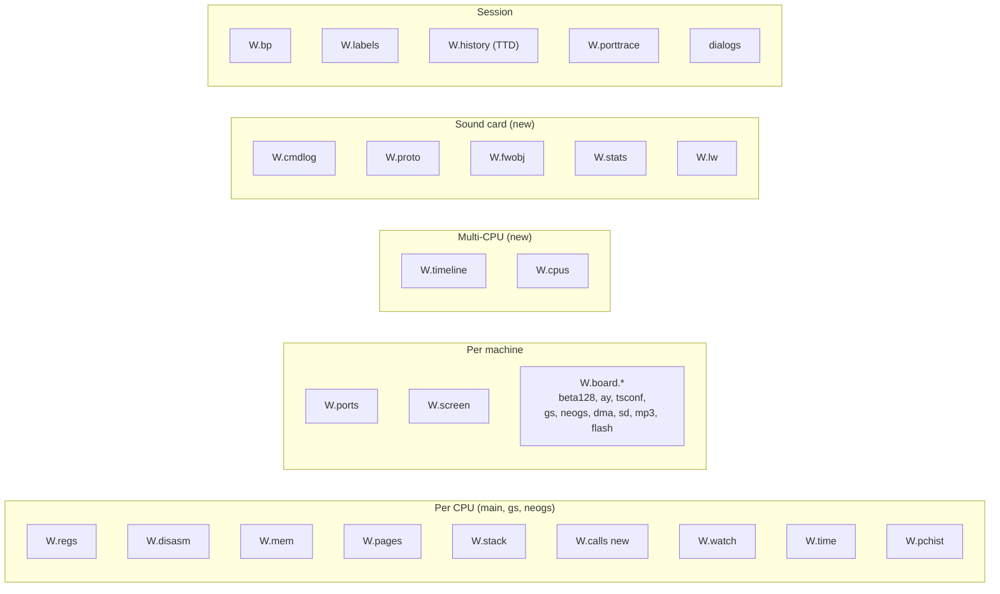
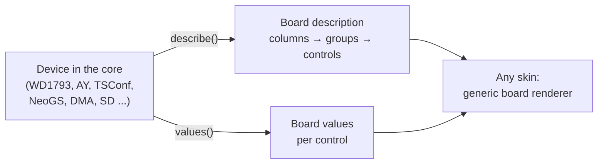

# Widget catalog

- **Date:** 2026-09-28
- **Status:** draft for review.
- **Part of:** [the debugger model](README.md). Behavior is in
  [rules.md](rules.md), transport and sources in [protocol.md](protocol.md),
  the GUI skins in [gui-main-debugger.md](gui-main-debugger.md) and
  [gui-card-debugger.md](gui-card-debugger.md).

Every widget a debugger skin can show, with its complete field set. A skin
chooses which widgets to show and where, and how they look. It never changes
what a widget contains: the fields, their names, their meaning and their
editability are fixed here.

**Where the content comes from.** The core set is the Unreal Speccy monitor,
as the TUI POC specifies it
([TDD-DBG-01](../2026-09-24-tui-debugger/TDD-DBG-01_unreal-speccy-debugger-tui.md),
"U" references below, and
[TDD-DBG-02](../2026-09-24-tui-debugger/TDD-DBG-02_unreal-tsconf-debugger-tui.md),
"T" references). Every Unreal field is kept. The extensions are marked **new**:
- several CPUs on one clock;
- card-specific widgets;
- device boards as data;
- history and statistics.

## Contents

- [0. How to read a widget entry](#0-how-to-read-a-widget-entry)
- [1. Overview](#1-overview)
- [2. CPU widgets (one set per CPU)](#2-cpu-widgets-one-set-per-cpu)
- [3. Machine widgets](#3-machine-widgets)
- [4. Device boards](#4-device-boards)
- [5. Multi-CPU widgets](#5-multi-cpu-widgets)
- [6. Sound-card widgets](#6-sound-card-widgets)
- [7. Session widgets and dialogs](#7-session-widgets-and-dialogs)
- [8. Action catalog](#8-action-catalog)
- [9. Visual states every skin must render](#9-visual-states-every-skin-must-render)

## 0. How to read a widget entry

Each widget has:

- **ID** (`W.regs`), the name everywhere: in the protocol, in skin layouts,
  and in the key-binding configuration.
- **Scope:**
  - `cpu`: one instance per CPU, showing that CPU;
  - `machine`: one per emulator;
  - `card`: only when a sound card is fitted;
  - `session`: debugger-wide.
- **Focusable:** whether it takes keyboard focus and has a cursor. Passive
  widgets never take focus (U §3.1).
- **Origin:** the Unreal section it comes from, or **new**.
- **A field table:**

| Column | Meaning |
|---|---|
| Field | The protocol name, relative to the widget's snapshot object ([protocol.md](protocol.md) §3). |
| Meaning | In plain words. |
| Type | `u8`, `u16`, `u32`, `u64`, `i64`, `bool`, `enum{…}`, `string`, `bits8{names}`, `list<…>`. |
| Format | *Classic* is the Unreal text form. *Improved* is the GUI form, only where it differs. Hex is upper case. The prefix (`#`, `$`, `0x`, none) is a skin setting; classic uses none. |
| Edit | `–` read-only; `E` editable while paused ([rules.md](rules.md) §7); `T` toggle; `C` cycle. |

- **Actions** it offers (§8 has the full catalog and the keys).
- **States** it must show (§9 lists them all).

## 1. Overview



| ID | Name | Scope | Focusable | Origin | main | gs | neogs |
|---|---|---|---|---|---|---|---|
| `W.regs` | Registers | cpu | yes | U §4.1 | ✓ | ✓ | ✓ |
| `W.disasm` | Disassembly (trace) | cpu | yes | U §4.2 | ✓ | ✓ | ✓ |
| `W.mem` | Memory / editors | cpu | yes | U §4.4 | ✓ | ✓ | ✓ |
| `W.pages` | Pages (memory map) | cpu | yes | U §4.8, T §4.8 | ✓ | ✓ | ✓ |
| `W.stack` | Stack | cpu | no | U §4.7 | ✓ | ✓ | ✓ |
| `W.calls` | Call stack | cpu | yes | **new** | ✓ | ✓ | ✓ |
| `W.watch` | Watches | cpu | no (classic) / yes (improved) | U §4.3.1 | ✓ | ✓ | ✓ |
| `W.time` | Time delta and clock | cpu | no | U §4.9 | ✓ | ✓ | ✓ |
| `W.pchist` | PC history | cpu | no | T §4.11 | ✓ | ✓ | ✓ |
| `W.ports` | Ports | machine | no | U §4.5 | ✓ | – | – |
| `W.screen` | Screen preview | machine | no | U §4.3.2, T §4.3 | ✓ | – | – |
| `W.board.*` | Device boards | machine / card | no (classic) / yes (improved) | U §4.6, §4.10, T §5 | per device | per device | per device |
| `W.timeline` | Twin timeline | session | yes | **new** | when a card CPU exists | ✓ | ✓ |
| `W.cpus` | CPU list and status | session | yes | U §9.6 (`mon.cpu`), **new** | ✓ | ✓ | ✓ |
| `W.cmdlog` | Command log | card | yes | **new** (U §6.4 `mon.gs` in spirit) | – | ✓ | ✓ (and LW) |
| `W.proto` | Protocol state | card | no | **new** | – | ✓ | ✓ (and LW) |
| `W.fwobj` | Firmware objects | card | yes | **new** (U §6.4 GS sample list) | – | ✓ | ✓ |
| `W.stats` | Card statistics | card | no | **new** | – | ✓ | ✓ (and LW) |
| `W.lw` | LW interpreter and player | card (LW) | no | **new** | – | – | – |
| `W.bp` | Breakpoints | session | yes | U §6.4, §10 | ✓ | ✓ | ✓ |
| `W.labels` | Labels | cpu | yes | U §6.4, §11 | ✓ | ✓ | ✓ |
| `W.history` | Time-travel history | session | yes | **new** | ✓ | ✓ | ✓ |
| `W.porttrace` | Port trace | machine / card | yes | **new** | ✓ | ✓ | ✓ |
| `W.trace` | Instruction trace, merged across CPUs | session | yes | **new** (X1) | ✓ | ✓ | ✓ |
| `W.events` | Event viewer (a whole frame) | cpu | yes | **new** (X2) | ULA events | ✓ | ✓ |
| `W.profiler` | Function profiler and ISR budget | cpu | yes | **new** (X9) | ✓ | ✓ | ✓ |
| `W.cdl` | Code / data log and coverage | cpu | yes | **new** (X8) | ✓ | ✓ | ✓ |
| `W.heatmap` | Memory heat map by bus master | cpu | yes | **new** (X10) | ✓ | ✓ | ✓ |
| `W.regwriters` | Last writer of each hardware register | cpu | yes | **new** (X7) | ✓ | ✓ | ✓ |
| `W.search` | Snapshot-diff memory search | cpu | yes | U §6.4 `mon.memsearch`, **new** (X16) | ✓ | ✓ | ✓ |
| `W.pending` | Pending hardware events | cpu | no | **new** (X18) | ✓ | ✓ | ✓ |
| `W.logic` | Logic analyzer, one period | cpu | yes | **new** (X17) | – | ✓ | ✓ |
| `W.structs` | Struct inspector (firmware objects as data) | card | yes | **new** (M1-M3) | – | ✓ | ✓ |
| `W.dispatch` | Command dispatch table and patches | card | yes | **new** (M4) | – | ✓ | ✓ |
| `W.pagemap` | Card RAM page allocation map | card | no | **new** (M9) | – | ✓ | ✓ |
| `W.audio` | Card channels: mute, solo, scopes | card | yes | **new** (AU1, AU2) | – | ✓ | ✓ (and LW) |
| `W.samples` | Sample and module browser | card | yes | U §6.4 `mon.gs`, **new** (AU4) | – | ✓ | ✓ (and LW) |
| `W.unknown` | Unknown / unimplemented commands seen | card | no | U §6.4 `mon.gs` list, **new** (AU6) | – | ✓ | ✓ (and LW) |

## 2. CPU widgets (one set per CPU)

Every widget in this section exists once per CPU. A skin shows one CPU's set
at a time (the classic skin switches with `session.next_cpu`), or several
sets side by side (the GUI: one window per CPU). The **cursor and scroll
state is per CPU** (U §9.6): switching CPUs never loses a position.

### 2.1 `W.regs` Registers

**Origin:** U §4.1. **Focusable:** yes.

**Classic layout** (U §4.1.1, 32 × 4 cells), kept as the reference for the
text skins:

```text
af:**** af'**** sp:**** ir: ****
bc:**** bc'**** pc:**** t:******
de:**** de'**** ix:**** im?,i:**
hl:**** hl'**** iy:**** ########
```

| Field | Meaning | Type | Format | Edit |
|---|---|---|---|---|
| `a`, `f` | accumulator, flags | u8 | `%02X` | E |
| `bc`, `de`, `hl` | register pairs | u16 | `%04X` | E |
| `af_alt`, `bc_alt`, `de_alt`, `hl_alt` | alternate set | u16 | `%04X` | E |
| `sp`, `pc`, `ix`, `iy` | stack pointer, program counter, index registers | u16 | `%04X` | E |
| `i`, `r` | interrupt vector base, refresh (full 8 bits: `(R & 7F) \| R7`) | u8 | `%02X` | E |
| `im` | interrupt mode | enum{0,1,2} | `%X` | C (0 → 1 → 2 → 0) |
| `iff1`, `iff2` | interrupt flip-flops | bool | `0` / `1` | T |
| `flags` | F as eight flag cells: S Z 5 H 3 P/V N C | bits8{S,Z,F5,H,F3,PV,N,C} | classic: set = `SZ5H3PNC` letter, clear = `sz.h.pnc` (bits 5 and 3 show `.`) | T per bit |
| `t` | main: T-states since the frame started; card: card cycles since the frame started | u32 | classic `%6u`; improved: grouped `34,996 T` / `119,985 c` | – |
| `halted` | the CPU is in HALT | bool | improved: a `HALT` badge | – |
| `dihalt` | HALT with IFF1 = 0: a hang | bool | classic: `DiHALT` replaces `t` (U §4.1.1); improved: a red `HALT, interrupts off` badge | – |
| **new** `memptr` | the hidden WZ register | u16 | `%04X` | E |
| **new** `q` | the flag-latch register that affects SCF/CCF | u8 | `%02X` (improved, in the expanded view) | – |
| **new** `boundary` | the next instruction starts in a special state | enum{none, after_ei, prefix_dd, prefix_fd, ld_a_ir, nmi_ack} | improved: a badge `after EI` / `DD prefix` / `NMI ack` | – |
| **new** `last_branch` | address of the last taken control transfer | u16 | classic: in the disassembly title (U §4.2.1); improved: here | – |
| **new** `clock_hz` | the CPU's clock now | u32 | improved: `3.5 MHz`, `24 MHz` | – |

**Change marks** ([rules.md](rules.md) §8). Every value that differs from the
previous snapshot is marked. Classic uses bright ink; improved uses the
`state/changed` token. Flags are compared bit by bit.

**Actions:**
- `reg.left` / `reg.right` / `reg.up` / `reg.down` (the classic adjacency
  table, U §4.1.2);
- `reg.edit`, and `reg.goto_<name>` for each field;
- `reg.toggle_<flag>`, `reg.cycle_im`, `reg.toggle_iff1` / `reg.toggle_iff2`;
- `reg.code_jump` (a 16-bit value → the disassembly);
- `reg.data_jump` (a 16-bit value → memory);
- **new** `reg.copy`, `reg.set_breakpoint_at_value`.

### 2.2 `W.disasm` Disassembly

**Origin:** U §4.2. **Focusable:** yes. It is the "trace" window of Unreal.

**Title fields:**

| Field | Meaning | Type | Format |
|---|---|---|---|
| `cpu` | which CPU | enum{main, gs, neogs} | classic `Z80(0)` / `Z80(1)`; improved: the CPU badge |
| `last_branch` | as in `W.regs` | u16 | classic `%04X` next to the title |

**Line fields** (one record per line, `lines[]`):

| Field | Meaning | Type | Format |
|---|---|---|---|
| `address` | instruction start | u16 | `%04X` |
| **new** `page` | the physical page this address maps to now | `{kind, page}` | improved: a chip `ROM0`, `RAM5`, `FL3`, shown where the window is switchable |
| `bytes` | opcode bytes | list<u8> | classic: up to 4 as `%02X`, or `..` plus the last 4 (U §4.2.2); improved: all bytes |
| `label` | the label at this address, page-aware | string | classic: replaces the bytes column when labels are on (10 chars); improved: its own column |
| `mnemonic` | the instruction text | string | classic: lower case, operands at column 5, no prefix, targets as absolute addresses (U §4.2.2); improved: the same, with operand addresses replaced by labels when labels are on |
| `length` | instruction length | u8 | – |
| **new** `cycles` | duration: T for main, card cycles for a card | `{t, t_alt}` | improved: `11`, or `7/12` for conditional instructions |
| **new** `hint` | runtime information, only at PC | string | improved: `; taken`, `; A=#1A`, `; → #4100 = #12` |
| `is_pc` | the line is at PC | bool | classic: `W_TRACEPOS`; improved: a PC marker and a row highlight |
| `breakpoint` | the execution breakpoint state at this address | enum{none, enabled, disabled, conditional, event} | classic: red ink; improved: a gutter mark |
| `branch` | branch information for the instruction at PC (U §4.2.4) | `{taken, target, flags{branch, braddr, call, loop, blk, halt}}` | classic: ↑ / ↓ arrow at PC, the target address for computed targets, ◄ on the target line; improved: an arrow drawn to the target |
| `next_pc` | the step-over target (U §4.2.4) | u16 | – |

**Cursor state** (per CPU, client side): `top`, `cursor`, `column`
(`address` / `bytes` / `mnemonic`, U §4.2.5), the jump stack (32 entries), and
the 8 position slots.

**Actions:**
- navigation: `dis.up`, `dis.down`, `dis.pgup`, `dis.pgdn`, `dis.left`,
  `dis.right`, `dis.find_pc`, `dis.goto`, `dis.back`, `dis.save_slot_1-8`,
  `dis.restore_slot_1-8`;
- editing: `dis.edit` (address, bytes or assembly in place, U §4.2.6),
  `dis.set_pc`;
- breakpoints and running: `dis.toggle_bp`, `dis.run_to_cursor`;
- find: `dis.find_text`, `dis.find_code`;
- `dis.context_jump` (the last address in the mnemonic), `dis.data_jump`;
- labels: `dis.toggle_labels`, `dis.import_labels`;
- **new**: `dis.add_label`, `dis.who_called` (TTD), `dis.copy`.

### 2.3 `W.mem` Memory and editors

**Origin:** U §4.4. **Focusable:** yes.

**Spaces** (`space`; the classic "editor sources", extended):

| `space` | Title (classic) | Size | Bytes come from | CPUs | Origin |
|---|---|---|---|---|---|
| `cpu` | `memory` | 64 KB | the CPU's live 16-bit map, without side effects | all | U |
| **new** `page` | `ram 05` / `rom 01` / `flash 03` / `cache 0` | 16 KB | one physical page | all | new |
| `disk_phys` | `disk A, trk 00, offs 0000` | track length | the raw decoded track | main | U |
| `disk_log` | `disk A, trk 00, sec 01[01], offs 0000` | sum of the sectors | the track's sector data | main | U |
| `cmos` | `cmos` | 256 | RTC CMOS | main (when fitted) | U |
| `nvram` | `nvram` | 2048 | ATM / ZX-Evo NVRAM | main (when fitted) | U |
| `comp_pal` | `comppal` | 64 | the computer palette | main (classic skin only) | U |
| **new** `card_flash` | `flash` | 512 KB | the NeoGS flash chip array | neogs | new |
| **new** `sd_block` | `sd 000400` | 512 per block | the SD medium, by block | neogs | new |

**Fields:**

| Field | Meaning | Type | Format | Edit |
|---|---|---|---|---|
| `space`, `page`, `drive`, `track`, `sector` | what is shown | – | the title; classic formats in U §4.4.4 | selection |
| `rows[]` | `{address, bytes[], text}` | – | classic hex: `%04X ` + 8 × `XX ` + 8 glyphs; classic text dump: 32 glyphs; improved: 8 or 16 bytes, with an ASCII or CP866 column | E |
| `max` | the size of the space | u32 | – | – |
| `gs_dma` | classic title extra: the card DMA address | u32 | `gsdma: %06X` (U §4.4.4) | – |
| `marks[]` | addresses to mark: PC, SP, watches, breakpoints, and **new** the changed bytes | – | improved only | – |
| `status` | `ok` / `no_track` / `unavailable` | enum | classic: `track not found` in the middle of the widget | – |

**Actions:**
- navigation: `mem.left`, `mem.right`, `mem.up`, `mem.down`, `mem.pgup`,
  `mem.pgdn`, `mem.line_start`, `mem.line_end`, `mem.goto`;
- `mem.switch_side` (hex / ASCII), `mem.toggle_dump`;
- `mem.to_<reg>` for PC, SP, BC, DE, HL, IX and IY;
- choosing the space: `mem.space_cpu`, `mem.space_disk_phys`,
  `mem.space_disk_log`, `mem.disk_go`, `mem.cycle_space`;
- find and fill: `mem.find_text`, `mem.find_code`, `mem.fill`;
- blocks: `mem.load_block`, `mem.save_block`;
- `mem.rip` (the ripper);
- **new**: `mem.space_page`, `mem.set_bp_read`, `mem.set_bp_write`,
  `mem.add_label`, `mem.who_wrote` (TTD), `mem.copy_hex`, `mem.copy_db`,
  `mem.follow` (follow a register as it changes).

### 2.4 `W.pages` Pages

**Origin:** U §4.8, T §4.8 (interactive). **Focusable:** yes, and read-only
(T §4.8).

One row per 16 KB window of the CPU (`windows[0..3]`):

| Field | Meaning | Type | Format |
|---|---|---|---|
| `index` | window 0-3 | u8 | classic `%d:` |
| `start` | window start address | u16 | improved `#8000` |
| `name` | the classic 5-char page name (U §4.8 rules: `RAM 5`, `ROM 1`, `BASIC`, `TRDOS`, `B128K`, `SVM`, `CACHE`, `?????`) | string | classic |
| **new** `kind` | what is mapped | enum{rom, ram, flash, cache, none} | improved: a colored chip |
| **new** `page` | page number (16 KB units, 8 bits; NeoGS RAM up to 255) | u8 | improved |
| `read_only` | reads and writes map differently (ROM, write-protected RAM) | bool | classic `W_BANKRO`; improved `ro` |
| **new** `source` | which register chose it | string | improved `MPAG #02`, `PG2 #04`, `7FFD #10`, `fixed` |

**Actions:** `pages.up`, `pages.down`. **New:** `pages.show_in_memory`,
which shows the selected window's page in `W.mem`.

### 2.5 `W.stack` Stack

**Origin:** U §4.7. **Focusable:** no (classic); an improved skin may make
rows clickable.

| Field | Meaning | Type | Format |
|---|---|---|---|
| `entries[]` | `{offset, address, value}` for SP−2, SP, SP+2 … SP+16 (10 rows) | – | classic: `-2:`, `SP:`, `+2:` … `+E:`, `10:`, then the word as `%02X%02X` |
| **new** `entries[].label` | the label of `value`, when `value` is a code address | string | improved: `0C37 COMLOOP+5` |
| **new** `entries[].is_return` | `value` follows a `CALL` instruction, so it is likely a return address | bool | improved: a marker |

### 2.6 `W.calls` Call stack (new)

A reconstructed list of the active calls. It is built from the TTD call
trace when available, and otherwise from a heuristic scan of the stack
(`is_return` entries).

| Field | Meaning | Type | Format |
|---|---|---|---|
| `frames[]` | `{pc, label, sp, via}` | – | `COM30 ← COMLOOP ← MAIN` |
| `frames[].via` | how the frame was entered | enum{call, rst, int, nmi, unknown} | an icon |
| `source` | where the list comes from | enum{trace, heuristic} | a note, e.g. `heuristic` |

**Actions:** `calls.goto` (the frame's PC → the disassembly),
`calls.run_to_return` (run to that frame's return).

### 2.7 `W.watch` Watches

**Origin:** U §4.3.1. **Focusable:** no in classic; yes in improved (to edit
the watches).

| Field | Meaning | Type | Format |
|---|---|---|---|
| `lines[]` | `{name, address, bytes[8]}`. The fixed lines are PC, SP, BC, DE, HL, IX, IY, BC', DE' and HL'. Then the user watches. | – | classic: `%3s: ` or `%04X `, 8 × `XX `, 8 glyphs |
| `user[]` | user watch addresses (classic: 3, defaults `4000`, `8000`, `C000`) | list<u16> | – |
| **new** `user[].expr` | a watch as an expression in the condition language ([rules.md](rules.md) §5.3), with a display type | `{expr, type: byte \| word \| string \| bytes(n) \| decimal}` | improved: `HL → "PLAYER"`, `M(#5C3A) = 12` |
| `dos` | the TR-DOS ports are active | bool | classic: `DOS` in the title |

**Actions:** `watch.set` (classic: three address fields), **new**
`watch.add`, `watch.edit`, `watch.remove`.

### 2.8 `W.time` Time delta and clock

**Origin:** U §4.9. **Focusable:** no.

| Field | Meaning | Type | Format |
|---|---|---|---|
| `delta` | time since the mark ([rules.md](rules.md) §8.2): main in T, a card in card cycles | i64 | classic `time delta: %14d t`; improved `Δ 17 T` |
| **new** `frame` | the frame number | u32 | improved |
| **new** `t_in_frame` | the position in the frame | u32 | improved |
| **new** `line`, `pixel` | the beam position (main CPU only) | u16 | improved `line 64 · px 128` |
| **new** `mark_reason` | why the mark was set | enum{step, leave, user} | tooltip |

**Actions:** **new** `time.set_mark` (user mark).

### 2.9 `W.pchist` PC history

**Origin:** T §4.11. **Focusable:** no.

| Field | Meaning | Type | Format |
|---|---|---|---|
| `entries[]` | the most recent M1 fetches, newest first: `{page, address}`; each prefix byte is its own entry | – | classic `%02X:%04X`, 28 lines out of a ring of 32 |
| **new** `entries[].label` | the label at that address | string | improved |
| **new** `depth` | the ring size | u16 | classic 32; improved configurable (up to 256) |

**Actions:** **new** `pchist.goto`.

## 3. Machine widgets

### 3.1 `W.ports` Ports

**Origin:** U §4.5. **Focusable:** no. **Main CPU only.**

| Field | Meaning | Type | Format |
|---|---|---|---|
| `fe` | last value written to `#FE` | u8 | `  FE:%02X` |
| `p7ffd` | last value written to `#7FFD` | u8 | `7FFD:%02X` |
| `lock48` | the 48K lock is on (U §4.5 rule) | bool | classic: `W_48K`, red paper |
| `ext` | the model's extended port, e.g. `1FFD`, `DFFD`, `FDFD`, `FF77`, or none | `{port, value}` or null | `%04X:%02X` |
| `cmos_addr` | the CMOS address register (shown when there is no extended port) | u8 | `cmos:%02X` |
| `eff7` | last value written to `#EFF7` | u8 | `EFF7:%02X` |
| **new** `list[]` | improved: every port the model decodes, with its last value and name (from the port decoder) | `{port, name, value, dir}` | a table |

**Actions:**
- `ports.set_7ffd` (classic `mon.setbank`) and `ports.set_ext` (classic
  `mon.sethimem`). These are real OUTs, with all their side effects.
- **new** `ports.out` (any port).

### 3.2 `W.screen` Screen preview

**Origin:** U §4.3.2, T §4.3. **Focusable:** no.

| Field | Meaning | Type | Format |
|---|---|---|---|
| `mode` | what is shown | enum{off, screen, ray, alt_screen, zx_page5, zx_page7} | classic: cycles with the watches (`view.screen_cycle`) |
| `image` | the pixels | indexed image | classic: a 296 × 208 center crop; improved: any size |
| **new** `beam` | the ray position overlaid | `{line, pixel}` | improved: a crosshair |

**Actions:** `view.screen_cycle`, `view.screen_full`, `view.alt_screen_full`,
`view.ray_screen_full`.

## 4. Device boards

**Origin:** U §4.6 (beta128), U §4.10 (AY), T §5 (the TSConf register
board). **New:** they are generalized into one widget type.

A **device board** is a widget whose layout and fields are **published by
the device** as data. The skin renders any board with one generic renderer.
A new device (NeoGS, a future Sprinter) needs no front-end code: it publishes
a board.



**The board schema** (the TSConf layout engine, T §5.1, as data):

| Element | Fields |
|---|---|
| `board` | `id`, `title`, `device`, `cpu` (which CPU's port space owns it), `available`, `columns[]` |
| `column` | `groups[]` |
| `group` | `title`, `raw` (the register value shown next to the title, e.g. `VConfig=%02X`), `controls[]` |
| `control` | `id`, `label`, `type`, `value`, `format`, `edit` (`–` / `E` / `T`, improved skins only; editing writes the port, with side effects), `note` |
| control `type` | `hex8`, `hex16`, `hex21`, `dec`, `bool`, `bits{names}`, `enum{values}`, `counter`, `rate`, `bar{min, max}`, `text`, `led` |

The classic TSConf board (T §5.2) is one instance. Its complete control list
is specified in TDD-DBG-02 §5.2 and is not repeated here.

### 4.1 `W.board.beta128` Beta 128 disk interface (WD1793)

**Origin:** U §4.6. Present when TR-DOS is configured; otherwise greyed out,
with the values still shown.

| Control | Meaning | Type | Classic format |
|---|---|---|---|
| `cmd`, `data` | WD command and data registers | hex8 | `CD:%02X%02X` |
| `status` | status as the CPU reads it (the HLD bit merged in for type I) | hex8 | `STAT:%02X` |
| `sector` | sector register | hex8 | `SECT:%02X` |
| `head_track`, `track_reg` | the drive's physical head track, the WD track register | hex8 | `T:%02X/%02X` |
| `system`, `rqs` | Beta system register (`#FF` write), request status (`#FF` read: INTRQ, DRQ) | hex8 | `S:%02X/%02X` |
| **new** `motor`, `drive`, `side`, `busy` | decoded drive state | led, enum | improved |

### 4.2 `W.board.ay` AY registers

**Origin:** U §4.10. Hidden when no AY is configured.

| Control | Meaning | Type | Classic format |
|---|---|---|---|
| `chip` | the active chip | enum{AY, AY0, AY1} | `AY:` / `AY0` / `AY1` |
| `regs[0..15]` | register values | hex8 | the register number, then `%02X` for each of the 16 |
| `latched` | the register currently selected at `#FFFD` | u8 | highlight (`W_AYON`) |
| **new** `decoded` | tone and noise periods, volumes, envelope | enum, dec | improved |

**Actions:** `ay.switch_chip` (classic `mon.switchay`).

### 4.3 `W.board.tsconf` TSConf registers

**Origin:** T §5. The groups are VConfig, TSConfig, SysConfig, CacheConfig,
MemConfig, Bitmap, Tiles0, Tiles1, PalSel, Misc, FMAddr, MemPages, Sprites,
DMA, Interrupt and IntMask, with the controls of T §5.2 as the reference.

### 4.4 `W.board.gs` General Sound card hardware (new)

**Scope:** card (gs). This is the hardware view of the classic card.

| Group | Control | Meaning | Type |
|---|---|---|---|
| Paging | `mpag` | page register (port `#00`), with the 16 KB pages it maps: `#03 → RAM 4-5 at #8000` | hex8 + text |
| DAC | `channels[0..3].sample`, `.volume` | the four channels | hex8, bar{0,63} |
| Interrupts | `int_position`, `int_period` | the position in the current 320-cycle period | dec |
| Interrupts | `int_pending`, `nmi_pending` | pending INT and NMI | led |
| Mailbox | `command_from_host`, `data_from_host`, `data_to_host` | the three latches | hex8 |
| Mailbox | `status` | bit 7 = data flag, bit 0 = command flag | bits{D,C} |
| Firmware | `ready` | the firmware is in its command loop | bool |
| Firmware | `rom` | the firmware title and its SHA-256 | text |

### 4.5 `W.board.neogs` NeoGS card hardware (new)

**Scope:** card (neogs).

| Group | Control | Meaning | Type |
|---|---|---|---|
| Config | `gscfg0` | the configuration register, decoded: NOROM (RAM mode), RAMRO, 8CHANS, EXPAG, clock (bits 5:4), PAN4CH, INV7B | hex8 + bits |
| Paging | `pages[0..3]`, `window_flash[0..3]`, `mpag`, `mpagex` | the four window page registers and whether each window shows flash | hex8, bool |
| Clock | `clock_hz`, `clock_switches` | the card clock (10 / 12 / 20 / 24 MHz) and how often it changed | dec, counter |
| DAC | `channels[0..7].sample`, `.volume`, `audio_mode` | the eight channels; 4ch / 8ch / pan4ch | hex8, bar, enum |
| Output | `dac_level.left`, `.right`, `stereo_mode` | the output level before coupling; the listening mode (separated / gs / mono) | bar, enum |
| Interrupts | `int_enable`, `int_request`, `tim_freq` | INTENA, INTREQ (timer, SD DMA, MP3 DMA), the timer rate (0-7) | bits, enum |
| SPI | `sctrl` | SD nCS, MC nCS, XRESET, MCSPD0/1, MDHLF | bits |
| Status | `sstat` | MCRDY, /SD_WP, /SD_DET, DREQ | bits |
| LED | `led_on` | the card LED | led |
| Mailbox | as `W.board.gs` | – | – |
| Firmware | `ready`, `flash_title`, `flash_modified` | – | bool, text |

### 4.6 `W.board.neogs_dma` NeoGS DMA and ZX-DMA (new)

One row per module (`modules[zx|sd|mp3]`), then the ZX-DMA detail:

| Group | Control | Meaning | Type |
|---|---|---|---|
| Module | `selected`, `running` | DMA_MOD selects the module; CST bit 7 | led |
| Module | `address`, `page` | the 21-bit address and its 16 KB page | hex21, dec |
| Module | `starts`, `completions`, `bytes`, `aborts`, `errors` | counters (neogs-automation-design §4.7) | counter |
| Module | `busy_clocks`, `stall_clocks` | card clocks running; card clocks the CPU was held off the bus | counter |
| Module | `last` | the last completed transaction `{address, bytes, clocks, frame}` | text |
| ZX-DMA | `mode` | off / watch / divert | enum |
| ZX-DMA | `watch_setting`, `watch_frames`, `watch_frames_left` | the watch policy and window | enum, dec |
| ZX-DMA | `read_latch`, `pending`, `pending_address` | the latch, the byte in flight | hex8, enum, hex21 |
| ZX-DMA | `bytes_read`, `bytes_written`, `bytes_dropped`, `wait_tstates`, `late_starts` | counters | counter |
| ZX-DMA | `overlay_installed` | the host bus overlay is in | led |

**Actions:** `board.open_zxdma_trace` (opens `W.porttrace` filtered to
ZX-DMA events).

### 4.7 `W.board.neogs_sd`, `W.board.neogs_mp3`, `W.board.neogs_flash` (new)

| Board | Controls |
|---|---|
| SD (`sd.ngs` slot) | `present`, `source` (image or folder), `type` (SDSC / SDHC), `size_bytes`, `initialized`, `mode` (command / read multi / wait token / receive data), `last_command`, `last_argument`, `write_mode`, `write_protect`, `blocks_read`, `blocks_written`, `commands{cmd0…cmd59, acmd41}`, `errors{illegal, crc, write, out_of_range}` |
| MP3 | `chip` (VS1001 / VS1011), `running`, `dreq`, `rate`, `channels`, `bitrate`, `decode_time_s`, `input_fill` (of 2048), `pcm_queued`, `gain`, `frames_decoded`, `samples_played`, `bytes_while_busy`, `underruns`, `sci[0..15]` (MODE, STATUS, BASS, CLOCKF, DECODE_TIME, AUDATA, WRAM, WRAMADDR, HDAT0, HDAT1, AIADDR, VOL, …) |
| Flash | `title`, `modified`, `mode` (read / program / erase / busy / failed), `vendor` (ST / AMD), `write_mode`, `persist_path`, `bytes_programmed`, `sectors_erased`, `program_failures`, `saves` |

**Actions:**
- `sd.insert`, `sd.eject`, `sd.open_media_panel`. These are media-manager
  requests on the slot `sd.ngs`.
- `flash.save`.

## 5. Multi-CPU widgets

### 5.1 `W.timeline` Twin timeline (new)

The widget that makes "several CPUs, one clock" visible
([rules.md](rules.md) §3). It is shown whenever a card CPU exists.

| Field | Meaning | Type | Format |
|---|---|---|---|
| `now.frame`, `now.main_t` | the shared moment | u32, f64 | `frame 412 · T 34,995.6` |
| `sync_mode` | how closely the card follows the main CPU | enum{lazy, tight} | a pill `Tight sync` |
| `lanes[]` | one lane per CPU: `{cpu, clock_hz, position, recent[], next}` | – | stacked lanes, main on top |
| `lanes[].position` | a `CpuPosition` ([protocol.md](protocol.md) §3.4): cycles, on a boundary or not, the instruction PC, elapsed / total T, the bus cycle, the gap | – | `6.6 / 11 T · 60% · port write next`; `cycle 119,985` |
| `lanes[].recent[]` | recently executed instructions `{pc, mnemonic, start, duration}` | – | blocks, width = duration in machine time |
| `lanes[].next` | the next instruction | `{pc, mnemonic, duration}` | an outlined block |
| `lanes[].position.bus_cycles[]` | the current main instruction's M-cycles `{kind: ocf \| od \| mr \| mw \| io \| wait, t}` | – | segments inside the block |
| `markers[]` | `{kind: breakpoint \| port \| clock \| zxdma \| int \| nmi, cpu, time, text}` | – | icons on the lanes |

**Actions:** `timeline.zoom_in`, `timeline.zoom_out`, `timeline.pan`,
`timeline.recenter`, `timeline.goto_block` (the disassembly of that CPU).

### 5.2 `W.cpus` CPU list and status (new)

The classic skin's `Z80(n)` switch, as a widget.

| Field | Meaning | Type | Format |
|---|---|---|---|
| `cpus[]` | `{id, name, available, clock_hz, state, pc, paused_by}` | – | a list with the CPU colors |
| `cpus[].state` | the CPU's state | enum{running, paused, stepping, unavailable} | a badge |
| `cpus[].paused_by` | who stopped the machine | `{cpu, reason, breakpoint_id}` | `card breakpoint #3` |
| `current` | the CPU this skin (or window) shows | enum | highlighted |

**Actions:** `session.next_cpu` (classic `mon.cpu`), `session.select_cpu`,
`session.open_cpu_window` (GUI: open a window for that CPU).

## 6. Sound-card widgets

These widgets are available when a card is fitted (`gs`, `neogs`, or the
LW player). Their requirement IDs are in
[gs-debugger/requirements.md](../2026-09-27-gs-debugger/requirements.md).

### 6.1 `W.cmdlog` Command log (F1-F7)

The decoded conversation between the Spectrum and the card.

| Field | Meaning | Type | Format |
|---|---|---|---|
| `recording`, `count`, `dropped`, `capacity` | the log's state | bool, u32 | `● REC 1,248 entries · 0 dropped` |
| `entries[].kind` | the entry type | enum{command, param, reply, block, anomaly, card_took, marker} | an icon: → ← ⇉ ⚠ ✓ — |
| `entries[].frame`, `.frame_end` | when (a range for blocks) | u32 | `412` / `412-431` |
| `entries[].main_t`, `.card_cycle` | the exact times | u32, u64 | `34,996` · `119,986` |
| `entries[].command`, `.command_name`, `.params[]` | the command and its decoded parameters (by the firmware profile) | u8, string, list | `#30 load module` |
| `entries[].reply`, `.reply_meaning` | the reply | u8, string | `→ #01 slot 1` |
| `entries[].count`, `.dest` | block entries: the byte count and the destination `{kind, page_first, page_last, addr_first, addr_last}` | u32 | `38,400 B → RAM 2-3 #8000-#95FF` |
| `entries[].main_pc`, `.main_label` | the Spectrum instruction that did it | u16, string | `#8123 PLAYMUS+12` |
| `entries[].card_pc`, `.card_label` | the firmware instruction that took it | u16, string | `#1280 COM30` |
| `entries[].anomaly`, `.value` | the problem and the byte concerned | enum{data_overwritten, command_overwritten, reply_not_ready, transfer_stalled}, u8 | `data byte #12 overwritten before the card read it` |
| `entries[].source` | where the entry came from | enum{program, debugger, automation} | a note, e.g. `sent from debugger` |

**Actions:**
- recording: `log.start`, `log.stop`, `log.clear`;
- filtering: `log.filter` (by command, direction, anomalies, main routine,
  frame range);
- `log.goto` (both CPUs to that moment, through TTD when available);
- breakpoints from an entry: `log.bp_host_side`, `log.bp_card_side`,
  `log.bp_upload_byte`;
- `log.export` (text or JSON), `log.copy`.

### 6.2 `W.proto` Protocol state (F3, F4)

| Field | Meaning | Type | Format |
|---|---|---|---|
| `command`, `command_name` | the command in progress | u8, string | `#30 load module` |
| `params_received`, `params_expected` | parameter progress | u8 | `1 of 1` |
| `transfer_kind`, `transfer_done`, `transfer_total` | upload progress | enum{none, module, sample, stream}, u32 | `12,288 / 38,400 B` and a bar |
| `command_flag`, `data_flag` | the mailbox flags now | bool | `○ taken · ● waiting for the card` |
| `last_anomaly` | the last problem seen | enum or null | `none` |

**Actions:** `proto.send` (opens the send dialog, F6).

### 6.3 `W.fwobj` Firmware objects (F5)

| Field | Meaning | Type | Format |
|---|---|---|---|
| `source` | where the values come from | string | `firmware variables (gs105a)` |
| `objects[]` | `{slot, kind: module \| sample, size, page, addr}` | – | `slot 1 · module · 38,400 B · RAM 2 #8000` |
| `playing`, `song_pos`, `row`, `speed` | the playback state | bool, u8 | `playing · pos 3 · row 17 · speed 6` |
| `volumes[]`, `master_volume` | channel and master volume | u8 | bars |
| `valid` | a profile describes this firmware | bool | the empty state when false |

**Actions:** `fwobj.goto` (an object's address → memory).

### 6.4 `W.stats` Card statistics (N7)

The `GSSlotStats` block of
[neogs-automation-design.md](../2026-09-19-general-sound/neogs-automation-design.md)
§4, shown as tiles and tables. It has the same field names as there:
`card`, `mailbox`, `interrupts`, `cpu`, `audio`, `player`, `module`, `dma`,
`spi`, `sd`, `mp3`, `flash`, `rates`, `errors`, `baseline`, `age_frames`,
`replaying`, `capabilities`.

**Actions:** `stats.reset_baseline`, `stats.show_section`.

### 6.5 `W.lw` LW interpreter and player (W1-W5)

The lightweight player has no CPU. Its inspector replaces the CPU widgets.

| Field | Meaning | Type | Format |
|---|---|---|---|
| `fsm_state` | the interpreter state | enum{idle, command, params, upload, reply} | a live state diagram |
| `command`, `transfer_done`, `transfer_total`, `reply_pending` | the interpreter state | – | – |
| `param_count`, `reply_count` | the queues (of 16) | u8 | `params 0/16 · replies 0/16` |
| `player.song_pos`, `.song_length`, `.row`, `.tick`, `.speed`, `.bpm`, `.playing` | the sequencer | – | `pos 3/12 · row 17 · tick 2 · speed 6 · 125 BPM` |
| `player.channels[]` | `{sample, volume, period}` × 4 | – | – |
| `player.samples[]` | `{index, name, length, loop_start, loop_length, volume, finetune, note, priority, rate_hz, current, looped}` (the Unreal `mon.gs` columns: `*` current effect, `(L)` looped, note, priority, rate) | – | a table; row 0 is the module `(P)` / `(S)` + name |
| `mirror` | the firmware variables the player mirrors (`mod_vol`, `fx_vol`, `cur_mod`, `cnt_mod`, `mt_stat`, `err_code`, …) | – | an expandable list |

### 6.6 `W.structs` Struct inspector (new, M1-M3)

Firmware objects as data: the profile's structs and instances, rendered
generically. It is the generic form of `W.fwobj`.

| Field | Meaning | Format |
|---|---|---|
| `structs[]` | `{name, size, fields[]{name, offset, type, meaning}}` | – |
| `instances[]` | `{struct, at{page, offset}, count}` | – |
| `rows[]` | per instance element: the decoded field values | a table; columns = fields |

**Actions:** `structs.goto_memory`, `structs.watch_field`,
`structs.bp_field_write`.

### 6.7 `W.dispatch` Dispatch table (new, M4)

| Field | Meaning | Format |
|---|---|---|
| `table` | `{address, entries}` from the profile | – |
| `entries[]` | `{command, name, handler, handler_label, baseline_handler, patched, patched_by}` | `#1E → #1D00 NGSSD · patched by upload sha 3fa1… at frame 18` |
| `profiles[]` | the active profile stack (M5): ROM profile, then uploads | `GS v1.05a ▸ ngssd.bin` |

### 6.8 `W.pagemap` Card RAM page map (new, M9)

| Field | Meaning | Format |
|---|---|---|
| `pages[]` | `{page, owner, detail}`; owner: firmware, module slot n, sample, uploaded code, stream ring, free | a grid of 16 KB cells (up to 256), colored by owner |

### 6.9 `W.audio` Card channels (new, AU1-AU3)

| Field | Meaning | Format |
|---|---|---|
| `channels[]` | `{index, latch, volume, muted, solo, scope[]}`; 4 on GS, 8 on NeoGS | a strip per channel: mute, solo, scope |
| `mix` | L / R before coupling, with scopes | two scopes |
| `now` | the NOW cursor while paused | a vertical line |

**Actions:** `audio.mute`, `audio.solo`, `audio.card_mute`,
`audio.export_csv`, `audio.export_wav`, `audio.goto_fetch`.

### 6.10 `W.samples` Sample and module browser (new, AU4)

| Field | Meaning | Format |
|---|---|---|
| `module` | `{name, playing}` | row 0: `(P)` / `(S)` + name |
| `samples[]` | `{index, name, volume, note, priority, rate_hz, length, loop, current}` | the `mon.gs` columns: `*`, `(L)`, v, n, p, f, l |

**Actions:** `samples.audition` (on the host; the card is untouched),
`samples.play_on_card` (a real command through F6), `samples.stop`,
`samples.save_pcm`, `samples.save_wav`, `module.save`, `card.reset`.

### 6.11 `W.unknown` Unknown commands (new, AU6)

| Field | Meaning | Format |
|---|---|---|
| `commands[]` | `{command, count, first_frame, last_main_pc}` | `#99 ×3 · first frame 1,204 · #8123` |

**Actions:** `unknown.clear`, `unknown.goto`.

## 7. Session widgets and dialogs

### 7.1 `W.bp` Breakpoints

**Origin:** U §6.4 (the Breakpoints Manager: conditional, execution and
memory columns) and U §10. It is extended to all CPUs and all kinds.

| Field | Meaning | Type | Format |
|---|---|---|---|
| `id` | unique, never reused | u32 | `#3` |
| `cpu` | which CPU | enum{main, gs, neogs} | a CPU chip |
| `kind` | the breakpoint kind | enum{exec, read, write, port_in, port_out, condition, event, protocol, keyboard} | an icon |
| `address`, `address_end` | the address or range | u16 | `8000` or `4000-57FF` (the classic merged ranges) |
| `page` | page-qualified (**new**, fixes Unreal quirk Q9) or any page | `{kind, page}` or null | `RAM5` / `*` |
| `port`, `port_mask` | port breakpoints | u16 | `#FE` / `xxFE` |
| `condition` | an expression ([rules.md](rules.md) §5.3) | string | classic: decompiled, fully parenthesized |
| `event`, `event_value` | event kind and value filter (card: `int`, `nmi`, `reset`, `page_switch`, `clock_switch`, `zxdma_start`, `zxdma_stop`, `dma_done`, `dma_error`, `zxdma_dropped`, `host_wait`) | enum, u16 | `page switch → 5` |
| `protocol`, `command_filter`, `byte_index` | protocol kind (`host_command`, `host_data`, `host_reply_read`, `card_command_read`, `card_data_read`, `card_reply_write`), the command and the byte filters | enum, u8, u32 | `host sends #30` |
| `hit_count`, `hit_target` | hits so far, and "stop on the Nth hit" | u32 | `12 / 1,025` |
| **new** `action` | what a hit does (X3) | enum{stop, log, mark, count} | an icon: ● stop, ✎ log, ◆ mark, # count |
| **new** `format` | the `log` line, with operands: `A={A} page={PG2}` | string | – |
| **new** `forbid` | a PC range (+ condition) that suppresses hits inside it (X4) | `{from, to, condition}` | `not in ISR` |
| **new** `timing` | memory / port breakpoints: stop after the instruction (default for card CPUs) or before the access (X5) | enum{after, before} | – |
| **new** `masters` | memory breakpoints: which bus masters trigger it (X6): `cpu`, `dac`, `sd_dma`, `mp3_dma`, `zx_dma` | set | chips |
| `enabled`, `group`, `note`, `owner` | as today | – | – |
| `available` | the CPU exists now (a card breakpoint while the card is removed is kept, not active) | bool | greyed out when false |

**Actions:** `bp.add`, `bp.edit`, `bp.remove`, `bp.enable`, `bp.disable`,
`bp.group`, `bp.clear`, `bp.import`, `bp.export`, `bp.filter_cpu`.

### 7.2 `W.labels` Labels

**Origin:** U §11 (`user.l`, the XAS / ALASM import, Jump to Label).

| Field | Meaning | Type | Format |
|---|---|---|---|
| `labels[]` | `{name, address, page, type, source, module, comment, enabled}` | – | a table |
| `labels[].page` | page-tied or any page | `{kind, page}` or null | `ROM0` / `*` |
| `labels[].source` | where the label came from | enum{user, file, firmware, import_xas, import_alasm} | a chip |
| `profile` | card CPUs: the firmware profile `{title, sha256, symbol_file, symbol_count}` | – | `GS v1.05a · 214 symbols` |
| `filter` | Jump to Label: incremental, case-insensitive substring, over the labels visible in the current map | string | – |

**Actions:** `label.jump` (classic `mon.labels`), `label.add`,
`label.edit`, `label.remove`, `label.load`, `label.save`, `label.import`
(classic: the XAS and ALASM menu), `label.reload`.

### 7.3 `W.history` Time-travel history (new)

The TTD state and the scrubber, as a debugger widget.

| Field | Meaning | Type | Format |
|---|---|---|---|
| `state` | the TTD state | enum{off, recording, replaying, paused} | a chip |
| `range` | recorded from frame / to frame | u32 | `frames 0-4,812` |
| `position` | the current frame and T | – | – |
| `bookmarks[]`, `markers[]` | bookmarks and markers (external events, media writes) | – | ticks on the scrubber |

**Actions:** `ttd.step_back`, `ttd.step_forward`, `ttd.reverse_step`,
`ttd.reverse_continue`, `ttd.seek`, `ttd.find_last` (who wrote / read /
executed), `ttd.bookmark`.

### 7.4 `W.porttrace` Port trace (new)

The existing main-CPU port trace and the card port trace (host, card, DAC,
interrupt and ZX-DMA events), with capture controls and filters.

| Field | Meaning |
|---|---|
| `capturing`, `armed`, `count`, `produced`, `evicted` | capture state |
| `events[]` `{timestamp, frame, side, direction, port, value, pc, channel, card_address}` | card events (`GSTraceEvent`) |
| `events[]` (main) | the main port trace records |

### 7.5 Dialogs

All dialogs are skin-rendered forms. Their fields and their validation are
fixed:

| Dialog | Fields | Origin |
|---|---|---|
| `D.goto` | address, or a label, or `PAGE:offset` | U §4.2.6 (`cpu.goto`), U §4.4.6 |
| `D.find_text` | text (8 chars classic; any length improved), direction | U §6.3 |
| `D.find_code` | code (4 bytes) + mask (4 bytes), defaults `F3000000` / `FF000000` | U §6.3 |
| `D.fill` | pattern (1-4 bytes), start, end | U §6.3 |
| `D.rip` | trace reads, trace writes, the byte used for unreferenced bytes | U §6.3 |
| `D.load_block` | source (binary file, TR-DOS file, TR-DOS sectors), file / drive / track / sector, start, end | U §6.3 |
| `D.save_block` | target (binary, TR-DOS file, TR-DOS sectors, Z80 disassembly), same fields | U §6.3 |
| `D.watches` | 3 addresses (classic), or expression watches (improved) | U §4.3.1 |
| `D.osw` | 4 × (enabled, expression), trace RAM banks, trace ROM banks | U §6.4 |
| `D.bp_editor` | every `W.bp` field | U §6.4, new |
| `D.label_editor` | every `W.labels` row field | new |
| `D.send` (card) | command (from the profile), typed parameters; the reply decoded | new (F6) |
| `D.poke`, `D.memsearch` | as in the emulator | U §6.4 |

### 7.6 `W.trace` Instruction trace (new, X1)

| Field | Meaning | Type | Format |
|---|---|---|---|
| `recording`, `capacity`, `count` per CPU | ring state | – | `● main 412 K · ● neogs 1.2 M` |
| `rows[]` | `{cpu, machine_t, frame, cycles, pc, label, mnemonic, regs{}, access{kind, addr, value}}`, ordered by machine time | – | `[f412 T34995.6 c119985] neogs 0C32 COMLOOP jr nz,COMLOOP A=1A` |
| `rows[].loop` | a condensed loop: `{count, length}` | – | `(loop ×1,204, 3 instructions)` |
| `format` | the line format, fields in `{}` | string | – |
| `filter` | CPU, ISR only, a condition, "while command #NN" | – | chips |

**Actions:** `trace.start`, `trace.stop`, `trace.clear`, `trace.goto`
(the row's moment, through TTD when it records), `trace.export`,
`trace.traceover` (skip subroutine bodies).

### 7.7 `W.events` Event viewer (new, X2)

A whole frame on one canvas.

| Field | Meaning | Format |
|---|---|---|
| `grid` | main CPU: lines × T per line (the ULA frame); card: interrupt periods × cycles in the period | a canvas |
| `events[]` | `{kind, x, y, time, cpu, detail}`; card kinds: host `#B3` / `#BB` access, INT accept, ISR end (a bar from the accept), DAC fetch (by channel), page write, volume write, ZX-DMA byte, SD / MP3 DMA burst, probe mark; main kinds: port accesses, ULA contention, border writes, probe marks | colored dots; bars for ISR spans |
| `categories[]` | `{kind, visible, color}` | toggles |
| `ghost` | events after the current position come from the previous frame | dimmed |

**Actions:** `events.toggle_category`, `events.goto` (the event's moment and
PC), `events.list` (the same events as a table).

### 7.8 `W.profiler` Function profiler (new, X9)

| Field | Meaning | Format |
|---|---|---|
| `functions[]` | `{label, entry, calls, cycles_incl, cycles_excl, min, max, avg}` | a sortable table |
| `isr` (card) | `{periods, cycles_min, cycles_avg, cycles_max, period, headroom}` | a gauge: `212 / 320 avg · 301 max · 34% headroom` |
| `handlers[]` (card) | the cost of each command handler: `{command, name, calls, cycles_avg, cycles_max}` | a table |
| `clock` (NeoGS) | the profile per card clock, when the clock changed | tabs per MHz |

**Actions:** `profiler.start`, `profiler.stop`, `profiler.reset`,
`profiler.goto`.

### 7.9 `W.cdl` Code / data log and coverage (new, X8)

| Field | Meaning | Format |
|---|---|---|
| `spaces[]` | per physical page space: `{kind, pages, code_bytes, data_bytes, untouched_bytes, percent}` | a table and bars |
| `handlers_hit[]` (card) | the command handlers executed at least once | a list with ✓ |
| `map` | one cell per 256 bytes, colored by flags | a strip per page |

**Actions:** `cdl.start`, `cdl.stop`, `cdl.reset`, `cdl.save`, `cdl.merge`
(OR another session), `cdl.bp_new_code` (break on the first execution of new
code).

### 7.10 `W.heatmap` Memory heat map (new, X10)

| Field | Meaning | Format |
|---|---|---|
| `space`, `cells`, `bytes_per_cell` | the grid over a page space (e.g. card RAM 4 MB, 64 bytes a cell) | a 256 × 256 canvas |
| `channels[]` | per master: fetch, read, write, DAC fetch, SD-DMA, MP3-DMA, ZX-DMA; each with a color and on / off | toggles |
| `decay` | frames to fade | a slider |
| `ranges(master, frames)` | "ranges touched by DAC fetch in the last N frames" | a list |

### 7.11 `W.regwriters` Register writers (new, X7)

| Field | Meaning | Format |
|---|---|---|
| `registers[]` | `{port, name, value, writer_pc, writer_label, machine_t, frame, master}` | `MPAG #03 · #1284 SETPAGE+4 · frame 412 · cpu` |
| `dma[]` (NeoGS, TSConf) | programmed vs live values, and the PC that started the transfer | two columns |

### 7.12 `W.search`, `W.pending`, `W.logic` (new)

| Widget | Fields |
|---|---|
| `W.search` (X16) | `snapshots[]`, `filter` (==, !=, <, >, delta N), `results[]{address, page, old, new}`; actions: snapshot, filter, reset, add watch, add label |
| `W.pending` (X18) | `events[]{name, due_cycles, due_machine_t}`: next interrupt, next ZX-DMA slot, SD block done, MP3 DREQ, next catch-up boundary |
| `W.logic` (X17) | one interrupt period per cycle: `m1`, `mreq`, `iorq`, `rd`, `wr`, `address`, `data`, and `probes[4]` (a DAC latch, `#03`, INT, the ZX-DMA wait); drawn as waveforms |

## 8. Action catalog

Every action has a stable ID. A skin binds keys to IDs. Two profiles are
defined:

- **classic:** Unreal's defaults, with its action names (U §7.1);
- **modern:** the GUI defaults, which fix the conflicts in the current Qt
  debugger and follow common debugger conventions.

A user can rebind every action.

| ID | Unreal name | Classic key | Modern key | Scope |
|---|---|---|---|---|
| `run.continue` | `mon.emul` | Esc | F5 (in a debugger window) | session |
| `run.pause` | – | (enter with `main.monitor`, Esc) | F6 | session |
| `run.step` | `mon.step` | F7 | F11 | focused CPU |
| `run.step_over` | `mon.stepover` | F8 | F10 | focused CPU |
| `run.step_out` | `mon.exitsub` | F11 | Shift+F11 | focused CPU |
| `run.to_cursor` | `cpu.here` | F4 | Ctrl+F10 | focused CPU |
| **new** `run.step_other` | – | – | Alt+F11 | the other CPU |
| **new** `run.frame` | – | – | F9 | session |
| **new** `run.to` | – | – | Ctrl+Shift+R (a dialog: card cycle, main T, next frame, next INT, next host command) | session |
| `dis.set_pc` | `cpu.setpc` | Z | Ctrl+Shift+P | focused CPU |
| `session.next_cpu` | `mon.cpu` | Ctrl+` | Ctrl+` | session |
| **new** `session.open_card_window` | – | – | Ctrl+2 | session |
| `focus.next` / `focus.prev` | `mon.next` / `mon.prev` | Tab / Shift+Tab | Tab / Shift+Tab | window |
| `dis.toggle_bp` | `cpu.bpx` | Space | F2 / Ctrl+B | disasm |
| `dis.find_pc` | `cpu.findpc` | Home | Home | disasm |
| `dis.goto` | `cpu.goto` | G | Ctrl+G | disasm |
| `dis.find_text` / `dis.find_code` | `cpu.findtext` / `cpu.findcode` | Alt+F7 / Ctrl+F7 | Ctrl+F / Ctrl+Shift+F | disasm |
| `dis.edit` | `cpu.asm` | Enter | Enter | disasm |
| `dis.back` | `cpu.back` | Backspace | Alt+← | disasm |
| `dis.save_slot_n` / `dis.restore_slot_n` | `cpu.save1..8` / `cpu.rest1..8` | Ctrl+1..8 / 1..8 | Ctrl+Shift+1..8 / Ctrl+1..8 | disasm |
| `dis.context_jump` | `cpu.context` | `'` | Ctrl+Enter | disasm |
| `dis.data_jump` | `cpu.datajump` | `;` | Ctrl+M | disasm |
| `dis.toggle_labels` | `cpu.labels` | Ctrl+L | Ctrl+L | disasm |
| `dis.import_labels` | `cpu.importl` | Ctrl+A | (menu) | disasm |
| `reg.edit` | `reg.edit` | Enter | Enter / double-click | regs |
| `reg.goto_<name>` | `reg.a` … `reg.r` | Ctrl+A, Ctrl+F, Ctrl+B, Ctrl+D, H, P, S, X, Y, I, R | (click) | regs |
| `reg.toggle_<flag>` | `reg.SF` … `reg.CF` | Alt+S, Z, 5, H, 3, P, N, C | click | regs |
| `reg.cycle_im`, `reg.toggle_iff1/2` | `reg.im`, `reg.iff1/2` | M, Ctrl+1, Ctrl+2 | click | regs |
| `reg.code_jump` / `reg.data_jump` | `reg.codejump` / `reg.datajump` | `'` / `;` | context menu | regs |
| `mem.goto` | `mem.goto` | Ctrl+G | Ctrl+G | memory |
| `mem.switch_side` | `mem.switch` | Ctrl+Tab | Tab inside the widget | memory |
| `mem.toggle_dump` | `mon.dump` | Alt+D | (view menu) | memory |
| `mem.cycle_space` | `mon.switchdump` | Ctrl+D | (space selector) | memory |
| `mem.space_cpu` / `disk_phys` / `disk_log` / `disk_go` | `mem.mem` / `diskphys` / `disklog` / `diskgo` | Ctrl+M / Ctrl+V / Ctrl+O / Ctrl+T | (space selector) | memory |
| `mem.to_<reg>` | `mem.pc` … `mem.iy` | Ctrl+P, S, B, D, H, X, Y | context menu | memory |
| `mem.fill` / `mem.load_block` / `mem.save_block` | `mon.fillblock` / `loadblock` / `saveblock` | Alt+F / Alt+R / Alt+W | (menu) | memory |
| `mem.rip` | `mon.rip` | Alt+T | (menu) | memory |
| `ports.set_7ffd` / `ports.set_ext` | `mon.setbank` / `mon.sethimem` | Alt+B / Alt+M | (ports widget) | machine |
| `bp.manager` | `mon.bpdialog` | Alt+C | Ctrl+Shift+B | session |
| `label.jump` | `mon.labels` | Ctrl+J | Ctrl+J | CPU |
| `watch.set` | `mon.setwatch` | Ctrl+U | (watch widget) | CPU |
| `view.osw` | `mon.osw` | Alt+O | (menu) | session |
| `view.screen_cycle` | `mon.scrshot` | Alt+S | (screen widget) | machine |
| `view.screen_full` / `alt_screen_full` / `ray_screen_full` | `mon.screen` / `altscreen` / `rayscreen` | F9 / Shift+F9 / Alt+F9 | (screen widget) | machine |
| `ay.switch_chip` | `mon.switchay` | Alt+Y | (AY board) | machine |
| `card.dialog` | `mon.gs` | Alt+G | (card window) | card |
| **new** `card.send` | – | – | Ctrl+Shift+S | card |
| **new** `log.start` / `log.stop` | – | – | (log widget) | card |
| **new** `ttd.step_back` / `ttd.reverse_continue` | – | – | Shift+F10 / Shift+F5 | session |
| `sys.*` (reset variants, NMI, save, load, quick save/load, pokes, cheat search, tape browser, settings, help, sound save, exit) | `mon.reset*`, `mon.nmi*`, `mon.save`, `mon.load`, `mon.qsave*`, `mon.qload*`, `mon.pokedialog`, `mon.memsearch`, `mon.tapebrowser`, `mon.settings`, `mon.help`, `mon.savesound`, `mon.exit` | U §7.1 | the main window's menus | session |

**Key dispatch.** The focused widget's actions are matched before the
session actions ([rules.md](rules.md) §6). The classic profile keeps the
Unreal shadowing (quirk Q1) for faithfulness. The modern profile has no
shadowing: every key has one meaning per widget.

## 9. Visual states every skin must render

Each state is a fact the protocol reports. How it looks is up to the skin;
that it is visible is not.

| State | Where | Classic form (U §12) | Required in every skin |
|---|---|---|---|
| Focused widget, cursor field | the focused widget | blue paper, cursor cell | yes |
| PC line | `W.disasm` | white paper | yes |
| Execution breakpoint on a line | `W.disasm` | red ink | yes |
| Branch at PC: arrow and target | `W.disasm` | arrows ↑↓◄ | yes |
| Changed register, flag or byte | `W.regs`, `W.mem` (improved) | bright ink | yes |
| Halted with interrupts off | `W.regs` | `DiHALT` | yes |
| 48K lock | `W.ports` | red paper | yes |
| Page read-only / ROM | `W.pages` | `W_BANKRO` | yes |
| TR-DOS ports active | `W.watch` title | `DOS` | yes |
| Device absent | boards | greyed out / hidden | yes |
| Disk track missing | `W.mem` | `track not found` | yes |
| Ripper armed | – | none (quirk Q10) | yes: a `RIP` badge |
| **new** Paused by (CPU, reason) | the session / every window | – | yes |
| **new** Tight sync on | the session | – | yes |
| **new** Main CPU inside an instruction: progress | `W.timeline`, `W.regs` (main) | – | yes |
| **new** Card CPU unavailable (LW or no card) | the card widgets | – | yes |
| **new** TTD replay | the session | – | yes |
| **new** Command log recording, anomalies | `W.cmdlog` | – | yes |
| **new** Card switch pending | the card widgets | – | yes |
