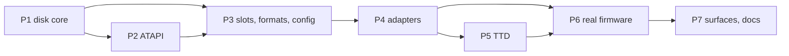

# IDE hard disks and ATAPI CD-ROM — one scope, implementation plan

| | |
|---|---|
| **Date** | 2026-09-28 |
| **Branch** | `ide-atapi` (from `master` 0d168b4b: media manager M1-M5 and NeoGS merged); on master since 2026-09-29 (`f5fc5f05`, merged in `c69486ab`) |
| **Closes** | IDE design rollout 1 (R1-1 … R1-8), storage manager M6, ZX-Evo E6 (NemoIDE) and E7 (ATAPI), the IDE part of PLAN #13a (Profi) |
| **Designs (not repeated here)** | [IDE design](../2026-09-21-profi/2026-09-25-ide-hdd-design.md) (disk core §6, media §7, ATAPI §7.5, adapters §3-§4, §9, tests §12); [integration-ide-cd.md](../2026-09-28-storage-manager/integration-ide-cd.md) (slots); [tdd-storage-sd-ide-cd.md](../2026-09-15-atm-baseconf-highres-ports/tdd-storage-sd-ide-cd.md) §3-§4 (ZX-Evo NemoIDE latch, ERS CD boot); [integration-ttd-snapshots.md](../2026-09-28-storage-manager/integration-ttd-snapshots.md) (TTD rule) |

## 1. What the user gets

- Every Spectrum IDE board in one implementation: **Profi**, **Nemo** (Pentagon), **Nemo-A8**,
  **ZX-Evo NemoIDE**, **SMUC** (Scorpion), **ATM Turbo 2+**.
- On each channel a master and a slave. A unit is a **hard disk** (an image file or a PC folder) or
  an **ATAPI CD-ROM** (an ISO).
- Disk images: raw (`.img`, `.hdd`, `.ima`), `.hdf` (RS-IDE), `.hdi` (Xpeccy), fixed `.vhd`; CDs:
  `.iso`. A folder is a FAT16 volume below 2 GB (FAT32 on request).
- The units are media slots: `ide0.master`, `ide0.slave`. The same `media` verbs, media panel, WebAPI,
  CLI, MCP, Lua and Python as floppies, tapes and SD cards ([media.md](../../features/media.md)).
- TTD records through disk activity (a write is a replay barrier) instead of stopping.

## 2. Decisions that update the designs

The designs were written before the media manager and the TTD rule of 2026-09-28. Where they
disagree, this table wins; the designs get a pointer.

| # | Decision | Replaces |
|---|---|---|
| D1 | **The media manager owns the media.** `AtaDevice::Attach(IBlockDevice&, DriveConfig)` is non-owning; the unit slot (`IMediaSlot`) attaches the manager's medium | IDE design §6.1 `unique_ptr` |
| D2 | **One slot per unit** (`ide<n>.master` / `.slave`), kind from the unit's configured device type: `disk` → `Block` (not removable: insert / eject while paused), `cdrom` → `Optical` (removable, swap delay 3 s, "medium changed" unit attention) | integration-ide-cd §2 (unchanged, restated) |
| D3 | **Automation is the media verbs.** No `hdd` / `cd` verbs. Diagnostics (task file, latches) come as a device state report (`state ide`, one source for every surface, like the GS / Covox reports) | IDE design §8.2 |
| D4 | **TTD: blob + barrier.** `PeripheralId::AtaChannel = 17` (16 is reserved for TSConf, PLAN #41) holds the channel, both units and the adapter latches (POD). A guest write (ATA WRITE, a sector through the data register) is a replay barrier through `MediaManager::NoteWrite`, at most one per unit per frame. Reads need nothing: TTD v1 records at port level, and the media set is fixed while recording | IDE design §10.0 "the first command ends the recording" |
| D5 | **Image writes: `WriteThrough` by default** (UnrealSpeccy behavior), folders `Session`, `HDnRO=1` → `ReadOnly` → ABRT. An ISO is always read-only | IDE design §6.4 (unchanged) |
| D6 | **Formats live in the media format registry** (`Block` and `Optical` kinds): raw, HDF, HDI, fixed VHD, ISO; `NativeGeometry()` from their headers | IDE design §7.2 file layout under `io/hdd/storage/` |
| D7 | **Code layout**: `core/src/emulator/io/ide/` (`ata/`, `adapters/`), image formats in `core/src/emulator/io/storage/` next to `RawImage`. The UnrealSpeccy skeleton `io/hdd/` and the five `ide_*` latch bytes in `EmulatorState` are deleted | IDE design §5 file layout |
| D8 | **Board per model, from `[HDD] Scheme`**, validated against the machine; the shipped configs are corrected (all say `NEMO-DIVIDE` today, unparsed) | IDE design §8.1 |
| D9 | **Legacy `[HDD]` keys** (`Image0/1`, `HD0RO/1RO`, `CD0/1`, `CHS0/1`, `LBA0/1`) are read by `MediaConfig` into the media set and `<slot>.device` / `<slot>.chs`; the IDE code parses no ini itself | integration-ide-cd §3 (restated) |

### 2.1 Board per shipped model (D8)

| Config folder | `Scheme` | Why |
|---|---|---|
| `profi` | `PROFI` | built into the board |
| `atm3` (ZX-Evo) | `NEMO-DIVIDE` | NemoIDE is built into ZX-Evo, with the Evo latch (tdd-storage §3.2) |
| `atm710` | `ATM` | ATM Turbo 2+ has its IDE on board |
| `scorpion`, `profscorp` | `NONE` | SMUC is an add-on card: with it fitted the ProfROM boot takes its NVRAM / RTC / IDE path, and the shipped boot is pinned without it (the SMUC stub was "absent by default" for that reason). `Scheme=SMUC` fits it |
| `pentagon128k`, `pentagon512k` | `NEMO` | the usual Pentagon card (UnrealSpeccy default family) |
| `spectrum48`, `spectrum128`, `spectrum2`, `spectrum2a`, `spectrum3`, `zx-diagnostics` | `NONE` | no IDE board on these machines out of the box |
| `ts-conf` | `NEMO-DIVIDE` (since 2026-09-29) | the TSConf FPGA has the same NemoIDE with the nemo-divide latch triggers as BaseConf (`zports.v:256-273, 336-341, 766-783`); no CD drive. The model is not creatable yet: the decoder hook-up, the DMA calls and the optional CPU stall come with PLAN #41 phase 6 (TSConf technical-design §3.11) |

A machine with a scheme has the slots even when no disk is attached: the ports then read `#FF`
(empty channel), as on real hardware. Both units are hard disks unless the config says `CD0=1` /
`CD1=1` (or the unit's configured image is an `.iso`): an empty CD drive on the bus changes what
firmware does at boot (the ERS probes it), so no machine ships with one.

## 3. Phases

Each phase ends green (full build, zero warnings, all tests). Tests are named after the file under test.

| Phase | Content | Tests |
|---|---|---|
| **P1 Disk core** | `ataregisters.h`; `AtaDevice` (register / transfer engine, POD state); `AtaDisk` (IDE design §6.3 command set, IDENTIFY §6.6, CHS / LBA28 / LBA48 §6.7, SRST, diagnostics, multiple, write-protect ABRT); `AtaChannel` (§6.2 bus rules, INTRQ, reset) | L1 `atadevice_test`, `atachannel_test` over `MemoryDisk` |
| **P2 ATAPI** | `AtapiCdrom` (signature, `#A1`, `#A0` packet protocol, pico-spec SCSI list §7.5.1, sense, UNIT ATTENTION on disc change), 2048-byte blocks through `IBlockDevice` (four 512-byte sectors) | `atapicdrom_test` over a synthetic ISO; mixed channel |
| **P3 Slots + formats + config** | `IdeUnitSlot` (D1, D2); `IsoImage`, `HdfImage`, `HdiImage`, `VhdImage` in the registry (D6); `[HDD]` → media set + device type + geometry (D9); `Core` owns the channel; the skeleton deleted (D7) | L3 format tests; slot tests (insert / eject / disc swap raises unit attention); `mediaconfig_test` |
| **P4 Adapters** | `IdeLatch` helpers (fixed, mirror, toggle, Evo); `IdeAdapterProfi`, `IdeAdapterNemo` (Nemo, Nemo-A8, Evo options), `IdeAdapterSmuc` (replaces the Scorpion stub, keeps `SMUCNvram`), `IdeAdapterAtm` (+ INTRQ bit); decoder arms, gates, `PortTag::StorageIde`; scheme validation; config fixes (§2.1) | L2 truth tables per board + the 65 536-port collision sweep per machine; word order `#ABCD` ↔ image `CD AB` |
| **P5 TTD** | `AtaChannel` as `TTDSerializable` (id 17), registered by every decoder with a scheme; write barriers (D4); contract test | L4: blob round trip mid-transfer; a write adds one barrier per frame; recording survives an IDE boot |
| **P6 Real firmware** | Profi SYS ROM HDD boot (R1) and no-drive exit (R2); ERS "HDD boot" (R8) and "CD boot" (R9) on ZX-Evo; NedoOS from a Nemo HDD image and from a **folder** (R5); ProfROM + SMUC probe with the real core (R4) | L5 |
| **P7 Surfaces, docs** | `state ide` report on CLI / WebAPI + OpenAPI / MCP / Lua / Python; Qt media panel shows the units (already generic) and the activity LED; `media.md`, recipes, IDE design pointers, PLAN / TODO | L7 smoke; report parity tests |

Later, not in this scope: HDF 8-bit-halved images beyond reading, DivIDE (needs its paging and
automap), TSConf IDE decoder and DMA hook-ups (PLAN #41 phase 6; the scheme and `IdeAdapter::DmaReadWord` / `DmaWriteWord` are ready), IDE TTD v2 media versions (media history H1-H5), the differential
harness against other emulators (IDE design §12.6).

## 4. Order and dependencies

## 5. As built (2026-09-28)

| Topic | As built |
|---|---|
| Disk core | `core/src/emulator/io/ide/ata/`: `AtaDevice` (register file, data engine, SRST, INTRQ, `AtaDeviceState` with no padding - checked by `has_unique_object_representations`), `AtaDisk` (IDE design §6.3 set incl. multiple and LBA48; the address registers point at the next sector), `AtapiCdrom` (the pico-spec packet list, byte-count limit splitting, sense, unit attention once per disc change; status 0 after a reset), `AtaChannel` (§6.2 rules; a diagnostic runs on both units) |
| Board | one `IdeAdapter` (`io/ide/ideadapter.*`) with the decode of every scheme (NEMO, NEMO-A8, NEMO-DIVIDE with the ZX-Evo latch table, ATM + the `#7FFD`-class status read with INTRQ, SMUC, PROFI, DIVIDE) instead of a class per board; latches in a POD `IdeAdapterState`. The base `PortDecoder` owns it and calls it before the model's rules (`TryIdePortIn/Out`, UnrealSpeccy `io.cpp` order); `IdeGate()` gives it the TR-DOS ports / Profi EXT mode. SMUC's window stays in the Scorpion decoder, which hands `#xxBE` to the adapter and resets the units on `#FFBA` bit 0 |
| Machine | `IdeController` (`io/ide/idecontroller.*`) replaces the UnrealSpeccy `HDD` skeleton in `Core`: the scheme (validated against the model), two units from `CDn`, `CHSn`, and their `IdeUnitSlot`s. `Core::RefitIde()` rebuilds it from the config (tests, the TTD corpus) |
| Formats | `HddImageFormats` (`io/storage/hddimageformats.*`): probe and layout of ISO, HDF (incl. 8-bit halved), fixed VHD, HDI; `RawImage` gained a layout (offset, length, header geometry, halved). The registry opens `Optical` media (ISO) and headered disk images; `media insert auto` sends `.iso` to a CD slot and disk formats to an IDE slot before an SD slot |
| Config (D8, revised) | shipped: Profi `PROFI`, ZX-Evo `NEMO-DIVIDE`, ATM710 `ATM`, Pentagon `NEMO`, TSConf `NEMO-DIVIDE` (2026-09-29, not creatable yet), the rest `NONE`. **Scorpion and ProfScorp ship `NONE`**: SMUC is an add-on and the ProfROM boot takes another path with it fitted. **One shipped CD drive: the ZX-Evo slave** (`CD1=1`, 2026-09-29), where the ERS "D. CD boot" looks for it; the ERS boot probe then finds an ATAPI device (the ATM3 golden row was re-recorded). The other machines ship `CD1=0`. The UnrealSpeccy boilerplate `Image0=wc.img`, `CHS0=1572/16/63` is gone |
| TTD (D4) | `PeripheralId::AtaChannel = 17` (`debugger/ttd/ide/ttdatachannel.*`): the selected unit, both `AtaDeviceState`s, the adapter latches; registered by `TimeTravelManager` for any machine whose board is enabled. Writes are barriers through the slot's `NoteWrite`. The ATM710 golden run was re-recorded (its ROM reads the `#7FFD` class, now the board's status) |
| Report and UI | `DeviceState::Ide()` on every surface; the Qt status bar HDD LED blinks on block transfers (an atomic host-side counter, `IdeController::Activity()`) and its tooltip lists the units from the media manager (thread-safe) |
| Review fixes (2026-09-28) | the write-protect switch is an atomic flag (no re-attach while the machine runs); a swap waits only for a half-moved block (`IdeUnitSlot::IsBusy`); an ISO image makes a CD unit even with `CDn=0`; SMUC `#D8BE` stays the latch when `#FFBA` D7 is set and D0 = 0 resets (IDE design Q3, from ProfROM 4.01); DivIDE decodes `(low & #E3) = #A3`; ATAPI: REQUEST SENSE reports a pending unit attention, GET EVENT STATUS passes it, READ(12) is capped at 4 GiB, DEVICE RESET keeps nIEN; Profi geometry from the ProfiHiDD header; `device=cdrom|disk` on insert |
| TSConf (2026-09-29) | `ts-conf` ships `NEMO-DIVIDE` (D8). For the TSConf DMA devices #3 (IDE to RAM) and #B (RAM to IDE; bit 3 of the device code = RAM to device) `IdeAdapter` has `DmaReadWord()` / `DmaWriteWord(uint16_t)`: one whole 16-bit word from / to the data register (CS0 register 0), past the Z80 half-word latches: the Z80 read / write pairs stay (their triggers move only on Z80 port accesses, `zports.v:784-808`), and a DMA read loads the read latch with the word's high byte, as every IDE bus cycle loads `iderdreg` (`zports.v:849-854`) (`common/dma.v:98, 441-445`; in `common/ide.v` the DMA request overrides the Z80 address and chip selects); no board: a read gets #FFFF. The TSConf decoder and DMA engine call them in PLAN #41 phase 6 |

Tests: `atadisk_test`, `atachannel_test`, `atapicdrom_test`, `ideadapter_test` (every scheme), `idecontroller_test` (slots, formats per unit, machines through their own decoders, port maps not shadowed), `hddimageformats_test`, `ttdatachannel_test`, `devicestate_test` (IDE report), `zxevo_ers_test` (ERS HDD boot, ERS CD boot on the real ROM), `profi_hdd_test` (SYS ROM loader, skipped without `profi_mainrom_standart.rom`), `scorpionsmuc_test` (ProfROM IDENTIFY through SMUC), `mediamanager_test` / `mediacontrol_test` (auto slot choice), the golden and TTD corpus tests.

## After rollout 1: CD audio (2026-10-02)

The drive grew from a data-only ISO reader into a full MMC CD-ROM drive with audio: discs are
`CdImage`s (ISO, CUE/BIN, CD CHD) handed over by the media slot beside the block stack; the audio
side is `CdAudioPlayer` (head on emulated time, page 0Eh, mixer output); the extra state is the
CdDrive TTD blob (id 39), so the `AtaChannel` blob (id 17) is unchanged. Design and tests:
[2026-10-02-cd-audio/README.md](../2026-10-02-cd-audio/README.md).
